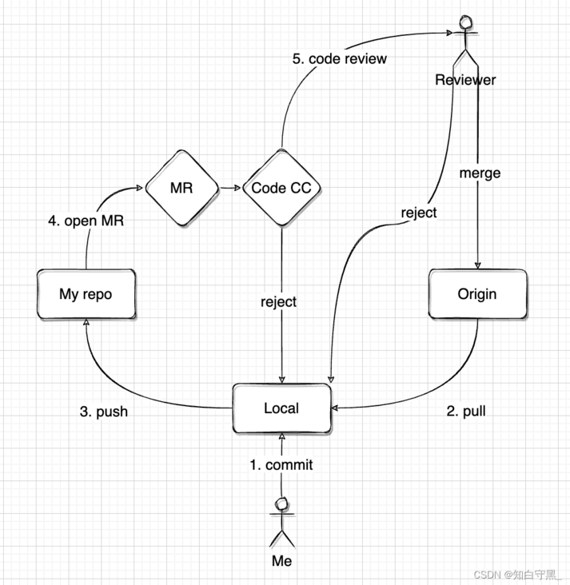

	 
     
     
     
     
     
     
     
     
     
	
<h3>
        Git 最佳实践
    </h3>

	 
     
     
     
     
     
     
     
     
     

# 1	团队开发

# 1.1	Git 提交和发布流程

#### 流程图

 

#### 详细流程说明

1. 从项目仓库拉取（git pull）master 的最新代码到本地。
2. 提交（git commit）代码到本地仓库。
3. 将更改推送（git push）到个人远程仓库。
4. 从个人远程仓库发起代码评审。
5. 由评审员进行代码评审。
6. 评审结果不通过，评审发起者需要修改代码，回到第 2 步。
7. 评审结果通过，由评审发起者确认合并之后代码改动被合并到 master。

 

---

 
     
     
     
     
     
     
     
     
     

## 1.2	分支规范

#### 主分支

主分支分为 master 分支和 develop 分支，是所有开发活动的核心分支，所有的开发活动产生的输出最终都会反映到主分支的代码中。主分支的生命周期与整个项目的开发周期相同。

###### master 分支

1. master 分支存放的是 **随时可供在生产环境部署的稳定版本** 代码；
2. master 分支保存官方发布版本历史，通过 release tag 标识不同的发布版本；
3. 一个项目只能有一个 master 分支；
4. **仅在发布新的可供部署的代码时才更新 master 分支上的代码**；
5. 每次更新 master，都需对 master 添加指定格式的 tag，用于发布或回滚；
6. master 分支是保护分支，不可以直接 push 到 master 分支；
7. master 分支代码只能被 release 分支或 hotfix 分支合并。

###### develop 分支

1. develop 分支是保存当前最新开发成果的分支；
2. 一个项目只能有一个 develop 分支；
3. develop 分支衍生出各个 feature 分支；
4. develop 分支是保护分支，不可直接 push 到远程仓库 develop 分支；
5. develop 分支不能与 master 分支直接交互。

 

##### 辅助分支

辅助分支分为 **feature分支**、**release 分支**、**hotfix 分支**， 辅助分支主要用于组织软件新功能的并行开发、简化新功能开发代码的跟踪、辅助完成版本发布工作以及对生产代码的缺陷进行紧急修复工作。这些分支与主分支不同，通常只会在有限的时间范围内存在。

###### feature 分支

feature 分支的父类分支是 develop 分支，feature 分支是 develop 分支的 **功能分支**。

使用规划：

1. 命名规则：`feature/*`
2. 以功能为单位从 develop 拉一个 feature 分支；
3. 每个 feature 分支的粒度要尽量小，以利于快速迭代和避免冲突；
4. 当其中一个 feature 分支完成后，它会合并回 develop 分支；
5. 当一个功能因为各种原因停止开发，这个分支直接废弃，不影响 develop 分支；
6. feature 分支代码可以保存在开发者自己的代码库中而不强制提交到主代码库里；
7. feature 分支只与 develop 分支交互，不能与 master 分支直接交互。

总之，如果多人同时开发，需要分割成几个小功能，每个人都需要从 develop 中拉出一个粒度尽量小的 feature 分支，确保能尽早 merge 回d evelop 分支，否则冲突解决起来就没完没了。同时，当一个功能停止开发，这个分支将直接废弃，不影响 develop 分支。

###### release 分支

release 分支是为发布新的产品版本而设计的。在这个分支上的代码允许做小的缺陷修正、准备发布版本所需的各项说明信息（版本号、发布时间、编译时间等）。通过在 release 分支上进行这些工作可以让 develop 分支空闲出来以接受新的 feature 分支上的代码提交，进入新的软件开发迭代周期。

使用规范：

1. 命名规则：`release/*`，“*”以本次发布的版本号为标识；
2. release 分支主要用来为发布新版的测试、修复做准备；
3. 当需要为发布新版做准备时，从 develop 衍生出一个 release 分支；
4. release分支可以从develop分支上指定commit派生出
5. release分支测试通过后，合并到master分支并且给master标记一个版本号
6. release分支一旦建立就将独立，不可再从其他分支pull代码
7. 必须合并回develop分支和master分支

当develop分支上的代码已经包含了所有即将发布的版本中所计划包含的软件功能，并且已通过所有测试时，我们就可以考虑准备创建release分支了。而所有在当前即将发布的版本之外的业务需求一定要确保不能混到release分支之内（避免由此引入一些不可控的系统缺陷）。

成功的派生了release分支，并被赋予版本号之后，develop分支就可以为“下一个版本”服务了。所谓的“下一个版本”是在当前即将发布的版本之后发布的版本。版本号的命名可以依据项目定义的版本号命名规则进行。

#### hotfix 分支

使用规范：

- 命名规则：`hotfix/*`
- hotfix分支用来快速给已发布产品修复bug或微调功能
- 只能从master分支指定tag版本衍生出来
- 一旦完成修复bug，必须合并回master分支和develop分支
- master被合并后，应该被标记一个新的版本号
- hotfix分支一旦建立就将独立，不可再从其他分支pull代码

 

---

 
     
     
     
     
     
     
     
     
     

# 2	Git Commit 最佳实践

---

 
     
     
     
     
     
     
     
     
     

# 附录

##### 参考资料

- [1	团队开发中的 Git 提交和发布流程](#1	团队开发中的 Git 提交和发布流程)——[参考资料名](地址) 发布于 【0000/00/00】；

 