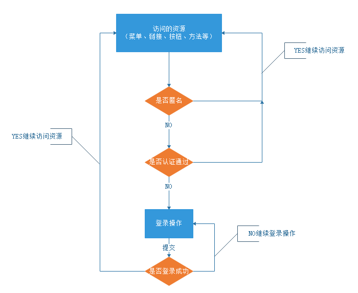

# 1	概述

## 1.1	框架开发简介

#####  什么是框架（Framework）

 一个框架是一个 **可复用的设计构件**，它 **规定了应用的体系结构，阐明了整个设计、协作构件之间的依赖关系、责任分配和控制流程**，**具体表现为一组抽象类以及其实例之间协作的方法**，它 **为构件复用提供了上下文（Context）关系**。

框架是 **实现了某应用领域通用功能** 的 **底层服务**。使用框架的编程人员可以在一个通用功能已经实现的基础上开始具体的系统开发。

框架提供了所有应用期望的默认行为的类集合。框架具体的应用是 **通过重写子类[^1.1-1]或组装对象**  ，以此 **支持应用专用的行为**。

 通俗的说，框架是应用的半成品，提供了一些常用的工具类和一些基础通用化的组件，开发人员可以在此基础上更便捷的完成各自特有的系统。

 

##### 为什么使用框架开发

复制系统的开发对程序员的要求极高。但是，如果采用成熟，稳健的框架，那么一些基础的通用工作[^1.1-2]都可以交给框架处理，程序员只需要集中精力完成系统的业务逻辑设计，降低了开发难度。

   从程序员角度看，使用框架最显著的好处是 **重用**：

1. **框架能重用代码**。因此从已有构件库中建立应用变得非常容易，因为构件都采用框架统一定义的接口，从而使构件间的通信简单。
2. **框架能重用设计**。它提供可重用的抽象算法及高层设计，并能将大系统分解成更小的构件，而且能描述构件间的内部接口。这些标准接口使在已有的构件基础上通过组装建立各种各样的系统成为可能。只要符合接口定义，新的构件就能插入框架中，构件设计者就能重用构架的设计。
3. **框架还能重用分析**。所有的人员若按照框架的思想来分析事物，那么就能将它划分为同样的构件，采用相似的解决方法，从而使采用同一框架的分析人员之间能进行沟通。

从业务[^1.1-3]的角度来看：

1. 首先，框架的是为了企业的业务发展和战略规划而服务的，它服从于企业的愿景；
2. 其次，框架最重要的目标是提高企业的竞争能力，包括降低成本、提高质量、改善客户满意程度，控制进度等方面。
3. 最后，框架实现这一目标的方式是进行有效的知识积累。软件开发是一种知识活动，因此知识的聚集和积累是至关重要的。框架能够采用一种结构化的方式对某个特定的业务领域进行描述，也就是将这个领域相关的技术以代码、文档、模型等方式固化下来。

 

##### 合理的使用框架可以带来的好处

1. 重用代码大大增加，软件生产效率和质量也得到了提高；
2. 代码结构的规范化，降低程序员之间沟通以及日后维护的成本； 
3. 知识的积累，可以让经验丰富的开发人员去设计框架和领域构件，而不必限于低层编程； 
4. 软件设计人员可以专注于对领域的了解，使需求分析更充分； 
5. 允许采用快速原型技术； 有利于在一个项目内多人协同工作； 
6. 大粒度的重用使得平均开发费用降低，开发速度加快，开发人员减少，维护费用降低，而参数化框架使得适应性、灵活性增强。

 

##### 框架与类库的区别

1. 结构上，框架内部是高内聚的，而类库内部则是相对松散的。
2. 框架封装了处理流程的控制逻辑，而类库几乎不涉及任何处理流程和控制逻辑。
3. 框架具有IOC（控制反转）能力，而类库没有。
4. 框架专注于特定领域，而类库却是更通用的。
5. 框架通常建立在众多类库的基础之上，而类库一般不会依赖于某框架。

 

#####  框架分类

考虑到面向的领域，以及实现编码实现，我们可以将将框架至少分为三类：

- **基础类库**：主要包含多数项目所需要的类库。（开发人员将其作为一个类库使用，可以简化一些常用的算法逻辑。）
- **基础框架**：该框架应该整合或者实现 J2EE 开发所需要的常用功能。（此框架可以为各类WEB项目开发提供基础支持。）
- **平台框架**：针对于某种特定领域，实现特定领域所需要的常用功能。(这个框架需要实现具体领域的业务的逻辑。并且应该支持各类扩展)

 

----

[^1.1-1]: 该子类属于框架的默认行为。
[^1.1-2]: 比如，事物处理，安全性，数据流控制等。
[^1.1-3]: 一种技术，最终都是为业务发展而服务的。

 
     
     
     
     
     
     
     
     
     

## 1.2	Spring 框架体系

##### 什么是 Spring

Spring 是一个轻量级 Java 开发框架，，目的是为了解决企业级应用开发的业务逻辑层和其他各层的耦合问题。它是一个分层的 JavaSE/JavaEE full-stack（一站式）轻量级开源框架，为开发 Java 应用程序提供 **全面** 的基础架构支持。Spring 负责基础架构，因此 Java 开发者可以专注于应用程序的开发。

从配置到安全，从 Web 应用程序到大数据 —— 无论您的应用程序需要什么样的基础设施，都有一个 Spring 项目可以帮助您构建它。从小处着手，只使用您需要的东西 —— Spring 在设计上是模块化的。

Spring 让每个人都可以更快、更轻松、更安全地编写 Java。Spring 对速度、简单性和生产力的关注使其成为世界上最受欢迎的 Java 框架。

 

##### 官网

https://spring.io

 

##### 为什么使用 Spring

###### Spring is everywhere

Spring’s flexible libraries are trusted by developers all over the world. Spring delivers delightful experiences to millions of end-users every day—whether that’s streaming TV, online shopping, or countless other innovative solutions. Spring also has contributions from all the big names in tech, including Alibaba, Amazon, Google, Microsoft, and more.

###### Spring is flexible

Spring’s flexible and comprehensive set of extensions and third-party libraries let developers build almost any application imaginable. At its core, Spring Framework’s Inversion of Control (IoC) and Dependency Injection (DI) features provide the foundation for a wide-ranging set of features and functionality. Whether you’re building secure, reactive, cloud-based microservices for the web, or complex streaming data flows for the enterprise, Spring has the tools to help.

###### Spring is productive

Spring Boot transforms how you approach Java programming tasks, radically streamlining your experience. Spring Boot combines necessities such as an application context and an auto-configured, embedded web server to make microservice development a cinch. To go even faster, you can combine Spring Boot with Spring Cloud’s rich set of supporting libraries, servers, patterns, and templates, to safely deploy entire microservices-based architectures into the cloud, in record time.

###### Spring is fast

Our engineers care deeply about performance. With Spring, you’ll notice fast startup, fast shutdown, and optimized execution, by default. Increasingly, Spring projects also support the reactive (nonblocking) programming model for even greater efficiency. Developer productivity is Spring’s superpower. Spring Boot helps developers build applications with ease and with far less toil than other competing paradigms. Embedded web servers, auto-configuration, and “fat jars” help you get started quickly, and innovations like LiveReload in Spring DevTools mean developers can iterate faster than ever before. You can even start a new Spring project in seconds, with the Spring Initializr at start.spring.io.

###### Spring is secure

Spring has a proven track record of dealing with security issues quickly and responsibly. The Spring committers work with security professionals to patch and test any reported vulnerabilities. Third-party dependencies are also monitored closely, and regular updates are issued to help keep your data and applications as safe as possible. In addition, Spring Security makes it easier for you to integrate with industry-standard security schemes and deliver trustworthy solutions that are secure by default.

###### Spring is supportive

The Spring community is enormous, global, diverse, and spans folks of all ages and capabilities, from complete beginners to seasoned pros. No matter where you are on your journey, you can find the support and resources you need to get you to the next level: quickstarts, guides & tutorials, videos, meetups, support, or even formal training and certification.

 

##### Spring 能做什么

1. **Microservices** ：Quickly deliver production‑grade features with independently evolvable microservices.
2. **Reactive** ：Spring's asynchronous, nonblocking architecture means you can get more from your computing resources.
3. **Cloud** ：Your code, any cloud—we’ve got you covered. Connect and scale your services, whatever your platform.
4. **Web apps** ：Frameworks for fast, secure, and responsive web applications connected to any data store.
5. **Serverless** ：The ultimate flexibility. Scale up on demand and scale to zero when there’s no demand.
6. **Event Driven** ：Integrate with your enterprise. React to business events. Act on your streaming data in realtime.
7. **Batch** ：Automated tasks. Offline processing of data at a time to suit you.

 

---

 
     
     
     
     
     
     
     
     
     

## 1.3	持久层框架

---

 
     
     
     
     
     
     
     
     
     

## 1.4	安全框架

##### 权限

权限管理，一般指根据系统设置的安全策略或者安全规则，用户可以访问而且只能访问自己被授权的资源。权限管理几乎出现在任何系统里面。 

权限管理在系统中一般分为：

- **访问权限**：一般表示用户能进行的操作，或者能够访问的资源。例如：给张三赋予“店铺主管”角色，“店铺主管”具有“查询员工”、“添加员工”、“修改员工”和“删除员工”权限。此时张三能够进入系统，则可以进行这些操作。

- **数据权限**：一般表示某些数据是否属于该用户，或者属于该用户可以操作范围。例如：张三是"店铺主管"角色，他可以看他手下客服人员所有的服务的买家订单信息，他的手下只能看自己负责的订单信息。

 

##### 认证

身份认证，即判断一个用户是否为合法用户的处理过程。例如：密码登录，手机短信验证、三方授权等。

###### 认证流程

###### 与认证相关的三个对象

- **Subject**：主体，主体可以是访问系统的用户、程序等，只要进行认证都称为主体；
- **Principal**：身份信息是主体（subject）进行身份认证的标识，标识必须具有唯一性，如用户名、手机号、邮箱地址等，一个主体可以有多个身份，但是必须有一个主身份（Primary Principal）。
- **credential**：凭证信息，即只有主体自己知道的安全信息，如密码、证书等。

 

##### 授权

授权，即访问控制，控制谁能访问哪些资源。主体进行身份认证后，系统会为其分配对应的权限，当访问资源时，会校验其是否有访问此资源的权限。

###### 授权相关的四个对象

- user（用户对象）：当前操作的用户、程序。
- resource（资源对象）：当前被访问的对象。
- role （角色对象）：一组 "权限操作许可权" 的集合。
- permission（权限对象）：权限操作许可权

###### 授权流程

 

##### Java 开发中，常用的安全框架

1. Shiro
2. Spring Security

 

---

 
     
     
     
     
     
     
     
     
     

