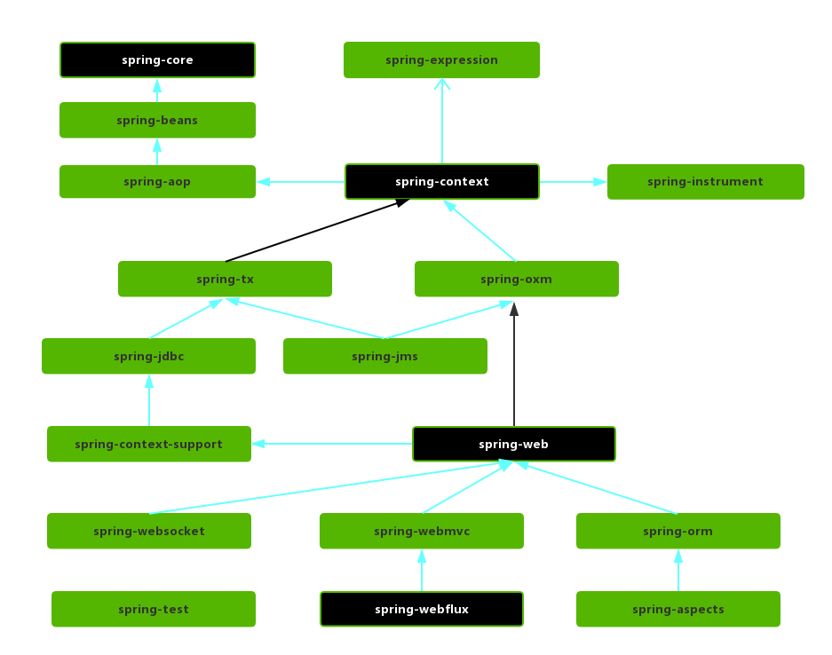
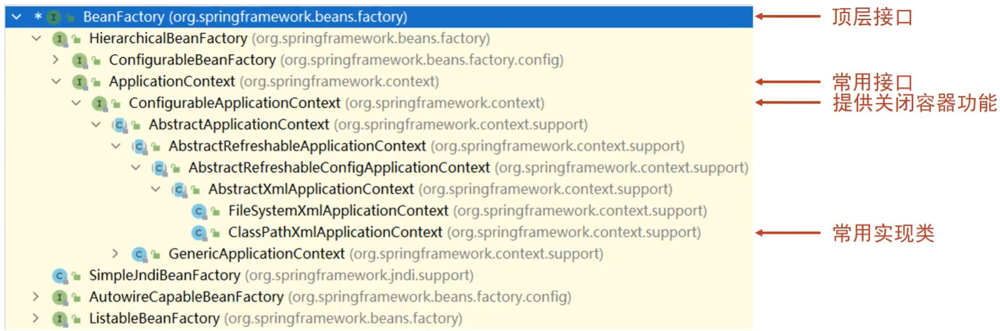
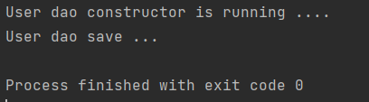
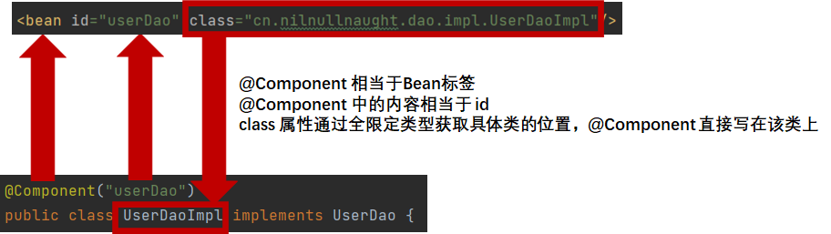

# 2	Spring Framework

## 2.1	Spring Framework 简介

##### 什么是 Spring Framework 

Spring 是分层的 Java SE/EE 一站式轻量级开源框架，以 IoC（Inverse of Control，控制反转）和 AOP（Aspect Oriented Programming，面向切面编程）为核心。

<br>

##### 控制反转与依赖注入[^2.1-1]

**控制反转IoC（Inversion of Control），是一种设计思想，DI（依赖注入）是实现IoC的一种方法**，也有人认为 DI 只是 IoC 的另一种说法。

###### 传统对象调用方式的缺点

当某个 Java 对象（调用者）需要调用另一个 Java 对象（被调用者，即被依赖对象）时，在传统模式下，调用者通常会采用 `new 被调用者` 的代码方式来创建对象。这种方式会导致调用者与被调用者之间的 **耦合性增加**，不利于后期项目的升级和维护。

###### 控制反转

使用对象时，由主动 `new` 产生对象转换为由 **外部** 提供对象，此过程中 **对象创建控制权由程序转移到外部**，此思想称为控制反转。

###### IoC 容器

IoC 容器负责对象的创建、初始化等一系列工作，将它们装配在一起，配置它们并管理它们的完整生命周期。被创建或被管理的对象在 IoC 容器中统称为 **bean**。

###### 依赖注入

当 IoC 容器中创建好对象后，程序仍不能直接运行，还需要确定对象与对象之间的关系。在容器中建立 bean 与 bean 之间的依赖关系的整个过程，称为依赖注入。

在依赖注入中，您不必创建对象，但必须描述如何创建它们。您不是直接在代码中将组件和服务连 接在一起，而是描述配置文件中哪些组件需要哪些服务。由 IoC 容器将它们装配在一起。

<br>

##### Spring FlameWork 中的控制反转与依赖注入

**IoC 是 Spring FlameWork 的核心内容**，Spring FlameWork 使用多种方式完美的实现了 IoC，可以使用 XML 配置，也可以使用注解。

###### Spring 的控制反转

**在使用 Spring 框架之后，对象的实例不再由调用者来创建，而是由 Spring 容器来创建**，Spring 容器会负责控制程序之间的关系，而不是由调用者的程序代码直接控制。这样，**控制权由应用代码转移到了 Spring 容器**，控制权发生了反转，这就是 Spring 的控制反转。

###### Spring IoC 容器与依赖注入

Spring FlameWork 的核心是 **Spring IoC 容器**。容器创建对象，将它们装配在一起，配置它们并管理它们的完整生命周期。

Spring 容器使用依赖注入来管理组成应用程序的组件。**容器通过读取提供的配置元数据[^2.1-2]来接收对象进行实例化，配置和组装的指令**。配置元数据可以通过 XML，Java 注解或 Java 代码提供。


<br>

##### Spring Framework 5 架构


###### 核心容器（Core Containe）

核心容器提供了 Spring Framework 的基本功能，是其它模块建立的基础，由 Spring-Core、Spring-beans、Spring-Context、Spring-Context-Support 和  组成。其中 Spring-beans 和 Spring-Core 是 Spring Framework 的核心模块。

- **Spring-Core**：提供了框架的基本组成部分，包括控制翻转和依赖注入功能。

- **Spring-beans**：提供了 beanFactory，beanFactory 接口是 Spring 框架中的核心接口，它是工厂模式的经典实现。beanFactory 使用控制翻转对应用程序的配置和依赖性规范与实际的应用程序代码进行了分离。但 beanFactory 容器实例化后并不会自动创建实例化bean，只有当 bean 被使用的时候 beanFactory 容器才会对该 bean 进行实例化与依赖关系的装配。

- **Spring-Context**：Spring-Context 模块构架于 Spring-Core 和 Spring-beans 模块之上，提供了一个框架式的对象访问方式，**是访问定义和配置的任意对象的媒介**，向 Spring Framework 提供上下文信息。

  它扩展了 beanFactory，为其增加了 bean 生命周期控制、框架事件体系以及资源加载透明化等功能。ApplicationContext 是该模块的核心接口，它是 beanFactory 的子类，与 beanFactory 不同的是 ApplicationContext 容器实例化后会自动对所有的单实例 bean 进行实例化与依赖关系的装配，使之处于待用状态。

- **Spring-Context-Support**：用于将常见的第三方库集成到 Spring 应用程序上下文中。该模块提供了高速缓存、任务调度、邮件访问等支持。

- **Spring-Expression**：该模块是对 JSP2.1 规范中规定的统一表达式语言 EL 的扩展模块，它提供了强大的表达式语言去支持运行时查询和操作运行中的对象，该语言支持设置和获取属性值、属性分配、方法调用、访问数组、集合和索引器的内容、逻辑和算术运算、变量命名以及从 Spring 的 IoC 容器中以名称检索对象。它还支持列表投影、选择以及常用的列表聚合。

  它的语法类似于传统的 EL，但提供了额外的功能。最出色的要数函数调用和简单字符串的模板函数。这种语言的特性是基于 Spring 产品的需求而设计， 他可以非常方便地同 Spring IoC 进行交互。

###### AOP 和设备支持

 在 Spring 中， 以动态代理技术为基础，允许定义方法拦截器和切入点，将代码按照功能进行分离，以便干净地解耦。AOP 由 Spring-AOP、 Spring-Aspects 和 Spring-Instrument 三个模块组成。

- **Spring-AOP**：Spring 的另一个核心模块，提供了一个符合 AOP 要求的面向切面的编程实现。通过配置管理特性，Spring AOP 模块直接将面向切面的编程功能 , 集成到了 Spring 框架中。所以，可以很容易地使 Spring 框架管理任何支持 AOP 的对象。

  Spring-AOP 模块为基于 Spring 的应用程序中的对象提供了 **事务管理服务**。通过使用 Spring-AOP，不用依赖组件，就可以将声明性事务管理集成到应用程序中。

- **Spring-Aspects**：提供了与 AspectJ 的集成功能，AspectJ 是一个功能强大且成熟的 AOP 框架。

- **Spring-Instrument**：是 AOP 的一个支援模块， 提供了类植入（Instrumentation）支持和类加载器的实现，可以在特定的应用服务器中使用。主要作用是在 JVM 启用时， 生成一个代理类， 程序员通过代理类在运行时修改类的字节， 从而改变一个类的功能， 实现 AOP 的功能。

###### 数据访问与集成（Data Access/Integration）

由 Spring-JDBC、Spring-ORM、Spring-OXM、Spring-JMS 和 Spring-Transactions 组成。

- **Spring-JDBC**：提供了一个 JDBC 的抽象层，消除了烦琐的 JDBC 编码和数据库厂商特有的错误代码解析， 用于简化 JDBC。提供了 JDBC 模板方式、 关系数据库对象化方式、 SimpleJdbc 方式以及事务管理来简化 JDBC 编程， 主要实现类是 `JdbcTemplate`、 `SimpleJdbcTemplate` 以及 `NamedParameterJdbcTemplate`。
- **Spring-ORM**：是 ORM 框架支持模块， 主要集成了 Hibernate、 Java Persistence API（JPA）和 Java Data Objects （JDO）。用于资源管理、 数据访问对象（DAO）的实现和事务策略。
- **Spring-OXM**：主要提供一个抽象层以支撑 OXM。OXM 是 Object-to-XML-Mapping 的缩写， 它是一个 O/M-mapper， 将 java 对象映射成 XML 数据， 或者将 XML 数据映射成 java 对象， 例如： JAXB，Castor，XMLbeans，JiBX 和 XStream 等。
- **Spring-JMS**：指 Java 消息传递服务（Java Messaging Service），包含用于生产和使用消息的能。自 Spring4.1 以后，提供了与 Spring-Messaging 模块的集成。
- **Spring-Transactions**：事务模块，支持用于实现特殊接口和所有 POJO 类的编程和声明式事务管理。

###### Web

由 Spring-Web、Spring-WebMVC、Spring-WebSocket 和 Spring-WebFlux 组成。

- **Spring-Web**：Spring-Web 模块为 Spring 提供了最基础的 Web 支持，主要建立在核心容器之上，通过 Servlet 或者 Listeners 来初始化 IoC 容器以及 Web 应用上下文，自动装载 WebApplicationContext。Web 模块还简化了处理多部分请求以及将请求参数绑定到域对象的工作，也包含一些其他与 web 相关的支持，如：Struts 集成类、文件上传支持的类、FIlter 类和大量辅助工具类。

- **Spring-WebMVC**：也称为 Web-Servlet 模块，包含用于 Web 应用程序的 Spring MVC 和 REST Web Service 实现。

  Spring MVC 框架提供了领域模型代码和 Web 表单之间的清晰分离，并与 Spring Framework 的所有其他功能集成，是一个全功能的构建 Web 应用程序的 MVC 实现。

  通过 MVC 框架策略接口，MVC 框架变成为高度可配置的。

- **Spring-WebSocket**：实现双工异步通讯协议，实现了 WebSocket  和 SocketJS，提供 Socket 通信和 Web 端的推送功能。

- **Spring-WebFlux**：是一个非堵塞函数式的 Reactive Web 框架，可以用来建立异步的，非阻塞，事件驱动的服务，并且扩展性非常好。

###### 消息（Messaging）

- **Spring-Messaging**：Spring-Messaging 的主要职责是为 Spring 框架集成一些基础的报文传送应用。

###### Test

- **Spring-Test**：Spring-Test 模块主要为测试提供支持的，毕竟在不需要发布（程序）到应用服务器或者连接到其他企业设施的情况下能够执行一些集成测试或者其他测试对于任何企业都是非常重要的。

###### spring 各模块依赖关系



<br>

---

[^2.1-1]: 依赖注入与控制反转的含义相同，只不过这两个称呼是从两个角度描述的同一个概念。
[^2.1-2]: 该元数据可以通过 XML，Java 注解或 Java 代码提供。

[^2.1-3]: 即 Spring Data，https://Spring.io/projects/Spring-data。

<div STYLE="page-break-after: always;"><br>
    <br>
    <br>
    <br>
    <br>
    <br>
    <br>
    <br>
    <br>
    <br></div>
## 2.2	Spring IoC/DI

### 2.2.1	核心容器

#####  容器类层次结构

1. 在 IDEA 中双击 shift，输入 BeanFactory：


2. 点击进入 `BeanFactory` 类，按下 `ctrl + h`，就能查看到如下结构的层次关系：



从图中可以看出，容器类是从无到有根据需要一层层叠加上来的，属于装饰器模式。

<br>

##### BeanFactory

`BeanFactory` 是 IoC 容器的顶层接口。

###### 使用 BeanFactory 创建容器时的加载方式

`BeanFactory` 是延迟加载，只有在获取 bean 对象的时候才会去创建。

###### 例——使用 BeanFactory 创建 IoC 容器

```java
public class Application {
    public static void main(String[] args) {
        var resources = new ClassPathResource("applicationContext.xml");
        var xmlBeanFactory = new XmlBeanFactory(resources);
        var userDao = xmlBeanFactory.getBean(UserDao.class);
        userDao.save();
    }
}
```

<br>

##### ApplicationContext

`ApplicationContext` 接口是 Spring 容器的核心接口，`ApplicationContext` 接口提供基础的 bean 操作相关方法，通过其他接口扩展其功能。

###### 使用 ApplicationContext 创建容器的两种方式

| 使用类                            | 说明                                                         | 示例                                                         |
| --------------------------------- | ------------------------------------------------------------ | ------------------------------------------------------------ |
| `ClassPathXmlApplicationContext`  | 从 resource 目录下查找配置文件。                             | var ctx = new ClassPathXmlApplicationContext("applicationContext.xml"); |
| `FileSystemXmlApplicationContext` | 从项目路径下开始查找 `applicationContext.xml` 配置文件（该方式耦合度较高，不推荐使用）。 | var ctx = new FileSystemXmlApplicationContext("具体的配置文件路径"); |

###### 使用 ApplicationContext 创建容器时的加载方式

初始化时立即创建 bean 对象。

`ApplicationContext` 要想成为延迟加载，只需要按照如下方式进行配置：

```xml
<?xml version="1.0" encoding="UTF-8"?>
<beans xmlns="http://www.springframework.org/schema/beans"
       xmlns:xsi="http://www.w3.org/2001/XMLSchema-instance"
       xsi:schemaLocation="
            http://www.springframework.org/schema/beans http://www.springframework.org/schema/beans/spring-beans.xsd">
    <bean id="bookDao" class="com.itheima.dao.impl.BookDaoImpl"  lazy-init="true"/>
</beans>
```

<br>

##### 获取 Bean 的三种方式

###### 方式一

```java
var bean = (Bean) ctx.getBean("bean");
```

这种方式每次获取的时候都需要进行强制类型转换。

###### 方式二

```
var bean = (Bean) ctx.getBean("bean",Bean.class);
```

不需要强制类型转换，但是增加了一个参数。

###### 方式三

```
var bean = (Bean) ctx.getBean(Bean.class);
```

按类型注入。必须要确保 IoC 容器中该类型对应的 bean 对象只有一个。

<br>

##### 例

###### 第一步

创建 Maven 项目。

###### 第二步

在 pom.xml 文件中添加 Spring 的依赖 jar 包：

```xml
<dependencies>
	<dependency>
    	<groupId>org.springframework</groupId>
    	<artifactId>spring-context</artifactId>
    	<version>5.1.20.RELEASE</version>
	</dependency>
    
    <dependency>
        <groupId>junit</groupId>
        <artifactId>junit</artifactId>
        <version>4.12</version>
        <scope>test</scope>
    </dependency>
</dependencies>
```

###### 第三步

创建 UserService、UserServiceImpl、UserDao 和 UserDaoImpl：

```java
public interface UserService {
public void save();
}
```

```java
public class UserServiceImpl implements UserService {
    
    //不使用 new 的方式创建的 dao 对象
	private UserDao userDao;
    
    //提供对应的set方法
    public void setUserDao(UserDao userDao) {
        this.userDao = userDao;
    }

	public void save() {
		System.out.println("User service save ...");
		userDao.save();
	}

}
```

```Java
public interface UserDao {
	public void save();
}
```

```java
public class UserDaoImpl implements UserDao {
	public void save() {
		System.out.println("User dao save ...");
	}
}
```

###### 第四步

在 src/resources 目录下添加 Spring 配置文件 applicationContext.xml，并完成 bean 的配置。

```xml
<?xml version="1.0" encoding="UTF-8"?>
<beans xmlns="http://www.Springframework.org/schema/beans"
		xmlns:xsi="http://www.w3.org/2001/XMLSchema-instance"
		xsi:schemaLocation="http://www.Springframework.org/schema/beans
http://www.Springframework.org/schema/beans/Spring-beans.xsd">

	<!-- bean 标签标示配置 bean
		 id 属性标示 bean 起名字
		 class 属性表示给 bean 定义类型
	-->
	<bean id="userDao" class="cn.nilnullnaught.dao.impl.UserDaoImpl"/>
    
	<bean id="UserService" class="cn.nilnullnaught.service.impl.UserServiceImpl">
        <!--配置server与dao的关系-->
        <!--property 标签表示配置当前 bean 的属性
			注意，name 和 ref 中的两个 userDao 的含义是不一样的
        	name 属性表示配置哪一个具体的属性，对应 UserServiceImpl 中的 setUserDao()
        	ref 属性表示参照哪一个 bean，对应配置的 UserDao Bean
		-->
        <property name="userDao" ref="userDao"/>
    </bean>
</beans>
```

###### 第五步

使用 Spring 提供的接口完成 IoC 容器的创建，创建 Application 类，编写 main 方法，从容器中获取对象进行方法调用：

```java
public class Application {
	public static void main(String[] args) {
		//获取IOC容器
		var applicationContext = new ClassPathXmlApplicationContext("applicationContext.xml");
		
		var userDao = (UserDao) ctx.getbean("userDao");
		userDao.save();
		var userService = (UserService) ctx.getbean("userService");
		userService.save();
	}
}
```

<br>

##### 📌注意

applicationContext.xml 文件的文件名可以随意（比如 beans.xml），但是文件名最好能与程序之间存在联系，并通过目录结构进行分类。

<br>

##### Spring IoC 对于解耦的直观体现

修改程序调用的对象不再需要修改代码，只需要修改 applicationContext.xml 中 bean 的属性即可。

<br>

---

<div STYLE="page-break-after: always;"><br>
    <br>
    <br>
    <br>
    <br>
    <br>
    <br>
    <br>
    <br>
    <br></div>

### 2.2.2	bean 的配置与属性

##### bean 基础配置

```xml
<beans xmlns="http://www.Springframework.org/schema/beans"
		xmlns:xsi="http://www.w3.org/2001/XMLSchema-instance"
		xsi:schemaLocation="http://www.Springframework.org/schema/beans
		http://www.Springframework.org/schema/beans/Spring-beans.xsd">
	<bean/>
</beans>
```

<br>

##### bean 的基本属性


###### id

bean 的 id，使用容器可以通过 id 获取对应的 bean。定义 bean 时，id 属性在同一个上下文中（配置文件）不能重复。

###### class

bean 的类型，即配置的 bean 的全路径类名。不能是接口。

###### name

如果没有配置 id，那么 name 就是默认标识符，如果配置 id，又配置了 name，那么 name 是别名。

```xml
<bean id="user" class="cn.nilnullnaught.pojo.User" name="user userI userII"></bean>
```

<br>

##### bean 的作用域

###### sigleton

Singleton 是单例类型，当一个 bean 的作用域为 Singleton，那么 Spring IoC 容器中只会存在一个共享的 bean 实例，并且所有对 bean 的请求，只要 id 与该 bean 定义相匹配，则只会返回 bean 的同一实例。这个实例在创建 IoC 容器时自动被创建，不论是否被使用都一直存在。

注意，Singleton 作用域是 Spring 中的缺省作用域。

要在XML中将bean定义成singleton，可以这样配置：

```xml
<bean id="ServiceImpl" class="cn.nilnullnaught.service.ServiceImpl" scope="singleton">
```

测试：

```java
@Test
public void test03(){
    ApplicationContext context = new ClassPathXmlApplicationContext("applicationContext.xml");
    User user = (User) context.getbean("user");
    User user2 = (User) context.getbean("user");
    System.out.println(user==user2);
}
```

###### prototype

Prototype 作用域的 bean 会在每次对该 bean 请求时[^2.2.2-1]创建一个新的 bean 实例。

Prototype 是原型类型，它在我们创建容器的时候并没有实例化，而是当需要 bean 的时候才会去创建一个对象，且每次获取到的对象都不是同一个对象。即每次调用 `getbean()` 时，相当于执行了一次 `new` 操作。

根据经验，对有状态的 bean 应该使用 prototype 作用域，而对无状态的 bean 则应该使用 singleton 作用域[^2.2.2-2]。

在 XML 中将 bean 定义成 prototype，可以这样配置：

```xml
<bean id="account" class="com.foo.DefaultAccount" scope="prototype"/>  
	或
<bean id="account" class="com.foo.DefaultAccount" singleton="false"/>
```

###### Request

Request 表示在一次 HTTP 请求中，一个 bean 定义对应一个实例；即每个 HTTP 请求都会有各自的 bean 实例，它们依据某个bean定义创建而成。

该作用域仅在基于 web 的 Spring ApplicationContext 情形下有效。

参考以下方式定义：

```xml
 <bean id="loginAction" class=cn.csdn.LoginAction" scope="request"/>
```

针对每次HTTP请求，Spring 容器会根据 loginAction bean 的定义创建一个全新的 LoginAction bean 实例，且该 loginAction bean 实例仅在当前 HTTP request内 有效，因此可以根据需要放心的更改所建实例的内部状态，而其他请求中根据 loginAction bean 定义创建的实例，将不会看到这些特定于某个请求的状态变化。当处理请求结束，request 作用域的 bean 实例将被销毁。

###### Session

Session 表示在一个 HTTP Session 中，一个 bean 定义对应一个实例。

该作用域仅在基于 web 的 Spring ApplicationContext 情形下有效。

参考以下方式定义：

```xml
 <bean id="userPreferences" class="com.foo.UserPreferences" scope="session"/>
```

针对某个 HTTP Session，Spring 容器会根据 userPreferences bean 定义创建一个全新的 userPreferences bean 实例，且该 userPreferences bean 仅在当前 HTTP Session 内有效。与 request 作用域一样，可以根据需要放心的更改所创建实例的内部状态，而别的 HTTP Session 中根据 userPreferences 创建的实例，将不会看到这些特定于某个 HTTP Session 的状态变化。当 HTTP Session 最终被废弃的时候，在该 HTTP Session 作用域内的 bean 也会被废弃掉。

<br>

---

[^2.2.2-1]: 将其注入到另一个 bean 中，或者以程序的方式调用容器的 getbean() 方法。
[^2.2.2-2]: 有状态就是有数据存储功能。有状态对象（Stateful bean），就是有实例变量的对象 ，可以保存数据，是非线程安全的。在不同方法调用间不保留任何状态。无状态就是一次操作，不能保存数据。无状态对象（Stateless bean），就是没有实例变量的对象，不能保存数据，是不变类，是线程安全的。

<div STYLE="page-break-after: always;"><br>
    <br>
    <br>
    <br>
    <br>
    <br>
    <br>
    <br>
    <br>
    <br></div>

### 2.2.3	bean 的实例化

##### Spring 实例化 bean 的三种方式

bean 本质上就是对象，Spring Framework 通过反射机制创建对象。在 Spring 中，实例化 bean 有三种方式，分别是：**构造方法**、**静态工厂** 以及 **实例工厂**。

<br>

##### 构造方法实例化

###### 例

1. 准备 `UserDao` 和 `UserDaoImpl`：

```java
public interface UserDao  {

    public void save();
}
```

```java
public class UserDaoImpl implements UserDao {
    
    // 注意，构造方法是 private 的，无法通过 new 从外部访问
    // 无参构造
    private UserDaoImpl() {
        System.out.println("User dao constructor is running ....");
    }
    
    // 有参构造
    private UserDaoImpl(int i) {
        System.out.println("User dao constructor is running ...."+i);
    }

    public void save() {
        System.out.println("User dao save ...");
    }
}
```

2. 将类配置到 Spring 容器

```xml
<?xml version="1.0" encoding="UTF-8"?>
<beans xmlns="http://www.springframework.org/schema/beans"
       xmlns:xsi="http://www.w3.org/2001/XMLSchema-instance"
       xsi:schemaLocation="http://www.springframework.org/schema/beans http://www.springframework.org/schema/beans/spring-beans.xsd">
	<bean id="UserDao" class="cn.nilnullnaught.dao.impl.UserDaoImpl"/>
</beans>
```

3. 编写运行程序

```java
public class Application {
    public static void main(String[] args) {
        var ctx = new ClassPathXmlApplicationContext("applicationContext.xml");
        var userDao = (UserDao) ctx.getBean("UserDao");
        userDao.save();
    }
}
```

4. 运行结果：



对象通过 UserDaoImpl 中的无参构造创建。

###### 📌注意

如果类中只有有参构造，没有无参构造，则会报错。因为通过构造方法实例化时，是默认采用无参构造的，因为 Java 中每一个类都会默认提供一个无参构造函数。但是如果创建了有参构造，那么 Java 将不会再提供无参构造。

<br>

##### 静态工厂实例化

###### 例

1. 准备 `UserDao` 和 `UserDaoImpl`：

```java
public interface UserDao  {
    public void save();
}
```

```java
public class UserDaoImpl implements UserDao  {
    public void save() {
        System.out.println("order dao save ...");
    }
}
```

2. 创建一个工厂类 `UserDaoFactory` 并提供一个静态方法：

```java
//静态工厂创建对象
public class UserDaoFactory {
    public static UserDao getUserDao(){
        return new UserDaoImpl();
    }
}
```

3. 在 applicaitonContext.xml 中进行配置：

```xml
<?xml version="1.0" encoding="UTF-8"?>
<beans xmlns="http://www.springframework.org/schema/beans"
       xmlns:xsi="http://www.w3.org/2001/XMLSchema-instance"
       xsi:schemaLocation="http://www.springframework.org/schema/beans http://www.springframework.org/schema/beans/spring-beans.xsd">
	<bean id="userDao" class="cn.nilnullnaught.factory.UserDaoFactory" factory-method="getUserDao"/>
</beans>
```

4. 编写运行程序

```java
public class Applicaition {
    public static void main(String[] args) {
        var ctx = new ClassPathXmlApplicationContext("applicationContext.xml");
        var userDao = (UserDao) ctx.getBean("userDao");
        userDao.save();
    }
}
```

###### 使用静态工厂创建对象的意义

在工厂的静态方法中，除了创建对象还可以进行其他的一些业务操作。这种方式一般是用来兼容早期的老系统，了解即可。

<br>

##### 实例工厂与 FactoryBean

###### 例

1. 准备 `UserDao` 和 `UserDaoImpl`：

```java
public interface UserDao {
    public void save();
}

public class UserDaoImpl implements UserDao {

    public void save() {
        System.out.println("user dao save ...");
    }
}
```

2. 创建一个工厂类 `UserDaoFactory` 并提供一个普通方法

```java
public class UserDaoFactory {
    
    //注意，此处不是静态方法。
    public UserDao getUserDao(){
        return new UserDaoImpl();
    }
}
```

3. 在 applicaitonContext.xml 中进行配置：

```xml
<?xml version="1.0" encoding="UTF-8"?>
<beans xmlns="http://www.springframework.org/schema/beans"
       xmlns:xsi="http://www.w3.org/2001/XMLSchema-instance"
       xsi:schemaLocation="http://www.springframework.org/schema/beans http://www.springframework.org/schema/beans/spring-beans.xsd">
	<bean id="userFactory" class="cn.nilnullnaught.factory.UserDaoFactory"/>
	<bean id="userDao" factory-method="getUserDao" factory-bean="userFactory"/>
</beans>
```

4. 编写运行程序

```java
public class AppForInstanceUser {
    public static void main(String[] args) {
        var ctx = new ClassPathXmlApplicationContext("applicationContext.xml");
        var userDao = (UserDao) ctx.getBean("userDao");
        userDao.save();
    }
}
```

###### 使用 FactoryBean 简化实例工厂

1. 创建 `UserDaoFactoryBean` 类，实现 `FactoryBean` 接口，重写接口的方法：

```java
public class UserDaoFactoryBean implements FactoryBean<UserDao> {
    
    //代替原始实例工厂中创建对象的方法
    @Override
    public UserDao getObject() throws Exception {
        return new UserDaoImpl();
    }
    //返回所创建类的Class对象
    @Override
    public Class<?> getObjectType() {
        return UserDao.class;
    }
}
```

2. 在 Spring 的配置文件中进行配置

```xml
<?xml version="1.0" encoding="UTF-8"?>
<beans xmlns="http://www.springframework.org/schema/beans"
       xmlns:xsi="http://www.w3.org/2001/XMLSchema-instance"
       xsi:schemaLocation="http://www.springframework.org/schema/beans http://www.springframework.org/schema/beans/spring-beans.xsd">
	<bean id="userDao" class="cn.nilnullnaught.factory.UserDaoFactoryBean"/>
</beans>
```

3. 不需要修改运行程序，直接运行。

###### FactoryBean 接口的三个方法

1. `getObject()`：被重写后，在方法中进行对象的创建并返回。
2. `getObjectType()`：被重写后，主要返回的是被创建类的 Class 对象。
3. `isSingleton()`：一般不需要重写，其作用是设置对象是否为单例，默认为 `true`。如果不以单例模式创建对象，则需要重写该方法：

```java
public class UserDaoFactoryBean implements FactoryBean<UserDao> {
    
    ...
    
    // 重写 isSingleton()
    @Override
	public boolean isSingleton() {
    	return false;
	}
}
```

###### 使用实例工厂与 FactoryBean 创建对象的用途

Spring 在整合其他框架时，通过该方式进行。

<br>

---

<div STYLE="page-break-after: always;"><br>
    <br>
    <br>
    <br>
    <br>
    <br>
    <br>
    <br>
    <br>
    <br></div>

### 2.2.4	bean 的生命周期

##### 什么时 bean 的生命周期

指 bean 对象从创建到销毁的整体过程。

<br>

##### bean 的生命周期控制

指在 bean 创建后到销毁前之间进行一些操作。具体的控制有两个阶段:

* bean 创建之后，添加内容，比如用来初始化需要用到资源。
* bean 销毁之前，添加内容，比如用来释放用到的资源。

<br>

##### 使用 Bean 的属性 init-method 与 destroy-method 进行生命周期控制

###### 例

1. 创建 `UserDao`、`UserDaoImpl`、`UserService` 和 `UserServiceImpl`：

```java
public interface UserDao {
    public void save();
}
```

```java
public class UserDaoImpl implements UserDao {
    public void save() {
        System.out.println("User dao save ...");
    }
    
	//表示 bean 初始化对应的操作
    public void init(){
        System.out.println("init...");
    }
    //表示 bean 销毁前对应的操作
    public void destory(){
        System.out.println("destory...");
    }
}
```

```java
public interface UserService {
    public void save();
}
```

```java
public class UserServiceImpl implements UserService{
    private UserDao userDao;

    public void setUserDao(UserDao UserDao) {
        this.userDao = userDao;
    }

    public void save() {
        System.out.println("User service save ...");
        userDao.save();
    }
}
```

2. 编写配置文件：

```xml
<?xml version="1.0" encoding="UTF-8"?>
<beans xmlns="http://www.springframework.org/schema/beans"
       xmlns:xsi="http://www.w3.org/2001/XMLSchema-instance"
       xsi:schemaLocation="http://www.springframework.org/schema/beans http://www.springframework.org/schema/beans/spring-beans.xsd">
    <bean id="userDao" class="cn.nilnullnaught.dao.impl.UserDaoImpl" init-method="init" destroy-method="destory"/>
</beans>
```

3. 编写 `Application` 运行类，加载 Spring 的 IoC 容器，并从中获取对应的 bean 对象：

```java
public class Application {
    public static void main( String[] args ) {
        var ctx = new ClassPathXmlApplicationContext("applicationContext.xml");
        var userDao = (UserDao) ctx.getBean("userDao");
        userDao.save();
    }
}
```

###### destroy() 未被执行

上述代码运行后，`init()` 执行了，但是 `destroy()` 却未执行。

这是因为 Spring 的 IoC 容器是运行在 JVM 中，运行 `main()` 后，JVM 启动，Spring 加载配置文件生成 IoC 容器，从容器获取 bean 对象，然后调用方法执行。`main()` 执行完后，JVM 退出，这个时候 **IoC 容器中的 bean 还没有来得及销毁就已经结束了**，所以没有调用对应的 `destroy()`。

解决方案一：将 `Application` 中的 `ApplicationContext` 更换成 `ClassPathXmlApplicationContext`，并调用 `close()`：

```java
public class Application {
    public static void main( String[] args ) {
        var ctx = new ClassPathXmlApplicationContext("applicationContext.xml");
        var userDao = (UserDao) ctx.getBean("userDao");
        userDao.save();
        ctx.close();
    }
}
```

解决方案二：注册钩子关闭容器在容器未关闭之前，提前设置好回调函数，让 JVM 在退出之前回调此函数来关闭容器。将 `Application` 中的 `ApplicationContext` 更换成 `ClassPathXmlApplicationContext`，并调用 `registerShutdownHook()`。

```
public class Application {
    public static void main( String[] args ) {
        var ctx = new ClassPathXmlApplicationContext("applicationContext.xml");
        var userDao = (UserDao) ctx.getBean("userDao");
        userDao.save();
        ctx.registerShutdownHook();
    }
}
```

注意，`close()` 是在调用的时候关闭，`registerShutdownHook()` 是在 JVM 退出前调用关闭。

<br>

##### 使用 Spring 提供的生命周期控制接口进行生命周期控制

Spring 提供了两个接口来完成生命周期的控制，好处是可以不用再进行配置 `init-method` 和 `destroy-method`。

###### 例

修改 UserServiceImpl 类，添加接口 `InitializingBean` 与 `DisposableBean` 并实现接口的方法 `afterPropertiesSet` 和 `destroy`：

```java
public class UserServiceImpl implements UserService, InitializingBean, DisposableBean {
    private UserkDao userDao;
    public void setUserDao(UserDao userDao) {
        this.userDao = userDao;
    }
    public void save() {
        System.out.println("user service save ...");
        userDao.save(); 
    }
    public void destroy() throws Exception {
        System.out.println("service destroy");
    }
    public void afterPropertiesSet() throws Exception {
        System.out.println("service init");
    }
}
```

<br>

---

<div STYLE="page-break-after: always;"><br>
    <br>
    <br>
    <br>
    <br>
    <br>
    <br>
    <br>
    <br>
    <br></div>
### 2.2.5	Spring 的依赖注入

##### 依赖注入的本质

依赖注入描述了在容器中建立 bean 与 bean 之间的依赖关系的过程。本质上是向一个类中传递数据，向一个类中传递数据的方式有两种：普通方法（setter 方法）与构造方法，传递的数据类型可以是基本数据类型也可以是引用类型数据。

<br>

##### Spring 依赖注入的方式

通常，依赖注入可以通过三种方式完成： 

1. 构造函数注入 
2. setter 注入 
3. 接口注入

但是，在 Spring Framework 中，仅使用构造函数和 setter 注入。

<br>

##### 依赖注入的方式选择

1. 建议使用 setter 注入；
2. 使用第三方技术根据情况选择注入方式。

<br>

##### setter 注入

在 bean 中定义引用类型属性，并提供可访问的 setter 方法。在配置中使用 `<property/>` 标签注入数据。

###### 前提条件

1. 被注入的属性 , 必须有 setter 方法 ；
2. set 方法的方法名格式为：`setAttribute()`；
3. 如果属性是 boolean 类型 , 使用 is 替代 set，如：`isAttribute()`;

###### 注入基本数据类型

使用 `value` 属性注入基本数据类型，Spring 在注入的时候会自动转换数据类型。

```xml
<bean ...>
	<property name="" value=""/>
</bean>
```

###### 注入引用数据类型

使用 `ref` 属性注入引用类型对象

```xml
<bean ...>
	<property name="" ref=""/>
</bean>
```

###### 例

1. 创建 pojo 类 `Address` 与 `Student`：

```java
public class Address {
 
     private String address;
 
     public String getAddress() {
         return address;
    }
 
     public void setAddress(String address) {
         this.address = address;
    }
 }
```

```java
package cn.nilnullnaught.pojo;
 
 import java.util.List;
 import java.util.Map;
 import java.util.Properties;
 import java.util.Set;
 
 public class Student {
 
     private String name;
     private Address address;
     private String[] books;
     private List<String> hobbys;
     private Map<String,String> card;
     private Set<String> games;
     private String wife;
     private Properties info;
 
     public void setName(String name) {
         this.name = name;
    }
 
     public void setAddress(Address address) {
         this.address = address;
    }
 
     public void setBooks(String[] books) {
         this.books = books;
    }
 
     public void setHobbys(List<String> hobbys) {
         this.hobbys = hobbys;
    }
 
     public void setCard(Map<String, String> card) {
         this.card = card;
    }
 
     public void setGames(Set<String> games) {
         this.games = games;
    }
 
     public void setWife(String wife) {
         this.wife = wife;
    }
 
     public void setInfo(Properties info) {
         this.info = info;
    }
 
     public void show(){
         System.out.println("name="+ name
                 + ",address="+ address.getAddress()
                 + ",books="
        );
         for (String book:books){
             System.out.print("<<"+book+">>\t");
        }
         System.out.println("\n爱好:"+hobbys);
 
         System.out.println("card:"+card);
 
         System.out.println("games:"+games);
 
         System.out.println("wife:"+wife);
 
         System.out.println("info:"+info);
 
    }
 }
```

2. 注入

```xml
<bean id="addr" class="cn.nilnullnaught.pojo.Address">
	<property name="address" value="重庆"/>
</bean>

<bean id="student" class="cn.nilnullnaught.pojo.Student">
	<!-- 注入常量类型 -->
    <property name="name" value="小明"/>
    
    <!-- 注入对象类型 -->
    <property name="address" ref="addr"/><!--注意，这里的值是一个引用，ref -->
    
	<!-- 注入数组类型 -->
    <property name="books">
        <array>
            <value>西游记</value>
            <value>红楼梦</value>
            <value>水浒传</value>
        </array>
    </property>
    
    <!-- 注入 List 类型 -->
    <property name="hobbys">
		<list>
		    <value>听歌</value>
		    <value>看电影</value>
		    <value>爬山</value>
		</list>
	</property>
    
    <!-- 注入 Map 类型 -->
    <property name="card">
    	<map>
    		<entry key="中国邮政" value="456456456465456"/>
    		<entry key="建设" value="1456682255511"/>
    	</map>
	</property>
    
    <!-- 注入 Set 类型 -->
	<property name="games">
	     <set>
	         <value>LOL</value>
	         <value>BOB</value>
	         <value>COC</value>
	     </set>
	</property>
    
    <!-- 注入 null 值 -->
    <property name="wife"><null/></property>
    
    <!-- 注入 Property 类型 -->
    <property name="info">
		<props>
     	    <prop key="学号">20190604</prop>
     	    <prop key="性别">男</prop>
     	    <prop key="姓名">小明</prop>
     	</props>
     </property>
</bean>
```

###### P 命名空间注入 

P 即 properties，使用该注入方式需要在头文件中加入约束文件 `xmlns:p="http://www.springframework.org/schema/p"`

```xml
<!--P命名空间 , 属性依然要设置 set 方法-->
<bean id="user" class="cn.nilnullnaught.pojo.User" p:name="赵大"/>
```

```java
public class User {
    
    private String name;
    
    public void setName(String name) {
        this.name = name;
	}
}
```

<br>

##### 构造器注入

通过标签 `<constructor-arg>` 注入

* name 属性对应的值为构造方法中，形参的参数名，必须要保持一致；

* ref 属性指向的是 Spring 的 IoC 容器中其他 bean 对象。

###### 前提条件

- 类中必须定义了符合条件的构造方法

###### 基本数据类型

```xml
<bean ...>
	<constructor-arg name="" index="" type="" value=""/>
</bean>
```

###### 引用数据类型

```xml
<bean ...>
	<constructor-arg name="" index="" type="" ref=""/>
</bean>
```

###### 例

###### 第一步

创建 `UserDao`，`userService`：

```java
public interface EntityDao {
    public void save();
}
```

```java
public class EntityDaoImpl implements EntityDao {
    public void save() {
        System.out.println("entiyu dao save ...");
    }
}
```

```java
public interface UserDao {
    public void save();
}
```

```java
public class UserDaoImpl implements UserDao {
    
    private String databaseName;
    private int connectionNum;
    
    // 注入基本数据类型
    public UserDaoImpl(String databaseName, int connectionNum) {
        this.databaseName = databaseName;
        this.connectionNum = connectionNum;
    }
    
    public void save() {
        System.out.println("user dao save ...");
    }
}
```

```java
public interface UserService {
    public void save();
}
```

```java
public class UserServiceImpl implements UserService{
    
	private EntityDao entityDao;
    private UserDao userDao;
    
    // 注入引用数据类型
    public UserServiceImpl(UserDao userDao,EntityDao entityDao) {
        this.userDao = userDao;
        this.entityDao = entityDao;
    }

    public void save() {
        System.out.println("user service save ...");
        userDao.save();
    }
}
```

###### 第二步

编写配置文件：

```xml
<?xml version="1.0" encoding="UTF-8"?>
<beans xmlns="http://www.springframework.org/schema/beans"
       xmlns:xsi="http://www.w3.org/2001/XMLSchema-instance"
       xsi:schemaLocation="http://www.springframework.org/schema/beans http://www.springframework.org/schema/beans/spring-beans.xsd">
    
    <!-- 注入基本数据类型 -->
    <bean id="userDao" class="cn.nilnullnaught.dao.impl.UserDaoImpl">
        <constructor-arg name="databaseName" value="mysql"/>
        <constructor-arg name="connectionNum" value="10"/>
    </bean>

    
    <!-- 注入引用数据类型 -->
    <bean id="userDao" class="cn.nilnullnaught.dao.impl.UserDaoImpl"/>
    <bean id="entityDao" class="cn.nilnullnaught.dao.impl.EntityDaoImpl"/>
    <bean id="userService" class="cn.nilnullnaught.service.impl.UserServiceImpl">
        <!-- <contructor-arg> 的配置顺序可以不符合构造方法中形参顺序 -->
        <constructor-arg name="entityDao" ref="entityDao"/>
        <constructor-arg name="userDao" ref="userDao"/>
    </bean>
    
</beans>
```

###### 第三步

```java
public class Application {
    public static void main( String[] args ) {
        var ctx = new ClassPathXmlApplicationContext("applicationContext.xml");
        var userService = (UserService) ctx.getBean("userService");
        userService.save();
    }
}
```

###### C 命名空间注入 

C 即 Constructor，使用该注入方式需要在头文件中加入约束文件 `xmlns:p="http://www.springframework.org/schema/c"`

```
<!-属性依然要设置set方法-->
<bean id="user" class="cn.nilnullnaught.pojo.User" c:name="赵大" c:age="18"/>
```

```java
//注意,该类必需要有参构造器，否则会报错
public class User {
	
	private String name;
	
	public User (String name){
        this.name = name;
	}
	
    public void setName(String name) {
        this.name = name;
	}
}
```

<br>

---

<div STYLE="page-break-after: always;"><br>
    <br>
    <br>
    <br>
    <br>
    <br>
    <br>
    <br>
    <br>
    <br></div>

### 2.2.6	自动配置

##### 什么是依赖自动装配

IoC 容器根据 bean 所依赖的资源在容器中自动查找并注入到 bean 中的过程称为自动装配。

自动装配只能用于引用类型依赖注入，**不能对简单类型进行操作**。

自动装配优先级低于 setter 注入与构造器注入，同时出现时自动装配配置失效。

<br>

##### 自动装配方式

1. 按类型（byType）：使用按类型装配时必须保证容器中相同类型的 bean 唯一，推荐使用；
2. 按名称（byName）：装配时必须保证容器中具有指定名称的 bean，即根据需要注入的变量的变量名进行注入（如 private UserDao userDao，userDao 就是一个 Name）。因变量名与配置耦合，不推荐使用；
3. 按构造方法。

<br>

##### 例

###### 第一步

```java
public interface UserDao {
    public void save();
}
```

```java
public class UserDaoImpl implements UserDao {
    
    private String databaseName;
    private int connectionNum;
    
    public void save() {
        System.out.println("user dao save ...");
    }
}
```

```java
public interface UserService {
    public void save();
}
```

```java
public class UserServiceImpl implements UserService{
    private UserDao userDao;

    public void setUserDao(UserDao userDao) {
        this.userDao = userDao;
    }

    public void save() {
        System.out.println("user service save ...");
        userDao.save();
    }
}
```

###### 第二步

配置文件：

```xml
<?xml version="1.0" encoding="UTF-8"?>
<beans xmlns="http://www.springframework.org/schema/beans"
       xmlns:xsi="http://www.w3.org/2001/XMLSchema-instance"
       xsi:schemaLocation="http://www.springframework.org/schema/beans http://www.springframework.org/schema/beans/spring-beans.xsd">
    
    <bean class="cn.nilnullnaught.dao.impl.UserDaoImpl"/>
    <!--autowire属性：开启自动装配，通常使用按类型装配-->
    <bean id="userService" class="cn.nilnullnaught.service.impl.UserServiceImpl" autowire="byType"/>
    
</beans>
```

###### 第三步

```java
public class Application {
    public static void main( String[] args ) {
        var ctx = new ClassPathXmlApplicationContext("applicationContext.xml");
        var userService = (UserService) ctx.getBean("userService");
        userService.save();
    }
}
```

###### 注意事项

1. 需要注入属性的类中对应属性的 setter 方法不能省略；

2. 被注入的对象必须要被 Spring 的 IoC 容器管理；

3. 按照类型在 Spring 的 IoC 容器中如果找到多个对象，会报 `NoUniqueBeanDefinitionException`。一个类型在 IoC 中有多个对象，还想要注入成功，这个时候就需要按照名称注入，配置方式为：

   ```xml
   <?xml version="1.0" encoding="UTF-8"?>
   <beans xmlns="http://www.springframework.org/schema/beans"
          xmlns:xsi="http://www.w3.org/2001/XMLSchema-instance"
          xsi:schemaLocation="http://www.springframework.org/schema/beans http://www.springframework.org/schema/beans/spring-beans.xsd">
   
       <bean class="cn.nilnullnaught.dao.impl.UserDaoImpl"/>
       <!--  -->
       <bean id="userService" class="cn.nilnullnaught.service.impl.UserServiceImpl" autowire="byName"/>
   
   </beans>
   ```


<br>

##### 使用注解方式配置 bean 的优点

采用 XML 方式配置 bean 的时候，bean 的定义信息是和实现分离的，而采用注解的方式可以把两者合为一体，bean 的定义信息直接以注解的形式定义在实现类中，从而达到了零配置的目的。

<br>

---

<div STYLE="page-break-after: always;"><br>
    <br>
    <br>
    <br>
    <br>
    <br>
    <br>
    <br>
    <br>
    <br></div>

### 2.2.7	配置管理第三方 bean

##### 基本实现

###### 实现思路

1. 要在pom.xml添加第三方技术相关依赖；
2. 配置文件中将第三方类制作成一个 bean，让 IoC 容器进行管理；
3. 将第三方类需要的数据注入到 bean 中（以数据库连接为例，需要注入驱动、连接、用户名以及密码等相关数据）；
4. 从 IoC 容器中获取对应的 bean 对象。

###### 例——使用 Spring 的 IoC 容器来管理 Druid 连接池对象

1. pom.xml 中添加依赖：

```
<dependency>
    <groupId>com.alibaba</groupId>
    <artifactId>druid</artifactId>
    <version>1.1.16</version>
</dependency>
```

2. 在 applicationContext.xml 配置文件中添加 `DruidDataSource` 的配置：

```xml
<?xml version="1.0" encoding="UTF-8"?>
<beans xmlns="http://www.springframework.org/schema/beans"
       xmlns:xsi="http://www.w3.org/2001/XMLSchema-instance"
       xsi:schemaLocation="
            http://www.springframework.org/schema/beans
            http://www.springframework.org/schema/beans/spring-beans.xsd">
	<!--管理DruidDataSource对象-->
    <bean class="com.alibaba.druid.pool.DruidDataSource">
        <!-- 数据库驱动 -->
        <property name="driverClassName" value="com.mysql.jdbc.Driver"/>
        <!-- 数据库连接地址 -->
        <property name="url" value="jdbc:mysql://localhost:3306/spring_db"/>
        <!-- 数据库连接用户名 -->
        <property name="username" value="root"/>
        <!-- 数据库连接密码 -->
        <property name="password" value="root"/>
    </bean>
</beans>
```

3. 从 IoC 容器中获取对应的 bean 对象

```java
public class App {
    public static void main(String[] args) {
       ApplicationContext ctx = new ClassPathXmlApplicationContext("applicationContext.xml");
       DataSource dataSource = (DataSource) ctx.getBean("dataSource");
       System.out.println(dataSource);
    }
}
```

<br>

##### 第三方 bean 属性优化

###### 实现思路

将第三方 bean 需要的配置数据写入 properties 配置文件，通过 spring 来加载配置信息并使用这些信息来完成属性注入。

1. 在 resources 下创建一个 properties 文件；
2. 将配置数据写入配置文件；
3. 在 Spring 的配置文件中加载 properties 文件；
4. 使用加载到的值实现属性注入。

###### 例

1. 在 resources 下创建一个 jdbc.properties 文件，并添加对应的属性键值对：

```properties
jdbc.driver=com.mysql.jdbc.Driver
jdbc.url=jdbc:mysql://127.0.0.1:3306/spring_db
jdbc.username=root
jdbc.password=root
```

2. 在 applicationContext.xml 中开启 context 命名空间：

```xml
<?xml version="1.0" encoding="UTF-8"?>
<beans xmlns="http://www.springframework.org/schema/beans"
       xmlns:xsi="http://www.w3.org/2001/XMLSchema-instance"
       xmlns:context="http://www.springframework.org/schema/context"
       xsi:schemaLocation="
            http://www.springframework.org/schema/beans
            http://www.springframework.org/schema/beans/spring-beans.xsd
            http://www.springframework.org/schema/context
            http://www.springframework.org/schema/context/spring-context.xsd">
</beans>
```

3. 在配置文件中使用 context 命名空间下的标签来加载 properties 配置文件：

```xml
<context:property-placeholder location="jdbc.properties"/>
```

4. 使用 `${key}` 来读取配置文件中的内容并完成属性注入：

```xml
<?xml version="1.0" encoding="UTF-8"?>
<beans xmlns="http://www.springframework.org/schema/beans"
       xmlns:xsi="http://www.w3.org/2001/XMLSchema-instance"
       xmlns:context="http://www.springframework.org/schema/context"
       xsi:schemaLocation="
            http://www.springframework.org/schema/beans
            http://www.springframework.org/schema/beans/spring-beans.xsd
            http://www.springframework.org/schema/context
            http://www.springframework.org/schema/context/spring-context.xsd">
    
    <context:property-placeholder location="jdbc.properties"/>
    <bean id="dataSource" class="com.alibaba.druid.pool.DruidDataSource">
        <property name="driverClassName" value="${jdbc.driver}"/>
        <property name="url" value="${jdbc.url}"/>
        <property name="username" value="${jdbc.username}"/>
        <property name="password" value="${jdbc.password}"/>
    </bean>
</beans>
```

6. 创建 `UserDao` 和 `UserDaoImpl` 类，并在 `UserDaoImpl` 类中添加属性与对应 setter 方法：

```java
public interface UserDao {
    public void save();
}
```

```java
public class UserDaoImpl implements UserDao  {
    
    private String driverClassName;
    private String url;
    private String username;
    private String password;

    public void setDriverClassName(String driverClassName) {
        this.driverClassName = driverClassName;
    }
    
    public void setUrl(String url) {
        this.url = url;
    }
    
    public void setUsername(String username) {
        this.username = username;
    }
    
    public void setPassword(String password) {
        this.password = password;
    }

    public void test() {
        System.out.println("driverClassName" + driverClassName);
        System.out.println("url" + url);
        System.out.println("username" + username);
        System.out.println("password" + password);

    }
}
```

7. 测试

```java
public class App {
    public static void main(String[] args) throws Exception{
        var ctx = new ClassPathXmlApplicationContext("applicationContext.xml");
        var userDao = (UserDao) ctx.getBean("userDao");
        userDao.save();
    }
}
```

<br>

##### 问题——加载的配置变成了环境变量

###### 问题展示

1. 在properties中配置键值对的时候，如果 key 设置为`username`

```
username=root666
```

2. 在applicationContext.xml注入该属性

```xml
<?xml version="1.0" encoding="UTF-8"?>
<beans xmlns="http://www.springframework.org/schema/beans"
       xmlns:xsi="http://www.w3.org/2001/XMLSchema-instance"
       xmlns:context="http://www.springframework.org/schema/context"
       xsi:schemaLocation="
            http://www.springframework.org/schema/beans
            http://www.springframework.org/schema/beans/spring-beans.xsd
            http://www.springframework.org/schema/context
            http://www.springframework.org/schema/context/spring-context.xsd">
    
    <context:property-placeholder location="jdbc.properties"/>
    
    <bean id="bookDao" class="cn.nilnullnaught.dao.impl.BookDaoImpl">
        <property name="name" value="${username}"/>
    </bean>
</beans>
```

3. 运行后，在控制台打印的却不是 `root666`，而是自己电脑的用户名。

###### 出现原因

这是因为 `<context:property-placeholder/>`  标签会加载系统的环境变量，而且环境变量的值会被优先加载。

查看系统的环境变量：

```java
public static void main(String[] args) throws Exception{
    Map<String, String> env = System.getenv();
    System.out.println(env);
}
```

###### 解决方案

- 方案一：设置 `system-properties-mode` 属性为 `NEVER`，表示不加载系统属性。

```xml
<?xml version="1.0" encoding="UTF-8"?>
<beans xmlns="http://www.springframework.org/schema/beans"
       xmlns:xsi="http://www.w3.org/2001/XMLSchema-instance"
       xmlns:context="http://www.springframework.org/schema/context"
       xsi:schemaLocation="
            http://www.springframework.org/schema/beans
            http://www.springframework.org/schema/beans/spring-beans.xsd
            http://www.springframework.org/schema/context
            http://www.springframework.org/schema/context/spring-context.xsd">
    
    <context:property-placeholder location="jdbc.properties" system-properties-mode="NEVER"/>
</beans>
```

- 方案二：避免使用 `username` 等与系统变量相关的名称作为属性的 `key`。

<br>

##### 加载多个配置文件

如果同时 jdbc1.property、jdbc2.property 两个配置文件，可以以下列格式进行加载：

```xml
<?xml version="1.0" encoding="UTF-8"?>
<beans xmlns="http://www.springframework.org/schema/beans"
       xmlns:xsi="http://www.w3.org/2001/XMLSchema-instance"
       xmlns:context="http://www.springframework.org/schema/context"
       xsi:schemaLocation="
            http://www.springframework.org/schema/beans
            http://www.springframework.org/schema/beans/spring-beans.xsd
            http://www.springframework.org/schema/context
            http://www.springframework.org/schema/context/spring-context.xsd">
    <!--方式一 -->
    <context:property-placeholder location="jdbc1.properties,jdbc2.properties" system-properties-mode="NEVER"/>
    <!--方式二-->
    <context:property-placeholder location="*.properties" system-properties-mode="NEVER"/>
    <!--方式三 -->
    <context:property-placeholder location="classpath:*.properties" system-properties-mode="NEVER"/>
    <!--方式四-->
    <context:property-placeholder location="classpath*:*.properties" system-properties-mode="NEVER"/>
</beans>	
```

<br>

---

<div STYLE="page-break-after: always;"><br>
    <br>
    <br>
    <br>
    <br>
    <br>
    <br>
    <br>
    <br>
    <br></div>
## 2.3	注解开发

### 2.3.1	通过注解定义 Bean

##### 组件自动扫描注解

而 Spring2.5 引入了组件自动扫描机制。它可以在 classpath 下寻找标注了 `@Service`、`@Repository`、`@Controller`、`@Component` 注解的类
并把这些类纳入 Spring 容器中管理，它的作用和在 XML 中使用bean节点配置组件是一样的。

###### 作用域

类注解，配置在类上。

###### 具体注解

- @Service 用于标注业务层组件;
- @Repository 用于标注数据访问组件，即 DAO 组件;
- @Controller 用于标注控制层组件，如 Struts中 的 Action;
- @Component 泛指组件，当组件不要好归类时，可以使用这个注解进行标注。

实际上，通过源码可知，以上四个注解的作用全部相同。之所以提供四个注解，只是为了方便在编写类的时候能区分出这个类是属于 **表现层**、**业务层** 还是 **数据层** 。

###### 属性

**value**（默认）：定义 bean 的 id。如果未设置该属性，则按照类型来获取 bean 对象。但是会以 **当前类名首字母小写** 作为默认值，所以也可以按照名称获取，如：

```java
var userService = (UserService)ctx.getBean("userServiceImpl");
System.out.println(userService);
```

###### XML bean 节点与类注解的对应关系



###### 注意

`@Component` 注解不可以添加在接口上，因为接口是无法创建对象的。

<br>

##### \<context/> 

在 `<Beans/>` 标签中使用

###### 属性

- **component-scan**：扫描组件，Spring 将管理的 bean 视作自己的一个组件。

- **base-package**：指定 Spring 框架扫描的包路径，它会扫描指定包及其子包中的所有类上的注解。

  - 包路径越多（如 cn.nilnullanught.dao.impl），扫描的范围越小速度越快

  - 包路径越少（如 cn.nilnullanught），扫描的范围越大速度越慢

  一般扫描到项目的组织名称即 Maven 的 groupId 下（如 cn.nilnullanught）即可。

<br>

##### 例

###### 步骤一

创建 `UserDao`、`UserDaoImpl`、`UserService`、`UserServiceImp`，在 `UserDaoImpl` 、`UserServiceImp` 上添加 `@Component` 注解：

```java
public interface UserDao {
    public void save();
}
```

```java
@Component("userDao")
public class UserDaoImpl implements UserDao {
    public void save() {
        System.out.println("user dao save ..." );
    }
}
```

```java
public interface UserService {
    public void save();
}
```

```java
@Component
public class UserServiceImp implements UserService {
    public void save() {
        System.out.println("user service save ...");
    }
}
```

###### 步骤二

在 resources 下添加 applicationContext.xml，配置 Spring 的注解包扫描：

```xml
<?xml version="1.0" encoding="UTF-8"?>
<beans xmlns="http://www.springframework.org/schema/beans"
       xmlns:xsi="http://www.w3.org/2001/XMLSchema-instance"
       xsi:schemaLocation="
            http://www.springframework.org/schema/beans http://www.springframework.org/schema/beans/spring-beans.xsd">
    
    <!-- 不需要 bean 标签 -->
    <!-- 为了让 Spring 框架能够扫描到写在类上的注解，需要在配置文件上进行包扫描 -->
    <context:component-scan base-package="cn.nilnullanught"/>
    
</beans>
```

<br>

---

<div STYLE="page-break-after: always;"><br>
    <br>
    <br>
    <br>
    <br>
    <br>
    <br>
    <br>
    <br>
    <br></div>


### 2.3.2	纯注解开发

##### Spring 纯注解开发模式

从 Spring 3.0 起，提供了纯注解开发模式，使用 Java 类替代配置文件 applicationContext.xml。

###### 实现步骤

1. 使用 Java 类替换 Spring 核心配置文件


2. 使用 `@Configuration` 注解设定当前类为配置类。
3. `@ComponentScan` 注解用于设定扫描路径，此注解只能添加一次，多个数据请用数组格式

```
@ComponentScan({cn.nilnullnaught.service","cn.nilnullnaught.dao"})
```

4. 读取 Spring 核心配置文件初始化容器对象切换为读取 Java 配置类初始化容器对象：

```java
//加载配置文件初始化容器
//var ctx = new ClassPathXmlApplicationContext("applicationContext.xml");
//加载配置类初始化容器
var ctx = new AnnotationConfigApplicationContext(SpringConfig.class);
```

<br>

##### @Configuration

设置该类为 Spring 配置类，使用类替换 applicationContext.xml 文件。

###### 作用域

类注解，配置在类上。

###### 属性

- **value（默认）**：定义 bean 的 id

<br>

##### @ComponentScan

###### 作用

设置 Spring 配置类扫描路径，用于加载使用注解格式定义的 bean。此注解 **只能添加一次**

###### 属性

- **value（默认）**：扫描路径，会根据路径逐层向下扫描。需要配置多条路径请用数组格式。

<br>

##### 例

###### 步骤一——创建配置类

创建一个配置类 `SpringConfig`：

```java
public class SpringConfig {
}
```

###### 步骤二——标识该类为配置类

在配置类上添加 `@Configuration` 注解，将其标识为一个配置类，替换 `applicationContext.xml`：

```java
@Configuration
public class SpringConfig {
}
```

###### 步骤三——用注解替换包扫描配置

在配置类上添加包扫描注解 `@ComponentScan` 替换 `<context:component-scan base-package=""/>`：

```java
@Configuration
@ComponentScan("com.itheima")
public class SpringConfig {
}
```

###### 步骤四——创建运行类并执行

创建一个新的运行类 `AppForAnnotation`：

```java
public class AppForAnnotation {
    public static void main(String[] args) {
        var ctx = new AnnotationConfigApplicationContext(SpringConfig.class);
        var userDao = (UserDao) ctx.getBean("userDao");
        System.out.println(userDao);
        var userService = ctx.getBean(UserService.class);
        System.out.println(userService);
    }
}
```

<br>

---

<div STYLE="page-break-after: always;"><br>
    <br>
    <br>
    <br>
    <br>
    <br>
    <br>
    <br>
    <br>
    <br></div>

### 2.3.3	注解开发之 bean 作用范围

##### @Scope

设置该类创建对象的作用范围，可用于设置创建出的 bean 是否为单例对象。

###### 作用域

类注解，配置在类上。

###### 属性

**value（默认）**：定义 bean 作用范围。默认值 singleton（单例），可选值 prototype（非单例）。

###### 例

1. 添加配置类：

   ```java
   @Configuration
   @ComponentScan("cn.nilnullnaught")
   public class SpringConfig {
   }
   ```

2. 添加  `UserDao`、`UserDaoImpl`：

   ```java
   public interface UserDao {
       public void save();
   }
   ```

   ```java
   @Repository
   @Scope("prototype")//@Scope 设置 bean 的作用范围非单例
   public class UserDaoImpl implements UserDao {
       public void save() {
           System.out.println("use dao save ..." );
       }
   }
   ```

3. 创建运行类：

   ```java
   public class App {
       public static void main(String[] args) {
           var ctx = new AnnotationConfigApplicationContext(SpringConfig.class);
           var userDao1 = ctx.getBean(UserDao.class);
           var userDao2 = ctx.getBean(UserDao.class);
           
           // userDao1 与 userDao2 的哈希码不相同
           System.out.println(userDao1);
           System.out.println(userDao2);
       }
   }
   ```

<br>

---

<div STYLE="page-break-after: always;"><br>
    <br>
    <br>
    <br>
    <br>
    <br>
    <br>
    <br>
    <br>
    <br></div>


### 2.3.4	注解开发之 Bean 的生命周期管理

##### @PostConstruct

设置该方法为初始化方法。

###### 作用域

方法注解，配置在方法上。

<br>

##### @PreDestroy

  设置该方法为销毁方法。

###### 类型

方法注解，配置在方法上。

<br>

##### JDK 9 以后使用生命周期注解需要导入 annotation-api 包

JDK 9 以后，JDK 中的 `javax.annotation` 包被移除了，这两个注解就在这个包中。所以 JDK 9 以后想要使用 `@PostConstruct` 与 `@PreDestroy`，必须导入以下依赖：

```xml
<dependency>
  <groupId>javax.annotation</groupId>
  <artifactId>javax.annotation-api</artifactId>
  <version>1.3.2</version>
</dependency>
```

<br>

##### 例

1. 添加配置类：

   ```java
   @Configuration
   @ComponentScan("cn.nilnullnaught")
   public class SpringConfig {
   }
   ```

2. 添加  `UserDao`、`UserDaoImpl`：

   ```java
   public interface UserDao {
       public void save();
   }
   ```

   ```java
   @Repository
   public class UserDaoImpl implements UserDao {
       public void save() {
           System.out.println("use dao save ..." );
       }
       
       @PostConstruct //在构造方法之后执行，替换 init-method
       public void init() {
           System.out.println("init ...");
       }
       @PreDestroy //在销毁方法之前执行,替换 destroy-method
       public void destroy() {
           System.out.println("destroy ...");
       }
   }
   ```

3. 创建运行类：

   ```java
   public class App {
       public static void main(String[] args) {
           var ctx = new AnnotationConfigApplicationContext(SpringConfig.class);
           var userDao1 = ctx.getBean(UserDao.class);
           var userDao2 = ctx.getBean(UserDao.class);
           System.out.println(userDao1);
           System.out.println(userDao2);
           ctx.close(); //关闭容器
       }
   }
   ```

<br>

---

<div STYLE="page-break-after: always;"><br>
    <br>
    <br>
    <br>
    <br>
    <br>
    <br>
    <br>
    <br>
    <br></div>


### 2.3.5	注解开发之依赖注入

##### Spring 使用注解进行依赖注入

Spring 为了使用注解简化开发，并没有提供 <u>构造函数注入</u> 与 <u>setter 注入</u> 对应的注解，只提供了自动装配的注解实现。

<br>

##### @Autowired

按照类型为引用类型属性设置值。

###### 属性

**required**：true/false，定义该属性是否允许为 `null`，默认为 `true`。

###### 基本使用示例

```java
@Repository
public class UserDaoImpl implements UserDao {
	...
}
```

```java
@Service
public class UserServiceImpl implements UserService {
    @Autowired
    private UserDao userDao;
   
	...
}
```

###### 作用域

可以写在属性上，也可以写在 setter 方法上，也可以写在方法形参上。

###### @Autowired 可以直接配置在私有属性上并将 setter 方法删除

自动装配是基于反射创建对象，并通过暴力反射为私有属性进行设值。普通反射只能获取 public 修饰的内容，暴力反射除了获取 public 修饰的内容还可以获取 private 修改的内容，所以此处无需提供setter方法

###### 接口有多个实现类时的解决方案

Autowired 默认按照类型注入，那么对应接口如果有多个实现类，将会出现异常：

```java
@Repository
public class UserDaoImpl implements UserDao {
	...
}
```

```java
@Repository
public class UserDaoImplAnother implements UserDao {
	...
}
```

```java
@Service
public class UserServiceImpl implements UserService {
	// 会报错
    @Autowired
    private UserDao userDao;
   
	...
}
```

通过为每个实现类取别名，可以解决这个问题。因为如果 IoC 容器中同类的 Bean 有多个，就按照 **变量名和 Bean 的名称** 匹配。

```java
@Repository("userDao")
public class UserDaoImpl implements UserDao {
	...
}
```

```java
@Repository("userDao2")
public class UserDaoImplAnother implements UserDao {
	...
}
```

```java
@Service
public class UserServiceImpl implements UserService {

    //因为变量名叫 userDao，而且容器中存在且只存在一个别名为 userDao 的 bean，所以可以成功注入。
    @Autowired
    private UserDao userDao;
   
	...
}
```

<br>

##### @Qualifier

容器中存在多个 bean ，且注入参数的属性名和容器中 bean 的名称不一致时，可以通过 `@Qualifier` 指定注入 bean 对象的 beanId。

`@Qualifier` 不能独立使用，必须和 `@Autowired` 联用。

###### 属性

**value（默认）**：设置注入的 beanId。

###### 作用域

可以写在属性上，也可以写在 setter 方法上，但必须和 `@Autowired` 联用。

###### 示例

```java
@Repository("userDao1")
public class UserDaoImplAnother implements UserDao {
	...
}
```

```java
@Service
public class UserServiceImpl implements UserService {
    @Autowired
    @Qualifier("userDao1")
    private User userDao;
    
    ...
}
```

<br>

##### @value

  为基本数据类型或字符串类型属性设置值。

###### 作用域

可以写在属性上，也可以写在 setter 方法上。

###### 例

数据类型换了，对应的注解也要跟着换，这次使用`@Value`注解，将值写入注解的参数中就行了

```java
@Repository("userDao")
public class BookDaoImpl implements BookDao {
    
    @Value("赵大")
    private String name;
    
    public void save() {
        System.out.println("user dao save ..." + name);
    }
}
```

<br>

##### @PropertySource

`@PropertySource` 用于从 properties 配置文件中读取内容，一般和 `@Value` 联用。

###### 例

1. resource 下准备 properties 文件：

   ```properties
   name=赵大
   ```

2. 在配置类上添加 在配置类上添加 `@PropertySource` 注解：

   ```java
   @Configuration
   @ComponentScan("cn.nilnullnaught")
   @PropertySource("jdbc.properties")
   public class SpringConfig {
   }
   ```

3. 使用 `@Value` 读取配置文件中的内容

   ```java
   @Repository("userDao")
   public class UserDaoImpl implements UserDao {
       @Value("${name}")
       private String name;
       public void save() {
           System.out.println(name);
       }
   }
   ```

###### 读取多个配置文件

```java
@PropertySource({"jdbc.properties","xxx.properties"})
```

###### 从根路径读取配置文件

通过 `@PropertySource` 的  `classpath` 属性 ，代表从当前项目的根路径找文件：

```java
@PropertySource({"classpath:jdbc.properties"})
```

###### 注意

`@PropertySource` 注解属性中不支持使用通配符 `*`：

```java
@PropertySource({"*.properties"})// 会出现异常
```

<br>

---

<div STYLE="page-break-after: always;"><br>
    <br>
    <br>
    <br>
    <br>
    <br>
    <br>
    <br>
    <br>
    <br></div>

### 2.3.6	注解开发之管理第三方 bean

#####   @Bean

将该方法的返回值作为 spring 管理的 bean。

###### 作用域

方法注解，配置在方法上。

###### 属性

**value（默认）**：定义 bean 的 id。

###### 例——配置 `Druid` 数据源

1. 导入对应的 jar 包

   ```xml
   <dependency>
       <groupId>com.alibaba</groupId>
       <artifactId>druid</artifactId>
       <version>1.1.16</version>
   </dependency>
   ```

2. 在配置类中添加一个方法，该方法的返回值就是要创建的 Bean 对象类型，并在gai方法上添加 `@Bean` 注解：

   ```javascript
   @Configuration
   public class SpringConfig {
   	@Bean
       public DataSource dataSource(){
           // 注意,不能使用DataSource ds = new DruidDataSource()，因为DataSource接口中没有对应的setter方法来设置属性。
           DruidDataSource ds = new DruidDataSource();
           ds.setDriverClassName("com.mysql.jdbc.Driver");
           ds.setUrl("jdbc:mysql://localhost:3306/spring_db");
           ds.setUsername("root");
           ds.setPassword("root");
           return ds;
       }
   }
   ```

3. 从 IoC 容器中获取对象并打印：

   ```java
   public class App {
       public static void main(String[] args) {
           AnnotationConfigApplicationContext ctx = new AnnotationConfigApplicationContext(SpringConfig.class);
           DataSource dataSource = ctx.getBean(DataSource.class);
           System.out.println(dataSource);
       }
   }
   ```

###### 配置多个 bean

如果有多个 bean 要被 Spring 管理，直接在配置类中多些几个方法，方法上添加 `@Bean` 注解即可。

<br>

##### @Import

用于导入配置类（带有 `@Configuration` 的类）或者一些需要前置加载的类（Spring 4.2 版本新特性）。

###### 作用域

类注解，配置在类上。

###### 属性

  **value（默认）**：定义导入的配置类类名，当配置类有多个时使用数组格式一次性导入多个配置类。

###### 注意

`@Import` 注解在一个配置类中只能写一次。

<br>

##### 引入外部配置类的两种方法

###### 引入多个外部配置类的问题

如果把所有的第三方 bean 都配置到 Spring 的配置类 `SpringConfig` 中，不利于代码阅读和分类管理。更好的办法是按照类别将这些 bean 配置到不同的配置类中。

###### 方法一——使用包扫描引入

例：

1. 导入对应的 jar 包

   ```xml
   <dependency>
       <groupId>com.alibaba</groupId>
       <artifactId>druid</artifactId>
       <version>1.1.16</version>
   </dependency>
   ```

2. 在 Spring 的配置类上添加包扫描：

   ```java
   @Configuration
   @ComponentScan("cn.nilnullnaught.config")
   public class SpringConfig {
   }
   ```

3. 创建配置类 `JdbcConfig` ，在 `JdbcConfig` 上添加 `@Configuration`。注意，`JdbcConfig` 在 `cn.nilnullnaught.config` 包下：

   ```java
   @Configuration
   public class JdbcConfig {
   	@Bean
       public DataSource dataSource(){
           DruidDataSource ds = new DruidDataSource();
           ds.setDriverClassName("com.mysql.jdbc.Driver");
           ds.setUrl("jdbc:mysql://localhost:3306/spring_db");
           ds.setUsername("root");
           ds.setPassword("root");
           return ds;
       }
   }
   ```

4. 运行程序。

###### 方法二——使用 @Import 引入

例：

1. 导入对应的 jar 包：

   ```xml
   <dependency>
       <groupId>com.alibaba</groupId>
       <artifactId>druid</artifactId>
       <version>1.1.16</version>
   </dependency>
   ```

2. 创建配置类 `JdbcConfig` ，注意，不需要 `@Configuration`：

   ```java
   @Configuration
   public class JdbcConfig {
   	@Bean
       public DataSource dataSource(){
           DruidDataSource ds = new DruidDataSource();
           ds.setDriverClassName("com.mysql.jdbc.Driver");
           ds.setUrl("jdbc:mysql://localhost:3306/spring_db");
           ds.setUsername("root");
           ds.setPassword("root");
           return ds;
       }
   }
   ```

3. 在 Spring 配置类中引入 `JdbcConfig`，注意，不需要 `@ComponentScan`：

   ```java
   @Configuration
   @Import({JdbcConfig.class})
   public class SpringConfig {
   }
   ```

<br>

##### 为第三方 bean 注入资源

###### 例——注入简单数据类型

1. 在 resources 下创建一个 jdbc.properties 文件，并添加对应的属性键值对：

   ```properties
   jdbc.driver=com.mysql.jdbc.Driver
   jdbc.url=jdbc:mysql://127.0.0.1:3306/spring_db
   jdbc.username=root
   jdbc.password=root
   ```

2. 使用 `@PropertySource` 加载 jdbc.properties 配置文件，；

   ```java
   @PropertySource("jdbc.properties")
   public class JdbcConfig {
   	@Bean
       public DataSource dataSource(){
           DruidDataSource ds = new DruidDataSource();
           ds.setDriverClassName(driver);
           ds.setUrl(url);
           ds.setUsername(userName);
           ds.setPassword(password);
           return ds;
       }
   }
   ```

3. 在配置类中提供需要注入的属性，通过 `@value(${key})` 引入值：

   ```java
   public class JdbcConfig {
       
       @Value("${jdbc.driver}")
       private String driver;
       @Value("${jdbc.url}")
       private String url;
       @Value("${jdbc.userName}")
       private String userName;
       @Value("${jdbc.password}")
       private String password;
       
   	@Bean
       public DataSource dataSource(){
           DruidDataSource ds = new DruidDataSource();
           ds.setDriverClassName(driver);
           ds.setUrl(url);
           ds.setUsername(userName);
           ds.setPassword(password);
           return ds;
       }
   }
   ```

###### 例——注入引用数据类型

1. 在 resources 下创建一个 jdbc.properties 文件，并添加对应的属性键值对：

   ```properties
   jdbc.driver=com.mysql.jdbc.Driver
   jdbc.url=jdbc:mysql://127.0.0.1:3306/spring_db
   jdbc.username=root
   jdbc.password=root
   ```

2. 在 `SpringConfig` 中扫描 `UserDao`，扫描的目的是让 Spring 能管理到 `UserDao`,也就是说要让 IoC 容器中有一个 `UserDao`对象：

   ```java
   @Configuration
   @ComponentScan("cn.nilnullnaught.dao")
   @Import({JdbcConfig.class})
   public class SpringConfig {
   }
   ```

3. 在 `JdbcConfig` 类的 `dataSource` 方法上添加参数：

   ```java
   public class JdbcConfig {
       @Value("${jdbc.driver}")
       private String driver;
       @Value("${jdbc.url}")
       private String url;
       @Value("${jdbc.userName}")
       private String userName;
       @Value("${jdbc.password}")
       private String password;
   
       @Bean//引用类型注入只需要为 bean 定义方法设置形参即可，容器会根据类型自动装配对象。
   	public DataSource dataSource(UserDao userDao){
       	System.out.println(userDao);
       	DruidDataSource ds = new DruidDataSource();
       	ds.setDriverClassName(driver);
       	ds.setUrl(url);
       	ds.setUsername(userName);
       	ds.setPassword(password);
       	return ds;
   	}
   }
   ```

<br>

---

<div STYLE="page-break-after: always;"><br>
    <br>
    <br>
    <br>
    <br>
    <br>
    <br>
    <br>
    <br>
    <br></div>
## 2.4	Spring AOP

### 2.4.1	AOP 简介

##### 什么是 AOP

AOP（Aspect Oriented Programming）即面向切面编程，是一种编程范式（编程思想），指导开发者如何组织程序结构。

<br>

##### AOP 的作用

在不改动原始设计（无入侵式/无侵入式）的基础上为其进行功能增强[^2.4.1-1]。

<br>

##### AOP 中的核心概念

###### 目标对象（target）

目标对象就是要增强的类对应的对象，也叫原始对象，它也可以直接运行，但是没有增强内容，这种对象是无法直接完成最终工作的。

###### 代理（Proxy）

目标对象无法直接完成工作，需要对其进行功能回填，通过原始对象的代理对象实现。

###### 连接点（JoinPoint）

程序执行过程中的任意位置，粒度为执行方法、抛出异常、设置变量等，在 Spring AOP 中，可以理解为方法的执行。

###### 切入点（Pointcut）

匹配连接点的式子。在 Spring AOP 中，一个切入点可以描述一个具体方法，也可也匹配多个方法：

* 一个具体的方法：如指定包下的类或接口中的指定方法。
* 匹配多个方法：所有的 `setter()` 方法、所有的 `getter()` 方法、所有以 Dao 结尾的接口中的任意方法、所有只有一个参数的方法。

连接点范围要比切入点范围大，是切入点的方法也一定是连接点，但是是连接点的方法就不一定要被增强，所以可能不是切入点。

###### 通知（Advice）

在切入点处执行的操作，也就是共性功能。在 Spring AOP 中，功能最终以方法的形式呈现。

###### 通知类

定义通知的类。

###### 切面（Aspect）

描述通知与切入点的对应关系。

<br>

##### Spring AOP 的实现原理

Spring AOP 的底层采用的是 **代理模式** 实现的，所以要对原始对象进行增强，就需要对原始对象创建代理对象，在代理对象中的方法把通知内容加进去，就实现了增强。

<br>

##### Spring AOP 工作流程

###### 步骤一——Spring 容器启动

由于 AOP 是基于 Spring 容器管理的 bean 做的增强，所以整个工作过程从 Spring 加载 bean 开始。

需要被加载的类：

* 需要被增强的类。
* 通知类。

注意，此时 bean 对象还没有创建成功。

###### 步骤二——读取所有切面配置中的切入点

###### 步骤三——初始化 bean

判定 bean 对应的类中的方法是否匹配到任意切入点。并将要被实例化 bean 对象的类中的方法和切入点进行匹配。

* 匹配失败，创建原始对象
  * 匹配失败说明不需要增强，直接调用原始对象的方法即可。
* 匹配成功，创建原始对象（目标对象）的代理对象
  * 匹配成功说明需要对其进行增强
  * 对哪个类做增强，这个类对应的对象就叫做目标对象
  * 因为要对目标对象进行功能增强，而采用的技术是动态代理，所以会为其创建一个代理对象
  * 最终运行的是代理对象的方法，在该方法中会对原始方法进行功能增强

###### 步骤四——获取 bean 执行方法

* 获取的 bean 是原始对象时，调用方法并执行，完成操作。
* 获取的 bean 是代理对象时，根据代理对象的运行模式运行原始方法与增强的内容，完成操作。

<br>

---

[^2.4.1-1]: 类似于代理模式。

<div STYLE="page-break-after: always;"><br>
    <br>
    <br>
    <br>
    <br>
    <br>
    <br>
    <br>
    <br>
    <br></div>


### 2.4.2	Spring AOP 基本使用

##### 相关注解

###### @EnableAspectJAutoProxy

开启注解格式 AOP 功能。

- **作用域**：配置类注解，配置在配置类上方。

###### @Aspect

设置当前类为AOP切面类

- **作用域**：类注解，配置在切面类定义上方。

###### @Pointcut

设置切入点方法。

- **作用域**：方法注解，配置在  切入点方法定义上方
- **属性**：
  - **value（默认）**：切入点表达式。

###### @Before

  设置当前通知方法与切入点之间的绑定关系，当前通知方法在原始切入点方法前运行。

- **作用域**：方法注解，配置在通知方法定义上方。

<br>

##### 例

###### 第一步——添加 Spring AOP依赖

```xml
<dependency>
    <groupId>org.aspectj</groupId>
    <artifactId>aspectjweaver</artifactId>
    <version>1.9.4</version>
</dependency>
```

###### 第二步——定义接口与实现类

```java
public interface UserDao {
    public void save();
    public void update();
}
```

```java
@Repository
public class UserDaoImpl implements UserDao {

    public void save() {
        System.out.println(System.currentTimeMillis());
        System.out.println("User dao save ...");
    }

    public void update(){
        System.out.println("User dao update ...");
    }
}
```

###### 第三步——定义通知类和通知

```java
public class MyAdvice {
    public void method(){
        System.out.println(System.currentTimeMillis());
    }
}
```

###### 第四步——定义切入点

```java
public class MyAdvice {
    // 增强 UserDaoImpl 中的 update()
    // 切入点定义依托一个不具有实际意义的方法进行，即无参数、无返回值、方法体无实际逻辑。
    @Pointcut("execution(void cn.nilnullnaught.dao.UserDao.update())")
    private void pt(){}
    
    public void method(){
        System.out.println(System.currentTimeMillis());
    }
}
```

###### 第五步——制作切面

```java
public class MyAdvice {
    @Pointcut("execution(void cn.nilnullnaught.dao.BookDao.update())")
    private void pt(){}
    
    @Before("pt()")
    public void method(){
        System.out.println(System.currentTimeMillis());
    }
}
```

###### 第六步——将通知类配给容器并标识其为切面类

```java
@Component
@Aspect
public class MyAdvice {
    @Pointcut("execution(void cn.nilnullnaught.dao.BookDao.update())")
    private void pt(){}
    
    // 绑定切入点与通知关系，并指定通知添加到原始连接点的具体执行位置
    @Before("pt()")
    public void method(){
        System.out.println(System.currentTimeMillis());
    }
}
```

###### 第七步——开启注解格式AOP功能

```java
@Configuration
@ComponentScan("cn.nilnullnaught")
@EnableAspectJAutoProxy
public class SpringConfig {
}
```

<br>

---

<div STYLE="page-break-after: always;"><br>
    <br>
    <br>
    <br>
    <br>
    <br>
    <br>
    <br>
    <br>
    <br></div>


### 2.4.3	AOP 切入点表达式

##### 什么是切入点表达式

AOP 中通过切入点表达式寻找需要被增强的方法，即切入点。切入点表达式是对方法的描述。

<br>

##### 切入点表达式的标准语法格式

```java
动作关键字(访问修饰符  返回值  包名.类/接口名.方法名(参数) 异常名）
```

###### 例

```
execution(public User cn.nilnullnaught.service.UserService.findById(int))
```

* execution：动作关键字，描述切入点的行为动作，例如execution表示执行到指定切入点；
* public：访问修饰符,还可以是public，private等，可以省略；
* User：返回值，写返回值类型；
* cn.nilnullnaught.service：包名，多级包使用点连接；
* UserService：类/接口名称；
* findById：方法名；
* int：参数，直接写参数的类型，多个类型用逗号隔开；
* 异常名：方法定义中抛出指定异常，可以省略。

<br>

##### 通配符

可以使用通配符描述切入点，简化切入点表达式的配置。

###### *

单个独立的任意符号，可以独立出现，也可以作为前缀或者后缀的匹配符出现。例：

```java
// 匹配 cn.nilnullnaught 包下的任意包中的UserService类或接口中所有find开头的带有一个参数的方法
execution（public * cn.nilnullnaught.*.UserService.find*(*))
```

###### ..

匹配多个连续的任意符号，常用于简化包名与参数的书写。例：

```java
// 匹配 cn 包下的任意包中的 UserService 类或接口中所有名称为findById的方法
execution（public User cn..UserService.findById(..))
```

###### +

专用于匹配子类类型，**该通配符的使用率较低**（因为 Java 不支持多继承）

```java
//*Service+，表示所有以Service结尾的接口的子类。
execution(* *..*Service+.*(..))
```

<br>

##### 切入点表达式的书写技巧

1. 所有代码按照标准规范开发，否则以下技巧全部失效；
2. 描述切入点通常**描述接口，而不描述实现类**，如果描述到实现类，就出现紧耦合了；
3. 针对接口开发均采用访问控制修饰符 `public`，所以 **可以省略访问控制修饰符描述**；
4. 对于增删改类使用返回值类型加速匹配，对于查询类使用 `*` 通配快速描述；
5. 包名简写尽量不使用 `..` ，效率过低，常用 `*` 做单个包描述匹配，或精准匹配；
6. **接口名/类名** 书写名称与模块相关的**采用 `*` 匹配**，例如 UserService 书写成 `*Service`，绑定业务层接口名；
7. **方法名** 书写以 **动词** 进行 **精准匹配**，名词采用 `*` 匹配，例如 `getById` 书写成 `getBy*`，`selectAll` 书写成 `selectAll`；
8. 参数规则较为复杂，根据业务方法灵活调整；
9. 通常不使用异常作为匹配规则。

<br>

---

<div STYLE="page-break-after: always;"><br>
    <br>
    <br>
    <br>
    <br>
    <br>
    <br>
    <br>
    <br>
    <br></div>


### 2.4.4	Spring AOP 通知类型

##### Spring AOP 提供的 5 种通知类型

1. 前置通知：追加功能到方法执行前。
2. 后置通知：追加功能到方法执行后，不管方法执行的过程中有没有抛出异常都会执行
3. 环绕通知：可以追加功能到方法执行的前后，这也是比较常用的方式，它可以实现其他四种通知类型的功能。
4. 返回后通知：加功能到方法执行后，只有方法正常执行结束后才进行，如果方法执行抛出异常，返回后通知将不会被添加。
5. 抛出异常后通知：追加功能到方法抛出异常后，只有方法抛出异常后才会被添加。


<br>

##### Spring AOP 通知类型对应的注解

###### @Before

  设置当前通知方法与切入点之间的绑定关系，当前通知方法在原始切入点方法前运行。

- **作用域**：方法注解，配置在通知方法定义上方。

###### @After

设置当前通知方法与切入点之间的绑定关系，当前通知方法在原始切入点方法后运行。

- **作用域**：方法注解，配置在通知方法定义上方。

###### @AfterReturning

设置当前通知方法与切入点之间绑定关系，当前通知方法在原始切入点方法正常执行完毕后执行。

- **作用域**：方法注解，配置在通知方法定义上方。

###### @AfterThrowing

设置当前通知方法与切入点之间绑定关系，当前通知方法在原始切入点方法运行抛出异常后执行。

- **作用域**：方法注解，配置在通知方法定义上方。

###### @Around

设置当前通知方法与切入点之间的绑定关系，当前通知方法在原始切入点方法前后运行。

- **作用域**：方法注解，配置在通知方法定义上方。

<br>

##### 环绕通知注意事项

1. 环绕通知必须依赖形参 `ProceedingJoinPoint` 才能实现对原始方法的调用，进而实现原始方法调用前后同时添加通知；
2. 通知中如果未使用 `ProceedingJoinPoint` 对原始方法进行调用 **将跳过原始方法的执行**；
3. 对原始方法的调用可以不接收返回值，通知方法设置成 `void` 即可，如果接收返回值，最好设定为 `Object` 类型；
4. 原始方法的返回值如果是 void 类型，通知方法的返回值类型可以设置成 `void`，也可以设置成 `Object`；
5. 由于无法预知原始方法运行后是否会抛出异常，因此环绕通知方法必须要处理 `Throwable` 异常。

<br>

##### 例——后置通知

```java
@Component
@Aspect
public class MyAdvice {
    
    @Pointcut("execution(void cn.nilnullnaught.dao.UserDao.update())")
    private void pt(){}
    
    @Pointcut("execution(int cn.nilnullnaught.dao.UserDao.select())")
	private void pt2(){}
    
    @Before("pt()")
    public void before() {
        System.out.println("before advice ...");
    }
    
    @After("pt()")
    public void after() {
        System.out.println("after advice ...");
    }
    
    
    @Around("pt()")
    public void around(ProceedingJoinPoint pjp) throws Throwable{
        System.out.println("around before advice ...");
        //表示对原始操作的调用
        pjp.proceed();
        System.out.println("around after advice ...");
    }
    
    @AfterReturning("pt2()")
    public void afterReturning() {
        System.out.println("afterReturning advice ...");
    }
    
    
}
```

<br>

---

<div STYLE="page-break-after: always;"><br>
    <br>
    <br>
    <br>
    <br>
    <br>
    <br>
    <br>
    <br>
    <br></div>


### 2.4.5	Spring AOP 通知获取数据

##### 通知类型与可以获取的数据

* 获取切入点方法的参数，所有的通知类型都可以获取参数：
  * `JoinPoint`：适用于前置、后置、返回后、抛出异常后通知
  * `ProceedingJoinPoint`：适用于环绕通知
* 获取切入点方法返回值（前置和抛出异常后通知没有返回值，后置通知可有可无，所以不做研究）：
  * 返回后通知
  * 环绕通知
* 获取切入点方法运行异常信息（前置和返回后通知是不会有，后置通知可有可无，所以不做研究），
  * 抛出异常后通知
  * 环绕通知

<br>

##### 获取参数

###### 非环绕通知获取参数

在方法上添加形参 `JoinPoint`，通过 `JoinPoint` 来获取参数：

```java
@Component
@Aspect
public class MyAdvice {
    @Pointcut("execution(* com.itheima.dao.BookDao.findName(..))")
    private void pt(){}

    @Before("pt()")
    public void before(JoinPoint jp) 
        Object[] args = jp.getArgs();
        System.out.println(Arrays.toString(args));
        System.out.println("before advice ..." );
    }

	...
}
```

因为不同方法的参数的个数与类型不同，所以 Spring AOP 使用 Object 数组形式返回参数列表。

###### 环绕通知获取参数

环绕通知使用的是 `ProceedingJoinPoint`，`ProceedingJoinPoint` 是 `JoinPoint` 类的子类:

```java
@Component
@Aspect
public class MyAdvice {
    @Pointcut("execution(* com.itheima.dao.BookDao.findName(..))")
    private void pt(){}

    @Around("pt()")
    public Object around(ProceedingJoinPoint pjp)throws Throwable {
        Object[] args = pjp.getArgs();
        System.out.println(Arrays.toString(args));
        Object ret = pjp.proceed();
        return ret;
    }
	
    ...
}
```

`pjp.proceed()` 方法是有两个构造方法，分别是:


* 调用无参数的 proceed，当原始方法有参数，会在调用的过程中自动传入参数；

* 所以调用这两个方法的任意一个都可以完成功能；

* 但是当需要修改原始方法的参数时，就只能采用带有参数的方法,如下:；

  ```java
  @Component
  @Aspect
  public class MyAdvice {
      @Pointcut("execution(* com.itheima.dao.BookDao.findName(..))")
      private void pt(){}
  
      @Around("pt()")
      public Object around(ProceedingJoinPoint pjp) throws Throwable{
          Object[] args = pjp.getArgs();
          System.out.println(Arrays.toString(args));
          args[0] = 666;
          Object ret = pjp.proceed(args);
          return ret;
      }
  
      ...
  }
  ```

  有了这个特性后，我们就可以在环绕通知中对原始方法的参数进行拦截过滤，避免由于参数的问题导致程序无法正确运行，保证代码的健壮性。

<br>

##### 获取返回值

###### 环绕通知获取返回值

```java
@Component
@Aspect
public class MyAdvice {
    @Pointcut("execution(* com.itheima.dao.BookDao.findName(..))")
    private void pt(){}

    @Around("pt()")
    public Object around(ProceedingJoinPoint pjp) throws Throwable{
        Object[] args = pjp.getArgs();
        System.out.println(Arrays.toString(args));
        args[0] = 666;
        Object ret = pjp.proceed(args);
        return ret;
    }

    ...
}
```

上述代码中，`ret` 就是方法的返回值，我们是可以直接获取，不但可以获取，如果需要还可以进行修改。

###### 返回后通知获取返回值

```java
@Component
@Aspect
public class MyAdvice {
    @Pointcut("execution(* com.itheima.dao.BookDao.findName(..))")
    private void pt(){}

    @AfterReturning(value = "pt()",returning = "ret")
    public void afterReturning(Object ret) {
        System.out.println("afterReturning advice ..."+ret);
    }
    
    ...
}
```

###### 注意

1. 参数名的问题：

   

2. `afterReturning()` 方法参数类型的问题：参数类型可以写成 String，但是为了能匹配更多的参数类型，建议写成 `Object` 类型。

3. `afterReturning()` 方法参数的顺序问题：

   


<br>

##### 获取异常

###### 环绕通知获取异常

将异常捕获，即可在 catch 中获取到原始方法的异常信息：

```java
@Component
@Aspect
public class MyAdvice {
    @Pointcut("execution(* com.itheima.dao.BookDao.findName(..))")
    private void pt(){}

    @Around("pt()")
    public Object around(ProceedingJoinPoint pjp){
        Object[] args = pjp.getArgs();
        System.out.println(Arrays.toString(args));
        args[0] = 666;
        Object ret = null;
        try{
            ret = pjp.proceed(args);
        }catch(Throwable throwable){
            t.printStackTrace();
        }
        return ret;
    }
	//其他的略
}
```

###### 抛出异常后通知获取异常

```java
@Component
@Aspect
public class MyAdvice {
    @Pointcut("execution(* com.itheima.dao.BookDao.findName(..))")
    private void pt(){}

    @AfterThrowing(value = "pt()",throwing = "t")
    public void afterThrowing(Throwable t) {
        System.out.println("afterThrowing advice ..."+t);
    }
	//其他的略
}
```

###### 注意


<br>

---

<div STYLE="page-break-after: always;"><br>
    <br>
    <br>
    <br>
    <br>
    <br>
    <br>
    <br>
    <br>
    <br></div>
## 2.5	Spring Framework 事务管理

### 2.5.1	Spring 事务简介

##### 事务的作用

在数据层保障一系列的数据库操作同成功同失败。

<br>

##### Spring 事务

Spring 为了管理事务，提供了一个平台事务管理器 `PlatformTransactionManager`：


`commit()` 用于提交事务，`rollback()` 用于回滚事务。

`PlatformTransactionManager` 只是一个接口，Spring 还为其提供了一个具体的实现:


从名称上可以看出，我们只需要给它一个 DataSource 对象，就可以在管理业务层管理事务。其内部采用的是 JDBC 的事务，所以说如果持久层采用的是 JDBC 相关的技术，就可以采用这个事务管理器来管理事务。

<br>

##### @Transactional

  为当前业务层方法添加事务（如果设置在类或接口上方则类或接口中所有方法均添加事务）

###### 作用域

`@Transactional` 可以写在接口类上、接口方法上、实现类上和实现类方法上：

* 写在接口类上，该接口的所有实现类的所有方法都会有事务；
* 写在接口方法上，该接口的所有实现类的该方法都会有事务；
* 写在实现类上，该类中的所有方法都会有事务；
* 写在实现类方法上，该方法上有事务。

建议写在实现类或实现类的方法上。

<br>

##### @EnableTransactionManagement

设置当前 Spring 环境中开启注解式事务支持。

###### 作用域

配置类注解，配置在配置类定义上方。

###### 注意

启动 Spring boot项目时，就已经自动装配事务了，所以在 Spring boot 项目中不加 `@EnableTransactionManagement` 注解也可以正常使用事务。

<br>

---

<div STYLE="page-break-after: always;"><br>
    <br>
    <br>
    <br>
    <br>
    <br>
    <br>
    <br>
    <br>
    <br></div>
### 2.5.2	Spring 事务角色与事务属性

##### 事物角色

- 事务管理员：发起事务方，在 Spring 中通常指代业务层开启事务的方法。
- 事务协调员：加入事务方，在 Spring 中通常指代数据层方法，也可以是业务层方法。

<br>

##### 事务配置


以上属性都可以在 `@Transactional` 注解的参数上进行设置。

* readOnly：true只读事务，false读写事务，增删改要设为 false,查询设为 true。
* timeout：设置超时时间单位秒，在多长时间之内事务没有提交成功就自动回滚，-1表示不设置超时时间。
* rollbackFor：当出现指定异常进行事务回滚
* noRollbackFor：当出现指定异常不进行事务回滚。（并不是所有的异常都会回滚事务，Spring 的事务只会对 `Error` 异常和 `RuntimeException` 异常及其子类进行事务回滚，其他的异常类型是不会回滚的。）
* rollbackForClassName 等同于rollbackFor,只不过属性为异常的类全名字符串
* noRollbackForClassName 等同于noRollbackFor，只不过属性为异常的类全名字符串

* isolation 设置事务的隔离级别

  * DEFAULT   :默认隔离级别, 会采用数据库的隔离级别
  * READ_UNCOMMITTED : 读未提交
  * READ_COMMITTED : 读已提交
  * REPEATABLE_READ : 重复读取
  * SERIALIZABLE: 串行化

<br>

##### 事务传播行为的可选值


对于我们开发实际中使用的话，因为默认值需要事务是常态的。根据开发过程选择其他的就可以了，例如案例中需要新事务就需要手工配置。其实入账和出账操作上也有事务，采用的就是默认值。

<br>

---

<div STYLE="page-break-after: always;"><br>
    <br>
    <br>
    <br>
    <br>
    <br>
    <br>
    <br>
    <br>
    <br></div>
