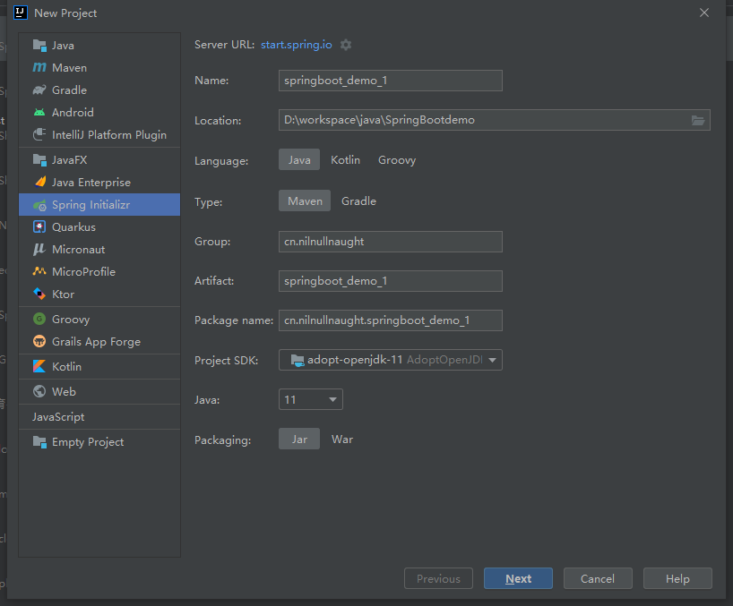
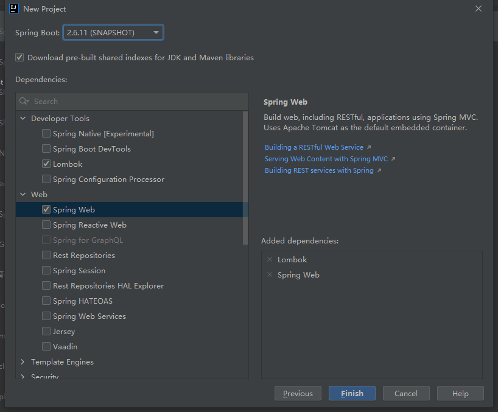
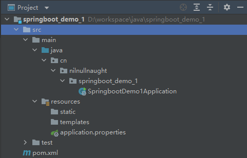

# 6	Spring Boot

## 6.1	Spring Boot 概述

### 6.1.1	Spring Boot 简介

##### Sping 项目搭建和开发问题

* 配置繁琐
* 依赖设置繁琐

<br>

##### 什么是 Spring Boot

Spring Boot 是由 Pivotal 团队提供的全新框架[^6.1.1-1]，其设计目的简化 Spring 应用的初始搭建以及开发过程。

<br>

##### Spring Boot 的优点

* 易上手，提升开发效率，为 Spring 开发提供一个更快、更广泛的入门体验。
* 开箱即用，远离繁琐的配置。
* 提供了一系列大型项目通用的非业务性功能，例如：内嵌服务器、安全管理、运行数据监控、运行状况检查和外部化配置等。
* 没有代码生成，也不需要 XML 配置。
* 避免了大量的 Maven 导入和各种版本冲突。

<br>

---

[^6.1.1-1]: 第一个版本为2014年4月发布。

<div STYLE="page-break-after: always;"><br>
    <br>
    <br>
    <br>
    <br>
    <br>
    <br>
    <br>
    <br>
    <br></div>
### 6.1.2	创建基础 Spring Boot 项目

##### 使用 IDEA 创建 Spring Boot 项目

1. New Project → Spring Initializr：



2. 选择 Spring Boot 版本与项目依赖：



3. 创建成功。

<br>

---

<div STYLE="page-break-after: always;"><br>
    <br>
    <br>
    <br>
    <br>
    <br>
    <br>
    <br>
    <br>
    <br></div>
### 6.1.3	Spring Boot 项目解析

##### Spring Boot 项目结构



###### 自动生成的重要文件

- 启动器类 Application
- 配置文件 application.properties
- pom.xml

<br>

##### Spring Boot 版本控制中心

Spring Boot 自动生成的 pom.xml 依赖于一个父工程，该父工程的主要作用是管理项目的资源和过滤和插件：

```xml
<parent>
    <groupId>org.springframework.boot</groupId>
    <artifactId>spring-boot-starter-parent</artifactId>
    <version>2.2.5.RELEASE</version>
    <relativePath/> <!-- lookup parent from repository -->
</parent>
```

该父工程依赖于另一个父工程：

```xml
<parent>
    <groupId>org.springframework.boot</groupId>
    <artifactId>spring-boot-dependencies</artifactId>
    <version>2.2.5.RELEASE</version>
    <relativePath>../../spring-boot-dependencies</relativePath>
</parent>
```

这个父工程负责管理 Spring Boot 应用所有的依赖版本，是 **Spring Boot 版本控制中心**。

因此 Spring Boot 项目导入依赖时不需要配置版本信息，除非版本控制中心没有需要导入的包。

<br>

##### 启动器

生成 pom.xml 中存在如下依赖：

```xml
<dependency>
    <groupId>org.springframework.boot</groupId>
    <artifactId>spring-boot-starter-web</artifactId>
</dependency>
```

该依赖导入了 web 模块正常运行所依赖的组件，是 Spring Boot 的 **Web 启动器**。

###### 什么是启动器

Spring Boot 将常见的功能场景抽取出来，集成为 starter （启动器）。使用 Spring Boot 开发项目时，根据需要的功能引入 starter，就可以将所有相关依赖全部导入进来。

用户可以自定义 starter。

<br>

##### 主启动器类

```
@SpringBootApplication
public class SpringbootApplication {

   public static void main(String[] args) {
      SpringApplication.run(SpringbootApplication.class, args);
   }

}
```

###### 作用

1. 推断应用的类型是普通的项目还是 Web 项目；
2. 查找并加载所有可用初始化器 ， 设置到 initializers 属性中；
3. 找出所有的应用程序监听器，设置到 listeners 属性中；
4. 推断并设置 main 方法的定义类，找到运行的主类。

<br>

---

<div STYLE="page-break-after: always;"><br>
    <br>
    <br>
    <br>
    <br>
    <br>
    <br>
    <br>
    <br>
    <br></div>

### 6.1.4	Spring Boot 自动配置原理

##### @SpringBootApplication

用于表示被标注的类是 Spring Boot 的 **主配置类** ， Spring Boot 通过运行这个类的 main 方法来启动 Spring Boot 应用。

源代码

```java
@Target({ElementType.TYPE})
@Retention(RetentionPolicy.RUNTIME)
@Documented
@Inherited
@SpringBootConfiguration
@EnableAutoConfiguration
@ComponentScan(
    excludeFilters = {@Filter(
    type = FilterType.CUSTOM,
    classes = {TypeExcludeFilter.class}
), @Filter(
    type = FilterType.CUSTOM,
    classes = {AutoConfigurationExcludeFilter.class}
)}
)
public @interface SpringBootApplication {
	...
}
```

<br>

##### @SpringBootApplication 的内部注解

###### @ComponentScan

自动扫描并加载符合条件的组件或者 bean ， 将这个 bean 定义加载到 IOC 容器中。

###### @SpringBootConfiguration

表示被标记的类是一个 Spring Boot 配置类。

重要内部注解：

-  `@Configuration`：`@Configuration` 注解内部配置了 `@Component` 注解。这意味着 **启动类实际上也是一个被 Spring 管理的 bean。**

###### @EnableAutoConfiguration

开启自动配置功能。

重要内部注解：

- `@AutoConfigurationPackage`：自动配置包。该注解内部通过 `@AutoConfigurationPackage` 自动配置包。
  - `@AutoConfigurationPackage`：通过内部的 `@Import({Registrar.class})`  向容器中导入组件。

- `@Import({AutoConfigurationImportSelector.class})`：给容器导入组件，AutoConfigurationImportSelector.class 是自动配置导入选择器。内部**通过 `spring.factories` 自动导入配置**。

<br>

##### Spring Boot 自动配置原理

###### spring.factories

spring.factories 是 Spring Boot 自动配置的根源，Spring Boot 自动配置的实现方式是从 classpath 中搜寻所有的 META-INF/spring.factories 配置文件 ，并将其中对应的 org.springframework.boot.autoconfigure. 包下的配置项，通过反射实例化为对应标注了 `@Configuratio`n 的 JavaConfig 形式的 IOC 容器配置类 ， 然后将这些都汇总成为一个实例并加载到 IOC 容器中。

###### 过程

1. Spring Boot 在启动的时从类路径下的 META-INF/spring.factories 中获取 `@EnableAutoConfiguration` 指定的值；
2. 将这些值作为自动配置类导入容器 ， 自动配置类生效 ， 帮我们进行自动配置工作；
3. 整个 J2EE 的整体解决方案和自动配置都在 springboot-autoconfigure 的 jar 包中。它向容器中导入非常多的自动配置类 （-AutoConfiguration）, 也就是向容器中导入这个场景需要的所有组件 ， 并配置好这些组件 ；
4. 有了自动配置类 ， 免去了我们手动编写配置注入功能组件等的工作；

<br>

##### Spring Boot 项目的启动流程


<br>

---

<div STYLE="page-break-after: always;"><br>
    <br>
    <br>
    <br>
    <br>
    <br>
    <br>
    <br>
    <br>
    <br></div>

## 6.2	配置文件

### 6.2.1	配置文件语法

##### Spring Boot 配置文件的作用

修改 Spring Boot 自动配置的默认值。

<br>

##### Spring Boot 的两种配置文件

- application.properties：语法结构 `key=value`；
- application.yml：语法结构 `key: value`（注意冒号后有一个空格）。

<br>

##### YAML

YAML 是 ”YAML Ain't markup language"（YAML 不是一种标记语言）的缩写，是一种对人类设计友好（方便读写）的数据序列化语言，可以很好地与其它编程语言协同完成日常任务。

###### 传统 xml 配置与 yaml 配置的对比

传统 xml 配置：

```xml
<server>
	<port>8081<port>
</server>
```

yaml配置：

```yml
server:
	prot: 8080
```

###### yaml 基础语法

- 冒号后的空格不能省略
- 以缩进来控制层级关系，只要是左边对齐的一列数据都是同一个层级的。
- 属性和值是大小写敏感的。

###### yaml 定义字面量（数字、布尔值、字符串）

字面量直接写在后面就可以 ， 字符串默认不用加上双引号或者单引号；

```
k: v
```

注意：

- “ ” 双引号，不会转义字符串里面的特殊字符 ， 特殊字符会作为本身想表示的意思；

  比如 ：name: "Donald \n Trump"  输出 ：Donald 换行  Trump

- '' 单引号，会转义特殊字符 ， 特殊字符最终会变成和普通字符一样输出

  比如 ：name: ‘Donald \n Trump’  输出 ：Donald \n  Trump

###### **对象、Map（键值对）**

```yaml
#对象、Map格式
k: 
    attr1: v1
    attr2: v2
```

例：

```yaml
student:
    name: qinjiang
    age: 3
```

行内写法：

```yaml
student: {name: qinjiang,age: 3}
```

###### 数组（ List、set ）

用 - 值表示数组中的一个元素，例如：

```yaml
pets:
 - cat
 - dog
 - pig
```

行内写法：

```
pets: [cat,dog,pig]
```

<br>

---

<div STYLE="page-break-after: always;"><br>
    <br>
    <br>
    <br>
    <br>
    <br>
    <br>
    <br>
    <br>
    <br></div>
### 6.2.2	在代码中获取配置值

##### 方法一——@ConfigurationProperties

`@ConfigurationProperties` 将配置文件中配置的每一个属性的值，映射到当前 Bean 中，通过 prefix 属性指定配置前缀。

###### 例

Bean：

```java
@Component //注册bean
@ConfigurationProperties(prefix = "my.user")
public class Person {
    private String name;
    private Integer age;
    private Boolean happy;
    private Date birth;
    private Map<String,Object> maps;
    private List<Object> lists;
    private Dog dog;
}
```

配置文件：

```yaml
my
	user:
		name: qinjiang
		age: 3
		happy: false
		birth: 2000/01/01
		maps: {k1: v1,k2: v2}
		lists:
			- code
			- girl
			- music
		dog:
		 	name: 旺财
		 	age: 1
```

<br>

##### 方法二——通过 @value

Bean：

```java
@PropertySource(value = "classpath:person.properties")
@Component //注册bean
public class Person {

    @Value("${name}")
    private String name;

    ......  
}
```

配置文件：

```properties
name=Donald Trump
```

<br>

##### @Value 和 @ConfigurationProperties 之间的对比

|                                | @ConfigurationProperties | @Value   |
| ------------------------------ | ------------------------ | -------- |
| 注入方式                       | 批量注入                 | 单个注入 |
| 松散绑定（松散语法）[^6.2.2-1] | 支持                     | 不支持   |
| SpEL❓（SpEL 是什么东西）       | 不支持                   | 支持     |
| JSR303 数据校验                | 支持                     | 不支持   |
| 复杂类型封装（对象或集合等）   | 支持                     | 不支持   |

<br>

##### @PropertySource 和 @ConfigurationProperties

@PropertySource 与 @ConfigurationProperties 都用于读取配置文件。区别在于：

- **@PropertySource ：**加载指定的配置文件；
- **@configurationProperties**：默认从全局配置文件中获取值；

<br>

##### 使用建议

- yml 和 properties 都可以获取到值，但是更建议使用 yml。
- 如果在某个业务中，只需要获取配置文件中的某个值，可以使用 @value；
- 如果专门编写了一个 JavaBean 来和配置文件进行一一映射，就直接 @configurationProperties。

<br>

##### ❓（除了随机数，还能做什么？）配置文件占位符

配置文件还可以编写占位符生成随机数

```java
person:
    name: qinjiang${random.uuid} # 随机uuid
    age: ${random.int}  # 随机int
    happy: false
    birth: 2000/01/01
    maps: {k1: v1,k2: v2}
    lists:
      - code
      - girl
      - music
    dog:
      name: ${person.hello:other}_旺财
      age: 1
```

<br>

---

[^6.2.2-1]: 例如 yml 中 last-name 可以被 lastName属性读取。

<div STYLE="page-break-after: always;"><br>
    <br>
    <br>
    <br>
    <br>
    <br>
    <br>
    <br>
    <br>
    <br></div>

### 6.2.3	JSR303 数据校验

##### @validated

在 Spring Boot 中可以用 `@validated` 校验数据，如果数据异常则会统一抛出异常。

###### 例——确保 email 属性的值是邮件格式

配置文件：

```yml
person:
	email: 1@email.com
```

配置读取：

```java
@Component //注册bean
@ConfigurationProperties(prefix = "person")
@Validated  //数据校验
public class Person {

    @Email(message="邮箱格式错误") //name必须是邮箱格式
    private String email;
}
```

<br>

##### 常见配置

###### 空检查

- `@Null`：验证对象是否为 `null`；
- `@NotNull`：验证对象是否不为 null,，无法查检长度为 0 的字符串（空字符串）；
- `@NotBlank`：检查约束字符串是不是 `Null` 还有被 Trim 的长度是否大于0，只对字符串，且会去掉前后空格；
- `@NotEmpty`：检查约束元素是否为 NULL 或者是 EMPTY。

例：

```java
@NotNull(message="名字不能为空")
private String userName;
```

###### Booelan 检查

- `@AssertTrue`：验证 Boolean 对象是否为 true；
- `@AssertFalse`：验证 Boolean 对象是否为 false。

###### 长度检查

- `@Size(min=, max=)`：验证对象（Array,Collection,Map,String）长度是否在给定的范围之内；
  `@Length(min=, max=)`：验证 String 长度是否在给定的范围之内。

###### 日期检查

- `@Past`：验证 Date 和 Calendar 对象是否在当前时间之前；
- `@Future`：验证 Date 和 Calendar 对象是否在当前时间之后；
- `@Pattern`：验证 String 对象是否符合正则表达式的规则。

###### 设置最大值

```
@Max(value=120,message="年龄最大不能查过120")
private int age;
```

###### 邮箱格式

```
@Email(message="邮箱格式错误")
private String email;
```

<br>

##### ❗（需要补充）自定义校验规则

<br>

---

<div STYLE="page-break-after: always;"><br>
    <br>
    <br>
    <br>
    <br>
    <br>
    <br>
    <br>
    <br>
    <br></div>

### 6.2.4	多环境切换

##### 多配置文件

在主配置文件编写的时候，文件名可以是 `application-{profile}.properties/yml`，用来指定多个环境版本，例如：

- application-test.properties：代表测试环境配置；
- application-dev.properties：代表开发环境配置。

但是，**Spring boot 并不会直接启动这些配置文件，Spring Boot 默认使用 application.properties 主配置**。

<br>

##### 通过配置选择需要激活的配置文件

```properties
spring.profiles.active=dev
```

<br>

##### yaml 多文档块

不需要创建多个配置文件，即在同一个文件中进行多套配置：

```yaml
server:
  port: 8081
#选择要激活那个环境块
spring:
  profiles:
    active: prod

---
server:
  port: 8083
spring:
  profiles: dev #配置环境的名称


---

server:
  port: 8084
spring:
  profiles: prod  #配置环境的名称
```

<br>

##### properties 和 yaml 之间的优先级

如果 ym l和 properties 配置了同一个属性，并且没有激活其他环境 ， 默认会使用 properties 配置文件。

<br>

##### 加载配置文件位置

spring boot 启动时会扫描以下位置的 application.properties 或者 application.yml 文件作为 Spring boot 的默认配置文件：

- 优先级1：项目路径下的 config 文件夹配置文件；
- 优先级2：项目路径下配置文件；
- 优先级3：资源路径下的 config 文件夹配置文件；
- 优先级4：资源路径下配置文件。

优先级由高到底，高优先级的配置会覆盖低优先级的配置。

<br>

##### 互补配置与配置文件优先级

Spring Boot 加载多个配置文件后，如果配置在其他配置文件中不存在，那么也会被加载。但是相同配置会根据配置文件的优先级进行覆盖。

<br>

##### 指定位置加载配置文件

通过 spring.config.location 来改变默认的配置文件位置。

项目打包好以后，我们可以使用命令行参数的形式，启动项目的时候来指定配置文件的新位置；这种情况，一般是后期运维做的多，相同配置，外部指定的配置文件优先级最高。

```
java -jar spring-boot-config.jar --spring.config.location=F:/application.properties
```

<br>

---

<div STYLE="page-break-after: always;"><br>
    <br>
    <br>
    <br>
    <br>
    <br>
    <br>
    <br>
    <br>
    <br></div>

## 6.3	自定义 starter

##### 启动器的本质

启动器模块是一个 空 jar 文件，仅提供辅助性依赖管理，这些依赖可能用于自动装配或者其他类库。

<br>

##### 启动器的命名规则

- 官方命名：spring-boot-starter-【模块名】，比如：spring-boot-starter-web。

- 自定义命名：【模块名】-spring-boot-starter，比如：mybatis-spring-boot-starter。

<br>

##### 步骤——编写启动器

1. 在 IDEA 中新建一个空项目 spring-boot-starter-diy
2. 新建一个普通 Maven 模块：mystarter-spring-boot-starter
3. 新建一个Springboot模块：kuang-spring-boot-starter-autoconfigure
4. 在自定义的 starter 中 导入  autoconfigure 的依赖
5. 将 autoconfigure 项目下多余的文件都删掉，Pom中只留下一个 starter，这是所有的启动器基本配置
6. 编写一个自己的服务和配置类。

---

<div STYLE="page-break-after: always;"><br>
    <br>
    <br>
    <br>
    <br>
    <br>
    <br>
    <br>
    <br>
    <br></div>

## 附录

##### 参考资料

- 主要参考资料——[狂神说SpringBoot](http://mp.weixin.qq.com/mp/homepage?search_click_id=3043570963714927252-1660729618734-4990254955&__biz=Mzg2NTAzMTExNg==&hid=1&sn=3247dca1433a891523d9e4176c90c499&scene=18#wechat_redirect) 发布于 2020/03/29；

<br>