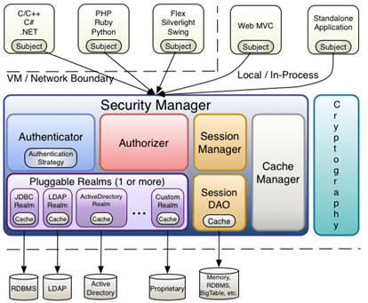
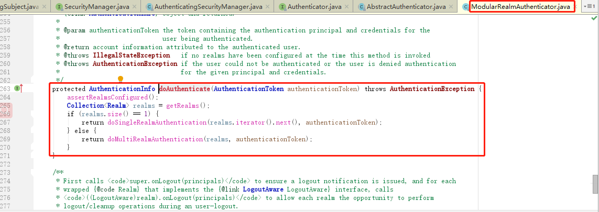
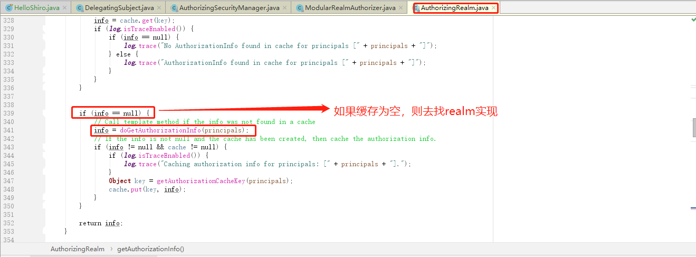

# 8	安全框架 Shiro

## 8.1	概述

##### Shiro 简介

Apache Shiro 是 Java 的一个安全框架。Shiro 可以非常容易的开发出足够好的应用，不仅可以用在 JavaSE 环境，也可以用在 JavaEE 环境。Shiro 可以帮助我们完成：认证、授权、加密、会话管理、与 Web 集成、缓存等功能。

<br>

##### 为什么选择 Shiro

目前，使用 Apache Shiro 的人越来越多，因为它比 Spring Security 更简单易用。虽然没有 Spring Security 功能强大，但是在实际工作时可能并不需要复杂的Spring Security ，使用 Shiro 能更简单的解决项目问题。

<br>

##### Shiro 基本功能点


- **Authentication**：身份认证 / 登录，验证用户是不是拥有相应的身份；
- **Authorization**：授权，即权限验证，验证某个已认证的用户是否拥有某个权限；即判断用户是否能做事情，常见的如：验证某个用户是否拥有某个角色。或者细粒度的验证某个用户对某个资源是否具有某个权限；
- **Session** **Management**：会话管理，即用户登录后就是一次会话，在没有退出之前，它的所有信息都在会话中；会话可以是普通 JavaSE 环境的，也可以是如 Web 环境的；
- **Cryptography**：加密，保护数据的安全性，如密码加密存储到数据库，而不是明文存储；
- **Web Support**：Web 支持，可以非常容易的集成到 Web 环境；
- **Caching**：缓存，比如用户登录后，其用户信息、拥有的角色 / 权限不必每次去查，这样可以提高效率；
- **Concurrency**：shiro 支持多线程应用的并发验证，即如在一个线程中开启另一个线程，能把权限自动传播过去；
- **Testing**：提供测试支持；
- **Run As**：允许一个用户假装为另一个用户（如果他们允许）的身份进行访问；
- **Remember Me**：记住我，这个是非常常见的功能，即一次登录后，下次再来的话不用登录了。

<br>

##### Shiro 工作流程


###### Subject

主体，代表了当前 “用户”[^8.1-1]。应用代码直接交互的对象是 Subject，也就是说 Shiro 的对外 API 核心就是 Subject。

###### SecurityManager

安全管理器，所有与安全有关的操作都会与 Security Manager 交互。SecurityManager 管理所有 Subject[^8.1-2]，负责与其他组件进行交互，是 Shiro 的核心。

###### Realm

域，Shiro 从 Realm 获取安全数据（如用户、角色、权限）[^8.1-3]。可以把 Realm 看成 DataSource，即 **安全数据源**。

###### Shiro 基本工作流程

1. 应用代码通过 Subject 来进行认证和授权，而 Subject 又委托给 SecurityManager；
2. 给 Shiro 的 SecurityManager 注入 Realm，从而让 SecurityManager 能得到合法的用户及其权限进行判断。

<br>

##### Shiro 内部架构



- **Subject**：主体，可以看到主体可以是任何可以与应用交互的 “用户”；
- **SecurityManager**：相当于 SpringMVC 中的 DispatcherServlet 或者 Struts2 中的 FilterDispatcher；是 Shiro 的心脏；所有具体的交互都通过 SecurityManager 进行控制；它管理着所有 Subject、且负责进行认证和授权、及会话、缓存的管理。
- **Authenticator**：认证器，负责主体认证，这是一个扩展点，如果用户觉得 Shiro 默认的不好，可以自定义实现；其需要认证策略（Authentication Strategy），即什么情况下算用户认证通过了；
- **Authorizer**：授权器，或者访问控制器，用来决定主体是否有权限进行相应的操作；即控制着用户能访问应用中的哪些功能；
- **Realm**：可以有 1 个或多个 Realm，可以认为是安全实体数据源，即用于获取安全实体的；可以是 JDBC 实现，也可以是 LDAP 实现，或者内存实现等等；由用户提供；注意：Shiro 不知道你的用户 / 权限存储在哪及以何种格式存储；所以我们一般在应用中都需要实现自己的 Realm；
- **SessionManager**：如果写过 Servlet 就应该知道 Session 的概念，Session 呢需要有人去管理它的生命周期，这个组件就是 SessionManager；而 Shiro 并不仅仅可以用在 Web 环境，也可以用在如普通的 JavaSE 环境、EJB 等环境；所以呢，Shiro 就抽象了一个自己的 Session 来管理主体与应用之间交互的数据；这样的话，比如我们在 Web 环境用，刚开始是一台 Web 服务器；接着又上了台 EJB 服务器；这时想把两台服务器的会话数据放到一个地方，这个时候就可以实现自己的分布式会话（如把数据放到 Memcached 服务器）；
- **SessionDAO**：DAO 大家都用过，数据访问对象，用于会话的 CRUD，比如我们想把 Session 保存到数据库，那么可以实现自己的 SessionDAO，通过如 JDBC 写到数据库；比如想把 Session 放到 Memcached 中，可以实现自己的 Memcached SessionDAO；另外 SessionDAO 中可以使用 Cache 进行缓存，以提高性能；
- **CacheManager**：缓存控制器，来管理如用户、角色、权限等的缓存的；因为这些数据基本上很少去改变，放到缓存中后可以提高访问的性能
- **Cryptography**：密码模块，Shiro 提供了一些常见的加密组件用于如密码加密 / 解密的。

<br>

---

[^8.1-1]: 这个用户不一定是一个具体的人，与当前应用交互的任何东西都是 Subject，如网络爬虫，机器人等，即一个抽象概念。
[^8.1-2]: 所有 Subject 都绑定到 Security Manager，且与 Subject 的所有交互都会被委托给 Security Manager。可以把 Subject 认为是一个门面，Security Manager 才是实际的执行者。
[^8.1-3]: SecurityManager 验证用户身份时，需要从 Realm 获取相应的用户进行比较以确定用户身份是否合法；验证用户是否能进行操作时，也需要从 Realm 得到用户相应的角色/权限。

<div STYLE="page-break-after: always;"><br>
    <br>
    <br>
    <br>
    <br>
    <br>
    <br>
    <br>
    <br>
    <br></div>
## 8.2	Shiro 基本使用

### 8.2.1	身份认证

##### Shiro 身份认证基本流程


1. Shiro 把用户的数据封装成标识 token，token 一般封装着用户名，密码等信息；
2. 使用 Subject 门面获取到封装着用户的数据的标识 token；
3. Subject 把标识 token 交给 SecurityManager，在 SecurityManager 安全中心中，SecurityManager 把标识 token 委托给认证器 Authenticator 进行身份验证。认证器的作用一般是用来指定如何验证，它规定本次认证用到哪些 Realm；
4. 认证器 Authenticator 将传入的标识token，与数据源 Realm 对比，验证 token 是否合法。

<br>

##### Shiro 基本使用具体步骤

###### 前提条件

在 resouces 目录下定义权限 ini 文件。

###### 代码

```java
//1.导入权限 ini 文件构建权限工厂
Factory<SecurityManager> factory = new IniSecurityManagerFactory("classpath:shiro.ini");
//2.工厂构建安全管理器
SecurityManager securityManager = factory.getInstance();
//3.使用 SecurityUtils 工具，使安全管理器生效
SecurityUtils.setSecurityManager(securityManager);
//4.使用 SecurityUtils 工具获得主体
Subject subject = SecurityUtils.getSubject();

//构建账号token
UsernamePasswordToken usernamePasswordToken = new UsernamePasswordToken("jay", "123");
//登录操作
// ...
subject.login(usernamePasswordToken);
```

<br>

##### Realm 接口结构


<br>

##### Realm 的使用

在项目中，一般不会实现 Realm 接口，而是选择继承 `AuthorizingRealm` 类，该类继承了认证与授权功能。它需要强制重写两个方法：

```java
public class DefinitionRealm extends AuthorizingRealm {
 
    /**
	 * @Description 认证
	 * @param authcToken token对象
	 * @return 
	 */
	public abstract AuthenticationInfo doGetAuthenticationInfo(AuthenticationToken authcToken) {
        return null;
    }

	/**
	 * @Description 鉴权
	 * @param principals 令牌
	 * @return
	 */
	public abstract AuthorizationInfo doGetAuthorizationInfo(PrincipalCollection principals){
        return null;
    }
}
```

<br>

##### 例——使用 Shiro 进行身份验证

###### 第一步——创建项目，导入相关依赖

```xml
<dependencies>

    <dependency>
      <groupId>org.apache.shiro</groupId>
      <artifactId>shiro-core</artifactId>
      <version>1.3.2</version>
    </dependency>
    
    <dependency>
      <groupId>junit</groupId>
      <artifactId>junit</artifactId>
      <version>4.11</version>
    </dependency>

    ...
</dependencies>
```

###### 第二步——编写 shiro.ini

```ini
#声明用户账号
[users]
Trump=123456789
```

###### 第三步——编写单元测试代码

```java
package com.itheima.shiro;

import org.apache.shiro.SecurityUtils;
import org.apache.shiro.authc.UsernamePasswordToken;
import org.apache.shiro.config.IniSecurityManagerFactory;
import org.apache.shiro.mgt.SecurityManager;
import org.apache.shiro.subject.Subject;
import org.apache.shiro.util.Factory;
import org.junit.Test;

/**
 * @Description：shiro的第一个例子
 */
public class HelloShiro {

    @Test
    public void shiroLogin() {
        //导入权限ini文件构建权限工厂
        Factory<SecurityManager> factory = new IniSecurityManagerFactory("classpath:shiro.ini");
        //工厂构建安全管理器
        SecurityManager securityManager = factory.getInstance();
        //使用SecurityUtils工具生效安全管理器
        SecurityUtils.setSecurityManager(securityManager);
        //使用SecurityUtils工具获得主体
        Subject subject = SecurityUtils.getSubject();
        
        //构建账号token
        UsernamePasswordToken usernamePasswordToken = new UsernamePasswordToken("Trump", "123456789");
        //登录操作
        subject.login(usernamePasswordToken);
        System.out.println("是否登录成功：" + subject.isAuthenticated());
    }
}
```

<br>

##### subject.login() 的内部逻辑

1. Subject 将包含用户名和密码的 token 委托给了 securityManager；

   

2. securityManager 将 token 委托给内部认证组件 authenticator；

   

3. authenticator 将 token 委托给数据源 Realm 进行对比：

   

4. 调用程序员实现的 Realm 的 `doGetAuthenticationInfo(token)` 方法（该方法从数据库中获得数据，并进行验证），如果验证通过，则返回一个正确的凭证 info：

   

<br>

##### 例——自定义 Realm

###### 第一步

创建项目并导入依赖。

###### 第二步

编辑 shiro.ini：

```ini
#声明自定义的 realm，且为安全管理器指定 realms
[main]
definitionRealm=cn.nilnullnaught.shiro.realm.DefinitionRealm
securityManager.realms=$definitionRealm
```

###### 第二步

创建 `SecurityService` 与 `SecurityServiceImpl`：

```java
package cn.nilnullnaught.shiro.dao;

public interface SecurityDao {

    String findPasswordByLoginName(String loginName);
}

```

```java
package cn.nilnullnaught.shiro.dao.impl;

import cn.nilnullnaught.shiro.dao.SecurityDao;

/**
 * @Description：权限服务层
 */
public class SecurityDaoImpl implements SecurityDao {

    @Override
    public String findPasswordByLoginName(String loginName) {
        if(loginName == 'Trump'){
            return "123456789";
        }
        return null;
    }
}
```

###### 第三步

定义 DefinitionRealm：

```java
package cn.nilnullnaught.shiro.realm;

import cn.nilnullnaught.dao.impl.SecurityDaoImpl;
import org.apache.shiro.authc.*;
import org.apache.shiro.authz.AuthorizationInfo;
import org.apache.shiro.realm.AuthorizingRealm;
import org.apache.shiro.subject.PrincipalCollection;

/**
 * @Description：声明自定义realm
 */
public class DefinitionRealm extends AuthorizingRealm {

    /**
     * @Description 认证接口
     * @param token 传递登录token
     * @return
     */
    @Override
    protected AuthenticationInfo doGetAuthenticationInfo(AuthenticationToken token) throws AuthenticationException {
        //从AuthenticationToken中获得登录名称
        String loginName = (String) token.getPrincipal();
        var securityDao = new SecurityDaoImpl();
        String password = securityDao.findPasswordByLoginName(loginName);
        if ("".equals(password)||password==null){
            throw new UnknownAccountException("账户不存在");
        }
        //传递账号和密码
        return  new SimpleAuthenticationInfo(loginName,password,getName());
    }


    @Override
    protected AuthorizationInfo doGetAuthorizationInfo(PrincipalCollection principals) {
        return null;
    }

}
```

<br>

---

<div STYLE="page-break-after: always;"><br>
    <br>
    <br>
    <br>
    <br>
    <br>
    <br>
    <br>
    <br>
    <br></div>

### 8.2.2	编码

##### Shiro 的编码/解码 API

Shiro 内部的一些数据的存储/表示使用了 base64 和 16 进制字符串。Shiro 也提供了 base64 和 16 进制字符串编码/解码的 API 支持，方便一些编码解码操作。

<br>

##### 例

###### 第一步

创建 `EncodesUtil` 类：

```java
package cn.nilnullnaught.tools;

import org.apache.shiro.codec.Base64;
import org.apache.shiro.codec.Hex;

/**
 * @Description：封装base64和16进制编码解码工具类
 */
public class EncodesUtil {

    /**
     * @Description HEX-byte[]--String转换
     * @param input 输入数组
     * @return String
     */
    public static String encodeHex(byte[] input){
        return Hex.encodeToString(input);
    }

    /**
     * @Description HEX-String--byte[]转换
     * @param input 输入字符串
     * @return byte数组
     */
    public static byte[] decodeHex(String input){
        return Hex.decode(input);
    }

    /**
     * @Description Base64-byte[]--String转换
     * @param input 输入数组
     * @return String
     */
    public static String encodeBase64(byte[] input){
        return Base64.encodeToString(input);
    }

    /**
     * @Description Base64-String--byte[]转换
     * @param input 输入字符串
     * @return byte数组
     */
    public static byte[] decodeBase64(String input){
        return Base64.decode(input);
    }

}
```

###### 第二步——创建 ClientTest 类

```java
package cn.nilnullnaught.client;

import cn.nilnullnaught.tools.EncodesUtil;
import org.junit.Test;

/**
 * @Description：测试
 */
public class ClientTest {

    /**
     * @Description 测试16进制编码
     */
    @Test
    public void testHex(){
        String val = "holle";
        String flag = EncodesUtil.encodeHex(val.getBytes());
        String valHandler = new String(EncodesUtil.decodeHex(flag));
        System.out.println("比较结果："+val.equals(valHandler));
    }

    /**
     * @Description 测试base64编码
     */
    @Test
    public void testBase64(){
        String val = "holle";
        String flag = EncodesUtil.encodeBase64(val.getBytes());
        String valHandler = new String(EncodesUtil.decodeBase64(flag));
        System.out.println("比较结果："+val.equals(valHandler));
    }


}
```

<br>

---

<div STYLE="page-break-after: always;"><br>
    <br>
    <br>
    <br>
    <br>
    <br>
    <br>
    <br>
    <br>
    <br></div>

### 8.2.3	加密与散列算法

##### 散列算法简介

散列算法一般用于生成数据的摘要信息，是一种不可逆的算法，一般适合存储密码之类的数据，常见的散列算法如 MD5、SHA 等。一般进行散列时最好提供一个 salt（盐），比如加密密码“admin”，产生的散列值是“21232f297a57a5a743894a0e4a801fc3”，可以到一些 md5 解密网站很容易的通过散列值得到密码“admin”，即如果直接对密码进行散列相对来说破解更容易，此时我们可以加一些只有系统知道的干扰数据，即 salt；这样散列的对象是“密码+salt”，这样生成的散列值相对来说更难破解。

<br>

##### shiro 支持的散列算法

Md2Hash、Md5Hash、Sha1Hash、Sha256Hash、Sha384Hash、Sha512Hash

<br>

##### 例——使用 shiro 提供的散列算法生成密文

###### 第一步——创建工具类

```java
package cn.nilnullnaught.shiro.tools;

import com.sun.org.apache.bcel.internal.generic.NEW;
import org.apache.shiro.crypto.SecureRandomNumberGenerator;
import org.apache.shiro.crypto.hash.SimpleHash;
import sun.security.util.Password;

import java.util.HashMap;
import java.util.Map;

public class DigestsUtil {

    // 加密算法
    private static final String SHA1 = "SHA-1";
    
    // 密码迭代次数
    private static final Integer ITERATIONS =512;

    //使用 generateSalt() 生成的 SALT
    private static final String SALT = "d71f876d2a61b9a280e0318cdd15a07c";


    //生成密文
    public static String entryptPassword(String passwordPlain) {
        // 调用 sha1() 生成密文
        return sha1(passwordPlain,SALT);
    }

	// 使用 SHA-1 算法生成密文
    public static String sha1(String input, String salt) {
        return new SimpleHash(SHA1, input, salt,ITERATIONS).toString();
    }


    //随机获得 salt 字符串
    public static String generateSalt(){
        SecureRandomNumberGenerator randomNumberGenerator = new SecureRandomNumberGenerator();
        return randomNumberGenerator.nextBytes().toHex();
    }
}
```

###### 第二步——创建测试类

```java
import cn.nilnullnaught.tools.DigestsUtil;
import org.junit.Test;

import java.util.Map;

/**
 * @Description：测试
 */
public class ClientTest {

    @Test
    public void testDigestsUtil(){
        var result =  DigestsUtil.entryptPassword("123456789");
        System.out.println("获得结果："+result);
    }

}
```

<br>

##### 例——在 Realm 中使用散列算法

###### 第一步——创建项目并添加依赖

略。

###### 第二步——编写持久层逻辑

创建 SecurityDao 与 SecurityDaoImpl（不连接数据库，只进行模拟）：

```java
package cn.nilnullnaught.dao;

import java.util.Map;

public interface SecurityDao {

    Map<String,String> findPasswordByLoginName(String loginName);
}

```

```java
package cn.nilnullnaught.dao.impl;

import cn.nilnullnaught.dao.SecurityDao;

import java.util.HashMap;
import java.util.Map;

/**
 * @Description：权限服务层
 */
public class SecurityDaoImpl implements SecurityDao {

    @Override
    public String findPasswordByLoginName(String loginName) {
        if("Trump".equals(loginName)){
			//模拟数据库中存储的密文信息
       		return  “836d7360a625449a97aa9551450408b53214eeef”;
        }
        return null;
    }
}

```

###### 第三步——指定密码匹配方式

为 `DefinitionRealm` 类添加如下构造方法：

```java
public DefinitionRealm() {
    //指定密码匹配方式为 sha1
    HashedCredentialsMatcher matcher = new HashedCredentialsMatcher(DigestsUtil.SHA1);
    //指定密码迭代次数
    matcher.setHashIterations(DigestsUtil.ITERATIONS);
    //使用父亲方法使匹配方式生效
    setCredentialsMatcher(matcher);
}
```

修改 `DefinitionRealm` 类的 `doGetAuthenticationInfo()` 方法如下：

```java
public class DefinitionRealm extends AuthorizingRealm {

    // 无参构造
    public DefinitionRealm() {
        //指定密码匹配方式为 sha1
        HashedCredentialsMatcher matcher = new HashedCredentialsMatcher(DigestsUtil.SHA1);
        //指定密码迭代次数
        matcher.setHashIterations(DigestsUtil.ITERATIONS);
        //使用父亲方法使匹配方式生效
        setCredentialsMatcher(matcher);
    }

    @Override
    protected AuthenticationInfo doGetAuthenticationInfo(AuthenticationToken token) throws AuthenticationException {
        //从 AuthenticationToken 中获得登录名称
        String loginName = (String) token.getPrincipal();
        var securityService = new SecurityDaoImpl();
        var password = securityService.findPasswordByLoginName(loginName);
        if (password.isEmpty()){
            throw new UnknownAccountException("账户不存在");
        }
        
        //传递账号和密码:
        //参数 1：缓存对象
        //参数 2：明文密码
        //参数三：字节 salt
        //参数 4：当前DefinitionRealm名称
        return  new SimpleAuthenticationInfo(loginName,password, ByteSource.Util.bytes(DigestsUtil.SALT),getName());
    }


    @Override
    protected AuthorizationInfo doGetAuthorizationInfo(PrincipalCollection principals) {
        return null;
    }

}
```

###### 第四步——编写测试代码

```java
public class ShiroTest {

    @Test
    public void shiroLogin() {
        //导入权限ini文件构建权限工厂
        var factory = new IniSecurityManagerFactory("classpath:shiro.ini");
        //工厂构建安全管理器
        var securityManager = factory.getInstance();
        //使用SecurityUtils工具生效安全管理器
        SecurityUtils.setSecurityManager(securityManager);
        //使用SecurityUtils工具获得主体
        Subject subject = SecurityUtils.getSubject();
        //构建账号token
        UsernamePasswordToken usernamePasswordToken = new UsernamePasswordToken("Trump", "123456789");
        //登录操作
        subject.login(usernamePasswordToken);
        System.out.println("是否登录成功：" + subject.isAuthenticated());
    }
}
```

<br>

---

<div STYLE="page-break-after: always;"><br>
    <br>
    <br>
    <br>
    <br>
    <br>
    <br>
    <br>
    <br>
    <br></div>

### 8.2.4	身份授权

##### 身份授权基本流程

###### 前提条件

用户已经通过认证

###### 步骤


1. 首先调用 Subject.isPermitted/hasRole 接口，其会委托给 SecurityManager。
2. SecurityManager 接着会委托给内部组件 Authorizer；
3. Authorizer 再将其请求委托给编程人员自定义的 `Realm`；
4. Realm 将用户请求的参数封装成权限对象。再从编程人员重写的 `doGetAuthorizationInfo(PrincipalCollection)` 方法中获取从数据库中查询到的权限集合。
5. Realm 将用户传入的权限对象，与从数据库中查出来的权限对象，进行对比。如果用户传入的权限对象在从数据库中查出来的权限对象中，则返回 true，否则返回 false。

<br>

##### 鉴权相关方法

Shiro 鉴权使用门面 subject 中方法进行，相关方法包括：

- isPermitted
- isPermittedAll
- checkPermission
- checkPermissions
- hasRole
- hasRoles
- hasAllRoles
- checkRole
- checkRoles

以 check 开头的会抛出异常，以 is 和 has 开头会返回布尔值。

<br>

##### subject.hasRole 的内部逻辑

1. 客户端调用 subject.hasRole("admin")，判断当前用户是否有"admin"角色权限。

   

2. Subject 门面对象接收到要被验证的角色信息 "admin"，并将其委托给 securityManager 中验证。

   

3. securityManager 将验证请求再次委托给内部组件 authorizer。

   

4. authorizer 通过自定义的 Realm 进行鉴权。

   

5. 获取 `principal` 对象，同时传入校验的角色进行循环校验，循环中先创建鉴权信息。

   

6. 查看缓存中是否已经有鉴权信息

   

   

7. 调用 自定义的 Realm 完成鉴权。

   

<br>

##### 例

###### 第一步——创建项目并添加依赖

略。

###### 第二步——编写持久层逻辑

创建 SecurityDao 与 SecurityDaoImpl（不连接数据库，只进行模拟）：

```java
public interface SecurityDao {
    String findPasswordByLoginName(String loginName);

    List<String> findRoleByloginName(String loginName);

    List<String>  findPermissionByloginName(String loginName);
}
```

```java
public class SecurityDaoImpl implements SecurityDao {

    // 从数据库获取加密后的密码
    @Override
    public String findPasswordByLoginName(String loginName) {
        if("Trump".equals(loginName)){
            return "836d7360a625449a97aa9551450408b53214eeef";
        }
        return null;
    }

    // 根据用户名查找用户角色
    @Override
    public List<String> findRoleByloginName(String loginName) {
        List<String> list = new ArrayList<>();
        list.add("admin");
        list.add("dev");
        return list;
    }

    // 根据用户名查找用户权限
    @Override
    public List<String> findPermissionByloginName(String loginName) {
        List<String> list = new ArrayList<>();
        list.add("order:add");
        list.add("order:query");
        list.add("order:del");
        return list;
    }
}
```

###### 第三步——编写 DefinitionRealm

```java
public class DefinitionRealm extends AuthorizingRealm {

    // 无参构造
    public DefinitionRealm() {
        //指定密码匹配方式为 sha1
        HashedCredentialsMatcher matcher = new HashedCredentialsMatcher(DigestsUtil.SHA1);
        //指定密码迭代次数
        matcher.setHashIterations(DigestsUtil.ITERATIONS);
        //使用父亲方法使匹配方式生效
        setCredentialsMatcher(matcher);
    }

    // 用户认证
    @Override
    protected AuthenticationInfo doGetAuthenticationInfo(AuthenticationToken token) throws AuthenticationException {
        //从 AuthenticationToken 中获得登录名称
        String loginName = (String) token.getPrincipal();
        var securityService = new SecurityDaoImpl();
        var password = securityService.findPasswordByLoginName(loginName);
        if (password.isEmpty()){
            throw new UnknownAccountException("账户不存在");
        }

        //传递账号和密码:
        //参数 1：缓存对象
        //参数 2：明文密码
        //参数三：字节 salt
        //参数 4：当前DefinitionRealm名称
        return  new SimpleAuthenticationInfo(loginName,password, ByteSource.Util.bytes(DigestsUtil.SALT),getName());
    }

    // 身份授权
    @Override
    protected AuthorizationInfo doGetAuthorizationInfo(PrincipalCollection principals) {
        //获取用户认证凭证信息
        String loginName = (String) principals.getPrimaryPrincipal();
        //从数据库中查询对应的角色和资源
        var securityDao = new SecurityDaoImpl();
        var roles = securityDao.findRoleByloginName(loginName);
        var permissions = securityDao.findPermissionByloginName(loginName);
        //构建资源校验
        var authorizationInfo = new SimpleAuthorizationInfo();
        authorizationInfo.addRoles(roles);
        authorizationInfo.addStringPermissions(permissions);
        return authorizationInfo;
    }
}
```

###### 第四步——编写测试代码

```java
public class HelloShiro {

 	@Test
    public void testPermissionRealm() {
        Subject subject = shiroLogin("Trump", "123456789");
        //判断用户是否已经登录
        System.out.println("是否登录成功：" + subject.isAuthenticated());

        //---------检查当前用户的角色信息------------
        System.out.println("是否有管理员角色："+subject.hasRole("admin"));
        //---------如果当前用户有此角色，无返回值。若没有此权限，则抛 UnauthorizedException------------
        try {
            subject.checkRole("coder");
            System.out.println("有coder角色");
        }catch (Exception e){
            System.out.println("没有coder角色");
        }

        //---------检查当前用户的权限信息------------
        System.out.println("是否有查看订单列表资源："+subject.isPermitted("order:list"));
        //---------如果当前用户有此权限，无返回值。若没有此权限，则抛 UnauthorizedException------------
        try {
            subject.checkPermissions("order:add", "order:del");
            System.out.println("有添加和删除订单资源");
        }catch (Exception e){
            System.out.println("没有有添加和删除订单资源");
        }

    }

    public Subject shiroLogin(String loginName,String password) {
        //导入权限ini文件构建权限工厂
        var factory = new IniSecurityManagerFactory("classpath:shiro.ini");
        //工厂构建安全管理器
        var securityManager = factory.getInstance();
        //使用SecurityUtils工具生效安全管理器
        SecurityUtils.setSecurityManager(securityManager);
        //使用SecurityUtils工具获得主体
        Subject subject = SecurityUtils.getSubject();
        //构建账号token
        UsernamePasswordToken usernamePasswordToken = new UsernamePasswordToken(loginName, password);
        //登录操作
        subject.login(usernamePasswordToken);
        return subject;
    }

}
```

<br>

---

<div STYLE="page-break-after: always;"><br>
    <br>
    <br>
    <br>
    <br>
    <br>
    <br>
    <br>
    <br>
    <br></div>

## 8.3	Spring Boot 集成 Shiro

### 8.3.1	项目基础

##### 数据库

- **sh_user**：用户表，一个用户可以有多个角色；
- **sh_role**：角色表，一个角色可以有多个资源；
- **sh_resource**：资源表；
- **sh_user_role**：用户角色中间表；
- **sh_role_resource**：角色资源中间表。

###### 表关系


###### 数据库脚本

sh_user

```sql
CREATE TABLE `sh_user` (
  `ID` varchar(36) NOT NULL COMMENT '主键',
  `LOGIN_NAME` varchar(36) DEFAULT NULL COMMENT '登录名称',
  `REAL_NAME` varchar(36) DEFAULT NULL COMMENT '真实姓名',
  `NICK_NAME` varchar(36) DEFAULT NULL COMMENT '昵称',
  `PASS_WORD` varchar(150) DEFAULT NULL COMMENT '密码',
  `SALT` varchar(36) DEFAULT NULL COMMENT '加密因子',
  `SEX` int(11) DEFAULT NULL COMMENT '性别',
  `ZIPCODE` varchar(36) DEFAULT NULL COMMENT '邮箱',
  `ADDRESS` varchar(36) DEFAULT NULL COMMENT '地址',
  `TEL` varchar(36) DEFAULT NULL COMMENT '固定电话',
  `MOBIL` varchar(36) DEFAULT NULL COMMENT '电话',
  `EMAIL` varchar(36) DEFAULT NULL COMMENT '邮箱',
  `DUTIES` varchar(36) DEFAULT NULL COMMENT '职务',
  `SORT_NO` int(11) DEFAULT NULL COMMENT '排序',
  `ENABLE_FLAG` varchar(18) DEFAULT NULL COMMENT '是否有效',
  PRIMARY KEY (`ID`)
) ENGINE=InnoDB DEFAULT CHARSET=utf8 ROW_FORMAT=COMPACT COMMENT='用户表';

```

sh_role

```sql
CREATE TABLE `sh_role` (
  `ID` varchar(36) NOT NULL COMMENT '主键',
  `ROLE_NAME` varchar(36) DEFAULT NULL COMMENT '角色名称',
  `LABEL` varchar(36) DEFAULT NULL COMMENT '角色标识',
  `DESCRIPTION` varchar(200) DEFAULT NULL COMMENT '角色描述',
  `SORT_NO` int(36) DEFAULT NULL COMMENT '排序',
  `ENABLE_FLAG` varchar(18) DEFAULT NULL COMMENT '是否有效',
  PRIMARY KEY (`ID`)
) ENGINE=InnoDB DEFAULT CHARSET=utf8 ROW_FORMAT=COMPACT COMMENT='用户角色表';
```

sh_resource

```sql
CREATE TABLE `sh_resource` (
  `ID` varchar(36) NOT NULL COMMENT '主键',
  `PARENT_ID` varchar(36) DEFAULT NULL COMMENT '父资源',
  `RESOURCE_NAME` varchar(36) DEFAULT NULL COMMENT '资源名称',
  `REQUEST_PATH` varchar(200) DEFAULT NULL COMMENT '资源路径',
  `LABEL` varchar(200) DEFAULT NULL COMMENT '资源标签',
  `ICON` varchar(20) DEFAULT NULL COMMENT '图标',
  `IS_LEAF` varchar(18) DEFAULT NULL COMMENT '是否叶子节点',
  `RESOURCE_TYPE` varchar(36) DEFAULT NULL COMMENT '资源类型',
  `SORT_NO` int(11) DEFAULT NULL COMMENT '排序',
  `DESCRIPTION` varchar(200) DEFAULT NULL COMMENT '描述',
  `SYSTEM_CODE` varchar(36) DEFAULT NULL COMMENT '系统code',
  `IS_SYSTEM_ROOT` varchar(18) DEFAULT NULL COMMENT '是否根节点',
  `ENABLE_FLAG` varchar(18) DEFAULT NULL COMMENT '是否有效',
  PRIMARY KEY (`ID`)
) ENGINE=InnoDB DEFAULT CHARSET=utf8 ROW_FORMAT=COMPACT COMMENT='资源表';

```

sh_role_resource

```sql
CREATE TABLE `sh_role_resource` (
  `ID` varchar(36) NOT NULL,
  `ENABLE_FLAG` varchar(18) DEFAULT NULL,
  `ROLE_ID` varchar(36) DEFAULT NULL,
  `RESOURCE_ID` varchar(36) DEFAULT NULL,
  PRIMARY KEY (`ID`)
) ENGINE=InnoDB DEFAULT CHARSET=utf8 ROW_FORMAT=COMPACT COMMENT='角色资源表';
```

sh_user_role

```sql
CREATE TABLE `sh_user_role` (
  `ID` varchar(36) NOT NULL,
  `ENABLE_FLAG` varchar(18) DEFAULT NULL,
  `USER_ID` varchar(36) DEFAULT NULL,
  `ROLE_ID` varchar(36) DEFAULT NULL,
  PRIMARY KEY (`ID`)
) ENGINE=InnoDB DEFAULT CHARSET=utf8 ROW_FORMAT=COMPACT COMMENT='用户角色表';
```

<br>

##### 项目依赖

```xml
  <properties>
    <project.build.sourceEncoding>UTF-8</project.build.sourceEncoding>
    <!--jstl标签版本 -->
    <jstl.version>1.2</jstl.version>
    <!--servlet版本-->
    <servlet.version>4.0.1</servlet.version>
    <!--jdk版本-->
    <java.version>1.8</java.version>
    <!--mybatis版本-->
    <mybatis.version>2.0.0</mybatis.version>
    <!--分页工具版本-->
    <pagehelper.version>4.1.1</pagehelper.version>
    <!--druid版本-->
    <druid.version>1.1.20</druid.version>
    <!--spring-boot版本-->
    <spring.boot.version>2.1.6.RELEASE</spring.boot.version>
    <!--系统版本-->
    <itheima.version>1.0-SNAPSHOT</itheima.version>
    <!--dubbo版本-->
    <dubbo.version>2.7.3</dubbo.version>
    <!--zookeeper-->
    <zookeeper.version>3.4.6</zookeeper.version>
    <!--mysql-->
    <mysql-connector-java.version>5.1.44</mysql-connector-java.version>
    <!--mybatis版本-->
    <mybatis.version>2.0.0</mybatis.version>
    <!--lombok-->
    <lombok.version>1.18.8</lombok.version>
    <!--fastjson-->
    <fastjson.version>1.2.47</fastjson.version>
    <!--shiro-->
    <shiro.version>1.3.2</shiro.version>
    <!--junit-->
    <junit.version>4.12</junit.version>
    <!--jackson版本-->
    <jackson.version>2.9.0</jackson.version>
    <!--tomcat-->
    <tomcat.embed.version>9.0.21</tomcat.embed.version>
    <!--lang3-->
    <commons.lang3.version>3.8.1</commons.lang3.version>
    <!-- slf4j2日志版本 -->
    <log4j.version>2.8.2</log4j.version>

  </properties>

  <dependencies>

    <!--jstl-->
    <dependency>
      <groupId>javax.servlet</groupId>
      <artifactId>jstl</artifactId>
      <version>${jstl.version}</version>
    </dependency>

    <!--servlet-->
    <dependency>
      <groupId>javax.servlet</groupId>
      <artifactId>javax.servlet-api</artifactId>
      <version>${servlet.version}</version>
      <scope>provided</scope>
    </dependency>

    <dependency>
      <groupId>org.apache.commons</groupId>
      <artifactId>commons-lang3</artifactId>
      <version>${commons.lang3.version}</version>
    </dependency>

    <!--JTA事务-->
    <dependency>
      <groupId>org.springframework.boot</groupId>
      <artifactId>spring-boot-starter-jta-atomikos</artifactId>
      <version>${spring.boot.version}</version>
    </dependency>

    <!--springboot组件-->
    <dependency>
      <groupId>org.springframework.boot</groupId>
      <artifactId>spring-boot-starter</artifactId>
      <version>${spring.boot.version}</version>
    </dependency>

    <dependency>
      <groupId>org.springframework.boot</groupId>
      <artifactId>spring-boot-starter-web</artifactId>
      <version>${spring.boot.version}</version>
      <exclusions>
        <exclusion>
          <artifactId>spring-boot-starter-logging</artifactId>
          <groupId>org.springframework.boot</groupId>
        </exclusion>
      </exclusions>
    </dependency>

    <dependency>
      <groupId>org.springframework.boot</groupId>
      <artifactId>spring-boot-starter-aop</artifactId>
      <version>${spring.boot.version}</version>
    </dependency>

    <dependency>
      <groupId>org.springframework.boot</groupId>
      <artifactId>spring-boot-configuration-processor</artifactId>
      <version>${spring.boot.version}</version>
    </dependency>

    <dependency>
      <groupId>org.springframework.boot</groupId>
      <artifactId>spring-boot-starter-tomcat</artifactId>
      <version>${spring.boot.version}</version>
      <scope>provided</scope>
    </dependency>

    <dependency>
      <groupId>org.apache.tomcat.embed</groupId>
      <artifactId>tomcat-embed-jasper</artifactId>
      <version>${tomcat.embed.version}</version>
    </dependency>

    <!-- SECURITY begin -->
    <dependency>
      <groupId>org.apache.shiro</groupId>
      <artifactId>shiro-core</artifactId>
      <version>${shiro.version}</version>
    </dependency>
    <dependency>
      <groupId>org.apache.shiro</groupId>
      <artifactId>shiro-spring</artifactId>
      <version>${shiro.version}</version>
    </dependency>
    <dependency>
      <groupId>org.apache.shiro</groupId>
      <artifactId>shiro-web</artifactId>
      <version>${shiro.version}</version>
    </dependency>
    <dependency>
      <groupId>org.apache.shiro</groupId>
      <artifactId>shiro-ehcache</artifactId>
      <version>${shiro.version}</version>
    </dependency>
    <!-- SECURITY end -->

    <!--druid数据源-->
    <dependency>
      <groupId>com.alibaba</groupId>
      <artifactId>druid</artifactId>
      <version>${druid.version}</version>
    </dependency>

    <!--springboot关于druid-->
    <dependency>
      <groupId>com.alibaba</groupId>
      <artifactId>druid-spring-boot-starter</artifactId>
      <version>${druid.version}</version>
    </dependency>

    <!--mysql数据源-->
    <dependency>
      <groupId>mysql</groupId>
      <artifactId>mysql-connector-java</artifactId>
      <version>${mysql-connector-java.version}</version>
    </dependency>

    <dependency>
      <groupId>org.mybatis.spring.boot</groupId>
      <artifactId>mybatis-spring-boot-starter</artifactId>
      <version>${mybatis.version}</version>
    </dependency>

    <!--分页插件-->
    <dependency>
      <groupId>com.github.pagehelper</groupId>
      <artifactId>pagehelper</artifactId>
      <version>${pagehelper.version}</version>
    </dependency>

    <!--fastjson-->
    <dependency>
      <groupId>com.alibaba</groupId>
      <artifactId>fastjson</artifactId>
      <version>${fastjson.version}</version>
    </dependency>

    <!--jackson依赖包-->
    <dependency>
      <groupId>com.fasterxml.jackson.core</groupId>
      <artifactId>jackson-core</artifactId>
      <version>${jackson.version}</version>
    </dependency>
    <dependency>
      <groupId>com.fasterxml.jackson.core</groupId>
      <artifactId>jackson-databind</artifactId>
      <version>${jackson.version}</version>
    </dependency>
    <dependency>
      <groupId>com.fasterxml.jackson.core</groupId>
      <artifactId>jackson-annotations</artifactId>
      <version>${jackson.version}</version>
    </dependency>

    <!--lombok-->
    <dependency>
      <groupId>org.projectlombok</groupId>
      <artifactId>lombok</artifactId>
      <version>${lombok.version}</version>
    </dependency>

    <!-- log4j2驱动依赖 -->
    <dependency>
      <groupId>org.apache.logging.log4j</groupId>
      <artifactId>log4j-api</artifactId>
      <version>${log4j.version}</version>
    </dependency>

    <dependency>
      <groupId>org.apache.logging.log4j</groupId>
      <artifactId>log4j-core</artifactId>
      <version>${log4j.version}</version>
    </dependency>

    <dependency>
      <groupId>org.apache.logging.log4j</groupId>
      <artifactId>log4j-web</artifactId>
      <version>${log4j.version}</version>
    </dependency>


  </dependencies>
```

<br>

##### 项目结构


---

<div STYLE="page-break-after: always;"><br>
    <br>
    <br>
    <br>
    <br>
    <br>
    <br>
    <br>
    <br>
    <br></div>

### 8.3.2	核心类

##### ShiroDbRealm 类

`ShiroDbRealmImpl` 继承 `ShiroDbRealm`，并向上继承 `AuthorizingRealm`。

`ShiroDbRealmImpl` 实例化时会创建密码匹配器 `HashedCredentialsMatcher` 实例，`HashedCredentialsMatcher` 指定 hash 次数与方式，交于`AuthenticatingRealm`。

调用 `login()` 方法后，最终调用 `doGetAuthenticationInfo(AuthenticationToken)` 方法，获取 `SimpleToken` 的对象，调用 `UserBridgeService` 的查找用户方法，把 `ShiroUser` 对象、密码和 salt 交于 `SimpleAuthenticationInfo` 认证。

访问需要鉴权时，调用 `doGetAuthorizationInfo(PrincipalCollection)` 方法，然后调用 `UserBridgeService` 的授权验证。


###### 代码

```java
/**
 *
 * @Description shiro自定义realm
 */
public abstract class ShiroDbRealm extends AuthorizingRealm {
	
	/**
	 * @Description 认证
	 * @param authcToken token对象
	 * @return 
	 */
	public abstract AuthenticationInfo doGetAuthenticationInfo(AuthenticationToken authcToken) ;

	/**
	 * @Description 鉴权
	 * @param principals 令牌
	 * @return
	 */
	public abstract AuthorizationInfo doGetAuthorizationInfo(PrincipalCollection principals);
	
	/**
	 * @Description 密码匹配器
	 */
	@PostConstruct
	public abstract void initCredentialsMatcher() ;

	
}
```

```java
/**
 * @Description：自定义shiro的实现
 */
public class ShiroDbRealmImpl extends ShiroDbRealm {

    @Autowired
    private UserBridgeService userBridgeService;


    /**
     * @Description 认证方法
     * @param authcToken 校验传入令牌
     * @return AuthenticationInfo
     */
    @Override
    public AuthenticationInfo doGetAuthenticationInfo(AuthenticationToken authcToken) {
        SimpleToken token = (SimpleToken)authcToken;
        User user  = userBridgeService.findUserByLoginName(token.getUsername());
        if(EmptyUtil.isNullOrEmpty(user)){
            throw new UnknownAccountException("账号不存在");
        }
        ShiroUser shiroUser = BeanConv.toBean(user, ShiroUser.class);
        shiroUser.setResourceIds(userBridgeService.findResourcesIdsList(user.getId()));
        String salt = user.getSalt();
        String password = user.getPassWord();
        return new SimpleAuthenticationInfo(shiroUser, password, ByteSource.Util.bytes(salt), getName());
    }

    /**
     * @Description 授权方法
     * @param principals SimpleAuthenticationInfo对象第一个参数
     * @return
     */
    @Override
    public AuthorizationInfo doGetAuthorizationInfo(PrincipalCollection principals) {
        ShiroUser shiroUser = (ShiroUser) principals.getPrimaryPrincipal();
        return userBridgeService.getAuthorizationInfo(shiroUser);
    }

    /**
     * @Description 加密方式
     */
    @Override
    public void initCredentialsMatcher() {
        HashedCredentialsMatcher matcher = new HashedCredentialsMatcher(SuperConstant.HASH_ALGORITHM);
        matcher.setHashIterations(SuperConstant.HASH_INTERATIONS);
        setCredentialsMatcher(matcher);

    }
}
```

<br>

---

<div STYLE="page-break-after: always;"><br>
    <br>
    <br>
    <br>
    <br>
    <br>
    <br>
    <br>
    <br>
    <br></div>

## 8.4	Realm 缓存机制

---

<div STYLE="page-break-after: always;"><br>
    <br>
    <br>
    <br>
    <br>
    <br>
    <br>
    <br>
    <br>
    <br></div>

## 8.5	限制密码重试次数

---

<div STYLE="page-break-after: always;"><br>
    <br>
    <br>
    <br>
    <br>
    <br>
    <br>
    <br>
    <br>
    <br></div>

## 8.6	在线并发登录人数控制

---

<div STYLE="page-break-after: always;"><br>
    <br>
    <br>
    <br>
    <br>
    <br>
    <br>
    <br>
    <br>
    <br></div>

## 8.7	前后端分离鉴权

---

<div STYLE="page-break-after: always;"><br>
    <br>
    <br>
    <br>
    <br>
    <br>
    <br>
    <br>
    <br>
    <br></div>

## 8.8	分布式会话 Session Manager

---

<div STYLE="page-break-after: always;"><br>
    <br>
    <br>
    <br>
    <br>
    <br>
    <br>
    <br>
    <br>
    <br></div>

## 8.9	分布式统一权限系统

---

<div STYLE="page-break-after: always;"><br>
    <br>
    <br>
    <br>
    <br>
    <br>
    <br>
    <br>
    <br>
    <br></div>
