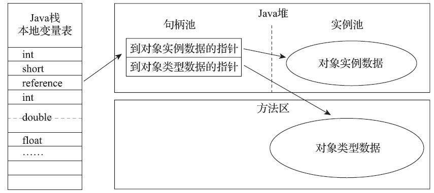

# 1	Java 内存区域与内存溢出异常

## 1.0

##### Java 中的内存泄露与内存溢出问题

在虚拟机自动内存管理机制的帮助下，Java 不再需要为每一个 new 操作编写配对的 delete/free 代码，不容易出现内存泄漏和内存溢出问题。

但是，因为 Java 把控制内存的权力交给了 Java 虚拟机，一旦出现内存泄漏和溢出方面的问题，如果不了解虚拟机是怎样使用内存的，那排查错误、修正问题就会成为一项异常艰难的工作。

---

<div STYLE="page-break-after: always;"><br/><br/><br/><br/><br/></div>

## 1.1	运行时数据区域

##### 简介

Java 虚拟机在执行 Java 程序的过程中会把它所管理的内存划分为若干个不同的数据区域。这些区域有各自的用途以及创建和销毁时间，有的区域随虚拟机进程的启动而一直存在，有些区域则是依赖用户线程的启动和结束而建立和销毁。

<br/>

##### Java 虚拟机运行时数据区


<br/>

##### 程序计数器

###### 简介

- 程序计数器（Program Counter Register）是一块较小的内存空间，它可以看作是 **当前线程所执行的字节码的行号指示器**。在 Java 虚拟机的概念模型[^1.1-1]里，字节码解释器工作时就是通过改变这个计数器的值来选取下一条需要执行的字节码指令，它是 **程序控制流的指示器**，分支、循环、跳转、异常处理、线程恢复等基础功能都需要依赖这个计数器来完成。

###### 每条线程都有独立的程序计数器

- 由于 Java 虚拟机的多线程是通过线程轮流切换、分配处理器执行时间的方式来实现的，在任何一个确定的时刻，一个处理器[^1.1-2]都只会执行一条线程中的指令。因此，为了线程切换后能恢复到正确的执行位置，每条线程都需要有一个独立的程序计数器，各条线程之间计数器互不影响，独立存储，我们称这类内存区域为**“线程私有”**的内存。

###### 执行本地方法时，程序计数器的值为空

- 如果线程正在执行的是一个 Java 方法，这个计数器记录的是正在执行的虚拟机字节码指令的地址；如果正在执行的是本地（Native）方法，这个计数器值则应为空（Undefined）。

###### 程序计数器没有规定 OutOfMemoryError 情况

- 此内存区域是唯一一个在《Java 虚拟机规范》中没有规定任何 OutOfMemoryError 情况的区域。

<br/>

##### Java 虚拟机栈

###### 线程私有

- 与程序计数器一样，Java虚拟机栈（Java Virtual Machine Stack）也是 **线程私有的**，它的生命周期与线程相同。

###### 虚拟机栈描述的是 Java 方法执行的线程内存模型

- 每个方法被执行的时候，Java 虚拟机都会同步创建一个栈帧（Stack Frame）用于存储 **局部变量表**、操作数栈、动态连接、方法出口等信息。每一个方法被调用直至执行完毕的过程，就对应着一个栈帧在虚拟机栈中从入栈到出栈的过程。

###### 栈内存与虚拟机栈

- 经常有人把 Java 内存区域 **笼统** 地划分为堆内存（Heap）和栈内存（Stack）。“栈” 通常就是指虚拟机栈，或者更多的情况下只是指虚拟机栈中局部变量表部分。

###### 局部变量表

- 局部变量表存放了编译期可知的各种 Java 虚拟机基本数据类型[^1.1-3]、对象引用[^1.1-4]和 returnAddress 类型[^1.1-5]。

  这些数据类型在局部变量表中的存储空间以局部变量槽（Slot）来表示，其中64位长度的 long 和 double 类型的数据会占用两个变量槽，其余的数据类型只占用一个。

  局部变量表所需的内存空间在编译期间完成分配，当进入一个方法时，这个方法需要在栈帧中分配多大的局部变量空间是完全确定的，在方法运行期间不会改变局部变量表的大小[^1.1-6]。

###### 虚拟机栈的异常状况

- 在《Java 虚拟机规范》中，对这个内存区域规定了两类异常状况：

  - 如果线程请求的栈深度大于虚拟机所允许的深度，将抛出 StackOverflowError 异常；
  - 如果 Java 虚拟机栈容量可以动态扩展，当栈扩展时无法申请到足够的内存会抛出 OutOfMemoryError 异常。

  HotSpot 虚拟机的栈容量是不可以动态扩展的。所以在 HotSpot 虚拟机上是不会由于虚拟机栈无法扩展而导致 OutOfMemoryError 异常——只要线程申请栈空间成功了就不会有 OOM ，但是如果申请时就失败，仍然会出现OOM 异常。

<br/>

##### 本地方法栈

###### 简介

- 本地方法栈（Native Method Stacks）与虚拟机栈所发挥的作用是非常相似的，其区别只是虚拟机栈为虚拟机执行 Java 方法（也就是字节码）服务，而本地方法栈则是为虚拟机使用到的 **本地（Native）方法** 服务。

###### 本地方法栈的虚拟机实现没有强制规定

- 《Java 虚拟机规范》对本地方法栈中方法使用的语言、使用方式与数据结构并没有任何强制规定，因此 **具体的虚拟机可以根据需要自由实现它**，甚至有的 Java 虚拟机（譬如Hot-Spot虚拟机）直接就把本地方法栈和虚拟机栈合二为一。


###### 本地方法栈的异常情况

- 与虚拟机栈一样，本地方法栈也会在栈深度溢出或者栈扩展失败时分别抛出 StackOverflowError 和 OutOfMemoryError 异常。

<br/>

##### Java 堆

###### 简介

- 对于 Java 应用程序来说，Java 堆（Java Heap）是虚拟机所管理的内存中 **最大** 的一块。Java 堆是 **被所有线程共享** 的一块内存区域，**在虚拟机启动时创建**。**此内存区域的唯一目的就是存放对象实例**，Java 世界里 **“几乎”** 所有的对象实例都在这里分配内存[^1.1-7]。

###### Java 堆也被称为 GC 堆

- Java 堆是垃圾收集器管理的内存区域，因此一些资料中它也被称作**“GC堆”**（Garbage CollectedHeap）。

###### Java 堆的划分

- - 从回收内存的角度看，由于现代垃圾收集器大部分都是基于 **分代收集理论** 设计的，所以 Java 堆中经常会出现“新生代”、“老年代”、“永久代”、“Eden间”、“From Survivor空间”、“To Survivor空间”等名词[^1.1-8]。

  - 如果从分配内存的角度看，所有线程共享的 Java 堆中可以划分出多个线程私有的分配缓冲区（Thread Local Allocation Buffer，TLAB），以提升对象分配时的效率。

  不过无论从什么角度，无论如何划分，都不会改变 Java 堆中存储内容的共性，无论是哪个区域，存储的都只能是对象的实例，将 Java 堆细分的目的只是为了更好地回收内存，或者更快地分配内存。

###### Java 堆的实现

- 根据《Java虚拟机规范》的规定，**Java 堆可以处于物理上不连续的内存空间中，但在逻辑上它应该被视为连续的**[^1.1-9]。但对于大对象（典型的如数组对象），多数虚拟机实现出于实现简单、存储高效的考虑，很可能会要求连续的内存空间。

  Java 堆既可以被实现成固定大小的，也可以是可扩展的，不过当前主流的 Java 虚拟机都是按照可扩展来实现的（通过参数 `-Xmx` 和 `-Xms` 设定）。

###### Java 堆的异常情况

- 如果在 Java 堆中 **没有足够内存完成实例分配，并且堆也无法再扩展时**，Java 虚拟机将会抛出 OutOfMemoryError 异常。

<br/>

##### 方法区

###### 简介

- 方法区（Method Area）与 Java 堆一样，是各个线程共享的内存区域，它 **用于存储已被虚拟机加载的类型信息、常量、静态变量、即时编译器编译后的代码缓存等数据**。虽然《Java 虚拟机规范》中把方法区描述为堆的一个逻辑部分，但是它却有一个别名叫作“非堆”（Non-Heap），目的是与 Java 堆区分开来。

###### 方法区与永久代

- 在 JDK 8 以前，HotSpot 虚拟机设计团队选择把收集器的分代设计扩展至方法区，或者说使用永久代来实现方法区[^1.1-10]。这导致很多人都更愿意把方法区称呼为“永代”（Permanent Generation），或将两者混为一谈。但是，本质上这两者并不是等价的。甚至对于其他虚拟机实现，譬如 BEA JRockit、IBM J9 等来说，**是不存在永久代的概念的**。

  原则上如何实现方法区属于虚拟机实现细节，不受《Java 虚拟机规范》管束，并不要求统一。但现在回头来看，HotSpot 当年使用永久代来实现方法区的决定并不是一个好主意，这种设计导致了 Java 应用更容易遇到内存溢出的问题[^1.1-11]，而且有极少数方法（例如 `String::intern()`）会因永久代的原因而导致不同虚拟机下有不同的表现。考虑到 HotSpot 未来的发展，在 JDK 6的时候 HotSpot 开发团队就有放弃永久代，逐步改为采用本地内存（Native Memory）来实现方法区的计划了，到了 JDK 7 的 HotSpot，已经把原本放在永久代的字符串常量池、静态变量等移出，而到了JDK 8，终于完全废弃了永久代的概念，改用与 JRockit、J9 一样在本地内存中实现的元空间（Meta-space）来代替，把 JDK 7 中永久代还剩余的内容（主要是类型信息）全部移到元空间中。

###### 方法区的实现与垃圾收集

- 《Java虚拟机规范》对方法区的约束是非常宽松的，除了和 Java 堆一样不需要连续的内存和可以选择固定大小或者可扩展外，甚至还可以选择不实现垃圾收集。

  相对而言，垃圾收集行为在这个区域的确是比较少出现的，但并非数据进入了方法区就如永久代的名字一样“永久”存在了。这区域的内存回收目标主要是针对常量池的回收和对类型的卸载，一般来说这个区域的回收效果比较难令人满意，尤其是类型的卸载，条件相当苛刻，但是这部分区域的回收有时又确实是必要的[^1.1-12]。

###### 方法区的异常情况

- 根据《Java 虚拟机规范》的规定，如果方法区无法满足新的内存分配需求时，将抛出 OutOfMemoryError 异常。

<br/>

##### 运行时常量池

###### 简介

- 运行时常量池（Runtime Constant Pool）**是方法区的一部分**。Class 文件中除了有类的版本、字段、方法、接口等描述信息外，还有一项信息是常量池表（Constant Pool Table），用于存放编译期生成的各种字面量与符号引用，这部分内容将在类加载后存放到方法区的运行时常量池中。

###### 运行时常量池的实现

- Java 虚拟机对于 Class 文件每一部分（自然也包括常量池）的格式都有严格规定，如每一个字节用于存储哪种数据都必须符合规范上的要求才会被虚拟机认可、加载和执行，但对于运行时常量池，《Java 虚拟机规范》并没有做任何细节的要求，不同提供商实现的虚拟机可以按照自己的需要来实现这个内存区域，不过一般来说，除了保存 Class 文件中描述的符号引用外，还会把由符号引用翻译出来的直接引用也存储在运行时常量池中。

###### 运行时常量池具备动态性

- 运行时常量池相对于 Class 文件常量池的另外一个重要特征是具备动态性，Java 语言并不要求常量一定只有编译期才能产生，也就是说，并非预置入 Class 文件中常量池的内容才能进入方法区运行时常量池，运行期间也可以将新的常量放入池中，这种特性被开发人员利用得比较多的便是 String 类的intern()方法。

###### 运行时常量池的异常情况

- 既然运行时常量池是方法区的一部分，自然受到方法区内存的限制，当常量池无法再申请到内存时会抛出 OutOfMemoryError 异常。

<br/>

##### 直接内存

###### 简介

- 直接内存（Direct Memory）并不是虚拟机运行时数据区的一部分，也不是《Java虚拟机规范》中定义的内存区域。但是这部分内存也被频繁地使用，而且也可能导致 OutOfMemoryError 异常出现，所以必须了解。

###### NIO

- 在 JDK 1.4中新加入了NIO（New Input/Output）类，引入了一种基于通道（Channel）与缓冲区（Buffer）的I/O方式，它可以**使用 Native 函数库直接分配堆外内存**，然后通过一个存储在Java堆里面的 DirectByteBuffer 对象作为这块内存的引用进行操作。这样能在一些场景中显著提高性能，因为避免了在 Java 堆和 Native 堆中来回复制数据。

  显然，**本机直接内存的分配不会受到 Java 堆大小的限制**，但是，既然是内存，则肯定还是会受到本机总内存大小[^1.1-13]以及处理器寻址空间的限制。

  一般服务器管理员配置虚拟机参数时，会根据实际内存去设置 -Xmx 等参数信息，但经常忽略掉直接内存，使得各个内存区域总和大于物理内存限制（包括物理的和操作系统级的限制），从而导致动态扩展时出现 OutOfMemoryError 异常。

<br/>

---

[^1.1-1]:概念模型”这个词会经常被提及，它代表了所有虚拟机的统一外观，但各款具体的Java虚拟机并不一定要完全照着概念模型的定义来进行设计，可能会通过一些更高效率的等价方式去实现它。

[^1.1-2]: 对于多核处理器来说则是一个内核。

[^1.1-3]: boolean、byte、char、short、int、float、long、double

[^1.1-4]: reference 类型，它并不等同于对象本身，可能是一个指向对象起始地址的引用指针，也可能是指向一个代表对象的句柄或者其他与此对象相关的位置。

[^1.1-5]: 指向了一条字节码指令的地址。

[^1.1-6]: 请注意，这里说的“大小”是指变量槽的数量，虚拟机真正使用多大的内存空间（譬如按照1个变量槽占用32个比特、64个比特，或者更多）来实现一个变量槽，是完全由具体的虚拟机实现自行决定的事情。

[^1.1-7]: 在《Java 虚拟机规范》中对 Java 堆的描述是：“所有的对象实例以及数组都应当在堆上分配”，而这里的“几乎”是指从实现角度来看，随着 Java语言的发展，现在已经能看到些许迹象表明日后可能出现值类型的支持，即使只考虑现在，由于即时编译技术的进步，尤其是逃逸分析技术的日渐强大，栈上分配、标量替换优化手段已经导致一些微妙的变化悄然发生，所以说 Java 对象实例都分配在堆上也渐渐变得不是那么绝对了。
[^1.1-8]: 但是这些区域划分仅仅是一部分垃圾收集器的共同特性或者说设计风格而已，而非某个 Java 虚拟机具体实现的固有内存布局，更不是《Java 虚拟机规范》里对 Java 堆的进一步细致划分。不少资料中之所以将堆进行上述划分，主要是因为曾经的主流虚拟机 HotSpot 采用这种设计，但是随着垃圾收集器技术的发展，该设计已经不再被普遍采用了。
[^1.1-9]: 这点就像我们用磁盘空间去存储文件一样，并不要求每个文件都连续存放。
[^1.1-10]: 这样使得 HotSpot 的垃圾收集器能够像管理 Java 堆一样管理这部分内存，省去专门为方法区编写内存管理代码的工作。
[^1.1-11]: 永久代有 -XX：MaxPermSize 的上限，即使不设置也有默认大小，而 J9 和 JRockit 只要没有触碰到进程可用内存的上限，例如32位系统中的4GB限制，就不会出问题。
[^1.1-12]: 以前 Sun 公司的 Bug 列表中，曾出现过的若干个严重的 Bug 就是由于低版本的 HotSpot 虚拟机对此区域未完全回收而导致内存泄漏。
[^1.1-13]: 包括物理内存、SWAP分区或者分页文件。

<div STYLE="page-break-after: always;"><br/><br/><br/><br/><br/></div>

## 1.2	HotSpot 虚拟机对象

##### 创建对象

###### 语言层面的对象创建

- 在语言层面上，创建对象通常[^1.2-1]仅仅是使用了一个 new 关键字。

###### 虚拟机中的对象创建过程

1. 当 Java 虚拟机遇到一条字节码 new 指令时，首先将去检查这个指令的参数是否能在常量池中定位到一个类的符号引用，并且检查这个符号引用代表的类是否已被加载、解析和初始化过。如果没有，那必须先执行相应的类加载过程。

2. 在类加载检查通过后，接下来虚拟机将为新生对象分配内存。对象所需内存的大小在类加载完成后便可完全确定，为对象分配空间的任务实际上便等同于把一块确定大小的内存块从 Java 堆中划分出来。

3. 内存分配完成之后，虚拟机必须将分配到的内存空间（但不包括对象头）都初始化为零值，如果使用了 [TLAB][1] 的话，这一项工作也可以提前至 TLAB 分配时顺便进行。这步操作保证了对象的实例字段在 Java 代码中可以不赋初始值就直接使用，使程序能访问到这些字段的数据类型所对应的零值。

4. 接下来，Java 虚拟机还要对对象进行必要的设置，例如这个对象是哪个类的实例、如何才能找到类的元数据信息、对象的哈希码[^1.2-2]之中。根据虚拟机当前运行状态的不同，如是否启用偏向锁等，对象头会有不同的设置方式。

5. 在上面工作都完成之后**，从虚拟机的视角来看，一个新的对象已经产生了**。但是从 Java 程序的视角看来，对象创建才刚刚开始——构造函数，即 Class 文件中的 `<init>()` 方法还没有执行，所有的字段都为默认的零值，对象需要的其他资源和状态信息也还没有按照预定的意图构造好。

   一般来说[^1.2-3]，new 指令之后会接着执行 `<init>()` 方法，按照程序员的意愿对对象进行初始化，这样一个真正可用的对象才算完全被构造出来。

###### 对象内存的分配方式

- - **指针碰撞**：假设Java堆中内存是绝对规整的，所有被使用过的内存都被放在一边，空闲的内存被放在另一边，中间放着一个指针作为分界点的指示器，那所分配内存就仅仅是把那个指针向空闲空间方向挪动一段与对象大小相等的距离，这种分配方式称为 **“指针碰撞”（Bump The Pointer）**。
  - **空闲列表**：如果Java堆中的内存并不是规整的，已被使用的内存和空闲的内存相互交错在一起，那就没有办法简单地进行指针碰撞了，虚拟机就必须维护一个列表，记录上哪些内存块是可用的，在分配的时候从列表中找到一块足够大的空间划分给对象实例，并更新列表上的记录，这种分配方式称为 **“空闲列表”（Free List）**。

  选择哪种分配方式**由 Java 堆是否规整决定**，而 Java 堆是否规整又由所采用的垃圾收集器是否带有空间压缩整理（Compact）的能力决定。因此，当使用 Serial、ParNew 等带压缩整理过程的收集器时，系统采用的分配算法是指针碰撞，既简单又高效；而当使用 CMS 这种基于清除（Sweep）算法的收集器时，**理论上** 就只能采用较为复杂的空闲列表来分配内存[^1.2-4]。

###### 对象创建的线程安全

- 对象创建在虚拟机中是非常频繁的行为，即使仅仅修改一个指针所指向的位置，在并发情况下也并不是线程安全的，可能出现正在给对象 A 分配内存，指针还没来得及修改，对象 B 又同时使用了原来的指针来分配内存的情况。解决这个问题有两种可选方案：
  1. 一种是对分配内存空间的动作进行同步处理——实际上虚拟机是采用 CAS 配上失败重试的方式保证更新操作的原子性；
  2. 另外一种是把内存分配的动作按照线程划分在不同的空间之中进行，即每个线程在 Java 堆中预先分配一小块内存，称为<span id="1" style="display:none"> **本地线程分配缓冲（Thread Local Allocation Buffer，TLAB）**</span>，哪个线程要分配内存，就在哪个线程的本地缓冲区中分配，只有本地缓冲区用完了，分配新的缓存区时才需要同步锁定。虚拟机是否使用 TLAB，可以通过 `-XX：+/-UseTLAB` 参数来设定。

<br/>

##### 对象的内存布局

###### 对象的布局划分

- 在 HotSpot 虚拟机里，对象在堆内存中的存储布局可以划分为三个部分：
  1. 对象头（Header）
  2. 实例数据（Instance Data）
  3. 对齐填充（Padding）。

###### 对象头

- HotSpot 虚拟机对象的对象头部分包括两类信息：

  1. 第一类是 **用于存储对象自身的运行时数据**，如哈希码（HashCode）、GC分代年龄、锁状态标志、线程持有的锁、偏向线程ID、偏向时间戳等，这部分数据的长度在32位和64位的虚拟机（未开启压缩指针）中分别为32个比特和64个比特，官方称它为 **“Mark Word”**。

     对象需要存储的运行时数据很多，其实已经超出了32、64位 Bitmap 结构所能记录的最大限度，但对象头里的信息是与对象自身定义的数据无关的额外存储成本，考虑到虚拟机的空间效率，Mark Word 被设计成一个有着动态定义的数据结构，以便在极小的空间内存储尽量多的数据，根据对象的状态复用自己的存储空间。

     以32位的 HotSpot 虚拟机为例，如果对象未被同步锁锁定， Mark Word 的32个比特存储空间中的25个比特用于存储对象哈希码，4个比特用于存储对象分代年龄，2个比特用于存储锁标志位，1个比特固定为0。
  
  2. 对象头的另外一部分是 **类型指针**，即 **对象指向它的类型元数据的指针**，Java 虚拟机通过该指针来确定该对象是哪个类的实例[^1.2-5]。此外，如果对象是一个 Java 数组，那在对象头中还必须有一块用于记录数组长度的数据，因为虚拟机可以通过普通 Java 对象的元数据信息确定 Java 对象的大小，但是如果数组的长度是不确定的，将无法通过元数据中的信息推断出数组的大小。

###### 实例数据

- 实例数据部分是 **对象真正存储的有效信息**，即我们在程序代码里面所定义的各种类型的字段内容，无论是从父类继承下来的，还是在子类中定义的字段都必须记录起来。

  这部分的存储顺序会受到虚拟机分配策略参数（`-XX：FieldsAllocationStyle` 参数）和字段在 Java 源码中定义顺序的影响。HotSpot 虚拟机默认的分配顺序为 longs/doubles、ints、shorts/chars、bytes/booleans、oops（Ordinary Object Pointers），从以上默认的分配策略中可以看到，相同宽度的字段总是被分配到一起存放，在满足这个前提条件的情况下，在父类中定义的变量会出现在子类之前。如果 HotSpot 虚拟机的 `+XX：CompactFields` 参数值为 `true`（默认即为 true），那子类之中较窄的变量也允许插入父类变量的空隙之中，以节省出一点点空间。

###### 对其填充

- 对象的第三部分是对齐填充，这并不是必然存在的，也没有特别的含义，它仅仅起着占位符的作用。由于 HotSpot 虚拟机的自动内存管理系统要求对象起始地址必须是8字节的整数倍，换句话说就是 **任何对象的大小都必须是8字节的整数倍**。对象头部分已经被精心设计成正好是8字节的倍数（1倍或者2倍），因此，如果对象实例数据部分没有对齐的话，就需要通过对齐填充来补全。

<br/>

##### 对象的访问定位

###### Java 通过 reference 数据访问对象

- Java 程序会通过栈上的 reference 数据来操作堆上的具体对象。由于 reference 类型在《Java虚拟机规范》里面只规定了它是一个指向对象的引用，并没有定义这个引用应该通过什么方式去定位、访问到堆中对象的具体位置，所以对象访问方式也是由虚拟机实

  现而定的。

###### 主流的对象访问方式

- - **使用句柄访问**：如果使用句柄访问的话，Java 堆中将可能会划分出一块内存来作为句柄池，reference 中存储的就是对象的句柄地址，而句柄中包含了对象实例数据与类型数据各自具体的地址信息，其结构如下图所示。

  

  - **使用直接指针访问**：如果使用直接指针访问的话，Java 堆中对象的内存布局就必须考虑如何放置访问类型数据的相关信息，reference 中存储的直接就是对象地址，如果只是访问对象本身的话，就不需要多一次间接访问的开销，其结构如下图所示。

    

<br/>

---

[^1.2-1]: 例外：复制、反序列化。
[^1.2-2]: 实际上对象的哈希码会延后到真正调用 Object::hashCode() 方法时才计算）*、对象的 GC 分代年龄等信息。这些信息存放在对象的对象头（Object Header。
[^1.2-3]: 这由字节码流中 new 指令后面是否跟随 invokespecial 指令所决定，Java 编译器会在遇到 new 关键字的地方同时生成这两条字节码指令，但如果直接通过其他方式产生的则不一定如此。
[^1.2-4]: 强调“理论上”是因为在 CMS 的实现里面，为了能在多数情况下分配得更快，设计了一个叫作 Linear Allocation Buffer 的分配缓冲区，通过空闲列表拿到一大块分配缓冲区之后，在它里面仍然可以使用指针碰撞方式来分配。
[^1.2-5]: 并不是所有的虚拟机实现都必须在对象数据上保留类型指针，换句话说，查找对象的元数据信息并不一定要经过对象本身。

<div STYLE="page-break-after: always;"><br/><br/><br/><br/><br/></div>

## 1.3	OutOfMemory 异常

### 1.3.1	Java 堆溢出

##### Java 堆溢出的提示信息

- Java 堆内存的 OutOfMemoryError 异常是实际应用中最常见的内存溢出异常情况。出现 Java 堆内存溢出时，异常堆栈信息 “java.lang.OutOfM emoryError” 会跟随进一步提示 “Java heap space”。

<br/>

##### Java 堆溢出的触发条件

- Java 堆用于储存对象实例，我们只要不断地创建对象，并且保证 GC Roots 到对象之间有可达路径来避免垃圾回收机制清除这些对象，那么随着对象数量的增加，总容量触及最大堆的容量限制后就会产生内存溢出异常。

<br/>

##### 例——Java 堆溢出异常触发演示

```java
package JavaVirtualMachine;

import java.util.ArrayList;
import java.util.List;

/**
 * 通过设置虚拟机参数限制 Java 堆的大小为 20 MB，不可扩展（将堆的最小值-Xms参数与最大值-Xmx参数设置为一样即可避免堆自动扩展）
 * VM Args：-Xms20m -Xmx20m -XX:+HeapDumpOnOutOfMemoryError
 * @author zzm
 */
class OOMObject {}

public class HeapOOM {
    public static void main(String[] args) {

        List<OOMObject> list = new ArrayList<OOMObject>();

        while (true) {
            list.add(new OOMObject());
        }
    }
}
```

- 运行结果：

  ```
  Exception in thread "main" java.lang.OutOfMemoryError: Java heap space
  	at java.base/java.util.Arrays.copyOf(Arrays.java:3720)
  	at java.base/java.util.Arrays.copyOf(Arrays.java:3689)
  	at java.base/java.util.ArrayList.grow(ArrayList.java:238)
  	at java.base/java.util.ArrayList.grow(ArrayList.java:243)
  	at java.base/java.util.ArrayList.add(ArrayList.java:486)
  	at java.base/java.util.ArrayList.add(ArrayList.java:499)
  	at JavaVirtualMachine.HeapOOM.main(HeapOOM.java:27)
  ```

<br/>

##### 📌解决堆溢出异常

###### 内存映像分析工具

- 要解决这个内存区域的异常，常规的处理方法是首先通过内存映像分析工具[^1.3.1-1]对 Dump 出来的堆转储快照进行分析。第一步首先应 **确认内存中导致 OOM 的对象是否是必要的**，也就是要先分清楚到底是出现了内存泄漏（Memory Leak）还是内存溢出（MemoryOverflow）。

###### 📌解决内存泄漏导致的堆溢出异常

- 如果是内存泄漏，可进一步通过工具查看泄漏对象到 GC Roots 的引用链，找到泄漏对象是通过怎样的引用路径、与哪些GC Roots相关联，才导致垃圾收集器无法回收它们，根据泄漏对象的类型信息以及它到 GC Roots引 用链的信息，一般可以比较准确地定位到这些对象创建的位置，进而找出产生内存泄漏的代码的具体位置。

###### 📌解决内存溢出导致的堆溢出异常

- 如果不是内存泄漏，换句话说就是内存中的对象确实都是必须存活的，那就应当检查 Java 虚拟机的堆参数（-Xmx与-Xms）设置，与机器的内存对比，看看是否还有向上调整的空间。再从代码上检查是否存在某些对象生命周期过长、持有状态时间过长、存储结构设计不合理等情况，尽量减少程序运行期的内存消耗。

<br/>

---

[^1.3.1-1]: 如 Eclipse Memory Analyzer 或 IDEA 插件 JProfiler

<div STYLE="page-break-after: always;"><br/><br/><br/><br/><br/></div>

### 1.3.2	虚拟机栈和本地方法栈溢出

##### HopSpot 虚拟机的栈容量设置

- 由于 HotSpot 虚拟机中并不区分虚拟机栈和本地方法栈，因此对于 HotSpot 来说，`-Xoss` 参数（设置本地方法栈大小）虽然存在，但实际上是没有任何效果的，栈容量只能由 `-Xss` 参数来设定。

 <br/>

##### HopSpot 虚拟机的栈溢出异常

- 《Java 虚拟机规范》明确允许 Java 虚拟机实现自行选择是否支持栈的动态扩展，而 HotSpot 虚拟机的选择是不支持扩展，所以除非在创建线程申请内存时就因无法获得足够内存而出现 OutOfMemoryError 异常，否则在线程运行时是不会因为扩展而导致内存溢出的，只会因为栈容量无法容纳新的栈帧而导致 StackOverflowError 异常[^1.3.2-1]。

<br/>

##### 多线程导致的栈 OutOfMemoryError 异常

- 通过不断建立线程的方式，在 HotSpot 上也是可以产生内存溢出异常的。但是 **这样产生的内存溢出异常和栈空间是否足够并不存在任何直接的关系，主要取决于操作系统本身的内存使用状态**。甚至可以说，在这种情况下，给每个线程的栈分配的内存越大，反而越容易产生内存溢出异常。

  原因其实不难理解，操作系统分配给每个进程的内存是有限制的，譬如 32位 Windows 的单个进程最大内存限制为 2GB。HotSpot 虚拟机提供了参数控制 Java 堆和方法区这两部分的内存的最大值，那剩余的内存即为 2GB（操作系统限制）减去最大堆容量，再减去最大方法区容量，由于程序计数器消耗内存很小，可以忽略掉，如果把直接内存和虚拟机进程本身耗费的内存也去掉的话，剩下的内存就由虚拟机栈和本地方法栈来分配了。因此为每个线程分配到的栈内存越大，可以建立的线程数量自然就越少，建立线程时就越容易把剩下的内存耗尽。

<br/>

##### 📌解决虚拟机栈和本地方法栈溢出异常

###### 📌解决 StackOverflowError

- 出现 StackOverflowError 异常时，会有明确错误堆栈可供分析，相对而言比较容易定位到问题所在。如果使用 HotSpot 虚拟机默认参数，栈深度在大多数情况下[^1.3.2-2]到达 1000~2000 完全没有问题，对于正常的方法调用（包括不能做尾递归优化的递归调用），这个深度应该完全够用了。

###### 📌解决建立过多线程导致的内存溢出

- 如果是建立过多线程导致的内存溢出，在不能减少线程数量或者更换64位虚拟机的情况下，就只能通过 **减少最大堆和减少栈容量来换取更多的线程**。

  这种通过“减少内存”的手段来解决内存溢出的方式，如果没有这方面处理经验，一般比较难以想到，这一点读者需要在开发32位系统的多线程应用时注意。也是由于这种问题较为隐蔽，从 JDK 7 起，以上提示信息中 “unable to create native thread”后面，虚拟机会特别注明原因可能是 “possiblyout of memory or process/resource limits reached”。

<br/>

---

[^1.3.2-1]:在《深入理解Java虚拟机：JVM高级特性与最佳实践（第3版）》的 2.4.2 虚拟机栈和本地方法栈溢出 一节中对此进行了验证。
[^1.3.2-2]:因为每个方法压入栈的帧大小并不是一样的，所以只能说大多数情况下。

<div STYLE="page-break-after: always;"><br/><br/><br/><br/><br/></div>

### 1.3.3	方法区和运行时常量池溢出[^1.3.3-1]

##### 使用“永久代”还是“元空间”来实现方法区对程序的影响[^1.3.3-2]

- 由于在 JDK 6 或更早之前的 HotSpot 虚拟机中，运行时常量池属于方法区（即JDK 6的HotSpot虚拟机中的永久代）的一部分。这导致运行时常量池溢出时，会提示 “PermGen space”。

<br/>

##### 运行时生成大量动态类导致方法区溢出的场景

###### CGLib 技术

- 当前的很多主流框架，如 Spring、Hibernate 对类进行增强时，都会使用到CGLib这类字节码技术，当增强的类越多，就需要越大的方法区以保证动态生成的新类型可以载入内存。

###### 动态语言

- 很多运行于 Java 虚拟机上的动态语言（例如 Groovy 等）通常都会持续创建新类型来支撑语言的动态性，随着这类动态语言的流行也会导致方法区溢出越来越常见。

<br/>

##### 元空间对永久代的替代

- 在 JDK 8 以后，永久代便完全退出了历史舞台，元空间作为其替代者登场。在默认设置下，正常的动态创建新类型已经很难再迫使虚拟机产生方法区的溢出异常了，但是为了让使用者预防实际应用里出现的内存溢出，虚拟机还是提供了预防措施。


<br/>

##### 元空间对内存溢出的预防措施

###### -XX：MaxM etaspaceSize

- 设置元空间最大值，默认是-1，即不限制，或者说只受限于本地内存大小。

###### -XX：MetaspaceSize

- 指定元空间的初始空间大小，以字节为单位，达到该值就会触发垃圾收集进行类型卸载，同时收集器会对该值进行调整：如果释放了大量的空间，就适当降低该值；如果释放了很少的空间，那么在不超过-XX：M axM etaspaceSize（如果设置了的话）的情况下，适当提高该值。

###### -XX：MinM etaspaceFreeRatio

- 作用是在垃圾收集之后控制最小的元空间剩余容量的百分比，可减少因为元空间不足导致的垃圾收集的频率。类似的还有-XX：M ax-M etaspaceFreeRatio，用于控制最大的元空间剩余容量的百分比。

<br/>

---

[^1.3.3-1]: 由于运行时常量池是方法区的一部分，所以这两个区域的溢出测试可以放到一起进行。
[^1.3.3-2]: 在《深入理解Java虚拟机：JVM高级特性与最佳实践（第3版）》的 2.4.3 方法区和运行时常量池溢出 中对此进行了验证。

<div STYLE="page-break-after: always;"><br/><br/><br/><br/><br/></div>

### 1.3.4	本机直接内存溢出

##### 设置直接内存的大小

- 直接内存（Direct M emory）的容量大小可通过 `-XX：MaxDirectM emorySize` 参数来指定，如果不去指定，则默认与 Java 堆最大值（由 `-Xmx` 指定）一致。

<br/>

##### 判断与解决本机直接内存溢出

- 由直接内存导致的内存溢出，一个明显的特征是**在 Heap Dump 文件中不会看见有什么明显的异常情况**，如果读者发现内存溢出之后产生的 Dump 文件很小，而程序中又直接或间接使用了 DirectMemory（典型的间接使用就是 NIO），那就可以考虑重点检查一下直接内存方面的原因了。

<br/>

---


<div STYLE="page-break-after: always;"><br/><br/><br/><br/><br/></div>

# 2	垃圾收集器与内存分配策略

## 2.0	

##### 为什么要了解垃圾收集和内存分配

- 当需要排查各种内存溢出、内存泄漏问题时；或当垃圾收集成为系统达到更高并发量的瓶颈时，我们就必须对“自动化”的垃圾收集和内存分配技术实施必要的监控和调节。

<br/>

##### 垃圾回收关注的三个问题

- 哪些内存需要回收？
- 什么时候回收？
- 如何回收？

<br/>

##### Java 垃圾回收的重点区域

- **程序计数器**、**虚拟机栈**、**本地方法栈** 3个区域随线程而生，随线程而灭，栈中的栈帧随着方法的进入和退出而有条不紊地执行着出栈和入栈操作。每一个栈帧中分配多少内存基本上是在类结构确定下来时就已知的（尽管在运行期会由即时编译器进行一些优化，但在基于概念模型的讨论里，大体上可以认为是编译期可知的），因此 **这几个区域的内存分配和回收都具备确定性，在这几个区域内就不需要过多考虑如何回收的问题**，当方法结束或者线程结束时，内存自然就跟随着回收了。

  **而 Java 堆和 方法区 这两个区域则有着很显著的不确定性**：

  1. 一个接口的多个实现类需要的内存可能会不一样，
  2. 一个方法所执行的不同条件分支所需要的内存也可能不一样。
  3. 只有处于运行期间，我们才能知道程序究竟会创建哪些对象，创建多少个对象，这部分内存的分配和回收是动态的。

  **垃圾收集器所关注的正是这部分内存该如何管理**。

---

<div STYLE="page-break-after: always;"><br/><br/><br/><br/><br/></div>

## 2.1	存活判定算法

### 2.1.1	引用技术法

##### 简介

- 引用计数算法（Reference Counting）是一种经典的垃圾回收算法，有许多著名应用案例[^2.1.1-1]。但是，在 Java 领域，至少主流的 Java 虚拟机里面都没有选用引用计数算法来管理内存。

<br/>

##### 引用计数法的原理

- 在对象中添加一个引用计数器，每当有一个地方引用它时，计数器值就加一；当引用失效时，计数器值就减一；任何时刻计数器为零的对象就是不可能再被使用的。

<br/>

##### 引用计数法的优缺点

- 引用计数算法虽然占用了一些额外的内存空间来进行计数，但它的原理简单，判定效率也很高，在大多数情况下它都是一个不错的算法。

  但是，这个看似简单的算法有很多例外情况要考虑，**必须要配合大量额外处理才能保证正确地工作**，譬如单纯的引用计数就很难解决对象之间相互循环引用的问题。

<br/>

##### 例——对象循环引用

```java
public class ReferenceCountingGC {
    
	public Object instance = null;
	
	private static final int _1MB = 1024 * 1024;

	/**
	* 这个成员属性的唯一意义就是占点内存，以便能在GC日志中看清楚是否有回收过
	*/
	private byte[] bigSize = new byte[2 * _1MB];

    
   
	public static void testGC() {
	    ReferenceCountingGC objA = new ReferenceCountingGC();
	    ReferenceCountingGC objB = new ReferenceCountingGC();
	    
	    objA.instance = objB;
	    objB.instance = objA;
	    
	    objA = null;
	    objB = null;
	    // 假设在这行发生GC，objA和objB是否能被回收？在 Java 中能被收回，因为 Java 虚拟机不采用应用计数算法。
	    System.gc();
	}

}
```

<br/>

---

[^2.1.1-1]: 例如微软 COM （Component Object M odel）技术、使用 ActionScript 3 的 FlashPlayer、Python 语言以及在游戏脚本领域得到许多应用的 Squirrel 中都使用了引用计数算法进行内存管理。

<div STYLE="page-break-after: always;"><br/><br/><br/><br/><br/></div>

### 2.1.2	可达性分析算法

##### 简介

- 当前主流的商用程序语言（Java、C#，上溯至古老的 Lisp）的内存管理子系统，都是通过可达性分析（Reachability Analysis）算法来判定对象是否存活的。

<br/>

##### 可达性分析算法的实现原理

- 通过一系列称为 **“GC Roots”** 的根对象作为起始节点集，从这些节点开始，根据引用关系向下搜索，搜索过程所走过的路径称为“引用链”（Reference Chain），如果某个对象到 GC Roots 间没有任何引用链相连，或者用图论的话来说就是从 GC Roots 到这个对象不可达时，则证明此对象是不可能再被使用的。

<br/>

##### Java 技术体系中，固定可作为 GC Roots 的对象包括以下几种

- 在虚拟机栈（栈帧中的本地变量表）中引用的对象，譬如各个线程被调用的方法堆栈中使用到的参数、局部变量、临时变量等。
- 在方法区中类静态属性引用的对象，譬如 Java 类的引用类型静态变量。
- 在方法区中常量引用的对象，譬如字符串常量池（String Table）里的引用。
- 在本地方法栈中 JNI（即通常所说的 Native 方法）引用的对象。
- Java虚拟机内部的引用，如基本数据类型对应的 Class 对象，一些常驻的异常对象（比如NullPointExcepiton、OutOfM emoryError）等，还有系统类加载器。
- 所有被同步锁（synchronized关键字）持有的对象。
- 反映 Java 虚拟机内部情况的 JMXBean、JVMTI 中注册的回调、本地代码缓存等。

<br/>

##### 根据选用的垃圾收集器以及当前回收的内存区域不同，“临时性”加入地对象

- 譬如局部回收（Partial GC）和分代回收，目前最新的几款垃圾收集器无一例外都具备了局部回收的特征，为了避免 GC Roots 包含过多对象而过度膨胀，它们在实现上也做出了各种优化处理。

  如果只针对 Java 堆中某一块区域发起垃圾收集时[^2.1.2-1]，必须考虑到内存区域是虚拟机自己的实现细节[^2.1.2-2]。而且堆各个区域之间不是孤立封闭的，所以某个区域里的对象完全有可能被位于堆中其他区域的对象所引用，这时候就需要将这些关联区域的对象也一并加入GC Roots集合中去，才能保证可达性分析的正确性。

---

<div STYLE="page-break-after: always;"><br/><br/><br/><br/><br/></div>

### 2.1.3	引用与垃圾回收

##### 对象存活与引用

- 无论是通过引用计数算法判断对象的引用数量，还是通过可达性分析算法判断对象是否引用链可达，判定对象是否存活都和“引用”离不开关系。

<br/>

##### JDK 1.2 之前对引用的定义

- 如果 reference 类型的数据中存储的数值代表的是另外一块内存的起始地址，就称该 reference 数据是代表某块内存、某个对象的引用。

  这种定义并没有什么不对，只是现在看来有些过于狭隘了，一个对象在这种定义下只有“被引用”或者“未被引用”两种状态，对于描述一些“食之无味，弃之可惜”的对象就显得无能为力。譬如我们希望能描述一类对象：当内存空间还足够时，能保留在内存之中，如果内存空间在进行垃圾收集后仍然非常紧张，那就可以抛弃这些对象——很多系统的 **缓存** 功能都符合这样的应用场景。

<br/>

##### JDK 1.2 之后，扩充的引用

###### 强引用

- 强引用是最传统的“引用”的定义，是指在程序代码之中普遍存在的引用赋值，即类似 `Object obj=new Object()` 这种引用关系。**无论任何情况下，只要强引用关系还存在，垃圾收集器就永远不会回收掉被引用的对象。**

###### 软引用

- 软引用是用来描述一些 **还有用，但非必须的对象**。只被软引用关联着的对象，在系统将要发生内存溢出异常前，会把这些对象列进回收范围之中进行第二次回收，如果这次回收还没有足够的内存，才会抛出内存溢出异常。在JDK 1.2版之后提供了 SoftReference 类来实现软引用。

###### 弱引用

- 弱引用也被用来描述那些非必须对象，但是它的强度比软引用更弱一些，被弱引用关联的对象只能生存到下一次垃圾收集发生为止。当垃圾收集器开始工作，无论当前内存是否足够，都会回收掉只被弱引用关联的对象。在JDK 1.2版之后提供了WeakReference类来实现弱引用。

###### 虚引用

- 虚引用也称为“幽灵引用”或者“幻影引用”，它是最弱的一种引用关系。一个对象是否有虚引用的存在，完全不会对其生存时间构成影响，也无法通过虚引用来取得一个对象实例。**为一个对象设置虚引用关联的唯一目的只是为了能在这个对象被收集器回收时收到一个系统通知。**在 JDK 1.2 版之后提供了 PhantomReference 类来实现虚引用。

<br/>

---

[^2.1.2-1]: 如最典型的只针对新生代的垃圾收集
[^2.1.2-2]: 在用户视角里任何内存区域都是不可见的

<div STYLE="page-break-after: always;"><br/><br/><br/><br/><br/></div>

### 2.1.4	对象死亡过程

##### 对象死亡的充分必要条件

- 即使在可达性分析算法中判定为不可达的对象，也不是“非死不可”的，这时候它们暂时还处于“缓刑”阶段。要真正宣告一个对象死亡，至少要经历两次标记过程。

<br/>

##### 对象死亡的具体过程

1. **第一次标记**：如果对象在进行可达性分析后发现没有与GC Roots相连接的引用链，那它将会被第一次标记，随后进行一次筛选，筛选的条件是此对象是否有必要执行 `finalize()` 方法。假如对象没有覆盖 `finalize()` 方法，或者 finalize() 方法已经被虚拟机调用过，那么虚拟机将这两种情况都视为“没有必要执行”。

   如果这个对象被判定为确有必要执行 `finalize()` 方法，那么该对象将会被放置在一个名为 F-Queue 的队列之中，并在稍后由一条由虚拟机自动建立的、低调度优先级的 Finalizer 线程去执行[^2.1.4-1]它们的 finalize() 方法。

2. **第二次标记**：`finalize()` 方法是对象逃脱死亡命运的最后一次机会，稍后收集器将对 F-Queue 中的对象进行第二次小规模的标记，如果对象要在 `finalize()` 中成功拯救自己[^2.1.4-2]那在第二次标记时它将被移出“即将回收”的集合[^2.1.4-3]；如果对象这时候还没有逃脱，那基本上它就真的要被回收了。

<br/>

##### 例——对象自我拯救演示

```Java
public class FinalizeEscapeGC {

    public static FinalizeEscapeGC SAVE_HOOK = null;

    public void isAlive() {
        System.out.println("yes, i am still alive :)");
    }

    @Override
    protected void finalize() throws Throwable {
        super.finalize();
        System.out.println("finalize method executed!");
        FinalizeEscapeGC.SAVE_HOOK = this;
    }

    public static void main(String[] args) throws Throwable {
        SAVE_HOOK = new FinalizeEscapeGC();
        
	//对象第一次成功拯救自己
        SAVE_HOOK = null;
        System.gc();
	// 因为Finalizer方法优先级很低，暂停0.5秒，以等待它
        Thread.sleep(500);
        if (SAVE_HOOK != null) {
            SAVE_HOOK.isAlive();
        } else {
            System.out.println("no, i am dead :(");
        }

	// 下面这段代码与上面的完全相同，但是这次自救却失败了，因为一个对象的 finalize() 方法最多只会被系统自动调用一次。
        SAVE_HOOK = null;
        System.gc();
	// 因为Finalizer方法优先级很低，暂停0.5秒，以等待它
        Thread.sleep(500);
        if (SAVE_HOOK != null) {
            SAVE_HOOK.isAlive();
        } else {
            System.out.println("no, i am dead :(");
        }
    }

}
```

<br/>

##### 📌不建议使用 finalize() 方法

- `finalize()` 是 Java 刚诞生时为了使传统C、C++程序员更容易接受 Java 所做出的一项**妥协**。它的运行代价高昂，不确定性大，无法保证各个对象的调用顺序，如今已被官方明确声明为不推荐使用的语法。有些教材中描述它适合做“关闭外部资源”之类的清理性工作，这完全是对 `finalize()` 用途的一种自我安慰。fi`nalize()` 能做的所有工作，使用 `try-finally` 或者其他方式都可以做得更好、更及时，所以笔者建议大家完全可以忘掉Java语言里面的这个方法。

<br/>

---

[^2.1.4-1]: 这里所说的“执行”是指虚拟机会触发这个方法开始运行，但并不承诺一定会等待它运行结束。这样做的原因是，如果某个对象的 finalize() 方法执行缓慢，或者更极端地发生了死循环，将很可能导致 F-Queue 队列中的其他对象永久处于等待，甚至导致整个内存回收子系统的崩溃。
[^2.1.4-2]: 只要重新与引用链上的任何一个对象建立关联即可，譬如把自己（this关键字）赋值给某个类变量或者对象的成员变量。
[^2.1.4-3]: 这种自救的机会只有一次，因为一个对象的 finalize() 方法最多只会被系统自动调用一次。

<div STYLE="page-break-after: always;"><br/><br/><br/><br/><br/></div>

### 2.1.5	方法区的垃圾回收

##### 《Java虚拟机规范》为什么不要求虚拟机在方法区中实现垃圾收集

- 《Java 虚拟机规范》中提到过可以不要求虚拟机在方法区中实现垃圾收集，事实上也确实有未实现或未能完整实现方法区类型卸载的收集器存在（如 JDK 11 时期的ZGC收集器就不支持类卸载）。

  这是因为方法区垃圾收集的“性价比”通常是比较低的：在 Java 堆中，尤其是在新生代中，对常规应用进行一次垃圾收集通常可以回收 70% 至 99% 的内存空间，相比之下，方法区回收囿于苛刻的判定条件，其区域垃圾收集的回收成果往往远低于此。

<br/>

##### 方法区垃圾收集主要回收的内容

- 方法区的垃圾收集主要回收两部分内容：
  1. 废弃的常量
  2. 不再使用的类型

<br/>

##### 方法区回收废弃常量的过程

- 回收废弃常量与Java 堆中的对象非常类似。举个常量池中字面量回收的例子，假如一个字符串“java”曾经进入常量池中，但是当前系统又没有任何一个字符串对象的值是 “java”[^2.1.5-1]。如果在这时发生内存回收，而且垃圾收集器判断确有必要的话，这个 “java”常量就将会被系统清理出常量池。

  常量池中其他类（接口）、方法、字段的符号引用也与此类似。

<br/>

##### 方法区回收不再使用的类型的过程

- 需要同时满足下面三个条件：

  1. 该类所有的实例都已经被回收，也就是 Java 堆中不存在该类及其任何派生子类的实例。
  2. 加载该类的类加载器已经被回收，这个条件除非是经过精心设计的可替换类加载器的场景，如 OSGi、JSP 的重加载等，否则通常是很难达成的。
  3. 该类对应的 java.lang.Class 对象没有在任何地方被引用，无法在任何地方通过反射访问该类的方法。

  Java 虚拟机 **被允许**[^2.1.5-2]对满足上述三个条件的无用类进行回收，关于是否要对类型进行回收，HotSpot虚拟机提供了-Xnoclassgc参数进行控制，还可以使用- verbose：class 以及 -XX：+TraceClass-Loading、-XX：+TraceClassUnLoading 查看类加载和卸载信息[^2.1.5-3]。

<br/>

##### 方法区回收的实际应用

- 在大量使用反射、动态代理、CGLib 等字节码框架，动态生成 JSP 以及 OSGi 这类频繁自定义类加载器的场景中，通常都需要 Java 虚拟具备类型卸载的能力，以保证不会对方法区造成过大的内存压力。

---

[^2.1.5-1]: 换句话说，已经没有任何字符串对象引用常量池中的“java”常量，且虚拟机中也没有其他地方引用这个字面量
[^2.1.5-2]: 这里说的仅仅是“被允许”，而并不是和对象一样，没有引用了就必然会回收。
[^2.1.5-3]: 其中 -verbose：class和-XX：+TraceClassLoading 可以在 Product 版的虚拟机中使用，-XX：+TraceClassUnLoading 参数需要FastDebug 版的虚拟机支持。

<div STYLE="page-break-after: always;"><br/><br/><br/><br/><br/></div>

## 2.2	垃圾回收算法

### 2.2.0	

##### 从判定对象消亡的角度来看，垃圾回收算法可以划分为

1. “引用计数式垃圾收集”（ReferenceCounting GC），也称为直接垃圾收集。
2. “追踪式垃圾收集”（Tracing GC），也称为间接垃圾收集。

<br/>

##### 本节介绍的垃圾收集算法均属于追踪式垃圾收集

- 注意，由于主流 Java 虚拟机均未涉及引用计数式垃圾收集算法，所以本节中介绍的所有算法均属于追踪式垃圾收集的范畴。

<br/>

---


<div STYLE="page-break-after: always;"><br/><br/><br/><br/><br/></div>

### 2.2.1	分代收集理论

#####  简介

- 当前商业虚拟机的垃圾收集器，大多数都遵循了 **分代收集（Generational Collection）**[^2.2.1-1]的理论进行设计，分代收集名为理论，实质是一套符合大多数程序运行实际情况的经验法则，它建立在两个分代假说之上：
  1. **弱分代假说（Weak Generational Hypothesis）**：绝大多数对象都是朝生夕灭的。
  2. **强分代假说（Strong Generational Hypothesis）**：熬过越多次垃圾收集过程的对象就越难以消亡。

<br/>

##### 分代收集理论奠定的多款常用的垃圾收集器的一致的设计原则

- 收集器应该将 Java 堆划分出不同的区域，然后将回收对象依据其年龄（年龄即对象熬过垃圾收集过程的次数）分配到不同的区域之中存储。

  如果一个区域中大多数对象都是朝生夕灭，难以熬过垃圾收集过程的话，那么把它们集中放在一起，每次回收时只关注如何保留少量存活而不是去标记那些大量将要被回收的对象，就能以较低代价回收到大量的空间；

  如果剩下的都是难以消亡的对象，那把它们集中放在一块，虚拟机便可以使用较低的频率来回收这个区域，这就同时兼顾了垃圾收集的时间开销和内存的空间有效利用。

<br/>

##### 将 Java 堆划分出不同区域的意义

- 在 Java 堆划分出不同的区域之后，垃圾收集器才可以每次只回收其中某一个或者某些部分的区域[^2.2.1-2]；也才能够针对不同的区域安排与里面存储对象存亡特征相匹配的垃圾收集算法[^2.2.1-3]。

<br/>

###### 针对不同分代的垃圾收集

- **部分收集（Partial GC）**：指目标不是完整收集整个 Java 堆的垃圾收集，其中又分为：
  - **新生代收集（M inor GC/Young GC）**：指目标只是新生代的垃圾收集。
  - **老年代收集（M ajor GC/Old GC）**：指目标只是老年代的垃圾收集。目前只有 CMS 收集器会有单独收集老年代的行为。另外请注意“M ajor GC”这个说法现在有点混淆，在不同资料上常有不同所指，读者需按上下文区分到底是指老年代的收集还是整堆收集。
  - **混合收集（M ixed GC）**：指目标是收集整个新生代以及部分老年代的垃圾收集。目前只有 G1 收集器会有这种行为。
- **整堆收集（Full GC）**：收集整个 Java 堆和方法区的垃圾收集。

<br/>

##### 分代收集理论在当今商用 Java 虚拟机中实现

- 把分代收集理论具体放到现在的商用 Java 虚拟机里，设计者一般至少会把 Java 堆划分为新生代（Young Generation）和老年代（Old Generation）两个区域[^2.2.1-4]。顾名思义，在新生代中，每次垃圾收集时都发现有大批对象死去，而每次回收后存活的少量对象，将会逐步晋升到老年代中存放。

<br/>

##### HotSpot 的分代式垃圾收集器框架

- 如果阅读 HotSpot 虚拟机源码的话，会发现里面存在着一些名为 ***Generation** 的实现，如 “DefNewGeneration” 和  “ParNewGeneration” 等，这些就是 HotSpot 的分代式垃圾收集器框架。

  原本 HotSpot 鼓励开发者尽量在这个框架内开发新的垃圾收集器，但**除了最早期的两组四款收集器之外，后来的开发者并没有继续遵循该框架**。导致此事的原因有很多，最根本的是分代收集理论仍在不断发展之中，如何实现也有许多细节可以改进，被既定的代码框架约束反而不便。

<br/>

##### 跨代引用

###### 跨代引用的垃圾回收问题

- 假如要现在进行一次只局限于新生代区域内的收集（Minor GC），但 **新生代中的对象是完全有可能被老年代所引用的**，为了找出该区域中的存活对象，不得不在固定的 GC Roots 之外，再额外遍历整个老年代中所有对象来确保可达性分析结果的正确性，反过来也是一样[^2.2.1-5]。遍历整个老年代所有对象的方案虽然理论上可行，但无疑会为内存回收带来很大的性能负担。

###### 根据跨代引用得出的分代收集理论的第三条经验法则

- 跨代引用假说（Intergenerational Reference Hypothesis）：**跨代引用相对于同代引用来说仅占极少数**。

  这其实是可根据前两条假说逻辑推理得出的隐含推论：**存在互相引用关系的两个对象，是应该倾向于同时生存或者同时消亡的**。举个例子，如果某个新生代对象存在跨代引用，由于老年代对象难以消亡，该引用会使得新生代对象在收集时同样得以存活，进而在年龄增长之后晋升到老年代中，这时跨代引用也随即被消除了。

###### 依据上述假说解决跨代引用的垃圾回收问题

- 依据假说，我们就不应再为了少量的跨代引用去扫描整个老年代，也不必浪费空间专门记录每一个对象是否存在及存在哪些跨代引用，只需在新生代上建立一个全局的数据结构，该结构被称为 **记忆集（Remembered Set）**。

  记忆集把老年代划分成若干小块，标识出老年代的哪一块内存会存在跨代引用。此后当发生 Minor GC 时，只有包含了跨代引用的小块内存里的对象才会被加入到 GC Roots 进行扫描。

  虽然这种方法需要在对象改变引用关系（如将自己或者某个属性赋值）时维护记录数据的正确性，会增加一些运行时的开销，但比起收集时扫描整个老年代来说仍然是划算的。

<br/>

---

[^2.2.1-1]: 值得注意的是，分代收集理论也有其缺陷，最新出现（或在实验中）的几款垃圾收集器都展现出了面向全区域收集设计的思想，或者可以支持全区域不分代的收集的工作模式。
[^2.2.1-2]: 因而才有了“Minor GC”、“Major GC”、“Full GC”这样的回收类型的划分。
[^2.2.1-3]: 因而发展出了“标记-复制算法”“标记-清除算法”“标记-整理算法”等针对性的垃圾收集算法
[^2.2.1-4]: 新生代（Young）、老年代（Old）是 HotSpot 虚拟机，也是现在业界主流的命名方式。在 IBM J9 虚拟机中对应称为婴儿区（Nursery）和长存区（Tenured），名字不同但其含义是一样的。
[^2.2.1-5]: 通常能单独发生收集行为的只是新生代，所以这里“反过来”的情况只是理论上允许，实际上除了 CMS 收集器，其他都不存在只针对老年代的收集。

<div STYLE="page-break-after: always;"><br/><br/><br/><br/><br/></div>

### 2.2.2	标记-清除算法

##### 简介

- 最早出现也是最基础的垃圾收集算法是“标记-清除”（M ark-Sweep）算法，在 1960 年由 Lisp 之父 John McCarthy 所提出。

  如它的名字一样，算法分为“标记”和“清除”两个阶段：首先标记出所有需要回收的对象，在标记完成后，统一回收掉所有被标记的对象，也可以反过来，标记存活的对象，统一回收所有未被标记的对象。标记过程就是对象是否属于垃圾的判定过程。

<br/>

##### 标记-清除算法的缺点

- 之所以说它是最基础的收集算法，是因为后续的收集算法大多都是以标记-清除算法为基础，对其缺点进行改进而得到的。它的主要缺点有两个：
  1. **执行效率不稳定**，如果 Java 堆中包含大量对象，而且其中大部分是需要被回收的，这时必须进行大量标记和清除的动作，导致标记和清除两个过程的执行效率都随对象数量增长而降低；
  2. **内存空间的碎片化问题**，标记、清除之后会产生大量不连续的内存碎片，空间碎片太多可能会导致当以后在程序运行过程中需要分配较大对象时无法找到足够的连续内存而不得不提前触发另一次垃圾收集动作。

<br/>

##### 图——“标记-清除”算法示意图


<br/>

---

<div STYLE="page-break-after: always;"><br/><br/><br/><br/><br/></div>

### 2.2.3	标记-复制算法

##### 简介

- 标记-复制算法常被简称为复制算法。

<br/>

##### 半区复制算法

###### 半区复制算法的出现

- 为了解决标记-清除算法面对大量可回收对象时执行效率低的问题，1969年 Fenichel 提出了一种称为“半区复制”（Semispace Copying）的垃圾收集算法。

###### 半区复制算法的原理

- 半区复制算法将可用内存按容量划分为大小相等的两块，每次只使用其中的一块。当这一块的内存用完了，就将还存活着的对象复制到另外一块上面，然后再把已使用过的内存空间一次清理掉。

  如果内存中多数对象都是存活的，这种算法将会产生大量的内存间复制的开销，但对于多数对象都是可回收的情况，算法需要复制的就是占少数的存活对象，而且每次都是针对整个半区进行内存回收，分配内存时也就不用考虑有空间碎片的复杂情况，只要移动堆顶指针，按顺序分配即可。

###### 半区复制算法的优缺点

- 半区复制算法实现简单，运行高效，不过其缺陷也显而易见，这种复制回收算法的代价是将可用内存缩小为了原来的一半，空间浪费未免太多了一点。

<br/>

##### 图——标记-复制算法示意图


<br/>

##### Apple 式回收

###### 出现背景

- 现在的商用 Java 虚拟机大多都优先采用了标记-复制算法去回收新生代，但使用的并非原始的半区复制。IBM 公司曾有一项专门研究对新生代“朝生夕灭”的特点做了更量化的诠释——新生代中的对象有 98% 熬不过第一轮收集。**因此并不需要按照1∶1的比例来划分新生代的内存空间**。

###### 简介

- 在 1989 年，Andrew Appel 针对具备“朝生夕灭”特点的对象，提出了一种更优化的半区复制分代策略，现在称为 **Appel 式回收**。HotSpot 虚拟机的 Serial、ParNew 等新生代收集器均采用了这种策略来设计新生代的内存布局。

###### Apple 式回收的具体实现

- Appel 式回收的具体做法是把新生代分为一块较大的 Eden 空间和两块较小的Survivor空间，每次分配内存只使用 Eden 和其中一块 Survivor。

  发生垃圾搜集时，将 Eden 和 Survivor 中仍然存活的对象一次性复制到另外一块 Survivor 空间上，然后直接清理掉 Eden 和已用过的那块 Survivor 空间。

  HotSpot 虚拟机默认 Eden 和 Survivor 的大小比例是8∶1，也即每次新生代中可用内存空间为整个新生代容量的90%（Eden的80%加上一个Survivor的10%），只有一个 Survivor 空间，即10%的新生代是会被“浪费”的。

###### 分配担保（Handle Promotion）

- 98% 的对象可被回收仅仅是 IBM 在 **普通场景** 下测得的数据，任何人都没有办法百分百保证每次回收都只有不多于 10% 的对象存活，因此 Appel 式回收还有一个充当罕见情况的“逃生门”的安全设计，**当 Survivor 空间不足以容纳一次 Minor GC 之后存活的对象时，就需要依赖其他内存区域（实际上大多就是老年代）进行分配担保（Handle Promotion）**[^2.2.3-1]。

  如果另外一块 Survivor 空间没有足够空间存放上一次新生代收集下来的存活对象，这些对象便将通过分配担保机制直接进入老年代，这对虚拟机来说就是安全的。

<br/>

---

[^2.2.3-1]: 内存的分配担保好比我们去银行借款，如果我们信誉很好，在 98% 的情况下都能按时偿还，于是银行可能会默认我们下一次也能按时按量地偿还贷款，只需要有一个担保人能保证如果我不能还款时，可以从他的账户扣钱，那银行就认为没有什么风险了。

<div STYLE="page-break-after: always;"><br/><br/><br/><br/><br/></div>

### 2.2.4	标记-整理算法

##### 标记-复制算法不适用于老年代

- 标记-复制算法在对象存活率较高时就要进行较多的复制操作，效率将会降低。更关键的是，如果不想浪费 50% 的空间，就需要有额外的空间进行分配担保，以应对被使用的内存中所有对象都 100% 存活的极端情况，所以在老年代一般不能直接选用这种算法。

<br/>

##### 标记-整理算法

- 针对老年代对象的存亡特征，1974年Edward Lueders提出了另外一种有针对性的“标记-整理”（M ark-Compact）算法，其中的标记过程仍然与“标记-清除”算法一样，但后续步骤不是直接对可回收对象进行清理，而是让所有存活的对象都向内存空间一端移动，然后直接清理掉边界以外的内存。

<br/>

##### 图——“标记-整理”算法示意图


<br/>

##### 标记-清除算法与标记-整理算法之间的选择

- 标记-清除算法与标记-整理算法的本质差异在于前者是一种非移动式的回收算法，而后者是移动式的。是否移动回收后的存活对象是一项优缺点并存的风险决策：

  - 如果移动存活对象，尤其是在老年代这种每次回收都有大量对象存活区域，移动存活对象并更新所有引用这些对象的地方将会是一种极为负重的操作，而且这种对象移动操作必须全程暂停用户应用程序才能进行[^2.2.4-1]，这就更加让使用者不得不小心翼翼地权衡其弊端了，像这样的停顿被最初的虚拟机设计者形象地描述为 “Stop The World"[^2.2.4-2]。
  - 但如果完全不考虑移动和整理存活对象的话，弥散于堆中的存活对象导致的空间碎片化问题就只能依赖更为复杂的内存分配器和内存访问器来解决。譬如通过“分区空闲分配链表”来解决内存分配问题[^2.2.4-3]。内存的访问是用户程序最频繁的操作，甚至都没有之一，假如在这个环节上增加了额外的负担，势必会直接影响应用程序的吞吐量。

  基于以上两点，**是否移动对象都存在弊端，移动则内存回收时会更复杂，不移动则内存分配时会更复杂**。从垃圾收集的停顿时间来看，不移动对象停顿时间会更短，甚至可以不需要停顿，但是从整个程序的吞吐量[^2.2.4-4]来看，移动对象会更划算。即使不移动对象会使得收集器的效率提升一些，但因内存分配和访问相比垃圾收集频率要高得多，这部分的耗时增加，总吞吐量仍然是下降的[^2.2.4-5]。

<br/>

##### 兼用两种算法的老年区回收方案

- 此方案可以不在内存分配和访问上增加太大额外负担，做法是让虚拟机平时多数时间都采用标记-清除算法，暂时容忍内存碎片的存在，直到内存空间的碎片化程度已经大到影响对象分配时，再采用标记-整理算法收集一次，以获得规整的内存空间[^2.2.4-6]。

<br/>

---

[^2.2.4-1]: 最新的 ZGC 和 Shenandoah 收集器使用读屏障（Read Barrier）技术实现了整理过程与用户线程的并发执行，下面会介绍这种收集器的工作原理。
[^2.2.4-2]: 通常标记-清除算法也是需要停顿用户线程来标记、清理可回收对象的，只是停顿时间相对而言要来的短而已。
[^2.2.4-3]: 计算机硬盘存储大文件就不要求物理连续的磁盘空间，能够在碎片化的硬盘上存储和访问就是通过硬盘分区表实现的。
[^2.2.4-4]: 此语境中，吞吐量的实质是赋值器（Mutator，可以理解为使用垃圾收集的用户程序，《深入理解 Java 虚拟机：JVM 高级特性与最佳实践（第3版）》中为便于理解，多数地方用“用户程序”或“用户线程”代替）与收集器的效率总和。
[^2.2.4-5]: HotSpot 虚拟机里面关注吞吐量的 Parallel Scavenge 收集器是基于标记-整理算法的，而关注延迟的 CMS 收集器则是基于标记-清除算法的，这也从侧面印证这点。
[^2.2.4-6]: 基于标记-清除算法的 CMS 收集器面临空间碎片过多时采用的就是这种处理办法。

<div STYLE="page-break-after: always;"><br/><br/><br/><br/><br/></div>

## 2.3	HotSpot 的算法细节实现

### 2.3.1	根节点枚举

##### 可达性算法中，根节点枚举的耗时

- 在可达性分析算法中，固定可作为 GC Roots 的节点主要在全局性的引用[^2.3.1-1]与执行上下文[^2.3.1-2]中，尽管目标明确，但查找过程要做到高效并非一件容易的事情。

  现在 Java 应用越来越庞大，光是方法区的大小就常有数百上千兆，里面的类、常量等更是恒河沙数，若要逐个检查以这里为起源的引用肯定得消耗不少时间。

<br/>

##### 所有收集器在根节点枚举时都必须暂停用户线程

- 迄今为止，所有收集器在根节点枚举这一步骤时都是必须 **暂停用户线程** 的，因此毫无疑问根节点枚举与之前提及的整理内存碎片一样会面临相似的 “Stop The World” 的困扰[^2.3.1-3]。这是由于**根节点枚举始终必须在一个能保障一致性的快照中才得以进行**。

  这里“一致性”的意思是整个枚举期间执行子系统看起来就像被冻结在某个时间点上，不会出现分析过程中根节点集合的对象引用关系还在不断变化的情况，若这点不能满足的话，分析结果准确性也就无法保证。这是导致垃圾收集过程必须停顿所有用户线程的其中一个重要原因。

  即使是号称停顿时间可控，或者（几乎）不会发生停顿的CM S、G1、ZGC等收集器，枚举根节点时也是必须要停顿的。

<br/>

##### HotSpot 虚拟机使用 OopMap 对根节点枚举进行优化

- 由于目前主流 Java 虚拟机使用的都是 **准确式垃圾收集**[^2.3.1-4]，所以当用户线程停顿下来之后，其实并不需要一个不漏地检查完所有执行上下文和全局的引用位置，虚拟机一般是有办法直接得到哪些地方存放着对象引用的。

  在 HotSpot 的解决方案里，是使用一组称为 OopMap 的数据结构来达到这个目的。一旦类加载动作完成的时候，HotSpot 就会把对象内什么偏移量上是什么类型的数据计算出来，在即时编译过程中，也会在 **特定的位置** 记录下栈里和寄存器里哪些位置是引用。这样收集器在扫描时就可以直接得知这些信息了，并不需要真正一个不漏地从方法区等 GC Roots 开始查找。

<br/>

---

[^2.3.1-1]: 例如常量或类静态属性。
[^2.3.1-2]: 例如栈帧中的本地变量表
[^2.3.1-3]: 现在可达性分析算法耗时最长的查找引用链的过程已经可以做到与用户线程一起并发。
[^2.3.1-4]: 准确式内存管理是指虚拟机可以知道内存中某个位置的数据具体是什么类型。譬如内存中有一个 32 bit 的整数 123456，虚拟机将有能力分辨出它到底是一个指向了 123456 的内存地址的引用类型还是一个数值为 123456 的整数，准确分辨出哪些内存是引用类型，这也是在垃圾收集时准确判断堆上的数据是否还可能被使用的前提。

<div STYLE="page-break-after: always;"><br/><br/><br/><br/><br/></div>

### 2.3.2	安全点

##### 使用 OopsMap 优化根节点枚举带来的问题

- 在 OopMap 的协助下，HotSpot 可以快速准确地完成 GC Roots 枚举，但一个很现实的问题随之而来：可能导致引用关系变化，或者说导致OopMap内容变化的指令非常多，如果为每一条指令都生成对应的 OopMap，那将会需要大量的额外存储空间，这样垃圾收集伴随而来的空间成本就会变得无法忍受的高昂。

<br/>

##### 安全点与安全点的选定

- 实际上HotSpot也的确没有为每条指令都生成 OopMap，前面已经提到，只是在“特定的位置”记录了这些信息，这些位置被称为 **安全点（Safepoint）**。有了安全点的设定，也就决定了 **用户程序执行时并非在代码指令流的任意位置都能够停顿下来开始垃圾收集，而是强制要求必须执行到达安全点后才能够暂停。**

  因此，安全点的选定既不能太少以至于让收集器等待时间过长，也不能太过频繁以至于过分增大运行时的内存负荷。**安全点位置的选取基本上是以“是否具有让程序长时间执行的特征”为标准** 进行选定的，因为每条指令执行的时间都非常短暂，程序不太可能因为指令流长度太长这样的原因而长时间执行，**“长时间执行”的最明显特征就是指令序列的复用**，例如方法调用、循环跳转、异常跳转等都属于指令序列复用，所以只有具有这些功能的指令才会产生安全点。

<br/>

##### 线程如何到达安全点

- 对于安全点，另外一个需要考虑的问题是，如何在垃圾收集发生时让所有线程[^2.3.2-1]都跑到最近的安全点，然后停顿下来。这里有两种方案可供选择：
  - **抢先式中断（Preemptive Suspension）**：抢先式中断不需要线程的执行代码主动去配合，在垃圾收集发生时，系统首先把所有用户线程全部中断，如果发现有用户线程中断的地方不在安全点上，就恢复这条线程执行，让它一会再重新中断，直到跑到安全点上。**现在几乎没有虚拟机实现采用抢先式中断来暂停线程响应 GC 事件**。
  - **主动式中断（Voluntary Suspension）**：主动式中断的思想是当垃圾收集需要中断线程的时候，不直接对线程操作，仅仅简单地设置一个标志位，各个线程执行过程时会不停地主动去轮询这个标志，一旦发现中断标志为真时就自己在最近的安全点上主动中断挂起。轮询标志的地方和安全点是重合的，另外还要加上所有创建对象和其他需要在 Java 堆上分配内存的地方，这是为了检查是否即将要发生垃圾收集，避免没有足够内存分配新对象。

<br/>

##### 高效精简的 Hotspot 安全点轮询操作

- 由于轮询操作在代码中会频繁出现，这要求它必须足够高效。HotSpot 使用内存保护陷阱的方式，把轮询操作精简至只有一条汇编指令的程度。下面代码中的 test 指令就是 HotSpot 生成的轮询指令，当需要暂停用户线程时，虚拟机把 0x160100 的内存页设置为不可读，那线程执行到 test 指令时就会产生一个自陷异常信号，然后在预先注册的异常处理器中挂起线程实现等待，这样仅通过一条汇编指令便完成安全点轮询和触发线程中断了。

  ```
  0x01b6d627: call 0x01b2b210 ; OopMap{[60]=Oop off=460}
  				; *invokeinterface size
  				; - Client1::main@113 (line 23)
  				; {virtual_call}
  	0x01b6d62c: nop 	; OopMap{[60]=Oop off=461}
  				; *if_icmplt
  				; - Client1::main@118 (line 23)
  
  	0x01b6d62d: test %eax,0x160100 ; {poll}
  
  	0x01b6d633: mov 0x50(%esp),%esi
  	0x01b6d637: cmp %eax,%esi
  ```

<br/>

---

[^2.3.2-1]: 这里其实不包括执行JNI调用的线程

<div STYLE="page-break-after: always;"><br/><br/><br/><br/><br/></div>

### 2.3.3	安全区域

##### 安全点的不足之处

- 使用安全点的设计似乎已经完美解决如何停顿用户线程，让虚拟机进入垃圾回收状态的问题了，但实际情况却并不一定。安全点机制保证了程序执行时，在不太长的时间内就会遇到可进入垃圾收集过程的安全点。但是，程序“不执行”的时候呢？

  所谓的程序不执行就是没有分配处理器时间，典型的场景便是用户线程处于 Sleep 状态或者 Blocked 状态，这时候线程无法响应虚拟机的中断请求，不能再走到安全的地方去中断挂起自己，虚拟机也显然不可能持续等待线程重新被激活分配处理器时间。对于这种情况，就必须引入安全区域（Safe Region）来解决。

<br/>

##### 什么是安全区域

- 安全区域是指 **能够确保在某一段代码片段之中，引用关系不会发生变化**，因此，在这个区域中任意地方开始垃圾收集都是安全的。我们也可以把安全区域看作被扩展拉伸了的安全点。

<br/>

##### 安全区域中的用户线程执行

- 当用户线程执行到安全区域里面的代码时，首先会标识自己已经进入了安全区域，那样当这段时间里虚拟机要发起垃圾收集时就不必去管这些已声明自己在安全区域内的线程了。当线程要离开安全区域时，它要检查虚拟机是否已经完成了根节点枚举（或者垃圾收集过程中其他需要暂停用户线程的阶段），如果完成了，那线程就当作没事发生过，继续执行；否则它就必须一直等待，直到收到可以离开安全区域的信号为止。

<br/>

---

<div STYLE="page-break-after: always;"><br/><br/><br/><br/><br/></div>

### 2.3.4	记忆集与卡表

##### Partial GC 的跨代引用问题

- 讲解分代收集理论的时候，提到了为解决对象跨代引用所带来的问题，垃圾收集器在新生代中建立了名为记忆集（Remembered Set）的数据结构，用以避免把整个老年代加进 GC Roots 扫描范围。

  事实上并不只是新生代、老年代之间才有跨代引用的问题**，所有涉及部分区域收集（Partial GC）行为的垃圾收集器[^2.3.4-1]都会面临相同的问题。**

<br/>

##### 记忆集最简单的实现方式与其问题

- 记忆集是一种用于记录从非收集区域指向收集区域的指针集合的抽象数据结构。如果我们不考虑效率和成本的话，最简单的实现可以用非收集区域中所有含跨代引用的对象数组来实现这个数据结构：

  ```
  //以对象指针来实现记忆集的伪代码
  Class RememberedSet {
  	Object[] set[OBJECT_INTERGENERATIONAL_REFERENCE_SIZE];
  }
  ```

  这种记录全部含跨代引用对象的实现方案，无论是空间占用还是维护成本都相当高昂。

<br/>

##### 记忆集实现与记忆精度

- 实际上，在垃圾收集的场景中，收集器只需要通过记忆集判断出某一块非收集区域是否存在有指向了收集区域的指针就可以了，并不需要了解这些跨代指针的全部细节。所以，设计者在实现记忆集的时候，可以选择更为粗犷的记录粒度来节省记忆集的存储和维护成本。下面列举了一些可供选择[^2.3.4-2]的记录精度：
  - **字长精度**：每个记录精确到一个机器字长（就是处理器的寻址位数，如常见的 32 位或 64 位，这个精度决定了机器访问物理内存地址的指针长度），该字包含跨代指针。
  - **对象精度**：每个记录精确到一个对象，该对象里有字段含有跨代指针。
  - **卡精度**：每个记录精确到一块内存区域，该区域内有对象含有跨代指针。

<br/>

##### 卡精度与卡表

- 上述的 **卡精度** 所指的是用一种称为“卡表”（Card Table）的方式去实现记忆集，这也是目前最常用的一种记忆集实现形式，一些资料中甚至直接把它和记忆集混为一谈。

  记忆集其实是一种“抽象”的数据结构，抽象的意思是只定义了记忆集的行为意图，并没有定义其行为的具体实现。卡表就是记忆集的一种具体实现，它定义了记忆集的记录精度、与堆内存的映射关系等。记忆集和卡表之间的关系可以类比为接口与其实现类之间的关系。

<br/>

##### HotSpot 中的卡表实现

###### 使用字节数组实现卡表

- 卡表最简单的形式可以只是一个字节数组[^2.3.4-3]，而 HotSpot 虚拟机确实也是这样做的。以下这行代码是 HotSpot 默认的卡表标记逻辑：

  ```
  CARD_TABLE [this address >> 9] = 0;
  ```

  字节数组 CARD_TABLE 的每一个元素都对应着其标识的内存区域中一块特定大小的内存块，这个内存块被称作 **卡页（Card Page）**。

###### 卡页

- 一般来说，卡页大小都是以 2 的 N 次幂的字节数，通过上面代码可以看出 HotSpot 中使用的卡页是 2 的 9 次幂，即 512 字节[^2.3.4-4]。那如果卡表标识内存区域的起始地址是 0x0000 的话，数组 CARD_TABLE 的第 0、1、2 号元素，分别对应了地址范围为0x0000～0x01FF、0x0200～0x03FF、0x0400～0x05FF的卡页内存块[^2.3.4-5]。

###### 元素变脏

- 一个卡页的内存中通常包含不止一个对象，只要卡页内有一个（或更多）对象的字段存在着跨代指针，那就将对应卡表的数组元素的值标识为 1，称为这个元素变脏（Dirty），没有则标识为0。在垃圾收集发生时，只要筛选出卡表中变脏的元素，就能轻易得出哪些卡页内存块中包含跨代指针，把它们加入 GC Roots 中一并扫描。

<br/>

---

[^2.3.4-1]: 典型的如G1、ZGC和Shenandoah收集器。
[^2.3.4-2]: 当然也可以选择这个范围以外的。
[^2.3.4-3]: 之所以使用 byte 数组而不是 bit 数组主要是速度上的考量，现代计算机硬件都是最小按字节寻址的，没有直接存储一个 bit 的指令，所以要用 bit 的话就不得不多消耗几条 shift+mask 指令。
[^2.3.4-4]: 地址右移 9 位，相当于用地址除以 512。
[^2.3.4-5]: 十六进制数200、400分别为十进制的512、1024，这3个内存块为从0开始、512字节容量的相邻区域。

<div STYLE="page-break-after: always;"><br/><br/><br/><br/><br/></div>

### 2.3.5	写屏障

##### 卡表元素的变脏

- 使用记忆集可以缩减 GC Roots 扫描范围的问题，但还没有解决卡表元素如何维护的问题，例如它们何时变脏、谁来把它们变脏等。

  卡表元素何时变脏的答案是很明确的——有其他分代区域中对象引用了本区域对象时，其对应的卡表元素就应该变脏，变脏时间点原则上应该发生在引用类型字段赋值的那一刻。

  但问题是如何变脏，即如何在对象赋值的那一刻去更新维护卡表呢？假如是解释执行的字节码，那相对好处理，虚拟机负责每条字节码指令的执行，有充分的介入空间；但在编译执行的场景中呢？经过即时编译后的代码已经是纯粹的机器指令流了，这就必须找到一个在机器码层面的手段，把维护卡表的动作放到每一个赋值操作之中。

<br/>

##### 写屏障技术

###### HopSpot 通过写屏障技术维护卡表状态

- 在 HotSpot 虚拟机里是通过 **写屏障（Write Barrier）**[^2.3.5-1]技术维护卡表状态的。

###### 写屏障的原理

- 写屏障可以看作在虚拟机层面对“引用类型字段赋值”这个动作的 AOP 切面[^2.3.5-2]，在引用对象赋值时会产生一个环形（Around）通知，供程序执行额外的动作，也就是说赋值的前后都在写屏障的覆盖范畴内。在赋值前的部分的写屏障叫作写前屏障（Pre-Write Barrier），在赋值后的则叫作写后屏障（Post-Write Barrier）[^2.3.5-3]。

###### 更新卡表状态的简化逻辑

```
void oop_field_store(oop* field, oop new_value) {
	// 引用字段赋值操作
	*field = new_value;
	// 写后屏障，在这里完成卡表状态更新
	post_write_barrier(field, new_value);
}
```

###### 写屏障的运行开销

- 使用写屏障后，虚拟机就会为所有赋值操作生成相应的指令，一旦收集器在写屏障中增加了更新卡表操作，无论更新的是不是老年代对新生代对象的引用，每次只要对引用进行更新，就会产生额外的开销，不过这个开销与 Minor GC 时扫描整个老年代的代价相比还是低得多的。

<br/>

##### 卡表的伪共享问题

###### 什么是伪共享问题

- 卡表在高并发场景下还面临着 **伪共享（False Sharing）问题**。伪共享是处理并发底层细节时一种经常需要考虑的问题，现代中央处理器的缓存系统中是以缓存行（Cache Line）为单位存储的，当多线程修改互相独立的变量时，如果这些变量恰好共享同一个缓存行，就会彼此影响（写回、无效化或者同步）而导致性能降低，这就是伪共享问题。

  假设处理器的缓存行大小为 64 字节，由于一个卡表元素占 1 个字节，64 个卡表元素将共享同一个缓存行。这 64 个卡表元素对应的卡页总的内存为 32KB（64×512字节），也就是说如果不同线程更新的对象正好处于这 32KB 的内存区域内，就会导致更新卡表时正好写入同一个缓存行而影响性能。

###### 伪共享问题的解决方案

- 为了避免伪共享问题，一种简单的解决方案是不采用无条件的写屏障，而是先检查卡表标记，只有当该卡表元素未被标记过时才将其标记为变脏，即将卡表更新的逻辑变为以下代码所示：

  ```
  if (CARD_TABLE [this address >> 9] != 0)
  CARD_TABLE [this address >> 9] = 0;
  ```

  在 JDK 7 之后，HotSpot 虚拟机增加了一个新的参数 `-XX：+UseCondCardM ark`，用来决定是否开启卡表更新的条件判断。开启会增加一次额外判断的开销，但能够避免伪共享问题，两者各有性能损耗，是否打开要根据应用实际运行情况来进行测试权衡。

<br/>

---

[^2.3.5-1]: 先请读者注意将这里提到的“写屏障”，以及后面在低延迟收集器中会提到的“读屏障”与解决并发乱序执行问题中的“内存屏障”区分开来，避免混淆。
[^2.3.5-2]: AOP 为 Aspect Oriented Programming 的缩写，意为面向切面编程，通过预编译方式和运行期动态代理实现程序功能的统一维护的一种技术。后面提到的“环形通知”也是 AOP 中的概念，使用过 Spring 的读者应该都了解这些基础概念。
[^2.3.5-3]: HotSpot 虚拟机的许多收集器中都有使用到写屏障，但直至 G1 收集器出现之前，其他收集器都只用到了写后屏障。

<div STYLE="page-break-after: always;"><br/><br/><br/><br/><br/></div>

### 2.3.6	并发的可达性分析

##### 可达性分析算法遍历对象图导致的停顿

- 可达性分析算法理论上要求全过程都基于一个能保障一致性的快照中才能够进行分析，这意味着必须全程冻结用户线程的运行。在根节点枚举这个步骤中，由于 GC Roots 相比起整个Java堆中全部的对象毕竟还算是极少数，且在各种优化技巧（如OopMap）的加持下，它带来的停顿已经是非常短暂且相对固定（不随堆容量而增长）的了。

  但是，从 GC Roots 再继续往下遍历对象图，这一步骤的停顿时间就必定会与 Java 堆容量直接成正比例关系了：堆越大，存储的对象越多，对象图结构越复杂，要标记更多对象而产生的停顿时间自然就更长，这听起来是理所当然的事情。要知道包含“标记”阶段是所有追踪式垃圾收集算法的共同特征，如果这个阶段会随着堆变大而等比例增加停顿时间，其影响就会波及几乎所有的垃圾收集器，同理可知，如果能够削减这部分停顿时间的话，那收益也将会是系统性的。

<br/>

##### 如何解决或者降低用户线程的停顿

###### 解决或者降低用户线程的停顿的前提

- 想解决或者降低用户线程的停顿，就要先搞清楚为什么必须在一个能保障一致性的快照上才能进行对象图的遍历。

###### 三色标记

- 我们引入三色标记（Tri-color M arking）作为工具来辅助推导，把遍历对象图过程中遇到的对象，按照“是否访问过”这个条件标记成以下三种颜色：
  1. **白色**：表示对象尚未被垃圾收集器访问过。显然在可达性分析刚刚开始的阶段，所有的对象都是白色的，若在分析结束的阶段，仍然是白色的对象，即代表不可达。
  2. **灰色**：表示对象已经被垃圾收集器访问过，但这个对象上至少存在一个引用还没有被扫描过。
  3. **黑色**：表示对象已经被垃圾收集器访问过，且这个对象的所有引用都已经扫描过。黑色的对象代表已经扫描过，安全存活的对象。如果有其他对象引用指向了黑色对象，无须重新扫描一遍，因为黑色对象不可能不经过灰色对象直接指向某个白色对象。

###### 用户线程与收集器并发工作导致的“对象消失”问题

- 如果用户线程此时是冻结的，只有收集器线程在工作，那不会有任何问题。但如果用户线程与收集器是并发工作呢？收集器在对象图上标记颜色，同时用户线程在修改引用关系——即修改对象图的结构，这样可能出现两种后果：
  1. 一种是把原本消亡的对象错误标记为存活，这不是好事，但其实是可以容忍的，只不过产生了一点逃过本次收集的浮动垃圾而已，下次收集清理掉就好。
  2. 另一种是把原本存活的对象错误标记为已消亡，这就是非常致命的后果了，程序肯定会因此发生错误。

###### 图——并发导致“对象消失”问题的示意


###### 对象消失问题的产生条件

- Wilson 于 1994 年在理论上证明了，当且仅当以下两个条件同时满足时，会产生“对象消失”的问题，即原本应该是黑色的对象被误标为白色：
  - 赋值器插入了一条或多条从黑色对象到白色对象的新引用；
  - 赋值器删除了全部从灰色对象到该白色对象的直接或间接引用。

###### 根据上述条件解决对象消失问题

- 因此，我们要解决并发扫描时的对象消失问题，只需破坏这两个条件的任意一个即可。由此分别产生了两种解决方案：

  - **增量更新（Incremental Update）**：增量更新要破坏的是第一个条件，当黑色对象插入新的指向白色对象的引用关系时，就将这个新插入的引用记录下来，等并发扫描结束之后，再将这些记录过的引用关系中的黑色对象为根，重新扫描一次。这可以简化理解为，黑色对象一旦新插入了指向白色对象的引用之后，它就变回灰色对象了。
  - **原始快照（Snapshot At The Beginning，SATB）**：原始快照要破坏的是第二个条件，当灰色对象要删除指向白色对象的引用关系时，就将这个要删除的引用记录下来，在并发扫描结束之后，再将这些记录过的引用关系中的灰色对象为根，重新扫描一次。这也可以简化理解为，无论引用关系删除与否，都会按照刚刚开始扫描那一刻的对象图快照来进行搜索。

  以上无论是对引用关系记录的插入还是删除，虚拟机的记录操作都是通过写屏障实现的。在 HotSpot 虚拟机中，增量更新和原始快照这两种解决方案都有实际应用，譬如，CMS 是基于增量更新来做并发标记的，G1、Shenandoah 则是用原始快照来实现。

<br/>

---

<div STYLE="page-break-after: always;"><br/><br/><br/><br/><br/></div>

## 2.4	经典垃圾收集器

### 2.4.0

##### 虚拟机的垃圾收集器

- 如果说收集算法是内存回收的方法论，那垃圾收集器就是内存回收的实践者。《Java虚拟机规范》中对垃圾收集器应该如何实现并没有做出任何规定，因此不同的厂商、不同版本的虚拟机所包含的垃圾收集器都可能会有很大差别，不同的虚拟机一般也都会提供各种参数供用户根据自己的应用特点和要求组合出各个内存分代所使用的收集器。

<br/>

##### 什么是经典垃圾收集器

- 经典垃圾收集器指的是在 JDK 7 Update 4之后[^2.4.0-1]、JDK 11 正式发布之前，OracleJDK 中[^2.4.0-2]的 HotSpot 虚拟机所包含的全部可用的垃圾收集器。使用 “经典” 二字是为了与几款目前仍处于实验状态，但执行效果上有革命性改进的高性能低延迟收集器区分开来，这些经典的收集器尽管已经算不上是最先进的技术，但它们曾在实践中千锤百炼，足够成熟，基本上可认为是现在到未来两、三年内，能够在商用生产环境上放心使用的全部垃圾收集器了。

<br/>

##### 图——各款经典收集器之间的关系


- 上图展示了七种作用于不同分代的收集器，如果两个收集器之间存在连线，就说明它们可以搭配使用[^2.4.0-3]，图中收集器所处的区域，则表示它是属于新生代收集器抑或是老年代收集器。

<br/>

##### 垃圾收集器中的并发与并行

- 并行和并发都是并发编程中的专业名词，在谈论垃圾收集器的上下文语境中，它们可以理解为：

  - **并行（Parallel）**：并行描述的是多条垃圾收集器线程之间的关系，说明同一时间有多条这样的线程在协同工作，通常默认此时用户线程是处于等待状态。

  - **并发（Concurrent）**：并发描述的是垃圾收集器线程与用户线程之间的关系，说明同一时间垃圾收集器线程与用户线程都在运行。由于用户线程并未被冻结，所以程序仍然能响应服务请求，但由于垃圾收集器线程占用了一部分系统资源，此时应用程序的处理的吞吐量将受到一定影响。

<br/>

##### 没有银弹

- 虽然我们会对各个收集器进行比较，但并非为了挑选一个最好的收集器出来，虽然垃圾收集器的技术在不断进步，但直到现在还没有最好的收集器出现，更加不存在“万能”的收集器，所以我们选择的只是对具体应用最合适的收集器。这点不需要多加论述就能证明：如果有一种放之四海皆准、任何场景下都适用的完美收集器存在，HotSpot 虚拟机完全没必要实现那么多种不同的收集器了。

<br/>

---

[^2.4.0-1]: 在这个版本中正式提供了商用的G1收集器，此前G1仍处于实验状态。
[^2.4.0-2]: 这里专门强调了 OracleJDK 是因为要把 OpenJDK，尤其是 OpenJDK-Shenandoah-JDK8 这种 Backports 项目排除在外。
[^2.4.0-3]: 这个关系不是一成不变的，由于维护和兼容性测试的成本，在 JDK8 时将 Serial + CMS、ParNew + Serial Old 这两个组合声明为废弃（JEP 173），并在 JDK 9 中完全取消了这些组合的支持（JEP214）。

<div STYLE="page-break-after: always;"><br/><br/><br/><br/><br/></div>

### 2.4.1	Serial 收集器

##### Serial 收集器简介

- Serial 收集器是最基础、历史最悠久的收集器，在JDK 1.3.1之前是 HotSpot 虚拟机新生代收集器的唯一选择。Serial 收集器是一个单线程工作的收集器，但它的“单线程”的意义并不仅仅是说明它只会使用一个处理器或一条收集线程去完成垃圾收集工作，更重要的是强调 **在它进行垃圾收集时，必须暂停其他所有工作线程，直到它收集结束**，这会造成极为严重的 "Stop the World"。

<br/>

##### 图——Serial/Serial Old 收集器的运行过程


<br/>

##### Serial 收集器的优势

- Serial 收集器优于其他收集器的地方，那就是简单而高效[^2.4.1-1]：对于内存资源受限的环境，它是所有收集器里额外内存消耗（Memory Footprint）最小的；对于单核处理器或处理器核心数较少的环境来说，Serial 收集器由于没有线程交互的开销，专心做垃圾收集自然可以获得最高的单线程收集效率。

<br/>

##### Serial 收集器的应用场景

- 用户桌面的应用场景以及近年来流行的部分微服务应用。

<br/>

##### 📌Serial 收集器是 HotSpot 虚拟机运行在客户端模式下的默认新生代收集器

- 在用户桌面的应用场景以及近年来流行的部分微服务应用中，分配给虚拟机管理的内存一般来说并不会特别大，收集几十兆甚至一两百兆的新生代[^2.4.1-2]，垃圾收集的停顿时间完全可以控制在十几、几十毫秒，最多一百多毫秒以内，只要不是频繁发生收集，这点停顿时间对许多用户来说是完全可以接受的。所以，Serial 收集器对于运行在客户端模式下的虚拟机来说是一个很好的选择。

<br/>

---

[^2.4.1-1]: 与其他收集器的单线程相比。
[^2.4.1-2]: 仅仅是指新生代使用的内存，桌面应用甚少超过这个容量


<div STYLE="page-break-after: always;"><br/><br/><br/><br/><br/></div>

### 2.4.2	ParNew 收集器

##### ParNew 收集器简介

- **ParNew 收集器实质上是 Serial 收集器的多线程并行版本**，除了同时使用多条线程进行垃圾收集之外，其余的行为包括 Serial 收集器可用的所有控制参数[^2.4.2-1]、收集算法、Stop The World、对象分配规则、回收策略等都与 Serial 收集器完全一致，在实现上这两种收集器也共用了相当多的代码。

<br/>

##### 图——ParNew 收集器的工作过程


<br/>

##### ParNew 是不少运行在服务端模式下的HotSpot虚拟机，尤其是 JDK 7 之前的遗留系统中首选的新生代收集器

- ParNew 收集器除了支持多线程并行收集之外，其他与 Serial 收集器相比并没有太多创新之处，但它却是不少运行在服务端模式下的HotSpot 虚拟机，尤其是 JDK 7 之前的遗留系统中首选的新生代收集器，其中有一个与功能、性能无关但其实很重要的原因是：除了Serial 收集器外，目前（今后可能也）只有它能与 CMS 收集器配合工作。

<br/>

##### ParNew 收集器和 CMS 收集器

- 在 JDK 5 发布时，HotSpot 推出了一款在强交互应用中几乎可称为具有划时代意义的垃圾收集器——CMS 收集器。这款收集器是 HotSpot 虚拟机中第一款真正意义上支持并发的垃圾收集器，它首次实现了让垃圾收集线程与用户线程（基本上）同时工作。

  遗憾的是，**CMS 作为老年代的收集器，却无法与 JDK 1.4.0中已经存在的新生代收集器 Parallel Scavenge 配合工作**[^2.4.2-2]，所以在 JDK 5中使用 CMS 来收集老年代的时候，新生代只能选择 ParNew 或者 Serial 收集器中的一个。ParNew 收集器是激活 CMS 后[^2.4.2-3]的默认新生代收集器。

<br/>

##### ParNew 收集器的没落

- 可以说直到 CMS 的出现才巩固了 ParNew 的地位，但成也萧何败也萧何，随着垃圾收集器技术的不断改进，更先进的 G1 收集器带着 CMS 继承者和替代者的光环登场。G1是一个面向全堆的收集器，不再需要其他新生代收集器的配合工作。所以自 JDK 9 开始， ParNew 加 CMS 收集器的组合就不再是官方推荐的服务端模式下的收集器解决方案了。官方希望它能完全被 G1 所取代，甚至还取消了 ParNew 加 Serial Old 以及 Serial 加 CMS 这两组收集器组合的支持（其实原本也很少人这样使用），并直接取消了- XX：+UseParNewGC 参数，这意味着 ParNew 和 CMS 从此只能互相搭配使用，再也没有其他收集器能够和它们配合了。也可以理解为从此以后，ParNew 合并入 CMS，成为它专门处理新生代的组成部分。ParNew 可以说是 HotSpot 虚拟机中第一款退出历史舞台的垃圾收集器。

<br/>

##### ParNew 在多核环境下的表现

- ParNew 收集器在单核心处理器的环境中绝对不会有比 Serial 收集器更好的效果，甚至由于存在线程交互的开销，该收集器在通过超线程（Hyper-Threading）技术实现的伪双核处理器环境中都不能百分之百保证超越 Serial 收集器。当然，随着可以被使用的处理器核心数量的增加，ParNew 对于垃圾收集时系统资源的高效利用还是很有好处的。它默认开启的收集线程数与处理器核心数量相同，在处理器核心非常多[^2.4.2-4]的环境中，可以使用 `-XX：ParallelGCThreads` 参数来限制垃圾收集的线程数。

<br/>

---

[^2.4.2-1]: 例如：-XX：SurvivorRatio、-XX：PretenureSizeThreshold、-XX：HandlePromotionFailure等。
[^2.4.2-2]: 除了一个面向低延迟一个面向高吞吐量的目标不一致外，技术上的原因是Parallel Scavenge收集器及后面提到的G1收集器等都没有使用HotSpot中原本设计的垃圾收集器的分代框架，而选择另外独立实现。Serial、ParNew收集器则共用了这部分的框架代码，详细可参考：https://blogs.oracle.com/jonthecollector/our_collectors。
[^2.4.2-3]: 使用 -XX：+UseConcM arkSweepGC 选项激活，也可以使用 -XX：+/-UseParNewGC 选项来强制指定或者禁用它。
[^2.4.2-4]: 譬如 32 个，现在 CPU 都是多核加超线程设计，服务器达到或超过32个逻辑核心的情况非常普遍。

<div STYLE="page-break-after: always;"><br/><br/><br/><br/><br/></div>

### 2.4.3	Parallel Scavenge 收集器

##### Parallel Scavenge 收集器简介

- Parallel Scavenge收集器也是一款新生代收集器，它同样是基于标记-复制算法实现的收集器，也是能够并行收集的多线程收集器，它的诸多特性从表面上看和 ParNew 非常相似。

  但是 Parallel Scavenge 收集器的关注点与其他收集器不同，CMS 等收集器的关注点是尽可能地缩短垃圾收集时用户线程的停顿时间，而 Parallel Scavenge 收集器的目标则是达到一个可控制的 **吞吐量（Throughput）**。**所谓吞吐量就是处理器用于运行用户代码的时间与处理器总消耗时间的比值**。如果虚拟机完成某个任务，用户代码加上垃圾收集总共耗费了100分钟，其中垃圾收集花掉 1 分钟，那吞吐量就是 99%。

  由于与吞吐量关系密切，Parallel Scavenge 收集器也经常被称作 **吞吐量优先收集器**。

<br/>

##### 公式——吞吐量计算公式

$$
吞吐量 = \frac{运行用户代码时间}{运行用户代码时间+运行垃圾收集时间}
$$

<br/>

##### 高吞吐量的意义

- 停顿时间越短就越适合需要与用户交互或需要保证服务响应质量的程序，良好的响应速度能提升用户体验；而 **高吞吐量则可以最高效率地利用处理器资源，尽快完成程序的运算任务**，主要适合在后台运算而不需要太多交互的分析任务。

<br/>

##### 📌Parallel Scavenge 收集器吞吐量控制参数

- Parallel Scavenge 收集器提供了两个参数用于精确控制吞吐量，分别是：
  - **`-XX：MaxGCPauseMillis` ：**用于 **控制最大垃圾收集停顿时间** ，`-XX：MaxGCPauseMillis` 参数允许的值是一个大于 0 的毫秒数，收集器将尽力保证内存回收花费的时间不超过用户设定值。不过大家不要异想天开地认为如果把这个参数的值设置得更小一点就能使得系统的垃圾收集速度变得更快，垃圾收集停顿时间缩短是以牺牲吞吐量和新生代空间为代价换取的[^2.4.3-1]。
  - `-XX：GCTimeRatio` ：用于 **直接设置吞吐量大小**，`-XX：GCTimeRatio` 参数的值应当是一个大于 0 小于 100 的整数，也就是垃圾收集时间占总时间的比率，相当于吞吐量的倒数[^2.4.3-2]。

<br/>

##### Parallel Scavenge 收集器的自适应调节策略

###### -XX：+UseAdaptiveSizePolicy

- 这是一个开关参数，当这个参数被激活之后，就不需要人工指定新生代的大小[^2.4.3-3]、Eden 与 Survivor 区的比例[^2.4.3-4]、晋升老年代对象大小[^2.4.3-5]等细节参数了，虚拟机会根据当前系统的运行情况收集性能监控信息，动态调整这些参数以提供最合适的停顿时间或者最大的吞吐量。

###### 自适应调节策略

- 上述调节方式称为 **垃圾收集的自适应的调节策略（GC Ergonomics）**。如果对于收集器运作不太了解，手工优化存在困难的话，使用 Parallel Scavenge 收集器配合自适应调节策略，把内存管理的调优任务交给虚拟机去完成也许是一个很不错的选择。

  只需要把基本的内存数据设置好（如 `-Xmx` 设置最大堆），然后使用 `-XX：MaxGCPauseMillis` 参数（更关注最大停顿时间）或 `-XX：GCTimeRatio`（更关注吞吐量）参数给虚拟机设立一个优化目标，那具体细节参数的调节工作就由虚拟机完成了。

  自适应调节策略也是 Parallel Scavenge 收集器区别于 ParNew 收集器的一个重要特性。

<br/>

---

[^2.4.3-1]: 系统把新生代调得小一些，收集 300 MB 新生代肯定比收集 500 MB 快，但这也直接导致垃圾收集发生得更频繁，原来10秒收集一次、每次停顿100毫秒，现在变成5秒收集一次、每次停顿70毫秒。停顿时间的确在下降，但吞吐量也降下来了。
[^2.4.3-2]: 譬如把此参数设置为 19，那允许的最大垃圾收集时间就占总时间的 5%（即 1/(1+19)），默认值为 99，即允许最大 1%（即 1/(1+99)）的垃圾收集时间。
[^2.4.3-3]: 通过参数 -Xmn。
[^2.4.3-4]: 通过参数 -XX：SurvivorRatio。
[^2.4.3-5]: 通过参数 -XX：PretenureSizeThreshold

<div STYLE="page-break-after: always;"><br/><br/><br/><br/><br/></div>

### 2.4.4	Serial Old 收集器

##### Serial Old 收集器简介

- Serial Old 是 Serial 收集器的老年代版本，它同样是一个单线程收 器，使用标记-整理算法。

<br/>

##### Serial Old 收集器的用途

- 这个收集器的主要意义也是供客户端模式下的 HotSpot 虚拟机使用。如果在服务端模式下，它也可能有两种用途：一种是在 JDK 5 以及之前的版本中与 Parallel Scavenge 收集器搭配使用[^2.4.4-1]；另外一种就是作为 CMS 收集器发生失败时的后备预案，在并发收集发生 Concurrent Mode Failure 时使用。

<br/>

##### 图——Serial Old收集器的工作过程


<br/>

---

[^2.4.4-1]: 需要说明一下，Parallel Scavenge 收集器架构中本身有 PS MarkSweep 收集器来进行老年代收集，并非直接调用 Serial Old 收集器，但是这个 PS MarkSweep 收集器与 Serial Old  的实现几乎是一样的，所以在官方的许多资料中都是直接以 Serial Old 代替 PSM arkSweep 进行讲解，这里也采用这种方式。

<div STYLE="page-break-after: always;"><br/><br/><br/><br/><br/></div>

### 2.4.5	Parallel Old 收集器

##### Parallel Old 收集器简介

- Parallel Old 是 Parallel Scavenge 收集器的老年代版本，支】、、持多线程并发收集，基于标记-整理算法实现。

<br/>

##### Parallel Old 收集器与 Parallel Scavenge 收集器之间的联系

###### Parallel Old 收集器出现之前 Parallel Scavenge 收集器的问题

Parallel Old 收集器直到 JDK 6 时才开始提供，在此之前，新生代的 Parallel Scavenge 收集器一直处于相当尴尬的状态，原因是如果新生代选择了 Parallel Scavenge 收集器，老年代除了Serial Old（PS MarkSweep）收集器以外别无选择，其他表现良好的老年代收集器，如 CMS 无法与它配合工作。由于老年代 Serial Old 收集器在服务端应用性能上的“拖累”，使用Parallel Scavenge收集器也未必能在整体上获得吞吐量最大化的效果。同样，由于单线程的老年代收集中无法充分利用服务器多处理器的并行处理能力，在老年代内存空间很大而且硬件规格比较高级的运行环境中，这种组合的总吞吐量甚至不一定比 ParNew 加 CMS 的组合来得优秀。

###### Parallel Old 收集器与 Parallel Scavenge 收集器的配合使用

直到 Parallel Old 收集器出现后，“吞吐量优先”收集器终于有了比较名副其实的搭配组合，**在注重吞吐量或者处理器资源较为稀缺的场合，都可以优先考虑Parallel Scavenge加Parallel Old收集器这个组合**。

<br/>

##### 图——Parallel Scavenge/Parallel Old收集器运行示意图


<br/>

---

<div STYLE="page-break-after: always;"><br/><br/><br/><br/><br/></div>

### 2.4.6	CMS 收集器

##### CMS 收集器简介

CMS（Concurrent Mark Sweep）收集器是一种 **基于标记-清除算法实现**、**以获取最短回收停顿时间为目标** 的收集器。CMS 是一款优秀的收集器，它最主要的优点在名字上已经体现出来：**并发收集、低停顿**，一些官方公开文档里面也称之为“并发低停顿收集器”（Concurrent Low Pause Collector）。CMS 收集器是 HotSpot 虚拟机追求低停顿的第一次成功尝试，虽然它还远达不到完美的程度。

<br/>

##### CMS 收集器的适用场景

目前很大一部分的 Java 应用集中在互联网网站或者基于浏览器的 B/S 系统的服务端上，这类应用通常都会较为关注服务的响应速度，希望系统停顿时间尽可能短，以给用户带来良好的交互体验。CMS 收集器就非常符合这类应用的需求。

<br/>

##### CMS 收集器的运作过程

CMS 收集器的运作过程相对于前面几种收集器来说要更复杂一些，整个过程分为四个步骤，包括：

1. **初始标记（CMS initial mark）**，仅仅只是标记一下 GC Roots 能直接关联到的对象，虽然会 Stop The World，但是速度很快；
2. **并发标记（CMS concurrent mark）**，并发标记阶段就是从 GC Roots 的直接关联对象开始遍历整个对象图的过程，这个过程耗时较长但是不需要停顿用户线程，可以与垃圾收集线程一起并发运行；
3. **重新标记（CMS remark）**，重新标记的目的是修正并发标记期间，因用户程序继续运作而导致标记产生变动的那一部分对象的标记记录，也会造成  Stop The World，虽然这个阶段的停顿时间通常会比初始标记阶段稍长一些，但耗时远比并发标记阶段的时间短；
4. **并发清除（CMS concurrent sweep）**，清理删除掉标记阶段判断的已经死亡的对象，由于不需要移动存活对象，所以这个阶段也是可以与用户线程同时并发的。

由于在整个过程中耗时最长的并发标记和并发清除阶段中，垃圾收集器线程都可以与用户线程一起工作，所以 **从总体上来说，CMS 收集器的内存回收过程是与用户线程一起并发执行的**。通过下图可以比较清楚地看到CM S收集器的运作步骤中并发和需要停顿的阶段。

<br/>

##### 图——Concurrent Mark Sweep收集器运行示意图


<br/>

##### CMS 收集器的三个明显缺点

###### 对处理器资源敏感

首先，CMS 收集器对处理器资源非常敏感。事实上，面向并发设计的程序都对处理器资源比较敏感。在并发阶段，它虽然不会导致用户线程停顿，但却会因为占用了一部分线程[^2.4.6-1]而导致应用程序变慢，降低总吞吐量。

CMS 默认启动的回收线程数是 `(处理器核心数量+3)/4`，也就是说，如果处理器核心数在四个或以上，并发回收时垃圾收集线程只占用不超过 25% 的处理器运算资源，并且会随着处理器核心数量的增加而下降。但是 **当处理器核心数量不足四个时，CMS 对用户程序的影响就可能变得很大**。如果应用本来的处理器负载就很高，还要分出一半的运算能力去执行收集器线程，就可能导致用户程序的执行速度忽然大幅降低[^2.4.6-2]。

###### 并发失败

- **浮动垃圾导致并发失败**：**由于CMS 收集器无法处理浮动垃圾（Floating Garbage），有可能出现并发失败（Concurrent Mode Failure）进而导致另一次完全“Stop The World”的 Full GC 的产生**。在 CMS 的并发标记和并发清理阶段，用户线程是还在继续运行的，程序在运行自然就还会伴随有新的垃圾对象不断产生，但这一部分垃圾对象是出现在标记过程结束以后，CMS 无法在当次收集中处理掉它们，只好留待下一次垃圾收集时再清理掉。这一部分垃圾就称为浮动垃圾。
- **运行器预留内存不足导致并发失败**：同样也是由于在垃圾收集阶段用户线程还需要持续运行，那就还需要预留足够内存空间提供给用户线程使用，因此 **CMS 收集器不能像其他收集器那样等待到老年代几乎完全被填满了再进行收集，必须预留一部分空间供并发收集时的程序运作使用**。在 JDK5 的默认设置下，CMS 收集器当老年代使用了 68% 的空间后就会被激活，这是一个偏保守的设置，如果在实际应用中老年代增长并不是太快，可以适当调高参数 `-XX：CM SInitiatingOccu-pancyFraction` 的值来提高 CMS 的触发百分比，降低内存回收频率，获取更好的性能。到了 JDK 6 时，CMS 收集器的启动阈值就已经默认提升至 92%。但这又会更容易面临另一种风险：**要是 CMS 运行期间预留的内存无法满足程序分配新对象的需要，就会出现一次“并发失败”**，这时候虚拟机将不得不启动后备预案：冻结用户线程的执行，临时启用 Serial Old 收集器来重新进行老年代的垃圾收集，但这样停顿时间就很长了。所以参数 `-XX：CM SInitiatingOccupancyFraction` 设置得太高将会很容易导致大量的并发失败产生，性能反而降低，用户应在生产环境中根据实际应用情况来权衡设置。

###### 产生内存碎片

由于CMS 是一款基于“标记-清除”算法实现的收集器，这意味着收集结束时会有大量空间碎片产生。空间碎片过多时，将会给大对象分配带来很大麻烦，往往会出现老年代还有很多剩余空间，但就是无法找到足够大的连续空间来分配当前对象，而不得不提前触发一次Full GC的情况。

为了解决这个问题，CMS 收集器提供了一个 `-XX：+UseCM S-CompactAtFullCollection` 开关参数（默认是开启的，此参数从 JDK 9 开始废弃），用于在 CMS  收集器不得不进行 Full GC 时开启内存碎片的合并整理过程，由于这个内存整理必须移动存活对象，是无法并发的[^2.4.6-3]。这样空间碎片问题是解决了，但停顿时间又会变长，因此虚拟机设计者们还提供了另外一个参数 `-XX：CM SFullGCsBefore-Compaction`（此参数从 JDK 9 开始废弃），这个参数的作用是要求 CMS 收集器在执行过若干次（数量由参数值决定）不整理空间的 Full GC 之后，下一次进入 Full GC 前会先进行碎片整理[^2.4.6-4]。

<br/>

---

[^2.4.6-1]: 或者说处理器的计算能力
[^2.4.6-2]: 为了缓解这种情况，虚拟机提供了一种称为“增量式并发收集器”（Incremental Concurrent Mark Sweep/i-CMS）的 CMS 收集器变种，所做的事情和以前单核处理器年代 PC 机操作系统靠抢占式多任务来模拟多核并行多任务的思想一样，是在并发标记、清理的时候让收集器线程、用户线程交替运行，尽量减少垃圾收集线程的独占资源的时间，这样整个垃圾收集的过程会更长，但对用户程序的影响就会显得较少一些，直观感受是速度变慢的时间更多了，但速度下降幅度就没有那么明显。实践证明增量式的 CMS 收集器效果很一般，从 JDK 7 开始，i-CMS 模式已经被声明为“deprecated”，即已过时不再提倡用户使用，到 JDK 9发布后 i-CMS 模式被完全废弃。
[^2.4.6-3]: 在 Shenandoah 和 ZGC 出现前无法并发。
[^2.4.6-4]: 默认值为 0，表示每次进入 Full GC 时都进行碎片整理。

<div STYLE="page-break-after: always;"><br/><br/><br/><br/><br/></div>

### 2.4.7	Garbage Fist 收集器

##### Garbage Fist 收集器简介

Garbage First（简称G1）收集器是垃圾收集器技术发展历史上的里程碑式的成果，**它开创了收集器面向局部收集的设计思路和基于 Region 的内存布局形式**。早在 JDK 7 刚刚确立项目目标、Oracle 公司制定的 JDK 7 RoadMa p里面，G1 收集器就被视作 JDK 7 中 HotSpot 虚拟机的一项重要进化特征。从 JDK 6 Update 14 开始就有 Early Access 版本的 G1 收集器供开发人员实验和试用，但由此开始 G1 收集器的“实验状态”（Experimental）持续了数年时间，直至 JDK 7 Update 4，Oracle 才认为它达到足够成熟的商用程度，移除了“Experimental”的标识；到了 JDK 8 Update 40 的时候，G1 提供并发的类卸载的支持，补全了其计划功能的最后一块拼图。这个版本以后的 G1 收集器才被 Oracle 官方称为 **全功能的垃圾收集器（Fully-Featured Garbage Collector）**。

<br/>

##### G1 收集器对 CMS 收集器的替代

G1 是一款主要面向服务端应用的垃圾收集器。HotSpot 开发团队最初赋予它的期望是未来可以替换掉 CMS 收集器。现在这个期望目标已经实现过半了，JDK 9 发布之日，G1 宣告取代 Parallel Scavenge  加 Parallel Old 组合，成为服务端模式下的默认垃圾收集器，而 CMS 则沦落至被声明为不推荐使用（Deprecate）的收集器。如果对 JDK 9 及以上版本的 HotSpot 虚拟机使用参数 `-XX：+UseConcM arkSweepGC` 来开启CM S收集器的话，用户会收到一个警告信息，提示 CMS 未来将会被废弃[^2.4.7-1]。

<br/>

##### 统一垃圾收集器接口

作为一款曾被广泛运用过的收集器，经过多个版本的开发迭代后，CMS（以及之前几款收集器）的代码与 HotSpot 的内存管理、执行、编译、监控等子系统都有千丝万缕的联系，这是历史原因导致的，并不符合职责分离的设计原则。为此，规划 JDK 10 功能目标时，HotSpot 虚拟机提出了 **统一垃圾收集器接口**，将内存回收的“行为”与“实现”进行分离，CMS 以及其他收集器都重构成基于这套接口的一种实现。以此为基础，日后要移除或者加入某一款收集器，都会变得容易许多，风险也可以控制，这算是在为 CMS 退出历史舞台铺下最后的道路了。

<br/>

##### G1 收集器对停顿预测模型的实现

###### 停顿预测模型

作为 CMS 收集器的替代者和继承人，设计者们希望做出一款能够建立起 **停顿预测模型**（Pause Prediction Model）的收集器，停顿预测模型的意思是能够支持指定在一个长度为 M 毫秒的时间片段内，消耗在垃圾收集上的时间大概率不超过 N 毫秒这样的目标，这几乎已经是实时 Java（RTSJ）的中软实时垃圾收集器特征了。

###### G1 收集器的 Mixed GC 模式

为了实现停顿预测模型，G1 收集器在思想上做出了改变。在 G1 收集器出现之前的所有其他收集器[^2.4.7-2]，垃圾收集的目标范围要么是整个新生代（Minor GC），要么就是整个老年代（Major GC），再要么就是整个 Java 堆（Full GC）。

而 G1 跳出了这个樊笼，**它可以面向堆内存任何部分来组成回收集（Collection Set，一般简称CSet）进行回收，衡量标准不再是它属于哪个分代，而是哪块内存中存放的垃圾数量最多，回收收益最大**，这就是 G1 收集器的 Mixed GC 模式。

###### 基于 Region 的堆内存布局

G1 开创的基于 Region 的堆内存布局是它能够实现这个目标的关键。虽然 G1 也仍是遵循分代收集理论设计的，但其堆内存的布局与其他收集器有非常明显的差异：

- G1不再坚持固定大小以及固定数量的分代区域划分，而是把连续的Java堆划分为多个大小相等的独立区域（Region），每一个 Region 都可以根据需要，扮演新生代的 Eden 空间、Survivor 空间，或者老年代空间。收集器能够对扮演不同角色的 Region 采用不同的策略去处理，这样无论是新创建的对象还是已经存活了一段时间、熬过多次收集的旧对象都能获取很好的收集效果。
- Region 中还有一类特殊的 Humongous 区域，专门用来存储大对象。G1 认为只要大小超过了一个 Region 容量一半的对象即可判定为大对象。每个 Region 的大小可以通过参数 -XX：G1HeapRegionSize 设定，取值范围为 1MB～32MB，且应为 2 的 N 次幂。而对于那些超过了整个 Region 容量的超级大对象，将会被存放在N个连续的 Humongous Region 之中，G1 的大多数行为都把 Humongous Region 作为老年代的一部分来进行看待。
- 虽然 G1 仍然保留新生代和老年代的概念，但新生代和老年代不再是固定的了，它们都是一系列区域（不需要连续）的动态集合。G1 收集器之所以能建立可预测的停顿时间模型，是因为它将 Region 作为单次回收的最小单元，即每次收集到的内存空间都是 Region 大小的整数倍，这样可以有计划地避免在整个 Java 堆中进行全区域的垃圾收集。更具体的处理思路是让 G1 收集器去跟踪各个 Region 里面的垃圾堆积的“价值”大小，价值即回收所获得的空间大小以及回收所需时间的经验值，然后在后台维护一个优先级列表，每次根据用户设定允许的收集停顿时间[^2.4.7-3]，优先处理回收价值收益最大的那些 Region，这也就是“Garbage First”名字的由来。这种使用Region划分内存空间，以及具有优先级的区域回收方式，保证了G1收集器在有限的时间内获取尽可能高的收集效率。


<br/>

##### G1 收集器至少有（不限于）以下这些关键的细节问题需要妥善解决

###### 将 ava 堆分成多个独立 Region 后，Region 里面存在的跨 Region 引用对象如何解决？

解决的思路我们已经知道：使用记忆集避免全堆作为 GC Roots 扫描，但在 G1 收集器上记忆集的应用其实要复杂很多，它的每个 Region 都维护有自己的记忆集，这些记忆集会记录下别的 Region 指向自己的指针，并标记这些指针分别在哪些卡页的范围之内。 

G1 的记忆集在存储结构的本质上是一种哈希表，Key 是别的 Region 的起始地址，Value 是一个集合，里面存储的元素是卡表的索引号。这种“双向”的卡表结构[^2.4.7-4]比原来的卡表实现起来更复杂，同时由 于Region 数量比传统收集器的分代数量明显要多得多，因此G1收集器要比其他的传统垃圾收集器有着更高的内存占用负担[^2.4.7-5]。

###### 在并发标记阶段如何保证收集线程与用户线程互不干扰地运行？

这里首先要解决的是用户线程改变对象引用关系时，必须保证其不能打破原本的对象图结构，导致标记结果出现错误，该问题的解决办法 CMS 收集器采用增量更新算法实现，而 **G1收集器则是通过原始快照（SATB）算法来实现** 的。

此外，垃圾收集对用户线程的影响还体现在回收过程中新创建对象的内存分配上，程序要继续运行就肯定会持续有新对象被创建，G1为每一个 Region 设计了两个名为 TAMS（Top at Mark Start）的指针，把 Region 中的一部分空间划分出来用于并发回收过程中的新对象分配，并发回收时新分配的对象地址都必须要在这两个指针位置以上。G1 收集器默认在这个地址以上的对象是被隐式标记过的，即默认它们是存活的，不纳入回收范围。

与 CMS 中的 Concurrent Mode Failure 失败会导致 Full GC 类似，如果内存回收的速度赶不上内存分配的速度，G1收集器也要被迫冻结用户线程执行，导致 Full GC 而产生长时间“ Stop The World”。

###### 怎样建立起可靠的停顿预测模型？

用户通过 `-XX：MaxGCPauseMillis` 参数指定的停顿时间只意味着垃圾收集发生之前的期望值，但 G1 收集器要怎么做才能满足用户的期望呢？

G1收集器的停顿预测模型是以衰减均值（Decaying Average）为理论基础来实现的，在垃圾收集过程中，G1 收集器会记录每个 Region 的回收耗时、每个 Region 记忆集里的脏卡数量等各个可测量的步骤花费的成本，并分析得出平均值、标准偏差、置信度等统计信息。这里强调的“衰减平均值”是指它会比普通的平均值更容易受到新数据的影响，平均值代表整体平均状态，但衰减平均值更准确地代表“最近的”平均状态。换句话说，**Region 的统计状态越新越能决定其回收的价值**。然后通过这些信息预测现在开始回收的话，由哪些 Region 组成回收集才可以在不超过期望停顿时间的约束下获得最高的收益。

<br/>

##### G1 收集器的运作过程

1. **初始标记（Initial M arking）**：仅仅只是标记一下 GC Roots 能直接关联到的对象，并且修改 TAMS 指针的值，让下一阶段用户线程并发运行时，能正确地在可用的 Region 中分配新对象。这个阶段需要停顿线程，但耗时很短，而且是借用进行 Minor GC 的时候同步完成的，所以 G1 收集器在这个阶段实际并没有额外的停顿。
2. **并发标记（Concurrent M arking**）：从 GC Root 开始对堆中对象进行可达性分析，递归扫描整个堆里的对象图，找出要回收的对象，这阶段耗时较长，但可与用户程序并发执行。当对象图扫描完成以后，还要重新处理 SATB 记录下的在并发时有引用变动的对象。
3. **最终标记（Final M arking）**：对用户线程做另一个短暂的暂停，用于处理并发阶段结束后仍遗留下来的最后那少量的 SATB 记录。
4. **筛选回收（Live Data Counting and Evacuation）**：负责更新 Region 的统计数据，对各个 Region 的回收价值和成本进行排序，根据用户所期望的停顿时间来制定回收计划，可以自由选择任意多 个Region 构成回收集，然后把决定回收的那一部分 Region 的存活对象复制到空的 Region 中，再清理掉整个旧 Region 的全部空间。这里的操作涉及存活对象的移动，是必须暂停用户线程，由多条收集器线程并行完成的。

从上述阶段的描述可以看出，G1 收集器除了并发标记外，其余阶段也是要完全暂停用户线程的，换言之，**它并非纯粹地追求低延迟，官方给它设定的目标是在延迟可控的情况下获得尽可能高的吞吐量**，所以才能担当起“全功能收集器”的重任与期望。下图中可以比较清楚地看到G1收集器的运作步骤中并发和需要停顿的阶段。


从 Oracle 官方透露出来的信息可获知，回收阶段（Evacuation）其实本也有想过设计成与用户程序一起并发执行，但这件事情做起来比较复杂，考虑到 G1 只是回收一部分 Region，停顿时间是用户可控制的，所以并不迫切去实现，而选择把这个特性放到了 G1 之后出现的低延迟垃圾收集器（即ZGC）中。

<br/>

##### G1 收集器的期望停顿时间设置

毫无疑问，可以由用户指定期望的停顿时间是G1收集器很强大的一个功能，设置不同的期望停顿时间，可使得 G1 在不同应用场景中取得关注吞吐量和关注延迟之间的最佳平衡。不过，**这里设置的“期望值”必须是符合实际的**，不能异想天开，毕竟 G1 是要冻结用户线程来复制对象的，这个停顿时间再怎么低也得有个限度。它默认的停顿目标为两百毫秒，一般来说，回收阶段占到几十到一百甚至接近两百毫秒都很正常，但如果我们把停顿时间调得非常低，譬如设置为二十毫秒，很可能出现的结果就是由于停顿目标时间太短，导致每次选出来的回收集只占堆内存很小的一部分，收集器收集的速度逐渐跟不上分配器分配的速度，导致垃圾慢慢堆积。很可能一开始收集器还能从空闲的堆内存中获得一些喘息的时间，但应用运行时间一长就不行了，最终占满堆引发 Full GC 反而降低性能，所以 **通常把期望停顿时间设置为一两百毫秒或者两三百毫秒会是比较合理的**。

<br/>

##### G1 收集器是垃圾回收技术的里程碑

从 G1 开始，最先进的垃圾收集器的设计导向都不约而同地变为**追求能够应付应用的内存分配速率（Allocation Rate），而不追求一次把整个 Java 堆全部清理干净**。这样，应用在分配，同时收集器在收集，只要收集的速度能跟得上对象分配的速度，那一切就能运作得很完美。这种新的收集器设计思路从工程实现上看是从 G1 开始兴起的，所以说 G1 是收集器技术发展的一个里程碑。

<br/>

---

<div STYLE="page-break-after: always;"><br/><br/><br/><br/><br/></div>

### 2.4.8	G1 收集器与 CMS 收集器之间的对比

##### G1 为什么要和 CMS 进行对比

G1 收集器常会被拿来与 CMS 收集器互相比较，毕竟它们都非常关注停顿时间的控制，官方资料中将它们两个并称为`The Mostly Concurrent Collectors`。在未来，G1 收集器最终还是要取代 CMS的，而当下它们两者并存的时间里，分个高低优劣就无可避免。不过，G1 相对于 CMS 仍然不是占全方位、压倒性优势的，从它出现几年仍不能在所有应用场景中代替 CMS 就可以得知这个结论。

比起 CMS，G1的弱项也可以列举出不少，如在用户程序运行过程中，G1无论是为了垃圾收集产生的内存占用（Footprint）还是程序运行时的额外执行负载（Overload）都要比 CMS 要高。

<br/>

##### 算法实现

相比 CMS，G1的优点有很多，暂且不论可以指定最大停顿时间、分Region的内存布局、按收益动态确定回收集这些创新性设计带来的红利，单从最传统的算法理论上看，G1也更有发展潜力。与 CMS 的“标记-清除”算法不同，G1从整体来看是基于“标记-整理”算法实现的收集器，但从局部（两个Region之间）上看又是基于“标记-复制”算法实现，无论如何，这两种算法都意味着G1运作期间不会产生内存空间碎片，垃圾收集完成之后能提供规整的可用内存。这种特性有利于程序长时间运行，在程序为大对象分配内存时不容易因无法找到连续内存空间而提前触发下一次收集。

<br/>

##### 内存占用

就内存占用来说，虽然 G1 和 CMS 都使用卡表来处理跨代指针，但 G1 的卡表实现更为复杂，而且堆中每个 Region，无论扮演的是新生代还是老年代角色，都必须有一份卡表，这导致G1的记忆集（和其他内存消耗）可能会占整个堆容量的20%乃至更多的内存空间；相比起来 CMS 的卡表就相当简单，只有唯一一份，而且只需要处理老年代到新生代的引用，反过来则不需要，由于新生代的对象具有朝生夕灭的不稳定性，引用变化频繁，能省下这个区域的维护开销是很划算的。

<br/>

##### 执行负载

在执行负载的角度上，同样由于两个收集器各自的细节实现特点导致了用户程序运行时的负载会有不同，譬如它们都使用到写屏障，CMS 用写后屏障来更新维护卡表；而 G1 除了使用写后屏障来进行同样的（由于G1的卡表结构复杂，其实是更烦琐的）卡表维护操作外，为了实现原始快照搜索（SATB）算法，还需要使用写前屏障来跟踪并发时的指针变化情况。相比起增量更新算法，原始快照搜索能够减少并发标记和重新标记阶段的消耗，避免 CMS 那样在最终标记阶段停顿时间过长的缺点，但是在用户程序运行过程中确实会产生由跟踪引用变化带来的额外负担。由于 G1 对写屏障的复杂操作要比 CMS 消耗更多的运算资源，所以 CMS 的写屏障实现是直接的同步操作，而G1就不得不将其实现为类似于消息队列的结构，把写前屏障和写后屏障中要做的事情都放到队列里，然后再异步处理。

<br/>

##### 两者该如何进行选择

以上的优缺点对比仅仅是针对G1和CM S两款垃圾收集器单独某方面的实现细节的定性分析，通常我们说哪款收集器要更好、要好上多少，往往是针对具体场景才能做的定量比较。按照笔者的实践经验，**目前在小内存应用上 CMS 的表现大概率仍然要会优于 G1，而在大内存应用上 G1 则大多能发挥其优势**，这个优劣势的 Java 堆容量平衡点通常在 6GB 至 8GB 之间，当然，以上这些也仅是经验之谈，不同应用需要量体裁衣地实际测试才能得出最合适的结论，随着 HotSpot 的开发者对 G1 的不断优化，也会让对比结果继续向 G1 倾斜。

<br/>

---

[^2.4.7-1]: 2.4.7-1 但作为一款曾被广泛运用过的收集器，经过多个版本的开发迭代后，CM S（以及之前几款收集器）的代码与HotSpot的内存管理、执行、编译、监控等子系统都有千丝万缕的联系，这是历史原因导致的，并不符合职责分离的设计原则。为此，规划JDK 10功能目标时，HotSpot虚拟机提出了“统一垃圾收集器接口“，将内存回收的“行为”与“实现”进行分离，CM S以及其他收集器都重构成基于这套接口的一种实现。以此为基础，日后要移除或者加入某一款收集器，都会变得容易许多，风险也可以控制，这算是在为CM S退出历史舞台铺下最后的道路了。 ↩
[^2.4.7-2]: 包括 CMS 在内。
[^2.4.7-3]: 使用参数 `-XX：M axGCPauseM illis` 指定，默认值是 200 毫秒。
[^2.4.7-4]: 卡表是“我指向谁”，这种结构还记录了“谁指向我”。
[^2.4.7-5]: 根据经验，G1至少要耗费大约相当于Java堆容量10%至20%的额外内存来维持收集器工作。


<div STYLE="page-break-after: always;"><br/><br/><br/><br/><br/></div>

## 2.5	低延迟垃圾收集器

### 2.5.0	

##### 完美的垃圾收集器

HotSpot 的垃圾收集器从 Serial 发展到 CMS 再到G1，经历了逾二十年时间，经过了数百上千万台服务器上的应用实践，已经被淬炼得相当成熟了，不过它们距离“完美”还是很遥远。怎样的收集器才算是“完美”呢？这听起来像是一道主观题，其实不然，完美难以实现，但是我们确实可以把它客观描述出来。

<br/>

##### 衡量垃圾收集器的三项最重要的指标

衡量垃圾收集器的三项最重要的指标是：

- 内存占用（Footprint）
- 吞吐量（Throughput）
- 延迟（Latency）

三者共同构成了一个“不可能三角”。三者总体的表现会随技术进步而越来越好，但是要在这三个方面同时具有卓越表现的“完美”收集器是极其困难甚至是不可能的，**一款优秀的收集器通常最多可以同时达成其中的两项**。

<br/>

##### 为什么垃圾收集器以降低延迟为首要目标

在内存占用、吞吐量和延迟这三项指标里，延迟的重要性日益凸显，越发备受关注。其原因是随着计算机硬件的发展、性能的提升，我们越来越能容忍收集器多占用一点点内存；硬件性能增长，对软件系统的处理能力是有直接助益的，硬件的规格和性能越高，也有助于降低收集器运行时对应用程序的影响，换句话说，吞吐量会更高。

但对延迟则不是这样，硬件规格提升，准确地说是内存的扩大，对延迟反而会带来负面的效果，这点也是很符合直观思维的：虚拟机要回收完整的 1TB 的堆内存，毫无疑问要比回收 1GB 的堆内存耗费更多时间。由此，我们就不难理解为何延迟会成为垃圾收集器最被重视的性能指标了。

<br/>

##### 图——各款垃圾收集器的停顿状况


<br/>

##### 各款垃圾收集的并发分析

上图中浅色阶段表示必须挂起用户线程，深色表示收集器线程与用户线程是并发工作的。

由上图可见，在 CMS 和 G1 之前的全部收集器，其工作的所有步骤都会产生 Stop The World 式的停顿。CMS 和 G1 分别使用增量更新和原始快照技术，实现了标记阶段的并发，不会因管理的堆内存变大，要标记的对象变多而导致停顿时间随之增长。但是对于标记阶段之后的处理，仍未得到妥善解决。CMS 使用标记-清除算法，虽然避免了整理阶段收集器带来的停顿，但是清除算法不论如何优化改进，在设计原理上避免不了空间碎片的产生，随着空间碎片不断淤积最终依然逃不过 Stop The World的命运。G1虽然可以按更小的粒度进行回收，从而抑制整理阶段出现时间过长的停顿，但毕竟也还是要暂停的。

但是，最后的两款收集器，**Shenandoah 和 ZGC，几乎整个工作过程全部都是并发的**，只有初始标记、最终标记这些阶段有短暂的停顿，这部分停顿的时间基本上是固定的，与堆的容量、堆中对象的数量没有正比例关系。实际上，它们都可以在任意可管理的[^2.5.0-1]堆容量下，实现垃圾收集的停顿都不超过十毫秒这种以前听起来是天方夜谭、匪夷所思的目标。**这两款目前仍处于实验状态的收集器，被官方命名为“低延迟垃圾收集器”（Low-Latency Garbage Collector 或者 Low-Pause-Time Garbage Collector）**。

---

[^2.5.0-1]: 譬如现在 ZGC 只能管理4TB以内的堆。

<div STYLE="page-break-after: always;"><br/><br/><br/><br/><br/></div>

### 2.5.1	Shenandoah 收集器

##### Oracle 对 Shenandoah 收集器的排挤

在本书所出现的众多垃圾收集器里，Shenandoah 大概是最“孤独”的一个。现代社会竞争激烈，连一个公司里不同团队之间都存在“部门墙”，那 Shenandoah 作为第一款**不由 Oracle（包括以前的Sun）公司的虚拟机团队所领导开发的 HotSpot 垃圾收集器**，不可避免地会受到一些来自“官方”的排挤。在 2019 年时，Oracle 仍明确拒绝在OracleJDK 12中支持 Shenandoah 收集器，并执意在打包 OracleJDK 时通过条件编译完全排除掉了 Shenandoah 的代码，换句话说，Shenandoah 是一款只有OpenJDK才会包含，而OracleJDK里反而不存在的收集器，“免费开源版”比“收费商业版”功能更多，这是相对罕见的状况。**如果项目要求用到Oracle商业支持的话，就不得不把 Shenandoah 排除在选择范围之外了。**

<br/>

##### Shenandoah 收集器简介

最初 Shenandoah 是由 RedHat 公司独立发展的新型收集器项目，在 2014 年 RedHat 把 Shenandoah 贡献给了 OpenJDK，并推动它成为 OpenJDK 12 的正式特性之一，也就是后来的 JEP 189。这个项目的目标是实现一种能在任何堆内存大小下都可以把垃圾收集的停顿时间限制在十毫秒以内的垃圾收集器，该目标意味着相比 CMS 和 G1，**Shenandoah 不仅要进行并发的垃圾标记，还要并发地进行对象清理后的整理动作**。

<br/>

##### Shenandoah 收集器与 CMS 收集器之间的联系

从代码历史渊源上讲，比起稍后要介绍的有着 Oracle 正朔血统的 ZGC，Shenandoah 反而更像是 G1的下一代继承者，它们两者有着相似的堆内存布局，在初始标记、并发标记等许多阶段的处理思路上都高度一致，甚至还直接共享了一部分实现代码，这使得**部分对 G1 的打磨改进和 Bug 修改会同时反映在 Shenandoah 之上，而由于 Shenandoah 加入所带来的一些新特性，也有部分会出现在 G1 收集器中**，譬如在并发失败后作为 “逃生门” 的Full GC，G1就是由于合并了 Shenandoah 的代码才获得多线程 Full GC 的支持。

<br/>

##### Shenandoah 收集器相对 CMS 收集器的改进

虽然 Shenandoah 也是使用基于 Region 的堆内存布局，同样有着用于存放大对象的 Humongous Region，默认的回收策略也同样是优先处理回收价值最大的 Region……但在管理堆内存方面，它与G1至少有三个明显的不同之处。

###### 支持并发的整理算法

最重要的当然是支持并发的整理算法，G1 的回收阶段是可以多线程并行的，但却不能与用户线程并发。

###### 不使用分代收集

其次，Shenandoah（目前）是默认不使用分代收集的，换言之，不会有专门的新生代 Region 或者老年代 Region 的存在，没有实现分代，并不是说分代对Shenandoah没有价值，这更多是出于性价比的权衡，基于工作量上的考虑而将其放到优先级较低的位置上。

###### 使用连接矩阵替代记忆集

最后，Shenandoah 摒弃了在 G1 中耗费大量内存和计算资源去维护的记忆集，改用名为 **连接矩阵（Connection Matrix）**的全局数据结构来记录跨 Region 的引用关系，降低了处理跨代指针时的记忆集维护消耗，也降低了伪共享问题的发生概率。连接矩阵可以简单理解为一张二维表格，如果 Region N 有对象指向Region M，就在表格的 N 行 M 列中打上一个标记，如下图所示，如果 Region 5 中的对象 Baz 引用了 Region 3 的 Foo，Foo 又引用了 Region 1 的Bar，那连接矩阵中的 5 行 3 列、3 行 1 列就应该被打上标记。在回收时通过这张表格就可以得出哪些 Region 之间产生了跨代引用。


<br/>

##### Shenandoah 收集器的工作过程

Shenandoah收集器的工作过程大致可以划分为以下九个阶段[^2.5.1-1]：

1. **初始标记（Initial Marking）**：与 G1 一样，首先标记与 GC Roots 直接关联的对象，这个阶段仍是 “Stop The World” 的，但停顿时间与堆大小无关，只与 GC Roots 的数量相关。
2. **并发标记（Concurrent M arking**）：与 G1 一样，遍历对象图，标记出全部可达的对象，这个阶段是与用户线程一起并发的，时间长短取决于堆中存活对象的数量以及对象图的结构复杂程度。
3. **最终标记（Final M arking）**：与 G1 一样，处理剩余的SATB扫描，并在这个阶段统计出回收价值最高的 Region，将这些 Region 构成一组回收集（Collection Set）。最终标记阶段也会有一小段短暂的停顿。
4. **并发清理（Concurrent Cleanup）**：这个阶段用于清理那些整个区域内连一个存活对象都没有找到的 Region（这类 Region 被称为 Immediate Garbage Region）。
5. **并发回收（Concurrent Evacuation）**：并发回收阶段是 Shenandoah 与之前 HotSpot 中其他收集器的核心差异。在这个阶段，Shenandoah 要把回收集里面的存活对象先复制一份到其他未被使用的 Region 之中。复制对象这件事情如果将用户线程冻结起来再做那是相当简单的，但如果两者必须要同时并发进行的话，就变得复杂起来了。其困难点是在移动对象的同时，用户线程仍然可能不停对被移动的对象进行读写访问，移动对象是一次性的行为，但移动之后整个内存中所有指向该对象的引用都还是旧对象的地址，这是很难一瞬间全部改变过来的**。对于并发回收阶段遇到的这些困难，Shenandoah 将会通过读屏障和被称为“Brooks Pointers”的转发指针来解决**。并发回收阶段运行的时间长短取决于回收集的大小。
6. **初始引用更新（Initial Update Reference）**：并发回收阶段复制对象结束后，还需要把堆中所有指向旧对象的引用修正到复制后的新地址，这个操作称为引用更新。引用更新的初始化阶段实际上并未做什么具体的处理，设立这个阶段只是为了建立一个线程集合点，确保所有并发回收阶段中进行的收集器线程都已完成分配给它们的对象移动任务而已。初始引用更新时间很短，会产生一个非常短暂的停顿。
7. **并发引用更新（Concurrent Update Reference）**：真正开始进行引用更新操作，这个阶段是与用户线程一起并发的，时间长短取决于内存中涉及的引用数量的多少。并发引用更新与并发标记不同，它不再需要沿着对象图来搜索，只需要按照内存物理地址的顺序，线性地搜索出引用类型，把旧值改为新值即可。
8. **最终引用更新（Final Update Reference）**：解决了堆中的引用更新后，还要修正存在于 GC Roots 中的引用。这个阶段是 Shenandoah 的最后一次停顿，停顿时间只与 GC Roots 的数量相关。
9. **并发清理（Concurrent Cleanup）**：经过并发回收和引用更新之后，整个回收集中所有的 Region 已再无存活对象，这些 Region 都变成 Immediate Garbage Regions 了，最后再调用一次并发清理过程来回收这些 Region 的内存空间，供以后新对象分配使用。

以上对 Shenandoah 收集器这九个阶段的工作过程的描述可能拆分得略为琐碎，读者只要 **抓住其中三个最重要的并发阶段（并发标记、并发回收、并发引用更新），就能比较容易理清 Shenandoah 是如何运作的了**。

下图中黄色的区域代表的是被选入回收集的 Region，绿色部分就代表还存活的对象，蓝色就是用户线程可以用来分配对象的内存 Region 了。图中不仅展示了 Shenandoah 三个并发阶段的工作过程，还能形象地表示出并发标记阶段如何找出回收对象确定回收集，并发回收阶段如何移动回收集中的存活对象，并发引用更新阶段如何将指向回收集中存活对象的所有引用全部修正，此后回收集便不存在任何引用可达的存活对象了。


<br/>

##### Shenandoah 用以支持并行整理的核心概念 Brooks Pointer

###### 历史背景

1984 年，Rodney A.Brooks 在论文《Trading Data Space for Reduced Time and Code Space in Real-Time Garbage Collection on Stock Hardware》中提出了使用 **转发指针（Forwarding Pointer，也常被称为 Indirection Pointer）** 来实现对象移动与用户程序并发的一种解决方案。

此前，要做类似的并发操作，通常是在被移动对象原有的内存上设置保护陷阱（Memory Protection Trap），一旦用户程序访问到归属于旧对象的内存空间就会产生自陷中段，进入预设好的异常处理器中，再由其中的代码逻辑把访问转发到复制后的新对象上。虽然确实能够实现对象移动与用户线程并发，但是如果没有操作系统层面的直接支持，这种方案将导致用户态频繁切换到核心态[^2.5.1-2]，代价是非常大的，不能频繁使用[^2.5.1-3]。

###### 转发指针的原理

Brooks 提出的新方案不需要用到内存保护陷阱，而是在原有对象布局结构的最前面统一增加一个新的引用字段，在正常不处于并发移动的情况下，该引用指向对象自己，如下图所示。


从结构上来看，Brooks 提出的转发指针与某些早期 Java 虚拟机使用过的句柄定位有一些相似之处，两者都是一种间接性的对象访问方式，差别是句柄通常会统一存储在专门的句柄池中，而转发指针是分散存放在每一个对象头前面。

有了转发指针之后，有何收益暂且不论，所有间接对象访问技术的缺点都是相同的，也是非常显著的——每次对象访问会带来一次额外的转向开销，尽管这个开销已经被优化到只有一行汇编指令的程度，譬如以下所示：

```
mov r13,QWORD PTR [r12+r14*8-0x8]
```

不过，毕竟对象定位会被频繁使用到，这仍是一笔不可忽视的执行成本，只是它比起内存保护陷阱的方案已经好了很多。转发指针加入后带来的收益自然是当对象拥有了一份新的副本时，只需要修改一处指针的值，即旧对象上转发指针的引用位置，使其指向新对象，便可将所有对该对象的访问转发到新的副本上。这样只要旧对象的内存仍然存在，未被清理掉，虚拟机内存中所有通过旧引用地址访问的代码便仍然可用，都会被自动转发到新对象上继续工作，如下图所示。


###### 多线程竞争问题

需要注意，Brooks 形式的转发指针 **在设计上决定了它是必然会出现多线程竞争问题的**，如果收集器线程与用户线程发生的只是并发读取，那无论读到旧对象还是新对象上的字段，返回的结果都应该是一样的，这个场景还可以有一些“偷懒”的处理余地；但如果发生的是并发写入，就一定必须保证写操作只能发生在新复制的对象上，而不是写入旧对象的内存中。读者不妨设想以下三件事情并发进行时的场景：

1. 收集器线程复制了新的对象副本；
2. 用户线程更新对象的某个字段；
3. 收集器线程更新转发指针的引用值为新副本地址。

如果不做任何保护措施，让事件 2 在事件 1、事件 3 之间发生的话，将导致的结果就是用户线程对对象的变更发生在旧对象上，所以这里必须针对转发指针的访问操作采取同步措施，让收集器线程或者用户线程对转发指针的访问只有其中之一能够成功，另外一个必须等待，避免两者交替进行。实际上 Shenandoah 收集器是通过比较并交换（Compare And Swap，CAS）操作来保证并发时对象的访问正确性的。

###### 执行频率问题

转发指针另一点必须注意的是执行频率的问题，尽管通过对象头上的 Brooks Pointer 来保证并发时原对象与复制对象的访问一致性，这件事情只从原理上看是不复杂的，但是“对象访问”这四个字的分量是非常重的，对于一门面向对象的编程语言来说，对象的读取、写入，对象的比较，为对象哈希值计算，用对象加锁等，这些操作都属于对象访问的范畴，它们在代码中比比皆是，**要覆盖全部对象访问操作，Shenandoah 不得不同时设置读、写屏障去拦截**。

之前介绍其他收集器时，或者是用于维护卡表，或者是用于实现并发标记，写屏障已被使用多次，累积了不少的处理任务了，这些写屏障有相当一部分在 Shenandoah 收集器中依然要被使用到。除此以外，为了实现 Brooks Pointer，Shenandoah 在读、写屏障中都加入了额外的转发处理，尤其是使用读屏障的代价，这是比写屏障更大的。代码里对象读取的出现频率要比对象写入的频率高出很多，读屏障数量自然也要比写屏障多得多，所以读屏障的使用必须更加谨慎，不允许任何的重量级操作。

Shenandoah 是本书中第一款使用到读屏障的收集器，它的开发者也意识到数量庞大的读屏障带来的性能开销会是 Shenandoah 被诟病的关键点之一，所以计划在 JDK 13 中将 Shenandoah 的内存屏障模型改进为基于引用访问屏障（Load Reference Barrier）的实现，所谓“引用访问屏障”是指内存屏障只拦截对象中数据类型为引用类型的读写操作，而不去管原生数据类型等其他非引用字段的读写，这能够省去大量对原生类型、对象比较、对象加锁等场景中设置内存屏障所带来的消耗。

<br/>

##### Shenandoah 在实际应用中的性能表现

Shenandoah 的开发团队或者其他第三方测试者在网上都公布了一系列测试，结果各有差异。笔者在此选择展示了一份 RedHat 官方在 2016 年所发表的 Shenandoah 实现论文中给出的应用实测数据，测试内容是使用 ElasticSearch 对 200GB 的维基百科数据进行索引[^2.5.1-4]。如下表所示。


从结果来看，应该说 2016 年做该测试时的Shenandoah并没有完全达成预定目标，停顿时间比其他几款收集器确实有了质的飞跃，但也并未实现最大停顿时间控制在十毫秒以内的目标，而吞吐量方面则出现了很明显的下降，其总运行时间是所有测试收集器中最长的。读者可以从这个官方的测试结果来对 Shenandoah 的弱项（高运行负担使得吞吐量下降）和强项（低延迟时间）建立量化的概念，并对比一下稍后介绍的 ZGC 的测试结果。

<br/>

##### Shenandoah 收集器的未来

Shenandoah 收集器作为第一款由非 Oracle 开发的垃圾收集器，一开始就预计到了缺 乏Oracle 公司那样富有经验的研发团队可能会遇到很多困难。所以 Shenandoah 采取了“小步快跑”的策略，将最终目标进行拆分，分别形成 Shenandoah 1.0、2.0、3.0……这样的小版本计划，在每个版本中迭代改进，现在已经可以看到 Shenandoah 的性能在日益改善，逐步接近“Low-Pause”的目标。

此外， RedHat 也积极拓展 Shenandoah的使用范围，将其 Backport 到 JDK 11 甚至是 JDK 8 之上，让更多不方便升级 JDK 版本的应用也能够享受到垃圾收集器技术发展的最前沿成果。

<br/>

---

[^2.5.1-1]: 此处以 Shenandoah 在2016年发表的原始论文进行介绍。在最新版本的 Shenandoah 2.0 中，进一步强化了 “部分收集” 的特性，初始标记之前还有 Initial Partial、Concurrent Partial 和F inal Partial 阶段，它们可以不太严谨地理解为对应于以前分代收集中的 Minor GC的工作
[^2.5.1-2]: 用户态、核心态是一种操作系统内核模式，具体见：https://zh.wikipedia.org/wiki/核心态。
[^2.5.1-3]: 但如果能有来自操作系统内核的支持的话，就不是没有办法解决，业界公认最优秀的 Azul C4 收集器就使用了这种方案。
[^2.5.1-4]: 该论文是以2014～2015年间最初版本的Shenandoah为测试对象，在2017年，Christine Flood在Java-One的演讲中，进行了相同测试，Shenandoah的运行时间已经优化到335秒。相信在读者阅读到这段文字时，Shenandoah的实际表现在多数应用中均会优于结果中反映的水平。

<div STYLE="page-break-after: always;"><br/><br/><br/><br/><br/></div>

### 2.5.2	ZGC收集器

##### ZGC 收集器简介

ZGC（“Z”并非什么专业名词的缩写，这款收集器的名字就叫作 Z Garbage Collector）是一款在 JDK 11 中新加入的具有实验性[^2.5.2-1]的低延迟垃圾收集器，是由 Oracle 公司研发的。2018 年 Oracle 创建了 JEP 333 将 ZGC 提交给 OpenJDK，推动其进入 OpenJDK 11 的发布清单之中。ZGC的设计理念与 Azul System 公司的PGC和C4收集器一脉相承，是迄今垃圾收集器研究的最前沿成果，它与 Shenandoah 一样做到了**几乎整个收集过程都全程可并发，短暂停顿也只与 GC Roots 大小相关而与堆内存大小无关**，因而同样实现了任何堆上停顿都小于十毫秒的目标。

ZGC 原本是 Oracle 作为一项商业特性（如同 JFR、JMC 这些功能）来设计和实现的，只不过在它横空出世的 JDK 11 时期，正好适逢Oracle 调整许可证授权，把所有商业特性都开源给了 OpenJDK，所以用户对其商业性并没有明显的感知。ZGC 有着令所有开发人员趋之若鹜的优秀性能，让以前大多数人只是听说，但从未用过的“Azul式的垃圾收集器”一下子飞入寻常百姓家，笔者相信它完全成熟之后，将会成为服务端、大内存、低延迟应用的首选收集器的有力竞争者。

<br/>

##### ZGC 的目标

ZGC 和 Shenandoah的目标是高度相似的，**希望在尽可能对吞吐量影响不太大的前提下[^2.5.2-2]	，实现在任意堆内存大小下都可以把垃圾收集的停顿时间限制在十毫秒以内的低延迟**。

<br/>

##### ZGC 的主要特征

如果说 RedHat 公司开发的 Shen-andoah 像是 Oracle 的 G1 收集器的实际继承者的话，那 Oracle 公司开发的 ZGC 就更像是 Azul System 公司独步天下的 PGC（PauselessGC）和 C4（Concurrent Continuously Compacting Collector）收集器的同胞兄弟。

早在 2005 年，运行在 Azul VM 上的 PGC 就已经实现了标记和整理阶段都全程与用户线程并发运行的垃圾收集，而运行在 Zing VM 上的 C4 收集器是 PGC 继续演进的产物，主要增加了分代收集支持，大幅提升了收集器能够承受的对象分配速度。无论从算法还是实现原理上来讲，PGC 和 C4 肯定算是一脉相承的，而 ZGC 虽然并非Azul公司的产品，但也应视为这条脉络上的另一个节点，因为 **ZGC 几乎所有的关键技术上，与 PGC 和 C4 都只存在术语称谓上的差别，实质内容几乎是一模一样的**。

如果不避讳专业术语的话，我们可以给 ZGC 下一个这样的定义来概括它的主要特征：**ZGC 收集器是一款基于 Region 内存布局的，（暂时）不设分代的，使用了读屏障、染色指针和内存多重映射等技术来实现可并发的标记-整理算法的，以低延迟为首要目标的一款垃圾收集器**。

<br/>

##### ZGC 的内存布局

与 Shenandoah 和 G1 一样，ZGC 也采用基于 Region 的堆内存布局，但与它们不同的是，ZGC 的 Region[^2.5.2-3]具有动态性——动态创建和销毁，以及动态的区域容量大小。

在 x64 硬件平台下，ZGC 的 Region 可以具有如下图所示的大、中、小三类容量：

- **小型Region（Small Region）**：容量固定为 2MB，用于放置小于256KB的小对象。
- **中型Region（M edium Region）**：容量固定为 32MB，用于放置大于等于 256KB 但小于 4MB 的对象。
- **大型Region（Large Region）**：容量不固定，可以动态变化，但必须为 2MB 的整数倍，用于放置 4MB 或以上的大对象。**每个大型 Region 中只会存放一个大对象，这也预示着虽然名字叫作“大型Region”，但它的实际容量完全有可能小于中型Region，最小容量可低至 4MB**。大型 Region 在 ZGC 的实现中是不会被重分配[^2.5.2-4]	的，因为复制一个大对象的代价非常高昂。


<br>

##### 核心——并发整理算法的实现

**并发整理算法的实现是ZGC的核心问题**。Shenandoah 使用转发指针和读屏障来实现并发整理，ZGC 虽然同样用到了读屏障，但用的却是一条与 Shenandoah 完全不同，更加复杂精巧的解题思路。

###### 染色指针技术

ZGC 收集器有一个标志性的设计是它采用的 **染色指针技术（Colored Pointer，其他类似的技术中可能将它称为Tag Pointer或者Version Pointer）**。

从前，如果我们要在对象上存储一些额外的、只供收集器或者虚拟机本身使用的数据，通常会在对象头中增加额外的存储字段，如对象的哈希码、分代年龄、锁记录等就是这样存储的。这种记录方式在有对象访问的场景下是很自然流畅的，不会有什么额外负担。但如果对象存在被移动过的可能性，即不能保证对象访问能够成功呢？又或者有一些根本就不会去访问对象，但又希望得知该对象的某些信息的应用场景呢？能不能从指针或者与对象内存无关的地方得到这些信息，譬如是否能够看出来对象被移动过？

这样的要求并非不合理的刁难，先不去说并发移动对象可能带来的可访问性问题，此前我们就遇到过这样的要求——追踪式收集算法的标记阶段就可能存在只跟指针打交道而不必涉及指针所引用的对象本身的场景。例如对象标记的过程中需要给对象打上三色标记，这些标记本质上就只和对象的引用有关，而与对象本身无关——某个对象只有它的引用关系能决定它存活与否，对象上其他所有的属性都不能够影响它的存活判定结果。

HotSpot 虚拟机的几种收集器有不同的标记实现方案，有的把标记直接记录在对象头上[^2.5.2-5]，有的把标记记录在与对象相互独立的数据结构上[^2.5.2-6]，而 ZGC 的染色指针是最直接的、最纯粹的，它直接把标记信息记在引用对象的指针上，这时，与其说可达性分析是遍历对象图来标记对象，还不如说是遍历“引用图”来标记“引用”了。

###### 染色指针的原理

染色指针是一种直接将少量额外的信息存储在指针上的技术，可是为什么指针本身也可以存储额外信息呢？在 64 位系统中，理论可以访问的内存高达16EB（2的64次幂）字节[^2.5.2-7]。实际上，基于需求[^2.5.2-8]、性能[^2.5.2-9]和成本[^2.5.2-10]的考虑，在 AMD64 架构[^2.5.2-11]中只支持到52位（4PB）的地址总线和48位（256TB）的虚拟地址空间，所以目前 64 位的硬件实际能够支持的最大内存只有 256TB。此外，操作系统一侧也还会施加自己的约束，64位的Linux则分别支持47位（128TB）的进程虚拟地址空间和 46 位（64TB）的物理地址空间，64 位的 Windows 系统甚至只支持 44位（16TB）的物理地址空间。

尽管 Linux 下 64 位指针的高 18 位不能用来寻址，但剩余的 46 位指针所能支持的 64TB 内存在今天仍然能够充分满足大型服务器的需要。鉴于此，ZGC 的染色指针技术继续盯上了这剩下的 46 位指针宽度，将其高 4 位提取出来存储四个标志信息。通过这些标志位，虚拟机可以直接从指针中看到其引用对象的三色标记状态、是否进入了重分配集[^2.5.2-12]、是否只能通过 `finalize()` 方法才能被访问到，如下图所示。


当然，由于这些标志位进一步压缩了原本就只有 46 位的地址空间，也直接导致 ZGC 能够管理的内存不可以超过 4TB（2的42次幂）。

###### 染色指针的约束

染色指针有 4TB 的内存限制、不能支持 32 位平台、不能支持压缩指针（-XX：+UseCompressedOops）等诸多约束。

###### 染色指针的三大优势

1. **染色指针可以使得一旦某个 Region 的存活对象被移走之后，这个 Region 立即就能够被释放和重用掉，而不必等待整个堆中所有指向该 Region 的引用都被修正后才能清理**。这点相比起 Shenandoah 是一个颇大的优势，使得 **理论上只要还有一个空闲 Region，ZGC 就能完成收集**[^2.5.2-13]，而 Shenandoah 需要等到引用更新阶段结束以后才能释放回收集中的 Region，这意味着堆中几乎所有对象都存活的极端情况，需要1∶1复制对象到新 Region 的话，就必须要有一半的空闲 Region 来完成收集。
2. **染色指针可以大幅减少在垃圾收集过程中内存屏障的使用数量**，设置内存屏障，尤其是写屏障的目的通常是为了记录对象引用的变动情况，如果将这些信息直接维护在指针中，显然就可以省去一些专门的记录操作。实际上，到目前为止ZGC都并未使用任何写屏障，只使用了读屏障[^2.5.2-14]。内存屏障对程序运行时性能的损耗在前面章节中已经讲解过，能够省去一部分的内存屏障，显然对程序运行效率是大有裨益的，所以 ZGC 对吞吐量的影响也相对较低。
3. **染色指针可以作为一种可扩展的存储结构用来记录更多与对象标记、重定位过程相关的数据，以便日后进一步提高性能**。现在 Linux 下的 64 位指针还有前 18位并未使用，它们虽然不能用来寻址，却可以通过其他手段用于信息记录。如果开发了这 18 位，既可以腾出已用的 4 个标志位，将 ZGC 可支持的最大堆内存从 4TB 拓展到 64TB，也可以利用其余位置再存储更多的标志，譬如存储一些追踪信息来让垃圾收集器在移动对象时能将低频次使用的对象移动到不常访问的内存区域。

###### 使用染色指针的前提条件

不过，要顺利应用染色指针有一个必须解决的前置问题：**Java虚拟机作为一个普普通通的进程，这样随意重新定义内存中某些指针的其中几位，操作系统是否支持？处理器是否支持？**

这是很现实的问题，无论中间过程如何，程序代码最终都要转换为机器指令流交付给处理器去执行，处理器可不会管指令流中的指针哪部分存的是标志位，哪部分才是真正的寻址地址，只会把整个指针都视作一个内存地址来对待。这个问题在 Solaris/SPARC 平台上比较容易解决，因为 SPARC 硬件层面本身就支持虚拟地址掩码，设置之后其机器指令直接就可以忽略掉染色指针中的标志位。但在 x86-64 平台上并没有提供类似的黑科技，ZGC 设计者就只能采取其他的补救措施了，这里面的解决方案要涉及虚拟内存映射技术，让我们先来复习一下这个 x86 计算机体系中的经典设计。

###### 虚拟内存映射技术

在远古时代的 x86 计算机系统里面，所有进程都是共用同一块物理内存空间的，这样会导致不同进程之间的内存无法相互隔离，当一个进程污染了别的进程内存后，就只能对整个系统进行复位后才能得以恢复。为了解决这个问题，从 Intel 80386 处理器开始，提供了“保护模式”用于隔离进程。在保护模式下，386 处理器的全部 32 条地址寻址线都有效，进程可访问最高也可达 4GB 的内存空间，但此时已不同于之前实模式下的物理内存寻址了，处理器会使用 **分页管理机制** 把线性地址空间和物理地址空间分别划分为大小相同的块，这样的内存块被称为“页”（Page）。

通过在线性虚拟空间的页与物理地址空间的页之间建立的映射表，分页管理机制会进行线性地址到物理地址空间的映射，完成线性地址到物理地址的转换[^2.5.2-15]。如果读者对计算机结构体系了解不多的话，不妨设想这样一个场景来类比：假如你要去“中山一路3号”这个地址拜访一位朋友，根据你所处城市的不同，譬如在广州或者在上海，是能够通过这个“相同的地址”定位到两个完全独立的物理位置的，这时地址与物理位置是一对多关系映射。不同层次的虚拟内存到物理内存的转换关系可以在硬件层面、操作系统层面或者软件进程层面实现，如何完成地址转换，是一对一、多对一还是一对多的映射，也可以根据实际需要来设计。

###### 多重映射技术

**Linux/x86-64平台上的 ZGC 使用了多重映射（Multi-Mapping）将多个不同的虚拟内存地址映射到同一个物理内存地址上**，这是一种多对一映射，意味着ZGC在虚拟内存中看到的地址空间要比实际的堆内存容量来得更大。把染色指针中的标志位看作是地址的分段符，那只要将这些不同的地址段都映射到同一个物理内存空间，经过多重映射转换后，就可以使用染色指针正常进行寻址了，效果如下图所示。


在某些场景下，多重映射技术确实可能会带来一些诸如复制大对象时会更容易这样的额外好处，可从根源上讲，ZGC 的多重映射只是它采用染色指针技术的伴生产物，并不是专门为了实现其他某种特性需求而去做的。

<br>

##### ZGC 收集器的运作过程

ZGC的运作过程大致可划分为以下四个大的阶段。全部四个阶段都是可以并发执行的，仅是两个阶段中间会存在短暂的停顿小阶段，这些小阶段，譬如初始化 GC Root 直接关联对象的 Mark Start，与之前 G1 和 Shenandoah 的 Initial Mark 阶段并没有什么差异，这里就不再单独解释了。


###### 并发标记（Concurrent Mark）

与 G1、Shenandoah 一样，并发标记是遍历对象图做可达性分析的阶段，前后也要经过类似于 G1、Shenandoah 的初始标记、最终标记（尽管 ZGC 中的名字不叫这些）的短暂停顿，而且这些停顿阶段所做的事情在目标上也是相类似的。

与 G1、Shenandoah 不同的是，ZGC 的标记是在指针上而不是在对象上进行的，标记阶段会更新染色指针中的 Marked 0、Marked 1标志位。

###### 并发预备重分配（Concurrent Prepare for Relocate）

这个阶段需要根据特定的查询条件统计得出本次收集过程要清理哪些 Region，将这些 Region 组成重**分配集（Relocation Set**）。

重分配集与 G1 收集器的回收集（Collection Set）还是有区别的，ZGC 划分 Region 的目的并非为了像 G1 那样做收益优先的增量回收。相反，ZGC 每次回收都会扫描所有的 Region，用范围更大的扫描成本换取省去 G1 中记忆集的维护成本。因此，ZGC 的重分配集只是决定了里面的存活对象会被重新复制到其他的 Region 中，里面的 Region 会被释放，而并不能说回收行为就只是针对这个集合里面的Region 进行，因为标记过程是针对全堆的。

此外，在 JDK 12 的 ZGC 中开始支持的类卸载以及弱引用的处理，也是在这个阶段中完成的。

###### 并发重分配（Concurrent Relocate）

重分配是 ZGC 执行过程中的核心阶段，这个过程要把重分配集中的存活对象复制到新的 Region 上，并为重分配集中的每个 Region 维护一个转发表（Forward Table），记录从旧对象到新对象的转向关系。

得益于染色指针的支持，ZGC 收集器能仅从引用上就明确得知一个对象是否处于重分配集之中，如果用户线程此时并发访问了位于重分配集中的对象，这次访问将会被预置的内存屏障所截获，然后立即根据 Region 上的转发表记录将访问转发到新复制的对象上，并同时修正更新该引用的值，使其直接指向新对象，ZGC 将这种行为称为指针的“自愈”（Self-Healing）能力。

这样做的好处是只有第一次访问旧对象会陷入转发，也就是只慢一次，对比 Shenandoah 的 Brooks 转发指针，那是每次对象访问都必须付出的固定开销，简单地说就是每次都慢，因此 ZGC 对用户程序的运行时负载要比 Shenandoah 来得更低一些。还有另外一个直接的好处是由于染色指针的存在，一旦重分配集中某个 Region 的存活对象都复制完毕后，这个 Region 就可以立即释放用于新对象的分配（但是转发表还得留着不能释放掉），哪怕堆中还有很多指向这个对象的未更新指针也没有关系，这些旧指针一旦被使用，它们都是可以自愈的。

###### 并发重映射（Concurrent Remap）

重映射所做的就是修正整个堆中指向重分配集中旧对象的所有引用，这一点从目标角度看是与 Shenandoah 并发引用更新阶段一样的，但是，**ZGC 的并发重映射并不是一个必须要“迫切”去完成的任务**，因为前面说过，即使是旧引用，它也是可以自愈的，最多只是第一次使用时多一次转发和修正操作。

重映射清理这些旧引用的主要目的是为了不变慢，还有清理结束后可以释放转发表这样的附带收益，所以说这并不是很“迫切”。因此，ZGC 很巧妙地把并发重映射阶段要做的工作，合并到了下一次垃圾收集循环中的并发标记阶段里去完成，反正它们都是要遍历所有对象的，这样合并就节省了一次遍历对象图[^2.5.2-16]的开销。一旦所有指针都被修正之后，原来记录新旧对象关系的转发表就可以释放掉了。

<br/>

##### ZGC 使用分代收集导致的问题

相比G1、Shenandoah等先进的垃圾收集器，ZGC在实现细节上做了一些不同的权衡选择，譬如 G1 需要通过写屏障来维护记忆集，才能处理跨代指针，得以实现 Region 的增量回收。记忆集要占用大量的内存空间，写屏障也对正常程序运行造成额外负担，这些都是权衡选择的代价。

ZGC 就完全没有使用记忆集，它甚至连分代都没有，连像 CMS 中那样只记录新生代和老年代间引用的卡表也不需要，因而完全没有用到写屏障，所以给用户线程带来的运行负担也要小得多。可是，必定要有优有劣才会称作权衡，**ZGC的这种选择[^2.5.2-17]也限制了它能承受的对象分配速率不会太高**，可以想象以下场景来理解 ZGC 的这个劣势：ZGC 准备要对一个很大的堆做一次完整的并发收集，假设其全过程要持续十分钟以上[^2.5.2-18]，在这段时间里面，由于应用的对象分配速率很高，将创造大量的新对象，这些新对象很难进入当次收集的标记范围，通常就只能全部当作存活对象来看待——尽管其中绝大部分对象都是朝生夕灭的，这就产生了大量的浮动垃圾。如果这种高速分配持续维持的话，每一次完整的并发收集周期都会很长，回收到的内存空间持续小于期间并发产生的浮动垃圾所占的空间，堆中剩余可腾挪的空间就越来越小了。

目前唯一的办法就是尽可能地增加堆容量大小，获得更多喘息的时间。但是 **若要从根本上提升ZGC能够应对的对象分配速率，还是需要引入分代收集**，让新生对象都在一个专门的区域中创建，然后专门针对这个区域进行更频繁、更快的收集。Azul 的 C4 收集器实现了分代收集后，能够应对的对象分配速率就比不分代的 PGC 收集器提升了十倍之多。

<br/>

##### ZGC 支持 “NUM A-Aware” 的内存分配

ZGC 还有一个常在技术资料上被提及的优点是支持 “NUMA-Aware” 的内存分配。

NUMA（Non-Uniform Memory Access，非统一内存访问架构）是一种为多处理器或者多核处理器的计算机所设计的内存架构。由于摩尔定律逐渐失效，现代处理器因频率发展受限转而向多核方向发展，以前原本在北桥芯片中的内存控制器也被集成到了处理器内核中，这样每个处理器核心所在的裸晶（DIE）[^2.5.2-19]都有属于自己内存管理器所管理的内存，如果要访问被其他处理器核心管理的内存，就必须通过 Inter-Connect 通道来完成，这要比访问处理器的本地内存慢得多。

在 NUMA 架构下，ZGC 收集器会优先尝试在请求线程当前所处的处理器的本地内存上分配对象，以保证高效内存访问。在 ZGC 之前的收集器就只有针对吞吐量设计的 Parallel Scaveng e支持 NUMA 内存分配[^2.5.2-20]，如今Z GC 也成为另外一个选择。

<br/>

##### ZGC 的性能表现

在性能方面，尽管目前还处于实验状态，还没有完成所有特性，稳定性打磨和性能调优也仍在进行，但即使是这种状态下的 ZGC，其性能表现已经相当亮眼，从官方给出的测试结果来[^2.5.2-21]看，用“令人震惊的、革命性的ZGC”来形容都不为过。

下图分别是 ZG C与 Parallel Scavenge、G1 三款收集器通过 SPECjbb 2015[^2.5.2-22]的测试结果。


在 ZGC 的“弱项”吞吐量方面，以低延迟为首要目标的 ZGC 已经达到了以高吞吐量为目标 Parallel Scavenge 的 99%，直接超越了 G1。如果将吞吐量测试设定为面向 SLA（Service Level Agreements）应用的“Critical Throughput”的话[^2.5.2-23]，ZGC 的表现甚至还反超了 Parallel Scavenge 收集器。

而在 ZGC 的强项停顿时间测试上，它就毫不留情地与 Parallel Scavenge、G1 拉开了两个数量级的差距。不论是平均停顿，还是95%停顿、99%停顿、99.9%停顿，抑或是最大停顿时间，ZGC 均能毫不费劲地控制在十毫秒之内，以至于把它和另外两款停顿数百近千毫秒的收集器放到一起对比，就几乎显示不了 ZGC 的柱状条（上图 a），必须把结果的纵坐标从线性尺度调整成对数尺度（上图 b，纵坐标轴的尺度是对数增长的）才能观察到ZGC的测试结果。

<br/>

---

[^2.5.2-1]: 这里的“实验性质”特指 ZGC 目前尚未具备全部商用收集器应有的特征，如暂不提供全平台的支持（目前仅支持 Linux/x86-64），暂不支持类卸载（JDK 11 时不支持，JDK 12 的 ZGC 已经支持），暂不支持新的 Graal 编译器配合工作等，但这些局限主要是人力资源与工作量上的限制，可能读者在阅读到这部分内容的时候已经有了新的变化。
[^2.5.2-2]: 在 JEP333 中把 ZGC 的“吞吐量下降不大”明确量化为相比起使用 G1 收集器，吞吐量下降不超过 15%。不过根据 Oracle 公开的现阶段 SPECjbb 2015 测试结果来看，ZGC 在这方面要比 Shenandoah 优秀得多，测得的吞吐量居然比 G1 还高，甚至已经接近了 Parallel Scavenge 的成绩。
[^2.5.2-3]: 在一些官方资料中将它称为Page或者ZPage，本章为行文一致继续称为 Region。
[^2.5.2-4]: 重分配是 ZGC 的一种处理动作，用于复制对象的收集器阶段，稍后会介绍到。
[^2.5.2-5]: 如 Serial 收集器。
[^2.5.2-6]: 如 G1、Shenandoah 使用了一种相当于堆内存的 1/64 大小的，称为 BitMap 的结构来记录标记信息。
[^2.5.2-7]: 1EB=1024PB，1PB=1024TB。
[^2.5.2-8]: 用不到那么多内存。
[^2.5.2-9]: 地址越宽在做地址转换时需要的页表级数越多。
[^2.5.2-10]: 消耗更多晶体管。
[^2.5.2-11]: AMD64 这个名字的意思不是指只有 AMD 的处理器使用，它就是现在主流的 x86-64 架构，由于 IntelItanium 的失败，现行的 64 位标准是由 AMD 公司率先制定的，Intel 通过交叉授权获得该标准的授权，所以叫作 AMD64。
[^2.5.2-12]: 即被移动过。
[^2.5.2-13]: 为什么染色指针能够导致这样的结果，将在后续解释其“自愈”特性的时候进行解释。
[^2.5.2-14]: 一部分是染色指针的功劳，一部分是ZGC现在还不支持分代收集，天然就没有跨代引用的问题。
[^2.5.2-15]: 实际上现代的 x86 操作系统中的虚拟地址是操作系统加硬件两级翻译的，在进程中访问的逻辑地址要通过 MMU 中的分段单元翻译为线性地址，然后再通过分页单元翻译成物理地址。这部分并非本书所关注的话题，读者简单了解即可。
[^2.5.2-16]: 如果不是由于两个阶段合并考虑，其实做重映射不需要按照对象图的顺序去做，只需线性地扫描整个堆来清理旧引用即可。
[^2.5.2-17]: 根据Per Liden的解释，目前ZGC不分代完全是从节省工作量角度所做出的选择，并非单纯技术上的权衡。来源：https://www.zhihu.com/question/287945354/answer/458761494。
[^2.5.2-18]: 请读者切勿混淆并发时间与停顿时间，ZGC立的目标是停顿时间不超过十毫秒。
[^2.5.2-19]: 裸晶这个名字用的较少，通常都直接称呼为DIE：https://en.wikipedia.org/wiki/Die_(integrated_circuit)。
[^2.5.2-20]: 当 “JEP 345：NUM A-Aware M emory Allocation for G1” 被纳入某个版本的 JDK 发布范围后，G1 也会支持 NUMA 分配。
[^2.5.2-21]: 数据来自 Jfokus VM 2018 中 Per liden的演讲《The Z Garbage Collector：Low Latency GC for OpenJDK》。
[^2.5.2-22]: http://spec.org/jbb2015/。
[^2.5.2-23]: Critical Throughput就是要求最大延迟不超过某个设置值（10毫秒到100毫秒）下测得的吞吐量。


<div STYLE="page-break-after: always;"><br/><br/><br/><br/><br/></div>

## 2.6	如何选择垃圾收集器

### 2.6.1	

##### Epsilon 收集器简介

Epsilon 是一款以 **不能够进行垃圾收集** 为“卖点”的垃圾收集器。Epsilon 收集器由 RedHat 公司在 JEP 318中 提出，在此提案里Epsilon 被形容成一个 **无操作的收集器（A No-Op Garbage Collector）**，而事实上只要 Java 虚拟机能够工作，垃圾收集器便不可能是真正“无操作”的。

原因是“垃圾收集器”这个名字并不能形容它全部的职责，更贴切的名字应该是本书为这一部分所取的标题——“自动内存管理子系统”。一个垃圾收集器除了垃圾收集这个本职工作之外，它还要负责堆的管理与布局、对象的分配、与解释器的协作、与编译器的协作、与监控子系统协作等职责，其中 **至少堆的管理和对象的分配这部分功能是 Java 虚拟机能够正常运作的必要支持，是一个最小化功能的垃圾收集器也必须实现的内容**。

从 JDK 10 开始，为了隔离垃圾收集器与 Java 虚拟机解释、编译、监控等子系统的关系，RedHat 提出了**垃圾收集器的统一接口**，即 JEP 304 提案，**Epsilon 是这个接口的有效性验证和参考实现，同时也用于需要剥离垃圾收集器影响的性能测试和压力测试**。

<br/>

##### Epsilon 在实际生产环境中的应用场景

在实际生产环境中，不能进行垃圾收集的 Epsilon 也仍有用武之地。

很长一段时间以来，Java 技术体系的发展重心都在面向长时间、大规模的企业级应用和服务端应用，尽管也有移动平台（指Java ME 而不是 Android）和桌面平台的支持，但使用热度上与前者相比要逊色不少。可是近年来大型系统从传统单体应用向微服务化、无服务化方向发展的趋势已越发明显，Java 在这方面比起 Golang 等后起之秀来确实有一些先天不足，使用率正渐渐下降。

传统 Java 有着内存占用较大，在容器中启动时间长，即时编译需要缓慢优化等特点，这对大型应用来说并不是什么太大的问题，但对短时间、小规模的服务形式就有诸多不适。为了应对新的技术潮流，最近几个版本的 JDK 逐渐加入了提前编译、面向应用的类数据共享等支持。Epsilon 也是有着类似的目标，**如果读者的应用只要运行数分钟甚至数秒，只要 Java 虚拟机能正确分配内存，在堆耗尽之前就会退出，那显然运行负载极小、没有任何回收行为的 Epsilon 便是很恰当的选择**。

<br/>

---

<div STYLE="page-break-after: always;"><br/><br/><br/><br/><br/></div>

### 2.6.2	收集器的权衡

##### 选择垃圾收集器需要重点考虑的三个问题

###### 应用程序的主要关注点是什么？

如果是数据分析、科学计算类的任务，目标是能尽快算出结果，那吞吐量就是主要关注点；如果是 SLA 应用，那停顿时间直接影响服务质量，严重的甚至会导致事务超时，这样延迟就是主要关注点；而如果是客户端应用或者嵌入式应用，那垃圾收集的内存占用则是不可忽视的。

###### 运行应用的基础设施如何？

譬如硬件规格，要涉及的系统架构是 x86-32/64、SPARC 还是 ARM/Aarch64；处理器的数量多少，分配内存的大小；选择的操作系统是 Linux、Solaris 还是 Windows 等。

###### 所使用的 JDK 

使用 JDK 的发行商是什么？版本号是多少？是 ZingJDK/Zulu、OracleJDK、Open-JDK、OpenJ9 抑或是其他公司的发行版？该 JDK 对应了《Java虚拟机规范》的哪个版本？

<br/>

##### 例——直接面向用户提供服务的 B/S 系统该如何选择垃圾收集器

​	一般来说延迟时间是这类应用的主要关注点，那么：

- 如果你 **有充足的预算但没有太多调优经验**，那么一套带商业技术支持的专有硬件或者软件解决方案是不错的选择，Azul 公司以前主推的 Vega 系统和现在主推的 Zing VM 是这方面的代表，这样你就可以使用传说中的 C4 收集器了。

- 如果你 **虽然没有足够预算去使用商业解决方案，但能够掌控软硬件型号，使用较新的版本，同时又特别注重延迟**，那 ZGC 很值得尝试。
- 如果你 **对还处于实验状态的收集器的稳定性有所顾虑，或者应用必须运行在Win-dows操作系统**下，那 ZGC 就无缘了，试试 Shenandoah 吧。
- 如果你 **接手的是遗留系统，软硬件基础设施和JDK版本都比较落后**，那就根据内存规模衡量一下，对于大概 4GB 到 6GB 以下的堆内存，CMS 一般能处理得比较好，而对于更大的堆内存，可重点考察一下 G1。

<br/>

## 2.7	虚拟机及垃圾收集器日志

##### 收集器日志的格式与日志处理框架

​	阅读分析虚拟机和垃圾收集器的日志是处理 Java 虚拟机内存问题必备的基础技能，垃圾收集器日志是一系列人为设定的规则，多少有点随开发者编码时的心情而定，没有任何的“业界标准”可言，换句话说，**每个收集器的日志格式都可能不一样**。

   除此以外还有一个麻烦，**在 JDK 9 以前，HotSpot 并没有提供统一的日志处理框架**，虚拟机各个功能模块的日志开关分布在不同的参数上，日志级别、循环日志大小、输出格式、重定向等设置在不同功能上都要单独解决。直到 JDK 9，这种混乱不堪的局面才终于消失，**HotSpot 所有功能的日志都收归到了 `-Xlog` 参数上**，这个参数的能力也相应被极大拓展了。

<br/>

##### 📌-Xlog 参数

```
-Xlog[:[selector][:[output][:[decorators][:output-options]]]]
```

- 命令行中最关键的参数是 **选择器（Selector）**，它由 **标签（Tag）**和 **日志级别（Level）**共同组成。
- 标签可理解为虚拟机中某个功能模块的名字，它告诉日志框架用户希望得到虚拟机哪些功能的日志输出。
- 垃圾收集器的标签名称为“gc”，由此可见，垃圾收集器日志只是HotSpot众多功能日志的其中一项。

<br/>

##### -Xlog 参数所有支持的功能模块标签名

```
add，age，alloc，annotation，aot，arguments，attach，
barrier，biasedlocking，blocks，bot，breakpoint，bytecode，
census，class，classhisto，cleanup，compaction，comparator，constraints，constantpool，coops，cpu，cset，
data，defaultmethods，dump，
ergo，event，exceptions，exit，
fingerprint，freelist，
gc，
hashtables，heap，humongous，
ihop，iklass，init，itables，
jfr，jni，jvmti，
liveness，load，loader，logging，
mark，marking，metadata，metaspace，method，mmu，modules，monitorinflation，monitormismatch，
nmethod，normalize，
objecttagging，obsolete，oopmap，os，
pagesize，parser，patch，path，phases，plab，preorder，promotion，protectiondomain，purge，
redefine，ref，refine，region，remset，resolve，
safepoint，scavenge，scrub，setting，stackmap，stacktrace，stackwalk，start，startuptime，state，stats，stringdedup，stringtable，subclass，survivor，sweep，system，
task，thread，time，timer，tlab，
unload，update，
verification，verify，vmoperation，vtables，
workgang
```

<br/>

##### 日志级别

日志级别从低到高，共有 **Trace，Debug，Info，Warning，Error，Off** 六种级别，日志级别决定了输出信息的详细程度。

默认级别为 Info。

HotSpot 的日志规则与 Log4j、SLF4j 这类 Java 日志框架大体上是一致的。

<br/>

##### 修饰器（Decorator）

可以使用修饰器（Decorator）来要求每行日志输出都附加上额外的内容，支持附加在日志行上的信息包括：

| 修饰器       | 说明                                                         |
| ------------ | ------------------------------------------------------------ |
| time         | 当前日期和时间。                                             |
| timemillis   | 当前时间的毫秒数，相当于 System.currentTimeMillis() 的输出。 |
| timenanos    | 当前时间的纳秒数，相当于 System.nanoTime() 的输出。          |
|              |                                                              |
| uptime       | 虚拟机启动到现在经过的时间，以秒为单位。                     |
| uptimemillis | 虚拟机启动到现在经过的毫秒数。                               |
| uptimenanos  | 虚拟机启动到现在经过的纳秒数。                               |
|              |                                                              |
| pid          | 进程ID。                                                     |
| tid          | 线程ID。                                                     |
| level        | 日志级别。                                                   |
| tags         | 日志输出的标签集。                                           |

如果不指定，默认值是 uptime、level、tags 这三个，此时日志输出类似于以下形式：

```
[3.080s][info][gc,cpu] GC(5) User=0.03s Sys=0.00s Real=0.01s
```

<br/>

##### 例——在 JDK 9 统一日志框架前、后是如何获得垃圾收集器过程的相关信息[^2.7-1]

###### 查看 GC 基本信息

在 JDK 9之前使用 `-XX：+PrintGC`，JDK 9后使用 `-Xlog：gc`：

```
bash-3.2$ java -Xlog:gc GCTest

[0.222s][info][gc] Using G1
[2.825s][info][gc] GC(0) Pause Young (G1 Evacuation Pause) 26M->5M(256M) 355.623ms
[3.096s][info][gc] GC(1) Pause Young (G1 Evacuation Pause) 14M->7M(256M) 50.030ms
[3.385s][info][gc] GC(2) Pause Young (G1 Evacuation Pause) 17M->10M(256M) 40.576ms
```

###### 查看GC详细信息

在 JDK 9 之前使用 `-XX：+PrintGCDetails`，在JDK 9之后使用 `-X-log：gc*`，用通配符*将GC标签下所有细分过程都打印出来，如果把日志级别调整到 Debug 或者 Trace（基于版面篇幅考虑，例子中并没有），还将获得更多细节信息：

```
bash-3.2$ java -Xlog:gc* GCTest

[0.233s][info][gc,heap] Heap region size: 1M

[0.383s][info][gc ] Using G1

[0.383s][info][gc,heap,coops] Heap address: 0xfffffffe50400000, size: 4064 MB, Compressed Oops mode: Non-zero based: 0xfffffffe50000000, Oop shift amount: 3

[3.064s][info][gc,start ] GC(0) Pause Young (G1 Evacuation Pause)

gc,task ] GC(0) Using 23 workers of 23 for evacuation

[3.420s][info][gc,phases ] GC(0) Pre Evacuate Collection Set: 0.2ms

[3.421s][info][gc,phases ] GC(0) Evacuate Collection Set: 348.0ms

gc,phases ] GC(0) Post Evacuate Collection Set: 6.2ms

[3.421s][info][gc,phases ] GC(0) Other: 2.8ms

gc,heap ] GC(0) Eden regions: 24->0(9)

[3.421s][info][gc,heap ] GC(0) Survivor regions: 0->3(3)

[3.421s][info][gc,heap ] GC(0) Old regions: 0->2

[3.421s][info][gc,heap ] GC(0) Humongous regions: 2->1

[3.421s][info][gc,metaspace ] GC(0) Metaspace: 4719K->4719K(1056768K)

[3.421s][info][gc ] GC(0) Pause Young (G1 Evacuation Pause) 26M->5M(256M) 357.743ms

[3.422s][info][gc,cpu ] GC(0) User=0.70s Sys=5.13s Real=0.36s

[3.648s][info][gc,start ] GC(1) Pause Young (G1 Evacuation Pause)

[3.648s][info][gc,task ] GC(1) Using 23 workers of 23 for evacuation

[3.699s][info][gc,phases ] GC(1) Pre Evacuate Collection Set: 0.3ms

gc,phases ] GC(1) Evacuate Collection Set: 45.6ms

gc,phases ] GC(1) Post Evacuate Collection Set: 3.4ms

gc,phases ] GC(1) Other: 1.7ms

gc,heap ] GC(1) Eden regions: 9->0(10)

[3.699s][info][gc,heap ] GC(1) Survivor regions: 3->2(2)

[3.699s][info][gc,heap ] GC(1) Old regions: 2->5

[3.700s][info][gc,heap ] GC(1) Humongous regions: 1->1

[3.700s][info][gc,metaspace ] GC(1) Metaspace: 4726K->4726K(1056768K)

[3.700s][info][gc ] GC(1) Pause Young (G1 Evacuation Pause) 14M->7M(256M) 51.872ms

[3.700s][info][gc,cpu ] GC(1) User=0.56s Sys=0.46s Real=0.05s
```

###### 查看 GC 前后的堆、方法区可用容量变化

在 JDK 9 之前使用 `-XX：+PrintHeapAtGC`，JDK 9 之后使用 `-Xlog：gc+heap=debug`：

```
bash-3.2$ java -Xlog:gc+heap=debug GCTest

[0.113s][info][gc,heap] Heap region size: 1M

[0.113s][debug][gc,heap] Minimum heap 8388608 Initial heap 268435456 Maximum heap 4261412864

[2.529s][debug][gc,heap] GC(0) Heap before GC invocations=0 (full 0):

[2.529s][debug][gc,heap] GC(0) garbage-first heap total 262144K, used 26624K [0xfffffffe50400000, 0xfffffffe50500800, 0xffffffff4e400000)

[2.529s][debug][gc,heap] GC(0) region size 1024K, 24 young (24576K), 0 survivors (0K)

[2.530s][debug][gc,heap] GC(0) Metaspace used 4719K, capacity 4844K, committed 5120K, reserved 1056768K

[2.530s][debug][gc,heap] GC(0) class space used 413K, capacity 464K, committed 512K, reserved 1048576K

[2.892s][info ][gc,heap] GC(0) Eden regions: 24->0(9)

[2.892s][info ][gc,heap] GC(0) Survivor regions: 0->3(3)

[2.892s][info ][gc,heap] GC(0) Old regions: 0->2

[2.892s][info ][gc,heap] GC(0) Humongous regions: 2->1

[2.893s][debug][gc,heap] GC(0) Heap after GC invocations=1 (full 0):

[2.893s][debug][gc,heap] GC(0) garbage-first heap total 262144K, used 5850K [0xfffffffe50400000, 0xfffffffe50500800, 0xffffffff4e400000)

[2.893s][debug][gc,heap] GC(0) region size 1024K, 3 young (3072K), 3 survivors (3072K)

[2.893s][debug][gc,heap] GC(0) Metaspace used 4719K, capacity 4844K, committed 5120K, reserved 1056768K

[2.893s][debug][gc,heap] GC(0) class space used 413K, capacity 464K, committed 512K, reserved 1048576K
```

###### 查看 GC 过程中用户线程并发时间以及停顿的时间

在JDK 9之前使用 `-XX：+Print-GCApplicationConcurrentTime` 以及 `-XX：+PrintGCApplicationStoppedTime`，JDK 9 之后使用 `-Xlog：safepoint`：

```
bash-3.2$ java -Xlog:safepoint GCTest

[1.376s][info][safepoint] Application time: 0.3091519 seconds

[1.377s][info][safepoint] Total time for which application threads were stopped: 0.0004600 seconds, Stopping threads took: 0.0002648 seconds

[2.386s][info][safepoint] Application time: 1.0091637 seconds

[2.387s][info][safepoint] Total time for which application threads were stopped: 0.0005217 seconds, Stopping threads took: 0.0002297 seconds
```

###### 查看收集器 Ergonomics 机制[^2.7-2]自动调节的相关信息

在 JDK 9 之前使用 `-XX：+PrintAdaptive-SizePolicy`，JDK 9 之后使用 `-Xlog：gc+ergo*=trace`：

```
bash-3.2$ java -Xlog:gc+ergo*=trace GCTest [0.122s][debug][gc,ergo,refine] Initial Refinement Zones: green: 23, yellow: 69, red: 115, min yellow size: 46

[0.142s][debug][gc,ergo,heap ] Expand the heap. requested expansion amount:268435456B expansion amount:268435456B

[2.475s][trace][gc,ergo,cset ] GC(0) Start choosing CSet. pending cards: 0 predicted base time: 10.00ms remaining time: 190.00ms target pause time: 200.00ms

[2.476s][trace][gc,ergo,cset ] GC(0) Add young regions to CSet. eden: 24 regions, survivors: 0 regions, predicted young region time: 367.19ms, target pause time: 200.00ms

[2.476s][debug][gc,ergo,cset ] GC(0) Finish choosing CSet. old: 0 regions, predicted old region time: 0.00ms, time remaining: 0.00

[2.826s][debug][gc,ergo ] GC(0) Running G1 Clear Card Table Task using 1 workers for 1 units of work for 24 regions.

[2.827s][debug][gc,ergo ] GC(0) Running G1 Free Collection Set using 1 workers for collection set length 24

[2.828s][trace][gc,ergo,refine] GC(0) Updating Refinement Zones: update_rs time: 0.004ms, update_rs buffers: 0, update_rs goal time: 19.999ms
```

###### 查看熬过收集后剩余对象的年龄分布信息

在 JDK 9 前使用 `-XX：+PrintTenuring-Distribution`，JDK 9 之后使用 `-Xlog：gc+age=trace`：

```
bash-3.2$ java -Xlog:gc+age=trace GCTest

[2.406s][debug][gc,age] GC(0) Desired survivor size 1572864 bytes, new threshold 15 (max threshold 15)

[2.745s][trace][gc,age] GC(0) Age table with threshold 15 (max threshold 15)

[2.745s][trace][gc,age] GC(0) - age 1: 3100640 bytes, 3100640 total

[4.700s][debug][gc,age] GC(5) Desired survivor size 2097152 bytes, new threshold 15 (max threshold 15)

[4.810s][trace][gc,age] GC(5) Age table with threshold 15 (max threshold 15)

[4.810s][trace][gc,age] GC(5) - age 1: 2658280 bytes, 2658280 total

[4.810s][trace][gc,age] GC(5) - age 2: 1527360 bytes, 4185640 total
```

<br>

##### 表——全部在 JDK 9 中被废弃的日志相关参数及它们在 JDK9 后使用 -Xlog 的代替配置形式。


<br/>

##### 表——垃圾收集相关的常用参数


<br/>

---

[^2.7-1]: 以下均以 JDK 9 的 G1 收集器（JDK 9下默认收集器就是G1，所以命令行中没有指定收集器）为例。
[^2.7-2]: 自动设置堆空间各分代区域大小、收集目标等内容，从Parallel收集器开始支持。

<div STYLE="page-break-after: always;"><br/><br/><br/><br/><br/></div>

## 2.8	内存分析实战——以内存分配与回收策略为例

### 2.8.0

##### Java 对象的内存分配

对象的内存分配，从概念上讲，应该都是在堆上分配[^2.8.0-1]。在经典分代的设计下，新生对象通常会分配在新生代中，少数情况下（例如对象大小超过一定阈值）也可能会直接分配在老年代。对象分配的规则并不是固定的，《Java虚拟机规范》并未规定新对象的创建和存储细节，这取决于虚拟机当前使用的是哪一种垃圾收集器，以及虚拟机中与内存相关的参数的设定。

<br/>

##### 本节内容

接下来的几小节内容，笔者将会讲解若干最基本的内存分配原则，并通过代码去验证这些原则。本节出现的代码如无特别说明，均使用HotSpot虚拟机，以客户端模式运行。由于并未指定收集器组合，因此，本节验证的实际是使用 Serial 加 Serial Old 客户端默认收集器组合下的内存分配和回收的策略，这种配置和收集器组合也许是开发人员做研发时的默认组合[^2.8.0-2]，但在生产环境中一般不会这样用，所以大家主要去学习的是分析方法，而列举的分配规则反而只是次要的。读者也不妨根据自己项目中使用的收集器编写一些程序去实践验证一下使用其他几种收集器的内存分配规则。

<br/>

##### 发生垃圾收集行为时，日志打印参数

HotSpot 虚拟机提供了 `-XX：+PrintGCDetails` 这个收集器日志参数，告诉虚拟机在发生垃圾收集行为时打印内存回收日志，并且在进程退出的时候输出当前的内存各区域分配情况。在实际的问题排查中，收集器日志常会打印到文件后通过工具进行分析。

<br/>

---

[^2.8.0-1]: 而实际上也有可能经过即时编译后被拆散为标量类型并间接地在栈上分配。
[^2.8.0-2]: 其实现在研发时很多也默认用服务端虚拟机了。

<div STYLE="page-break-after: always;"><br/><br/><br/><br/><br/></div>

### 2.8.1	对象优先在 Eden 分配

##### 说明

大多数情况下，对象在新生代 Eden 区中分配。当 Eden 区没有足够空间进行分配时，虚拟机将发起一次 Minor GC。

<br/>

##### 验证——对象优先在 Eden 分配

在本例的 `testAllocation()` 方法中，尝试分配三个 2MB 大小和一个 4MB 大小的对象，在运行时通过 -`Xms20M` 、`-Xmx20M` 、`-Xmn10M` 这三个参数限制了 Java 堆大小为 20MB，不可扩展，其中 10MB 分配给新生代，剩下的 10MB 分配给老年代。

`-XX：Survivor-Ratio=8` 决定了新生代中 Eden 区与一个 Survivor 区的空间比例是8∶1，从输出的结果也清晰地看到“eden space 8192K、from space 1024K、tospace 1024K”的信息，新生代总可用空间为9216KB（Eden区+1个Survivor区的总容量）。

执行 testAllocation() 中分配 allocation4 对象的语句时会发生一次 Minor GC，这次回收的结果是新生代 6651KB 变为 148KB，而总内存占用量则几乎没有减少（因为 allocation1、2、3三个对象都是存活的，虚拟机几乎没有找到可回收的对象）。产生这次垃圾收集的原因是为allocation4分配内存时，发现 Eden 已经被占用了 6MB，剩余空间已不足以分配 allocation4 所需的 4MB 内存，因此发生 inor GC。垃圾收集期间虚拟机又发现已有的三个 2MB 大小的对象全部无法放入 Survivor 空间（Survivor 空间只有 1MB 大小），所以只好通过分配担保机制提前转移到老年代去。

这次收集结束后，4MB 的 allocation4 对象顺利分配在 Eden 中。因此程序执行完的结果是 Eden 占用 4MB（被 allocation4 占用），Survivor 空闲，老年代被占用 6MB（被allocation1、2、3占用）。通过GC日志可以证实这一点。

###### 代码

```java
private static final int _1MB = 1024 * 1024;
/**
* VM参数：-verbose:gc -Xms20M -Xmx20M -Xmn10M -XX:+PrintGCDetails -XX:SurvivorRatio=8
*/
public static void testAllocation() {

	byte[] allocation1, allocation2, allocation3, allocation4;
    
	allocation1 = new byte[2 * _1MB];
	allocation2 = new byte[2 * _1MB];
	allocation3 = new byte[2 * _1MB];
	allocation4 = new byte[4 * _1MB]; // 出现一次Minor GC

}
```

###### 运行结果

```
[GC [DefNew: 6651K->148K(9216K), 0.0070106 secs] 6651K->6292K(19456K), 0.0070426 secs] [Times: user=0.00 sys=0.00, real=0.00 secs]
Heap
def new generation total 9216K, used 4326K [0x029d0000, 0x033d0000, 0x033d0000)
eden space 8192K, 51% used [0x029d0000, 0x02de4828, 0x031d0000)
from space 1024K, 14% used [0x032d0000, 0x032f5370, 0x033d0000)
to space 1024K, 0% used [0x031d0000, 0x031d0000, 0x032d0000)
tenured generation total 10240K, used 6144K [0x033d0000, 0x03dd0000, 0x03dd0000)
the space 10240K, 60% used [0x033d0000, 0x039d0030, 0x039d0200, 0x03dd0000)
compacting perm gen total 12288K, used 2114K [0x03dd0000, 0x049d0000, 0x07dd0000)
the space 12288K, 17% used [0x03dd0000, 0x03fe0998, 0x03fe0a00, 0x049d0000)
No shared spaces configured.
```

<br/>

---

<div STYLE="page-break-after: always;"><br/><br/><br/><br/><br/></div>

### 2.8.2	大对象直接进入老年代

##### 大对象问题

大对象就是指需要大量连续内存空间的 Java 对象，最典型的大对象便是那种很长的字符串，或者元素数量很庞大的数组。

大对象对虚拟机的内存分配来说就是一个不折不扣的坏消息，比遇到一个大对象更加坏的消息就是遇到一群“朝生夕灭”的“短命大对象”，我们写程序的时候应注意避免。在 Java 虚拟机中要避免大对象的原因是，在分配空间时，它容易导致内存明明还有不少空间时就提前触发垃圾收集，以获取足够的连续空间才能安置好它们，而当复制对象时，大对象就意味着高额的内存复制开销。

HotSpot 虚拟机提供了 `-XX：PretenureSizeThreshold` 参数，指定大于该设置值的对象直接在老年代分配，这样做的目的就是避免在 Eden 区及两个 Survivor 区之间来回复制，产生大量的内存复制操作。

<br/>

##### 验证——大对象直接进入老年代

下面代码中的 testPretenureSizeThreshold() 方法后，我们看到 Eden 空间几乎没有被使用，而老年代的 10MB 空间被使用了 40%，也就是 4MB 的 allocation 对象直接就分配在老年代中，这是因为 `-XX：PretenureSizeThreshold` 被设置为 3MB（就是3145728，这个参数不能与 -Xmx 之类的参数一样直接写 3MB），因此超过 3MB 的对象都会直接在老年代进行分配。

注意 `-XX：PretenureSizeThreshold` 参数只对 Serial 和 ParNew 两款新生代收集器有效，HotSpot 的其他新生代收集器，如 Parallel Scavenge 并不支持这个参数。如果必须使用此参数进行调优，可考虑 ParNew 加 CMS 的收集器组合。

###### 代码

```java
private static final int _1MB = 1024 * 1024;

/**
* VM参数：-verbose:gc -Xms20M -Xmx20M -Xmn10M -XX:+PrintGCDetails -XX:SurvivorRatio=8
* -XX:PretenureSizeThreshold=3145728
*/

public static void testPretenureSizeThreshold() {
	byte[] allocation;
	allocation = new byte[4 * _1MB]; //直接分配在老年代中
}
```

###### 运行结果

```
Heap
def new generation total 9216K, used 671K [0x029d0000, 0x033d0000, 0x033d0000)
eden space 8192K, 8% used [0x029d0000, 0x02a77e98, 0x031d0000)
from space 1024K, 0% used [0x031d0000, 0x031d0000, 0x032d0000)
to space 1024K, 0% used [0x032d0000, 0x032d0000, 0x033d0000)
tenured generation total 10240K, used 4096K [0x033d0000, 0x03dd0000, 0x03dd0000)
the space 10240K, 40% used [0x033d0000, 0x037d0010, 0x037d0200, 0x03dd0000)
compacting perm gen total 12288K, used 2107K [0x03dd0000, 0x049d0000, 0x07dd0000)
the space 12288K, 17% used [0x03dd0000, 0x03fdefd0, 0x03fdf000, 0x049d0000)
No shared spaces configured.
```

<br/>

---

<div STYLE="page-break-after: always;"><br/><br/><br/><br/><br/></div>

### 2.8.3	长期存活的对象将进入老年代

##### 对象进入老年代的规则

HotSpot 虚拟机中多数收集器都采用了分代收集来管理堆内存，那内存回收时就必须能决策哪些存活对象应当放在新生代，哪些存活对象放在老年代中。为做到这点，虚拟机给每个对象定义了一个对象年龄（Age）计数器，存储在对象头中。对象通常在 Eden 区里诞生，如果经过第一次 Minor GC 后仍然存活，并且能被 Survivor 容纳的话，该对象会被移动到 Survivor 空间中，并且将其对象年龄设为 1 岁。对象在 Survivor 区中每熬过一次 Minor GC，年龄就增加 1 岁，当它的年龄增加到一定程度（默认为 15），就会被晋升到老年代中。对象晋升老年代的年龄阈值，可以通过参数 `-XX：MaxTenuringThreshold` 设置。

<br/>

##### 验证——长期存活的对象将进入老年代

读者可以试试分别以 `-XX：MaxTenuringThreshold=1` 和 `-XX：MaxTenuringThreshold=15` 两种设置来执行下面代码中的 `testTenuringThreshold()` 方法，此方法中 allocation1 对象需要 256KB 内存，Survivor 空间可以容纳。当 `-XX：M axTenuringThreshold=1` 时，allocation1 对象在第二次 GC 发生时进入老年代，新生代已使用的内存在垃圾收集以后非常干净地变成 0KB。而当 `-XX：MaxTenuringThreshold=15` 时，第二次 GC 发生后，allocation1 对象则还留在新生代 Survivor 空间，这时候新生代仍然有 404KB 被占用。

<br/>

###### 代码

```Java
private static final int _1MB = 1024 * 1024;/**
* VM参数：
* -verbose:gc 
* -Xms20M 
* -Xmx20M 
* -Xmn10M 
* -XX:+PrintGCDetails 
* -XX:Survivor -Ratio=8 
* -XX:MaxTenuringThreshold=1
* -XX:+PrintTenuringDistribution
*/
@SuppressWarnings("unused")
public static void testTenuringThreshold() {
	byte[] allocation1, allocation2, allocation3;
	allocation1 = new byte[_1MB / 4]; // 什么时候进入老年代决定于XX:MaxTenuring-
	Threshold设置
	allocation2 = new byte[4 * _1MB];
	allocation3 = new byte[4 * _1MB];
	allocation3 = null;
	allocation3 = new byte[4 * _1MB];
}
```

###### 以-XX：M axTenuringThreshold=1 参数来运行的结果

```
以-XX：M axTenuringThreshold=1参数来运行的结果：
[GC [DefNew
Desired Survivor size 524288 bytes, new threshold 1 (max 1)
- age 1: 414664 bytes, 414664 total
: 4859K->404K(9216K), 0.0065012 secs] 4859K->4500K(19456K), 0.0065283 secs] [Times: user=0.02 sys=0.00, real=0.02 secs]
[GC [DefNew
Desired Survivor size 524288 bytes, new threshold 1 (max 1)
: 4500K->0K(9216K), 0.0009253 secs] 8596K->4500K(19456K), 0.0009458 secs] [Times: user=0.00 sys=0.00, real=0.00 secs]
Heap
def new generation total 9216K, used 4178K [0x029d0000, 0x033d0000, 0x033d0000)
eden space 8192K, 51% used [0x029d0000, 0x02de4828, 0x031d0000)
from space 1024K, 0% used [0x031d0000, 0x031d0000, 0x032d0000)
to space 1024K, 0% used [0x032d0000, 0x032d0000, 0x033d0000)
tenured generation total 10240K, used 4500K [0x033d0000, 0x03dd0000, 0x03dd0000)
the space 10240K, 43% used [0x033d0000, 0x03835348, 0x03835400, 0x03dd0000)
com\pacting perm gen total 12288K, used 2114K [0x03dd0000, 0x049d0000, 0x07dd0000)
the space 12288K, 17% used [0x03dd0000, 0x03fe0998, 0x03fe0a00, 0x049d0000)
No shared spaces configured.
以-XX：M axTenuringThreshold=15参数来运行的结果：
[GC [DefNew
Desired Survivor size 524288 bytes, new threshold 15 (max 15)
- age 1: 414664 bytes, 414664 total
: 4859K->404K(9216K), 0.0049637 secs] 4859K->4500K(19456K), 0.0049932 secs] [Times: user=0.00 sys=0.00, real=0.00 secs]
[GC [DefNew
Desired Survivor size 524288 bytes, new threshold 15 (max 15)
- age 2: 414520 bytes, 414520 total
: 4500K->404K(9216K), 0.0008091 secs] 8596K->4500K(19456K), 0.0008305 secs] [Times: user=0.00 sys=0.00, real=0.00 secs]
Heap
def new generation total 9216K, used 4582K [0x029d0000, 0x033d0000, 0x033d0000)
eden space 8192K, 51% used [0x029d0000, 0x02de4828, 0x031d0000)
from space 1024K, 39% used [0x031d0000, 0x03235338, 0x032d0000)
to space 1024K, 0% used [0x032d0000, 0x032d0000, 0x033d0000)
tenured generation total 10240K, used 4096K [0x033d0000, 0x03dd0000, 0x03dd0000)
the space 10240K, 40% used [0x033d0000, 0x037d0010, 0x037d0200, 0x03dd0000)
compacting perm gen total 12288K, used 2114K [0x03dd0000, 0x049d0000, 0x07dd0000)
the space 12288K, 17% used [0x03dd0000, 0x03fe0998, 0x03fe0a00, 0x049d0000)
No shared spaces configured.
```

<br/>

---

<div STYLE="page-break-after: always;"><br/><br/><br/><br/><br/></div>

### 2.8.4	动态对象年龄判定

##### 对象提前静茹老年代

为了能更好地适应不同程序的内存状况，HotSpot 虚拟机并不是永远要求对象的年龄必须达到 `-XX：MaxTenuringThreshold` 才能晋升老年代，如果在 Survivor 空间中相同年龄所有对象大小的总和大于 Survivor 空间的一半，年龄大于或等于该年龄的对象就可以直接进入老年代，无须等到 -XX：M axTenuringThreshold中 要求的年龄。

<br/>

##### 验证——动态对象年龄判定

执行下列代码的 testTenuringThreshold2() 方法，并将设置 `-XX：M axTenuring-Threshold=15`，发现运行结果中 Survivor 占用仍然为 0%，而老年代比预期增加了 6%，也就是说 allocation1、allocation2 对象都直接进入了老年代，并没有等到 15 岁的临界年龄。因为这两个对象加起来已经到达了 512 KB，并且它们是同年龄的，满足同年对象达到 Survivor 空间一半的规则。我们只要注释掉其中一个对象的 new 操作，就会发现另外一个就不会晋升到老年代了。

###### 代码

```java
private static final int _1MB = 1024 * 1024;
/**
* VM参数：-verbose:gc -Xms20M -Xmx20M -Xmn10M -XX:+PrintGCDetails -XX:SurvivorRatio=8
-XX:MaxTenuringThreshold=15
* -XX:+PrintTenuringDistribution
*/
@SuppressWarnings("unused")
public static void testTenuringThreshold2() {
	byte[] allocation1, allocation2, allocation3, allocation4;
	allocation1 = new byte[_1MB / 4]; // allocation1+allocation2大于survivo空间一半
	allocation2 = new byte[_1MB / 4];
	allocation3 = new byte[4 * _1MB];
	allocation4 = new byte[4 * _1MB];
	allocation4 = null;
	allocation4 = new byte[4 * _1MB];
}
```

###### 运行结果

```
[GC [DefNew
Desired Survivor size 524288 bytes, new threshold 1 (max 15)
- age 1: 676824 bytes, 676824 total
: 5115K->660K(9216K), 0.0050136 secs] 5115K->4756K(19456K), 0.0050443 secs] [Times: user=0.00 sys=0.01, real=0.01 secs]
[GC [DefNew
Desired Survivor size 524288 bytes, new threshold 15 (max 15)
: 4756K->0K(9216K), 0.0010571 secs] 8852K->4756K(19456K), 0.0011009 secs] [Times: user=0.00 sys=0.00, real=0.00 secs]
Heap
def new generation total 9216K, used 4178K [0x029d0000, 0x033d0000, 0x033d0000)
eden space 8192K, 51% used [0x029d0000, 0x02de4828, 0x031d0000)
from space 1024K, 0% used [0x031d0000, 0x031d0000, 0x032d0000)
to space 1024K, 0% used [0x032d0000, 0x032d0000, 0x033d0000)
tenured generation total 10240K, used 4756K [0x033d0000, 0x03dd0000, 0x03dd0000)
the space 10240K, 46% used [0x033d0000, 0x038753e8, 0x03875400, 0x03dd0000)
compacting perm gen total 12288K, used 2114K [0x03dd0000, 0x049d0000, 0x07dd0000)
the space 12288K, 17% used [0x03dd0000, 0x03fe09a0, 0x03fe0a00, 0x049d0000)
No shared spaces configured.
```

<br/>

---

<div STYLE="page-break-after: always;"><br/><br/><br/><br/><br/></div>

### 2.8.5	空间分配担保

##### 担保失败机制

在发生 Minor GC 之前，虚拟机必须先检查老年代最大可用的连续空间是否大于新生代所有对象总空间，如果这个条件成立，那这一次 Minor GC 可以确保是安全的。如果不成立，则虚拟机会先查看 `-XX：HandlePromotionFailure` 参数的设置值是否允许担保失败（Handle Promotion Failure）；如果允许，那会继续检查老年代最大可用的连续空间是否大于历次晋升到老年代对象的平均大小，如果大于，将尝试进行一次 Minor GC，尽管这次 Minor GC是有风险的；如果小于，或者 `-XX：HandlePromotionFailure` 设置不允许冒险，那这时就要改为进行一次 Full GC。

<br/>

##### 担保失败的风险

前面提到过，新生代使用复制收集算法，但为了内存利用率，只使用其中一个 Survivor 空间来作为轮换备份，因此当出现大量对象在 Minor GC 后仍然存活的情况——最极端的情况就是内存回收后新生代中所有对象都存活，需要老年代进行分配担保，把 Survivor 无法容纳的对象直接送入老年代，这与生活中贷款担保类似。老年代要进行这样的担保，前提是老年代本身还有容纳这些对象的剩余空间，但一共有多少对象会在这次回收中活下来在实际完成内存回收之前是无法明确知道的，所以只能取之前每一次回收晋升到老年代对象容量的平均大小作为经验值，与老年代的剩余空间进行比较，决定是否进行 Full GC 来让老年代腾出更多空间。

取历史平均值来比较其实仍然是一种赌概率的解决办法，也就是说假如某次 Minor GC 存活后的对象突增，远远高于历史平均值的话，依然会导致担保失败。如果出现了担保失败，那就只好老老实实地重新发起一次Full GC，这样停顿时间就很长了。

<br/>

##### 为什么开启担保失败

虽然担保失败时绕的圈子是最大的，但通常情况下都还是会将 -XX：HandlePromotionFailure 开关打开，**避免 Full GC 过于频繁**。

<br/>

##### 验证——空间分配担保

请读者先以 JDK 6 Update 24 之前的 HotSpot 运行测试代码。

###### 代码

```java
private static final int _1MB = 1024 * 1024;
/**
* VM参数：-Xms20M -Xmx20M -Xmn10M -XX:+PrintGCDetails -XX:SurvivorRatio=8 -XX:-Handle-
PromotionFailure
*/
@SuppressWarnings("unused")
public static void testHandlePromotion() {
	byte[] allocation1, allocation2, allocation3, allocation4, allocation5, alloca-tion6, allocation7;
	allocation1 = new byte[2 * _1MB];
	allocation2 = new byte[2 * _1MB];
	allocation3 = new byte[2 * _1MB];
	allocation1 = null;
	allocation4 = new byte[2 * _1MB];
	allocation5 = new byte[2 * _1MB];
	allocation6 = new byte[2 * _1MB];
	allocation4 = null;
	allocation5 = null;
	allocation6 = null;
	allocation7 = new byte[2 * _1MB];
}
```

###### 以 -XX：HandlePromotionFailure=false 21参数来运行的结果

```
[GC [DefNew: 6651K->148K(9216K), 0.0078936 secs] 6651K->4244K(19456K), 0.0079192 secs] [Times: user=0.00 sys=0.02, real=0.02 secs]

[GC [DefNew: 6378K->6378K(9216K), 0.0000206 secs][Tenured: 4096K->4244K(10240K), 0.0042901 secs] 10474K->4244K(19456K), [Perm : 2104K->2104K(12288K)], 0.0043613 secs] [Times: user=0.00 sys=0.00, real=0.00 secs]
```

###### 以-XX：HandlePromotionFailure=true参数来运行的结果

```
[GC [DefNew: 6651K->148K(9216K), 0.0054913 secs] 6651K->4244K(19456K), 0.0055327 secs] [Times: user=0.00 sys=0.00, real=0.00 secs]

[GC [DefNew: 6378K->148K(9216K), 0.0006584 secs] 10474K->4244K(19456K), 0.0006857 secs] [Times: user=0.00 sys=0.00, real=0.00 secs]
```

在 JDK 6 Update 24 之后，这个测试结果就有了差异，`-XX：HandlePromotionFailure` 参数不会再影响到虚拟机的空间分配担保策略，观察 OpenJDK 中的源码变化（见代码清单3-12），虽然源码中还定义了 `-XX：HandlePromotionFailure` 参数，但是在实际虚拟机中已经不会再使用它。**JDK 6 Update 24 之后的规则变为只要老年代的连续空间大于新生代对象总大小或者历次晋升的平均大小，就会进行 Minor GC，否则将进行 Full GC**。

```java
bool TenuredGeneration::promotion_attempt_is_safe(size_t
max_promotion_in_bytes) const {
	// 老年代最大可用的连续空间
	size_t available = max_contiguous_available();
	// 每次晋升到老年代的平均大小
	size_t av_promo = (size_t)gc_stats()->avg_promoted()->padded_average();
	// 老年代可用空间是否大于平均晋升大小，或者老年代可用空间是否大于当此GC时新生代所有对象容量
	bool res = (available >= av_promo) || (available >=
	max_promotion_in_bytes);
	return res;
}
```


---


# 附录

##### 最后编辑时间

- 2021/05/07

##### 环境

- adopt-openjdk-11
- IntelliJ IDEA 2020.3.2 (Ultimate Edition)
- Runtime version: 11.0.9.1+11-b1145.77 amd64
- VM: OpenJDK 64-Bit Server VM by JetBrains s.r.o.
- Windows 10 10.0
- GC: ParNew, ConcurrentMarkSweep
- Memory: 1967M
- Cores: 8
- Non-Bundled Plugins: org.example.BetterIntelliJ

##### 参考资料

- 《深入理解 Java 虚拟机：JVM 高级特性与最佳实践（第3版）》

##### 附

- 

##### 代码链接

[1]:

##### 脚注


