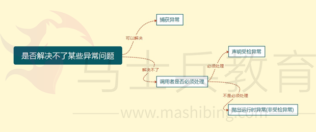
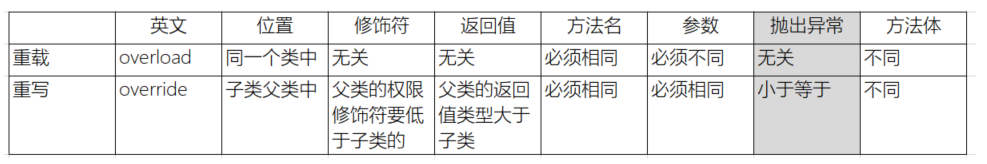
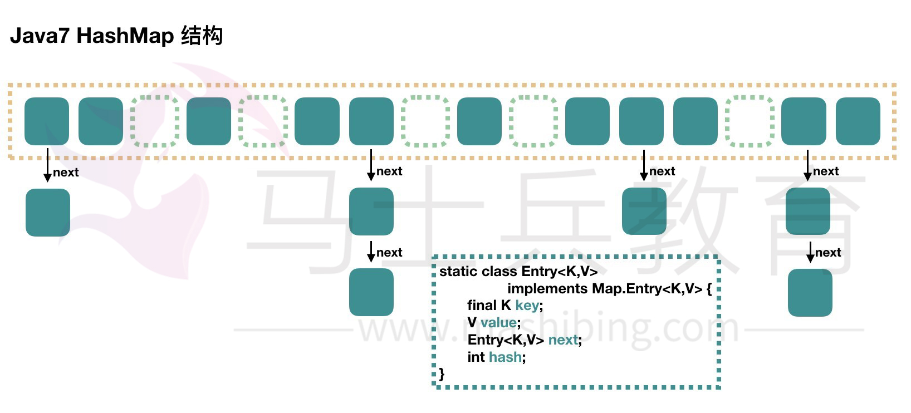
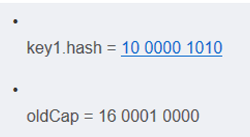
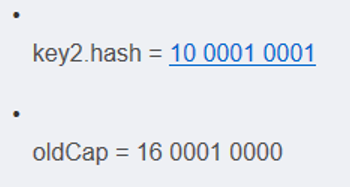
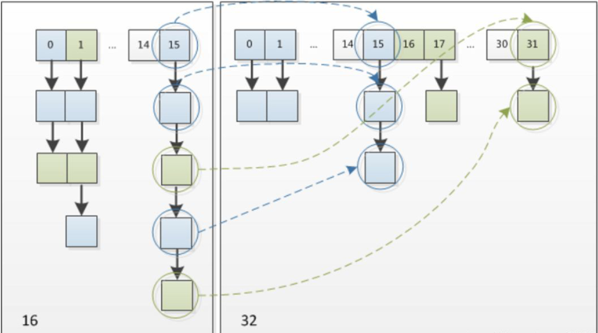
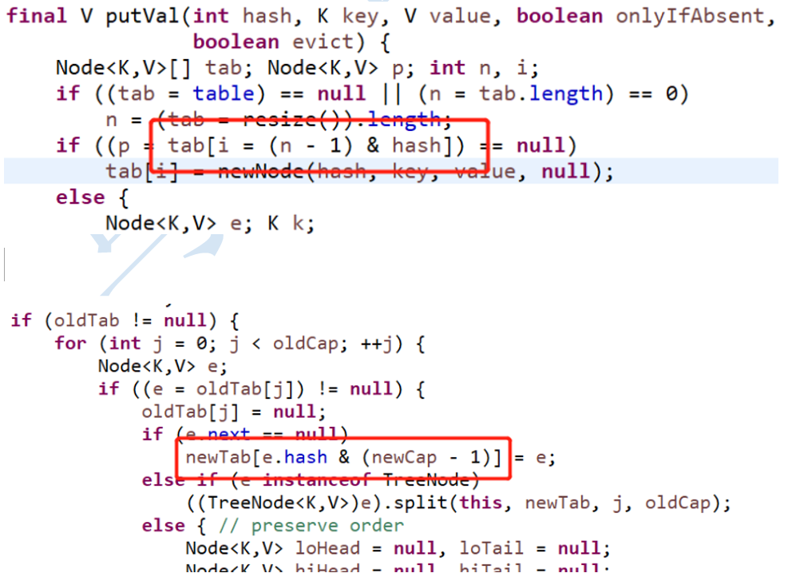
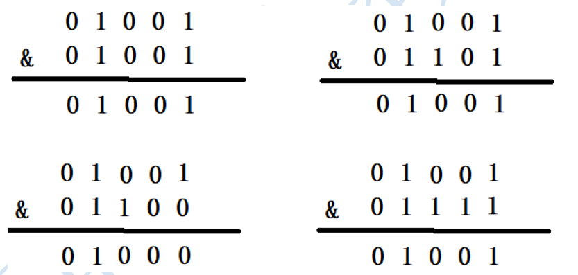

<div STYLE="page-break-after: always;">
	<br>
    <br>
    <br>
    <br>
    <br>
    <br>
    <br>
    <br>
    <br>
    <br>
	<center><h3><font size="20px">
        Java 部分
    </font></h3></center>
	<br>
    <br>
    <br>
    <br>
    <br>
    <br>
    <br>
    <br>
    <br>
    <br>
</div>
# 1	Java 基础

## 1.1	String、StringBuffer、StringBuilder 区别及使用场景

##### 区别

###### String

String 是只读字符串，也就意味着 String 引用的字符串内容是不能被改变的。如下代码看起来改变了字符串：

```
String str = “abc”；
str = “bcd”;
```

实际上这里的 str 仅仅是一个引用对象，它指向一个字符串对象 “abc”。 str = “bcd” 实际上让 str 重新指向了一个新的字符串 “bcd”。字符串 “abc” 并没有改变，只是变成不可及的。

###### StringBuffer/StringBuilder

StringBuffer/StringBuilder 表示的字符串对象可以直接进行修改。两者的主要区别在于，StringBuilder 效率较高，但不是线程安全的。StringBuffer 线程安全但效率较低。

<br>

---

<div STYLE="page-break-after: always;"><br>
    <br>
    <br>
    <br>
    <br>
    <br>
    <br>
    <br>
    <br>
    <br></div>

## 1.2	hashcode() 和 equals() 如何使用 

##### equals()

equals() 属于 java.lang.Object，该方法用来 **简单验证两个对象的相等性**。

Object 类中定义的 **默认实现只检查两个对象的对象引用**，以验证它们的相等性。 通过重写该方法，可以自定义验证对象相等新的规则，如果你使用 ORM 处理一些对象的话，你要确保在 hashCode() 和 equals() 对象中使用 getter 和 setter 而不是直接引用成员变量 

<br>

##### hashCode()

hashCode() 属于 java.lang.Object，该方法 **用于获取给定对象的唯一的整数（散列码）**。当这个对象需要存储在哈希表这样的数据结构时，这个整数用于确定桶的位置。

**默认情况下，对象的 hashCode() 方法返回对象所在内存地址的整数表示**。hashCode()是HashTable、HashMap和HashSet使用的。默认的，Object 类的 hashCode() 方法返回这个对象存储的内存地址的编号。

<br>

##### hash 散列算法

hash 散列算法在 hash 表中查找一个记录的时间复杂度是 O(1)。

每个记录都有自己的 hashcode，散列算法按照 hashcode 把记录放置在合适的位置。

查找一个记录时，先通过 hashcode() 快速定位记录的位置，然后再通过 equals() 来比较是否相等。如果 hashcode 在 hash 表中不存在，那么记录不存在于哈希表中。如果 hashcode 在 hash 表中存在，但是 equal() 返回的结果是 false，那么记录还是不存在哈希表中。

<br>

---

<div STYLE="page-break-after: always;"><br>
    <br>
    <br>
    <br>
    <br>
    <br>
    <br>
    <br>
    <br>
    <br></div>

## 1.3	Java异常处理方式


Java 通过面向对象的方法进行异常处理，一旦方法抛出异常，系统自动根据该异常对象寻找合适异常处理器（Exception Handler）来处理该异常，把各种不同的异常进行分类，并提供了良好的接口。

在 Java 中，每个异常都是一个对象，是 Throwable 类或其子类的实例。当一个方法出现异常后便抛出一个异常对象，该对象中包含有异常信息，调用这个对象的方法可以捕获到这个异常并可以对其进行处理。Java 的异常处理是通过 5 个关键词来实现的：try、 catch、throw、throws 和 finally。

在Java应用中，异常的处理机制分为声明异常，抛出异常和捕获异常。

throw和throws的区别：
（1）位置不同：
throw：方法内部
throws: 方法的签名处，方法的声明处

（2）内容不同：
throw+异常对象（检查异常，运行时异常）
throws+异常的类型（可以多个类型，用，拼接）

（3）作用不同：
throw：异常出现的源头，制造异常。
throws:在方法的声明处，告诉方法的调用者，这个方法中可能会出现我声明的这些异常。然后调用者对这个异常进行处理：
要么自己处理要么再继续向外抛出异常

<br>

##### throws 声明异常

通常，应该捕获那些知道如何处理的异常，将不知道如何处理的异常继续传递下

去。传递异常可以在方法签名处使用 throws 关键字声明可能会抛出的异常。注意

非检查异常（Error、RuntimeException 或它们的子类）不可使用 throws 关键字来声明要抛出的异常。

​       一个方法出现编译时异常，就需要 try-catch/ throws 处理，否则会导致编译错误

<br>

##### throw抛出异常

如果你觉得解决不了某些异常问题，且不需要调用者处理，那么你可以抛出异常。 throw关键字作用是在方法内部抛出一个Throwable类型的异常。任何Java代码都可以通过throw语句抛出异常。

<br>

##### trycatch捕获异常

程序通常在运行之前不报错，但是运行后可能会出现某些未知的错误，但是还不想直接抛出到上一级，那么就需要通过try…catch…的形式进行异常捕获，之后根据不同的异常情况来进行相应的处理。如何选择异常类型

可以根据下图来选择是捕获异常，声明异常还是抛出异常



<br>

----

<div STYLE="page-break-after: always;"><br>
    <br>
    <br>
    <br>
    <br>
    <br>
    <br>
    <br>
    <br>
    <br></div>

##  1.4	自定义异常在生产中如何应用 

##### 自定义异常在生产中的应用场景

 Java 虽然提供了丰富的异常处理类，但是在项目中还会经常使用自定义异常，其主要原因是 Java 提供的异常类在某些情况下还是不能满足实际需球。例如以下情况：

1. 系统中有些错误符合 Java 语法却不符合业务逻辑。
2. 在分层的软件结构中，通常是在表现层统一对系统其他层次的异常进行捕获处理。 

<br>

---

<div STYLE="page-break-after: always;"><br>
    <br>
    <br>
    <br>
    <br>
    <br>
    <br>
    <br>
    <br>
    <br></div>

# 2	面向对象

## 2.1	面向对象简介

##### 什么是面向对象编程

面向对象编程是一种利用类和对象编程的编程思想。

在面向对象编程中：

1. **万物可归类**：**类是对于世界事物的高度抽象** 。
2. **万物皆对象**：**对象是具体的世界事物**，

<br>

##### 面向对象的三大特性

1. **封装**：将对象运行所需的资源封装在程序对象中——基本上，是方法和数据。
2. **继承**：继承可以使得子类具有父类的属性和方法或者重新定义、追加属性和方法等。
3. **多态**：为不同数据类型的实体提供统一的接口。

<br>

##### 封装

封装 **隐藏** 了类的内部实现机制，可以在不影响使用的情况下改变类的内部结构，同时也保护了数据。对外界而言，类的内部细节是隐藏的，暴露给外界的只是它的访问方法。

###### 属性的封装

使用者只能通过事先定制好的方法来访问数据，可以方便地加入逻辑控制，限制对属性的不合理操作。

###### 方法的封装

使用者按照既定的方式调用方法，不必关心方法的内部实现，便于使用与修改，增强代码的可维护性。

<br>

##### 继承

继承是 **从已有的类中派生出新的类**，新的类能吸收已有类的数据属性和行为，并能扩展新的能力。

在本质上是从一般到特殊的关系，即常说的 is-a 关系。子类继承父类，表明子类是一种特殊的父类，并且具有父类所不具有的一些属性或方法。从多种实现类中抽象出一个基类，使其具备多种实现类的共同特性 ，当实现类继承了基类（父类）后，实现类就具备了这些相同的属性。比如从猫类、狗类、虎类中可以抽象出一个动物类，具有和猫、狗、虎类的共同特性（吃、跑、叫等）。

###### 继承的作用

继承避免了对一般类和特殊类之间共同特征进行的重复描述，通过继承可以清晰地表达每一项共同特征所适应的概念范围，在一般类中定义的属性和操作适应于这个类本身以及它以下的每一层特殊类的全部对象。运用继承原则使得系统模型比较简练也比较清晰。

###### Java 中继承的特点

Java 通过 extends 关键字来实现继承，父类中通过 private 定义的变量和方法不会被继承，不能在子类中直接操作父类通过 private 定义的变量以及方法。

<br>

##### 多态

多态是面向对象三大特性中比较难的一个，封装和继承最后归结于多态， 多态指的是类和类的关系，两个类由继承关系，存在有方法的重写，故而可以在调用时有父类引用指向子类对象。多态必备三个要素：继承，重写，父类引用指向子类对象。

<br>

---

<div STYLE="page-break-after: always;"><br>
    <br>
    <br>
    <br>
    <br>
    <br>
    <br>
    <br>
    <br>
    <br></div>
## 2.2	Java中重写和重载有哪些区别

##### 方法重载的规则

1. 方法名一致，参数列表中参数的顺序，类型，个数不同。
2. 重载与方法的返回值无关，存在于父类和子类，同类中。
3. 可以抛出不同的异常，可以有不同修饰符

<br>

##### 方法重写的规则

1. 参数列表必须完全与被重写方法的一致，返回类型必须完全与被重写方法的返回类型一致。
2. 构造方法不能被重写，声明为 final 的方法不能被重写，声明为 static 的方法不能被重写，但是能够被再次声明。
3. 访问权限不能比父类中被重写的方法的访问权限更低。
4. 重写的方法能够抛出任何非强制异常（UncheckedException，也叫非运行时异常），无论被重写的方法是否抛出异常。但是，重写的方法不能抛出新的强制性异常，或者比被重写方法声明的更广泛的强制性异常，反之则可以。

<br>

##### 两者之间的区别

###### 根本区别

方法的重载和重写都是实现多态的方式，区别在于前者实现的是编译时的多态性，而后者实现的是运行时的多态性。

###### 代码层面的区别

重载发生在一个类中，同名的方法如果有不同的参数列表（参数类型不同、参数个数不同或者二者都不同）则视为重载；

重写发生在子类与父类之间，重写要求子类被重写方法与父类被重写方法有相同的返回类型，比父类被重写方法更好访问，不能比父类被重写方法声明更多的异常（里氏代换原则）。

重载对返回类型没有特殊的要求，重写要求 <u>父类方法的返回值类型</u>  必须是 <u>子类方法返回值类型的基类</u>。



<br>

---

<div STYLE="page-break-after: always;"><br>
    <br>
    <br>
    <br>
    <br>
    <br>
    <br>
    <br>
    <br>
    <br></div>

## 2.3	接口和抽象类有哪些相同点和不同点

##### 相同

1. 都不能够实例化
2. 抽象类和接口类型都可以作为引用类型
3. 一个类如果继承了某个抽象类或者实现了某个接口，都需要实现抽象类或接口中的法全部抽象方法，否则该类仍然需要被声明为抽象类或接口。

<br>

##### 不同

###### 抽象类

1. 抽象类中可以定义构造器
2. 可以有抽象方法和具体方法
3. 接口中的成员全都是 public 的
4. 抽象类中可以定义成员变量
5. 有抽象方法的类必须被声明为抽象类，而抽象类未必要有抽象方法
6. 抽象类中可以包含静态方法
7. 一个类只能继承一个抽象类

###### 接口

1. 接口中不能定义构造器

2. 方法全部都是抽象方法（JDK 1.8 的新特性 **接口默认方法** 允许在接口中使用 default 关键字添加非抽象的方法实现）

   2.

   3.抽象类中的成员可以是 private、默认、protected、public

   4.接口中定义的成员变量实际上都是常量

   5.接口中不能有静态方法

   6.一个类可以实现多个接口

<br>

---

<div STYLE="page-break-after: always;"><br>
    <br>
    <br>
    <br>
    <br>
    <br>
    <br>
    <br>
    <br>
    <br></div>

## 2.4	怎样声明一个类不会被继承，什么场景下会用？

如果一个类被final修饰，此类不可以有子类，不能被其它类继承，如果一个中的所有方法都没有重写的需要，当前类没有子类也罢，就可以使用final修饰类。

---

<div STYLE="page-break-after: always;"><br>
    <br>
    <br>
    <br>
    <br>
    <br>
    <br>
    <br>
    <br>
    <br></div>

## 2.5	Java中 == 和 equals 有哪些区别

##### 区别

1. equals 和== 最大的区别是一个是方法一个是运算符。
2. == 如果比较的对象是基本数据类型，则比较的是数值是否相等；如果比较的是引用数据类型，则比较的是对象的地址值是否相等。equals() 用来比较对象的内容是否相等。

<br>

##### 注意

equals 方法不能用于基本数据类型的变量，如果没有对 equals 方法进行重写，则比较的是引用类型的变量所指向的对象的地址。

<br>

---

<div STYLE="page-break-after: always;"><br>
    <br>
    <br>
    <br>
    <br>
    <br>
    <br>
    <br>
    <br>
    <br></div>

# 3	集合

## 3.1	Hash Map

##### HashMap 简介

HashMap 根据键的 hashCode 值存储数据，大多数情况下可以直接定位到它的值，因而具有很快的访问速度，但遍历顺序却是不确定的。 

<br>

##### HashMap 为什么只允许一条记录的键为 null？

HashMap 最多只允许一条记录的键为 null，允许多条记录的值为 null，因为 HashMap 通过对键进行哈希运算得到 value 的存储地址，如果有多个键都为 null，那么它们的存储地址将会是相同的。

<br>

##### HashMap 是线程安全的吗？

HashMap **不是线程安全的**，即任一时刻可以有多个线程同时写 HashMap，可能会导致数据的不一致。

如果需要满足线程安全，可以用 Collections 的 synchronizedMap 方法使 HashMap 具有线程安全的能力，或者使用 ConcurrentHashMap。

<br>

##### HashMap 中的重要概念

1. Entry：HashMap 底层实际上是一个数组，数组中存放的是 Entry 类型的对象。Entry 包含四个属性：key、value、hash 值和用于单向链表的 next。 
2. size：HashMap 当前存放的 Entry 数量。
3. capacity：当前数组容量，始终保持 2^n^，可以扩容，扩容后数组大小为当前的 2 倍。 
4. loadFactor：负载因子，默认为 0.75。 
5. threshold：扩容的阈值，等于 capacity * loadFactor 

<br>

##### JDK 7 HashMap 的结构



大方向上，HashMap 里面是一个数组，然后数组中每个元素是一个单向链表。上图中，每个绿色的实体是嵌套类 Entry 的实例。

<br>

##### JDK 8 HashMap 的结构

JDK 8 对 HashMap 进行了一些修改，最大的不同就是利用了 **红黑树**，所以其由 数组+链表+红黑树 组成。 

根据 Java7 HashMap 的介绍，查找时根据 hash 值可以快速定位到数组的具体下标，但是之后需要顺着链表依次比较才能找到对应的 value（哈希取余可能会相同），时间复杂度取决于链表的长度，为 O(n)。

为了降低这部分的开销，在 JDK 8 中，当链表中的元素超过了 8 个以后，会将链表转换为红黑树，在这些位置进行查找的时候可以降低时间复杂度为 O(logN)。 

 

<br>

##### ❗（需要补充）HashMap 在 JDK 8 的扩容优化

简单说明——JDK 7 HashMap 在扩容后需要重新计算所有键的 Hash 值，JDK 8 针对此进行了优化，由于每次扩容都是对原数组长度乘2，所以只要在原来的 Hash 值上增加一位即可得到新的 Hash 值。

<br>

##### HashMap 与 HapTable 的区别

1. **效率**：HashMap 的效率比 HashTable 更高。
2. **线程同步**：HashMap 是非线程同步的，HashTable 是线程同步的。
3. **空<键,值>**：HashTable 不允许<键,值>有空值，HashMap 允许<键,值>有空值。
4. **迭代器**：HashTable 使用 Enumeration（也可使用 iterator），HashMap 使用 iterator。
5. **扩容算法**：HashTable 中 Hash 数组的默认大小是 11，增加的方式是 old\*2+1，HashMap 中 hash 数组的默认大小是16，增长方式是2的指数倍（old\*2）
6. **父类**：HashTable 继承 Dictionary 类，HashMap 继承自 AbstractMap 类，不过两者都实现了 Map 接口。

<br>

---

<div STYLE="page-break-after: always;"><br>
    <br>
    <br>
    <br>
    <br>
    <br>
    <br>
    <br>
    <br>
    <br></div>
## 3.2	HashMap和HashTable对比

##### 区别

1. HashTable 线程同步，HashMap 非线程同步。
2. HashTable 不允许<键,值>有空值，HashMap 允许<键,值>有空值。
3. HashTable 使用 Enumeration，HashMap 使用 Iterator。
4. HashTable 中 hash 数组的默认大小是11，增加方式的 old*2+1，HashMap 中 hash 数组的默认大小是16，增长方式是2的指数倍。
5. HashMap 在 jdk1.8 之前是 list + 链表，在jdk1.8之后 list + 链表，当链表长度到8时，转化为红黑树。
6. HashMap 链表插入节点的方式 在 Java1.7 中，插入链表节点使用 **头插法**。Java1.8 中变成了 **尾插法**。
7. Java1.8 的 hash() 中，将 hash 值高位（前16位）参与到取模的运算中，使得计算结果的不确定性增强，降低发生哈希碰撞的概率。

<br>

---

<div STYLE="page-break-after: always;"><br>
    <br>
    <br>
    <br>
    <br>
    <br>
    <br>
    <br>
    <br>
    <br></div>

## 3.3	HashMap 扩容优化（❗需要修改）

扩容以后,1.7对元素进行rehash算法,计算原来每个元素在扩容之后的哈希表中的位置,1.8借助2倍扩容机制,元素不需要进行重新计算位置

JDK 1.8 在扩容时并没有像 JDK 1.7 那样，重新计算每个元素的哈希值，而是通过高位运算**（e.hash & oldCap）**来确定元素是否需要移动，比如 key1 的信息如下：



使用 e.hash & oldCap 得到的结果，高一位为 0，当结果为 0 时表示元素在扩容时位置不会发生任何变化，而 key 2 信息如下



 

  

高一位为 1，当结果为 1 时，表示元素在扩容时位置发生了变化，新的下标位置等于原下标位置 + 原数组长度**hashmap,****不必像1.7一样全部重新计算位置**



<br>

##### 为什么hashmap扩容的时候是两倍？

在存入元素时,放入元素位置有一个 (n-1)&hash 的一个算法,和hash&(newCap-1),这里用到了一个&位运算符



 

当HashMap的容量是16时，它的二进制是10000，(n-1)的二进制是01111，与hash值得计算结果如下


下面就来看一下HashMap的容量不是2的n次幂的情况，当容量为10时，二进制为01010，(n-1)的二进制是01001，向里面添加同样的元素，结果为



可以看出，有三个不同的元素进过&运算得出了同样的结果，严重的hash碰撞了

只有当n的值是2的N次幂的时候，进行&位运算的时候，才可以只看后几位，而不需要全部进行计算

<br>

---

<div STYLE="page-break-after: always;"><br>
    <br>
    <br>
    <br>
    <br>
    <br>
    <br>
    <br>
    <br>
    <br></div>

## 3.4	ArrayList 和 LinkedList 之间的区别

##### 访问速度

- ArrayList 是基于索引（index）的数据接口，它的底层是 **数组**，使用索引在数组中搜索和读取数据是很快的。它能以 O(1) 的时间复杂度对元素进行随机访问。
- LinkedList 是以元素列表的形式存储它的数据，每一个元素都和它的前一个和后一个元素链接在一起。在这种情况下，查找某个元素的时间复杂度是 O(n)。

<br>

##### 插入、删除速度

LinkedList 的插入、删除速度比 ArrayList  更快：

- LinkedList  的元素可以被直接添加到集合的任意位置，或者从任意位置移除，不需要额外操作，时间复杂度仅为O(1)。
- ArrayList 在插入和删除时需要重新排列数组中的所有数据，并可能需要进行扩容和索引更新，最恶劣的情况下时间复杂度是O(n)。

<br>

##### 内存占用

LinkedList 比 ArrayList 更占内存：

-  LinkedList 的每个节点中存储的是实际的数据和前后节点的位置。
- ArrayList 的每个索引的位置是实际的数据。

<br>

##### LinkedList 和 ArrayList 的适用场景

频繁进行插入和删除操作，且不是经常需要进行随机访问，此时适用 LinkedList，否则使用 ArrayList。

<br>

----

<div STYLE="page-break-after: always;"><br>
    <br>
    <br>
    <br>
    <br>
    <br>
    <br>
    <br>
    <br>
    <br></div>

## 3.4	高并发中的集合有哪些问题

##### 第一代线程安全集合类——Vector、HashTable

###### 	保证线程安全的方法

使用 synchronized 修饰方法

###### 	缺点

效率低下

<br>

##### 第二代线程非安全集合类——ArrayList、HashMap

​	线程不安全，但是性能好，能用来替代 Vector，HashTable

###### 	ArrayList、HashMap 如何解决线程安全问题

使用 Collections.synchronizedList(list) 与 Collections.synchronizedMap(map)，底层使用了 synchronized 代码块锁，锁在方法里面，与直接锁住方法的第一代相比，性能有所提高。

<br>

##### 第三代线程安全集合类

java.util.concurrent 包的集合类：

1. ConcurrentHashMap: .
2. CopyOnWriteArrayList
3. CopyOnWriteArraySet

底层大都采用 Lock 锁（注意，1.8的 ConcurrentHashMap 不使用 Lock 锁），保证安全的同时，性能也很高。

<br>

##### hashMap 实现线程安全的方式一——Collections.synchronizedMap()

通过 Collections.synchronizedMap() 返回一个新的Map，这个新的 map 就是线程安全的。实际上返回的并不是 HashMap，而是一个 Map 接口的实现类。

###### 实现原理

通过 Collections.synchronizedMap() 来封装所有不安全的 HashMap 的方法，就连 toString()、hashCode() 都进行了封装，封装的关键点有两处：

1. 使用了经典的 synchronized 来进行互斥，锁住的是对象；
2. 使用了代理模式new了一个新的类，这个类同样实现了 Map 接口。

###### 优点

代码实现十分简单,一看就懂

###### 缺点

从锁的角度来看，方法一直接使用了锁住方法，基本上是锁住了尽可能大的代码块，性能会比较差。

<br>

##### hashMap 实现线程安全的方式二——ConcurrentHashMap

更优秀的方法。

###### 实现原理

重新写了 HashMap()，比较大的改变有如下：

1. 使用了新的锁机制，把 HashMap 拆分成了多个独立的块，这样在高并发的情况下减少了锁冲突的可能
2. 使用的是 NonfairSync，这个特性调用 CAS 指令来确保原子性与互斥性

###### 优点

需要互斥的代码段比较少，性能会比较好。ConcurrentHashMap 把整个 Map 切分成了多个块，发生锁碰撞的几率大大降低，性能会比较好.。

###### 缺点:

代码繁琐

<br>

---

<div STYLE="page-break-after: always;"><br>
    <br>
    <br>
    <br>
    <br>
    <br>
    <br>
    <br>
    <br>
    <br></div>
#  4	Java 代理

## 4.1	代理模式和 Java 中的代理

##### 代理模式简介

<br>

##### 什么是静态代理

只能静态的代理某些类或者某些方法，不推荐使用，功能比较弱，但是编码简单。

<br>

##### 什么是动态代理

动态代理是 **在程序运行期间创建目标对象的代理对象**，并对目标对象中的方法进行功能性增强的一种技术。

<br>

##### Java 动态代理的实现方式

Proxy 和 CGLIB 是非常重要的代理模式,是springAOP底层实现的主要两种方式

<br>

---

<div STYLE="page-break-after: always;"><br>
    <br>
    <br>
    <br>
    <br>
    <br>
    <br>
    <br>
    <br>
    <br></div>


## 4.2	Java 中的静态代理实现

---

<div STYLE="page-break-after: always;"><br>
    <br>
    <br>
    <br>
    <br>
    <br>
    <br>
    <br>
    <br>
    <br></div>


## 4.3	动态代理——Proxy 代理

##### Proxy 代理简介

Proxy 代理是 JDK 内置的动态代理。

###### 特点

面向接口，不需要导入第三方依赖，可以对多个不同的接口进行增强，通过反射读取注解时，只能读取到接口上的注解。

###### 原理

面向接口，只能对实现类在实现接口中定义的方法进行增强。

<br>

例

定义接口和实现

```
package com.proxy;

public interface UserService {
    public String getName(int id);

    public Integer getAge(int id);
}
```

```
package com.proxy;

public class UserServiceImpl implements UserService {
    @Override
    public String getName(int id) {
        System.out.println("------getName------");
        return "riemann";
    }

    @Override
    public Integer getAge(int id) {
        System.out.println("------getAge------");
        return 26;
    }
}
```

```
package com.proxy;

import java.lang.reflect.InvocationHandler;
import java.lang.reflect.Method;

public class MyInvocationHandler implements InvocationHandler {

    public Object target;

    MyInvocationHandler() {
        super();
    }

    MyInvocationHandler(Object target) {
        super();
        this.target = target;
    }

    @Override
    public Object invoke(Object proxy, Method method, Object[] args) throws Throwable {
        if ("getName".equals(method.getName())) {
            System.out.println("++++++before " + method.getName() + "++++++");
            Object result = method.invoke(target, args);
            System.out.println("++++++after " + method.getName() + "++++++");
            return result;
        } else {
            Object result = method.invoke(target, args);
            return result;
        }
    }
}
```

```
package com.proxy;

import java.lang.reflect.InvocationHandler;
import java.lang.reflect.Proxy;

public class Main1 {
    public static void main(String[] args) {
        UserService userService = new UserServiceImpl();
        InvocationHandler invocationHandler = new MyInvocationHandler(userService);
        UserService userServiceProxy = (UserService) Proxy.newProxyInstance(userService.getClass().getClassLoader(),
                userService.getClass().getInterfaces(),invocationHandler);
        System.out.println(userServiceProxy.getName(1));
        System.out.println(userServiceProxy.getAge(1));
    }
}
```

<br>

---

<div STYLE="page-break-after: always;"><br>
    <br>
    <br>
    <br>
    <br>
    <br>
    <br>
    <br>
    <br>
    <br></div>


## 4.5	动态代理——CGLIB 

##### CGLIB 动态代理简介

######    特点

面向父类的动态代理，需要导入第三方依赖

###### 原理

底层通过子类继承父类并重写方法的形式实现增强。

<br>

##### CGLIB的核心类

1. net.sf.cglib.proxy.Enhancer：主要的增强类

2. net.sf.cglib.proxy.MethodInterceptor：主要的方法拦截类，它是 Callback 接口的子接口，需要用户实现

3. net.sf.cglib.proxy.MethodProxy：JDK 的 java.lang.reflect.Method类 的代理类，可以方便的实现对源对象方法的调用，如使用：

   ```
   Object o = methodProxy.invokeSuper(proxy, args);//虽然第一个参数是被代理对象，也不会出现死循环的问题。
   ```

4. net.sf.cglib.proxy.MethodInterceptor 接口是最通用的回调（callback）类型，它经常被基于代理的AOP用来实现拦截（intercept）方法的调用。这个接口只定义了一个方法：

   ```java
   public Object intercept(Object object, 
   						java.lang.reflect.Method method,
   						Object[] args,
   						MethodProxy proxy) throws Throwable;
   ```

   - 第一个参数是代理对像，第二和第三个参数分别是拦截的方法和方法的参数。原来的方法可能通过使用java.lang.reflect.Method对象的一般反射调用，或者使用 net.sf.cglib.proxy.MethodProxy对象调用。net.sf.cglib.proxy.MethodProxy通常被首选使用，因为它更快。

<br>

##### 例

```
package com.proxy.cglib;

import net.sf.cglib.proxy.MethodInterceptor;
import net.sf.cglib.proxy.MethodProxy;
import java.lang.reflect.Method;
 
public class CglibProxy implements MethodInterceptor {
    @Override
    public Object intercept(Object o, Method method, Object[] args, MethodProxy methodProxy) throws Throwable {
        System.out.println("++++++before " + methodProxy.getSuperName() + "++++++");
        System.out.println(method.getName());
        Object o1 = methodProxy.invokeSuper(o, args);
        System.out.println("++++++before " + methodProxy.getSuperName() + "++++++");
        return o1;
    }
}

```

```
package com.proxy.cglib;
 
import com.test3.service.UserService;
import com.test3.service.impl.UserServiceImpl;
import net.sf.cglib.proxy.Enhancer;
 
public class Main2 {
    public static void main(String[] args) {
        CglibProxy cglibProxy = new CglibProxy();
 
        Enhancer enhancer = new Enhancer();
        enhancer.setSuperclass(UserServiceImpl.class);
        enhancer.setCallback(cglibProxy);
 
        UserService o = (UserService)enhancer.create();
        o.getName(1);
        o.getAge(1);
    }
}
```

<br>

---

<div STYLE="page-break-after: always;"><br>
    <br>
    <br>
    <br>
    <br>
    <br>
    <br>
    <br>
    <br>
    <br></div>

#  5	jdk 1.8 的新特性

## 5.1	接口的默认方法

##### 简介

jdk 8 允许我们给接口添加一个非抽象的方法实现，只需要使用 default关键字即可，这个特征又叫做扩展方法。

<br>

##### 例

```java
interface Formula {

    double calculate(int a);

	default double sqrt(int a) {
        return Math.sqrt(a);
    } 
}
```

<br>

---

<div STYLE="page-break-after: always;"><br>
    <br>
    <br>
    <br>
    <br>
    <br>
    <br>
    <br>
    <br>
    <br></div>

## 5.2	Lambda 表达式

##### 什么是 Lambda 表达式

Lambda 表达式本质上是一个匿名函数，可以把 Lambda 表达式理解为一段可以传递的代码（即将代码像数据一样进行传递）。

借助 Lambda 表达式可以写出更简洁、更灵活的代码。同时，JDK 也提供了大量的内置函数式接口，使得 Lambda 表达式的运用更加方便、高效。

<br>

##### 操作符 ->

Java 8 中引入了一个新的操作符 **->** ，该操作符被称为箭头操作符或 Lambda 操作符。

箭头操作符将 Lambda 表达式拆分成两部分：

- 左侧 : Lambda 表达式的参数列表；
- 右侧 : Lambda 表达式中所需执行的功能， 即 Lambda 体。

<br>

##### Lambda 表达式的简化语法

1. 小括号内参数的类型可以省略；
2. 如果小括号内仅有一个参数，小括号可以省略；

3. 如果大括号内仅有一个条语句，则无论是否有返回值，都可以省略大括号、return 关键字及语句分号。

<br>

##### Lambda 表达式的作用——替代匿名内部类

###### Java 早期版本的字符串排序

```java
List<String> names = Arrays.asList("peterF", "anna", "mike", "xenia");

Collections.sort(names, 
	new Comparator<String>() {
		@Override public int compare(String a, String b) {
        	return b.compareTo(a); 
        } 
	});
```

给静态方法 Collections.sort() 传入一个 List 对象以及一个比较器来按指定顺序排列，比较器是一个匿名内部类。

###### 通过 Lambda 表达式实现字符串排序

```java
Collections.sort(names,
	(String a, String b) -> {
        return b.compareTo(a); 
	});
```

进一步简化：

```java
Collections.sort(names, 
	(String a, String b) -> b.compareTo(a)
	);
```

<br>

##### Lambda 表达式的作用——对集合进行迭代

```java
@Test
public void iterTest() {
    List<String> languages = Arrays.asList("java","scala","python");
    //before java8
    for(String each:languages) {
        System.out.println(each);
    }
    //after java8
    languages.forEach(x -> System.out.println(x));
    languages.forEach(System.out::println);
}
```

<br>

---

<div STYLE="page-break-after: always;"><br>
    <br>
    <br>
    <br>
    <br>
    <br>
    <br>
    <br>
    <br>
    <br></div>

## 5.3	函数式接口

##### 什么是函数式接口

函数式接口是指 **仅包含一个抽象方法的接口**。

因为 JDK 8 的新特性——**接口默认方法** 不算抽象方法，所以也可以给函数式接口添加默认方法。

<br>

##### 函数式接口判定注解——@FunctionalInterface 

JDK 8 提供了 @FunctionalInterface  注解，用于判定接口是否是函数式接口。在接口上配置这个注解后，如果编译器发现接口中的抽象方法数量多余一个，那么将会报错。

###### 例

```java
@FunctionalInterface 
interface Converter<F, T> {
	T convert(F from);
}

Converter<String, Integer> converter = (from) -> Integer.valueOf(from); 
Integer converted = converter.convert("123"); 
System.out.println(converted); 
```

<br>

##### 函数式接口 与 lambda 表达式的关系

lambda 表达式一般作为 **方法的参数**，而参数存在其 **类型**，而函数式接口就是 lambda 表达式所属的类型。

可以说，Lambda 表达式是函数式接口的实例。

<br>

##### 内建函数式接口

JDK 1.8 包含了很多内建的函数式接口，比如 Comparator 或者 Runnable 接口，这些接口添加了 @FunctionalInterface 注解以便能用在 lambda 表达式上。 所以，一般在使用 Lambda 表达式时，我们不需要额外创建函数式接口。

<br>

---

<div STYLE="page-break-after: always;"><br>
    <br>
    <br>
    <br>
    <br>
    <br>
    <br>
    <br>
    <br>
    <br></div>

## 5.4	集合的 Stream 操作（❗需要补充）


---

<div STYLE="page-break-after: always;"><br>
    <br>
    <br>
    <br>
    <br>
    <br>
    <br>
    <br>
    <br>
    <br></div>

## 5.5	Date API（❗需要修改，尤其是 LocalTime、LocalDate、LoceDateTime）

##### 简介

Java 8 在 java.time 包下提供了一组全新的时间日期 API。新的日期 API 和开源的 Joda-Time 库差不多，但又不完全一样。

<br>

##### 时钟 Clock

Clock 类提供了访问当前日期和时间的方法，Clock 是时区敏感的，可以用来取代 System.currentTimeMillis() 来获取当前的微秒数。某一个特定的时间点也可以使用Instant类来表示，Instant 类也可以用来创建老的 java.util.Date 对象。

###### 例

```java
Clock clock = Clock.systemDefaultZone();
long millis = clock.millis();

Instant instant = clock.instant();
Date legacyDate = Date.from(instant); // legacy java.util.Date
```

<br>

##### 时区 Timezones

在新 API 中时区使用 ZoneId 来表示。时区可以很方便的使用静态方法 of() 获取。 时区定义了到 UTS 时间的时间差，在 Instant 时间点对象到本地日期对象之间转换的时候是极其重要的。

###### 例

```java
System.out.println(ZoneId.getAvailableZoneIds()); // prints all available timezone ids

ZoneId zone1 = ZoneId.of("Europe/Berlin"); 
ZoneId zone2 = ZoneId.of("Brazil/East"); 
System.out.println(zone1.getRules()); 
System.out.println(zone2.getRules());

// ZoneRules[currentStandardOffset=+01:00] // ZoneRules[currentStandardOffset=-03:00]
```

<br>

##### 本地时间 LocalTime

LocalTime 定义了一个没有时区信息的时间，例如晚上10点，或者 17:30:15。

###### 例一

使用前面代码创建的时区创建两个本地时间，之后比较时间并以小时和分钟为单位计算两个时间的时间差：

```java
LocalTime now1 = LocalTime.now(zone1); LocalTime now2 = LocalTime.now(zone2);

System.out.println(now1.isBefore(now2)); // false

long hoursBetween = ChronoUnit.HOURS.between(now1, now2); long minutesBetween = ChronoUnit.MINUTES.between(now1, now2);

System.out.println(hoursBetween); // -3 System.out.println(minutesBetween); // -239


```

###### 例二

LocalTime 提供了多种工厂方法来简化对象的创建，包括解析时间字符串。

```java
LocalTime late = LocalTime.of(23, 59, 59); 
System.out.println(late); // 23:59:59

DateTimeFormatter germanFormatter = DateTimeFormatter.ofLocalizedTime(FormatStyle.SHORT).withLocale(Locale.GERMAN);

LocalTime leetTime = LocalTime.parse("13:37", germanFormatter);
System.out.println(leetTime); // 13:37
```

<br>

##### LocalDate 本地日期

LocalDate 表示了一个确切的日期，比如 2014-03-11。该对象值是不可变的，用起来和 LocalTime 基本一致。注意， LocalDate 对象是不可变的，操作返回的总是一个新实例。

##### 例——给Date对象加减天/月/年

代码如下:

```java
LocalDate today = LocalDate.now();
LocalDate tomorrow = today.plus(1, ChronoUnit.DAYS); 
LocalDate yesterday = tomorrow.minusDays(2);

LocalDate independenceDay = LocalDate.of(2014, Month.JULY, 4); 
DayOfWeek dayOfWeek = independenceDay.getDayOfWeek();

System.out.println(dayOfWeek); // FRIDAY 从字符串解析一个LocalDate类型和解析LocalTime一样简单：
```

###### 例——解析时间字符串

```java
DateTimeFormatter germanFormatter = DateTimeFormatter.ofLocalizedDate(FormatStyle.MEDIUM).withLocale(Locale.GERMAN);

LocalDate xmas = LocalDate.parse("24.12.2014", germanFormatter);
System.out.println(xmas); // 2014-12-24
```

<br>

##### 本地日期时间 LocalDateTime 

LocalDateTime 同时表示了时间和日期，相当于前两节内容合并到一个对象上了。LocalDateTime 和 LocalTime 还有 LocalDate 一样，都是不可变的。 LocalDateTime 提供了一些能访问具体字段的方法。

###### 例一

```java
LocalDateTime sylvester = LocalDateTime.of(2014, Month.DECEMBER, 31, 23, 59, 59);

DayOfWeek dayOfWeek = sylvester.getDayOfWeek();
System.out.println(dayOfWeek); // WEDNESDAY

Month month = sylvester.getMonth();
System.out.println(month); // DECEMBER

long minuteOfDay = sylvester.getLong(ChronoField.MINUTE_OF_DAY);
System.out.println(minuteOfDay); // 1439
```

###### 例二

只要附加上时区信息，就可以将其转换为一个时间点 Instant 对象，Instant 时间点对象可以很容易的转换为老式的 java.util.Date：

```Java
Instant instant = sylvester .atZone(ZoneId.systemDefault()) .toInstant();

Date legacyDate = Date.from(instant); System.out.println(legacyDate); // Wed Dec 31 23:59:59 CET 2014
```

###### 例三——使用自定义的格式格式化 LocalDateTime

```Java
DateTimeFormatter formatter = DateTimeFormatter.ofPattern("MMM dd, yyyy - HH:mm");

LocalDateTime parsed = LocalDateTime.parse("Nov 03, 2014 - 07:13", formatter); 
String string = formatter.format(parsed); 
System.out.println(string); // Nov 03, 2014 - 07:13
```

和 java.text.NumberFormat 不一样的是新版的 DateTimeFormatter 是不可变的，所以它是线程安全的。

<br>

---

<div STYLE="page-break-after: always;"><br>
    <br>
    <br>
    <br>
    <br>
    <br>
    <br>
    <br>
    <br>
    <br></div>

## 5.6	Annotation 注解（❗需要补充）

##### 多重注解

Java 8 中提供了对多重注解的支持，多重注解的意思是把同一个类型的注解使用多次，只需要在该注解前标注 @Repeatable 即可。

<br>

---

<div STYLE="page-break-after: always;"><br>
    <br>
    <br>
    <br>
    <br>
    <br>
    <br>
    <br>
    <br>
    <br></div>
# 附录

##### 参考资料

- 主要参考资料——[2022年最新【Java经典面试题300问】面试必备，查漏补缺；多线程+spring+JVM调优+分布式+redis+算法](https://www.bilibili.com/video/BV15v4y1T7fz?p=80&spm_id_from=pageDriver&vd_source=87ed5edcdc8042ca0c34ee5bbeeda7b3) 发布于 2022/06/29

<br>

