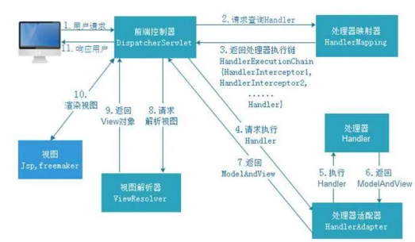

	 
     
     
     
     
     
     
     
     
     
	
<h3>
        Spring Framework
    </h3>

	 
     
     
     
     
     
     
     
     
     

# 1	Spring 概述

## 1.1	Spring 简介

##### Spring 简介

​	Spring 使创建 Java 企业应用程序变得更加容易。它提供了在企业环境中接受 Java 语言所需的一切，并支持 Groovy 和 Kotlin 作为 JVM 上的替代语言，并可根据应用程序的需要灵活地创建多种体系结构。从 Spring Framework 5.0 开始，Spring 需要 JDK 8（Java SE 8+）， 并且已经为 JDK 9 提供了现成的支持。

Spring 是开源的。它拥有一个庞大而且活跃的社区，提供不同范围的，真实用户的持续反馈。这也帮助 Spring 不断地改进，不断发展。

 

##### Spring 的应用场景

​	Spring 支持各种应用场景：

1. 在大型企业中，应用程序通常需要运行很长时间，而且必须运行在 jdk 和应用服务器上，这种场景开发人员无法控制其 **升级周期**，但是使用 Spring 开发的程序，可以通过更换框架版本实现简单快捷的版本升级。
2. 程序作为一个单独的 jar 嵌入到服务器去运行，或部署在云环境中。
3. 不需要服务器的独立应用程序（如批处理或集成的工作任务）。

 

##### Spring 是如何简化开发的？

1. 基于POJO的轻量级和最小侵入性编程
2. 通过依赖注入和面向接口实现松耦合
3. 通过切面和模板减少样板式代码
4. 基于切面和惯例进行声明式编程

 

##### 使用 Spring 开发的优势

1. **消除样板式代码**：Spring 通过 DI、AOP 消除样板式代码来简化企业级 Java 开发；
2. **低侵入式设计**：Spring 框架对业务代码的干扰很低，相对独立；
3. **独立于各种应用服务器**，基于 Spring 框架的应用，可以真正实现 Write Once,Run Anywhere；
4. **业务对象解耦**：Spring 的 IoC 容器降低了业务对象替换的复杂性，解除了组件之间的耦合；
5. **支持面向切面编程**：Spring 的 AOP 支持允许将一些通用任务如安全、事务、日志等进行集中式处理，从而提供了更好的复用；
6. **提供了与第三方持久层框架的良好整合**：Spring 的 ORM 和 DAO 提供了与第三方持久层框架的良好整合，并简化了底层的数据库访问；
7. 高度开放性：Spring 不强制应用完全依赖于 Spring，开发者可自由选用 Spring 框架体系的部分或全部。
8. **Spring 框架体系**：Spring 框架之外还存在一个构建在其之上的庞大生态圈，它将 Spring 扩展到不同的领域，如 Web 服务、REST. 移动开发以及 NoSQL。

 

##### Spring 和 SpringMVC

1. spring是一个一站式的轻量级的java开发框架，核心是控制反转（IOC）和面向切面（AOP），针对于开发的WEB层(springMvc)、业务层(Ioc)、持久层(jdbcTemplate)等都提供了多种配置解决方案；
2. SpringMVC是 Spring 基础之上的一个 MVC 框架，主要处理 web 开发的路径映射和视图渲染，属于 Spring 框架中 WEB 层开发的一部分；
3. SpringMVC 主要解决 WEB 开发的问题，是基于 Servlet  的一个 MVC 框架，通过 XML 配置，统一开发前端视图和后端逻辑；

 

#####   SpringMVC 和 Spring Boot

1. SpringMVC 属于一个企业 WEB 开发的 MVC 框架，涵盖面包括前端视图开发、文件配置、后台接口逻辑开发等，XML、config 等配置相对比较繁琐复杂；
2. Spring Boot 框架相对于 SpringMVC 框架来说，更专注于开发微服务后台接口，不开发前端视图，同时遵循默认优于配置，简化了插件配置流程，不需要配置 xml，相对 SpringMVC ，大大简化了配置流程。
3. 由于Spring的配置非常复杂，各种XML、JavaConfig、servlet处理起来比较繁琐，为了简化开发者的使用，从而创造性地推出了springBoot框架，默认优于配置，简化了springMvc的配置流程；但区别于springMvc的是，springBoot专注于单体微服务接口开发，和前端解耦，虽然springBoot也可以做成springMvc前后台一起开发，但是这就有点不符合springBoot框架的初衷了；

 

##### 总结

Spring 是一个框架，它本质上是一个 IoC 容器，也是一个生态。

 

---

 
     
     
     
     
     
     
     
     
     

## 1.2	Spring 框架中使用的设计模式及其应用场景

##### 工厂模式

在各种 BeanFactory 以及 ApplicationContext 创建中都用到了。

 

##### 模版模式

在各种 BeanFactory 以及 ApplicationContext 实现中也都用到了。

 

##### 代理模式

Spring AOP 是利用 Aspect AOP 实现的， AspectJ AOP的底层用了动态代理；

 

##### 策略模式

加载资源文件的方式，不同实现类使用了不同的方法，比如：ClassPathResourece、FileSystemResource、ServletContextResource、 UrlResource 但他们都有共同的 Resource 接口，在 Aop 的实现中，采用了两种不同的方式， JDK 动态代理和 CGLIB 代理。

 

##### 单例模式

比如在创建bean的时候。

 

##### 观察者模式

Spring 中的 ApplicationEvent、ApplicationListener、ApplicationEventPublisher。

 

##### 适配器模式

MethodBeforeAdviceAdapter、ThrowsAdviceAdapter、AfterReturningAdapter

 

##### 装饰者模式

源码中类型带 Wrapper 或者 Decorator 的都是

 

---

 
     
     
     
     
     
     
     
     
     

## 1.3	Spring 的基本实现原理——IoC

##### IoC 与 DI（❗最后一段表述不清）

​	IoC（Inversion of Control，控制反转）是一种设计思想，IOC 意味着将你设计好的对象交给 **容器** 控制，而不是传统的在主类对象（或包含该对象的其他对象）内部直接控制。

DI（Dependency Injection，依赖注入）与 IoC 同理， DI 是 IoC 的一种实现方式。

IoC 是一个通过 **依赖** 注入对象的过程。也就是说，它们所使用的对象，是通过 <u>构造函数参数</u>、<u>工厂方法的参数</u> 或者是 <u>从工厂方法的构造函数或返回值的对象实例设置的属性</u>，然后容器在创建 bean 时注入这些需要的依赖。这个过程相对普通创建对象的过程是 **反向** 的，因此称之为 **控制反转**。bean 本身通过直接构造类来控制依赖关系的实例化或位置，或提供诸如服务定位器模式之类的机制。

 

##### 传统对象创建方式与 IoC

在传统的程序设计中，我们直接在对象内部通过 new 进行对象创建，是程序主动去创建依赖对象，而 IoC 是由专门的容器来进行对象的创建，即 IoC 容器来控制对象的创建。

在传统的应用程序中，我们是在对象（程序）中主动控制去直接获取依赖对象，而控制反转是由容器创建及注入依赖对象，在这个过程中，由容器查找及注入依赖对象，对象（程序）只是被动的接受依赖对象。

1. **谁控制谁**：在之前的编码过程中，都是需要什么对象自己去创建什么对象，由程序员自己来控制对象，而有了 IoC 容器之后，就会变成由 IoC 容器来控制对象；
2. **控制什么**：在实现过程中所需要的对象及需要依赖的对象；
3. **什么是反转**：在没有 IoC 容器之前我们都是在对象中主动去创建依赖的对象，而有了 IoC 之后，依赖的对象直接由 IoC 容器创建后注入到对象中，由主动创建变成了被动接受，这就是反转
4. **哪些方面被反转**：依赖的对象。

 

##### Spring 中的 Bean 是什么

在 Spring 中，构成应用程序主干并由 Spring IoC 容器管理的对象 称为 beans。**bean 是一个由 Spring IoC 容器实例化、组装和管理的对象**。可以把 Bean 理解为类的代理。实际上，Bean 是通过 **反射** 和 **代理** 创建的。

 

##### IoC 容器的基本实现步骤

1. **创建容器对象**：先准备一个基本的容器对象，包含一些 map 结构的集合，用来方便后续过程中存储具体的对象；
2. **解析配置文件和注解**：进行配置文件的读取工作和注解的解析工作；
3. **创建 bean 的引用**：将需要创建的 bean 对象都封装成 BeanDefinition 对象存储在容器中；
4. **完成 bean 的实例化**：容器将封装好的 BeanDefinition 对象通过反射的方式进行实例化，完成对象的实例化工作；
5. **为 bean 的属性赋值**：进行对象的初始化操作，也就是给类中的对应属性值就行设置，也就是进行依赖注入，完成整个对象的创建，变成一个完整的 bean 对象，存储在容器的某个 map 结构中

 

---

 
     
     
     
     
     
     
     
     
     

# 2	Spring IOC

## 2.1	BeanFactory 和 ApplicationContext 之间的相同点与不同点

##### BeanFactory 和 ApplicationContext 简介

Spring 提供了两种不同的 IoC 容器，一个是 BeanFactory，另外一个是 ApplicationContext。其中 ApplicationContext 是 BeanFactory 的子接口。

 

##### 主要区别

###### ApplicationContext 提供了更完整的框架功能

BeanFactory 是 Spring 中最底层的接口，包含了各种 Bean 的定义，读取 bean 配置文档，管理 bean 的加载、实例化，控制 bean 的生命周期，维护 bean 之间的依赖关系。

ApplicationContext 接口作为 BeanFactory 的派生，除了提供BeanFactory所具有的功能外，还提供了更完整的框架功能：

1. 继承MessageSource，因此支持国际化。
2. 统一的资源文件访问方式。
3. 提供在监听器中注册bean的事件。
4. 同时加载多个配置文件。
5. 载入多个（有继承关系）上下文 ，使得每一个上下文都专注于一个特定的层次，比如应用的web层。

###### bean 的注入方式

BeanFactroy 采用延迟加载形式注入 Bean ，即只有在使用到某个 Bean 时（调用 getBean()），才对该 Bean 进行加载实例化。这样，我们就不能发现一些存在的 Spring 的配置问题。如果 Bean 的某一个属性没有注入，BeanFacotry 加载后，直至第一次使用调用 getBean() 方法才会抛出异常。

ApplicationContext，它是在容器启动时，一次性创建了所有的Bean。这样，在容器启动时，我们就可以发现Spring中存在的配置错误，这样有利于检查所依赖属性是否注入。ApplicationContext启动后预载入所有的单实例Bean，通过预载入单实例bean ,确保当你需要的时候，你就不用等待，因为它们已经创建好了。

###### 创建方式

BeanFactory 通常以编程的方式被创建，ApplicationContext 还能以声明的方式创建，如使用 ContextLoader。

###### 容器扩展的实现方式

BeanFactory 和 ApplicationContext 都支持 BeanPostProcessor、BeanFactoryPostProcessor 的使用[^2.1-2]，但两者之间的区别是：BeanFactory 需要手动注册，而 ApplicationContext 则是自动注册。

 

##### 总结

BeanFactory 提供基本的 IOC 和 DI 功能，而 ApplicationContext 提供高级功能。BeanFactory 可用于测试和非生产使用，但 ApplicationContext 是功能更丰富的容器实现，在生产环境下优于 BeanFactory。相对于基本的 BeanFactory，ApplicationContext 唯一的不足是占用内存空间。当应用程序配置 Bean 较多时，程序启动较慢。

 

---

[^2.1-1]: 这里之所以强调 Application 在容器启动时初始化的是单例 bean，是因为多例或懒加载的 Bean 不会在容器初始化时创建。
[^2.1-2]: BeanPostProcessor 和 BeanFactoryPostProcessor 是 Spring IOC 容器给我们提供的扩展接口。他们的作用主要是如果我们需要在 Spring 容器完成 Bean 的实例化、配置和其他的初始化前后添加一些自己的逻辑处理，我们就可以定义一个或者多个 BeanPostProcessor 接口的实现，然后注册到容器中。

 
     
     
     
     
     
     
     
     
     

## 2.2	Spring Bean 的生命周期

##### Spring Bean 的详细生命周期

1. **实例化 bean 对象**：通过反射的方式进行对象的创建，此时的创建只是在堆空间中申请空间，属性都是默认值；
2. **设置对象属性**：给对象中的属性进行值的设置工作；
3. **检查 Aware 相关接口并设置相关依赖**：如果对象中需要引用容器内部的对象，那么需要调用 aware 接口的子类方法来进行统一的设置；
4. **BeanPostProcessor 的前置处理**：对生成的bean对象进行前置的处理工作；
5. **检查是否是 InitializingBean 的子类并决定是否调用 afterPropertiesSet() 方法**：判断当前 bean 对象是否设置了 InitializingBean 接口，然后进行属性的设置等基本工作；
6. **检查是否配置有自定义的 init-method 方法**：如果当前 bean 对象定义了初始化方法，那么在此处调用初始化方法；
7. **BeanPostProcessor 后置处理**：对生成的 bean 对象进行后置的处理工作；
8. **注册必要的 Destruction 相关回调接口**：为了方便对象的销毁，在此处调用注销的回调接口，方便对象进行销毁操作；
9. **获取并使用 bean 对象**：通过容器来获取对象并进行使用；
10. **是否实现 DisposableBean 接口**：判断是否实现了 DisposableBean 接口，并调用具体的方法来进行对象的销毁工作；
11. **是否配置有自定义的 destory 方法**：如果当前bean对象定义了销毁方法，那么在此处调用销毁方法

 

---

 
     
     
     
     
     
     
     
     
     

## 2.3	Spring 支持的 bean 作用域

##### Spring 支持的 bean 的五种作用域

1. **singleton**：单例，使用该属性定义 Bean 时，IOC 容器仅创建一个 Bean 实例，IOC 容器每次返回的是同一个 Bean 实例。
2. **prototype**：原型，使用该属性定义 Bean 时，IOC容器可以创建多个Bean实例，每次返回的都是一个新的实例。
3. **request**：该属性仅对 HTTP 请求产生作用，使用该属性定义 Bean 时，每 次HTTP 请求都会创建一个新的 Bean，适用于 WebApplicationContext 环境。
4. **session**：该属性仅用于 HTTP Session，同一个 Session 共享一个 Bean 实例。 不同 Session 使用不同的实例。
5. **global-session：**该属性仅用于 HTTP Session，同 session 作用域不同的是， 所有的 Session 共享一个 Bean 实例。

 

---

 
     
     
     
     
     
     
     
     
     

## 2.4	Spring 框架中的单例 Bean 是线程安全的么？

##### Spring 中有状态的 Bean 不是线程安全的

**Spring 框架并没有对 bean 进行多线程的封装处理**。

所以，如果 Bean 是有状态的，那么就需要开发人员自己来保证线程安全的保证，最简单的办法就是改变 bean 的作用域把 singleton 改成 prototype，这样每次请求 bean 对象就相当于是创建新的对象来保证线程的安全。

###### 什么是有状态

有状态就是有数据存储的功能。

###### 单例 Bean 如何解决线程安全问题

controller、service 和 dao 本身并不是线程安全的，只是调用里面的方法，而且多线程调用一个实例的方法，会在内存中复制遍历，这是自己线程的工作内存，是最安全的。

为了保证线程安全，需要注意以下三点：

1. 在进行使用的时候，最好不要在 bean 中声明任何有状态的实例变量或者类变量；
2. 如果必须声明，推荐使用 ThreadLocal 把变量变成线程私有；
3. 如果 bean 的实例变量或者类变量需要在多个线程之间共享，那么就只能使用 synchronized、lock、cas 等这些实现线程同步的方法了。

 

---

 
     
     
     
     
     
     
     
     
     

## 2.5	什么是 Bean 的自动装配，它有哪些方式？

#####  什么是 bean 的自动装配

指 bean 的属性值在进行注入时，通过某种特定的规则和方式从容器中查找并设置到属性中。

 

##### 手动装配

默认情况下，通过 "ref" 属性手动设置，这是在项目中最常用方式。

 

##### Bean 的四种自动装配方式

1. byName：根据属性名称自动装配。如果一个 bean 的名称和容器中其他 bean 属性的名称相同， 将会自装配。
2. byType：根据数据类型自动装配，如果 bean 的数据类型和容器中其它 bean 属性的数据类型相同，将会自动装配。
3. constructor：根据 Bean 的构造函数进行自动装配；
4. autodetect：如果 Bean 内部存在构造函数，使用构造函数自动装配，否则，使用按类型自动装配。
5. no：不使用自动装配，很多企业不鼓励使用自动装配，因为它会使 Bean 之间的参考依赖关系变得不清晰。

 

---

 
     
     
     
     
     
     
     
     
     

# 3	Spring AOP

## 3.1	AOP 简介

##### 什么是 AOP 

AOP （Aspect Oriented Programming，即面向切面编程）。AOP 的主要目的是 **解耦**。

任何一个系统都是由不同的组件组成的，每个组件负责一块特定的功能，其中很多组件是跟业务无关的，例如日志、事务、权限等核心服务组件，它们经常融入到具体的业务逻辑中，如果为每一个具体业务逻辑操作都添加这样的代码，很明显代码冗余太多。

因此我们需要将这些公共的代码逻辑抽象出来变成一个 **切面**，然后注入到目标对象（具体业务）中去，AOP 正是基于这样的一个思路实现的，通过动态代理的方式，将需要注入切面的对象进行代理，在进行调用的时候，将公共的逻辑直接添加进去，而不需要修改原有业务的逻辑代码，只需要在原来的业务逻辑基础之上做一些增强功能即可。

 

##### AOP 的核心概念

1. **切面（Aspect）**：指关注点模块化，这个关注点可能会横切多个对象。事务管理是企业级 Java 应用中有关横切关注点的例子。在Spring AOP中，切面可以使用通用类基于模式的方式（schema-based approach）或者在普通类中以 @Aspect 注解（@Aspectj 注解方式）来实现。
2. **连接点（Join point）**：在程序执行过程中某个特定的点，例如某个方法调用的时间点或者处理异常的时间点。在 Spring AOP 中,，一个连接点总是代表一个方法的执行。
3. **通知（Advice**）：在切面的某个特定的连接点上执行的动作。通知有多种类型，包括"around"、 "before"、"after”等等。许多AOP框架， 包括Spring在内，都是以拦截器作为通知模型，并维护着一个以连接点为中心的拦截器链。
4. **切点（Pointcut）**：匹配连接点的断言。通知和切点表达式相关联，并在满足这个切点的连接点上运行（例如当执行某个特定名称的方法时）。切点表达式如何和连接点匹配是 AOP 的核心，Spring默认使用 AspectJ 切点语义。
5. **引入（Introduction）**：声明额外的方法或者某个类型的字段。Spring 允许引入新的接口（或一个对应的实现）到任何被通知的对象上。例如，可以使用引入来使 bean 实现 IsModified 接口，以简化缓存机制（在 AspectJ 社区，引入也被称为内部类型声明（inter） )。
6. **目标对象（Target objec）**：被一个或者多个切面所通知的对象。也被称作被通知对象。既然 Spring AOP 是通过运行时代理实现的，那么这个对象永远是一个被代理（proxied）的对象。
7. **AOP 代理（AOP proxy）**：AOP 框架创建的对象，用来实现切面契约（aspect contract）（包括通知方法执行等功能）。在Spring中， AOP代理可以是DK动态代理或CGLIB代理。
8. **织入（Weaving）**：把切面连接到其它的应用程序类型或者对象上，并创建一个被被通知的对象的过程。这个过程可以在编译时（例如使用AspectJ 编译器）、类加载时或运行时中完成。 Spring 和其他纯 Java AOP 框架一样，是在运行时完成织入的。

 

---

 
     
     
     
     
     
     
     
     
     

# 4	Spring 事务

## 4.1	Spring 事务的实现原理

##### Spring 框架实现事务的两种方式

使用 Spring 框架时，有两种事务实现方式：

1. 编程式事务，**由用户自己通过代码来控制事务的处理逻辑**；
2. 声明式事务，通过 Spring 框架的 **@Transactional** 注解实现。

一般我们很少会用编程式事务，更多的是通过添加 @Transactional 注解来进行实现。

 

##### Spring 事务的实现原理

其实事务的操作本应该由数据库进行控制，但是为了方便用户进行业务逻辑操作，Spring 对事务功能进行了扩展。当添加 @Transactional 注解后，Spring 会把数据库事务的自动提交关闭，由 Spring 框架进行控制。

**Spring 的事务操作是 AOP 的一个核心体现**，当一个方法添加 @Transactional 注解之后，Spring 会基于这个类生成一个代理对象，将这个代理对象作为 bean，当使用这个代理对象的方法的时候，如果有事务处理，那么会先把数据库事务的自动提交给关闭，然后执行具体的业务逻辑，如果执行逻辑没有出现异常,那么代理逻辑就会直接提交，如果出现任何异常情况，那么直接进行回滚操作，并且用户可以控制对哪些异常进行回滚操作。

 

---

 
     
     
     
     
     
     
     
     
     

## 4.2	Spring 事务在什么场景下会失效

##### Spring 事务会失效的场景

1. **数据库引擎不支持事务**：比如 MySQL 的 MyISAM 引擎是不支持事务操作的，因为 Spring 事务底层还是靠数据库事务实现的；
2. **类没有被 Spring 容器管理**：事务的实现原理通过 AOP 增强通过 **动态代理** 创建的 Spring Bean ，如果类创建的对象不是 Spring Bean，那么自然无法支持事务；
3. **方法的访问修饰符不是 public**：Spring 在实现事务时会对方法的访问修饰符进行判断，如果访问修饰符不是 public，Spring 不会提供事务功能；
4. **方法内部调用（重点）**：同一个类中的方法进行内部调用（该类中的一个方法调用该类中的另一个方法），会导致事务失效。因为这个过程没有经过 Spring 的代理类（Spring  事务只有在外部调用时才会生效）；
5. **方法用 final 修饰**：动态代理无法重写被 final 修饰的方法；
6. **异常被开发者的 try...catch 捕获（重点）**：因为开发者自己捕获了异常，又没有手动抛出，所以不会触发回滚。
7. **抛出的异常类型错误（重点）**：因为 Spring 事务，默认情况下只会回滚 RuntimeException（运行时异常）和 Error（错误），对于普通的 Exception（非运行时异常），它不会回滚。
8. **在 @Transactional 中通过 rollbackFor 参数指定了回滚的异常类型**：如果在 @Transactional 中通过 rollbackFor 参数指定了需要回滚的异常类型，那么只有在方法中出现了指定类型的异常时，才会触发回滚。
9. **多线程**：只有拥有同一个数据库连接才能同时提交和回滚。如果在不同的线程，拿到的数据库连接肯定是不一样的，属于是不同的事务。
10. **错误的传播属性**：Spring 目前支持的7种事务传播属性中，其中的 Propagation.NEVER 传播属性不支持事务；
11. **嵌套事务全部回滚**：在嵌套事务中，如果内部事务进行了回滚，会导致没有出错的外部事务也进行回滚。

 

---

 
     
     
     
     
     
     
     
     
     

## 4.3	Spring 的事务传播机制

##### 什么是 Spring 事务传播机制

Spring 的事务传播机制是多个事务方法相互调用时，事务在这些方法之间进行传播的方式。

 

##### 事务传播特性

Spring 中提供了7种不同的传播特性，来保证事务的正常执行：

1. REQUIRED：默认的传播特性，如果当前没有事务，则新建一个事务，如果当前存在事务，则加入这个事务
2. SUPPORTS：当前存在事务，则加入当前事务,如果当前没有事务，则以非事务的方式执行
3. MANDATORY：当前存在事务，则加入当前事务，如果当前事务不存在，则抛出异常
4. REQUIRED_ NEW：创建一个新事务，如果当前存在事务，则挂起该事务
5. NOT_ SUPPORTED：以非事务方式执行，如果存在当前事务，则挂起当前事务
6. NEVER：不使用事务，如果当前事务存在，则抛出异常。
7. NESTED：如果当前存在事务，则在嵌套事务中执行，否则 REQUIRED 的操作一样

 

##### NESTED 和 REQUIRED_ NEW 的区别

REQUIRED_ NEW 是新建一个事务并且该与原有事务无关，而 NESTED 则是当前存在事务时会开启一个嵌套事务，在NESTED情况下，父事务回滚时，子事务也会回滚，而 REQUIRED_NEW 情况下，原有事务回滚，不会影响新开启的事务。

 

##### NESTED 和 REQUIRED 的区别

在 REQUIRED 情况下，调用方存在事务时，则被调用方和调用方使用同一个事务，那么被调用方出现异常时，由于共用一个事务，所以无论是否 catch 异常，事务都会回滚，而在 NESTED 情况下，被调用方发生异常时，调用方可以 catch 其异常，这样只有子事务回滚，父事务不会回滚。

 

---

 
     
     
     
     
     
     
     
     
     

## 4.4	Spring 事务的隔离级别

##### Spring 事务的隔离级别

Spring 只是提供了事务的封装，在根本实现上，还是通过数据库事务实现的。所以 spring 中的事务隔离级别就是数据库的隔离级别，有以下几种：

1. read uncommitted
2. read committed
3. repeatable read
4. serializable

注意，在进行配置的时候，如果数据库和 Spring 代码中的隔离级别不同，那么以 Spring 的配置为主。

 

---

 
     
     
     
     
     
     
     
     
     

# 5	Spring MVC

## 5.1	Spring MVC 的工作流程

##### SpingMVC 的常用组件

###### DispatcherServlet

Spring MVC 提供的前端控制器 。

**作用**：统一处理请求和响应。除此之外还是整个流程控制的中心，由 DispatcherServlet 来调用其他组件，处理用户的请求

###### HandlerMapping

Spring MVC 提供的处理器映射器。

**作用**：根据请求的 url、method 等信息来查找具体的 Handler（一般就是 Controller）。

###### HandlerAdapter

Spring MVC 提供的处理器适配器。

**作用**：根据映射器找到的处理器 Handler 信息，按照特定的规则去执行相关的处理器 Handler。注意，处理器适配器有多个。

###### Handler

处理器，注意，处理器一般就是编程人员编写的 Controller。

**作用**：在 DispatcherServlet 的控制下，Handler 对具体的用户请求进行处理

###### ViewResolver

Spring MVC 提供的视图解析器，由框架提供。

**作用**： ViewResolver 负责将 Handler 的处理结果生成 View 视图。 ViewResolver 首先根据逻辑视图名解析成物理图名，即具体的页面地址，再生成 View 视图对象，最后对 View 进行渲染将处理结果通过页面展示给用户。

###### View

视图，也就是前端展示的页面。

**作用**：View 接口的职责就是接收 model 对象、Request 对象、Response 对象，并渲染输出结果给 Response 对象。

 

##### SpringMVC 的工作流程

1. 用户通过浏览器发起 HttpRequest 请求，请求被 DispatcherServlet 接收；
2. DispatcherServlet 将用户请求发送给 HandlerMapping ；
3. HandlerMapping 会根据请求，找到负责处理该请求的处理器，并将其封装为处理器执行链（HandlerExecutionChain），并返回给 DispatcherServlet；
4. DispatcherServlet 会根据处理器执行链中的处理器，找到能够执行该处理器的 HandlerAdaptor；
5. HandlerAdaptor 会调用对应的具体的 Controller；
6. Controller 将处理结果及要跳转的视图封装到一个对象 ModelAndView 中并将其返回给 HandlerAdaptor；
7. HandlerAdaptor 直接将 ModelAndView 交给 DispatcherServlet ，**至此，业务处理完毕**；
8. 业务处理完毕后，需要将处理结果展示给用户。于是 DisptcherServlet 调用 ViewResolver，将 ModelAndView 中的视图名称封装为视图对象
9. ViewResolver 将封装好的 View 对象返回给 DIspatcherServlet；
10. DispatcherServlet 调用视图对象，让其自己（View）进行渲染（将模型数据填充至视图中），生成响应对象（HttpResponse）；
11. DispatcherServlet 将响应发送给浏览器，最终结果展示在浏览器页面上。

 

---

 
     
     
     
     
     
     
     
     
     

## 5.2	Spring MVC 的九大组件

##### Spring MVC 的九大组件

1. HandlerMapping：根据 request 找到相应的处理器。因为 Handler（Controller）有两种形式，一种是基于类的 Handler，另一种是基于 Method 的 Handler (也就是我们常用的配置了 @Controller 注解的类中的方法)。
2. HandlerAdapter：调用 Handler 的适配器。
3. HandlerExceptionResolver：处理异常。
4. ViewResolver：用来将 String 类型的视图名和 Locale 解析为 View 类型的视图。
5. RequestToViewNameTranslator：有的 Handler（Controller）处理完后没有设置返回类型，比如是 void 方法，这是就需要从 request 中获取 viewName
6. LocaleResolver：从 request 中解析出 Locale。Locale 表示一个区域，比如 zh-cn，对不同的区域的用户，显示不同的结果，这就是 i18n （Spring MVC 中有具体的拦截器 LocaleChangeInterceptor）
7. ThemeResolver：主题解析，更换主题，即不同的 UI,、css 等。
8. MultipartResolver：处理上传请求，将普通的 request 封装成 MultipartHttpServletRequest。
9. FlashMapManager：用于管理 FlashMap，FlashMap 用于在 redirect 重定向中传递参数。

 

---

 
     
     
     
     
     
     
     
     
     

# 6	Spring Boot

## 6.1	Spring Boot 简介

##### 什么是 Spring Boot

​	Spring Boot 是一个基于 Spring 创建的上层应用框架，比 SSM 基于配置的项目构建方式效率要高很多。

 

##### 使用 Spring Boot 开发的优点

1. 内置 Tomcat 服务器，可以独立运行
2. 约定大于配置：系统，类库，框架假定其合理的默认值，而非要求提供不必要的配置。在大部分情况下，使用框架提供的默认值会让项目运行的更快。
3. 自动配置
4. 无代码生成和 XML 配置
5. Actuator 应用监控

 

---

 
     
     
     
     
     
     
     
     
     

## 6.2	核心注解 @SpringBootApplication 与自动配置原理

##### @SpringBootApplication 简介

该注解是一个组合注解，其中包含了七个注解。

其中有四个元注解：

1. **@Target(ElementType.TYPE)**：表示当前注解可以作用于 interface、class、enum；
2. **@Retention(RetentionPolicy.RUNTIME)**：表示注解的保留策略，这里的策略是当前注解会出现在 .class 字节码文件中，并且在运行的时候可以通过反射被获得。
3. **@Documented**：表示当前注解可以被 javadoc 工具所引用。
4. **@Inherited**：表示当前注解可以被继承。

实际上，@SpringBootApplication 相当于以下三个注解的组合：

1. @ComponentScan：默认情况下会扫描当前包及其子包下所有被 @Component 注解修饰的 Java 类；
2. @SpringBootConfiguration：组合了 @Configuration 注解，说明被 @SpringBootApplication 标识的 Java 类是一个 Java 配置类；
3. @EnableAutoConfiguration：打开自动配置功能，从 META-INF/spring.factories 文件中加载需要自动注入的 Java 类。

 

##### 自动配置原理

SpringBoot 项目的启动类上有一个 @SpringBootApplication 注解， 这个注解中组合了一个 @EnableAutoConfiguration 注解，这个注解的作用就是开启自动配置。

@EnableAutoConfiguration 中又包含了一个 @Import 注解，在这个注解中引入了一个实现了 ImportSelector 接口的 AutoConfigurationImportSelector 类，在对应的 selectlmports() 方法中 **读取 META/INF 目录下的 spring.factories 文件中需要被自动配置的所有的配置类**，然后通过 META-INF 下面的 spring-autoconfigure-metadata.properties 文件做条件过滤。最后返回的就是需要自动配置的相关的对象。

 

---

 
     
     
     
     
     
     
     
     
     

## 6.3	Spring Boot Starter

##### 什么是 Starter

Starter 是 Spring Boot 中的一个非常重要的概念，Starter 相当于模块，它能 **将模块所需的依赖整合起来** 并 **根据环境（ 条件）对模块内的 Bean 进行自动配置**。使用者只需要依赖相应功能的 Starter，无需做过多的配置和依赖，Spring Boot 就能自动扫描并加载相应的模块。做到了真正的 **开箱即用**。

 

##### Starter 的命名

​    官方对 Starter 项目的 jar 包定义的 artifactId 是有要求的（当然也可以不遵守）。Spring 官方 Starte r通常命名为spring-boot-starter-{name}，如 spring-boot-starter-web，Spring 官方建议非官方的 starter 命名应遵守 {name}-spring-boot-starter 的格式。

 

##### Starter 的开发步骤

1. 新建Maven项目，在项目的POM文件中定义使用的依赖；
2. 新建配置类，写好配置项和默认的配置值，指明配置项前缀；
3. 新建自动装配类，使用 @Configuration 和 @Bean 来进行自动装配；
4. 新建 spring.factories 文件，指定 Starter 的自动装配类。

 

---

 
     
     
     
     
     
     
     
     
     

## 6.4	Spring Boot 的嵌入式服务器

##### Spring Boot 项目不需要单独的 Web 容器

可以不需要，Spring Boot 项目中我们会添加 spring-boot-starter-web 这个依赖， 而在这个依赖中内嵌了 Tomcat 容器。

 

##### Spring 的嵌入式服务器

在传统开发流程中，项目需要部署到一个额外的 web 服务器中才可以运行。使用 Spring Boot 的时候，在启动项目时可以直接按照 Java 应用程序的方式来启动项目，不需要额外的环境支持，也不需要额外的服务器，这是因为 SpringBoot 框架中内置了 tomcat。Spring Boot 通过 main() 方法启动容器，达到一键开发部署的方式，不需要额外的任何其他操作。

 

---

 
     
     
     
     
     
     
     
     
     

## 6.5	Spring Boot 解决跨域问题

##### 方式一

在 SpringBoot 中我们可以通过 WebMvcConfigurer 中的 addCorsMappings() 方法，在这个方法中我们添加允许跨域的相关请求。

 

##### 方式二

在 Controller 上添加 @crossorigin 注解。

 

---

 
     
     
     
     
     
     
     
     
     

## 6.6	Actuator

##### 什么是 Actuator

Spring Boot Actuator 模块提供了生产级别的功能，比如健康检查，审计，指标收集，HTTP 跟踪等，帮助我们监控和管理Spring Boot 应用。

这个模块是一个采集应用内部信息暴露给外部的模块，上述的功能都可以通过HTTP 和 JMX 访问。

因为暴露内部信息的特性，Actuator 也可以和一些外部的应用监控系统整合（Prometheus, Graphite, DataDog, Influx, Wavefront, New Relic 等）。

这些监控系统提供了出色的仪表板，图形，分析和警报，可帮助你通过一个统一友好的界面，监视和管理你的应用程序。

Actuator 使用 Micrometer 与这些外部应用程序监视系统集成。这样一来，只需很少的配置即可轻松集成外部的监控系统。

 

##### 	Actuator 的作用

1. 如果有服务出现了故障，定位服务
2. 对整个系统的性能做出监控
3. 统一日志管理

 

---

 
     
     
     
     
     
     
     
     
     

## 6.7	bootstrap.yml 的作用

##### bootstrap.yml 的主要用途

bootstrap.yml 在 SpringBoot 中默认是不支持的，需要在 SpringCloud 环境下才支持，作用是在 SpringBoot 项目启动之前启动的一个父容器，该父容器可以在 Spring Boot 容器启动之前完成一些加载初始化的操作。 比如 **加载配置中心中的信息**。

 

---

 
     
     
     
     
     
     
     
     
     

# 附录

##### 参考资料

- 主要参考资料——[2022年最新【Java经典面试题300问】面试必备，查漏补缺；多线程+spring+JVM调优+分布式+redis+算法](https://www.bilibili.com/video/BV15v4y1T7fz?p=80&spm_id_from=pageDriver&vd_source=87ed5edcdc8042ca0c34ee5bbeeda7b3) 发布于 2022/06/29
- [2.1	BeanFactory 和 ApplicationContext 之间的相同点与不同点](#2.1	BeanFactory 和 ApplicationContext 之间的相同点与不同点)——[BeanFactory和ApplicationContext有什么区别？](https://www.cnblogs.com/programb/p/12886031.html) 发布于 2020/11/30 
- [2.5	什么是 Bean 的自动装配，它有哪些方式？](#2.5	什么是 Bean 的自动装配，它有哪些方式？)——[Bean自动装配的5种模式](https://blog.csdn.net/u010142437/article/details/80884972) 发布于 2018/07/02；最后修改 2022/04/18
- [4.2	Spring 事务在什么场景下会失效](#4.2	Spring 事务在什么场景下会失效) ——[[Spring事务在哪几种情况下会失效？](https://www.cnblogs.com/yifanSJ/p/16357434.html)](https://www.cnblogs.com/yifanSJ/p/16357434.html) 发布于 2022/06/08
- [5.1	Spring MVC 的工作流程](#5.1	Spring MVC 的工作流程)——[SpringMVC工作流程(详-小白版）](https://blog.csdn.net/weixin_53353693/article/details/124057001) 发布于 2022/04/22 

 

