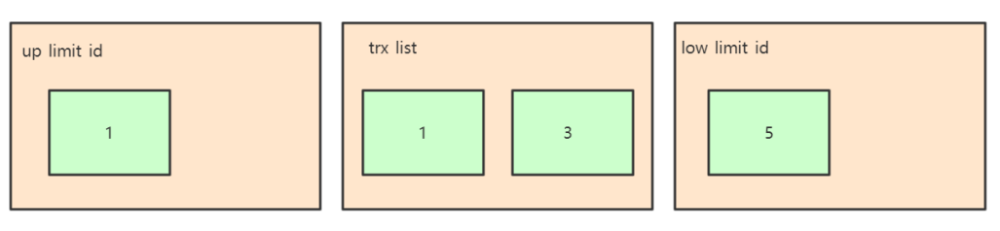
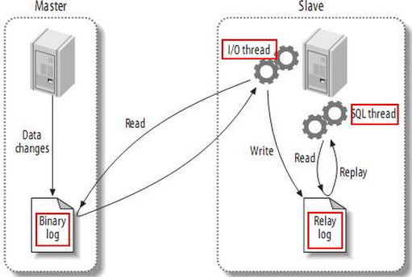

# mybatis的优缺点有哪些？

1、Mybait的优点：

（1）简单易学，容易上手（相比于Hibernate）  基于SQL编程；
（2）JDBC相比，减少了50%以上的代码量，消除了JDBC大量冗余的代码，不需要手动开关连接；
（3）很好的与各种数据库兼容（因为MyBatis使用JDBC来连接数据库，所以只要JDBC支持的数据库MyBatis都支持，而JDBC提供了可扩展性，所以只要这个数据库有针对Java的jar包就可以就可以与MyBatis兼容），开发人员不需要考虑数据库的差异性。
（4）提供了很多第三方插件（分页插件 / 逆向工程）；
（5）能够与Spring很好的集成；
（6）MyBatis相当灵活，不会对应用程序或者数据库的现有设计强加任何影响，SQL写在XML里，从程序代码中彻底分离，解除sql与程序代码的耦合，便于统一管理和优化，并可重用。
（7）提供XML标签，支持编写动态SQL语句。
（8）提供映射标签，支持对象与数据库的ORM字段关系映射。
（9）提供对象关系映射标签，支持对象关系组建维护。
2、MyBatis框架的缺点：

（1）SQL语句的编写工作量较大，尤其是字段多、关联表多时，更是如此，对开发人员编写SQL语句的功底有一定要求。
（2）SQL语句依赖于数据库，导致数据库移植性差，不能随意更换数据库。

# mybatis和hibernate有什么区别？

Hibernate的优点：

1、hibernate是全自动，hibernate完全可以通过对象关系模型实现对数据库的操作，拥有完整的JavaBean对象与数据库的映射结构来自动生成sql。

2、功能强大，数据库无关性好，O/R映射能力强，需要写的代码很少，开发速度很快。

3、有更好的二级缓存机制，可以使用第三方缓存。

4、数据库移植性良好。

5、hibernate拥有完整的日志系统，hibernate日志系统非常健全，涉及广泛，包括sql记录、关系异常、优化警告、缓存提示、脏数据警告等

Hibernate的缺点：

1、学习门槛高，精通门槛更高，程序员如何设计O/R映射，在性能和对象模型之间如何取得平衡，以及怎样用好Hibernate方面需要的经验和能力都很强才行

2、hibernate的sql很多都是自动生成的，无法直接维护sql；虽然有hql查询，但功能还是不及sql强大，见到报表等变态需求时，hql查询要虚，也就是说hql查询是有局限的；hibernate虽然也支持原生sql查询，但开发模式上却与orm不同，需要转换思维，因此使用上有些不方便。总之写sql的灵活度上hibernate不及mybatis。

Mybatis的优点：

1、易于上手和掌握，提供了数据库查询的自动对象绑定功能，而且延续了很好的SQL使用经验，对于没有那么高的对象模型要求的项目来说，相当完美。

2、sql写在xml里，便于统一管理和优化， 解除sql与程序代码的耦合。

3、提供映射标签，支持对象与数据库的orm字段关系映射

4、 提供对象关系映射标签，支持对象关系组建维护

5、提供xml标签，支持编写动态sql。

6、速度相对于Hibernate的速度较快

Mybatis的缺点：

1、关联表多时，字段多的时候，sql工作量很大。

2、sql依赖于数据库，导致数据库移植性差。

3、由于xml里标签id必须唯一，导致DAO中方法不支持方法重载。

4、对象关系映射标签和字段映射标签仅仅是对映射关系的描述，具体实现仍然依赖于sql。

5、DAO层过于简单，对象组装的工作量较大。

6、不支持级联更新、级联删除。

7、Mybatis的日志除了基本记录功能外，其它功能薄弱很多。

8、编写动态sql时,不方便调试，尤其逻辑复杂时。

9、提供的写动态sql的xml标签功能简单，编写动态sql仍然受限，且可读性低。

# mybatis中#{}和${}的区别是什么？

a、#{}是预编译处理，${}是字符串替换。
b、Mybatis 在处理#{}时，会将 sql 中的#{}替换为?号，调用 PreparedStatement 的 set 方法来赋值；
c、Mybatis 在处理${}时，就是把${}替换成变量的值。
d、使用#{}可以有效的防止 SQL 注入，提高系统安全性

# 简述一下mybatis插件运行原理及开发流程？

mybatis只支持针对ParameterHandler、ResultSetHandler、StatementHandler、Executor这四种接口的插件，mybatis使用jdk的动态代理，为需要拦截的接口生成代理对象以实现接口方法拦截功能，每当执行这四种接口对象的方法时，就会进入拦截方法，具体就是InvocationHandler的invoke方法，拦截那些你指定需要拦截的方法。

编写插件：实现Mybatis的Interceptor接口并复写intercept方法啊，然后给插件编写注解，指定要拦截哪一个接口的哪些方法，在配置文件中配置编写的插件即可。

```java
@Intercepts({@Signature(type = StatementHandler.class,method = "parameterize",args = Statement.class)})
```

## 索引的基本原理

1、为什么要有索引?
一般的应用系统，读写比例在10:1左右，而且插入操作和一般的更新操作很少出现性能问题，在生产环境中，我们遇到最多的，也是最容易出问题的，还是一些复杂的查询操作，因此对查询语句的优化显然是重中之重。说起加速查询，就不得不提到索引了。
2、什么是索引？
索引在MySQL中也叫是一种“键”，是存储引擎用于快速找到记录的一种数据结构。索引对于良好的性能
非常关键，尤其是当表中的数据量越来越大时，索引对于性能的影响愈发重要。
索引优化应该是对查询性能优化最有效的手段了。索引能够轻易将查询性能提高好几个数量级。
索引相当于字典的音序表，如果要查某个字，如果不使用音序表，则需要从几百页中逐页去查。	

3、索引的原理

索引的目的在于提高查询效率，与我们查阅图书所用的目录是一个道理：先定位到章，然后定位到该章下的一个小节，然后找到页数。相似的例子还有：查字典，查火车车次，飞机航班等

本质都是：通过不断地缩小想要获取数据的范围来筛选出最终想要的结果，同时把随机的事件变成顺序的事件，也就是说，有了这种索引机制，我们可以总是用同一种查找方式来锁定数据。

数据库也是一样，但显然要复杂的多，因为不仅面临着等值查询，还有范围查询(>、<、between、in)、模糊查询(like)、并集查询(or)等等。数据库应该选择怎么样的方式来应对所有的问题呢？我们回想字典的例子，能不能把数据分成段，然后分段查询呢？最简单的如果1000条数据，1到100分成第一段，101到200分成第二段，201到300分成第三段…这样查第250条数据，只要找第三段就可以了，一下子去除了90%的无效数据。但如果是1千万的记录呢，分成几段比较好？按照搜索树的模型，其平均复杂度是lgN，具有不错的查询性能。但这里我们忽略了一个关键的问题，复杂度模型是基于每次相同的操作成本来考虑的。而数据库实现比较复杂，一方面数据是保存在磁盘上的，另外一方面为了提高性能，每次又可以把部分数据读入内存来计算，因为我们知道访问磁盘的成本大概是访问内存的十万倍左右，所以简单的搜索树难以满足复杂的应用场景。

4、索引的数据结构

MySQL主要用到两种结构：B+ Tree索引和Hash索引
Inodb存储引擎 默认是 B+Tree索引
Memory 存储引擎 默认 Hash索引；
MySQL中，只有Memory(Memory表只存在内存中，断电会消失，适用于临时表)存储引擎显示支持Hash索引，是Memory表的默认索引类型，尽管Memory表也可以使用B+Tree索引。Hash索引把数据以hash形式组织起来，因此当查找某一条记录的时候，速度非常快。但是因为hash结构，每个键只对应一个值，而且是散列的方式分布。所以它并不支持范围查找和排序等功能。
B+Tree是mysql使用最频繁的一个索引数据结构，是InnoDB和MyISAM存储引擎模式的索引类型。相对Hash索引，B+Tree在查找单条记录的速度比不上Hash索引，但是因为更适合排序等操作，所以它更受欢迎。毕竟不可能只对数据库进行单条记录的操作。
对比：
hash类型的索引：查询单条快，范围查询慢
btree类型的索引：b+树，层数越多，数据量指数级增长（我们就用它，因为innodb默认支持它）

# mysql聚簇和非聚簇索引的区别是什么？

​		mysql的索引类型跟存储引擎是相关的，innodb存储引擎数据文件跟索引文件全部放在ibd文件中，而myisam的数据文件放在myd文件中，索引放在myi文件中，其实区分聚簇索引和非聚簇索引非常简单，只要判断数据跟索引是否存储在一起就可以了。

​		innodb存储引擎在进行数据插入的时候，数据必须要跟索引放在一起，如果有主键就使用主键，没有主键就使用唯一键，没有唯一键就使用6字节的rowid，因此跟数据绑定在一起的就是聚簇索引，而为了避免数据冗余存储，其他的索引的叶子节点中存储的都是聚簇索引的key值，因此innodb中既有聚簇索引也有非聚簇索引，而myisam中只有非聚簇索引。

# mysql索引结构有哪些，各自的优劣是什么？

索引的数据结构和具体存储引擎的实现有关，mysql中使用较多的索引有hash索引，B+树索引，innodb的索引实现为B+树，memory存储引擎为hash索引。

B+树是一个平衡的多叉树，从根节点到每个叶子节点的高度差值不超过1，而且同层级的二节点间有指针相关连接，在B+树上的常规检索，从根节点到叶子节点的搜索效率基本相当，不会出现大幅波动，而且基于索引的顺序扫描时，也可以利用双向指针快速左右移动，效率非常高。因为，B+树索引被广泛应用于数据库、文件系统等场景。

哈希索引就是采用一定的哈希算法，把键值换算成新的哈希值，检索时不需要类似B+树那样从根节点到叶子节点逐级查找，只需一次哈希算法即可立刻定位到相应的位置，速度非常快。

如果是等值查询，那么哈希索引明显有绝对优势，因为只需要经过一次算法即可找到相应的键值，前提是键值都是唯一的。如果键值不是唯一的，就需要先找到该键所在位置，然后再根据链表往后扫描，知道找到对应的数据

如果是范围查询检索，这时候哈徐索引就毫无用武之地了，因为原先是有序的键值，经过哈希算法后，有可能变成不连续的了，就没办法再利用索引完成范围查询检索

哈希所有也没办法利用索引完成排序，以及like这样的部分模糊查询

哈希索引也不支持多列联合索引的最左匹配规则

B+树索引的关键字检索效率比较平均，不像B树那样波动大，在有大量重复键值情况下，哈希索引的效率也是极低的，因此存在哈希碰撞问题。

# 索引的设计原则有哪些？

​		在进行索引设计的时候，应该保证索引字段占用的空间越小越好，这只是一个大的方向，还有一些细节点需要注意下：

​		1、适合索引的列是出现在where字句中的列，或者连接子句中指定的列

​		2、基数较小的表，索引效果差，没必要创建索引

​		3、在选择索引列的时候，越短越好，可以指定某些列的一部分，没必要用全部字段的值

​		4、不要给表中的每一个字段都创建索引，并不是索引越多越好

​		5、定义有外键的数据列一定要创建索引

​		6、更新频繁的字段不要有索引

​		7、创建索引的列不要过多，可以创建组合索引，但是组合索引的列的个数不建议太多

​		8、大文本、大对象不要创建索引

# mysql锁的类型有哪些？

基于锁的属性分类：共享锁、排他锁。

基于锁的粒度分类：行级锁（innodb ）、表级锁（ innodb 、myisam）、页级锁（ innodb引擎）、记录锁、间隙锁、临键锁。

基于锁的状态分类：意向共享锁、意向排它锁。 

 共享锁（share lock）： 共享锁又称读锁，简称 S 锁；当一个事务为数据加上读锁之后，其他事务只能对该数据加读锁，而不能对数据加写锁，直到所有的读锁释放之后其他事务才能对其进行加持写锁。共享锁的特性主要是为了支持并发的读取数据，读取数据的时候不支持修改，避免出现重复读的问题。

 排他锁（exclusive lock）：排他锁又称写锁，简称 X 锁；当一个事务为数据加上写锁时，其他请求将不能再为数据加任何锁，直到该锁释放之后，其他事务才能对数据进行加锁。排他锁的目的是在数据修改时候，不允许其他人同时修改，也不允许其他人读取，避免了出现脏数据和脏读的问题。

表锁（table lock）：表锁是指上锁的时候锁住的是整个表，当下一个事务访问该表的时候，必须等前一个事务释放了锁才能进行对表进行访问；特点：粒度大，加锁简单，容易冲突；

行锁：行锁是指上锁的时候锁住的是表的某一行或多行记录，其他事务访问同一张表时，只有被锁住的记录不能访问，其他的记录可正常访问，特点：粒度小，加锁比表锁麻烦，不容易冲突，相比表锁支持的并发要高

记录锁（Record lock）:记录锁也属于行锁中的一种，只不过记录锁的范围只是表中的某一条记录，记录锁是说事务在加锁后锁住的只是表的某一条记录，加了记录锁之后数据可以避免数据在查询的时候被修改的重复读问题，也避免了在修改的事务未提交前被其他事务读取的脏读问题

页锁：页级锁是 MysQL 中锁定粒度介于行级锁和表级锁中间的一种锁．表级锁速度快，但冲突多，行级冲突少，但速度慢。所以取了折衷的页级，一次锁定相邻的一组记录。特点：开销和加锁时间界于表锁和行锁之间，会出现死锁；锁定粒度界于表锁和行锁之间，并发度一般。

间隙锁：是属于行锁的一种，间隙锁是在事务加锁后其锁住的是表记录的某一个区间，当表的相邻ID之间出现空隙则会形成一个区间，遵循左开右闭原则。范围查询并且查询未命中记录，查询条件必须命中索引、间隙锁只会出现在REPEATABLE_READ（重复读）的事务级别中。

临键锁（Next-Key lock)：也属于行锁的一种，并且它是INNODB的行锁默认算法，总结来说它就是记录锁和间隙锁的组合，临键锁会把查询出来的记录锁住，同时也会把该范围查询内的所有间隙空间也会锁住，再之它会把相邻的下一个区间也会锁住。

# mysql执行计划怎么看？

​       在企业的应用场景中，为了知道优化SQL语句的执行，需要查看SQL语句的具体执行过程，以加快SQL语句的执行效率。

​       可以使用explain+SQL语句来模拟优化器执行SQL查询语句，从而知道mysql是如何处理sql语句的。

​	   官网地址： https://dev.mysql.com/doc/refman/5.7/en/explain-output.html 

1、执行计划中包含的信息

| Column        | Meaning                                        |
| ------------- | ---------------------------------------------- |
| id            | The `SELECT` identifier                        |
| select_type   | The `SELECT` type                              |
| table         | The table for the output row                   |
| partitions    | The matching partitions                        |
| type          | The join type                                  |
| possible_keys | The possible indexes to choose                 |
| key           | The index actually chosen                      |
| key_len       | The length of the chosen key                   |
| ref           | The columns compared to the index              |
| rows          | Estimate of rows to be examined                |
| filtered      | Percentage of rows filtered by table condition |
| extra         | Additional information                         |

**id**

select查询的序列号，包含一组数字，表示查询中执行select子句或者操作表的顺序

id号分为三种情况：

​		1、如果id相同，那么执行顺序从上到下

```sql
explain select * from emp e join dept d on e.deptno = d.deptno join salgrade sg on e.sal between sg.losal and sg.hisal;
```

​		2、如果id不同，如果是子查询，id的序号会递增，id值越大优先级越高，越先被执行

```sql
explain select * from emp e where e.deptno in (select d.deptno from dept d where d.dname = 'SALES');
```

​		3、id相同和不同的，同时存在：相同的可以认为是一组，从上往下顺序执行，在所有组中，id值越大，优先级越高，越先执行

```sql
explain select * from emp e join dept d on e.deptno = d.deptno join salgrade sg on e.sal between sg.losal and sg.hisal where e.deptno in (select d.deptno from dept d where d.dname = 'SALES');
```

**select_type**

主要用来分辨查询的类型，是普通查询还是联合查询还是子查询

| `select_type` Value  | Meaning                                                      |
| -------------------- | ------------------------------------------------------------ |
| SIMPLE               | Simple SELECT (not using UNION or subqueries)                |
| PRIMARY              | Outermost SELECT                                             |
| UNION                | Second or later SELECT statement in a UNION                  |
| DEPENDENT UNION      | Second or later SELECT statement in a UNION, dependent on outer query |
| UNION RESULT         | Result of a UNION.                                           |
| SUBQUERY             | First SELECT in subquery                                     |
| DEPENDENT SUBQUERY   | First SELECT in subquery, dependent on outer query           |
| DERIVED              | Derived table                                                |
| UNCACHEABLE SUBQUERY | A subquery for which the result cannot be cached and must be re-evaluated for each row of the outer query |
| UNCACHEABLE UNION    | The second or later select in a UNION that belongs to an uncacheable subquery (see UNCACHEABLE SUBQUERY) |

```sql
--sample:简单的查询，不包含子查询和union
explain select * from emp;

--primary:查询中若包含任何复杂的子查询，最外层查询则被标记为Primary
explain select staname,ename supname from (select ename staname,mgr from emp) t join emp on t.mgr=emp.empno ;

--union:若第二个select出现在union之后，则被标记为union
explain select * from emp where deptno = 10 union select * from emp where sal >2000;

--dependent union:跟union类似，此处的depentent表示union或union all联合而成的结果会受外部表影响
explain select * from emp e where e.empno  in ( select empno from emp where deptno = 10 union select empno from emp where sal >2000)

--union result:从union表获取结果的select
explain select * from emp where deptno = 10 union select * from emp where sal >2000;

--subquery:在select或者where列表中包含子查询
explain select * from emp where sal > (select avg(sal) from emp) ;

--dependent subquery:subquery的子查询要受到外部表查询的影响
explain select * from emp e where e.deptno in (select distinct deptno from dept);

--DERIVED: from子句中出现的子查询，也叫做派生类，
explain select staname,ename supname from (select ename staname,mgr from emp) t join emp on t.mgr=emp.empno ;

--UNCACHEABLE SUBQUERY：表示使用子查询的结果不能被缓存
 explain select * from emp where empno = (select empno from emp where deptno=@@sort_buffer_size);
 
--uncacheable union:表示union的查询结果不能被缓存：sql语句未验证
```

**table**

对应行正在访问哪一个表，表名或者别名，可能是临时表或者union合并结果集
		1、如果是具体的表名，则表明从实际的物理表中获取数据，当然也可以是表的别名

​		2、表名是derivedN的形式，表示使用了id为N的查询产生的衍生表

​		3、当有union result的时候，表名是union n1,n2等的形式，n1,n2表示参与union的id

**type**

type显示的是访问类型，访问类型表示我是以何种方式去访问我们的数据，最容易想的是全表扫描，直接暴力的遍历一张表去寻找需要的数据，效率非常低下，访问的类型有很多，效率从最好到最坏依次是：

system > const > eq_ref > ref > fulltext > ref_or_null > index_merge > unique_subquery > index_subquery > range > index > ALL 

一般情况下，得保证查询至少达到range级别，最好能达到ref

```sql
--all:全表扫描，一般情况下出现这样的sql语句而且数据量比较大的话那么就需要进行优化。
explain select * from emp;

--index：全索引扫描这个比all的效率要好，主要有两种情况，一种是当前的查询时覆盖索引，即我们需要的数据在索引中就可以索取，或者是使用了索引进行排序，这样就避免数据的重排序
explain  select empno from emp;

--range：表示利用索引查询的时候限制了范围，在指定范围内进行查询，这样避免了index的全索引扫描，适用的操作符： =, <>, >, >=, <, <=, IS NULL, BETWEEN, LIKE, or IN() 
explain select * from emp where empno between 7000 and 7500;

--index_subquery：利用索引来关联子查询，不再扫描全表
explain select * from emp where emp.job in (select job from t_job);

--unique_subquery:该连接类型类似与index_subquery,使用的是唯一索引
 explain select * from emp e where e.deptno in (select distinct deptno from dept);
 
--index_merge：在查询过程中需要多个索引组合使用，没有模拟出来
explain select * from rental where rental_date like '2005-05-26 07:12:2%' and inventory_id=3926 and customer_id=321\G

--ref_or_null：对于某个字段即需要关联条件，也需要null值的情况下，查询优化器会选择这种访问方式
explain select * from emp e where  e.mgr is null or e.mgr=7369;

--ref：使用了非唯一性索引进行数据的查找
 create index idx_3 on emp(deptno);
 explain select * from emp e,dept d where e.deptno =d.deptno;

--eq_ref ：使用唯一性索引进行数据查找
explain select * from emp,emp2 where emp.empno = emp2.empno;

--const：这个表至多有一个匹配行，
explain select * from emp where empno = 7369;
 
--system：表只有一行记录（等于系统表），这是const类型的特例，平时不会出现
```

 **possible_keys** 

​        显示可能应用在这张表中的索引，一个或多个，查询涉及到的字段上若存在索引，则该索引将被列出，但不一定被查询实际使用

```sql
explain select * from emp,dept where emp.deptno = dept.deptno and emp.deptno = 10;
```

**key**

​		实际使用的索引，如果为null，则没有使用索引，查询中若使用了覆盖索引，则该索引和查询的select字段重叠。

```sql
explain select * from emp,dept where emp.deptno = dept.deptno and emp.deptno = 10;
```

**key_len**

表示索引中使用的字节数，可以通过key_len计算查询中使用的索引长度，在不损失精度的情况下长度越短越好。

```sql
explain select * from emp,dept where emp.deptno = dept.deptno and emp.deptno = 10;
```

**ref**

显示索引的哪一列被使用了，如果可能的话，是一个常数

```sql
explain select * from emp,dept where emp.deptno = dept.deptno and emp.deptno = 10;
```

**rows**

根据表的统计信息及索引使用情况，大致估算出找出所需记录需要读取的行数，此参数很重要，直接反应的sql找了多少数据，在完成目的的情况下越少越好

```sql
explain select * from emp;
```

**extra**

包含额外的信息。

```sql
--using filesort:说明mysql无法利用索引进行排序，只能利用排序算法进行排序，会消耗额外的位置
explain select * from emp order by sal;

--using temporary:建立临时表来保存中间结果，查询完成之后把临时表删除
explain select ename,count(*) from emp where deptno = 10 group by ename;

--using index:这个表示当前的查询时覆盖索引的，直接从索引中读取数据，而不用访问数据表。如果同时出现using where 表名索引被用来执行索引键值的查找，如果没有，表面索引被用来读取数据，而不是真的查找
explain select deptno,count(*) from emp group by deptno limit 10;

--using where:使用where进行条件过滤
explain select * from t_user where id = 1;

--using join buffer:使用连接缓存，情况没有模拟出来

--impossible where：where语句的结果总是false
explain select * from emp where empno = 7469;
```

# 事务的基本特性是什么？

事务四大特征：原子性，一致性，隔离性和持久性。

1. 原子性（Atomicity）
   一个原子事务要么完整执行，要么干脆不执行。这意味着，工作单元中的每项任务都必须正确执行。如果有任一任务执行失败，则整个工作单元或事务就会被终止。即此前对数据所作的任何修改都将被撤销。如果所有任务都被成功执行，事务就会被提交，即对数据所作的修改将会是永久性的。
2. 一致性（Consistency）
   一致性代表了底层数据存储的完整性。它必须由事务系统和应用开发人员共同来保证。事务系统通过保证事务的原子性，隔离性和持久性来满足这一要求; 应用开发人员则需要保证数据库有适当的约束(主键，引用完整性等)，并且工作单元中所实现的业务逻辑不会导致数据的不一致(即，数据预期所表达的现实业务情况不相一致)。例如，在一次转账过程中，从某一账户中扣除的金额必须与另一账户中存入的金额相等。支付宝账号100 你读到余额要取，有人向你转100 但是事物没提交（这时候你读到的余额应该是100，而不是200） 这种就是一致性
3. 隔离性（Isolation）
   隔离性意味着事务必须在不干扰其他进程或事务的前提下独立执行。换言之，在事务或工作单元执行完毕之前，其所访问的数据不能受系统其他部分的影响。
4. 持久性（Durability）
   持久性表示在某个事务的执行过程中，对数据所作的所有改动都必须在事务成功结束前保存至某种物理存储设备。这样可以保证，所作的修改在任何系统瘫痪时不至于丢失。

# MySQL的隔离级别有哪些？

MySQL定义了四种隔离级别，包括一些具体规则，用于限定事务内外哪些改变是可见的，哪些改变是不可见的。低级别的隔离一般支持更高的并发处理，并且拥有更低的系统开销。
REPEATABLE READ 可重复读
MySQL数据库默认的隔离级别。该级别解决了READ UNCOMMITTED隔离级别导致的问题。它保证同一事务的多个实例在并发读取事务时，会“看到同样的”数据行。不过，这会导致另外一个棘手问题“幻读”。InnoDB和Falcon存储引擎通过多版本并发控制机制解决了幻读问题。
READ COMMITTED 读取提交内容
大多数数据库系统的默认隔离级别（但是不是MySQL的默认隔离级别），满足了隔离的早先简单定义：一个事务开始时，只能“看见”已经提交事务所做的改变，一个事务从开始到提交前，所做的任何数据改变都是不可见的，除非已经提交。这种隔离级别也支持所谓的“不可重复读”。这意味着用户运行同一个语句两次，看到的结果是不同的。
READ UNCOMMITTED 读取未提交内容
在这个隔离级别，所有事务都可以“看到”未提交事务的执行结果。在这种级别上，可能会产生很多问题，除非用户真的知道自己在做什么，并有很好的理由选择这样做。本隔离级别很少用于实际应用，因为它的性能也不必其他性能好多少，而别的级别还有其他更多的优点。读取未提交数据，也被称为“脏读”
SERIALIZABLE 可串行化
该级别是最高级别的隔离级。它通过强制事务排序，使之不可能相互冲突，从而解决幻读问题。简而言之，SERIALIZABLE是在每个读的数据行上加锁。在这个级别，可能导致大量的超时Timeout和锁竞争Lock Contention现象，实际应用中很少使用到这个级别，但如果用户的应用为了数据的稳定性，需要强制减少并发的话，也可以选择这种隔离级。

1. 脏读

脏读是指一个事务读取了未提交事务执行过程中的数据。
当一个事务的操作正在多次修改数据，而在事务还未提交的时候，另外一个并发事务来读取了数据，就会导致读取到的数据并非是最终持久化之后的数据，这个数据就是脏读的数据。

2. 不可重复读

不可重复读是指对于数据库中的某个数据，一个事务执行过程中多次查询返回不同查询结果，这就是在事务执行过程中，数据被其他事务提交修改了。
不可重复读同脏读的区别在于，脏读是一个事务读取了另一未完成的事务执行过程中的数据，而不可重复读是一个事务执行过程中，另一事务提交并修改了当前事务正在读取的数据。

3. 虚读(幻读)

幻读是事务非独立执行时发生的一种现象，例如事务T1批量对一个表中某一列列值为1的数据修改为2的变更，但是在这时，事务T2对这张表插入了一条列值为1的数据，并完成提交。此时，如果事务T1查看刚刚完成操作的数据，发现还有一条列值为1的数据没有进行修改，而这条数据其实是T2刚刚提交插入的，这就是幻读。
幻读和不可重复读都是读取了另一条已经提交的事务（这点同脏读不同），所不同的是不可重复读查询的都是同一个数据项，而幻读针对的是一批数据整体（比如数据的个数）。

# 怎么处理MySQL的慢查询？

1、开启慢查询日志，准确定位到哪个sql语句出现了问题

2、分析sql语句，看看是否load了额外的数据，可能是查询了多余的行并且抛弃掉了，可能是加载了许多结果中并不需要的列，对语句进行分析以及重写

3、分析语句的执行计划，然后获得其使用索引的情况，之后修改语句或者修改索引，使得语句可以尽可能的命中索引

4、如果对语句的优化已经无法进行，可以考虑表中的数据量是否太大，如果是的话可以进行横向或者纵向的分表。

# ACID是靠什么保证的？

原子性由undolog日志来保证，它记录了需要回滚的日志信息，事务回滚时撤销已经执行成功的sql

一致性是由其他三大特性保证，程序代码要保证业务上的一致性

隔离性是由MVCC来保证

持久性由redolog来保证，mysql修改数据的时候会在redolog中记录一份日志数据，就算数据没有保存成功，只要日志保存成功了，数据仍然不会丢失

# 什么是MVCC？

1、MVCC

​		MVCC，全称Multi-Version Concurrency Control，即多版本并发控制。MVCC是一种并发控制的方法，一般在数据库管理系统中，实现对数据库的并发访问，在编程语言中实现事务内存。

 		MVCC在MySQL InnoDB中的实现主要是为了提高数据库并发性能，用更好的方式去处理读写冲突，做到即使有读写冲突时，也能做到不加锁，非阻塞并发读。

2、当前读

​		像select lock in share mode(共享锁), select for update ; update, insert ,delete(排他锁)这些操作都是一种当前读，为什么叫当前读？就是它读取的是记录的最新版本，读取时还要保证其他并发事务不能修改当前记录，会对读取的记录进行加锁。

3、快照读（提高数据库的并发查询能力）

​		像不加锁的select操作就是快照读，即不加锁的非阻塞读；快照读的前提是隔离级别不是串行级别，串行级别下的快照读会退化成当前读；之所以出现快照读的情况，是基于提高并发性能的考虑，快照读的实现是基于多版本并发控制，即MVCC,可以认为MVCC是行锁的一个变种，但它在很多情况下，避免了加锁操作，降低了开销；既然是基于多版本，即快照读可能读到的并不一定是数据的最新版本，而有可能是之前的历史版本

4、当前读、快照读、MVCC关系

​		MVCC多版本并发控制指的是维持一个数据的多个版本，使得读写操作没有冲突，快照读是MySQL为实现MVCC的一个非阻塞读功能。MVCC模块在MySQL中的具体实现是由三个隐式字段，undo日志、read view三个组件来实现的。

# MVCC解决的问题是什么？

​		数据库并发场景有三种，分别为：

​		1、读读：不存在任何问题，也不需要并发控制

​		2、读写：有线程安全问题，可能会造成事务隔离性问题，可能遇到脏读、幻读、不可重复读

​		3、写写：有线程安全问题，可能存在更新丢失问题

​		MVCC是一种用来解决读写冲突的无锁并发控制，也就是为事务分配单项增长的时间戳，为每个修改保存一个版本，版本与事务时间戳关联，读操作只读该事务开始前的数据库的快照，所以MVCC可以为数据库解决一下问题：

​		1、在并发读写数据库时，可以做到在读操作时不用阻塞写操作，写操作也不用阻塞读操作，提高了数据库并发读写的性能

​		2、解决脏读、幻读、不可重复读等事务隔离问题，但是不能解决更新丢失问题

# MVCC实现原理是什么？

​		mvcc的实现原理主要依赖于记录中的三个隐藏字段，undolog，read view来实现的。

​		**隐藏字段**

​		每行记录除了我们自定义的字段外，还有数据库隐式定义的DB_TRX_ID,DB_ROLL_PTR,DB_ROW_ID等字段

​		DB_TRX_ID

​		6字节，最近修改事务id，记录创建这条记录或者最后一次修改该记录的事务id

​		DB_ROLL_PTR

​		7字节，回滚指针，指向这条记录的上一个版本,用于配合undolog，指向上一个旧版本

​		DB_ROW_JD

​		6字节，隐藏的主键，如果数据表没有主键，那么innodb会自动生成一个6字节的row_id

​		记录如图所示：


​		在上图中，DB_ROW_ID是数据库默认为该行记录生成的唯一隐式主键，DB_TRX_ID是当前操作该记录的事务ID，DB_ROLL_PTR是一个回滚指针，用于配合undo日志，指向上一个旧版本

​		**undo log**

​		undolog被称之为回滚日志，表示在进行insert，delete，update操作的时候产生的方便回滚的日志

​		当进行insert操作的时候，产生的undolog只在事务回滚的时候需要，并且在事务提交之后可以被立刻丢弃

​		当进行update和delete操作的时候，产生的undolog不仅仅在事务回滚的时候需要，在快照读的时候也需要，所以不能随便删除，只有在快照读或事务回滚不涉及该日志时，对应的日志才会被purge线程统一清除（当数据发生更新和删除操作的时候都只是设置一下老记录的deleted_bit，并不是真正的将过时的记录删除，因为为了节省磁盘空间，innodb有专门的purge线程来清除deleted_bit为true的记录，如果某个记录的deleted_id为true，并且DB_TRX_ID相对于purge线程的read view 可见，那么这条记录一定时可以被清除的）

​		**下面我们来看一下undolog生成的记录链**

​		1、假设有一个事务编号为1的事务向表中插入一条记录，那么此时行数据的状态为：


​		2、假设有第二个事务编号为2对该记录的name做出修改，改为lisi

​		在事务2修改该行记录数据时，数据库会对该行加排他锁

​		然后把该行数据拷贝到undolog中，作为 旧记录，即在undolog中有当前行的拷贝副本

​		拷贝完毕后，修改该行name为lisi，并且修改隐藏字段的事务id为当前事务2的id，回滚指针指向拷贝到undolog的副本记录中

​		事务提交后，释放锁


​		3、假设有第三个事务编号为3对该记录的age做了修改，改为32

​		在事务3修改该行数据的时，数据库会对该行加排他锁

​		然后把该行数据拷贝到undolog中，作为旧纪录，发现该行记录已经有undolog了，那么最新的旧数据作为链表的表头，插在该行记录的undolog最前面

​		修改该行age为32岁，并且修改隐藏字段的事务id为当前事务3的id，回滚指针指向刚刚拷贝的undolog的副本记录

​		事务提交，释放锁


​		从上述的一系列图中，大家可以发现，不同事务或者相同事务的对同一记录的修改，会导致该记录的undolog生成一条记录版本线性表，即链表，undolog的链首就是最新的旧记录，链尾就是最早的旧记录。

​		**Read View**

​		上面的流程如果看明白了，那么大家需要再深入理解下read view的概念了。

​		Read View是事务进行快照读操作的时候生产的读视图，在该事务执行快照读的那一刻，会生成一个数据系统当前的快照，记录并维护系统当前活跃事务的id，事务的id值是递增的。

​		其实Read View的最大作用是用来做可见性判断的，也就是说当某个事务在执行快照读的时候，对该记录创建一个Read View的视图，把它当作条件去判断当前事务能够看到哪个版本的数据，有可能读取到的是最新的数据，也有可能读取的是当前行记录的undolog中某个版本的数据

​		Read View遵循的可见性算法主要是将要被修改的数据的最新记录中的DB_TRX_ID（当前事务id）取出来，与系统当前其他活跃事务的id去对比，如果DB_TRX_ID跟Read View的属性做了比较，不符合可见性，那么就通过DB_ROLL_PTR回滚指针去取出undolog中的DB_TRX_ID做比较，即遍历链表中的DB_TRX_ID，直到找到满足条件的DB_TRX_ID,这个DB_TRX_ID所在的旧记录就是当前事务能看到的最新老版本数据。

​		Read View的可见性规则如下所示：

​		首先要知道Read View中的三个全局属性：

​		trx_list:一个数值列表，用来维护Read View生成时刻系统正活跃的事务ID（1,2,3）

​		up_limit_id:记录trx_list列表中事务ID最小的ID（1）

​		low_limit_id:Read View生成时刻系统尚未分配的下一个事务ID，（4）

​		具体的比较规则如下：

​		1、首先比较DB_TRX_ID < up_limit_id,如果小于，则当前事务能看到DB_TRX_ID所在的记录，如果大于等于进入下一个判断

​		2、接下来判断DB_TRX_ID >= low_limit_id,如果大于等于则代表DB_TRX_ID所在的记录在Read View生成后才出现的，那么对于当前事务肯定不可见，如果小于，则进入下一步判断

​		3、判断DB_TRX_ID是否在活跃事务中，如果在，则代表在Read View生成时刻，这个事务还是活跃状态，还没有commit，修改的数据，当前事务也是看不到，如果不在，则说明这个事务在Read View生成之前就已经开始commit，那么修改的结果是能够看见的。

7、MVCC的整体处理流程

假设有四个事务同时在执行，如下图所示：

| 事务1    | 事务2    | 事务3    | 事务4        |
| -------- | -------- | -------- | ------------ |
| 事务开始 | 事务开始 | 事务开始 | 事务开始     |
| ......   | ......   | ......   | 修改且已提交 |
| 进行中   | 快照读   | 进行中   |              |
| ......   | ......   | ......   |              |

从上述表格中，我们可以看到，当事务2对某行数据执行了快照读，数据库为该行数据生成一个Read View视图，可以看到事务1和事务3还在活跃状态，事务4在事务2快照读的前一刻提交了更新，所以，在Read View中记录了系统当前活跃事务1，3，维护在一个列表中。同时可以看到up_limit_id的值为1，而low_limit_id为5，如下图所示：



在上述的例子中，只有事务4修改过该行记录，并在事务2进行快照读前，就提交了事务，所以该行当前数据的undolog如下所示：


​		当事务2在快照读该行记录的是，会拿着该行记录的DB_TRX_ID去跟up_limit_id,lower_limit_id和活跃事务列表进行比较，判读事务2能看到该行记录的版本是哪个。

​		具体流程如下：先拿该行记录的事务ID（4）去跟Read View中的up_limit_id相比较，判断是否小于，通过对比发现不小于，所以不符合条件，继续判断4是否大于等于low_limit_id,通过比较发现也不大于，所以不符合条件，判断事务4是否处理trx_list列表中，发现不再次列表中，那么符合可见性条件，所以事务4修改后提交的最新结果对事务2 的快照是可见的，因此，事务2读取到的最新数据记录是事务4所提交的版本，而事务4提交的版本也是全局角度的最新版本。如下图所示：


当上述的内容都看明白了的话，那么大家就应该能够搞清楚这几个核心概念之间的关系了，下面我们讲一个不同的隔离级别下的快照读的不同。

8、RC、RR级别下的InnoDB快照读有什么不同

​		因为Read View生成时机的不同，从而造成RC、RR级别下快照读的结果的不同

​		1、在RR级别下的某个事务的对某条记录的第一次快照读会创建一个快照即Read View,将当前系统活跃的其他事务记录起来，此后在调用快照读的时候，还是使用的是同一个Read View,所以只要当前事务在其他事务提交更新之前使用过快照读，那么之后的快照读使用的都是同一个Read View,所以对之后的修改不可见

​		2、在RR级别下，快照读生成Read View时，Read View会记录此时所有其他活动和事务的快照，这些事务的修改对于当前事务都是不可见的，而早于Read View创建的事务所做的修改均是可见

​		3、在RC级别下，事务中，每次快照读都会新生成一个快照和Read View,这就是我们在RC级别下的事务中可以看到别的事务提交的更新的原因。

​		**总结：在RC隔离级别下，是每个快照读都会生成并获取最新的Read View,而在RR隔离级别下，则是同一个事务中的第一个快照读才会创建Read View，之后的快照读获取的都是同一个Read View.**

# 什么是mysql的主从复制？

​		MySQL 主从复制是指数据可以从一个MySQL数据库服务器主节点复制到一个或多个从节点。MySQL 默认采用异步复制方式，这样从节点不用一直访问主服务器来更新自己的数据，数据的更新可以在远程连接上进行，从节点可以复制主数据库中的所有数据库或者特定的数据库，或者特定的表。

# mysql为什么需要主从同步？

1、在业务复杂的系统中，有这么一个情景，有一句sql语句需要锁表，导致暂时不能使用读的服务，那么就很影响运行中的业务，使用主从复制，让主库负责写，从库负责读，这样，即使主库出现了锁表的情景，通过读从库也可以保证业务的正常运作。

2、做数据的热备

3、架构的扩展。业务量越来越大，I/O访问频率过高，单机无法满足，此时做多库的存储，降低磁盘I/O访问的频率，提高单个机器的I/O性能。


# mysql复制原理是什么？

​		（1）master服务器将数据的改变记录二进制binlog日志，当master上的数据发生改变时，则将其改变写入二进制日志中；		

​		（2）slave服务器会在一定时间间隔内对master二进制日志进行探测其是否发生改变，如果发生改变，则开始一个I/OThread请求master二进制事件

​		（3）同时主节点为每个I/O线程启动一个dump线程，用于向其发送二进制事件，并保存至从节点本地的中继日志中，从节点将启动SQL线程从中继日志中读取二进制日志，在本地重放，使得其数据和主节点的保持一致，最后I/OThread和SQLThread将进入睡眠状态，等待下一次被唤醒。

也就是说：

- 从库会生成两个线程,一个I/O线程,一个SQL线程;
- I/O线程会去请求主库的binlog,并将得到的binlog写到本地的relay-log(中继日志)文件中;
- 主库会生成一个log dump线程,用来给从库I/O线程传binlog;
- SQL线程,会读取relay log文件中的日志,并解析成sql语句逐一执行;

注意：

1--master将操作语句记录到binlog日志中，然后授予slave远程连接的权限（master一定要开启binlog二进制日志功能；通常为了数据安全考虑，slave也开启binlog功能）。
2--slave开启两个线程：IO线程和SQL线程。其中：IO线程负责读取master的binlog内容到中继日志relay log里；SQL线程负责从relay log日志里读出binlog内容，并更新到slave的数据库里，这样就能保证slave数据和master数据保持一致了。
3--Mysql复制至少需要两个Mysql的服务，当然Mysql服务可以分布在不同的服务器上，也可以在一台服务器上启动多个服务。
4--Mysql复制最好确保master和slave服务器上的Mysql版本相同（如果不能满足版本一致，那么要保证master主节点的版本低于slave从节点的版本）
5--master和slave两节点间时间需同步



具体步骤：

1、从库通过手工执行change  master to 语句连接主库，提供了连接的用户一切条件（user 、password、port、ip），并且让从库知道，二进制日志的起点位置（file名 position 号）；    start  slave

2、从库的IO线程和主库的dump线程建立连接。

3、从库根据change  master  to 语句提供的file名和position号，IO线程向主库发起binlog的请求。

4、主库dump线程根据从库的请求，将本地binlog以events的方式发给从库IO线程。

5、从库IO线程接收binlog  events，并存放到本地relay-log中，传送过来的信息，会记录到master.info中

6、从库SQL线程应用relay-log，并且把应用过的记录到relay-log.info中，默认情况下，已经应用过的relay 会自动被清理purge

# 简述Myisam和Innodb的区别？

InnoDB存储引擎: 主要面向OLTP(Online Transaction Processing，在线事务处理)方面的应用，是第一个完整支持ACID事务的存储引擎(BDB第一个支持事务的存储引擎，已经停止开发)。
特点：

1 支持行锁
2 支持外键
3 支持自动增加列AUTO_INCREMENT属性
4 支持事务
5 支持MVCC模式的读写
6 读的效率低于MYISAM
7.写的效率高优于MYISAM
8.适合频繁修改以及设计到安全性较高的应用
9.清空整个表的时候，Innodb是一行一行的删除，

MyISAM存储引擎: 是MySQL官方提供的存储引擎，主要面向OLAP(Online Analytical Processing,在线分析处理)方面的应用。

特点：

1 独立于操作系统，当建立一个MyISAM存储引擎的表时，就会在本地磁盘建立三个文件，例如我建立tb_demo表，那么会生成以下三个文件tb_demo.frm,tb_demo.MYD,tb_demo.MYI
2 不支持事务，
3 支持表锁和全文索引
4 MyISAM存储引擎表由MYD和MYI组成，MYD用来存放数据文件，MYI用来存放索引文件。MySQL数据库只缓存其索引文件，数据文件的缓存交给操作系统本身来完成；
5 MySQL5.0版本开始，MyISAM默认支持256T的单表数据；
6.选择密集型的表：MYISAM存储引擎在筛选大量数据时非常迅速，这是他最突出的优点
7.读的效率优于InnoDB
8.写的效率低于InnoDB
9.适合查询以及插入为主的应用
10.清空整个表的时候，MYISAM则会新建表

# 简述mysql中索引类型有哪些，以及对数据库的性能的影响？

普通索引：允许被索引的数据列包含重复的值

唯一索引：可以保证数据记录的唯一性

主键索引：是一种特殊的唯一索引，在一张表中只能定义一个主键索引，主键用于唯一标识一条记录，使用关键字primary key来创建

联合索引：索引可以覆盖多个数据列

全文索引：通过建立倒排索引，可以极大的提升检索效率，解决判断字段是否包含的问题，是目前搜索引擎使用的一种关键技术

索引可以极大地提高数据的查询速度

通过使用索引，可以在查询的过程中，使用优化隐藏器，提高系统的性能

但是会降低插入、删除、更新表的速度，因为在执行这些写操作的时候，还要操作索引文件

索引需要占物理空间，除了数据表占数据空间之外，每一个索引还要占一定的物理空间，如果要简历聚簇索引，那么需要的空间就会更大，如果非聚簇索引很多，一旦聚簇索引改变，那么所有非聚簇索引都会跟着变

