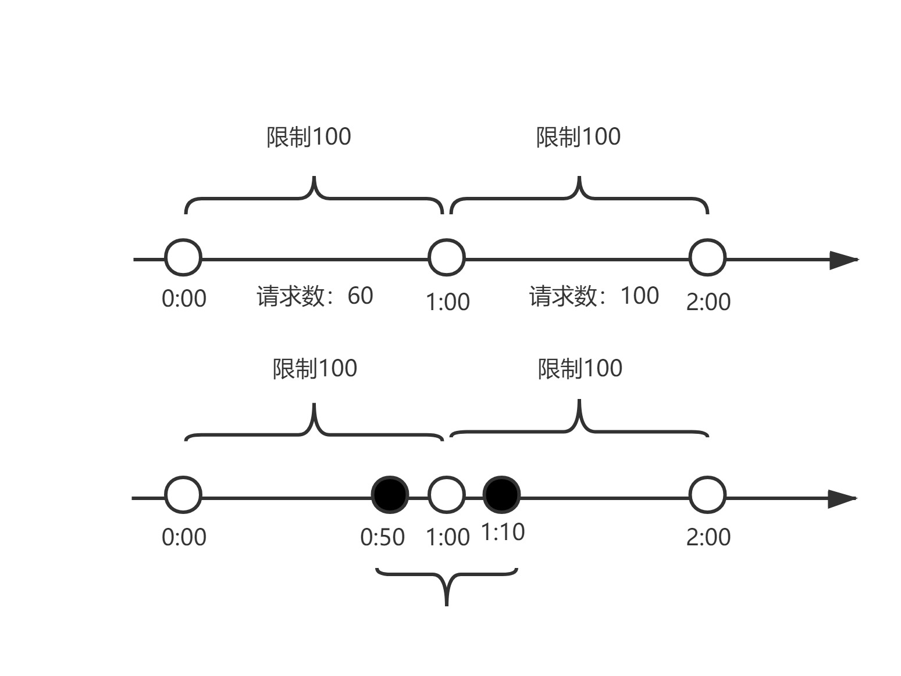
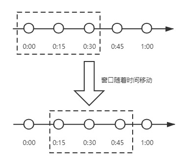
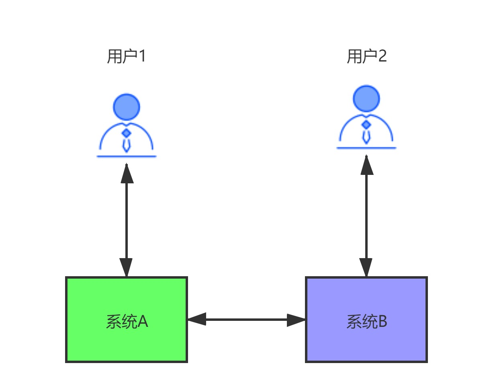
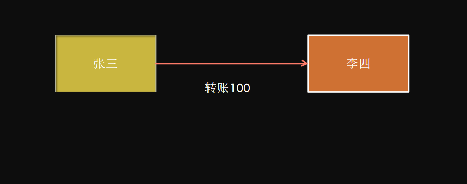
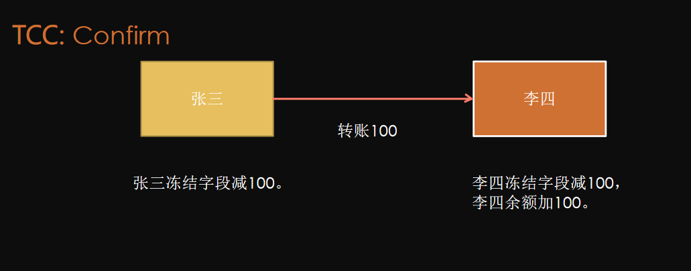
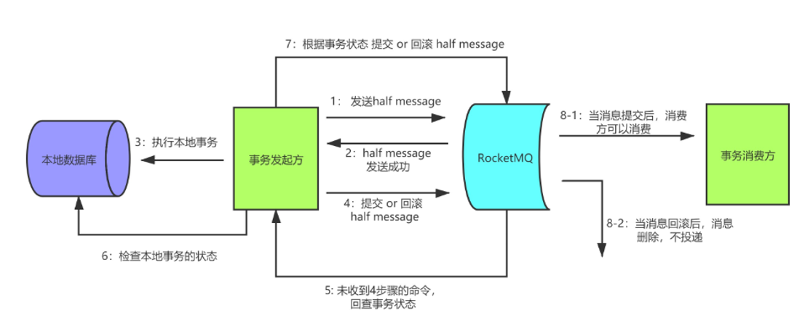
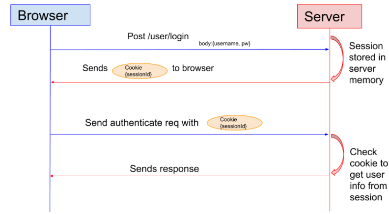
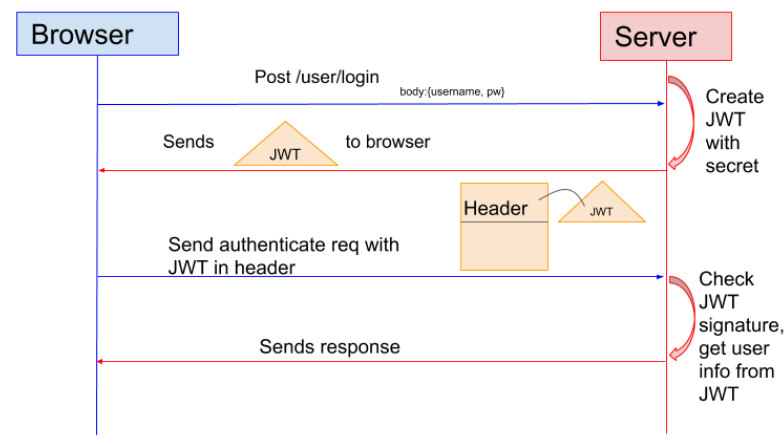

# 计数器算法是什么？

​		计数器算法，是指在指定的时间周期内累加访问次数，达到设定的阈值时，触发限流策略。下一个时间周期进行访问时，访问次数清零。此算法无论在单机还是分布式环境下实现都非常简单，使用redis的incr原子自增性，再结合key的过期时间，即可轻松实现。




​		从上图我们来看，我们设置一分钟的阈值是100，在0:00到1:00内请求数是60，当到1:00时，请求数清零，从0开始计算，这时在1:00到2:00之间我们能处理的最大的请求为100，超过100个的请求，系统都拒绝。

​		这个算法有一个临界问题，比如在上图中，在0:00到1:00内，只在0:50有60个请求，而在1:00到2:00之间，只在1:10有60个请求，虽然在两个一分钟的时间内，都没有超过100个请求，但是在0:50到1:10这20秒内，确有120个请求，虽然在每个周期内，都没超过阈值，但是在这20秒内，已经远远超过了我们原来设置的1分钟内100个请求的阈值。


# 滑动时间窗口算法是什么？

​		为了解决计数器算法的临界值的问题，发明了滑动窗口算法。在TCP网络通信协议中，就采用滑动时间窗口算法来解决网络拥堵问题。

​		滑动时间窗口是将计数器算法中的实际周期切分成多个小的时间窗口，分别在每个小的时间窗口中记录访问次数，然后根据时间将窗口往前滑动并删除过期的小时间窗口。最终只需要统计滑动窗口范围内的小时间窗口的总的请求数即可。




​		在上图中，假设我们设置一分钟的请求阈值是100，我们将一分钟拆分成4个小时间窗口，这样，每个小的时间窗口只能处理25个请求，我们用虚线方框表示滑动时间窗口，当前窗口的大小是2，也就是在窗口内最多能处理50个请求。随着时间的推移，滑动窗口也随着时间往前移动，比如上图开始时，窗口是0:00到0:30的这个范围，过了15秒后，窗口是0:15到0:45的这个范围，窗口中的请求重新清零，这样就很好的解决了计数器算法的临界值问题。

​		在滑动时间窗口算法中，我们的小窗口划分的越多，滑动窗口的滚动就越平滑，限流的统计就会越精确。


# 漏桶限流算法是什么？

​		漏桶算法的原理就像它的名字一样，我们维持一个漏斗，它有恒定的流出速度，不管水流流入的速度有多快，漏斗出水的速度始终保持不变，类似于消息中间件，不管消息的生产者请求量有多大，消息的处理能力取决于消费者。

​		漏桶的容量=漏桶的流出速度*可接受的等待时长。在这个容量范围内的请求可以排队等待系统的处理，超过这个容量的请求，才会被抛弃。

​		在漏桶限流算法中，存在下面几种情况：

1. 当请求速度大于漏桶的流出速度时，也就是请求量大于当前服务所能处理的最大极限值时，触发限流策略。

2. 请求速度小于或等于漏桶的流出速度时，也就是服务的处理能力大于或等于请求量时，正常执行。

   漏桶算法有一个缺点：当系统在短时间内有突发的大流量时，漏桶算法处理不了。


# 令牌桶限流算法是什么？

​		令牌桶算法，是增加一个大小固定的容器，也就是令牌桶，系统以恒定的速率向令牌桶中放入令牌，如果有客户端来请求，先需要从令牌桶中拿一个令牌，拿到令牌，才有资格访问系统，这时令牌桶中少一个令牌。当令牌桶满的时候，再向令牌桶生成令牌时，令牌会被抛弃。

​		在令牌桶算法中，存在以下几种情况：

1. 请求速度大于令牌的生成速度：那么令牌桶中的令牌会被取完，后续再进来的请求，由于拿不到令牌，会被限流。

2. 请求速度等于令牌的生成速度：那么此时系统处于平稳状态。

3. 请求速度小于令牌的生成速度：那么此时系统的访问量远远低于系统的并发能力，请求可以被正常处理。

   令牌桶算法，由于有一个桶的存在，可以处理短时间大流量的场景。这是令牌桶和漏桶的一个区别。

# 你设计微服务时遵循什么原则？

1. 单一职责原则：让每个服务能独立，有界限的工作，每个服务只关注自己的业务。做到高内聚。
2. 服务自治原则：每个服务要能做到独立开发、独立测试、独立构建、独立部署，独立运行。与其他服务进行解耦。
3. 轻量级通信原则：让每个服务之间的调用是轻量级，并且能够跨平台、跨语言。比如采用RESTful风格，利用消息队列进行通信等。
4. 粒度进化原则：对每个服务的粒度把控，其实没有统一的标准，这个得结合我们解决的具体业务问题。不要过度设计。服务的粒度随着业务和用户的发展而发展。

​	总结一句话，软件是为业务服务的，好的系统不是设计出来的，而是进化出来的。

# CAP定理是什么？

​		CAP定理，又叫布鲁尔定理。指的是：在一个分布式系统中，最多只能同时满足一致性（Consistency）、可用性（Availability）和分区容错性（Partition tolerance）这三项中的两项。

+ C：一致性（Consistency），数据在多个副本中保持一致，可以理解成两个用户访问两个系统A和B，当A系统数据有变化时，及时同步给B系统，让两个用户看到的数据是一致的。

+ A：可用性（Availability），系统对外提供服务必须一直处于可用状态，在任何故障下，客户端都能在合理时间内获得服务端非错误的响应。

+ P：分区容错性（Partition tolerance），在分布式系统中遇到任何网络分区故障，系统仍然能对外提供服务。网络分区，可以这样理解，在分布式系统中，不同的节点分布在不同的子网络中，有可能子网络中只有一个节点，在所有网络正常的情况下，由于某些原因导致这些子节点之间的网络出现故障，导致整个节点环境被切分成了不同的独立区域，这就是网络分区。

  ​	

  我们来详细分析一下CAP，为什么只能满足两个。看下图所示：

  

  

  ​		用户1和用户2分别访问系统A和系统B，系统A和系统B通过网络进行同步数据。理想情况是：用户1访问系统A对数据进行修改，将data1改成了data2，同时用户2访问系统B，拿到的是data2数据。

  ​		但是实际中，由于分布式系统具有八大谬论：

  + 网络相当可靠

  + 延迟为零

  + 传输带宽是无限的

  + 网络相当安全

  + 拓扑结构不会改变

  + 必须要有一名管理员

  + 传输成本为零

  + 网络同质化

  我们知道，只要有网络调用，网络总是不可靠的。我们来一一分析。

  1. 当网络发生故障时，系统A和系统B没法进行数据同步，也就是我们不满足P，同时两个系统依然可以访问，那么此时其实相当于是单机系统，就不是分布式系统了，所以既然我们是分布式系统，P必须满足。
  2. 当P满足时，如果用户1通过系统A对数据进行了修改将data1改成了data2，也要让用户2通过系统B正确的拿到data2，那么此时是满足C，就必须等待网络将系统A和系统B的数据同步好，并且在同步期间，任何人不能访问系统B（让系统不可用），否则数据就不是一致的。此时满足的是CP。
  3. 当P满足时，如果用户1通过系统A对数据进行了修改将data1改成了data2，也要让系统B能继续提供服务，那么此时，只能接受系统A没有将data2同步给系统B（牺牲了一致性）。此时满足的就是AP。

​        我们在前面学过的注册中心Eureka就是满足 的AP，它并不保证C。而Zookeeper是保证CP，它不保证A。在生产中，A和C的选择，没有正确的答案，是取决于自己的业务的。比如12306，是满足CP，因为买票必须满足数据的一致性，不然一个座位多卖了，对铁路运输都是不可以接受的。

# BASE理论是什么？

由于CAP中一致性C和可用性A无法兼得，eBay的架构师，提出了BASE理论，它是通过牺牲数据的强一致性，来获得可用性。它由于如下3种特征：

+ **B**asically **A**vailable（基本可用）：分布式系统在出现不可预知故障的时候，允许损失部分可用性，保证核心功能的可用。

+ **S**oft state（软状态）：软状态也称为弱状态，和硬状态相对，是指允许系统中的数据存在中间状态，并认为该中间状态的存在不会影响系统的整体可用性，即允许系统在不同节点的数据副本之间进行数据同步的过程存在延时。、

+ **E**ventually consistent（最终一致性）：最终一致性强调的是系统中所有的数据副本，在经过一段时间的同步后，最终能够达到一个一致的状态。因此，最终一致性的本质是需要系统保证最终数据能够达到一致，而不需要实时保证系统数据的强一致性。

​        BASE理论并没有要求数据的强一致性，而是允许数据在一定的时间段内是不一致的，但在最终某个状态会达到一致。在生产环境中，很多公司，会采用BASE理论来实现数据的一致，因为产品的可用性相比强一致性来说，更加重要。比如在电商平台中，当用户对一个订单发起支付时，往往会调用第三方支付平台，比如支付宝支付或者微信支付，调用第三方成功后，第三方并不能及时通知我方系统，在第三方没有通知我方系统的这段时间内，我们给用户的订单状态显示支付中，等到第三方回调之后，我们再将状态改成已支付。虽然订单状态在短期内存在不一致，但是用户却获得了更好的产品体验。

# 2PC提交协议是什么？

二阶段提交(Two-phaseCommit)是指，在计算机网络以及数据库领域内，为了使基于分布式系统架构下的所有节点在进行事务提交时保持一致性而设计的一种算法(Algorithm)。通常，二阶段提交也被称为是一种协议(Protocol))。在分布式系统中，每个节点虽然可以知晓自己的操作时成功或者失败，却无法知道其他节点的操作的成功或失败。当一个事务跨越多个节点时，为了保持事务的ACID特性，需要引入一个作为协调者的组件来统一掌控所有节点(称作参与者)的操作结果并最终指示这些节点是否要把操作结果进行真正的提交(比如将更新后的数据写入磁盘等等)。因此，**二阶段提交的算法思路可以概括为：参与者将操作成败通知协调者，再由协调者根据所有参与者的反馈情报决定各参与者是否要提交操作还是中止操作。**


所谓的两个阶段是指：第一阶段：**准备阶段(投票阶段)**和第二阶段：**提交阶段（执行阶段）**。

准备阶段

事务协调者(事务管理器)给每个参与者(资源管理器)发送Prepare消息，每个参与者要么直接返回失败(如权限验证失败)，要么在本地执行事务，写本地的redo和undo日志，但不提交，到达一种“万事俱备，只欠东风”的状态。

可以进一步将准备阶段分为以下三个步骤：

> 1）协调者节点向所有参与者节点询问是否可以执行提交操作(vote)，并开始等待各参与者节点的响应。
>
> 2）参与者节点执行询问发起为止的所有事务操作，并将Undo信息和Redo信息写入日志。（注意：若成功这里其实每个参与者已经执行了事务操作）
>
> 3）各参与者节点响应协调者节点发起的询问。如果参与者节点的事务操作实际执行成功，则它返回一个”同意”消息；如果参与者节点的事务操作实际执行失败，则它返回一个”中止”消息。

提交阶段

> 如果协调者收到了参与者的失败消息或者超时，直接给每个参与者发送回滚(Rollback)消息；否则，发送提交(Commit)消息；参与者根据协调者的指令执行提交或者回滚操作，释放所有事务处理过程中使用的锁资源。(注意:必须在最后阶段释放锁资源)
>
> 接下来分两种情况分别讨论提交阶段的过程。
>
> 当协调者节点从所有参与者节点获得的相应消息都为”同意”时:
>
> [](http://www.hollischuang.com/wp-content/uploads/2015/12/success.png)
>
> > 1）协调者节点向所有参与者节点发出”正式提交(commit)”的请求。
> >
> > 2）参与者节点正式完成操作，并释放在整个事务期间内占用的资源。
> >
> > 3）参与者节点向协调者节点发送”完成”消息。
> >
> > 4）协调者节点受到所有参与者节点反馈的”完成”消息后，完成事务。

如果任一参与者节点在第一阶段返回的响应消息为”中止”，或者 协调者节点在第一阶段的询问超时之前无法获取所有参与者节点的响应消息时：

[](http://www.hollischuang.com/wp-content/uploads/2015/12/fail.png)

> 1）协调者节点向所有参与者节点发出”回滚操作(rollback)”的请求。
>
> 2）参与者节点利用之前写入的Undo信息执行回滚，并释放在整个事务期间内占用的资源。
>
> 3）参与者节点向协调者节点发送”回滚完成”消息。
>
> 4）协调者节点受到所有参与者节点反馈的”回滚完成”消息后，取消事务。

　　不管最后结果如何，第二阶段都会结束当前事务。

# 2PC提交协议有什么缺点？

1. **同步阻塞问题**。执行过程中，所有参与节点都是事务阻塞型的。当参与者占有公共资源时，其他第三方节点访问公共资源不得不处于阻塞状态。

2. **单点故障**。由于协调者的重要性，一旦协调者发生故障。参与者会一直阻塞下去。尤其在第二阶段，协调者发生故障，那么所有的参与者还都处于锁定事务资源的状态中，而无法继续完成事务操作。（如果是协调者挂掉，可以重新选举一个协调者，但是无法解决因为协调者宕机导致的参与者处于阻塞状态的问题）

3. **数据不一致**。在二阶段提交的阶段二中，当协调者向参与者发送commit请求之后，发生了局部网络异常或者在发送commit请求过程中协调者发生了故障，这回导致只有一部分参与者接受到了commit请求。而在这部分参与者接到commit请求之后就会执行commit操作。但是其他部分未接到commit请求的机器则无法执行事务提交。于是整个分布式系统便出现了数据部一致性的现象。

4. 二阶段无法解决的问题：协调者再发出commit消息之后宕机，而唯一接收到这条消息的参与者同时也宕机了。那么即使协调者通过选举协议产生了新的协调者，这条事务的状态也是不确定的，没人知道事务是否被已经提交。


# 3PC提交协议是什么？

CanCommit阶段

3PC的CanCommit阶段其实和2PC的准备阶段很像。协调者向参与者发送commit请求，参与者如果可以提交就返回Yes响应，否则返回No响应。

> **1.事务询问** 协调者向参与者发送CanCommit请求。询问是否可以执行事务提交操作。然后开始等待参与者的响应。
>
> **2.响应反馈** 参与者接到CanCommit请求之后，正常情况下，如果其自身认为可以顺利执行事务，则返回Yes响应，并进入预备状态。否则反馈No

PreCommit阶段

协调者根据参与者的反应情况来决定是否可以进行事务的PreCommit操作。根据响应情况，有以下两种可能。

**假如协调者从所有的参与者获得的反馈都是Yes响应，那么就会执行事务的预执行。**

> **1.发送预提交请求** 协调者向参与者发送PreCommit请求，并进入Prepared阶段。
>
> **2.事务预提交** 参与者接收到PreCommit请求后，会执行事务操作，并将undo和redo信息记录到事务日志中。
>
> **3.响应反馈** 如果参与者成功的执行了事务操作，则返回ACK响应，同时开始等待最终指令。

**假如有任何一个参与者向协调者发送了No响应，或者等待超时之后，协调者都没有接到参与者的响应，那么就执行事务的中断。**

> **1.发送中断请求** 协调者向所有参与者发送abort请求。
>
> **2.中断事务** 参与者收到来自协调者的abort请求之后（或超时之后，仍未收到协调者的请求），执行事务的中断。


pre阶段参与者没收到请求，rollback。

doCommit阶段

该阶段进行真正的事务提交，也可以分为以下两种情况。

**执行提交**

> **1.发送提交请求** 协调接收到参与者发送的ACK响应，那么他将从预提交状态进入到提交状态。并向所有参与者发送doCommit请求。
>
> **2.事务提交** 参与者接收到doCommit请求之后，执行正式的事务提交。并在完成事务提交之后释放所有事务资源。
>
> **3.响应反馈** 事务提交完之后，向协调者发送Ack响应。
>
> **4.完成事务** 协调者接收到所有参与者的ack响应之后，完成事务。

**中断事务** 协调者没有接收到参与者发送的ACK响应（可能是接受者发送的不是ACK响应，也可能响应超时），那么就会执行中断事务。

> **1.发送中断请求** 协调者向所有参与者发送abort请求
>
> **2.事务回滚** 参与者接收到abort请求之后，利用其在阶段二记录的undo信息来执行事务的回滚操作，并在完成回滚之后释放所有的事务资源。
>
> **3.反馈结果** 参与者完成事务回滚之后，向协调者发送ACK消息
>
> **4.中断事务** 协调者接收到参与者反馈的ACK消息之后，执行事务的中断。

# 2PC和3PC的区别是什么？

1、引入超时机制。同时在协调者和参与者中都引入超时机制。

2、三阶段在2PC的第一阶段和第二阶段中插入一个准备阶段。保证了在最后提交阶段之前各参与节点的状态是一致的。


+ # TCC解决方案是什么?

  ​		TCC（Try-Confirm-Cancel）是一种常用的分布式事务解决方案，它将一个事务拆分成三个步骤：

  + T（Try）：业务检查阶段，这阶段主要进行业务校验和检查或者资源预留；也可能是直接进行业务操作。

  + C（Confirm）：业务确认阶段，这阶段对Try阶段校验过的业务或者预留的资源进行确认。

  + C（Cancel）：业务回滚阶段，这阶段和上面的C（Confirm）是互斥的，用于释放Try阶段预留的资源或者业务。

  

  

  

  

  

  

  

  

# TCC空回滚是解决什么问题的？

​        在没有调用TCC资源Try方法的情况下，调用了二阶段的Cancel方法。比如当Try请求由于网络延迟或故障等原因，没有执行，结果返回了异常，那么此时Cancel就不能正常执行，因为Try没有对数据进行修改，如果Cancel进行了对数据的修改，那就会导致数据不一致。
​		解决思路是关键就是要识别出这个空回滚。思路很简单就是需要知道Try阶段是否执行，如果执行了，那就是正常回滚；如果没执行，那就是空回滚。建议TM在发起全局事务时生成全局事务记录，全局事务ID贯穿整个分布式事务调用链条。再额外增加一张**分支事务记录表**，其中有全局事务ID和分支事务ID，第一阶段Try方法里会插入一条记录，表示Try阶段执行了。Cancel接口里读取该记录，如果该记录存在，则正常回滚；如果该记录不存在，则是空回滚。

# 如何解决TCC幂等问题？

为了保证TCC二阶段提交重试机制不会引发数据不一致，要求TCC的二阶段Confirm和Cancel接口保证幂等，这样不会重复使用或者释放资源。如果幂等控制没有做好，很有可能导致数据不一致等严重问题。
解决思路在上述 **分支事务记录**中增加执行状态，每次执行前都查询该状态。


分布式锁。

# 如何解决TCC中悬挂问题？

悬挂就是对于一个分布式事务，其二阶段Cancel接口比Try接口先执行。
		出现原因是在调用分支事务Try时，由于网络发生拥堵，造成了超时，TM就会通知RM回滚该分布式事务，可能回滚完成后，Try请求才到达参与者真正执行，而一个Try方法预留的业务资源，只有该分布式事务才能使用，该分布式事务第一阶段预留的业务资源就再也没有人能够处理了，对于这种情况，我们就称为悬挂，即业务资源预留后无法继续处理。
		解决思路是如果二阶段执行完成，那一阶段就不能再继续执行。在执行一阶段事务时判断在该全局事务下，判断**分支事务记录表**中是否已经有二阶段事务记录，如果有则不执行Try。


# 可靠消息服务方案是什么？

​		可靠消息最终一致性方案指的是：当事务的发起方（事务参与者，消息发送者）执行完本地事务后，同时发出一条消息，事务参与方（事务参与者，消息的消费者）一定能够接受消息并可以成功处理自己的事务。

​		这里面强调两点：

1. 可靠消息：发起方一定得把消息传递到消费者。
2. 最终一致性：最终发起方的业务处理和消费方的业务处理得完成，达成最终一致。




# 最大努力通知方案的关键是什么？

1.  有一定的消息重复通知机制。因为接收通知方（上图中的我方支付系统）可能没有接收到通知，此时要有一定的机制对消息重复通知。
2.  消息校对机制。如果尽最大努力也没有通知到接收方，或者接收方消费消息后要再次消费，此时可由接收方主动向通知方查询消息信息来满足需求。

# 什么是分布式系统中的幂等？

幂等（idempotent、idempotence）是一个数学与计算机学概念，常见于抽象代数中。

在编程中，一个幂等操作的特点是其任意多次执行所产生的影响均与一次执行的影响相同。幂等函数，或幂等方法，是指可以使用相同参数重复执行，并能获得相同结果的函数。这些函数不会影响系统状态，也不用担心重复执行会对系统造成改变。

例如，“getUsername()和 setTrue()”函数就是一个幂等函数. 更复杂的操作幂等保证是利用唯一交易号(流水号)实现. 我的理解：幂等就是一个操作，不论执行多少次，产生的效果和返回的结果都是一样的。


操作：查询，set固定值。逻辑删除。set 固定值。

流程：分布式系统中，网络调用，重试机制。


# 幂等有哪些技术解决方案？

1.查询操作

查询一次和查询多次，在数据不变的情况下，查询结果是一样的。select 是天然的幂等操作；

2.删除操作

删除操作也是幂等的，删除一次和多次删除都是把数据删除。(注意可能返回结果不一样，删除的数据不存在，返回 0，删除的数据多条，返回结果多个。

3.唯一索引

防止新增脏数据。比如：支付宝的资金账户，支付宝也有用户账户，每个用户只能有一个资金账户，怎么防止给用户创建多个资金账户，那么给资金账户表中的用户 ID 加唯一索引，所以一个用户新增成功一个资金账户记录。要点：唯一索引或唯一组合索引来防止新增数据存在脏数据（当表存在唯一索引，并发时新增报错时，再查询一次就可以了，数据应该已经存在了，返回结果即可。

4.token 机制

防止页面重复提交。

**业务要求：**页面的数据只能被点击提交一次；

**发生原因：**由于重复点击或者网络重发，或者 nginx 重发等情况会导致数据被重复提交；

**解决办法：**集群环境采用 token 加 redis(redis 单线程的，处理需要排队)；单 JVM 环境：采用 token 加 redis 或 token 加 jvm 锁。

**处理流程：**

1. 数据提交前要向服务的申请 token，token 放到 redis 或 jvm 内存，token 有效时间；
2. 提交后后台校验 token，同时删除 token，生成新的 token 返回。

**token 特点：**要申请，一次有效性，可以限流。

注意：redis 要用删除操作来判断 token，删除成功代表 token 校验通过。

5. traceId

   操作时唯一的。

# 对外提供的API如何保证幂等？

举例说明： 银联提供的付款接口：需要接入商户提交付款请求时附带：source 来源，seq 序列号。

source+seq 在数据库里面做唯一索引，防止多次付款(并发时，只能处理一个请求) 。重点：对外提供接口为了支持幂等调用，接口有两个字段必须传，一个是来源 source，一个是来源方序列号 seq，这个两个字段在提供方系统里面做联合唯一索引，这样当第三方调用时，先在本方系统里面查询一下，是否已经处理过，返回相应处理结果；没有处理过，进行相应处理，返回结果。

注意，为了幂等友好，一定要先查询一下，是否处理过该笔业务，不查询直接插入业务系统，会报错，但实际已经处理。


# 双写一致性问题如何解决？

先做一个说明，从理论上来说，给缓存设置过期时间，是保证最终一致性的解决方案。这种方案下，我们可以对存入缓存的数据设置过期时间，所有的写操作以数据库为准，对缓存操作只是尽最大努力更新即可。也就是说如果数据库写成功，缓存更新失败，那么只要到达过期时间，则后面的读请求自然会从数据库中读取新值然后回填缓存。因此，接下来讨论的思路不依赖于给缓存设置过期时间这个方案。
在这里，我们讨论**三种**更新策略：

1. 先更新缓存，再更新数据库。（不可取）
2. 先更新数据库，再更新缓存。（不可取）
3. 先删除缓存，再更新数据库。（不可取）
4. 先更新数据库，再删除缓存。（可取，有问题待解决）

### 大前提：

先读缓存，如果缓存没有，才从数据库读取。

### (1)先更新数据库，再更新缓存

这套方案，大家是普遍反对的。为什么呢？有如下两点原因。
**原因一（线程安全角度）**
同时有请求A和请求B进行更新操作，那么会出现
（1）线程A更新了数据库
（2）线程B更新了数据库
（3）线程B更新了缓存
（4）线程A更新了缓存
这就出现请求A更新缓存应该比请求B更新缓存早才对，但是因为网络等原因，B却比A更早更新了缓存。这就导致了脏数据，因此不考虑。
**原因二（业务场景角度）**
有如下两点：
（1）如果你是一个写数据库场景比较多，而读数据场景比较少的业务需求，采用这种方案就会导致，数据压根还没读到，缓存就被频繁的更新，浪费性能。
（2）如果你写入数据库的值，并不是直接写入缓存的，而是要经过一系列复杂的计算再写入缓存。那么，每次写入数据库后，都再次计算写入缓存的值，无疑是浪费性能的。显然，删除缓存更为适合。

接下来讨论的就是争议最大的，先删缓存，再更新数据库。还是先更新数据库，再删缓存的问题。

### (2)先删缓存，再更新数据库

该方案会导致不一致的原因是。同时有一个请求A进行更新操作，另一个请求B进行查询操作。那么会出现如下情形:
（1）请求A进行写操作，删除缓存
（2）请求B查询发现缓存不存在
（3）请求B去数据库查询得到旧值
（4）请求B将旧值写入缓存
（5）请求A将新值写入数据库
上述情况就会导致不一致的情形出现。而且，如果不采用给缓存设置过期时间策略，该数据永远都是脏数据。
那么，**如何解决呢？采用延时双删策略**

（1）先淘汰缓存
（2）再写数据库（这两步和原来一样）
（3）休眠1秒，再次淘汰缓存
这么做，可以将1秒内所造成的缓存脏数据，再次删除。
**那么，这个1秒怎么确定的，具体该休眠多久呢？**
针对上面的情形，读者应该自行评估自己的项目的读数据业务逻辑的耗时。然后写数据的休眠时间则在读数据业务逻辑的耗时基础上，加几百ms即可。这么做的目的，就是确保读请求结束，写请求可以删除读请求造成的缓存脏数据。
**如果你用了mysql的读写分离架构怎么办？**
ok，在这种情况下，造成数据不一致的原因如下，还是两个请求，一个请求A进行更新操作，另一个请求B进行查询操作。
（1）请求A进行写操作，删除缓存
（2）请求A将数据写入数据库了，
（3）请求B查询缓存发现，缓存没有值
（4）请求B去从库查询，这时，还没有完成主从同步，因此查询到的是旧值
（5）请求B将旧值写入缓存
（6）数据库完成主从同步，从库变为新值
上述情形，就是数据不一致的原因。还是使用双删延时策略。只是，睡眠时间修改为在主从同步的延时时间基础上，加几百ms。
**采用这种同步淘汰策略，吞吐量降低怎么办？**
ok，那就将第二次删除作为异步的。自己起一个线程，异步删除。这样，写的请求就不用沉睡一段时间后了，再返回。这么做，加大吞吐量。
**第二次删除,如果删除失败怎么办？**
这是个非常好的问题，因为第二次删除失败，就会出现如下情形。还是有两个请求，一个请求A进行更新操作，另一个请求B进行查询操作，为了方便，假设是单库：
（1）请求A进行写操作，删除缓存
（2）请求B查询发现缓存不存在
（3）请求B去数据库查询得到旧值
（4）请求B将旧值写入缓存
（5）请求A将新值写入数据库
（6）请求A试图去删除，请求B写入对的缓存值，结果失败了。
ok,这也就是说。如果第二次删除缓存失败，会再次出现缓存和数据库不一致的问题。
**如何解决呢？**

### (3)先更新数据库，再删缓存

首先，先说一下。老外提出了一个缓存更新套路，名为[《Cache-Aside pattern》](https://docs.microsoft.com/en-us/azure/architecture/patterns/cache-aside)。其中就指出

- **失效**：应用程序先从cache取数据，没有得到，则从数据库中取数据，成功后，放到缓存中。
- **命中**：应用程序从cache中取数据，取到后返回。
- **更新**：先把数据存到数据库中，成功后，再让缓存失效。

另外，知名社交网站facebook也在论文[《Scaling Memcache at Facebook》](https://www.usenix.org/system/files/conference/nsdi13/nsdi13-final170_update.pdf)中提出，他们用的也是先更新数据库，再删缓存的策略。
**这种情况不存在并发问题么？**
不是的。假设这会有两个请求，一个请求A做查询操作，一个请求B做更新操作，那么会有如下情形产生
（1）缓存刚好失效
（2）请求A查询数据库，得一个旧值
（3）请求B将新值写入数据库
（4）请求B删除缓存
（5）请求A将查到的旧值写入缓存
ok，如果发生上述情况，确实是会发生脏数据。
**然而，发生这种情况的概率又有多少呢？**
发生上述情况有一个先天性条件，就是步骤（3）的写数据库操作比步骤（2）的读数据库操作耗时更短，才有可能使得步骤（4）先于步骤（5）。可是，大家想想，数据库的读操作的速度远快于写操作的（不然做读写分离干嘛，做读写分离的意义就是因为读操作比较快，耗资源少），因此步骤（3）耗时比步骤（2）更短，这一情形很难出现。
假设，有人非要抬杠，有强迫症，一定要解决怎么办？
**如何解决上述并发问题？**
首先，给缓存设有效时间是一种方案。其次，采用策略（2）里给出的异步延时删除策略，保证读请求完成以后，再进行删除操作。
**还有其他造成不一致的原因么？**
有的，这也是缓存更新策略（2）和缓存更新策略（3）都存在的一个问题，如果删缓存失败了怎么办，那不是会有不一致的情况出现么。比如一个写数据请求，然后写入数据库了，删缓存失败了，这会就出现不一致的情况了。这也是缓存更新策略（2）里留下的最后一个疑问。
**如何解决？**
提供一个保障的重试机制即可，这里给出两套方案。
**方案一**：
如下图所示

流程如下所示
（1）更新数据库数据；
（2）缓存因为种种问题删除失败
（3）将需要删除的key发送至消息队列
（4）自己消费消息，获得需要删除的key
（5）继续重试删除操作，直到成功
然而，该方案有一个缺点，对业务线代码造成大量的侵入。于是有了方案二，在方案二中，启动一个订阅程序去订阅数据库的binlog，获得需要操作的数据。在应用程序中，另起一段程序，获得这个订阅程序传来的信息，进行删除缓存操作。
**方案二**：

流程如下图所示：
（1）更新数据库数据
（2）数据库会将操作信息写入binlog日志当中
（3）订阅程序提取出所需要的数据以及key
（4）另起一段非业务代码，获得该信息
（5）尝试删除缓存操作，发现删除失败
（6）将这些信息发送至消息队列
（7）重新从消息队列中获得该数据，重试操作。

**备注说明：**上述的订阅binlog程序在mysql中有现成的中间件叫canal，可以完成订阅binlog日志的功能。至于oracle中，博主目前不知道有没有现成中间件可以使用。另外，重试机制，博主是采用的是消息队列的方式。如果对一致性要求不是很高，直接在程序中另起一个线程，每隔一段时间去重试即可，这些大家可以灵活自由发挥，只是提供一个思路。


# 分布式微服务项目你是如何设计的？

我一般设计成两层：业务层和能力层（中台），业务层接受用户请求，然后通过调用能力层来完成业务逻辑。


# 认证 (Authentication) 和授权 (Authorization)的区别是什么？

Authentication（认证） 是验证您的身份的凭据（例如用户名/用户ID和密码），通过这个凭据，系统得以知道你就是你，也就是说系统存在你这个用户。所以，Authentication 被称为身份/用户验证。
Authorization（授权） 发生在 Authentication（认证） 之后。授权，它主要掌管我们访问系统的权限。比如有些特定资源只能具有特定权限的人才能访问比如admin，有些对系统资源操作比如删除、添加、更新只能特定人才具有。
这两个一般在我们的系统中被结合在一起使用，目的就是为了保护我们系统的安全性。


# Cookie 和 Session 有什么区别？如何使用Session进行身份验证？

Session 的主要作用就是通过服务端记录用户的状态。 典型的场景是购物车，当你要添加商品到购物车的时候，系统不知道是哪个用户操作的，因为 HTTP 协议是无状态的。服务端给特定的用户创建特定的 Session 之后就可以标识这个用户并且跟踪这个用户了。

Cookie 数据保存在客户端(浏览器端)，Session 数据保存在服务器端。相对来说 Session 安全性更高。如果使用 Cookie 的一些敏感信息不要写入 Cookie 中，最好能将 Cookie 信息加密然后使用到的时候再去服务器端解密。

那么，如何使用Session进行身份验证？

很多时候我们都是通过 SessionID 来实现特定的用户，SessionID 一般会选择存放在 Redis 中。举个例子：用户成功登陆系统，然后返回给客户端具有 SessionID 的 Cookie，当用户向后端发起请求的时候会把 SessionID 带上，这样后端就知道你的身份状态了。关于这种认证方式更详细的过程如下：



用户向服务器发送用户名和密码用于登陆系统。
服务器验证通过后，服务器为用户创建一个 Session，并将 Session信息存储 起来。
服务器向用户返回一个 SessionID，写入用户的 Cookie。
当用户保持登录状态时，Cookie 将与每个后续请求一起被发送出去。
服务器可以将存储在 Cookie 上的 Session ID 与存储在内存中或者数据库中的 Session 信息进行比较，以验证用户的身份，返回给用户客户端响应信息的时候会附带用户当前的状态。
使用 Session 的时候需要注意下面几个点：

依赖Session的关键业务一定要确保客户端开启了Cookie。
注意Session的过期时间


# 为什么Cookie 无法防止CSRF攻击，而token可以？

**CSRF（Cross Site Request Forgery）**一般被翻译为 跨站请求伪造 。那么什么是 跨站请求伪造 呢？说简单用你的身份去发送一些对你不友好的请求。举个简单的例子：

小壮登录了某网上银行，他来到了网上银行的帖子区，看到一个帖子下面有一个链接写着“科学理财，年盈利率过万”，小壮好奇的点开了这个链接，结果发现自己的账户少了10000元。这是这么回事呢？原来黑客在链接中藏了一个请求，这个请求直接利用小壮的身份给银行发送了一个转账请求,也就是通过你的 Cookie 向银行发出请求。

<a src=http://www.mybank.com/Transfer?bankId=11&money=10000>科学理财，年盈利率过万</>
进行Session 认证的时候，我们一般使用 Cookie 来存储 SessionId,当我们登陆后后端生成一个SessionId放在Cookie中返回给客户端，服务端通过Redis或者其他存储工具记录保存着这个Sessionid，客户端登录以后每次请求都会带上这个SessionId，服务端通过这个SessionId来标示你这个人。如果别人通过 cookie拿到了 SessionId 后就可以代替你的身份访问系统了。

Session 认证中 Cookie 中的 SessionId是由浏览器发送到服务端的，借助这个特性，攻击者就可以通过让用户误点攻击链接，达到攻击效果。

但是，我们使用 token 的话就不会存在这个问题，在我们登录成功获得 token 之后，一般会选择存放在 local storage 中。然后我们在前端通过某些方式会给每个发到后端的请求加上这个 token,这样就不会出现 CSRF 漏洞的问题。因为，即使有个你点击了非法链接发送了请求到服务端，这个非法请求是不会携带 token 的，所以这个请求将是非法的。


# 什么是 Token?什么是 JWT?如何基于Token进行身份验证？

我们知道 Session 信息需要保存一份在服务器端。这种方式会带来一些麻烦，比如需要我们保证保存 Session 信息服务器的可用性、不适合移动端（依赖Cookie）等等。

有没有一种不需要自己存放 Session 信息就能实现身份验证的方式呢？使用 Token 即可！JWT （JSON Web Token） 就是这种方式的实现，通过这种方式服务器端就不需要保存 Session 数据了，只用在客户端保存服务端返回给客户的 Token 就可以了，扩展性得到提升。

JWT 本质上就一段签名的 JSON 格式的数据。由于它是带有签名的，因此接收者便可以验证它的真实性。

下面是 RFC 7519 对 JWT 做的较为正式的定义。

JSON Web Token (JWT) is a compact, URL-safe means of representing claims to be transferred between two parties. The claims in a JWT are encoded as a JSON object that is used as the payload of a JSON Web Signature (JWS) structure or as the plaintext of a JSON Web Encryption (JWE) structure, enabling the claims to be digitally signed or integrity protected with a Message Authentication Code (MAC) and/or encrypted. ——JSON Web Token (JWT)

JWT 由 3 部分构成:

Header :描述 JWT 的元数据。定义了生成签名的算法以及 Token 的类型。
Payload（负载）:用来存放实际需要传递的数据
Signature（签名）：服务器通过Payload、Header和一个密钥(secret)使用 Header 里面指定的签名算法（默认是 HMAC SHA256）生成。
在基于 Token 进行身份验证的的应用程序中，服务器通过Payload、Header和一个密钥(secret)创建令牌（Token）并将 Token 发送给客户端，客户端将 Token 保存在 Cookie 或者 localStorage 里面，以后客户端发出的所有请求都会携带这个令牌。你可以把它放在 Cookie 里面自动发送，但是这样不能跨域，所以更好的做法是放在 HTTP Header 的 Authorization字段中：Authorization: Bearer Token。



用户向服务器发送用户名和密码用于登陆系统。
身份验证服务响应并返回了签名的 JWT，上面包含了用户是谁的内容。
用户以后每次向后端发请求都在Header中带上 JWT。
服务端检查 JWT 并从中获取用户相关信息。


# 分布式架构下，Session 共享有什么方案?

1. 不要有session：但是确实在某些场景下，是可以没有session的，其实在很多接口类系统当中，都提倡【API无状态服务】；也就是每一次的接口访问，都不依赖于session、不依赖于前一次的接口访问；
2. 存入cookie中：将session存储到cookie中，但是缺点也很明显，例如每次请求都得带着session，数据存储在客户端本地，是有风险的；
3. session同步：对个服务器之间同步session，这样可以保证每个服务器上都有全部的session信息，不过当服务器数量比较多的时候，同步是会有延迟甚至同步失败；
4. 使用Nginx（或其他复杂均衡软硬件）中的ip绑定策略，同一个ip只能在指定的同一个机器访问，但是这样做风险也比较大，而且也是去了负载均衡的意义；
5. 我们现在的系统会把session放到Redis中存储，虽然架构上变得复杂，并且需要多访问一次Redis，但是这种方案带来的好处也是很大的：实现session共享，可以水平扩展（增加Redis服务器），服务器重启session不丢失（不过也要注意session在Redis中的刷新/失效机制），不仅可以跨服务器session共享，甚至可以跨平台（例如网页端和APP端）。

# springcloud核心组件有哪些？

服务注册与发现——Netflix Eureka、Nacos、Zookeeper

客户端负载均衡——Netflix Ribbon、SpringCloud LoadBalancer

服务熔断器——Netflix Hystrix、Alibaba Sentinel、Resilience4J

服务网关——Netflix Zuul、SpringCloud Gateway

服务接口调用——Netflix Feign、 Resttemplate、Openfeign

链路追踪——Netflix Sleuth、Skywalking、Pinpoint

聚合Hystrix监控数据——Netflix Turbine

监控中心---- SpringBoot Admin

配置中心——Spring Cloud Config 、Apollo、nacos

# 微服务架构原理是什么？

主要是面向SOA理念，更细小粒度服务的拆分，将功能分解到各个服务当中，从而降低系统的耦合性，并提供更加灵活的服务支持。

# 注册中心的原理是什么？

服务启动后向Eureka注册，Eureka Server会将注册信息向其他Eureka Server进行同步，当服务消费者要调用服务提供者，则向服务注册中心获取服务提供者地址，然后会将服务提供者地址缓存在本地，下次再调用时，则直接从本地缓存中取，完成一次调用


# 配置中心的原理是什么？

在服务运行之前，将所需的配置信息从配置仓库拉取到本地服务，达到统一化配置管理的目的


# 配置中心是如何实现自动刷新的？

1. 配置中心Server端承担起配置刷新的职责

2. 提交配置触发post请求给server端的bus/refresh接口

3. server端接收到请求并发送给Spring Cloud Bus总线

4. Spring Cloud bus接到消息并通知给其它连接到总线的客户端

5. 其它客户端接收到通知，请求Server端获取最新配置

6. 全部客户端均获取到最新的配置


# 配置中心是如何保证数据安全的?

1.保证容器文件访问的安全性，即保证所有的网络资源请求都需要登录

2.将配置中心里所有配置文件中的密码进行加密，保证其密文性

3.开发环境禁止拉取生产环境的配置文件


# 用zookeeper和eureka做注册中心有什么区别?

Zookeeper保证的是CP（一致性，容错性）, 而Eureka则是AP（可用性，容错性）。

# Spring Cloud和Dubbo有哪些区别?

1. dubbo 是二进制传输，对象直接转成二进制，使用RPC通信。

SpringCloud是http 传输，同时使用http协议一般会使用JSON报文，json再转二进制，消耗会更大。

2. Dubbo只是实现了服务治理，而Spring Cloud下面有几十个子项目分别覆盖了微服务架构下的方方面面，服务治理只是其中的一个方面，一定程度来说，Dubbo只是Spring Cloud Netflix中的一个子集。

# Ribbon负载均衡原理是什么?

1. Ribbon通过ILoadBalancer接口对外提供统一的选择服务器(Server)的功能，此接口会根据不同的负载均衡策略(IRule)选择合适的Server返回给使用者。

2. IRule是负载均衡策略的抽象，ILoadBalancer通过调用IRule的choose()方法返回Server

3. IPing用来检测Server是否可用，ILoadBalancer的实现类维护一个Timer每隔10s检测一次Server的可用状态

4. IClientConfig主要定义了用于初始化各种客户端和负载均衡器的配置信息，器实现类为DefaultClientConfigImpl

# 微服务熔断降级机制是什么?

微服务框架是许多服务互相调用的，要是不做任何保护的话，某一个服务挂了，就会引起连锁反应，导致别的服务也挂。Hystrix 是隔离、熔断以及降级的一个框架。如果调用某服务报错（或者挂了），就对该服务熔断，在 5 分钟内请求此服务直接就返回一个默认值，不需要每次都卡几秒，这个过程，就是所谓的熔断。但是熔断了之后就会少调用一个服务，此时需要做下标记，标记本来需要做什么业务，但是因为服务挂了，暂时没有做，等该服务恢复了，就可以手工处理这些业务。这个过程，就是所谓的降级。

# 什么是Hystrix？实现原理是什么?

Hystrix是一个延迟和容错库，旨在隔离对远程系统、服务和第三方库的访问点，停止级联故障，并在 不可避免发生故障的复杂分布式系统中实现快速恢复。主要靠Spring的AOP实现

 实现原理

正常情况下，断路器关闭，服务消费者正常请求微服务

一段事件内，失败率达到一定阈值，断路器将断开，此时不再请求服务提供者，而是只是快速失败的方法（断路方法）

 断路器打开一段时间，自动进入“半开”状态，此时，断路器可允许一个请求方法服务提供者，如果请求调用成功，则关闭断路器，否则继续保持断路器打开状态。

 断路器hystrix是保证了局部发生的错误，不会扩展到整个系统，从而保证系统的即使出现局部问题也不会造成系统雪崩


# 注册中心挂了，或者服务挂了，应该如何处理?

注册中心挂了，可以读取本地持久化里的配置

服务挂了 应该配有服务监控中心 感知到服务下线后可以通过配置的邮件通知相关人员排查问题。

# 说说你对RPC、RMI如何理解?

RPC 远程过程调用协议，通过网络从远程计算机上请求调用某种服务。

RMI:远程方法调用 能够让在客户端Java虚拟机上的对象像调用本地对象一样调用服务端java 虚拟机中的对象上的方法。


# zk的数据模型和节点类型有哪些

## ZooKeeper数据模型

ZooKeeper的数据模型，在结构上和标准文件系统的非常相似，拥有一个层次的命名空间，都是采用树形层次结构，ZooKeeper树中的每个节点被称为—Znode。

和文件系统的目录树一样，ZooKeeper树中的每个节点可以拥有子节点。但也有不同之处：

```
	Znode兼具文件和目录两种特点。既像文件一样维护着数据、元信息、ACL、时间戳等数据结构，又像目录一样可以作为路径标识的一部分，并可以具有子Znode。用户对Znode具有增、删、改、查等操作（权限允许的情况下）
	
	Znode具有原子性操作，读操作将获取与节点相关的所有数据，写操作也将替换掉节点的所有数据。另外，每一个节点都拥有自己的ACL(访问控制列表)，这个列表规定了用户的权限，即限定了特定用户对目标节点可以执行的操作
	
	Znode存储数据大小有限制。ZooKeeper虽然可以关联一些数据，但并没有被设计为常规的数据库或者大数据存储，相反的是，它用来管理调度数据，比如分布式应用中的配置文件信息、状态信息、汇集位置等等。这些数据的共同特性就是它们都是很小的数据，通常以KB为大小单位。ZooKeeper的服务器和客户端都被设计为严格检查并限制每个Znode的数据大小至多1M，当时常规使用中应该远小于此值
	
	Znode通过路径引用，如同Unix中的文件路径。路径必须是绝对的，因此他们必须由斜杠字符来开头。除此以外，他们必须是唯一的，也就是说每一个路径只有一个表示，因此这些路径不能改变。在ZooKeeper中，路径由Unicode字符串组成，并且有一些限制。字符串"/zookeeper"用以保存管理信息，比如关键配额信息。
```

## 节点类型

Znode有两种，分别为临时节点和永久节点。
节点的类型在创建时即被确定，并且不能改变。
临时节点：该节点的生命周期依赖于创建它们的会话。一旦会话结束，临时节点将被自动删除，当然可以也可以手动删除。临时节点不允许拥有子节点。

永久节点：该节点的生命周期不依赖于会话，并且只有在客户端显示执行删除操作的时候，他们才能被删除。
　　
Znode还有一个序列化的特性，如果创建的时候指定的话，该Znode的名字后面会自动追加一个不断增加的序列号。序列号对于此节点的父节点来说是唯一的，这样便会记录每个子节点创建的先后顺序。它的格式为“%10d”(10位数字，没有数值的数位用0补充，例如“0000000001”)

在ZooKeeper中，每个数据节点都是有生命周期的，其生命周期的长短取决于数据节点的节点类型。

1、持久节点（PERSISTENT）

该数据节点别创建后，就会一直存在于ZooKeeper服务器上，直到有删除操作来主动删除该节点。

2、持久顺序节点（PERSISTENT_SEQUENTIAL）

持久顺序节点的基本特性和持久节点是一致的，额外的特性表现在顺序性上。在ZooKeeper中，每个父节点都会为它的第一级子节点维护一份顺序，用于记录每个子节点创建的先后顺序。

3、临时节点（EPHEMERAL）

临时节点的生命周期和客户端的回话绑定在一起，如果客户端会话失效，那么这个节点就会被自动地清理掉。

ZooKeeper规定了不能基于临时节点来创建子节点，即临时节点只能作为叶子节点。

4、临时顺序节点（EPHEMERAL_SEQUENTIAL）


---

# Zookeeper watch机制是什么

ZooKeeper是用来协调（同步）分布式进程的服务，提供了一个简单高性能的协调内核，用户可以在此之上构建更多复杂的分布式协调功能。

多个分布式进程通过ZooKeeper提供的API来操作共享的ZooKeeper内存数据对象ZNode来达成某种一致的行为或结果，这种模式本质上是基于状态共享的并发模型，与Java的多线程并发模型一致，他们的线程或进程都是”共享式内存通信“。

Java没有直接提供某种响应式通知接口来监控某个对象状态的变化，只能要么浪费CPU时间毫无响应式的轮询重试，或基于Java提供的某种主动通知（Notif）机制（内置队列）来响应状态变化，但这种机制是需要循环阻塞调用。

而ZooKeeper实现这些分布式进程的状态（ZNode的Data、Children）共享时，基于性能的考虑采用了类似的异步非阻塞的主动通知模式即Watch机制，使得分布式进程之间的“共享状态通信”更加实时高效，其实这也是ZooKeeper的主要任务决定的—协调。Consul虽然也实现了Watch机制，但它是阻塞的长轮询。

## ZooKeeper的Watch特性

1. Watch是一次性的，每次都需要重新注册，并且客户端在会话异常结束时不会收到任何通知，而快速重连接时仍不影响接收通知。
2. Watch的回调执行都是顺序执行的，并且客户端在没有收到关注数据的变化事件通知之前是不会看到最新的数据，另外需要注意不要在Watch回调逻辑中阻塞整个客户端的Watch回调
3. Watch是轻量级的，WatchEvent是最小的通信单元，结构上只包含通知状态、事件类型和节点路径。ZooKeeper服务端只会通知客户端发生了什么，并不会告诉具体内容。

## Zookeeper状态

Disconnected：客户端是断开连接的状态，不能连接服务集合中的任意一个
SyncConnected：客户端是连接状态，连接其中的一个服务
AuthFailed：鉴权失败
ConnectedReadOnly：客户端连接只读的服务器
SaslAuthenticated：SASL认证
Expired：服务器已经过期了该客户端的Session

## Zookeeper事件类型

None：无
NodeCreated：节点创建
NodeDeleted：节点删除
NodeDataChanged：节点数据改变
NodeChildrenChanged：子节点改变（添加/删除）

## Watcher使用的注意事项

Watcher是一次触发器，假如需要持续监听数据变更，需要在每次获取时设置Watcher
会话过期：当客户端会话过期时，该客户端注册的Watcher会失效
事件丢失：在接收通知和注册监视点之间，可能会丢失事件,但Zookeeper的状态变更和数据变化，都会记录在状态元数据信息和ZK数据节点上，所以能够获取最终一致的ZK信息状态
避免Watcher过多：服务器会对每一个注册Watcher事件的客户端发送通知，通知通过Socket连接的方式发送，当Watcher过多时，会产生一个尖峰的通知


# zk的命名服务、配置管理、集群管理分别是什么

## 分布式协调

大于等于一的情况下，才会有协调，在协调的事务进行分类得到一些名词，语义能够接受就可以

## 命名服务

通过使用有序节点的特性做到协调命名规则

通过zk的事务ID递增，做到有序行命名规则

通过使用自己点做map映射，做到1:N的命名映射，比如DNS

顺序关系、映射关系

## 配置管理

配置、元数据、状态等语义可以通过ZK的节点1MB存储，或者通过zk的节点目录结构特性存储

并且通过watch机制，满足配置变化的全局通知能力

## 集群管理

通过zk的排他性，有序性

满足分布式锁、分布式选主、队列锁

串行化回调调度

分布式调度等


