<div STYLE="page-break-after: always;">
	<br>
    <br>
    <br>
    <br>
    <br>
    <br>
    <br>
    <br>
    <br>
    <br>
	<center><h3><font size="20px">
        分布式
    </font></h3></center>
	<br>
    <br>
    <br>
    <br>
    <br>
    <br>
    <br>
    <br>
    <br>
    <br>
</div>

# 1	分布式理论基础

## 1.1	分布式简介

##### 分布式简介

分布式系统是计算机程序的集合，这些程序利用跨多个独立计算节点的计算资源来实现共同的目标。它也被称为分布式计算或分布式数据库，并依靠不同的节点通过公共网络进行通信和同步。这些节点通常代表独立的物理硬件设备，但也可代表单独的软件进程或其他递归封装的系统。分布式系统旨在消除系统的瓶颈或中心故障点。

###### 分布式计算系统的特点

1. **资源共享**：分布式系统可以共享硬件、软件或数据；
2. **并行处理**：多台机器可以同时处理同一功能；
3. **支持扩展**：当扩充到其他计算机时，计算和处理能力可以按需进行扩展；
4. **错误检测**：可以更轻松地检测故障；
5. **公开透明**：节点可以访问系统中的其他节点并与之通信

###### 优点

分布式系统通常有助于提升系统的可靠性和性能。消除中心故障点和瓶颈，从而提高可靠性。分布式系统的节点提供冗余能力，如有任何节点出现故障，其他节点会准备好接管和替换故障节点。由于节点能够轻松地进行水平和垂直扩展，因此性能可以得到提升。如果系统的负载过大，可以添加额外节点来帮助消化负载。也可以通过提高单个节点的容量来应对大量负载。

###### 缺点

但是，对这些好处做出权衡取舍可能导致“开发蔓延”，系统会变得过于复杂，维护也将更具挑战性。随着系统越来越复杂，团队可能难以有效地组织、管理和改进这些系统。

###### 分布式的具体应用场景

1. 电商
2. 金融行业
3. ...

<br>

##### 什么是 CAP 定理

1. **C——一致性（Consistency）**，数据在多个副本节点中保持一致，可以理解成两个用户访问两个系统 A 和 B，当 A 系统数据有变化时，及时同步给 B 系统，让两个用户看到的数据是一致的。
2. **A——可用性（Availability）**，系统对外提供服务必须一直处于可用状态，在任何故障下，客户端都能在合理时间内获得服务端非错误的响应。
3. **P——分区容错性（Partition tolerance）**，在分布式系统中遇到任何网络分区故障，系统仍然能对外提供服务。网络分区可以这样理解，在分布式系统中，不同的节点分布在不同的子网络中，有可能子网络中只有一个节点，在所有网络正常的情况下，由于某些原因导致这些子节点之间的网络出现故障，造成整个节点环境被切分成了不同的独立区域，这就是网络分区。

CAP 定理指的是，一个分布式系统最多只能同时满足一致性（Consistency） 、可用性（Availability） 和分区容错性(Partition tolerance）这三项中的两项。

<br>

##### 为什么分布式系统只能同时保证 CAP 中的两项？

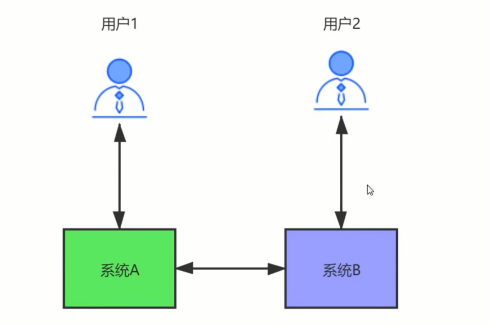

用户 1 和用户 2 分别访问系统 A 和系统 B，系统 A 和系统 B 通过网络进行同步数据。理想情况是：用户 1 访问系统A对数据进行修改，将 data1 改成了 data2，同时用户2访问系统 B，拿到的是 data2 数据。

但是实际中，网络总是不可靠的。我们来一分析：

1. 当网络发生故障时，系统 A 和系统 B 没法进行数据同步，也就是不满足 P，同时两个系统依然可以访问，那么此时其实相当于是单机系统，就不是分布式系统了，所以既然我们是分布式系统，P必须满足。
2. 当 P 满足时，如果用户 1 通过系统 A 对数据进行了修改将 data1 改成了 data2，为了让用户 2 通过系统 B 正确的拿到 data2（满足一致性），就必须等待网络将系统 A 和系统 B 的数据同步好，并且在同步期间，任何人不能访问系统B（系统不可用），否则数据就不是一致的。此时满足的是CP。
3. 当 P 满足时，如果用户 1 通过系统 A 对数据进行了修改将 data1 改成了 data2，也要让系统 B 能继续提供服务（满足可用性），那么此时，只能接受系统 A 没有将 data2 同步给系统 B（牺牲了一致性）。此时满足的就是 AP。

###### 注意

一般来说分区容错性是必须保证的，这是 **分布式系统的基础**，否则系统称不上是分布式系统。

<br>

##### BASE 理论

由于 CAP 中一致性 C 和可用性 A 无法兼得， eBay 的架构师，提出了 BASE 理论，它是通过牺牲数据的强一致性，来获得可用性。它由于如下 3 种特征：

1. **Basically Available（基本可用）**：分布式系统在出现不可预知故障的时候，允许损失部分可用性，保证核心功能的可用。
2. **Soft state（软状态）**：软状态也称为弱状态，和硬状态相对，是指允许系统中的数据存在中间状态，并认为该中间状态的存在不会影响系統的整体可用性，即允许系统在不同节点的数据副本之间进行数据同步的过程存在延时。
3. **Eventually consistent（最终一致性）**：最终一致性强调的是系统中所有的数据副本，在经过一段时间的同步后，最终能够达到一个一致的状态。因此，最终一致性的本质是需要系统保证最终数据能够达到一致，而不需要实时保证系统数据的强一致性。

BASE 理论并没有要求数据的强一致性，而是允许数据在一定的时间段内是不一致的，但在最终某个状态会达到一致。在生产环境中，很多公司，会采用 BASE 理论来实现数据的一致因为产品的可用性相比强一致性来说，更加重要。比如在电商平台中，当用户对一个订单发起支付时，往往会调用第三方支付平台，比如支付宝支付或者微信支付，调用第三方成功后，第三方并不能及时通知我方系统，在第三方没有通知我方系统的这段时间内，我们给用户的订单状态显示支付中，等到第三方回调之后，我们再将状态改成已支付。虽然订单状态在短期内存在不一致，但是用户却获得了更好的产品体验。

<br>

---

<div STYLE="page-break-after: always;"><br>
    <br>
    <br>
    <br>
    <br>
    <br>
    <br>
    <br>
    <br>
    <br></div>

## 1.2	微服务简介

##### 什么是微服务架构（❗需要简化）

微服务架构（也可简称为微服务）是一种架构模式，它提倡将单一应用程序划分成一组小的服务，服务之间互相协调、互相配合，为用户提供最终价值。每个服务运行在其独立的进程中，服务和服务间采用轻量级的通信机制互相沟通（通常是基于 HTTP 的 RESTful API）。每个服务都围绕着具体业务进行构建，并且能够被独立地部署到生产环境、类生产环境等。另外，应尽量避免统一的、集中式的服务管理机制，对具体的一个服务而言，应根据业务需求，选择合适的语言、工具对其进行构建。

微服务架构是一种依赖于一系列可独立部署服务的架构方法。这些服务有自己的业务逻辑和数据库，并负责实现特定的目标。更新、测试、部署和扩展都在每一项服务中进行。微服务可将特定于领域的主要业务问题分解为单独的独立代码库。微服务不会降低复杂性，但它们可将任务划分成彼此独立运行且对整体有益的较小流程，从而使任何复杂情况都变得一目了然且更易管理。

<br>

##### 微服务的优点

微服务架构由独立运行的单元构成，因此可在不影响其他服务的前提下开发、更新、部署和扩展各项服务。软件更新可以更为频繁，从而提升可靠性、正常运行时间和性能。

此外，更宽泛而言，微服务可让团队通过持续集成和持续交付（CI/CD）更轻松地更新代码并加快发布周期。团队可以试验代码，并在出现问题时回滚。

简而言之，微服务的优点包括：

1. **敏捷**：提倡通过小型团队进行敏捷开发，频繁地进行部署。
2. **灵活扩展**：如果某一微服务达到负载容限，可将该服务的新实例快速部署到相关集群，以帮助缓解压力。我们现在采用多租户和无状态结构，客户分散在多个实例上，而且也能支持规模大得多的实例。
3. **持续部署**：我们现在拥有频繁且更快的发布周期。原先是每周推出一次更新，现在则可做到每天大约两三次。
4. **高可维护性和可测试性**：团队可以试验新的功能，并在出现状况时回滚。这样，代码更新变得更加轻松，新功能的面市时间也得以加快。此外，还可以轻松隔离和修复各项服务中的错误和漏洞。
5. **独立部署**：由于微服务是单独的单元，因此能够快速、轻松地独立部署各个功能。
6. **技术灵活**：微服务架构允许团队自由选择所需的工具。
7. **高度可靠**：您可以为特定服务部署更改，而不必担心要关闭整个应用。
8. **团队情绪更高涨**：使用微服务的 Atlassian 团队更加愉悦，因为他们更具自主性，可以自行构建和部署，而不必花费数周来等待拉取请求获得批准。

<br>

##### 微服务的缺点

微服务会使系统复杂性上升，从而导致开发蔓延或增长加快且无法管理。确定不同组件之间的关系、特定软件组件的负责人，或者如何避免干扰依赖组件，这些都可能非常棘手。

微服务的缺点可能包括：

1. **开发蔓延**：与单体式架构相比，微服务会导致复杂性上升，因为多个团队会在更多地方创建更多服务。开发蔓延若管理不当，则会导致开发速度减慢和运营绩效降低。
2. **基础架构成本呈指数级增长**：每项新的微服务都有自己的成本，例如在测试套件、部署手册、托管基础架构和监控工具等方面。
3. **组织开销增多**：团队需要额外的通信和协作来协调更新和交互。
4. **调试挑战**：每个微服务都有自己的一组日志，从而使调试变得更加复杂。此外，单个业务流程可能会在多个计算机上运行，从而进一步加大调试复杂度。
5. **欠缺标准化**：若无一个通用平台，语言、日志记录标准和监控手段便可能会激增。
6. **缺少明确责任**：当推出的服务增多后，运行这些服务的团队数量也会增加。随着时间推移，便难以清晰掌握团队有哪些服务可供使用，以及与谁联系来获得支持。

<br>

##### 微服务和分布式的区别

分布式只是一种手段，把不同的机器分散在不同的地方，然后这些机器间相互协助完成业务。而 **微服务架构是分布式服务架构的子集**。微服务架构通过更细粒度的服务切分，使得整个系统的迭代速度并行程度更高，但是运维的复杂度和性能会随着服务的粒度更细而增加。微服务重在解耦合，使每个模块都独立。分布式重在资源共享与加快计算机计算速度。

主要区别：

1. **架构不同**：微服务的设计是为了不因为某个模块的升级和 BUG 影响现有的系统业务。微服务与分布式的细微差别是，微服务的应用不一定是分散在多个服务器上，也可以是同一个服务器。
2. **作用不同**：分布式的不同模块部署在不同服务器上，分布式主要解决的是网站高并发带来问题。微服务的各服务可独立应用，组合服务也可系统应用。
3. **粒度不同**：微服务相比分布式服务来说，它的粒度更小，服务之间耦合度更低，由于每个微服务都由独立的小团队负责，因此它敏捷性更高。分布式服务最后都会向微服务架构演化，这是一种趋势， 不过服务微服务化后带来的挑战也是显而易见的，例如服务粒度小，数量大，后期运维将会很难。

<br>

---

<div STYLE="page-break-after: always;"><br>
    <br>
    <br>
    <br>
    <br>
    <br>
    <br>
    <br>
    <br>
    <br></div>

## 1.3	微服务架构总体设计和基础组件

##### 一次正常的服务调用的完整流程

1. 首先服务提供者（用户、商品等微服务子模块）按照指定格式的服务接口描述，向注册中心注册服务，声明自己能够提供哪些服务以及服务地址，完成服务发布。
2. 接下来服务消费者（API 网关层或者相邻的其它微服务模块）请求注册中心，查询所需要调用服务的地址，然后以约定的通信协议向服务提供者发起请求，得到请求结果后再按照约定的协议解析结果。
3. 在服务调用过程中，服务的请求耗时、调用量以及成功率等指标都会被记录下来用作监控，调用经过的链路信息会被记录下来，用于故障定位和问题追踪。在这期间，如果调用失败，可以通过重试等服务治理手段来保证成功率。

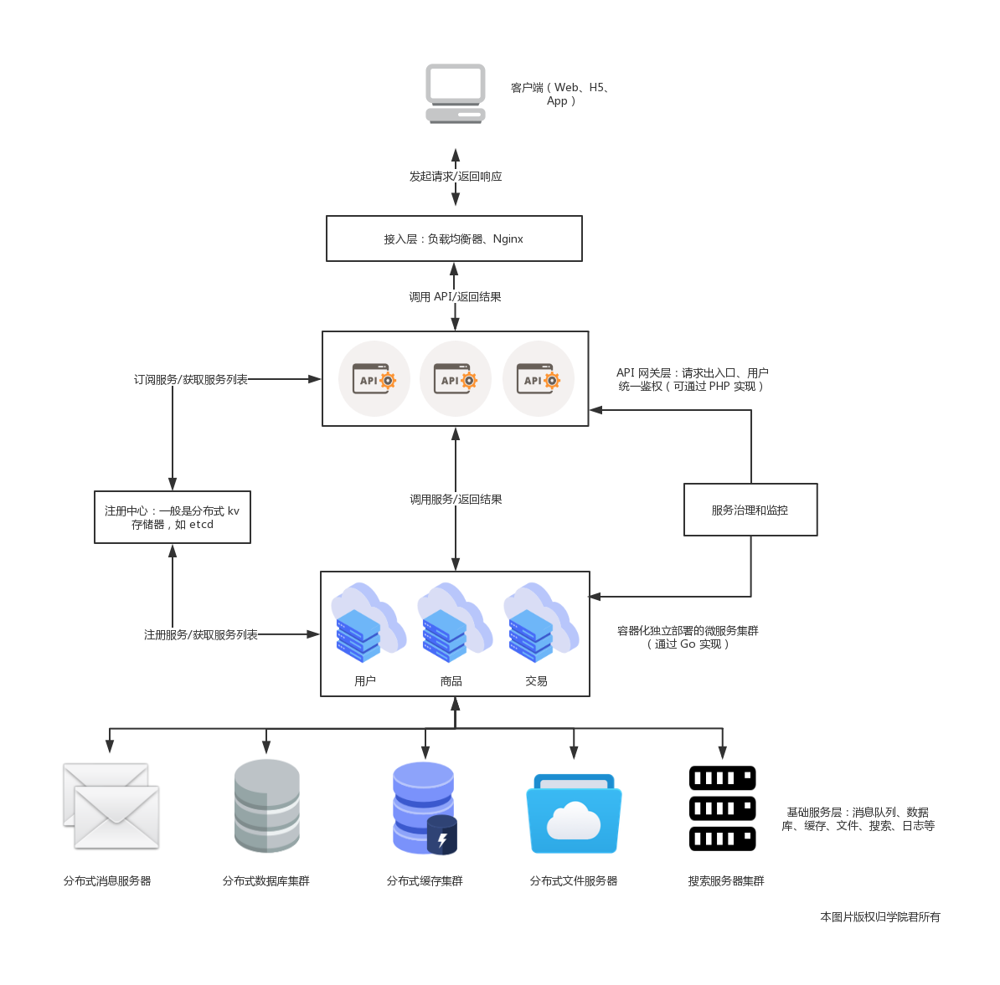

<br>

##### 微服务架构服务调用相关的基本组件

根据上一段可知，在微服务架构下，服务调用主要依赖下面几个基本组件：

- **注册中心**：注册并维护远程服务及服务提供者的地址，供服务消费者发现和调用，为保证可用性，通常基于分布式 key-value 存储器来实现，比如 zookeeper、etcd 等；
- **服务框架**：用于实现微服务的 RPC 框架，包含服务接口描述及实现方案、向注册中心发布服务等功能，常见的 RPC 框架包括 Spring Cloud、Dubbo、gRPC、 Thrift、go-micro 等；
- **服务网关**：介于客户端与微服务之间的网关层，可以理解为「门卫」的角色，以确保服务提供者对客户端的透明，这一层可以进行反向路由、安全认证、灰度发布、日志监控等前置动作；
- **服务监控**：对服务消费者与提供者之间的调用情况进行监控和数据展示；
- **服务追踪**：记录对每个请求的微服务调用完整链路，以便进行问题定位和故障分析；
- **服务治理**：服务治理就是通过一系列的手段来保证在各种意外情况下，服务调用仍然能够正常进行，这些手段包括熔断、隔离、限流、降级、负载均衡等。
- **基础设施**：分布式消息队列、日志存储、数据库、缓存、文件服务器、搜索集群等，用以提供服务底层的基础数据服务，可以自建，也可以使用阿里云等公有云提供的服务。

此外，从微服务部署角度来说，我们通常会基于容器编排技术实现微服务的运维。

<br>

##### 服务描述组件

服务调用首先要解决的问题就是如何对外描述服务。比如服务的名称、请求参数和返回信息，以及服务返回信息如何解析，在本地方法调用中这根本不是什么问题，但是在微服务中，服务提供者与消费者之间可能是通过不同语言开发的，而且是通过远程网络请求来调用服务，所以这些东西必须要事先约定好。

###### 常用的服务描述方式

主要包括 RESTful API、XML 配置以及 IDL 文件三种。

其中，RESTful API 方式通常用于 **HTTP 协议** 的服务描述，接口文档可以通过 Swagger 进行管理和维护，Spring Cloud 框架默认就是通过 REST API 提供服务。

基于 HTTP 协议的 REST 服务接口虽然简单，但是性能不如基于 TCP 的 RPC 协议，RPC 协议的服务描述通常通过 XML 配置文件来定义接口名、参数以及返回值类型等，比如 Dubbo 框架默认就是以私有化的 RPC 协议（`dubbo`）来提供服务接口描述。

<br>

##### 注册中心组件

你通过服务提供者提供了一个新的服务，如何让服务消费者感知呢？这个时候就需要一个 “中介”，也就是注册中心，服务提供者将自己提供的服务以及 IP 地址登记到注册中心，服务消费者则从注册中心查询所需要调用服务的地址信息，然后发起网络请求。

###### 注册中心的工作流程

1. 服务提供者在启动时，根据服务发布文件中配置的发布信息向注册中心注册自己的服务。
2. 服务消费者在启动时，根据消费者配置文件中配置的服务信息向注册中心订阅自己所需要的服务。
3. 注册中心返回服务提供者地址列表给服务消费者。
4. 当服务提供者发生变化，比如有节点新增或者销毁，注册中心将变更通知给服务消费者。

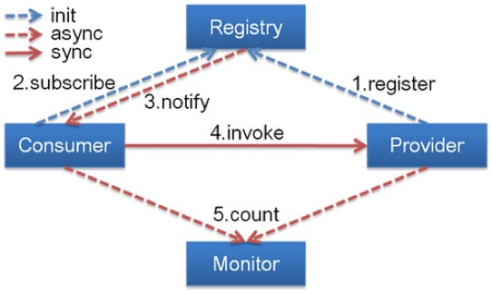

<br>

##### 服务框架

通过注册中心，服务消费者就可以获取到服务提供者的地址，有了地址后就可以发起调用。但在发起调用之前你还需要解决以下几个问题：

- 服务通信采用什么协议？就是说服务提供者和服务消费者之间以什么样的协议进行网络通信，是采用四层 TCP、UDP 协议，还是采用七层 HTTP 协议，还是采用其他协议？
- 数据传输采用什么方式？就是说服务提供者和服务消费者之间的数据传输采用哪种方式，是同步还是异步，是在单连接上传输，还是多路复用。
- 数据压缩采用什么格式？通常数据传输都会对数据进行压缩，来减少网络传输的数据量，从而减少带宽消耗和网络传输时间，比如常见的 JSON 序列化、Java 对象序列化以及 Protobuf 序列化等。

<br>

##### 服务监控

一旦服务消费者与服务提供者之间能够正常发起服务调用，你就需要对调用情况进行监控，以了解服务是否正常。通常来讲，服务监控主要包括三个流程。

- 指标收集。就是要把每一次服务调用的请求耗时以及成功与否收集起来，并上传到集中的数据处理中心。
- 数据处理。有了每次调用的请求耗时以及成功与否等信息，就可以计算每秒服务请求量、平均耗时以及成功率等指标。
- 数据展示。数据收集起来，经过处理之后，还需要以友好的方式对外展示，才能发挥价值。通常都是将数据展示在 Dashboard 面板上，并且每隔 10s 等间隔自动刷新，用作业务监控和报警等。

<br>

##### 服务追踪

除了需要对服务调用情况进行监控之外，你还需要记录服务调用经过的每一层链路，以便进行问题追踪和故障定位。

服务追踪的工作原理大致如下：

1. 服务消费者发起调用前，会在本地按照一定的规则生成一个 requestid，发起调用时，将 requestid 当作请求参数的一部分，传递给服务提供者。
2. 服务提供者接收到请求后，记录下这次请求的 requestid，然后处理请求。如果服务提供者继续请求其他服务，会在本地再生成一个自己的 requestid，然后把这两个 requestid 都当作请求参数继续往下传递。
3. 以此类推，通过这种层层往下传递的方式，一次请求，无论最后依赖多少次服务调用、经过多少服务节点，都可以通过最开始生成的 requestid 串联所有节点，从而达到服务追踪的目的。

<br>

##### 服务治理

服务监控能够发现问题，服务追踪能够定位问题所在，而解决问题就得靠服务治理了。服务治理就是通过一系列的手段来保证在各种意外情况下，服务调用仍然能够正常进行。

在生产环境中，你应该经常会遇到下面几种状况。

1. **单机故障**：通常遇到单机故障，都是靠运维发现并重启服务或者从线上摘除故障节点。然而集群的规模越大，越是容易遇到单机故障，在机器规模超过一百台以上时，靠传统的人肉运维显然难以应对。而服务治理可以通过一定的策略，自动摘除故障节点，不需要人为干预，就能保证单机故障不会影响业务。
2. **单 IDC 故障**：你应该经常听说某某 App，因为施工挖断光缆导致大批量用户无法使用的严重故障。而服务治理可以通过自动切换故障 IDC 的流量到其他正常 IDC，可以避免因为单 IDC 故障引起的大批量业务受影响。
3. **依赖服务不可用**：比如你的服务依赖依赖了另一个服务，当另一个服务出现问题时，会拖慢甚至拖垮你的服务。而服务治理可以通过熔断，在依赖服务异常的情况下，一段时期内停止发起调用而直接返回。这样一方面保证了服务消费者能够不被拖垮，另一方面也给服务提供者减少压力，使其能够尽快恢复。

上面是三种最常见的需要引入服务治理的场景，当然还有一些其他服务治理的手段比如自动扩缩容，可以用来解决服务的容量问题。

<br>

---

<div STYLE="page-break-after: always;"><br>
    <br>
    <br>
    <br>
    <br>
    <br>
    <br>
    <br>
    <br>
    <br></div>
## 1.4	设计微服务时遵循的原则

##### 微服务设计的四大原则

1. **单一职责原则**：每个服务应只担负一个职责，只关注自己的业务，做有界限的工作。做到高内聚。
2. **服务自治原则**：每个服务要能做到独立开发、独立测试、独立构建、独立部署，独立运行。与其他服务进行解耦。
3. **轻量级通信原则**：每个服务之间的调用是轻量级、跨平台、跨语言的。比如采用 RESTful 风格，或利用消息队列进行通信等。
4. **粒度进化原则**：对每个服务的粒度把控，其实没有统一的标准， 这个得结合我们解决的具体业务问题。不要过度设计。服务的粒度随着业务和用户的发展而发展。

总之，软件是为业务服务的，好的系统不是设计出来的，而是进化出来的。

<br>

---

<div STYLE="page-break-after: always;"><br>
    <br>
    <br>
    <br>
    <br>
    <br>
    <br>
    <br>
    <br>
    <br></div>

## 1.5	分布式微服务项目的设计方案

##### 微服务项目的一般结构

一般设计成两层：业务层和能力层（中台），业务层接受用户请求，然后通过调用能力层来完成业务逻辑。

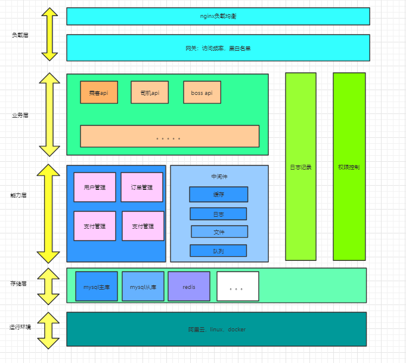

<br>

---

<div STYLE="page-break-after: always;"><br>
    <br>
    <br>
    <br>
    <br>
    <br>
    <br>
    <br>
    <br>
    <br></div>

# 2	分布式 ID

## 2.1	分布式 id 生成方案

##### 四种主流分布式 id 生成方案

|                       | 描述                                                         | 优点                                                         | 缺点                                                         |
| --------------------- | ------------------------------------------------------------ | ------------------------------------------------------------ | ------------------------------------------------------------ |
| UUID                  | UUID是通用唯一标识码的缩写，其目的是让分布式系统中的所有元素都有唯一的辨识信息，而不需要通过中央控制器来指定唯一标识。 | 1. 降低全局节点的压力，使得主键生成速度更快；<br/>2. 生成的主键全局唯一；<br/>3. 跨服务器合并数据方便。 | 1. UUID占用16个字符，空间占用较多；<br/>2. 不是递增有序的数字，数据写入IO随机性很大，且索引效率下降 |
| 数据库主键自增        | MySQL数据库设置主键且主键自动增长                            | 1. INT和BIGINT类型占用空间较小；<br/>2. 主键自动增长，IO写入连续性好；<br/>3. 数字类型查询速度优于字符串 | 1. 并发性能不高，受限于数据库性能；<br/>2. 分库分表，需要改造，复杂；<br/>3. 自增：数据和数据量泄露 |
| Redis自增             | Redis计数器，原子性自增                                      | 使用内存，并发性能好                                         | 1. 数据丢失；<br/>2. 自增：数据量泄露                        |
| 雪花算法（snowflake） | 大名鼎鼎的雪花算法，分布式ID的经典解决方案                   | 1. 不依赖外部组件；<br/>2. 性能好                            | 时钟回拨                                                     |

<br>

----

<div STYLE="page-break-after: always;"><br>
    <br>
    <br>
    <br>
    <br>
    <br>
    <br>
    <br>
    <br>
    <br></div>

## 2.2	雪花算法生成的 ID 由哪些部分组成?

##### 雪花算法生成的 ID 组成

1. 符号位，占用 1 位。
2. 时间戳，占用 41 位，可以支持 69 年的时间跨度。
3. 机器 ID，占用 10 位。
4. 序列号，占用 12 位。一毫秒可以生成 4095 个 ID。

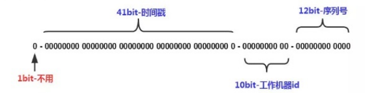

<br>

---

<div STYLE="page-break-after: always;"><br>
    <br>
    <br>
    <br>
    <br>
    <br>
    <br>
    <br>
    <br>
    <br></div>

# 3	分布式锁

## 3.1	分布式锁简介

##### 为什么需要分布式锁

为了保证一个资源（可能是缓存或数据库）在高并发情况下的同一时间只能被同一个线程执行。

在传统单体应用单机部署的情况下，可以使用 Java 并发处理相关的 API（如 ReentrantLcok 或 synchronized）进行互斥控制。但是，随着业务发展的需要，原单体单机部署的系统被演化成分布式系统后，由于分布式系统多线程、多进程并且分布在不同机器上，这将使原单机部署情况下的并发控制锁策略失效，为了解决这个问题就需要一种跨 JVM 的互斥机制来控制共享资源的访问，这就是分布式锁要解决的问题。

<br>

##### 使用分布式锁的场景一般需要满足以下条件

1. 系统是一个分布式系统，微服务集群；
2. 存在共享资源，比如用户数据。
3. 同步访问，即多个进程同时操作共享资源。

<br>

##### 具体应用场景

1. 访问量激增，比如秒杀与抢购

<br>

##### 分布式锁的常见解决方案

1. Reids 分布式锁。
2. 基于 Zookeeper。顺序临时节点。
3. 基于数据库，比如 Mysql。主键或唯一索引的唯一性。

<br>

---

<div STYLE="page-break-after: always;"><br>
    <br>
    <br>
    <br>
    <br>
    <br>
    <br>
    <br>
    <br>
    <br></div>

## 3.2	分布式锁实现方式——Redis

##### Redis 的 SETNX 命令

Redis 的 Setnx（SET if Not Exists） 命令可以在指定的 key 不存在时，为 key 设置指定的值。

###### 	语法

在指定 key 不存在时，为 key 设置指定的值，并在设置时间内过期：

```
setnx 【key】 【value】 ex 【time】
```

其他写法：

```
SET 【key】 【value】 NX EX 【time】
```

###### 为什么要设置过期时间

防止死锁。

<br>

##### Redis 实现分布式锁逻辑

首先假设有两个服务 A、B 都希望获得锁。

###### 第一步

服务 A 为了获得锁，向 Redis 发起如下命令：

```
SET productld:lock 0xx9p03001 NX EX 30000
```

- productld：由自己定义，可以是与本次业务有关的 id
- "0xx9p03001"：一串随机值, 必须保证全局唯一
- "NX"：指的是当且仅当 key （也就是案例中的"productld:lock"）在 Redis 中不存在时，返回执行成功，否则执行失败。
- "EX 30000"：指的是在 30 秒后，key 将被自动删除。执行命令后返回成功，表明服务成功的获得了锁。

###### 第二步

由于 Redis 内已经存在同名 key，且并末过期，因此命令执行失败，服务 B 未能获得锁。服务 B 进入循环请求状态，比如每隔 1 秒钟（根据实际需求设置）向 Redis 发送请求，直到执行成功并获得锁。

###### 第三步

服务 A 的业务代码执行时长超过了 30秒，导致 key 超时，因此 Redis 自动删除了 key。此时服务 B 再次发送命令执行成功，假设本次请求中设置的 value 值为 0000222。

###### 第四步

服务 A 执行完毕，为了释放锁，服务 A 会主动向 Redis 发起删除 key 的请求。

注意，在删除 key 之前，一定要判断服务 A 持有的 value 与 Redis 内存储的 value 是否一致。比如当前场景下，Redis 中的锁早就不是服务 A 持有的那一把了，而是由服务 B 创建的，如果贸然使用服务 A 持有的 key 来删除锁，则会误将服务 B 的锁释放掉。

​	此外，由于删除锁时涉及到一系列判断逻辑，因此一般使用 lua 脚本, 具体如下:

```
if redis.call("get"， KEYS[1])==ARGV[1] then
	return redis.call("de1"， KEYS[1])
else
	return 0 
end
```

###### ❗疑问——服务 A 已经超时，但是业务还在正常进行，此时服务 B 获取了资源，这难道不会导致问题？

<br>

##### Redis 做分布式锁死锁有哪些情况，如何解决?

1. 情况一：加锁，没有释放锁。所以在使用数据完毕后，需要进行释放锁的操作。比如 delete key。
2. 情况二：加锁后，程序还没有执行释放锁，程序挂了。所以需要用的 key 的过期机制。

<br>

---

<div STYLE="page-break-after: always;"><br>
    <br>
    <br>
    <br>
    <br>
    <br>
    <br>
    <br>
    <br>
    <br></div>

## 3.3	分布式锁实现方式——Zookeeper 

##### 基于 Zookeeper 的分布式锁的实现原理

###### Zookeeper 的顺序节点特性

假如我们在 /lock/ 目录下创建 3 个节点，ZK 集群会按照发起创建的顺序来创建节点，节点分别为 /lock000000001、/lock0000000002、 /oc0000000003， 节点名由 Zookeeper 来完成，最后一位数是依次递增的。

###### Zookeeper 临时节点特性

临时节点由某个客户端创建，当客户端与 Zookeeper 集群断开连接，则该节点自动被删除。EPHEMERAL_ SEQUENTIAL 为临时顺序节点。

###### 使用顺序节点和临时节点实现分布式锁

根据 ZK 中节点是否存在，可以作为分布式锁的锁状态，以此来实现一个分布式锁。

<br>

##### Zookeeper 实现分布式锁的基本逻辑

1. 客户端1 调用 create() 方法创建名为“/业务ID/lock "”的临时顺序节点。
2. 客户端1 调用 getChildren("业务ID") 方法来获取所有已经创建的子节点。 
3. 客户端获取到所有子节点 path 之后，如果发现自己在步骤1 中创建的节点是所有节点中序号最小的，也就是自己创建的序列号是否排第一。
   - 如果是第一，那么就认为这个客户端获得了锁，在它前面没有别的客户端拿到锁。
   - 如果不是第一，那么则监视比自己创建节点的序列号小的最大的节点，进入等待。
4. 直到下次监视的子节点变更的时候，再进行子节点的获取，判断是否获取锁。

<br>

----

<div STYLE="page-break-after: always;"><br>
    <br>
    <br>
    <br>
    <br>
    <br>
    <br>
    <br>
    <br>
    <br></div>

## 3.4	分布式锁实现方式——MySQL

##### 实现原理

​	在 Mysql 中创建一张表， 设置一个主键或者 UNIQUE KEY。这个 KEY 就是分布式锁的 KEY，所以同一个 KEY 在 mysql 表里只能插入一次了，这样对锁的竞争就交给了数据库，处理同一个 KEY 数据库保证了只有一个节点能插入成功，其他节点都会插入失败。

<br>

##### DB 分布式锁的实现逻辑

1. 通过主键 id 或者唯一索引的唯一性进行加锁， 即加锁的形式是向一张表中插入一条数据，这条数据的 id 就是一把分布式锁。
2. 当一次请求插入了一条 id 为1的数据，其他想要进行插入数据的并发请求必须等第一次请求执行完成后，删除这条 id 为 1 的数据才能继续插入。

###### 伪代码

```
def lock :
	exec sq1:insert into locked-tab1e (xxx) values (xxx)
	if result == true :
		return true
	else:
		return false 
		
def un1ock :
	exec sq1: delete from 1 ockedorder where order_ id= ' order_id '
```

<br>

---

<div STYLE="page-break-after: always;"><br>
    <br>
    <br>
    <br>
    <br>
    <br>
    <br>
    <br>
    <br>
    <br></div>

## 3.5	不同方式实现分布式锁的区别与各自的适用场景（❗需要补充）

##### ZooKeeper 和 Redis 实现分布式锁的区别

###### Reids

1. Redis 只保证最终一致性， 副本间的数据复制是异步进行（Set 是写，Get 是读，Reids 集群一般是读写分离架构，存在主从同步延迟情况），主从切换之后可能有部分数据没有复制过去可能会**丢失锁**，故强一致性要求的业务不推荐使用 Reids，推荐使用 zk。
2. Redis集群各方法的响应时间均为最低。随着并发量和业务数量的提升其响应时间会有明显上升（公网集群影响因素偏大），但是极限 qps 可以达到最大且基本无异常

###### ZooKeeper

1. 使用 ZooKeeper 集群，锁原理是使用 ZooKeeper 的临时顺序节点，临时顺序节点的生命周期在 Client 与集群的 Session 结束时结束。因此如果某个 Client 节点存在网络问题，与 ZooKeeper 集群断开连接 ，Session 超时同样会导致锁被错误的释放（导致被其他线程错误地持有），因此 ZooKeeper 也无法保证完全一致。
2. ZK 具有较好的稳定性，响应时间抖动很小，没有出现异常。但是随着并发量和业务数量的提升其响应时间和 qps 会明显下降。

###### 总结

1. Zookeeper 每次进行锁操作前都要创建若干节点，完成后要释放节点，会浪费很多时间；
2. 而 Redis 只是简单的数据操作，没有这个问题。

<br>

---

<div STYLE="page-break-after: always;"><br>
    <br>
    <br>
    <br>
    <br>
    <br>
    <br>
    <br>
    <br>
    <br></div>

# 4	分布式限流算法

## 4.1	计数器算法

##### 什么是计数器算法

计数器算法，是指 **在指定的时间周期内** 累加访问次数，达到设定的阈值时，触发限流策略。下一个时间周期进行访问时，访问次数清零。

<br>

##### 实现思路

此算法无论在单机还是分布式环境下实现都非常简单，使用 redis 的 incr 原子自增性，再结合 key 的过期时间，即可轻松实现。

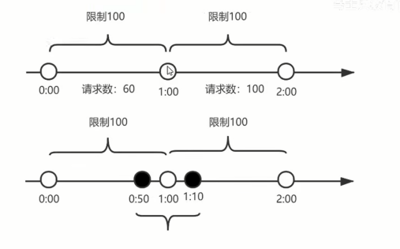

​	如上图，我们设置一分钟的阈值是100，在0:00到1:00内请求数是60，当到1:00时，请求数清零，从0开始计算，这时在1:00到2:00之间我们能处理的最大的请求为100，超过100个的请求，系统都拒绝。

<br>

##### 计数器算法的临界问题

如果在 0:00 到 1:00 内， 只在 0:50 有 60 个请求,而在 1:00 到 2:00 之间，只在 1:10 有 60 个请求，虽然在两个一分钟的时间内，都没有超过 100 个请求，但是在 0:50 到 1:10 这 20 秒内，确有 120 个请求，虽然在每个周期内，都没超过阈值，但是在这 20 秒内，已经远远超过了我们原来设置的 1 分钟内 100 个请求的阈值。

<br>

---

<div STYLE="page-break-after: always;"><br>
    <br>
    <br>
    <br>
    <br>
    <br>
    <br>
    <br>
    <br>
    <br></div>

## 4.2	滑动时间窗口算法

##### 滑动时间窗口算法出现的目的

为了解决计数器算法的临界值问题，发明了滑动窗口算法。在 TCP 网络通信协议中，就采用滑动时间窗口算法来解决网络拥堵问题。

<br>

##### 什么是滑动时间窗口算法

滑动时间窗口是将计数器算法中的实际周期切分成多个小的时间窗口，分别在每个小的时间窗口中记录访问次数，然后根据时间将窗口往前滑动并删除过期的小时间窗口。最终只需要统计滑动窗口范围内的小时间窗口的总的请求数即可。


在上图中，假设我们设置一分钟的请求阈值是 100，我们将一分钟拆分成4个小型时间窗口， 这样，每个小型时间窗口只能处理 25 个请求，我们用虚线方框表示滑动时间窗口，当前窗口的大小是 2，也就是在窗口内最多能处理 50 个请求。

随着时间的推移，滑动窗口也随着时间往前移动，比如上图开始时，窗口是0:00到0:30的这个范围，过了15秒后，窗口是 0:15 到 0:45 的这个范围，窗口中的请求重新清零，这样就很好的解决了计数器算法的临界值问题。

在滑动时间窗口算法中，我们的小窗口划分的越多，滑动窗门的滚动就越平滑，限流的统计就会越精确。

<br>

---

<div STYLE="page-break-after: always;"><br>
    <br>
    <br>
    <br>
    <br>
    <br>
    <br>
    <br>
    <br>
    <br></div>

## 4.3	漏桶限流算法

##### 什么是漏桶限流算法

漏桶算法的原理就像它的名字一样， 我们维持一个漏斗， 它有 **恒定的** 流出速度，不管水流流入的速度有多快，漏斗出水的速度始终保持不变，类似于消息中间件，不管消息的生产者请求量有多大，消息的处理能力取决于消费者。

<br>

##### 漏桶容量

漏桶的容量 = 漏桶的流出速度 * 可接受的等待时长。在这个容量范围内的请求可以排队等待系统的处理，超过这个容量的请求，才会被抛弃。

在漏桶限流算法中，存在下面几种情况：

1. 当请求速度大于漏桶的流出速度时，也就是请求量大于当前服务所能处理的最大极限值时，触发限流策略。
2. 请求速度小于或等于漏桶的流出速度时，也就是服务的处理能力大于或等于请求量时，正常执行。

<br>

##### 漏桶算法的缺点

漏桶算法的流出速度是恒定的，需要开发人员根据经验进行设置，如果过小会导致服务器性能不能充分发挥，过多会导致服务器始终处于超负荷状态。

<br>

---

<div STYLE="page-break-after: always;"><br>
    <br>
    <br>
    <br>
    <br>
    <br>
    <br>
    <br>
    <br>
    <br></div>

## 4.4	令牌桶限流算法

##### 什么是令牌桶限流算法

创建一个大小固定的容器，也就是令牌桶，系统以恒定的速率向令牌桶中放入令牌，如果有客户端来请求，先需要从令牌桶中拿一个令牌， 拿到令牌，才有资格访问系统，这时令牌桶中少一个令牌。当令牌桶满的时候，再向令牌桶生成令牌时，令牌会被抛弃。

在令牌桶算法中，存在以下三种情况

1. 请求速度大于令牌的生成速度：那么令牌桶中的令牌会被取完工后续再进来的请求，由于拿不到令牌，会被限流。
2. 请求速度等于令牌的生成速度：那么此时系统处于平稳状态。
3. 请求速度小于令牌的生成速度：那么此时系统的访问量远远低于系统的并发能力，请求可以被正常处理。

<br>

##### 令牌桶和漏桶的区别

令牌桶算法，由于有一个桶的存在，可以处理短时间大流量的场景。这是令牌桶和漏桶的一个区别（两者的主要区别在于对请求的处理速度，漏桶的处理速度永远是恒定的，所以短时间内的大流量会被延后处理。而令牌桶没有限制处理速度，只要令牌桶没空，就会一直以最快速度处理请求。）。

<br>

---

<div STYLE="page-break-after: always;"><br>
    <br>
    <br>
    <br>
    <br>
    <br>
    <br>
    <br>
    <br>
    <br></div>
# 5	分布式幂等性

## 5.1	分布式系统的幂等性问题

##### 什么是幂等

幂等（idempotent、idempotence）是一个数学与计算机学概念，常见于抽象代数中。

在编程中，一个幂等操作的特点是其 **任意多次执行所产性的影响均与一次执行的影响相同**。幂等函数，或幂等方法，则是指可以使用相同参数重复执行，并能获得相同结果的函数。**这些函数不会影响系统状态，也不用担心重复执行会对系统造成改变**。

<br>

##### 幂等操作

###### 查询操作

查询一次和查询多次，在数据不变的情况下，查询结果是一样的，**select 是天然的幂等操作**。

###### 删除操作

删除操作也是幂等的，对同一个数据删除一次和多次删除没有区别。 （但是 Sql 语句的返回结果会不一样，第一次删除成功后返回 SQL 语句影响的数据条数，第二次删除由于数据不存在，返回 0）

<br>

---

<div STYLE="page-break-after: always;"><br>
    <br>
    <br>
    <br>
    <br>
    <br>
    <br>
    <br>
    <br>
    <br></div>

## 5.2	幂等性问题的解决方案

##### 唯一索引——保证新增操作的幂等性

​	防止新增脏数据。比如:支付宝的资金账户，支付宝也有用户账户，每个用户只能有一个资金账户，怎么防止给用户创建多个资金账户，那么给资金账户表中的用户 ID 加唯一索引， 一个用户只能新增一个资金账户记录。

<br>

##### token 机制——防止页面重复提交

###### 业务要求

页面的数据只能被点击提交一次。

###### 问题

由于重复点击或者网络重发，或者 nginx 重发等情况会导致数据被重复提交。

###### 解决思路

集群环境：采用 token 加 redis（redis是单线程的，处理需要排队）

单 JVM 环境：采用 token 加 redis 或 token 加 JVM 锁。

###### 实现方案一

1. 数据提交前要向服务端的申请一次性的 token，token 既要返回给客户端，又要存放到 redis 或 jvm 内存中并设置过期时间；（❓申请 token 的请求被重复提交怎么办？）
2. 客户端提交携带 token 的请求后，后台校验 token，校验完毕后删除 token（redis 采用删除操作检验 token，删除成功代表校验通过）。

###### 实现方案二

1. 客户端代码生成 traceId，traceId = 动作代号+页面地址+设备号+时间戳
2. 服务端接收请求，并保存 traceID
3. 请求被重复发送，服务端在 Redis 中查询到相同的 traceID，请求终端

<br>

##### 保证对外提供 API 的幂等性

以网络支付为例，银联提供的付款接口在接入商户提交付款请求时，需要附带 source 来源和 seq 序列号。

###### 重点

source 和 seq 这个两个字段在提供方系统中保存为联合唯一索引。

第三方调用时，为了幂等友好，一定要先查询是否处理过该业务，不查询直接插入业务系统会导致请求实际已经被处理，但却返回了处理失败的异常信息。

<br>


---

<div STYLE="page-break-after: always;"><br>
    <br>
    <br>
    <br>
    <br>
    <br>
    <br>
    <br>
    <br>
    <br></div>
# 6	分布式事务

## 6.1	二阶段提交

##### 什么是二阶段提交

二阶段提交（Two-phaseCommit）是指，在计算机网络以及数据库领域内，为了使基于分布式系统架构下的所有节点在进行事务提交时保持一致性而设计的一种算法（Algorithm）。

通常，二阶段提交也被称为是一种协议（Protocol）。在分布式系统中，每个节点虽然可以知晓自己的操作是成功或者失败，却无法知道其他节点的操作的成功或失败。当一个事务跨越多个节点时（下单：订单服务和库存服务），为了保持事务的 ACID 特性，需要引入一个作为 **协调者** 的组件来统一掌控所有节点（称作参与者）的操作结果，并最终指示这些节点是否要把操作结果进行真正的提交（此如将更新后的数据写入磁盘等等）。

二阶段提交的算法思路可以概括为：**参与者将操作成败通知协调者，再由协调者根据所有参与者的反馈情况统一决定各参与者进行提交还是回滚**。

<br>

##### 二阶段提交的两个阶段

二阶段提交中的两个阶段是指：

1. 第一阶段——准备阶段（投票阶段）
2. 第二阶段——提交阶段（执行阶段）

<br>

##### 准备阶段

事务协调者（事务管理器）给每个参与者（资源管理器）发送 Prepare 消息，每个参与者要么直接返回失败（如权限验证失败），要么在本地执行事务，写本地的 redo 和 undo 日志，但不提交，到达一种"万事俱备， 只欠东风”的状态。

可以进一步将准备阶段分为以下三个步骤：

1. 协调者向所有参与者询问是否可以执行提交操作（vote），并开始等待各参与者的响应。
2. 参与者执行询问发起为止的所有事务操作，并将 Undo 信息和 Redo 信息写入日志。（注意，如果事务最终成功提交，其实每个参与者在这一步已经执行了事务操作）
3. 各参与者响应协调者发起的询问。如果参与者节点的事务操作实际执行成功，则它返回一个同意消息；如果参与者节点的事务操作实际执行失败，则它返回一个中止消息。

<br>

##### 提交阶段

如果协调者收到了参与者的失败消息或者超时，直接给每个参与者发送回滚（Rollback）消息，否则发送提交（Commit）消息。参与者根据协调者的指令执行提交或者回滚操作，释放所有事务处理过程中使用的锁资源（注意：最后阶段必须释放锁资源）。

接下来分两种情况分别讨论提交阶段的过程。

###### 成功提交

当协调者节点从所有参与者节点获得的相应消息都为同意时：

1. 协调者节点向所有参与者节点发出正式提交（commit）的请求。
2. 参与者节点正式完成操作，并释放在整个事务期间内占用的资源。
3. 参与者节点向协调者节点发送完成消息。
4. 协调者节点受到所有参与者节点反馈的完成消息后，完成事务。

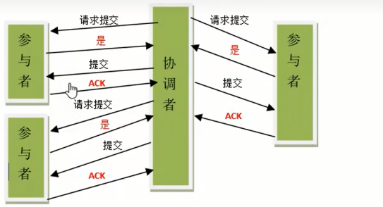

###### 失败回滚

如果任一参与者节点在第一阶段返回的响应消息为中止，或者协调者节点在第一阶段的询问超时之前无法获取所有参与者节点的响应消息时：

1. 协调者节点向所有参与者节点发出"回滚操作(rollback)"的请求。
2. 参与者节点利用之前写入的 Undo 信息执行回滚，并释放在整个事务期间内占用的资源。
3. 参与者节点向协调者节点发送"回滚完成”消息。
4. 协调者节点受到所有参与者节点反馈的"回滚完成”消息后，取消事务。

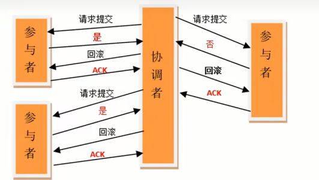

<br>

##### 二阶段提交的缺点

###### 同步阻塞

在二阶段提交的过程中，所有的节点都在等待其他节点的响应，无法进行其他操作。这种同步阻塞极大的限制了分布式系统的性能。

###### 单点问题

协调者在整个二阶段提交过程中很重要，如果协调者在提交阶段出现问题，那么整个流程将无法运转，更重要的是：其他参与者将会处于一直锁定事务资源的状态中，而无法继续完成事务操作。

###### 数据不一致

假设当协调者向所有的参与者发送 commit 请求之后，发生了局部网络异常或者是协调者在尚未发送完所有 commit 请求之前自身发生了崩溃，导致最终只有部分参与者收到了 commit 请求，这将导致严重的数据不一致问题。

###### 过于保守

如果在二阶段提交的提交询问阶段中，参与者出现故障而导致协调者始终无法获取到所有参与者的响应信息的话，这时协调者只能依靠其自身的超时机制来判断是否需要中断事务，显然，这种策略过于保守。换句话说，二阶段提交协议没有设计较为完善的容错机制，任意一个节点是失败都会导致整个事务的失败。

<br>

---

<div STYLE="page-break-after: always;"><br>
    <br>
    <br>
    <br>
    <br>
    <br>
    <br>
    <br>
    <br>
    <br></div>
## 6.2	三阶段提交

##### 三阶段提交简介

3PC 是为了解决 2PC 的同步阻塞、协调者单点、等容错机制缺失问题而提出的。

3PC 是在 2PC 的基础上进行改进的，将原本2PC的第二个阶段，即提交阶段拆分为两个部分，形成了由CanCommit、PerCommit和DoCommit三个阶段形成的事务处理协议。其协议涉及如下图所示（图上展示正常成功流程）：

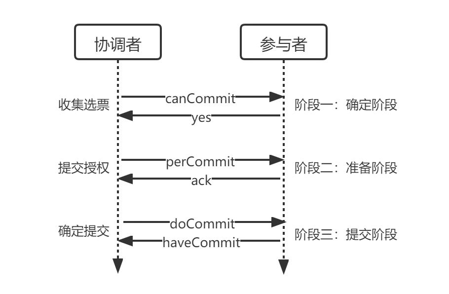

<br>

##### 2PC 和 3PC 的区别

###### can commit 阶段

3pc 比 2pc 多了一个 can commit 阶段，减少了不必要的资源浪费。3pc 在这个阶段不占用资源，只校验 SQL，如果不能 SQL 不能正常执行，就直接返回，减少了资源占用。

###### 超时机制

2pc：只有协调者有超时机制（❓ 2pc 的参与者不能加入超时机制吗？），超时后，发送回滚指令。

3pc：协调者和参与者都有超时机制：

1. 参与者超时：在 can commit 和 pre commit 阶段中，如果收不到参与者的反馈，则协调者向参与者发送中断指令。
2. 协调者超时: pre commit 阶段，参与者收不到协调者的反馈，参与者将中断事务；do commit 阶段，就算协调者没有反馈，参与者也会进行提交。

<br>

##### 阶段一——CanCommit

该阶段协调者会询问各个参与者是否能够正常执行事务，参与者根据自身情况（比如 SQL 能否执行）回复一个预估值，相对于真正的执行事务，这个过程是轻量的。

##### 具体步骤

1. **协调者进行事务询问**：协调者向参与者们发送包含事务内容的 CanCommit 请求，询问是否可以提交事务，并开始等待各参与者响应。
2. **参与者反馈**：各参与者收到协调者的 CanCommit 请求后，如果自身能够执行事务则返回 yes，否则返回 no。

<br>

##### 阶段二——PerCommit

协调者根据参与者们在第一阶段的反应情况决定是否可以进行事务的 PreCommit 操作。

###### 执行事务预提交

所有参与者对 CanCommit 请求的回复都是 yes：

1. **协调者发送预提交请求**：协调者向各参与者发送预提交请求，并进入 Prepared 阶段。
2. **参与者进行事务预提交**：参与者接收到 perCommit 请求后，开始执行事务操作，并记录 Undo log 和 Redo log。
3. **参与者反馈**：如果参与者成功执行了事务操作，就会反馈给协调者 ack，等待 commit（提交）或者 abort（中止）。

###### 中断事务

如果任何一个事务参与者向协调者返回 No，或者等待超时后，协调者无法接收到所有参与者的反馈响应，那么就会中断事务。

1. **协调者发送中断请求**：协调者向各参与者发送中断请求。
2. **参与者中断事务**：参与者收到来自协调者的 abort 请求之后（或超时之后，仍未收到协调者的请求），执行事务的中断。

<br>

##### 阶段三——DoCommit

根据阶段二的结果存在两种情况。

###### 执行提交

**所有** 参与者向协调者反馈的 ack 都是 YES：

1. **协调者发送提交请求**：协调者接收到所有参与者的 ack 响应，从 PerCommit 阶段进入到 DoCommit 阶段，并向所有参与者发送 doCommit 请求。
2. **参与者完成事务提交**：参与者接收到 doCommit 请求后，执行正式事务提交，并在完成事务后释放资源占用。
3. **参与者反馈事务提交结果**：参与者完成事务提交后向协调者发送 ack 响应。
4. **完成事务**：协调者收到所有参与者反馈的 ack 后，完成事务。

###### 中断事务

如果任何一个事务参与者向协调者返回 No，或者等待超时后，协调者无法接收到所有参与者的反馈响应，那么就会事务中断。

1. **协调者发送中断请求**：协调者向所有参与者发送 abort 请求。
2. **参与者事务回滚**：参与者接收到 abort 请求后，使用 Undo log 进行回滚操作，回滚后释放占用资源。
3. **参与者反馈事务回滚结果**：所有参与者在完成回滚后，向协调者发送ack。
4. **中断事务**：协调者接收到所有参与者反馈的ack，中断事务。

###### 注意

一旦所有参与者完成二阶段准备提交，**当进入第三阶段后**，协调者出现故障，或参与者与协调者出现网络问题，在超时后，参与者都会进行事务提交。

<br>

##### 三阶段提交的优缺点

###### 优点

相比于二阶段提交，增加了 perCommit 的缓冲，三阶段提交降低了参与者的阻塞范围，能够在出现单点故障后继续达成一致。

###### 缺点

如果进入 PreCommit 后，协调者发出的是 abort 请求，假设只有一个参与者收到并进行了 abort 操作，而其他对于系统状态未知的参与者会根据 3PC 选择继续 Commit，此时系统状态发生不一致性。

<br>

---

<div STYLE="page-break-after: always;"><br>
    <br>
    <br>
    <br>
    <br>
    <br>
    <br>
    <br>
    <br>
    <br></div>

## 6.3	TCC 解决方案

##### 什么是 TCC

TCC（Try-Confirm-Cancel）是一种常用的分布式事务解决方案，它将一个事务拆分成三个步骤：

1. **Try**：进行业务检查（一致性）及资源预留（隔离）。
2. **Confirm**：确认提交，Try阶段所有分支事务执行成功开始执行 confirm。通常情况下使用 TCC 则认为在Confirm阶段不会出错，只要try成功，confirm一定成功。若confirm出错，则进行重试或人工处理。
3. **Cancel**：在业务执行错误需要回滚的状态下，执行其他未失败的分支事务的取消，即预留资源的释放。通常情况下，TCC 的 Cancel 阶段被也认为是一定成功的，若出错曾引入重试或人工处理。

<br>

##### TCC 的空回滚

###### Try 阶段没有执行导致的数据不一致问题

在没有调用 TCC 资源 Try 方法的情况下，调用了二阶段的 Cancel() 方法。

比如 Try 请求由于网络延迟或故障等原因，没有执行，结果返回了异常，那么此时 Cancel 就不能正常执行，因为 Try 没有对数据进行修改，此时如果 Cancel 进行了对数据的修改，那就会导致数据不一致。

###### 解决思路

关键是识别事务的 Try 阶段是否正常执行。如果没有正常执行，就进行 **空回滚**。

###### 什么是空回滚

对于没有正常执行的分布式事务，在 Cancel 阶段直接返回，不进行回滚操作。

###### 解决方案参考

事务管理器在发起全局事务时生成全局事务记录，全局事务 ID 贯穿整个分布式事务调用链条。再额外增加一张分支事务记录表，其中有全局事务 ID 和分支事务 ID，第一阶段 Try 方法里会插入一条记录，表示 Try 阶段执行了。Cancel 接口里读取该记录，如果该记录存在，则正常回滚；如果该记录不存在，则空回滚。

<br>

##### TCC 的幂等问题

###### 导致幂等问题原因

由于 TCC 二阶段提交重试机制，confirm 如果执行失败，会进行 ReTry，此时已经进行过 Try 操作，并在 Try 过程中对数据进行过修改。如果两次 Try 执行的结果不一样，就会导致数据不一致问题（不幂等）。

###### 解决 TCC 幂等问题的思路

在 confirm 或 cancel 前先确认事务执行状态。

###### 解决方案

增加一张事务状态表，每次 Confirm 执行前都查询事务状态。或者直接增加分布式锁。

<br>

##### TCC 的悬挂问题

在调用分支事务 Try 时，由于网络原因导致请求超时，此时事务管理器会执行 Cancel。但是，Cancel 完成后 Try 请求到达并开始执行。由于 Try 方法预留的业务资源只能在 Cancel 释放，但 Cancel 已经执行过了，所以该事务 try 阶段预留的业务资源就再也无法释放了。

对于这种情况，我们就称为悬挂，即业务资源预留后无法继续处理。

###### 解决思路

如果 Cancel 执行完成，那 try 就不能再继续执行。在执行 try 事务时判断在该全局事务下，判断支事务记录表中是否已经有 cancel 事务记录，如果有则不执行 Try。

<br>

---

<div STYLE="page-break-after: always;"><br>
    <br>
    <br>
    <br>
    <br>
    <br>
    <br>
    <br>
    <br>
    <br></div>

## 6.4	可靠消息最终一致性方案

##### 什么是可靠消息服务方案

当事务的发起方（事务参与者，消息发送者）执行完本地事务后，同时发出一条消息，事务参与方（事务参与者，消息的消费者）一定能够接受消息并可以成功处理自己的事务。

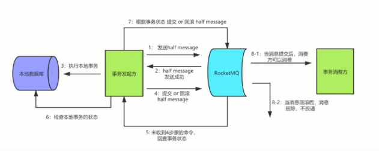

这里面强调两点：

1. 可靠消息：发起方一定得把消息传递到消费者。
2. 最终一致性：最终发起方的业务处理和消费方的业务处理得完成，达成最终一致。

<br>

##### 最大努力通知方案的关键是什么？

1. 有一定的消息重复通知机制。因为接收通知方可能没有接收到通知，此时要有一定的机制对消息重复通知。
2. 消息校对机制。如果尽最大努力也没有通知到接收方，或者接收方消费消息后要再次消费，此时可由接收方主动向通知方查询消息信息来满足需求。

<br>

---

<div STYLE="page-break-after: always;"><br>
    <br>
    <br>
    <br>
    <br>
    <br>
    <br>
    <br>
    <br>
    <br></div>

# 7	分布式缓存

## 7.1	双写一致性问题

##### 什么是双写一致性

当用户访问数据的时候，会先从缓存中读取数据，如果命中缓存的话，那么直接把缓存中的数据返回给用户，如果缓存中没有数据的话，先查询数据库把查询到的数据保存到缓存中，然后返回给用户。

双写一致性指的是当我们更新了数据库的数据后，redis 中的数据也要同步更新。

<br>

---

<div STYLE="page-break-after: always;"><br>
    <br>
    <br>
    <br>
    <br>
    <br>
    <br>
    <br>
    <br>
    <br></div>

## 7.2	双写一致性的解决方案

##### 基本解决方案——给缓存设置过期时间

对存入缓存的数据设置过期时间，所有的写操作以数据库为准，对缓存操作只是尽最大努力更新即可。也就是说如果数据库写成功，缓存更新失败，那么只要到达过期时间，则后面的读请求自然会从数据库中读取新值然后回填缓存。

从理论上来说，给缓存设置过期时间，是保证 **最终一致性** 的解决方案，因此，接下来讨论的思路不依赖于给缓存设置过期时间这个方案。

<br>

##### 缓存的四种更新策略

1. 先更新缓存，再更新数据库（不可取）
2. 先更新数据库，再更新缓存（不可取）
3. 先删除缓存，再更新数据库（不可取）
4. 先更新数据库，再删除缓存（可取，但是有问题）

<br>

##### 先更新数据库，在更新缓存与先更新缓存，再更新数据库

这两种方案不可取，主要存在以下两个问题。

###### 问题一——线程安全角度

同时有请求 A 和请求 B 进行更新操作，那么可能会出现：

1. 线程A 更新了数据库
2. 线程B 更新了数据库
3. 线程B 更新了缓存
4. 线程A 更新了缓存

这就出现请求 A 更新缓存应该比请求 B 更新缓存早才对，但是因为网络等原因，B 却比 A 更早更新了缓存。这就导致了脏数据。

###### 问题二——业务场景角度

如果是一个写操作较多，读操作较少的业务需求，采用这种方案就会导致，数据还没读到，缓存就被频繁的更新，浪费性能。

如果写入数据库的值，并不是直接写入缓存的，而是要经过一系列复杂的计算再写入缓存。那么，每次写入数据库后，都再次计算写入缓存的值，无疑是浪费性能的。显然，删除缓存更为适合。

<br>

##### 先删除缓存，再更新数据库

###### 问题——缓存脏数据

同时有一个请求 A 进行更新操作，另一个请求 B 进行查询操作。那么会出现如下情形：

1. 请求 A 进行写操作，删除缓存
2. 请求 B 查询发现缓存不存在
3. 请求 B 去数据库查询得到旧值
4. 请求 B 将旧值写入缓存
5. 请求 A 将新值写入数据库

上述情况就会导致不一致的情形出现。而且，如果不采用给缓存设置过期时间策略， 该数据永远都是脏数据。

###### 延时双删策略

使用延迟双删策略可以解决缓存脏数据问题。

延迟双删的执行逻辑：

1. 先删除缓存
2.  再更新数据库(这两步和原来一样)
3. 等待一段时间，再次删除缓存

这么做，可以将并发查询请求造成的缓存脏数据，再次删除。

那么，这段时间怎么确定的，具体该等待多久呢?针对上面的情形，应该自行评估自己的项目的读数据业务逻辑的耗时。然后写数据的休眠时间则在读数据业务逻辑的耗时基础上，加几百毫秒即可。这么做的目的，就是确保读请求结束，写请求可以删除读请求造成的缓存脏数据。

###### 采用 MySQL 读写分离架构导致的问题与解决方案

在 MySQL 读写分离架构下，假设有两个请求，请求 A 进行更新操作，请求 B 进行查询操作：

1. 请求 A 进行写操作，删除缓存
2. 请求 A 将数据写入数据库
3. 请求 B 查询缓存发现，缓存没有值
4. 请求 B 去从库查询，这时，还没有完成主从同步，因此查询到的是旧值
5. 请求 B 将旧值写入缓存
6. 数据库完成主从同步，从库变为新值

解决方案还是延时双删策略。只是，睡眠时间修改为在主从同步的延时时间基础上，再加几百毫秒。

###### 延时双删策略的问题及解决方案

1. **系统吞吐量降低**：可以将第二次删除作为异步操作。

2. **第二次删除失败**：无法解决。

<br>

##### 先更新数据库，再删缓存

推荐使用该方案。

###### 该方案可能导致的并发问题与解决方案

假设有两个请求，一个请求 A 做查询操作，一个请求 B 做更新操作，那么会有如下情形产生：

1. 缓存失效
2. 请求 A 查询数据库，得一个旧值
3. 请求 B 将新值写入数据库
4. 请求 B 删除缓存
5. 请求 A 将查到的旧值写入缓存（缓存脏数据）

但是，这种情况发生的概率极低，因为只有步骤三的写操作比步骤二的读操作耗时更短，才可能导致步骤四先于步骤五。

如果要确保该问题一定不会出现，可以给缓存设置有效时间，或者采用异步延时删除策略。

###### 缓存删除失败的解决方案一

1. 更新数据库数据；
2. 缓存删除失败；
3. 将需要删除的key发送至消息队列
4. 自己消费消息，获得需要删除的 key
5. 继续重试删除操作，直到成功

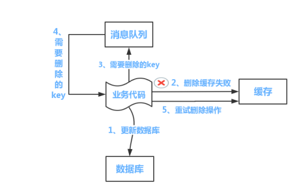


然而，该方案会对业务线代码造成大量的侵入。于是有了方案二，在方案二中，启动一个订阅程序去订阅数据库的 binlog，获得需要操作的数据。在应用程序中开启一个线程，获得这个订阅程序传来的信息，进行删除缓存操作。

###### 缓存删除失败的解决方案二

1. 更新数据库数据
2. 数据库会将操作信息写入 binlog 日志当中
3. 订阅程序（比如 canal）提取出所需要的数据以及key
4. 另起一段非业务代码（可以开启一个线程或使用消息队列），获得该信息
5. 尝试删除缓存操作，发现删除失败
6. 将这些信息发送至消息队列
7. 重新从消息队列中获得该数据，重试操作。

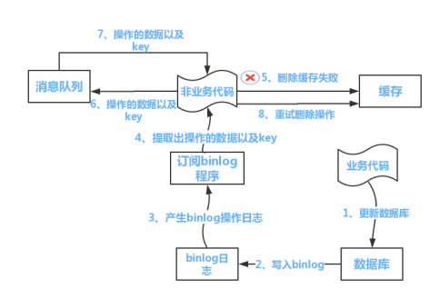

<br>

---

<div STYLE="page-break-after: always;"><br>
    <br>
    <br>
    <br>
    <br>
    <br>
    <br>
    <br>
    <br>
    <br></div>
# 8	分布式用户认证

## 8.1	认证 （Authentication）和授权（Authorization）

##### 什么是认证

Authentication（认证） 是验证您的身份的凭据（例如用户名/用户ID和密码），通过这个凭据，系统得以知道你就是你，也就是说系统存在你这个用户。所以，Authentication 被称为身份/用户验证。

<br>

##### 什么是授权

Authorization（授权） 发生在 Authentication（认证） 之后。授权，它主要掌管我们访问系统的权限。比如有些特定资源只能具有特定权限的人才能访问比如admin，有些对系统资源操作比如删除、添加、更新只能特定人才具有。

<br>

##### 认证和授权在分布式系统中的作用

认证和授权一般在我们的系统中被结合在一起使用，目的就是为了保护我们系统的安全性。

<br>

---

<div STYLE="page-break-after: always;"><br>
    <br>
    <br>
    <br>
    <br>
    <br>
    <br>
    <br>
    <br>
    <br></div>

## 8.2	使用 Session 和 Cookie 进行身份验证

##### 什么是 Session

在计算机中，尤其是在网络应用中，称为“会话控制”。Session 对象存储特定用户会话所需的属性及配置信息。这样，当用户在应用程序的 Web 页之间跳转时，存储在 Session 对象中的变量将不会丢失，而是在整个用户会话中一直存在下去。当用户请求来自应用程序的 Web 页时，如果该用户还没有会话，则 Web 服务器将自动创建一个 Session 对象。当会话过期或被放弃后，服务器将终止该会话。

<br>

##### 什么是 Cookie

 Cookie 是浏览器访问服务器后，服务器传给浏览器的一段数据。浏览器需要保存这段数据，不得轻易删除。此后每次浏览器访问该服务器，都必须带上这段数据。

Cookie 有以下用途：

1. 可以在客户端上保存用户数据，起到简单的缓存和用户身份识别等作用。
2. 保存用户的登陆状态，用户进行登陆，成功登陆后，服务器生成特定的cookie返回给客户端，客户端下次访问该域名下的任何页面，将该cookie的信息发送给服务器，服务器经过检验，来判断用户是否登陆。
3. 记录用户的行为。

<br>

##### Cookie 和 Session 的区别

Cookie 数据保存在客户端（浏览器端），Session 数据保存在服务器端。相对来说 Session 安全性更高。如果使用 Cookie 的一些敏感信息不要写入 Cookie 中，最好能将 Cookie 信息加密然后使用到的时候再去服务器端解密。

<br>

##### 使用 Session 与 Cookie 进行身份验证

###### 步骤

1. 用户向服务器发送用户名和密码用于登陆系统。
2. 服务器验证通过后，服务器为用户创建一个 Session，并将 Session信息存储 起来。
3. 服务器向用户返回一个 SessionID，写入用户的 Cookie。
4. 当用户保持登录状态时，Cookie 将与每个后续请求一起被发送出去。
5. 服务器可以将存储在 Cookie 上的 Session ID 与存储在内存中或者数据库中的 Session 信息进行比较，以验证用户的身份，返回给用户客户端响应信息的时候会附带用户当前的状态。


###### 注意

使用 Session 的时候需要注意下面几个点：

1. 依赖Session的关键业务一定要确保客户端开启了Cookie。
2. 注意Session**的过期时间**

<br>

---

<div STYLE="page-break-after: always;"><br>
    <br>
    <br>
    <br>
    <br>
    <br>
    <br>
    <br>
    <br>
    <br></div>

## 8.3	分布式架构下的 Session 共享方案

##### 方案一——将 Session 存入 Cookie 中

将 session 存储到 cookie 中，每次请求都得带着session。这么做的缺点很明显，数据存储在客户端本地，是有风险的。

<br>

##### 方案二——session 同步

在各个服务器之间同步 session，这样可以保证每个服务器上都有全部的 session 信息。不过当服务器数量比较多的时候，同步是会有延迟甚至同步失败。

<br>

##### 方案三——使用 Nginx（或其他复杂均衡软硬件）中的 ip 绑定策略

同一个 ip 只能在指定的同一个机器访问，但是这样做风险也比较大，而且也失去了负载均衡的意义；

<br>

##### 方案四——将 Session 存入 Cookie 中（推荐方案）

现在的系统会把 session 放到 Redis 中存储，虽然架构上变得复杂，并且需要多访问一次 Redis，但是这种方案带来的好处也是很大的：

1. 可以水平扩展（增加 Redis 服务器）
2. 服务器重启 session 不丢失（不过也要注意 session 在 Redis 中的刷新/失效机制）
3. 不仅可以跨服务器session共享，甚至可以跨平台（例如网页端和APP端）。

<br>

##### 方案五——无状态服务

但是确实在某些场景下，是可以没有 session 的，其实在很多接口类系统当中，都提倡 **API 无状态服务**；也就是每一次的接口访问，都不依赖于 session、不依赖于前一次的接口访问。

<br>

---

<div STYLE="page-break-after: always;"><br>
    <br>
    <br>
    <br>
    <br>
    <br>
    <br>
    <br>
    <br>
    <br></div>

## 8.4	基于 Token 的身份验证

##### 使用 Session 进行身份验证的缺点与解决方案

我们知道 Session 信息需要保存一份在服务器端。这种方式会带来一些麻烦，比如需要我们保证保存 Session 信息服务器的可用性、不适合移动端（依赖Cookie）等等。

有没有一种不需要自己存放 Session 信息就能实现身份验证的方式呢？使用 Token 即可！JWT （JSON Web Token） 就是这种方式的实现，通过这种方式服务器端就不需要保存 Session 数据了，只用在客户端保存服务端返回给客户的 Token 就可以了，扩展性得到提升。

<br>

##### 什么是 JWT

JWT 本质上就一段签名的 JSON 格式的数据。由于它是带有签名的，因此接收者便可以验证它的真实性。

JWT 由 3 部分构成:

1. Header :描述 JWT 的元数据。定义了生成签名的算法以及 Token 的类型。
2. Payload（负载）:用来存放实际需要传递的数据
3. Signature（签名）：服务器通过Payload、Header和一个密钥(secret)使用 Header 里面指定的签名算法（默认是 HMAC SHA256）生成。

<br>

##### 基于 Token 的身份验证实现

###### 原理

在基于 Token 进行身份验证的的应用程序中，服务器通过 Payload、Header 和一个密钥（secret）创建令牌（Token）并将 Token 发送给客户端，客户端将 Token 保存在 Cookie 或者 localStorage 里面，以后客户端发出的所有请求都会携带这个令牌。你可以把它放在 Cookie 里面自动发送，但是这样不能跨域，所以更好的做法是放在 HTTP Header 的 Authorization 字段中。


###### 步骤

1. 用户向服务器发送用户名和密码用于登陆系统。
2. 身份验证服务响应并返回了签名的 JWT，上面包含了用户是谁的内容。
3. 用户以后每次向后端发请求都在Header中带上 JWT。
4. 服务端检查 JWT 并从中获取用户相关信息。

<br>

---

<div STYLE="page-break-after: always;"><br>
    <br>
    <br>
    <br>
    <br>
    <br>
    <br>
    <br>
    <br>
    <br></div>

## 8.5	为什么Cookie 无法防止 CSRF 攻击，而 token 可以？

##### 什么是 CSRF 攻击

**CSRF（Cross Site Request Forgery）**一般被翻译为跨站请求伪造 。那么什么是 跨站请求伪造 呢？说简单用你的身份去发送一些对你不友好的请求。举个简单的例子：

小壮登录了某网上银行，他来到了网上银行的帖子区，看到一个帖子下面有一个链接写着“科学理财，年盈利率过万”，小壮好奇的点开了这个链接，结果发现自己的账户少了10000元。这是这么回事呢？原来黑客在链接中藏了一个请求，这个请求直接利用小壮的身份给银行发送了一个转账请求,也就是通过你的 Cookie 向银行发出请求。

<br>

##### CSRF 攻击的原理

进行 Session 认证的时候，我们一般使用 Cookie 来存储 SessionId，当我们登陆后后端生成一个 SessionId 放在 Cookie 中返回给客户端，服务端通过 Redis 或者其他存储工具记录保存着这个 Sessionid，客户端登录以后每次请求都会带上这个 SessionId，服务端通过这个 SessionId 来标示你这个人。如果别人通过 cookie拿到了 SessionId 后就可以代替你的身份访问系统了。

Session 认证中 Cookie 中的 SessionId 是由浏览器发送到服务端的，借助这个特性，攻击者就可以通过让用户误点攻击链接，达到攻击效果。

<br>

##### Token 为什么可以防止 CSRF 攻击

登录成功获得 token 之后，一般会选择存放在 local storage 中。然后我们在前端通过某些方式会给每个发到后端的请求加上这个 token，这样就不会出现 CSRF 漏洞的问题。因为，即使有个你点击了非法链接发送了请求到服务端，这个非法请求是不会携带 token 的，所以这个请求将是非法的。

<br>

---

<div STYLE="page-break-after: always;"><br>
    <br>
    <br>
    <br>
    <br>
    <br>
    <br>
    <br>
    <br>
    <br></div>

# 9	分布式解决方案

## 9.1	分布式解决方案的核心组件（❗需要修改）

##### 注册中心

注册中心可以说是微服务架构中的“通讯录”，它记录了服务和服务地址的映射关系。在分布式架构中，服务会注册到这里，当服务需要调用其它服务时，就到这里找到服务的地址，进行调用。

服务注册中心的作用就是 **服务的注册**和**服务的发现**。

###### 常见注册中心

| 组件名称  | 所属公司  | 组件简介                                                     | 实现语言 | 健康检查 |
| :-------- | :-------- | :----------------------------------------------------------- | -------- | -------- |
| Eureka    | Netflix   | springcloud 最早的注册中心，目前已经进入停更进维了           | Java     | 可配     |
| Zookeeper | Apache    | zookeeper是一个分布式协调工具，可以实现注册中心功能          | Java     | 支持     |
| Consul    | Hashicorp | Consul 简化了分布式环境中的服务的注册和发现流程，通过 HTTP 或者 DNS 接口发现。支持外部 SaaS 提供者等。 | Golang   | 支持     |
| Nacos     | Alibaba   | Nacos 致力于帮助您发现、配置和管理微服务。Nacos 提供了一组简单易用的特性集，帮助您快速实现动态服务发现、服务配置、服务元数据及流量管理。 | Java     | 支持     |

|                 | Nacos                      | Eureka      | Consul            | CoreDNS    | Zookeeper  |
| :-------------- | :------------------------- | :---------- | :---------------- | :--------- | ---------- |
| 一致性协议      | CP+AP                      | AP          | CP                | —          | CP         |
| 健康检查        | TCP/HTTP/MYSQL/Client Beat | Client Beat | TCP/HTTP/gRPC/Cmd | —          | Keep Alive |
| 负载均衡策略    | 权重/metadata/Selector     | Ribbon      | Fabio             | RoundRobin | —          |
| 雪崩保护        | 有                         | 有          | 无                | 无         | 无         |
| 自动注销实例    | 支持                       | 支持        | 不支持            | 不支持     | 支持       |
| 访问协议        | HTTP/DNS                   | HTTP        | HTTP/DNS          | DNS        | TCP        |
| 监听支持        | 支持                       | 支持        | 支持              | 不支持     | 支持       |
| 多数据中心      | 支持                       | 支持        | 支持              | 不支持     | 不支持     |
| 跨注册中心同步  | 支持                       | 不支持      | 支持              | 不支持     | 不支持     |
| SpringCloud集成 | 支持                       | 支持        | 支持              | 不支持     | 不支持     |
| Dubbo集成       | 支持                       | 不支持      | 不支持            | 不支持     | 支持       |
| K8S集成         | 支持                       | 不支持      | 支持              | 支持       | 不支持     |

###### 用zookeeper和eureka做注册中心有什么区别?

Zookeeper保证的是CP（一致性，容错性）, 而Eureka则是AP（可用性，容错性）。

###### 注册中心挂了，或者服务挂了，应该如何处理?

注册中心挂了，可以读取本地持久化里的配置

服务挂了 应该配有服务监控中心 感知到服务下线后可以通过配置的邮件通知相关人员排查问题。

<br>

##### 负载均衡器

负载均衡是高可用网络基础架构的关键组件，通常用于将工作负载分布到多个服务器来提高网站、应用、数据库或其他服务的性能和可靠性。

###### 常见的负载均衡器

1. Netflix Ribbon
2. SpringCloud LoadBalancer
3. Ribbon

###### Ribbon负载均衡原理是什么?

1. Ribbon通过ILoadBalancer接口对外提供统一的选择服务器(Server)的功能，此接口会根据不同的负载均衡策略(IRule)选择合适的Server返回给使用者。

2. IRule是负载均衡策略的抽象，ILoadBalancer通过调用IRule的choose()方法返回Server

3. IPing用来检测Server是否可用，ILoadBalancer的实现类维护一个Timer每隔10s检测一次Server的可用状态

4. IClientConfig主要定义了用于初始化各种客户端和负载均衡器的配置信息，器实现类为DefaultClientConfigImpl

<br>

##### 服务熔断器

 在微服务的框架中，我们是将一个单体应用拆分成多个服务单元，各个服务单元之间通过注册中心彼此发现和消费对方提供的服务，每个服务器单元都是单独部署，在各自服务的运行进程中，服务之间通过远程调用实现信息交互，那么当某个服务响应太慢或者故障，又或者因为网络波动或故障，则会造成调用者延迟或调用失败，当大量请求到达，则会造成请求的堆积，导致调用者的线程挂起，从而引发调用者无法响应，调用者也发生故障。

所以在微服务的架构中，很容易造成服务故障的蔓延，引起整个微服务系统瘫痪不可用。 

为了解决此问题，微服务框架中 引入了一种叫熔断器的服务保护机制。熔断器也有叫断路器，是一种开关装置，用于在电路上保护线路过载，当线路中有电器发生短路时，能够及时的切断故障电路，防止发生过载、发热甚至引起火灾等严重情况。

微服务架构中的熔断器，就是当调用方没有响应，调用直接返回一个错误响应即可，而不是长时间的等待，这样避免调用时因为等待而线程一直得不到释放，避免故障在分布式系统间蔓延。

###### 熔断降级机制

如果调用某服务报错（或者挂了），就对该服务熔断，在 5 分钟内请求此服务直接就返回一个默认值（进行熔断）。但是熔断了之后就会少调用一个服务，此时需要做下标记，标记本来需要做什么业务，但是因为服务挂了，暂时没有做，等该服务恢复了，就可以手工处理这些业务。这个过程，就是所谓的降级。

###### 常见的服务熔断器

1. Netflix Hystrix
2. Alibaba Sentinel
3. Resilience4J

###### Hystrix的实现原理

Hystrix是一个延迟和容错库，旨在隔离对远程系统、服务和第三方库的访问点，停止级联故障，并在 不可避免发生故障的复杂分布式系统中实现快速恢复。主要靠Spring的AOP实现

 实现原理

正常情况下，断路器关闭，服务消费者正常请求微服务

一段事件内，失败率达到一定阈值，断路器将断开，此时不再请求服务提供者，而是只是快速失败的方法（断路方法）

 断路器打开一段时间，自动进入“半开”状态，此时，断路器可允许一个请求方法服务提供者，如果请求调用成功，则关闭断路器，否则继续保持断路器打开状态。

 断路器hystrix是保证了局部发生的错误，不会扩展到整个系统，从而保证系统的即使出现局部问题也不会造成系统雪崩

<br>

##### 服务网关

**微服务网关是整个微服务 API 请求的入口**，可以实现过滤 Api 接口、用户的验证登录、解决跨域、日志拦截、权限控制、限流、熔断、负载均衡、黑名单与白名单机制等。

###### 常见的服务网关

1. Netflix Zuul
2. SpringCloud Gateway

<br>

##### 服务接口调用

###### 什么是 RPC 和 RMI

RPC 远程过程调用协议，通过网络从远程计算机上请求调用某种服务。

RMI:远程方法调用 能够让在客户端Java虚拟机上的对象像调用本地对象一样调用服务端java 虚拟机中的对象上的方法。

###### 什么是 HttpClient

###### 常见的服务接口调用实现

Netflix Feign、 Resttemplate、Openfeign

<br>

##### 链路追踪

Netflix Sleuth、Skywalking、Pinpoint

<br>

##### 聚合 Hystrix 监控数据

Netflix Turbine

<br>

##### 监控中心

SpringBoot Admin

<br>

##### 配置中心

在服务运行之前，将所需的配置信息从配置仓库拉取到本地服务，达到统一化配置管理的目的。

###### Spring Boot 实现配置中心的核心文件 BootStrap.yaml（❗需要补充）

###### 配置中心是如何实现自动刷新的？

1. 配置中心Server端承担起配置刷新的职责

2. 提交配置触发post请求给server端的bus/refresh接口

3. server端接收到请求并发送给Spring Cloud Bus总线

4. Spring Cloud bus接到消息并通知给其它连接到总线的客户端

5. 其它客户端接收到通知，请求Server端获取最新配置

6. 全部客户端均获取到最新的配置

###### 配置中心是如何保证数据安全的?

1.保证容器文件访问的安全性，即保证所有的网络资源请求都需要登录

2.将配置中心里所有配置文件中的密码进行加密，保证其密文性

3.开发环境禁止拉取生产环境的配置文件

###### 常见组件

Spring Cloud Config 、Apollo、nacos

<br>

---

<div STYLE="page-break-after: always;"><br>
    <br>
    <br>
    <br>
    <br>
    <br>
    <br>
    <br>
    <br>
    <br></div>
## 9.2	Dubbo+Zookeeper（❗需要修改）

##### Spring Cloud和Dubbo有哪些区别

1. dubbo 是二进制传输，对象直接转成二进制，使用RPC通信。SpringCloud是http 传输，同时使用http协议一般会使用JSON报文，json再转二进制，消耗会更大。

2. Dubbo只是实现了服务治理，而Spring Cloud下面有几十个子项目分别覆盖了微服务架构下的方方面面，服务治理只是其中的一个方面

<br>

##### ZooKeeper数据模型

ZooKeeper的数据模型，在结构上和标准文件系统的非常相似，拥有一个层次的命名空间，都是采用树形层次结构，ZooKeeper树中的每个节点被称为—Znode。

和文件系统的目录树一样，ZooKeeper树中的每个节点可以拥有子节点。但也有不同之处：

1. Znode兼具文件和目录两种特点。既像文件一样维护着数据、元信息、ACL、时间戳等数据结构，又像目录一样可以作为路径标识的一部分，并可以具有子Znode。用户对Znode具有增、删、改、查等操作（权限允许的情况下）
2. Znode具有原子性操作，读操作将获取与节点相关的所有数据，写操作也将替换掉节点的所有数据。另外，每一个节点都拥有自己的ACL(访问控制列表)，这个列表规定了用户的权限，即限定了特定用户对目标节点可以执行的操作
3. Znode存储数据大小有限制。ZooKeeper虽然可以关联一些数据，但并没有被设计为常规的数据库或者大数据存储，相反的是，它用来管理调度数据，比如分布式应用中的配置文件信息、状态信息、汇集位置等等。这些数据的共同特性就是它们都是很小的数据，通常以KB为大小单位。ZooKeeper的服务器和客户端都被设计为严格检查并限制每个Znode的数据大小至多1M，当时常规使用中应该远小于此值
4. Znode通过路径引用，如同Unix中的文件路径。路径必须是绝对的，因此他们必须由斜杠字符来开头。除此以外，他们必须是唯一的，也就是说每一个路径只有一个表示，因此这些路径不能改变。在ZooKeeper中，路径由Unicode字符串组成，并且有一些限制。字符串"/zookeeper"用以保存管理信息，比如关键配额信息。

<br>

##### 节点类型

Znode有两种，分别为临时节点和永久节点。
节点的类型在创建时即被确定，并且不能改变。
临时节点：该节点的生命周期依赖于创建它们的会话。一旦会话结束，临时节点将被自动删除，当然可以也可以手动删除。临时节点不允许拥有子节点。

永久节点：该节点的生命周期不依赖于会话，并且只有在客户端显示执行删除操作的时候，他们才能被删除。
　　
Znode还有一个序列化的特性，如果创建的时候指定的话，该Znode的名字后面会自动追加一个不断增加的序列号。序列号对于此节点的父节点来说是唯一的，这样便会记录每个子节点创建的先后顺序。它的格式为“%10d”(10位数字，没有数值的数位用0补充，例如“0000000001”)

在ZooKeeper中，每个数据节点都是有生命周期的，其生命周期的长短取决于数据节点的节点类型。

1、持久节点（PERSISTENT）

该数据节点别创建后，就会一直存在于ZooKeeper服务器上，直到有删除操作来主动删除该节点。

2、持久顺序节点（PERSISTENT_SEQUENTIAL）

持久顺序节点的基本特性和持久节点是一致的，额外的特性表现在顺序性上。在ZooKeeper中，每个父节点都会为它的第一级子节点维护一份顺序，用于记录每个子节点创建的先后顺序。

3、临时节点（EPHEMERAL）

临时节点的生命周期和客户端的回话绑定在一起，如果客户端会话失效，那么这个节点就会被自动地清理掉。

ZooKeeper规定了不能基于临时节点来创建子节点，即临时节点只能作为叶子节点。

4、临时顺序节点（EPHEMERAL_SEQUENTIAL）

<br>

##### Zookeeper watch机制是什么

ZooKeeper是用来协调（同步）分布式进程的服务，提供了一个简单高性能的协调内核，用户可以在此之上构建更多复杂的分布式协调功能。

多个分布式进程通过ZooKeeper提供的API来操作共享的ZooKeeper内存数据对象ZNode来达成某种一致的行为或结果，这种模式本质上是基于状态共享的并发模型，与Java的多线程并发模型一致，他们的线程或进程都是”共享式内存通信“。

Java没有直接提供某种响应式通知接口来监控某个对象状态的变化，只能要么浪费CPU时间毫无响应式的轮询重试，或基于Java提供的某种主动通知（Notif）机制（内置队列）来响应状态变化，但这种机制是需要循环阻塞调用。

而ZooKeeper实现这些分布式进程的状态（ZNode的Data、Children）共享时，基于性能的考虑采用了类似的异步非阻塞的主动通知模式即Watch机制，使得分布式进程之间的“共享状态通信”更加实时高效，其实这也是ZooKeeper的主要任务决定的—协调。Consul虽然也实现了Watch机制，但它是阻塞的长轮询。

###### ZooKeeper的Watch特性

1. Watch是一次性的，每次都需要重新注册，并且客户端在会话异常结束时不会收到任何通知，而快速重连接时仍不影响接收通知。
2. Watch的回调执行都是顺序执行的，并且客户端在没有收到关注数据的变化事件通知之前是不会看到最新的数据，另外需要注意不要在Watch回调逻辑中阻塞整个客户端的Watch回调
3. Watch是轻量级的，WatchEvent是最小的通信单元，结构上只包含通知状态、事件类型和节点路径。ZooKeeper服务端只会通知客户端发生了什么，并不会告诉具体内容。

###### Zookeeper状态

Disconnected：客户端是断开连接的状态，不能连接服务集合中的任意一个
SyncConnected：客户端是连接状态，连接其中的一个服务
AuthFailed：鉴权失败
ConnectedReadOnly：客户端连接只读的服务器
SaslAuthenticated：SASL认证
Expired：服务器已经过期了该客户端的Session

###### Zookeeper事件类型

None：无
NodeCreated：节点创建
NodeDeleted：节点删除
NodeDataChanged：节点数据改变
NodeChildrenChanged：子节点改变（添加/删除）

###### Watcher使用的注意事项

Watcher是一次触发器，假如需要持续监听数据变更，需要在每次获取时设置Watcher
会话过期：当客户端会话过期时，该客户端注册的Watcher会失效
事件丢失：在接收通知和注册监视点之间，可能会丢失事件,但Zookeeper的状态变更和数据变化，都会记录在状态元数据信息和ZK数据节点上，所以能够获取最终一致的ZK信息状态
避免Watcher过多：服务器会对每一个注册Watcher事件的客户端发送通知，通知通过Socket连接的方式发送，当Watcher过多时，会产生一个尖峰的通知

<br>

##### zk的命名服务、配置管理、集群管理分别是什么

###### 分布式协调

大于等于一的情况下，才会有协调，在协调的事务进行分类得到一些名词，语义能够接受就可以

###### 命名服务

通过使用有序节点的特性做到协调命名规则

通过zk的事务ID递增，做到有序行命名规则

通过使用自己点做map映射，做到1:N的命名映射，比如DNS

顺序关系、映射关系

###### 配置管理

配置、元数据、状态等语义可以通过ZK的节点1MB存储，或者通过zk的节点目录结构特性存储

并且通过watch机制，满足配置变化的全局通知能力

###### 集群管理

通过zk的排他性，有序性

满足分布式锁、分布式选主、队列锁

串行化回调调度

分布式调度等

<br>

---

<div STYLE="page-break-after: always;"><br>
    <br>
    <br>
    <br>
    <br>
    <br>
    <br>
    <br>
    <br>
    <br></div>

## 9.3	Spring Cloud（❗修改补充）

---

<div STYLE="page-break-after: always;"><br>
    <br>
    <br>
    <br>
    <br>
    <br>
    <br>
    <br>
    <br>
    <br></div>

## 9.4	Spring Cloud Netflix

---

<div STYLE="page-break-after: always;"><br>
    <br>
    <br>
    <br>
    <br>
    <br>
    <br>
    <br>
    <br>
    <br></div>

## 9.5	Spring Cloud Alibaba（❗修改补充）

---

<div STYLE="page-break-after: always;"><br>
    <br>
    <br>
    <br>
    <br>
    <br>
    <br>
    <br>
    <br>
    <br></div>

# 附录

##### 参考资料

- [1.1	分布式简介](#1.1	分布式简介)——[什么是分布式系统？](https://www.atlassian.com/zh/microservices/microservices-architecture/distributed-architecture) 发布于 2022；
- [1.2	微服务简介](#1.1	微服务简介)——[微服务与单体式架构](https://www.atlassian.com/zh/microservices/microservices-architecture/microservices-vs-monolith) 发布于 2022；
- [1.2	微服务简介](#1.2	微服务简介)——[分布式和微服务是什么关系？](https://www.boxuegu.com/news/1882.html) 发布于 2022/00/00；
- [1.4	微服务架构总体设计和基础组件](#1.4	微服务架构总体设计和基础组件)—— [微服务架构总体设计和基础组件](https://laravelacademy.org/post/20965) 发布于 2020；
- [6.1	二阶段提交](#6.1	二阶段提交)——[二阶段提交的缺点](http://www.mybatis.cn/archives/1628.html) 发布于 2021/06/15；
- [6.2	三阶段提交](#6.2	三阶段提交)——[三阶段提交（3PC）](https://www.jianshu.com/p/a91f011754ea) 发布于 2021/10/22；
- [6.3	TCC 解决方案](#6.3	TCC 解决方案)——[分布式事务解决方案TCC](https://www.jianshu.com/p/da8135c137ba) 发布于 2020/11/16 最后编辑于 2020/11/16
- [9.1	分布式解决方案的核心组件](#9.1	分布式解决方案的核心组件)——[Spring Cloud 系列之 Netflix Eureka 注册中心](https://mrhelloworld.com/eureka) 发布于 2020-02-03
- [9.1	分布式解决方案的核心组件](#9.1	分布式解决方案的核心组件)——[第六章 服务熔断器Hystrix](https://blog.csdn.net/Mr_YXX/article/details/113817848) 发布于 2021/02/15

<br>