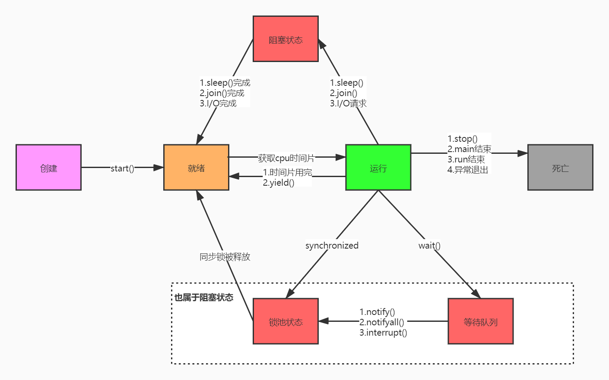

# Happens-Before规则是什么？

1. 程序顺序规则：一个线程中的每一个操作，happens-before于该线程中的任意后续操作。
1. 监视器规则：对一个锁的解锁，happens-before于随后对这个锁的加锁。
1. volatile规则：对一个volatile变量的写，happens-before于任意后续对一个volatile变量的读。
1. 传递性：若果A happens-before B，B happens-before C，那么A happens-before C。
1. 线程启动规则：Thread对象的start()方法，happens-before于这个线程的任意后续操作。
1. 线程终止规则：线程中的任意操作，happens-before于该线程的终止监测。我们可以通过Thread.join()方法结束、Thread.isAlive()的返回值等手段检测到线程已经终止执行。
1. 线程中断操作：对线程interrupt()方法的调用，happens-before于被中断线程的代码检测到中断事件的发生，可以通过Thread.interrupted()方法检测到线程是否有中断发生。
1. 对象终结规则：一个对象的初始化完成，happens-before于这个对象的finalize()方法的开始。

# 介绍一下线程的生命周期及状态？


**1.创建**
当程序使用new关键字创建了一个线程之后，该线程就处于一个新建状态（初始状态），此时它和其他Java对象一样，仅仅由Java虚拟机为其分配了内存，并初始化了其成员变量值。此时的线程对象没有表现出任何线程的动态特征，程序也不会执行线程的线程执行体。
**2.就绪**
当线程对象调用了Thread.start()方法之后，该线程处于就绪状态。Java虚拟机会为其创建方法调用栈和程序计数器，处于这个状态的线程并没有开始运行，它只是表示该线程可以运行了。从start()源码中看出，start后添加到了线程列表中，接着在native层添加到VM中，至于该线程何时开始运行，取决于JVM里线程调度器的调度(如果OS调度选中了，就会进入到运行状态)。
**3.运行**
当线程对象调用了Thread.start()方法之后，该线程处于就绪状态。添加到了线程列表中，如果OS调度选中了，就会进入到运行状态
**4.阻塞**
阻塞状态是线程因为某种原因放弃CPU使用权，暂时停止运行。直到线程进入就绪状态，才有机会转到运行状态。阻塞的情况大概三种：

- 1、**等待阻塞**：运行的线程执行wait()方法，JVM会把该线程放入等待池中。(wait会释放持有的锁)
- 2、**同步阻塞**：运行的线程在获取对象的同步锁时，若该同步锁被别的线程占用，则JVM会把该线程放入锁池中。
- 3、**其他阻塞**：运行的线程执行sleep()或join()方法，或者发出了I/O请求时，JVM会把该线程置为阻塞状态。当sleep()状态超时、join()等待线程终止或者超时、或者I/O处理完毕时，线程重新转入就绪状态。（注意,sleep是不会释放持有的锁）。
- 线程睡眠：Thread.sleep(long millis)方法，使线程转到阻塞状态。millis参数设定睡眠的时间，以毫秒为单位。当睡眠结束后，就转为就绪（Runnable）状态。sleep()平台移植性好。
- 线程等待：Object类中的wait()方法，导致当前的线程等待，直到其他线程调用此对象的 notify() 方法或 notifyAll() 唤醒方法。这个两个唤醒方法也是Object类中的方法，行为等价于调用 wait(0) 一样。唤醒线程后，就转为就绪（Runnable）状态。
- 线程让步：Thread.yield() 方法，暂停当前正在执行的线程对象，把执行机会让给相同或者更高优先级的线程。
- 线程加入：join()方法，等待其他线程终止。在当前线程中调用另一个线程的join()方法，则当前线程转入阻塞状态，直到另一个进程运行结束，当前线程再由阻塞转为就绪状态。
- 线程I/O：线程执行某些IO操作，因为等待相关的资源而进入了阻塞状态。比如说监听system.in，但是尚且没有收到键盘的输入，则进入阻塞状态。
- 线程唤醒：Object类中的notify()方法，唤醒在此对象监视器上等待的单个线程。如果所有线程都在此对象上等待，则会选择唤醒其中一个线程，选择是任意性的，并在对实现做出决定时发生。类似的方法还有一个notifyAll()，唤醒在此对象监视器上等待的所有线程。

**5.死亡**
线程会以以下三种方式之一结束，结束后就处于死亡状态:

- run()方法执行完成，线程正常结束。
- 线程抛出一个未捕获的Exception或Error。
- 直接调用该线程的stop()方法来结束该线程——该方法容易导致死锁，通常不推荐使用

#  线程的sleep、wait、join、yield如何使用？

**sleep**:让线程睡眠，期间会出让cpu，在同步代码块中，不会释放锁
**wait**(必须先获得对应的锁才能调用):让线程进入等待状态,释放当前线程持有的锁资源线程只有在notify 或者notifyAll方法调用后才会被唤醒,然后去争夺锁.
**join**:线程之间协同方式,使用场景: 线程A必须等待线程B运行完毕后才可以执行,那么就可以在线程A的代码中加入ThreadB.join();
**yield**:让当前正在运行的线程回到可运行状态，以允许具有相同优先级的其他线程获得运行的机会。因此，使用yield()的目的是让具有相同优先级的线程之间能够适当的轮换执行。但是，实际中无法保证yield()达到让步的目的，因为，让步的线程可能被线程调度程序再次选中。

# 创建线程有哪些方式？

1）继承Thread类创建线程
2）实现Runnable接口创建线程
3）使用Callable和Future创建线程
4）使用线程池例如用Executor框架

# 什么是守护线程？

在Java中有两类线程：User Thread(用户线程)、Daemon Thread(守护线程) 
任何一个守护线程都是整个JVM中所有非守护线程的保姆：
只要当前JVM实例中尚存在任何一个非守护线程没有结束，守护线程就全部工作；只有当最后一个非守护线程结束时，守护线程随着JVM一同结束工作。Daemon的作用是为其他线程的运行提供便利服务，守护线程最典型的应用就是 GC (垃圾回收器)，它就是一个很称职的守护者。
User和Daemon两者几乎没有区别，唯一的不同之处就在于虚拟机的离开：如果 User Thread已经全部退出运行了，只剩下Daemon Thread存在了，虚拟机也就退出了。 因为没有了被守护者，Daemon也就没有工作可做了，也就没有继续运行程序的必要了。
注意事项:
(1) thread.setDaemon(true)必须在thread.start()之前设置，否则会出现一个IllegalThreadStateException异常。只能在线程未开始运行之前设置为守护线程。
(2) 在Daemon线程中产生的新线程也是Daemon的。
(3) 不要认为所有的应用都可以分配给Daemon来进行读写操作或者计算逻辑，因为这会可能回到数据不一致的状态。

# ThreadLocal的原理是什么，使用场景有哪些？

Thread类中有两个变量threadLocals和inheritableThreadLocals，二者都是ThreadLocal内部类ThreadLocalMap类型的变量，我们通过查看内部内ThreadLocalMap可以发现实际上它类似于一个HashMap。在默认情况下，每个线程中的这两个变量都为null:

```java
ThreadLocal.ThreadLocalMap threadLocals = null;
ThreadLocal.ThreadLocalMap inheritableThreadLocals = null;
```

只有当线程第一次调用ThreadLocal的set或者get方法的时候才会创建他们。

```java
public T get() {
        Thread t = Thread.currentThread();
        ThreadLocalMap map = getMap(t);
        if (map != null) {
            ThreadLocalMap.Entry e = map.getEntry(this);
            if (e != null) {
                @SuppressWarnings("unchecked")
                T result = (T)e.value;
                return result;
            }
        }
        return setInitialValue();
}
    
ThreadLocalMap getMap(Thread t) {
        return t.threadLocals;
}
```

除此之外，每个线程的本地变量不是存放在ThreadLocal实例中，而是放在调用线程的**ThreadLocals**变量里面。也就是说，**ThreadLocal类型的本地变量是存放在具体的线程空间上**，其本身相当于一个装载本地变量的载体，通过set方法将value添加到调用线程的threadLocals中，当调用线程调用get方法时候能够从它的threadLocals中取出变量。如果调用线程一直不终止，那么这个本地变量将会一直存放在他的threadLocals中，所以不使用本地变量的时候需要调用remove方法将threadLocals中删除不用的本地变量,防止出现内存泄漏。

```java
public void set(T value) {
        Thread t = Thread.currentThread();
        ThreadLocalMap map = getMap(t);
        if (map != null)
            map.set(this, value);
        else
            createMap(t, value);
}
public void remove() {
         ThreadLocalMap m = getMap(Thread.currentThread());
         if (m != null)
             m.remove(this);
}
```

# ThreadLocal有哪些内存泄露问题，如何避免？

每个Thread都有一个ThreadLocal.ThreadLocalMap的map，该map的key为ThreadLocal实例，它为一个弱引用，我们知道弱引用有利于GC回收。当ThreadLocal的key == null时，GC就会回收这部分空间，但是value却不一定能够被回收，因为他还与Current Thread存在一个强引用关系，如下

由于存在这个强引用关系，会导致value无法回收。如果这个线程对象不会销毁那么这个强引用关系则会一直存在，就会出现内存泄漏情况。所以说只要这个线程对象能够及时被GC回收，就不会出现内存泄漏。如果碰到线程池，那就更坑了。 那么要怎么避免这个问题呢？ 在前面提过，在ThreadLocalMap中的setEntry()、getEntry()，如果遇到key == null的情况，会对value设置为null。当然我们也可以显示调用ThreadLocal的remove()方法进行处理。 下面再对ThreadLocal进行简单的总结：

- ThreadLocal 不是用于解决共享变量的问题的，也不是为了协调线程同步而存在，而是为了方便每个线程处理自己的状态而引入的一个机制。这点至关重要。
- 每个Thread内部都有一个ThreadLocal.ThreadLocalMap类型的成员变量，该成员变量用来存储实际的ThreadLocal变量副本。
- ThreadLocal并不是为线程保存对象的副本，它仅仅只起到一个索引的作用。它的主要木得视为每一个线程隔离一个类的实例，这个实例的作用范围仅限于线程内部。

# 为什么要使用线程池？

为了减少创建和销毁线程的次数，让每个线程可以多次使用,可根据系统情况**调整执行**的线程数量，防止消耗过多内存,所以我们可以使用线程池.

# 线程池线程复用的原理是什么？

思考这么一个问题：任务结束后会不会回收线程？
答案是：allowCoreThreadTimeOut控制

```java
/java/util/concurrent/ThreadPoolExecutor.java:1127
final void runWorker(Worker w) {
        Thread wt = Thread.currentThread();
        Runnable task = w.firstTask;
        w.firstTask = null;
        w.unlock(); // allow interrupts
        boolean completedAbruptly = true;
        try {
            while (task != null || (task = getTask()) != null) {...执行任务...}
            completedAbruptly = false;
        } finally {
            processWorkerExit(w, completedAbruptly);
        }
    }
首先线程池内的线程都被包装成了一个个的java.util.concurrent.ThreadPoolExecutor.Worker,然后这个worker会马不停蹄的执行任务,执行完任务之后就会在while循环中去取任务,取到任务就继续执行,取不到任务就跳出while循环(这个时候worker就不能再执行任务了)执行 processWorkerExit方法,这个方法呢就是做清场处理,将当前woker线程从线程池中移除,并且判断是否是异常的进入processWorkerExit方法,如果是非异常情况,就对当前线程池状态(RUNNING,shutdown)和当前工作线程数和当前任务数做判断,是否要加入一个新的线程去完成最后的任务(防止没有线程去做剩下的任务).
那么什么时候会退出while循环呢?取不到任务的时候(getTask() == null).下面看一下getTask方法

private Runnable getTask() {
        boolean timedOut = false; // Did the last poll() time out?

        for (;;) {
            int c = ctl.get();
            int rs = runStateOf(c);

            //(rs == SHUTDOWN && workQueue.isEmpty()) || rs >=STOP
            //若线程池状态是SHUTDOWN 并且 任务队列为空,意味着已经不需要工作线程执行任务了,线程池即将关闭
            //若线程池的状态是 STOP TIDYING TERMINATED,则意味着线程池已经停止处理任何任务了,不在需要线程
            if (rs >= SHUTDOWN && (rs >= STOP || workQueue.isEmpty())) {
            	//把此工作线程从线程池中删除
                decrementWorkerCount();
                return null;
            }

            int wc = workerCountOf(c);

            //allowCoreThreadTimeOut:当没有任务的时候,核心线程数也会被剔除,默认参数是false,官方推荐在创建线程池并且还未使用的时候,设置此值
            //如果当前工作线程数 大于 核心线程数,timed为true
            boolean timed = allowCoreThreadTimeOut || wc > corePoolSize;
			
            //(wc > maximumPoolSize || (timed && timedOut)):当工作线程超过最大线程数,或者 允许超时并且超时过一次了
            //(wc > 1 || workQueue.isEmpty()):工作线程数至少为1个 或者 没有任务了
            //总的来说判断当前工作线程还有没有必要等着拿任务去执行
            //wc > maximumPoolSize && wc>1 : 就是判断当前工作线程是否超过最大值
            //或者 wc > maximumPoolSize && workQueue.isEmpty():工作线程超过最大,基本上不会走到这,
            //		如果走到这,则意味着wc=1 ,只有1个工作线程了,如果此时任务队列是空的,则把最后的线程删除
            //或者(timed && timedOut) && wc>1:如果允许超时并且超时过一次,并且至少有1个线程,则删除线程
            //或者 (timed && timedOut) && workQueue.isEmpty():如果允许超时并且超时过一次,并且此时工作					队列为空，那么妥妥可以把最后一个线程（因为上面的wc>1不满足，则可以得出来wc=1）删除
            if ((wc > maximumPoolSize  || (timed && timedOut))
                && (wc > 1 || workQueue.isEmpty())) {
                if (compareAndDecrementWorkerCount(c))
                	//如果减去工作线程数成功,则返回null出去,也就是说 让工作线程停止while轮训,进行收尾
                    return null;
                continue;
            }

            try {
            	//判断是否要阻塞获取任务
                Runnable r = timed ?
                    workQueue.poll(keepAliveTime, TimeUnit.NANOSECONDS) :
                    workQueue.take();
                if (r != null)
                    return r;
                timedOut = true;
            } catch (InterruptedException retry) {
                timedOut = false;
            }
        }
    }
    
//综上所述,如果allowCoreThreadTimeOut为true,并且在第1次阻塞获取任务失败了,那么当前getTask会返回null,不管是不是核心线程;那么runWorker中将推出while循环,也就意味着当前工作线程被销毁

```

通过上面这个问题可以得出一个结论：当你的线程池参数配置合理的时候，执行完任务的线程是不会被销毁的，而是会从任务队列中取出任务继续执行！

# 如何预防死锁？

1. 首先需要将死锁发生的是个必要条件讲出来:
   1. 互斥条件 同一时间只能有一个线程获取资源。
   1. 不可剥夺条件 一个线程已经占有的资源，在释放之前不会被其它线程抢占
   1. 请求和保持条件 线程等待过程中不会释放已占有的资源
   1. 循环等待条件 多个线程互相等待对方释放资源
2. 死锁预防，那么就是需要破坏这四个必要条件
   1. 由于资源互斥是资源使用的固有特性，无法改变，我们不讨论
   1. 破坏不可剥夺条件
      1. 一个进程不能获得所需要的全部资源时便处于等待状态，等待期间他占有的资源将被隐式的释放重新加入到系统的资源列表中，可以被其他的进程使用，而等待的进程只有重新获得自己原有的资源以及新申请的资源才可以重新启动，执行
3. 破坏请求与保持条件
   1. 第一种方法静态分配即每个进程在开始执行时就申请他所需要的全部资源
   1. 第二种是动态分配即每个进程在申请所需要的资源时他本身不占用系统资源
4. 破坏循环等待条件
   1. 采用资源有序分配其基本思想是将系统中的所有资源顺序编号，将紧缺的，稀少的采用较大的编号，在申请资源时必须按照编号的顺序进行，一个进程只有获得较小编号的进程才能申请较大编号的进程。

# 描述一下线程安全活跃态问题？

线程安全的活跃性问题可以分为 死锁、活锁、饥饿   

1. 活锁 就是有时线程虽然没有发生阻塞，但是仍然会存在执行不下去的情况，活锁不会阻塞线程，线程会一直重复执行某个相同的操作，并且一直失败重试
   1. 我们开发中使用的异步消息队列就有可能造成活锁的问题，在消息队列的消费端如果没有正确的ack消息，并且执行过程中报错了，就会再次放回消息头，然后再拿出来执行，一直循环往复的失败。这个问题除了正确的ack之外，往往是通过将失败的消息放入到延时队列中，等到一定的延时再进行重试来解决。
   1. 解决活锁的方案很简单，尝试等待一个随机的时间就可以，会按时间轮去重试
2. 饥饿  就是 线程因无法访问所需资源而无法执行下去的情况
   1. 饥饿 分为两种情况：
      1. 一种是其他的线程在临界区做了无限循环或无限制等待资源的操作，让其他的线程一直不能拿到锁进入临界区，对其他线程来说，就进入了饥饿状态
      1. 另一种是因为线程优先级不合理的分配，导致部分线程始终无法获取到CPU资源而一直无法执行
   2. 解决饥饿的问题有几种方案:
      1.  保证资源充足，很多场景下，资源的稀缺性无法解决
      1.  公平分配资源，在并发编程里使用公平锁，例如FIFO策略，线程等待是有顺序的，排在等待队列前面的线程会优先获得资源
      1.  避免持有锁的线程长时间执行，很多场景下，持有锁的线程的执行时间也很难缩短
3. 死锁  线程在对同一把锁进行竞争的时候，未抢占到锁的线程会等待持有锁的线程释放锁后继续抢占，如果两个或两个以上的线程互相持有对方将要抢占的锁，互相等待对方先行释放锁就会进入到一个循环等待的过程，这个过程就叫做死锁

# 线程安全的竞态条件有哪些？

1. 同一个程序多线程访问同一个资源，如果对资源的访问顺序敏感，就称存在竞态条件，代码区成为临界区。 大多数并发错误一样，竞态条件不总是会产生问题，还需要不恰当的执行时序
1. 最常见的竞态条件为
   1. 先检测后执行执行依赖于检测的结果，而检测结果依赖于多个线程的执行时序，而多个线程的执行时序通常情况下是不固定不可判断的，从而导致执行结果出现各种问题，见一种可能 的解决办法就是：在一个线程修改访问一个状态时，要防止其他线程访问修改，也就是加锁机制，保证原子性
   1. 延迟初始化（典型为单例）

# 程序开多少线程合适？

1. CPU 密集型程序，一个完整请求，I/O操作可以在很短时间内完成，CPU还有很多运算要处理，也就是说 CPU 计算的比例占很大一部分，线程等待时间接近0   
   1. 单核CPU： 一个完整请求，I/O操作可以在很短时间内完成， CPU还有很多运算要处理，也就是说 CPU 计算的比例占很大一部分，线程等待时间接近0。单核CPU处理CPU密集型程序，这种情况并不太适合使用多线程。
   1. 多核 ： 如果是多核CPU 处理 CPU 密集型程序，我们完全可以最大化的利用 CPU 核心数，应用并发编程来提高效率。CPU 密集型程序的最佳线程数就是：理论上线程数量 = CPU 核数（逻辑），但是实际上，数量一般会设置为 CPU 核数（逻辑）+ 1（经验值）,计算(CPU)密集型的线程恰好在某时因为发生一个页错误或者因其他原因而暂停，刚好有一个“额外”的线程，可以确保在这种情况下CPU周期不会中断工作
2. I/O 密集型程序，与 CPU 密集型程序相对，一个完整请求，CPU运算操作完成之后还有很多 I/O 操作要做，也就是说 I/O 操作占比很大部分，等待时间较长，线程等待时间所占比例越高，需要越多线程；线程CPU时间所占比例越高，需要越少线程
   1. I/O 密集型程序的最佳线程数就是： 最佳线程数 = CPU核心数 *(1/CPU利用率) = CPU核心数* (1 + (I/O耗时/CPU耗时))
   1. 如果几乎全是 I/O耗时，那么CPU耗时就无限趋近于0，所以纯理论你就可以说是 2N（N=CPU核数），当然也有说 2N + 1的，1应该是backup
   1. 一般我们说 2N + 1 就即可

#  synchronized和lock有哪些区别？

| 区别类型     | synchronized                                                 | Lock                                                         |
| ------------ | ------------------------------------------------------------ | ------------------------------------------------------------ |
| 存在层次     | Java的关键字，在jvm层面上                                    | 是JVM的一个接口                                              |
| 锁的获取     | 假设A线程获得锁，B线程等待。如果A线程阻塞，B线程会一直等待   | 情况而定，Lock有多个锁获取的方式，大致就是可以尝试获得锁，线程可以不用一直等待(可以通过tryLock判断有没有锁) |
| 锁的释放     | 1、以获取锁的线程执行完同步代码，释放锁2、线程执行发生异常，jvm会让线程释放 | 在finally中必须释放锁，不然容易造成线程死锁                  |
| 锁类型       | 锁可重入、不可中断、非公平                                   | 可重入、可判断 可公平（两者皆可）                            |
| 性能         | 少量同步                                                     | 适用于大量同步                                               |
| 支持锁的场景 | 1.  独占锁                                                   | 1.  公平锁与非公平锁                                         |

# ABA问题遇到过吗，详细说一下？

1. 有两个线程同时去修改一个变量的值，比如线程1、线程2，都更新变量值，将变量值从A更新成B。
1. 首先线程1获取到CPU的时间片，线程2由于某些原因发生阻塞进行等待，此时线程1进行比较更新（CompareAndSwap），成功将变量的值从A更新成B。
1. 更新完毕之后，恰好又有线程3进来想要把变量的值从B更新成A，线程3进行比较更新，成功将变量的值从B更新成A。
1. 线程2获取到CPU的时间片，然后进行比较更新，发现值是预期的A，然后有更新成了B。但是线程1并不知道，该值已经有了A->B->A这个过程，这也就是我们常说的ABA问题。

# volatile的可见性和禁止指令重排序怎么实现的？

- 可见性：
  volatile的功能就是被修饰的变量在被修改后可以立即同步到主内存，被修饰的变量在每次是用之前都从主内存刷新。本质也是通过内存屏障来实现可见性
  写内存屏障（Store Memory Barrier）可以促使处理器将当前store buffer（存储缓存）的值写回主存。读内存屏障（Load Memory Barrier）可以促使处理器处理invalidate queue（失效队列）。进而避免由于Store Buffer和Invalidate Queue的非实时性带来的问题。
- 禁止指令重排序：
  volatile是通过**内存屏障**来禁止指令重排序
  JMM内存屏障的策略
   - 在每个 volatile 写操作的前面插入一个 StoreStore 屏障。
   - 在每个 volatile 写操作的后面插入一个 StoreLoad 屏障。
   - 在每个 volatile 读操作的后面插入一个 LoadLoad 屏障。
   - 在每个 volatile 读操作的后面插入一个 LoadStore 屏障。

# ConcurrentHashMap底层原理是什么？

1.7
数据结构：
内部主要是一个Segment数组，而数组的每一项又是一个HashEntry数组，元素都存在HashEntry数组里。因为每次锁定的是Segment对象，也就是整个HashEntry数组，所以又叫分段锁。

1.8
数据结构：
与HashMap一样采用：数组+链表+红黑树

底层原理则是采用锁链表或者红黑树头结点，相比于HashTable的方法锁，力度更细，是对数组（table）中的桶（链表或者红黑树）的头结点进行锁定，这样锁定，只会影响数组（table）当前下标的数据，不会影响其他下标节点的操作，可以提高读写效率。
putVal执行流程：

1. 判断存储的key、value是否为空，若为空，则抛出异常
1. 计算key的hash值，随后死循环（该循环可以确保成功插入，当满足适当条件时，会主动终止），判断table表为空或者长度为0，则初始化table表
1. 根据hash值获取table中该下标对应的节点，如果该节点为空，则根据参数生成新的节点，并以CAS的方式进行更新，并终止死循环。
1. 如果该节点的hash值是MOVED(-1)，表示正在扩容，则辅助对该节点进行转移。
1. 对数组（table）中的节点，即桶的头结点进行锁定，如果该节点的hash大于等于0，表示此桶是链表，然后对该桶进行遍历（死循环），寻找链表中与put的key的hash值相等，并且key相等的元素，然后进行值的替换，如果到链表尾部都没有符合条件的，就新建一个node，然后插入到该桶的尾部，并终止该循环遍历。
1. 如果该节点的hash小于0，并且节点类型是TreeBin，则走红黑树的插入方式。
1. 判断是否达到转化红黑树的阈值，如果达到阈值，则链表转化为红黑树。

