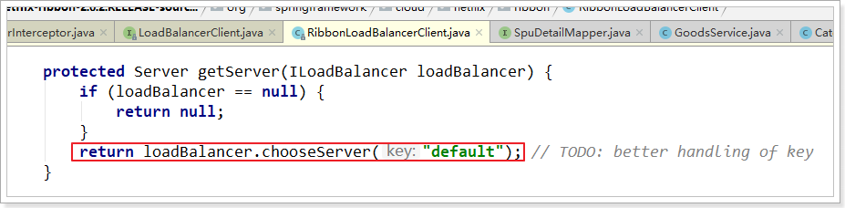

# 4 Ribbon 负载均衡器

## 4.1	Ribbon 负载均衡原理

##### Spring Cloud 实现负载均衡

Spring Cloud 底层其实是利用了一个名为 **Ribbon** 的组件，来实现负载均衡功能的。


<br>

##### 通过源代码分析 Ribbon 实现负载均衡的原理

###### LoadBalancerInterceptor

`LoadBalancerInterceptor` 根据 service 名称，获取到了服务实例的 ip 和端口号[^4.1-1]，这个类会在对 RestTemplate 的请求进行拦截，然后从 Eureka 根据服务 id 获取服务列表，随后利用负载均衡算法得到真实的服务地址信息，替换服务 id。


可以看到这里的 `intercept()` 方法，拦截了用户的 HttpRequest 请求，然后做了几件事：

- `request.getURI()`：获取请求 uri，本例中就是 http://user-service/user/8
- `originalUri.getHost()`：获取 uri 路径的主机名，其实就是服务id，`user-service`
- `this.loadBalancer.execute()`：处理服务id，和用户请求。

这里的 `this.loadBalancer` 是 `LoadBalancerClient` 类型，我们继续跟入。

###### LoadBalancerClient

进入 `LoadBalancerClient` 后继续跟入`execute()`方法


代码是这样的：

- `getLoadBalancer(serviceId)`：根据服务 id 获取 ILoadBalancer，而 ILoadBalancer 会拿着服务id去 eureka 中获取服务列表并保存起来。
- `getServer(loadBalancer)`：利用内置的负载均衡算法，从服务列表中选择一个。本例中，可以看到获取了 8082 端口的服务。

放行后，再次访问并跟踪，发现获取的是 8081，实现了负载均衡。


###### 负载均衡策略 IRule

在刚才的代码中，可以看到获取服务使通过一个 `getServer()` 方法来做负载均衡:

 

继续跟入：



继续跟踪源码 `chooseServer` 方法，发现这么一段代码：

 

我们看看这个 rule 是谁：

 

这里的 rule 默认值是一个 `RoundRobinRule` ，看类的介绍，意为轮询规则

 

到这里，整个负载均衡的流程我们就清楚了。

<br>

---

[^4.1-1]: 所以在 Eureka 中完成注册后，消费者可以通过服务名称代替 ip 和端口号来方法提供者。

<div STYLE="page-break-after: always;">
    <br>
    <br>
    <br>
    <br>
    <br>
</div>
## 4.2	负载均衡策略

##### IRule 接口的实现类

负载均衡的规则都定义在 IRule 接口中，而 IRule 有很多不同的实现类，对应不同的负载均衡策略。


<br>

##### 负载均衡规则与对应的规则类

| **内置负载均衡规则类**        | **规则描述**                                                 |
| ----------------------------- | ------------------------------------------------------------ |
| RoundRobinRule                | 简单轮询服务列表来选择服务器。它是Ribbon默认的负载均衡规则。 |
| AvailabilityFilteringRule     | 对以下两种服务器进行忽略：   （1）在默认情况下，这台服务器如果3次连接失败，这台服务器就会被设置为“短路”状态。短路状态将持续30秒，如果再次连接失败，短路的持续时间就会几何级地增加。  （2）并发数过高的服务器。如果一个服务器的并发连接数过高，配置了AvailabilityFilteringRule规则的客户端也会将其忽略。并发连接数的上限，可以由客户端的<clientName>.<clientConfigNameSpace>.ActiveConnectionsLimit属性进行配置。 |
| WeightedResponseTimeRule      | 为每一个服务器赋予一个权重值。服务器响应时间越长，这个服务器的权重就越小。这个规则会随机选择服务器，这个权重值会影响服务器的选择。 |
| **ZoneAvoidanceRule**[^4.2-1] | 以区域可用的服务器为基础进行服务器的选择。使用Zone对服务器进行分类，这个Zone可以理解为一个机房、一个机架等。而后再对Zone内的多个服务做轮询。 |
| BestAvailableRule             | 忽略那些短路的服务器，并选择并发数较低的服务器。             |
| RandomRule                    | 随机选择一个可用的服务器。                                   |
| RetryRule                     | 重试机制的选择逻辑                                           |

<br>

---

[^4.2-1]: 默认的负载均很规则。 

<div STYLE="page-break-after: always;">
    <br>
    <br>
    <br>
    <br>
    <br>
</div>

## 4.3	设置负载均很策略

##### 方法一——代码方式

在 service 中的启动类中，定义一个新的 IRule

```java
@Bean
public IRule randomRule(){
    return new RandomRule();//采用随机模式
}
```

<br>

##### 方法二——配置文件模式

在 service 的application.yml文件中，添加新的配置修改规则

```
userservice: # 给某个微服务配置负载均衡规则，这里是userservice服务
  ribbon:
    NFLoadBalancerRuleClassName: com.netflix.loadbalancer.RandomRule # 负载均衡规则 
```

<br>

##### 📌注意

一般用默认的负载均衡规则即可，不需要做修改。

<br>

---

<div STYLE="page-break-after: always;">
    <br>
    <br>
    <br>
    <br>
    <br>
</div>

## 4.4	Ribbon 的饥饿加载

##### Ribbon 的默认加载方式

Ribbon 默认是采用懒加载，即第一次访问时才会去创建 LoadBalanceClient，请求时间会很长。

<br>

##### 饥饿加载

而饥饿加载则会在项目启动时创建，降低第一次访问的耗时，通过下面配置开启饥饿加载

```yaml
ribbon:
  eager-load:
    enabled: true
    clients: userservice
```

<br>

---

<div STYLE="page-break-after: always;">
    <br>
    <br>
    <br>
    <br>
    <br>
</div>

