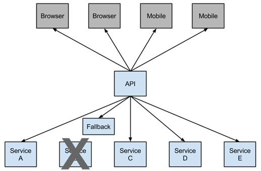

# 12	Hystrix

## 12.1	Hystrix 概述

##### Hystrix 概述

Hystrix 是一个供分布式系统使用，提供延迟和容错功能，保证复杂的分布系统在面临不可避免的失败时，仍能有其弹性。

比如系统中有很多服务，当某些服务不稳定的时候，使用这些服务的用户线程将会阻塞，如果没有隔离机制，系统随时就有可能会挂掉，从而带来很大的风险。SpringCloud使用Hystrix组件提供断路器、资源隔离与自我修复功能。下图表示服务B触发了断路器，阻止了级联失败



<br>

----

<div STYLE="page-break-after: always;">
    <br>
	<br>
	<br>
	<br>
	<br>
</div>
## 12.2	Hystrix 快速开始

##### 步骤

###### 第一步

在 service 的 pom 中添加依赖

```xml
<!--hystrix依赖，主要是用  @HystrixCommand -->
<dependency>
    <groupId>org.springframework.cloud</groupId>
    <artifactId>spring-cloud-starter-netflix-hystrix</artifactId>
</dependency>
<dependency>
    <groupId>org.springframework.cloud</groupId>
    <artifactId>spring-cloud-starter-netflix-ribbon</artifactId>
</dependency>
<!--服务注册-->
<dependency>
    <groupId>org.springframework.cloud</groupId>
    <artifactId>spring-cloud-starter-alibaba-nacos-discovery</artifactId>
</dependency>
<!--服务调用-->
<dependency>
    <groupId>org.springframework.cloud</groupId>
    <artifactId>spring-cloud-starter-openfeign</artifactId>
</dependency>
```

###### 第二步

在配置文件中添加 hystrix 配置： 

```
#开启熔断机制
feign.hystrix.enabled=true
#设置hystrix超时时间，默认1000ms
hystrix.command.default.execution.isolation.thread.timeoutInMilliseconds=6000
```

###### 第三步

在服务消费者的 client 包里面创建熔断器的实现类

```java
@Component
public class VodFileDegradeFeignClient implements VodClient {
    @Override
    public ResponseResult removeVideo(String videoId) {
        return ResponseResult.error().message("time out");
    }
}
```

###### 第四步

修改服务提供者的  feign 调用接口的 @FeignClient 注解

```java
//修改前
//@FeignClient("service-vod")
//修改后
@FeignClient(name = "service-vod", fallback = VodFileDegradeFeignClient.class)
@Component
public interface xxxClient {

    @DeleteMapping(value = "/eduvod/vod/{videoId}")
    public ResponseResult removeVideo(@PathVariable("videoId") String videoId);
    
}
```

###### 第五步

测试熔断器效果。

<br>

---

<div STYLE="page-break-after: always;">
    <br>
	<br>
	<br>
	<br>
	<br>
</div>
