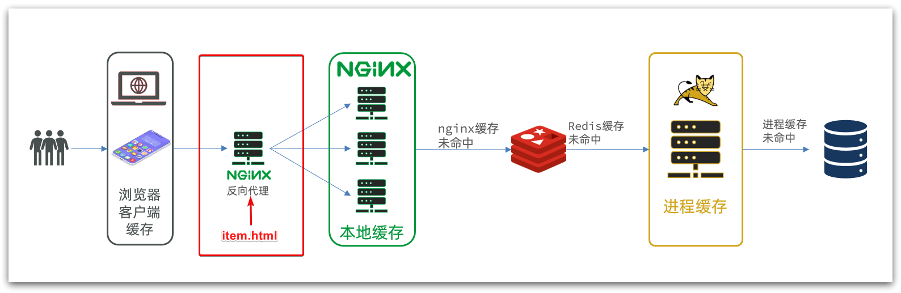
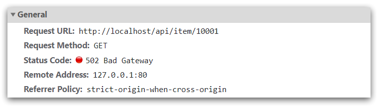
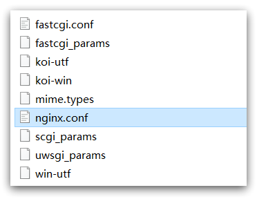
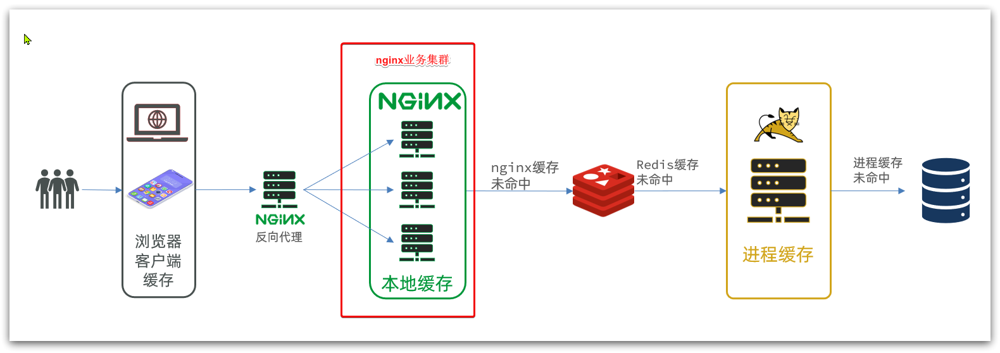
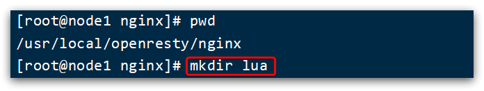
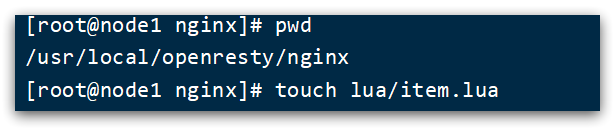
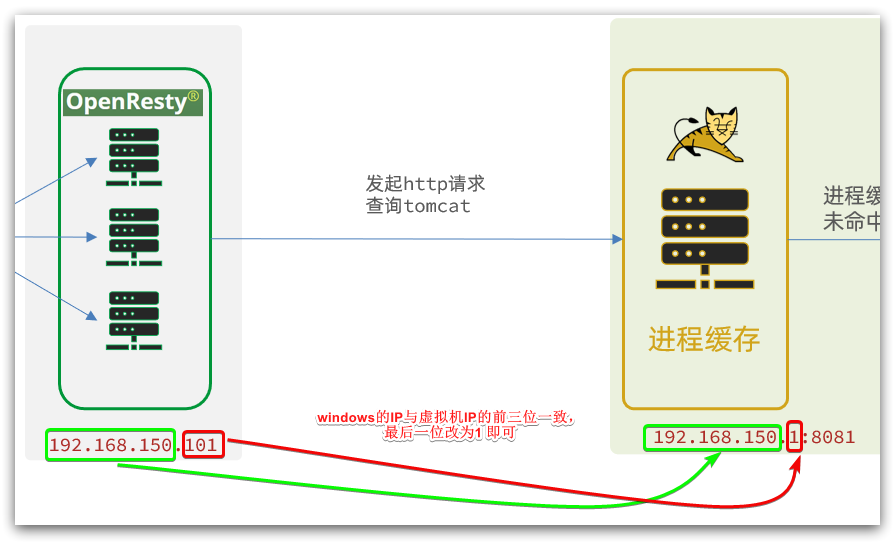
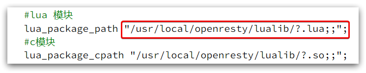
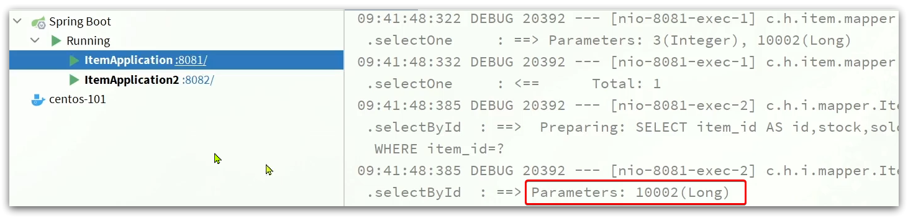
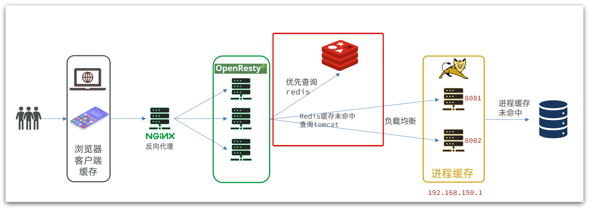

# 11	多级缓存

## 11.1	多级缓存概述

##### 传统缓存策略

​	传统的缓存策略一般是请求到达 Tomcat 后，先查询 Redis，如果未命中则查询数据库，如图：


存在下面的问题：

- 请求要经过 Tomcat 处理，Tomcat 的性能成为整个系统的瓶颈
- Redis 缓存失效时，会对数据库产生冲击

<br>

##### 什么是多级缓存

多级缓存就是充分利用请求处理的每个环节，分别添加缓存，减轻 Tomcat 压力，提升服务性能：

- 浏览器访问静态资源时，优先读取浏览器本地缓存
- 访问非静态资源（ajax查询数据）时，访问服务端
- 请求到达 Nginx 后，优先读取 Nginx 本地缓存
- 如果 Nginx 本地缓存未命中，则去直接查询 Redis（不经过Tomcat）
- 如果 Redis 查询未命中，则查询Tomcat
- 请求进入Tomcat后，优先查询 JVM 进程缓存
- 如果 JVM 进程缓存未命中，则查询数据库


在多级缓存架构中，Nginx 内部需要编写本地缓存查询、Redis 查询、Tomcat 查询的业务逻辑，因此这样的 nginx 服务不再是一个**反向代理服务器**，而是一个编写 **业务的Web服务器了**。

因此，对于这样的业务 Nginx 服务也需要搭建集群来提高并发，再用专门的 nginx 服务来做反向代理，如图：


除此之外，Tomcat 服务将来也会部署为集群模式：


<br>

##### 多级缓存的关键

根据上述内容可见，多级缓存的关键有两个：

- 一个是在 nginx 中编写业务，实现 nginx 本地缓存、Redis、Tomcat 的查询

- 另一个就是在 Tomcat 中实现 JVM 进程缓存

其中 Nginx 编程则会用到 OpenResty 框架结合 Lua 这样的语言。

<br>

----

<div STYLE="page-break-after: always;">
    <br>
	<br>
	<br>
	<br>
	<br>
</div>
## 11.2	JVM 进程缓存

### 11.2.1	Caffeine 概述

##### 缓存分类

缓存在日常开发中启动至关重要的作用，由于是存储在内存中，数据的读取速度是非常快的，能大量减少对数据库的访问，减少数据库的压力。我们把缓存分为两类：

- 分布式缓存，例如 Redis：
  - 优点：存储容量更大、可靠性更好、可以在集群间共享
  - 缺点：访问缓存有网络开销
  - 场景：缓存数据量较大、可靠性要求较高、需要在集群间共享
- 进程本地缓存，例如 HashMap、GuavaCache：
  - 优点：读取本地内存，没有网络开销，速度更快
  - 缺点：存储容量有限、可靠性较低、无法共享
  - 场景：性能要求较高，缓存数据量较小

<br>

##### Caffeine 简介

**Caffeine** 是一个基于 Java8 开发的，提供了近乎最佳命中率的高性能的本地缓存库。目前 Spring 内部的缓存使用的就是Caffeine。

<br>

##### GitHub 地址

https://github.com/ben-manes/caffeine

<br>

##### Caffeine  性能对比

Caffeine 的性能非常好，下图是官方给出的性能对比：


可以看到 Caffeine 的性能遥遥领先。

<br>

##### 缓存使用的基本API

```java
@Test
void testBasicOps() {
    // 构建cache对象
    Cache<String, String> cache = Caffeine.newBuilder().build();

    // 存数据
    cache.put("gf", "迪丽热巴");

    // 取数据
    String gf = cache.getIfPresent("gf");
    System.out.println("gf = " + gf);

    // 取数据，包含两个参数：
    // 参数一：缓存的key
    // 参数二：Lambda表达式，表达式参数就是缓存的key，方法体是查询数据库的逻辑
    // 优先根据key查询JVM缓存，如果未命中，则执行参数二的Lambda表达式
    String defaultGF = cache.get("defaultGF", key -> {
        // 根据key去数据库查询数据
        return "柳岩";
    });
    System.out.println("defaultGF = " + defaultGF);
}
```

<br>

##### 缓存清除策略

Caffeine 既然是缓存的一种，肯定需要有缓存的清除策略，不然的话内存总会有耗尽的时候。

Caffeine 提供了三种缓存驱逐策略：

- **基于容量**：设置缓存的数量上限

```java
// 创建缓存对象
Cache<String, String> cache = Caffeine.newBuilder()
    .maximumSize(1) // 设置缓存大小上限为 1
    .build();
```

- **基于时间**：设置缓存的有效时间

```java
// 创建缓存对象
Cache<String, String> cache = Caffeine.newBuilder()
    // 设置缓存有效期为 10 秒，从最后一次写入开始计时 
    .expireAfterWrite(Duration.ofSeconds(10)) 
    .build();

```

- **基于引用**：设置缓存为软引用或弱引用，利用GC来回收缓存数据。性能较差，不建议使用。

**注意**：在默认情况下，当一个缓存元素过期的时候，Caffeine 不会自动立即将其清理和驱逐。而是在一次读或写操作后，或者在空闲时间完成对失效数据的驱逐。

<br>

---

<div STYLE="page-break-after: always;">
    <br>
	<br>
	<br>
	<br>
	<br>
</div>

### 11.2.2	案例准备

##### 导入案例

为了演示多级缓存的案例，我们先准备一个商品查询的业务。

###### 多个 Mysql

进行数据同步需要用到 Mysql 的主从功能，所以需多个 Mysql ，如果没有足够的主机，可以通过 Docker 运行一个 Mysql 容器。

###### Sql 文件

到入 [item.sql](attachment\sql)，其中包含两张表：

- tb_item：商品表，包含商品的基本信息
- tb_item_stock：商品库存表，包含商品的库存信息

之所以将库存分离出来，是因为库存是更新比较频繁的信息，写操作较多。而其他信息修改的频率非常低。

###### 导入 Demo 工程

导入工程 [item-service](attachment\item-service)，其中的业务包括：

- 分页查询商品
- 新增商品
- 修改商品
- 修改库存
- 删除商品
- 根据id查询商品
- 根据id查询库存

业务全部使用 mybatis-plus 来实现，如有需要请自行修改业务逻辑。

###### 启动

注意修改application.yml文件中配置的mysql地址信息：


需要修改为自己的虚拟机地址信息、还有账号和密码。

修改后，启动服务，访问：http://localhost:8081/item/10001即可查询数据

###### 导入商品查询页面

商品查询是购物页面，与商品管理的页面是分离的。

部署方式如图：



我们需要准备一个反向代理的nginx服务器，如上图红框所示，将静态的商品页面放到nginx目录中。

页面需要的数据通过ajax向服务端（nginx业务集群）查询。

###### 运行 nginx 服务

运行已经准备好的，包含静态资源的 nginx 反向代理服务器，[资源位置](attachment\nginx-1.18.0)。将其拷贝到一个非中文目录下，运行这个 nginx 服务

```powershell
start nginx.exe
```

然后访问 http://localhost/item.html?id=10001即可：


###### 反向代理

现在，页面是假数据展示的。我们需要向服务器发送 ajax 请求，查询商品数据。

打开控制台，可以看到页面有发起ajax查询数据：



而这个请求地址同样是80端口，所以被当前的nginx反向代理了。

查看nginx的conf目录下的nginx.conf文件：

 

其中的关键配置如下：


其中的 192.168.150.101 是演示虚拟机的IP，也是 Nginx 业务集群要部署的地方：



完整内容如下：

```nginx
#user  nobody;
worker_processes  1;

events {
    worker_connections  1024;
}

http {
    include       mime.types;
    default_type  application/octet-stream;

    sendfile        on;
    #tcp_nopush     on;
    keepalive_timeout  65;

    upstream nginx-cluster{
        server 192.168.150.101:8081;
    }
    server {
        listen       80;
        server_name  localhost;

	location /api {
            proxy_pass http://nginx-cluster;
        }

        location / {
            root   html;
            index  index.html index.htm;
        }

        error_page   500 502 503 504  /50x.html;
        location = /50x.html {
            root   html;
        }
    }
}
```

<br>

---

<div STYLE="page-break-after: always;">
    <br>
	<br>
	<br>
	<br>
	<br>
</div>

### 11.2.3	实现 JVM 进程缓存

##### 案例需求

利用Caffeine实现下列需求：

- 给根据id查询商品的业务添加缓存，缓存未命中时查询数据库
- 给根据id查询商品库存的业务添加缓存，缓存未命中时查询数据库
- 缓存初始大小为100
- 缓存上限为10000

<br>

##### 实现

首先，我们需要定义两个Caffeine的缓存对象，分别保存商品、库存的缓存数据。

在item-service的`com.heima.item.config`包下定义`CaffeineConfig`类：

```java
package com.heima.item.config;

import com.github.benmanes.caffeine.cache.Cache;
import com.github.benmanes.caffeine.cache.Caffeine;
import com.heima.item.pojo.Item;
import com.heima.item.pojo.ItemStock;
import org.springframework.context.annotation.Bean;
import org.springframework.context.annotation.Configuration;

@Configuration
public class CaffeineConfig {

    @Bean
    public Cache<Long, Item> itemCache(){
        return Caffeine.newBuilder()
                .initialCapacity(100)
                .maximumSize(10_000)
                .build();
    }

    @Bean
    public Cache<Long, ItemStock> stockCache(){
        return Caffeine.newBuilder()
                .initialCapacity(100)
                .maximumSize(10_000)
                .build();
    }
}
```


然后，修改item-service中的`com.heima.item.web`包下的ItemController类，添加缓存逻辑：

```java
@RestController
@RequestMapping("item")
public class ItemController {

    @Autowired
    private IItemService itemService;
    @Autowired
    private IItemStockService stockService;

    @Autowired
    private Cache<Long, Item> itemCache;
    @Autowired
    private Cache<Long, ItemStock> stockCache;
    
    // ...其它略
    
    @GetMapping("/{id}")
    public Item findById(@PathVariable("id") Long id) {
        return itemCache.get(id, key -> itemService.query()
                .ne("status", 3).eq("id", key)
                .one()
        );
    }

    @GetMapping("/stock/{id}")
    public ItemStock findStockById(@PathVariable("id") Long id) {
        return stockCache.get(id, key -> stockService.getById(key));
    }
}
```

<br>

---

<div STYLE="page-break-after: always;">
    <br>
	<br>
	<br>
	<br>
	<br>
</div>

## 11.3	Lua 语法入门

### 11.3.1	Lua 概述

##### Lua 简介

Lua 是一种轻量小巧的脚本语言，用标准C语言编写并以源代码形式开放， 其设计目的是为了嵌入应用程序中，从而为应用程序提供灵活的扩展和定制功能。

<br>

##### 官网

https://www.lua.org/

<br>

##### Luau 常见用途与 Nginx 

Lua 经常嵌入到 C 语言开发的程序中，例如游戏开发、游戏插件等。Nginx 本身也是 C 语言开发，因此也允许基于 Lua 做拓展。

<br>

---

<div STYLE="page-break-after: always;">
    <br>
	<br>
	<br>
	<br>
	<br>
</div>

### 11.3.2	Hello World

##### 在 Linux 环境下运行 Luau代码

CentOS7默认已经安装了Lua语言环境，所以可以直接运行Lua代码。

1. 在 Linux 虚拟机的任意目录下，新建一个 hello.lua 文件


2. 添加下面的内容

```lua
print("Hello World!")  
```

3. 运行


<br>

---

<div STYLE="page-break-after: always;">
    <br>
	<br>
	<br>
	<br>
	<br>
</div>

### 11.3.3	变量

##### 数据类型

Lua中支持的常见数据类型包括：


另外，Lua提供了type()函数来判断一个变量的数据类型：


<br>

##### 声明变量

Lua 声明变量的时候无需指定数据类型，而是用 local 来声明变量为局部变量：

```lua
-- 声明字符串，可以用单引号或双引号，
local str = 'hello'
-- 字符串拼接可以使用 ..
local str2 = 'hello' .. 'world'
-- 声明数字
local num = 21
-- 声明布尔类型
local flag = true
```

<br>

##### table 类型

Lua 中的 table 类型既可以作为数组，又可以作为 Java 中的 map 来使用。数组就是特殊的 table，key 是数组角标而已：

```lua
-- 声明数组 ，key为角标的 table
local arr = {'java', 'python', 'lua'}
-- 声明table，类似java的map
local map =  {name='Jack', age=21}
```

Lua中的数组角标是从1开始，访问的时候与Java中类似：

```lua
-- 访问数组，lua数组的角标从1开始
print(arr[1])
```

Lua中的table可以用key来访问：

```lua
-- 访问table
print(map['name'])
print(map.name)
```

<br>

---

<div STYLE="page-break-after: always;">
    <br>
	<br>
	<br>
	<br>
	<br>
</div>

### 11.3.4	循环

##### 遍历数组

```lua
-- 声明数组 key为索引的 table
local arr = {'java', 'python', 'lua'}
-- 遍历数组
for index,value in ipairs(arr) do
    print(index, value) 
end
```

<br>

##### 遍历普通table

对于 table，我们可以利用for循环来遍历。不过普通 table 和数组的遍历略有差异。

```lua
-- 声明map，也就是table
local map = {name='Jack', age=21}
-- 遍历table
for key,value in pairs(map) do
   print(key, value) 
end
```

<br>

---

<div STYLE="page-break-after: always;">
    <br>
	<br>
	<br>
	<br>
	<br>
</div>

### 11.3.5	条件控制

##### 条件控制

类似Java的条件控制，例如if、else语法：

```lua
if(布尔表达式)
then
   --[ 布尔表达式为 true 时执行该语句块 --]
else
   --[ 布尔表达式为 false 时执行该语句块 --]
end

```

<br>

##### 逻辑运算

与java不同，布尔表达式中的逻辑运算是基于英文单词：


<br>

---

<div STYLE="page-break-after: always;">
    <br>
	<br>
	<br>
	<br>
	<br>
</div>

### 11.3.6	函数

##### 语法——定义函数

```lua
function 函数名( argument1, argument2..., argumentn)
    -- 函数体
    return 返回值
end
```

<br>

##### 例——定义一个函数，用来打印数组

```lua
function printArr(arr)
    for index, value in ipairs(arr) do
        print(value)
    end
end
```

<br>

##### 例——自定义一个函数，可以打印table，当参数为nil时，打印错误信息

```
function printArr(arr)
    if not arr then
        print('数组不能为空！')
    end
    for index, value in ipairs(arr) do
        print(value)
    end
end
```

<br>

---

<div STYLE="page-break-after: always;">
    <br>
	<br>
	<br>
	<br>
	<br>
</div>

## 11.4	实现多级缓存

### 11.4.1	OpenResty 概述

##### OpenResty 简介

OpenResty® 是一个基于 Nginx的高性能 Web 平台，用于方便地搭建能够处理超高并发、扩展性极高的动态 Web 应用、Web 服务和动态网关。具备下列特点：

- 具备 Nginx 的完整功能
- 基于 Lua 语言进行扩展，集成了大量精良的 Lua 库、第三方模块
- 允许使用 Lua **自定义业务逻辑**、**自定义库**

<br>

##### 官方网站

 https://openresty.org/cn/

<br>

---

<div STYLE="page-break-after: always;">
    <br>
	<br>
	<br>
	<br>
	<br>
</div>

### 11.4.2	安装 OpenResty

##### 前提条件

Linux 主机必须联网

<br>

##### 安装开发库

安装 OpenResty 的依赖开发库，执行命令：

```sh
yum install -y pcre-devel openssl-devel gcc --skip-broken
```

<br>

##### 安装 penResty 仓库

可以在 CentOS 系统中添加 `openresty` 仓库，这样便于未来安装或更新软件包（通过 `yum check-update` 命令）。运行下面的命令就可以添加 `openresty` 仓库：

```
yum-config-manager --add-repo https://openresty.org/package/centos/openresty.repo
```

如果提示说命令不存在，则运行：

```
yum install -y yum-utils 
```

然后再重复上面的命令。

<br>

##### 安装 OpenResty

```bash
yum install -y openresty
```

<br>

##### 安装 opm 工具

opm 是 OpenResty 的一个管理工具，可以帮助我们安装一个第三方的 Lua 模块。

如果你想安装命令行工具 `opm`，那么可以像下面这样安装 `openresty-opm` 包：

```bash
yum install -y openresty-opm
```

<br>

##### 目录结构

默认情况下，OpenResty安装的目录是：/usr/local/openresty

 

<br>

##### 配置nginx的环境变量

打开配置文件：

```sh
vi /etc/profile
```

在最下面加入两行：

```sh
export NGINX_HOME=/usr/local/openresty/nginx
export PATH=${NGINX_HOME}/sbin:$PATH
```

NGINX_HOME：后面是OpenResty安装目录下的nginx的目录

然后让配置生效：

```
source /etc/profile
```

<br>

##### 启动和运行

OpenResty底层是基于Nginx的，查看OpenResty目录的nginx目录，结构与windows中安装的nginx基本一致：


所以运行方式与nginx基本一致：

```sh
# 启动nginx
nginx
# 重新加载配置
nginx -s reload
# 停止
nginx -s stop
```

nginx的默认配置文件注释太多，影响后续我们的编辑，这里将nginx.conf中的注释部分删除，保留有效部分。

修改`/usr/local/openresty/nginx/conf/nginx.conf`文件，内容如下：

```nginx
#user  nobody;
worker_processes  1;
error_log  logs/error.log;

events {
    worker_connections  1024;
}

http {
    include       mime.types;
    default_type  application/octet-stream;
    sendfile        on;
    keepalive_timeout  65;

    server {
        listen       8081;
        server_name  localhost;
        location / {
            root   html;
            index  index.html index.htm;
        }
        error_page   500 502 503 504  /50x.html;
        location = /50x.html {
            root   html;
        }
    }
}
```

在Linux的控制台输入命令以启动nginx：

```sh
nginx
```

然后访问页面：http://192.168.150.101:8081，注意ip地址替换为你自己的虚拟机IP。

<br>

##### 加载 OpenResty 的 lua 模块

```nginx
#lua 模块
lua_package_path "/usr/local/openresty/lualib/?.lua;;";
#c模块     
lua_package_cpath "/usr/local/openresty/lualib/?.so;;";  
```

<br>

##### common.lua

```lua
-- 封装函数，发送http请求，并解析响应
local function read_http(path, params)
    local resp = ngx.location.capture(path,{
        method = ngx.HTTP_GET,
        args = params,
    })
    if not resp then
        -- 记录错误信息，返回404
        ngx.log(ngx.ERR, "http not found, path: ", path , ", args: ", args)
        ngx.exit(404)
    end
    return resp.body
end
-- 将方法导出
local _M = {  
    read_http = read_http
}  
return _M
```

<br>

##### 释放 Redis 连接的API

```lua
-- 关闭redis连接的工具方法，其实是放入连接池
local function close_redis(red)
    local pool_max_idle_time = 10000 -- 连接的空闲时间，单位是毫秒
    local pool_size = 100 --连接池大小
    local ok, err = red:set_keepalive(pool_max_idle_time, pool_size)
    if not ok then
        ngx.log(ngx.ERR, "放入redis连接池失败: ", err)
    end
end
```

<br>

##### 读取 Redis 数据的API

```lua
-- 查询redis的方法 ip和port是redis地址，key是查询的key
local function read_redis(ip, port, key)
    -- 获取一个连接
    local ok, err = red:connect(ip, port)
    if not ok then
        ngx.log(ngx.ERR, "连接redis失败 : ", err)
        return nil
    end
    -- 查询redis
    local resp, err = red:get(key)
    -- 查询失败处理
    if not resp then
        ngx.log(ngx.ERR, "查询Redis失败: ", err, ", key = " , key)
    end
    --得到的数据为空处理
    if resp == ngx.null then
        resp = nil
        ngx.log(ngx.ERR, "查询Redis数据为空, key = ", key)
    end
    close_redis(red)
    return resp
end
```

<br>

##### 开启共享词典

```nginx
# 共享字典，也就是本地缓存，名称叫做：item_cache，大小150m
lua_shared_dict item_cache 150m; 
```

<br>

---

<div STYLE="page-break-after: always;">
    <br>
	<br>
	<br>
	<br>
	<br>
</div>

### 11.4.3	OpenResty 快速入门

##### 我们希望达到的多级缓存架构

如图：


其中：

- windows上的nginx用来做反向代理服务，将前端的查询商品的ajax请求代理到OpenResty集群

- OpenResty集群用来编写多级缓存业务

<br>

##### 反向代理流程

现在，商品详情页使用的是假的商品数据。不过在浏览器中，可以看到页面有发起ajax请求查询真实商品数据。

这个请求如下：


请求地址是localhost，端口是80，就被windows上安装的Nginx服务给接收到了。然后代理给了OpenResty集群：


我们需要在OpenResty中编写业务，查询商品数据并返回到浏览器。

但是这次，我们先在OpenResty接收请求，返回假的商品数据。

<br>

##### OpenResty监听请求

OpenResty 的很多功能都依赖于其目录下的 Lua 库，需要在 nginx.con f中指定依赖库的目录，并导入依赖：

1. 添加对OpenResty的Lua模块的加载，修改`/usr/local/openresty/nginx/conf/nginx.conf`文件，在其中的http下面，添加下面代码：

```nginx
#lua 模块
lua_package_path "/usr/local/openresty/lualib/?.lua;;";
#c模块     
lua_package_cpath "/usr/local/openresty/lualib/?.so;;";  
```

2. 监听/api/item路径，修改`/usr/local/openresty/nginx/conf/nginx.conf`文件，在nginx.conf的server下面，添加对/api/item这个路径的监听：

```nginx
location  /api/item {
    # 默认的响应类型
    default_type application/json;
    # 响应结果由lua/item.lua文件来决定
    content_by_lua_file lua/item.lua;
}
```

这个监听，就类似于SpringMVC中的`@GetMapping("/api/item")`做路径映射。

而`content_by_lua_file lua/item.lua`则相当于调用item.lua这个文件，执行其中的业务，把结果返回给用户。相当于java中调用service。

<br>

##### 编写 item.lua

1. 在`/usr/loca/openresty/nginx`目录创建文件夹：lua



2. 在`/usr/loca/openresty/nginx/lua`文件夹下，新建文件：item.lua



3. 编写item.lua，返回假数据

item.lua中，利用ngx.say()函数返回数据到Response中

```lua
ngx.say('{"id":10001,"name":"SALSA AIR","title":"RIMOWA 21寸托运箱拉杆箱 SALSA AIR系列果绿色 820.70.36.4","price":17900,"image":"https://m.360buyimg.com/mobilecms/s720x720_jfs/t6934/364/1195375010/84676/e9f2c55f/597ece38N0ddcbc77.jpg!q70.jpg.webp","category":"拉杆箱","brand":"RIMOWA","spec":"","status":1,"createTime":"2019-04-30T16:00:00.000+00:00","updateTime":"2019-04-30T16:00:00.000+00:00","stock":2999,"sold":31290}')
```

4. 重新加载配置

```sh
nginx -s reload
```

5. 刷新商品页面：http://localhost/item.html?id=1001，即可看到效果：


<br>

---

<div STYLE="page-break-after: always;">
    <br>
	<br>
	<br>
	<br>
	<br>
</div>

### 11.4.4	请求参数处理

##### 获取参数的API

OpenResty中提供了一些API用来获取不同类型的前端请求参数：


<br>

##### 获取参数并返回

###### 分析

在前端发起的ajax请求如图：


可以看到商品id是以路径占位符方式传递的，因此可以利用正则表达式匹配的方式来获取ID。

###### 步骤

1. 获取商品id，修改`/usr/loca/openresty/nginx/nginx.conf`文件中监听/api/item的代码，利用正则表达式获取ID：

```nginx
location ~ /api/item/(\d+) {
    # 默认的响应类型
    default_type application/json;
    # 响应结果由lua/item.lua文件来决定
    content_by_lua_file lua/item.lua;
}
```

2. 拼接ID并返回，修改`/usr/loca/openresty/nginx/lua/item.lua`文件，获取id并拼接到结果中返回：

```lua
-- 获取商品id
local id = ngx.var[1]
-- 拼接并返回
ngx.say('{"id":' .. id .. ',"name":"SALSA AIR","title":"RIMOWA 21寸托运箱拉杆箱 SALSA AIR系列果绿色 820.70.36.4","price":17900,"image":"https://m.360buyimg.com/mobilecms/s720x720_jfs/t6934/364/1195375010/84676/e9f2c55f/597ece38N0ddcbc77.jpg!q70.jpg.webp","category":"拉杆箱","brand":"RIMOWA","spec":"","status":1,"createTime":"2019-04-30T16:00:00.000+00:00","updateTime":"2019-04-30T16:00:00.000+00:00","stock":2999,"sold":31290}')
```

3. 重新加载并测试，运行命令以重新加载OpenResty配置：

```sh
nginx -s reload
```

4. 刷新页面，可以看到结果中已经带上了ID：


<br>

---

<div STYLE="page-break-after: always;">
    <br>
	<br>
	<br>
	<br>
	<br>
</div>

### 11.4.5	查询 Tomcat

##### 查询 Tomcat 的注意点

拿到商品ID后，本应去缓存中查询商品信息，不过目前我们还未建立nginx、redis缓存。因此，这里我们先根据商品id去tomcat查询商品信息。我们实现如图部分：


需要注意的是，我们的OpenResty是在虚拟机，Tomcat是在Windows电脑上。两者IP一定不要搞错了。



<br>

##### 发送http请求的API

nginx提供了内部API用以发送http请求：

```lua
local resp = ngx.location.capture("/path",{
    method = ngx.HTTP_GET,   -- 请求方式
    args = {a=1,b=2},  -- get方式传参数
})
```

返回的响应内容包括：

- resp.status：响应状态码
- resp.header：响应头，是一个table
- resp.body：响应体，就是响应数据

注意：这里的path是路径，并不包含IP和端口。这个请求会被nginx内部的server监听并处理。

但是我们希望这个请求发送到Tomcat服务器，所以还需要编写一个server来对这个路径做反向代理：

```nginx
 location /path {
     # 这里是windows电脑的ip和Java服务端口，需要确保windows防火墙处于关闭状态
     proxy_pass http://192.168.150.1:8081; 
 }
```

原理如图：


<br>

##### 封装http工具

下面，我们封装一个发送Http请求的工具，基于ngx.location.capture来实现查询tomcat。

1. 添加反向代理，到windows的Java服务

因为item-service中的接口都是/item开头，所以我们监听/item路径，代理到windows上的tomcat服务。

修改 `/usr/local/openresty/nginx/conf/nginx.conf`文件，添加一个location：

```nginx
location /item {
    proxy_pass http://192.168.150.1:8081;
}
```

以后，只要我们调用`ngx.location.capture("/item")`，就一定能发送请求到windows的tomcat服务。

2. 封装工具类

之前我们说过，OpenResty启动时会加载以下两个目录中的工具文件：



所以，自定义的http工具也需要放到这个目录下。

在`/usr/local/openresty/lualib`目录下，新建一个common.lua文件：

```sh
vi /usr/local/openresty/lualib/common.lua
```

内容如下:

```lua
-- 封装函数，发送http请求，并解析响应
local function read_http(path, params)
    local resp = ngx.location.capture(path,{
        method = ngx.HTTP_GET,
        args = params,
    })
    if not resp then
        -- 记录错误信息，返回404
        ngx.log(ngx.ERR, "http请求查询失败, path: ", path , ", args: ", args)
        ngx.exit(404)
    end
    return resp.body
end
-- 将方法导出
local _M = {  
    read_http = read_http
}  
return _M
```

这个工具将read_http函数封装到_M这个table类型的变量中，并且返回，这类似于导出。

使用的时候，可以利用`require('common')`来导入该函数库，这里的common是函数库的文件名。

3. 实现商品查询

最后，我们修改`/usr/local/openresty/lua/item.lua`文件，利用刚刚封装的函数库实现对tomcat的查询：

```lua
-- 引入自定义common工具模块，返回值是common中返回的 _M
local common = require("common")
-- 从 common中获取read_http这个函数
local read_http = common.read_http
-- 获取路径参数
local id = ngx.var[1]
-- 根据id查询商品
local itemJSON = read_http("/item/".. id, nil)
-- 根据id查询商品库存
local itemStockJSON = read_http("/item/stock/".. id, nil)
```

这里查询到的结果是json字符串，并且包含商品、库存两个json字符串，页面最终需要的是把两个json拼接为一个json


这就需要我们先把JSON变为lua的table，完成数据整合后，再转为JSON。

<br>

##### CJSON工具类

OpenResty提供了一个cjson的模块用来处理JSON的序列化和反序列化。

官方地址： https://github.com/openresty/lua-cjson/

1. 引入cjson模块：

```lua
local cjson = require "cjson"
```

2. 序列化：

```lua
local obj = {
    name = 'jack',
    age = 21
}
-- 把 table 序列化为 json
local json = cjson.encode(obj)
```

3. 反序列化：

```lua
local json = '{"name": "jack", "age": 21}'
-- 反序列化 json为 table
local obj = cjson.decode(json);
print(obj.name)
```

<br>

##### 实现Tomcat查询

下面，我们修改之前的item.lua中的业务，添加json处理功能：

```lua
-- 导入common函数库
local common = require('common')
local read_http = common.read_http
-- 导入cjson库
local cjson = require('cjson')

-- 获取路径参数
local id = ngx.var[1]
-- 根据id查询商品
local itemJSON = read_http("/item/".. id, nil)
-- 根据id查询商品库存
local itemStockJSON = read_http("/item/stock/".. id, nil)

-- JSON转化为lua的table
local item = cjson.decode(itemJSON)
local stock = cjson.decode(stockJSON)

-- 组合数据
item.stock = stock.stock
item.sold = stock.sold

-- 把item序列化为json 返回结果
ngx.say(cjson.encode(item))
```

<br>

##### 基于ID负载均衡

刚才的代码中，我们的tomcat是单机部署。而实际开发中，tomcat一定是集群模式：


因此，OpenResty需要对tomcat集群做负载均衡。

而默认的负载均衡规则是轮询模式，当我们查询/item/10001时：

- 第一次会访问8081端口的tomcat服务，在该服务内部就形成了JVM进程缓存
- 第二次会访问8082端口的tomcat服务，该服务内部没有JVM缓存（因为JVM缓存无法共享），会查询数据库
- ...

你看，因为轮询的原因，第一次查询8081形成的JVM缓存并未生效，直到下一次再次访问到8081时才可以生效，缓存命中率太低了。

怎么办？

如果能让同一个商品，每次查询时都访问同一个tomcat服务，那么JVM缓存就一定能生效了。

也就是说，我们需要根据商品id做负载均衡，而不是轮询。

###### 原理

nginx提供了基于请求路径做负载均衡的算法：

nginx根据请求路径做hash运算，把得到的数值对tomcat服务的数量取余，余数是几，就访问第几个服务，实现负载均衡。

例如：

- 我们的请求路径是 /item/10001
- tomcat总数为2台（8081、8082）
- 对请求路径/item/1001做hash运算求余的结果为1
- 则访问第一个tomcat服务，也就是8081

只要id不变，每次hash运算结果也不会变，那就可以保证同一个商品，一直访问同一个tomcat服务，确保JVM缓存生效。

###### 实现

修改`/usr/local/openresty/nginx/conf/nginx.conf`文件，实现基于ID做负载均衡。

首先，定义tomcat集群，并设置基于路径做负载均衡：

```nginx 
upstream tomcat-cluster {
    hash $request_uri;
    server 192.168.150.1:8081;
    server 192.168.150.1:8082;
}
```

然后，修改对tomcat服务的反向代理，目标指向tomcat集群：

```nginx
location /item {
    proxy_pass http://tomcat-cluster;
}
```

重新加载OpenResty

```sh
nginx -s reload
```

###### 测试

启动两台tomcat服务：


同时启动：

 

清空日志后，再次访问页面，可以看到不同id的商品，访问到了不同的tomcat服务：




<br>

---

<div STYLE="page-break-after: always;">
    <br>
	<br>
	<br>
	<br>
	<br>
</div>

### 11.4.6	Redis缓存预热

##### 冷启动问题

服务刚刚启动时，Redis 中并没有缓存，如果所有商品数据都在第一次查询时添加缓存，可能会给数据库带来较大压力。

<br>

##### 缓存预热

在实际开发中，我们可以利用大数据统计用户访问的热点数据，在项目启动时将这些热点数据提前查询并保存到Redis中。

<br>

##### 实现 Redis 缓存预热

1. 利用Docker安装Redis

```sh
docker run --name redis -p 6379:6379 -d redis redis-server --appendonly yes
```

2. 在item-service服务中引入Redis依赖

```xml
<dependency>
    <groupId>org.springframework.boot</groupId>
    <artifactId>spring-boot-starter-data-redis</artifactId>
</dependency>
```

3. 配置Redis地址

```yaml
spring:
  redis:
    host: 192.168.150.101
```

4. 编写初始化类，缓存预热需要在项目启动时完成，并且必须是拿到RedisTemplate之后。这里我们利用InitializingBean接口来实现，因为InitializingBean可以在对象被Spring创建并且成员变量全部注入后执行。

```java
package com.heima.item.config;

import com.fasterxml.jackson.core.JsonProcessingException;
import com.fasterxml.jackson.databind.ObjectMapper;
import com.heima.item.pojo.Item;
import com.heima.item.pojo.ItemStock;
import com.heima.item.service.IItemService;
import com.heima.item.service.IItemStockService;
import org.springframework.beans.factory.InitializingBean;
import org.springframework.beans.factory.annotation.Autowired;
import org.springframework.data.redis.core.StringRedisTemplate;
import org.springframework.stereotype.Component;

import java.util.List;

@Component
public class RedisHandler implements InitializingBean {

    @Autowired
    private StringRedisTemplate redisTemplate;

    @Autowired
    private IItemService itemService;
    @Autowired
    private IItemStockService stockService;

    private static final ObjectMapper MAPPER = new ObjectMapper();

    @Override
    public void afterPropertiesSet() throws Exception {
        // 初始化缓存
        // 1.查询商品信息
        List<Item> itemList = itemService.list();
        // 2.放入缓存
        for (Item item : itemList) {
            // 2.1.item序列化为JSON
            String json = MAPPER.writeValueAsString(item);
            // 2.2.存入redis
            redisTemplate.opsForValue().set("item:id:" + item.getId(), json);
        }

        // 3.查询商品库存信息
        List<ItemStock> stockList = stockService.list();
        // 4.放入缓存
        for (ItemStock stock : stockList) {
            // 2.1.item序列化为JSON
            String json = MAPPER.writeValueAsString(stock);
            // 2.2.存入redis
            redisTemplate.opsForValue().set("item:stock:id:" + stock.getId(), json);
        }
    }
}
```

<br>

---

<div STYLE="page-break-after: always;">
    <br>
	<br>
	<br>
	<br>
	<br>
</div>

### 11.4.7	查询 Redis 缓存

##### 查询 Redis 缓存逻辑

现在，Redis 缓存已经准备就绪，我们可以在 OpenResty中实现查询Redis的逻辑了。如下图红框所示：



当请求进入OpenResty之后：

- 优先查询Redis缓存
- 如果Redis缓存未命中，再查询Tomcat

<br>

##### 封装Redis工具

OpenResty提供了操作Redis的模块，我们只要引入该模块就能直接使用。但是为了方便，我们将Redis操作封装到之前的common.lua工具库中。

修改`/usr/local/openresty/lualib/common.lua`文件：

1. 引入Redis模块，并初始化Redis对象

```lua
-- 导入redis
local redis = require('resty.redis')
-- 初始化redis
local red = redis:new()
red:set_timeouts(1000, 1000, 1000)
```

2. 封装函数，用来释放Redis连接，其实是放入连接池

```lua
-- 关闭redis连接的工具方法，其实是放入连接池
local function close_redis(red)
    local pool_max_idle_time = 10000 -- 连接的空闲时间，单位是毫秒
    local pool_size = 100 --连接池大小
    local ok, err = red:set_keepalive(pool_max_idle_time, pool_size)
    if not ok then
        ngx.log(ngx.ERR, "放入redis连接池失败: ", err)
    end
end
```

3. 封装函数，根据key查询Redis数据

```lua
-- 查询redis的方法 ip和port是redis地址，key是查询的key
local function read_redis(ip, port, key)
    -- 获取一个连接
    local ok, err = red:connect(ip, port)
    if not ok then
        ngx.log(ngx.ERR, "连接redis失败 : ", err)
        return nil
    end
    -- 查询redis
    local resp, err = red:get(key)
    -- 查询失败处理
    if not resp then
        ngx.log(ngx.ERR, "查询Redis失败: ", err, ", key = " , key)
    end
    --得到的数据为空处理
    if resp == ngx.null then
        resp = nil
        ngx.log(ngx.ERR, "查询Redis数据为空, key = ", key)
    end
    close_redis(red)
    return resp
end
```

4. 导出

```lua
-- 将方法导出
local _M = {  
    read_http = read_http,
    read_redis = read_redis
}  
return _M
```

完整的common.lua：

```lua
-- 导入redis
local redis = require('resty.redis')
-- 初始化redis
local red = redis:new()
red:set_timeouts(1000, 1000, 1000)

-- 关闭redis连接的工具方法，其实是放入连接池
local function close_redis(red)
    local pool_max_idle_time = 10000 -- 连接的空闲时间，单位是毫秒
    local pool_size = 100 --连接池大小
    local ok, err = red:set_keepalive(pool_max_idle_time, pool_size)
    if not ok then
        ngx.log(ngx.ERR, "放入redis连接池失败: ", err)
    end
end

-- 查询redis的方法 ip和port是redis地址，key是查询的key
local function read_redis(ip, port, key)
    -- 获取一个连接
    local ok, err = red:connect(ip, port)
    if not ok then
        ngx.log(ngx.ERR, "连接redis失败 : ", err)
        return nil
    end
    -- 查询redis
    local resp, err = red:get(key)
    -- 查询失败处理
    if not resp then
        ngx.log(ngx.ERR, "查询Redis失败: ", err, ", key = " , key)
    end
    --得到的数据为空处理
    if resp == ngx.null then
        resp = nil
        ngx.log(ngx.ERR, "查询Redis数据为空, key = ", key)
    end
    close_redis(red)
    return resp
end

-- 封装函数，发送http请求，并解析响应
local function read_http(path, params)
    local resp = ngx.location.capture(path,{
        method = ngx.HTTP_GET,
        args = params,
    })
    if not resp then
        -- 记录错误信息，返回404
        ngx.log(ngx.ERR, "http查询失败, path: ", path , ", args: ", args)
        ngx.exit(404)
    end
    return resp.body
end
-- 将方法导出
local _M = {  
    read_http = read_http,
    read_redis = read_redis
}  
return _M
```

<br>

##### 实现Redis查询

###### 查询逻辑

- 根据id查询Redis
- 如果查询失败则继续查询Tomcat
- 将查询结果返回

###### 步骤

1. 修改`/usr/local/openresty/lua/item.lua`文件，添加一个查询函数：

```lua
-- 导入common函数库
local common = require('common')
local read_http = common.read_http
local read_redis = common.read_redis
-- 封装查询函数
function read_data(key, path, params)
    -- 查询本地缓存
    local val = read_redis("127.0.0.1", 6379, key)
    -- 判断查询结果
    if not val then
        ngx.log(ngx.ERR, "redis查询失败，尝试查询http， key: ", key)
        -- redis查询失败，去查询http
        val = read_http(path, params)
    end
    -- 返回数据
    return val
end
```

2. 而后修改商品查询、库存查询的业务：


3. 完整的item.lua代码：

```lua
-- 导入common函数库
local common = require('common')
local read_http = common.read_http
local read_redis = common.read_redis
-- 导入cjson库
local cjson = require('cjson')

-- 封装查询函数
function read_data(key, path, params)
    -- 查询本地缓存
    local val = read_redis("127.0.0.1", 6379, key)
    -- 判断查询结果
    if not val then
        ngx.log(ngx.ERR, "redis查询失败，尝试查询http， key: ", key)
        -- redis查询失败，去查询http
        val = read_http(path, params)
    end
    -- 返回数据
    return val
end

-- 获取路径参数
local id = ngx.var[1]

-- 查询商品信息
local itemJSON = read_data("item:id:" .. id,  "/item/" .. id, nil)
-- 查询库存信息
local stockJSON = read_data("item:stock:id:" .. id, "/item/stock/" .. id, nil)

-- JSON转化为lua的table
local item = cjson.decode(itemJSON)
local stock = cjson.decode(stockJSON)
-- 组合数据
item.stock = stock.stock
item.sold = stock.sold

-- 把item序列化为json 返回结果
ngx.say(cjson.encode(item))
```

<br>

---

<div STYLE="page-break-after: always;">
    <br>
	<br>
	<br>
	<br>
	<br>
</div>

### 11.4.8	本地缓存API

##### shard dict 功能

OpenResty 为Nginx提供了**shard dict**的功能，可以在nginx的多个 worker 之间共享数据，实现缓存功能。

<br>

##### 开启共享字典

在 nginx.conf 的 http 下添加配置：

```nginx
 # 共享字典，也就是本地缓存，名称叫做：item_cache，大小150m
 lua_shared_dict item_cache 150m; 
```

<br>

##### 操作共享字典

```lua
-- 获取本地缓存对象
local item_cache = ngx.shared.item_cache
-- 存储, 指定key、value、过期时间，单位s，默认为0代表永不过期
item_cache:set('key', 'value', 1000)
-- 读取
local val = item_cache:get('key')
```

<br>

##### 实现本地缓存查询

1. 修改`/usr/local/openresty/lua/item.lua`文件，修改read_data查询函数，添加本地缓存逻辑：

```lua
-- 导入共享词典，本地缓存
local item_cache = ngx.shared.item_cache

-- 封装查询函数
function read_data(key, expire, path, params)
    -- 查询本地缓存
    local val = item_cache:get(key)
    if not val then
        ngx.log(ngx.ERR, "本地缓存查询失败，尝试查询Redis， key: ", key)
        -- 查询redis
        val = read_redis("127.0.0.1", 6379, key)
        -- 判断查询结果
        if not val then
            ngx.log(ngx.ERR, "redis查询失败，尝试查询http， key: ", key)
            -- redis查询失败，去查询http
            val = read_http(path, params)
        end
    end
    -- 查询成功，把数据写入本地缓存
    item_cache:set(key, val, expire)
    -- 返回数据
    return val
end
```

2. 修改item.lua中查询商品和库存的业务，实现最新的read_data函数：


其实就是多了缓存时间参数，过期后nginx缓存会自动删除，下次访问即可更新缓存。

这里给商品基本信息设置超时时间为30分钟，库存为1分钟。

因为库存更新频率较高，如果缓存时间过长，可能与数据库差异较大。

3. 完整的item.lua文件：

```lua
-- 导入common函数库
local common = require('common')
local read_http = common.read_http
local read_redis = common.read_redis
-- 导入cjson库
local cjson = require('cjson')
-- 导入共享词典，本地缓存
local item_cache = ngx.shared.item_cache

-- 封装查询函数
function read_data(key, expire, path, params)
    -- 查询本地缓存
    local val = item_cache:get(key)
    if not val then
        ngx.log(ngx.ERR, "本地缓存查询失败，尝试查询Redis， key: ", key)
        -- 查询redis
        val = read_redis("127.0.0.1", 6379, key)
        -- 判断查询结果
        if not val then
            ngx.log(ngx.ERR, "redis查询失败，尝试查询http， key: ", key)
            -- redis查询失败，去查询http
            val = read_http(path, params)
        end
    end
    -- 查询成功，把数据写入本地缓存
    item_cache:set(key, val, expire)
    -- 返回数据
    return val
end

-- 获取路径参数
local id = ngx.var[1]

-- 查询商品信息
local itemJSON = read_data("item:id:" .. id, 1800,  "/item/" .. id, nil)
-- 查询库存信息
local stockJSON = read_data("item:stock:id:" .. id, 60, "/item/stock/" .. id, nil)

-- JSON转化为lua的table
local item = cjson.decode(itemJSON)
local stock = cjson.decode(stockJSON)
-- 组合数据
item.stock = stock.stock
item.sold = stock.sold

-- 把item序列化为json 返回结果
ngx.say(cjson.encode(item))
```

<br>

---

<div STYLE="page-break-after: always;">
    <br>
	<br>
	<br>
	<br>
	<br>
</div>

## 11.5	缓存同步

### 11.5.1	缓存同步的实现方式

##### 缓存数据同步的常见方式

缓存数据同步的常见方式有三种：

**设置有效期**：给缓存设置有效期，到期后自动删除。再次查询时更新

- 优势：简单、方便
- 缺点：时效性差，缓存过期之前可能不一致
- 场景：更新频率较低，时效性要求低的业务

**同步双写**：在修改数据库的同时，直接修改缓存

- 优势：时效性强，缓存与数据库强一致
- 缺点：有代码侵入，耦合度高；
- 场景：对一致性、时效性要求较高的缓存数据

**异步通知：**修改数据库时发送事件通知，相关服务监听到通知后修改缓存数据

- 优势：低耦合，可以同时通知多个缓存服务
- 缺点：时效性一般，可能存在中间不一致状态
- 场景：时效性要求一般，有多个服务需要同步
- 实现：异步通知可以基于 MQ 或者 Canal 来实现。

<br>

##### 基于MQ的异步通知


解读：

- 商品服务完成对数据的修改后，只需要发送一条消息到MQ中。
- 缓存服务监听MQ消息，然后完成对缓存的更新

依然有少量的代码侵入。

<br>

##### 基于Canal的通知


解读：

- 商品服务完成商品修改后，业务直接结束，没有任何代码侵入
- Canal监听MySQL变化，当发现变化后，立即通知缓存服务
- 缓存服务接收到canal通知，更新缓存

代码零侵入

<br>

---

<div STYLE="page-break-after: always;">
    <br>
	<br>
	<br>
	<br>
	<br>
</div>

### 11.5.2	Canal 概述

##### Canal 简介

**Canal [kə'næl]**，译意为水道/管道/沟渠，canal是阿里巴巴旗下的一款开源项目，基于Java开发。基于数据库增量日志解析，提供增量数据订阅&消费。

##### GitHub 地址

https://github.com/alibaba/canal

<br>

##### Canal 的实现原理

Canal 是基于 mysql 的主从同步来实现的，MySQL 主从同步的原理如下：


- MySQL master 将数据变更写入二进制日志( binary log），其中记录的数据叫做binary log events
- MySQL slave 将 master 的 binary log events拷贝到它的中继日志(relay log)
- MySQL slave 重放 relay log 中事件，将数据变更反映它自己的数据

而Canal就是把自己伪装成MySQL的一个slave节点，从而监听master的binary log变化。再把得到的变化信息通知给Canal的客户端，进而完成对其它数据库的同步。


<br>

---

<div STYLE="page-break-after: always;">
    <br>
	<br>
	<br>
	<br>
	<br>
</div>

### 11.5.3	安装 Canal

##### 开启MySQL主从

Canal是基于MySQL的主从同步功能，因此必须先开启MySQL的主从功能才可以。

这里以之前用Docker运行的mysql为例：

###### 开启binlog

打开 mysql 容器挂载的日志文件，这里在`/tmp/mysql/conf`目录:


###### 修改文件

```sh
vi /tmp/mysql/conf/my.cnf
```

添加内容：

```ini
log-bin=/var/lib/mysql/mysql-bin
binlog-do-db=heima
```

配置解读：

- `log-bin=/var/lib/mysql/mysql-bin`：设置binary log文件的存放地址和文件名，叫做mysql-bin
- `binlog-do-db=heima`：指定对哪个database记录binary log events，这里记录heima这个库

###### 最终效果

```ini
[mysqld]
skip-name-resolve
character_set_server=utf8
datadir=/var/lib/mysql
server-id=1000
log-bin=/var/lib/mysql/mysql-bin
binlog-do-db=heima
```

<br>

##### 设置用户权限

接下来添加一个仅用于数据同步的账户，出于安全考虑，这里仅提供对heima这个库的操作权限。

```mysql
create user canal@'%' IDENTIFIED by 'canal';
GRANT SELECT, REPLICATION SLAVE, REPLICATION CLIENT,SUPER ON *.* TO 'canal'@'%' identified by 'canal';
FLUSH PRIVILEGES;
```

重启mysql容器即可

```
docker restart mysql
```

测试设置是否成功：在mysql控制台，或者Navicat中，输入命令：

```
show master status;
```

 

<br>

##### 安装Canal

###### 创建网络

我们需要创建一个网络，将MySQL、Canal、MQ放到同一个Docker网络中：

```sh
docker network create heima
```

让mysql加入这个网络：

```sh
docker network connect heima mysql
```

###### 下载镜像压缩包并导入 Docker

下载进行压缩包上传到虚拟机，然后通过命令导入（可以直接使用 Docker pull 命令拉取）：

```
docker load -i canal.tar
```

###### 创建 Canal 容器

运行以下命令创建Canal容器：

```sh
docker run -p 11111:11111 --name canal \
-e canal.destinations=heima \
-e canal.instance.master.address=mysql:3306  \
-e canal.instance.dbUsername=canal  \
-e canal.instance.dbPassword=canal  \
-e canal.instance.connectionCharset=UTF-8 \
-e canal.instance.tsdb.enable=true \
-e canal.instance.gtidon=false  \
-e canal.instance.filter.regex=heima\\..* \
--network heima \
-d canal/canal-server:v1.1.5
```

说明:

- `-p 11111:11111`：这是canal的默认监听端口
- `-e canal.instance.master.address=mysql:3306`：数据库地址和端口，如果不知道mysql容器地址，可以通过`docker inspect 容器id`来查看
- `-e canal.instance.dbUsername=canal`：数据库用户名
- `-e canal.instance.dbPassword=canal` ：数据库密码
- `-e canal.instance.filter.regex=`：要监听的表名称

表名称监听支持的语法：

```
mysql 数据解析关注的表，Perl正则表达式.
多个正则之间以逗号(,)分隔，转义符需要双斜杠(\\) 
常见例子：
1.  所有表：.*   or  .*\\..*
2.  canal schema下所有表： canal\\..*
3.  canal下的以canal打头的表：canal\\.canal.*
4.  canal schema下的一张表：canal.test1
5.  多个规则组合使用然后以逗号隔开：canal\\..*,mysql.test1,mysql.test2 
```

<br>

---

<div STYLE="page-break-after: always;">
    <br>
	<br>
	<br>
	<br>
	<br>
</div>

### 11.5.4	监听 Canal

##### 实现监听 Canal

Canal提供了各种语言的客户端，当Canal监听到binlog变化时，会通知Canal的客户端。


我们可以利用Canal提供的Java客户端，监听Canal通知消息。当收到变化的消息时，完成对缓存的更新。


不过这里我们会使用GitHub上的第三方开源的canal-starter客户端。地址：https://github.com/NormanGyllenhaal/canal-client

与SpringBoot完美整合，自动装配，比官方客户端要简单好用很多。

<br>

##### 步骤

###### 第一步——引入依赖

```xml
<dependency>
    <groupId>top.javatool</groupId>
    <artifactId>canal-spring-boot-starter</artifactId>
    <version>1.2.1-RELEASE</version>
</dependency>
```

###### 第二步——编写配置

```yaml
canal:
  destination: heima # canal的集群名字，要与安装canal时设置的名称一致
  server: 192.168.150.101:11111 # canal服务地址
```

###### 第三步——修改Item实体类

通过@Id、@Column、等注解完成Item与数据库表字段的映射：

```java
package com.heima.item.pojo;

import com.baomidou.mybatisplus.annotation.IdType;
import com.baomidou.mybatisplus.annotation.TableField;
import com.baomidou.mybatisplus.annotation.TableId;
import com.baomidou.mybatisplus.annotation.TableName;
import lombok.Data;
import org.springframework.data.annotation.Id;
import org.springframework.data.annotation.Transient;

import javax.persistence.Column;
import java.util.Date;

@Data
@TableName("tb_item")
public class Item {
    @TableId(type = IdType.AUTO)
    @Id
    private Long id;//商品id
    @Column(name = "name")
    private String name;//商品名称
    private String title;//商品标题
    private Long price;//价格（分）
    private String image;//商品图片
    private String category;//分类名称
    private String brand;//品牌名称
    private String spec;//规格
    private Integer status;//商品状态 1-正常，2-下架
    private Date createTime;//创建时间
    private Date updateTime;//更新时间
    @TableField(exist = false)
    @Transient
    private Integer stock;
    @TableField(exist = false)
    @Transient
    private Integer sold;
}
```

###### 第四步——编写监听器

通过实现`EntryHandler<T>`接口编写监听器，监听Canal消息。注意两点：

- 实现类通过`@CanalTable("tb_item")`指定监听的表信息
- EntryHandler的泛型是与表对应的实体类

```java
package com.heima.item.canal;

import com.github.benmanes.caffeine.cache.Cache;
import com.heima.item.config.RedisHandler;
import com.heima.item.pojo.Item;
import org.springframework.beans.factory.annotation.Autowired;
import org.springframework.stereotype.Component;
import top.javatool.canal.client.annotation.CanalTable;
import top.javatool.canal.client.handler.EntryHandler;

@CanalTable("tb_item")
@Component
public class ItemHandler implements EntryHandler<Item> {

    @Autowired
    private RedisHandler redisHandler;
    @Autowired
    private Cache<Long, Item> itemCache;

    @Override
    public void insert(Item item) {
        // 写数据到JVM进程缓存
        itemCache.put(item.getId(), item);
        // 写数据到redis
        redisHandler.saveItem(item);
    }

    @Override
    public void update(Item before, Item after) {
        // 写数据到JVM进程缓存
        itemCache.put(after.getId(), after);
        // 写数据到redis
        redisHandler.saveItem(after);
    }

    @Override
    public void delete(Item item) {
        // 删除数据到JVM进程缓存
        itemCache.invalidate(item.getId());
        // 删除数据到redis
        redisHandler.deleteItemById(item.getId());
    }
}
```

在这里对Redis的操作都封装到了RedisHandler这个对象中，是我们之前做缓存预热时编写的一个类，内容如下：

```java
package com.heima.item.config;

import com.fasterxml.jackson.core.JsonProcessingException;
import com.fasterxml.jackson.databind.ObjectMapper;
import com.heima.item.pojo.Item;
import com.heima.item.pojo.ItemStock;
import com.heima.item.service.IItemService;
import com.heima.item.service.IItemStockService;
import org.springframework.beans.factory.InitializingBean;
import org.springframework.beans.factory.annotation.Autowired;
import org.springframework.data.redis.core.StringRedisTemplate;
import org.springframework.stereotype.Component;

import java.util.List;

@Component
public class RedisHandler implements InitializingBean {

    @Autowired
    private StringRedisTemplate redisTemplate;

    @Autowired
    private IItemService itemService;
    @Autowired
    private IItemStockService stockService;

    private static final ObjectMapper MAPPER = new ObjectMapper();

    @Override
    public void afterPropertiesSet() throws Exception {
        // 初始化缓存
        // 1.查询商品信息
        List<Item> itemList = itemService.list();
        // 2.放入缓存
        for (Item item : itemList) {
            // 2.1.item序列化为JSON
            String json = MAPPER.writeValueAsString(item);
            // 2.2.存入redis
            redisTemplate.opsForValue().set("item:id:" + item.getId(), json);
        }

        // 3.查询商品库存信息
        List<ItemStock> stockList = stockService.list();
        // 4.放入缓存
        for (ItemStock stock : stockList) {
            // 2.1.item序列化为JSON
            String json = MAPPER.writeValueAsString(stock);
            // 2.2.存入redis
            redisTemplate.opsForValue().set("item:stock:id:" + stock.getId(), json);
        }
    }

    public void saveItem(Item item) {
        try {
            String json = MAPPER.writeValueAsString(item);
            redisTemplate.opsForValue().set("item:id:" + item.getId(), json);
        } catch (JsonProcessingException e) {
            throw new RuntimeException(e);
        }
    }

    public void deleteItemById(Long id) {
        redisTemplate.delete("item:id:" + id);
    }
}
```

<br>

---

<div STYLE="page-break-after: always;">
    <br>
	<br>
	<br>
	<br>
	<br>
</div>
