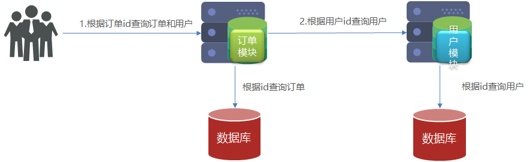

# 2 服务拆分与远程调用

## 2.1	服务拆分的注意事项

##### 单一职责原则

微服务需要根据业务模块拆分，做到单一职责,不同微服务，不要重复开发相同业务。

<br>

##### 数据独立

不要访问其它微服务的数据库，不同微服务都应该有自己独立的数据库。

<br>

##### 面向服务

将自己的业务暴露为接口，供其它微服务调用。

<br>

---

<div STYLE="page-break-after: always;">
    <br>
    <br>
    <br>
    <br>
    <br>
</div>
## 2.2	远程调用

##### 服务调用关系

- **服务提供者**：一次业务中，被其它微服务调用的服务。（提供接口给其它微服务）

- **服务消费者**：一次业务中，调用其它微服务的服务。（调用其它微服务提供的接口）

提供者与消费者角色其实是**相对**的，且一个服务可以同时是服务提供者和服务消费者。

<br>

##### 示例1——根据订单id查询订单功能

###### 源代码与 SQL 文件地址

[eg_1](attachment\eg_1)

###### 需求

根据订单 id 查询订单的同时，把订单所属的用户信息一起返回。



###### 步骤

1. 在 `order-service` 的 `OrderApplication` 中注册 `RestTemplate`

   ```java
   @MapperScan("cn.itcast.order.mapper")
   @SpringBootApplication
   public class OrderApplication {
   
       public static void main(String[] args) {
           SpringApplication.run(OrderApplication.class, args);
       }
   
       @Bean
       public RestTemplate restTemplate(){
           return new RestTemplate();
       }
   }
   ```

2. 在`order-service` 中的 `OrderService` 中注入 `RestTemplate`

   ```java
   @Service
   public class OrderService {
   
       @Autowired
       private OrderMapper orderMapper;
   
       //依赖注入 RestTemplate
       @Autowired
       private RestTemplate restTemplate;
   
       ...
   }
   ```

3. 修改 `order-service` 中的 `OrderService` 的 `queryOrderById` 方法，服务远程调用 `RestTemplate`

   ```php
       public Order queryOrderById(Long orderId) {
           // 1.查询订单
           Order order = orderMapper.findById(orderId);
   
           // TODO 2.查询用户
           String url = "http://localhost:8081/user/" +  order.getUserId();
           User user = restTemplate.getForObject(url, User.class)    ;
   
           // 3.封装user信
           order.setUser(user);
   
           // 4.返回
           return order;
       }
   ```

<br>

---

<div STYLE="page-break-after: always;">
    <br>
    <br>
    <br>
    <br>
    <br>
</div>