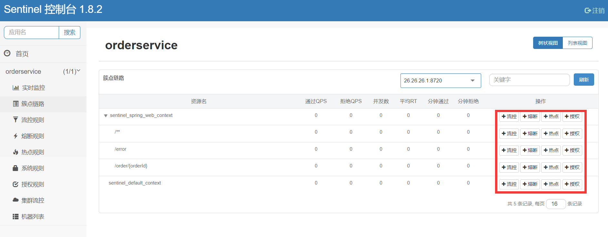
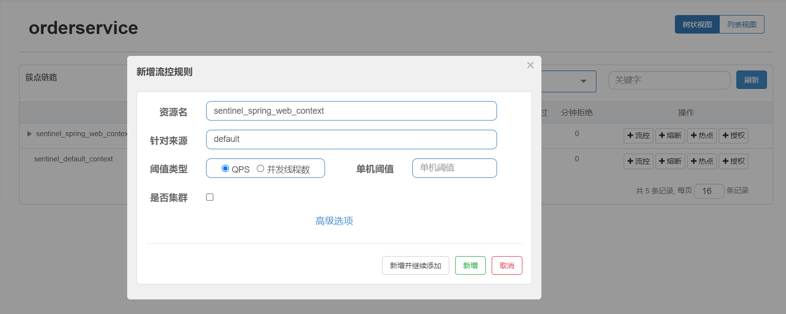
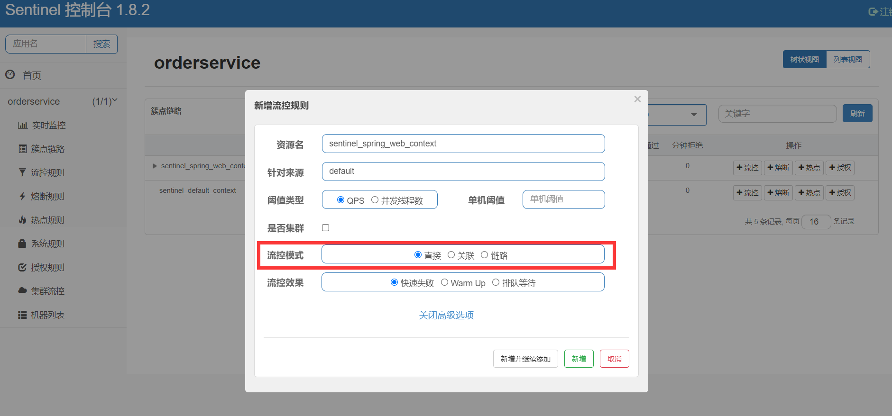
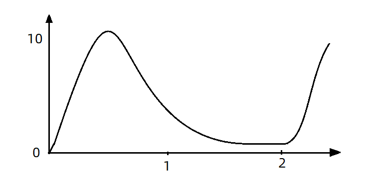
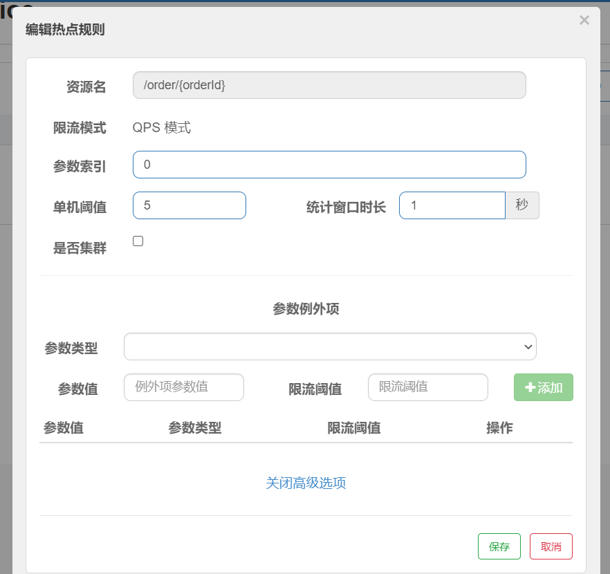

# 8	Sentinel 微服务保护

## 8.1	Sentinel 概述

##### 什么是 Sentinel

Sentinel是阿里巴巴开源的一款微服务流量控制组件。它具有一下特征：

- **丰富的应用场景**：Sentinel 承接了阿里巴巴近 10 年的双十一大促流量的核心场景，例如秒杀（即突发流量控制在系统容量可以承受的范围）、消息削峰填谷、集群流量控制、实时熔断下游不可用应用等。
- **完备的实时监控**：Sentinel 同时提供实时的监控功能。您可以在控制台中看到接入应用的单台机器秒级数据，甚至 500 台以下规模的集群的汇总运行情况。
- **广泛的开源生态**：Sentinel 提供开箱即用的与其它开源框架/库的整合模块，例如与 Spring Cloud、Dubbo、gRPC 的整合。您只需要引入相应的依赖并进行简单的配置即可快速地接入 Sentinel。
- **完善的** **SPI** **扩展点**：Sentinel 提供简单易用、完善的 SPI 扩展接口。您可以通过实现扩展接口来快速地定制逻辑。例如定制规则管理、适配动态数据源等。

<br>

----

<div STYLE="page-break-after: always;">
    <br>
	<br>
	<br>
	<br>
	<br>
</div>
## 8.2	Sentinel 下载、安装与基本使用

##### 下载

https://github.com/alibaba/Sentinel/releases

##### 安装

下载 jar 包后移动到任意非中文目录即可。

<br>

##### 运行

在 jar 包目录下执行一下命令：

```shell
java -jar sentinel-dashboard-1.8.2.jar
```

<br>

##### 修改基本配置

如果要修改Sentinel的默认端口、账户、密码，可以通过下列配置：

| 配置项                           | 默认值   | 说明       |
| -------------------------------- | -------- | ---------- |
| server.port                      | 8080     | 服务端口   |
| sentinel.dashboard.auth.username | sentinel | 默认用户名 |
| sentinel.dashboard.auth.password | sentinel | 默认密码   |

###### 例——修改端口

```shell
java -Dserver.port=9090 -jar sentinel-dashboard-1.8.2.jar
```

<br>

##### 访问 sentinel 控制台

访问 http://localhost:8080[^8.2-1]可以查看 sentinel 控制台，默认账号-密码为 `sentinel-sentinel`。

<br>

---

[^8.2-1]: sentinel 默认端口号，建议修改

<div STYLE="page-break-after: always;">
    <br>
	<br>
	<br>
	<br>
	<br>
</div>
## 8.3	微服务整合 Sentinel

##### 步骤

1. 在微服务中引入 sentinel 依赖

```xml
<!--sentinel-->
<dependency>
    <groupId>com.alibaba.cloud</groupId> 
    <artifactId>spring-cloud-starter-alibaba-sentinel</artifactId>
</dependency>
```

2. 修改 application.yaml 文件，添加下面内容：

```yaml
server:
  port: 8088
spring:
  cloud: 
    sentinel:
      transport:
        dashboard: localhost:8080
```

3. 开启微服务，并对微服务发送一次请求。
4. 打开 Sentinel 控制台，查看效果。

<br>

---

<div STYLE="page-break-after: always;">
    <br>
	<br>
	<br>
	<br>
	<br>
</div>

## 8.4	簇点链路

##### 什么是簇点链路

当请求进入微服务时，首先会访问 DispatcherServlet，然后进入Controller、Service、Mapper，这样的一个调用链就叫做 **簇点链路**。

<br>

##### 资源

簇点链路中被监控的每一个接口就是一个 **资源**。

默认情况下 sentinel 会监控 SpringMVC 的每一个端点（Endpoint，也就是 controller 中的方法），因此 SpringMVC 的每一个端点（Endpoint）就是调用链路中的一个资源。

<br>

##### Sentinel 设置簇点链路规则



流控、熔断等都是针对簇点链路中的资源来设置的，因此我们可以点击对应资源后面的按钮来设置规则：

- 流控：流量控制
- 降级：降级熔断
- 热点：热点参数限流，是限流的一种
- 授权：请求的权限控制

<br>

---

<div STYLE="page-break-after: always;">
    <br>
	<br>
	<br>
	<br>
	<br>
</div>

## 8.5	流量控制

### 8.5.1	使用 Sentinel 实现流量控制

##### 基本步骤

1. 在 Sentinel 控制台中选择微服务，打开粗点链路。
2. 选择流控。


3. 填写表单。



注意，选择阈值类型为 QPS 后，单机阈值的单位是 `次/秒`，设置单机阈值为1，即每秒只允许1次请求，超出的请求会被拦截并报错。

<br>

----

<div STYLE="page-break-after: always;">
    <br>
	<br>
	<br>
	<br>
	<br>
</div>

### 8.5.2	流控模式

##### 流控模式简介

在添加限流规则时，点击高级选项，可以选择三种**流控模式**：

- 直接：统计当前资源的请求，触发阈值时对当前资源直接限流，也是默认的模式。
- 关联：统计与当前资源相关的另一个资源，触发阈值时，对当前资源限流。
- 链路：统计从指定链路访问到本资源的请求，触发阈值时，对指定链路限流。



<br>

##### 关联模式

统计与当前资源相关的另一个资源，触发阈值时，对当前资源限流。


###### 说明

当 `/write` 资源访问量触发阈值时，就会 **对 `/read` 资源限流**，避免影响 `/write` 资源。

###### 适用场景

满足下面条件可以使用关联模式：

1. 两个有竞争关系的资源；
2. 其中一个优先级较高，另一个优先级较低。

###### 示例

用户支付时需要修改订单状态，同时用户要查询订单。查询和修改操作会争抢数据库锁，产生竞争。业务需求是优先支付和更新订单的业务，因此当修改订单业务触发阈值时，需要对查询订单业务限流。

1. 在 `OrderController` 新建两个端点： `/order/query` 和 `/order/update`，无需实现业务。

```java
@GetMapping("/query")
public String queryOrder() {
    return "查询订单成功";
}

@GetMapping("/update")
public String updateOrder() {
    return "更新订单成功";
}
```

2. 配置流控规则，当 `/order/update` 资源被访问的 QPS 超过 5 时，对 `/order/query` 请求限流。
3. 重启服务，为 `/order/query` 配置流控规则。


4. 测试，发送 `/order/update` 请求到达阈值，`/order/query` 被限流，在浏览器中访问 `/order/query`，返回如下信息：

```
Blocked by Sentinel (flow limiting)
```

<br>

##### 链路模式

只针对从指定链路访问到本资源的请求做统计，判断是否超过阈值。

例如，假设有两条请求链路：

- /test1 --> /common

- /test2 --> /common

如果只希望限制从 `/test2` 进入到 `/common` 的请求，则可以这样配置：


###### 示例

有查询订单和创建订单业务，两者都需要查询商品。针对从查询订单进入到查询商品的请求统计，并设置限流。

1. 在 order-service 服务中，给 OrderService 类添加一个 queryGoods 方法

```java
public void queryGoods(){
    System.err.println("查询商品");
}
```

2. `/order/query` 端点的业务逻辑

```java
@GetMapping("/query")
public String queryOrder() {
    // 查询商品
    orderService.queryGoods();
    // 查询订单
    System.out.println("查询订单");
    return "查询订单成功";
}
```

3. `/order/save` 端点，模拟新增订单

```java
@GetMapping("/save")
public String saveOrder() {
    // 查询商品
    orderService.queryGoods();
    // 查询订单
    System.err.println("新增订单");
    return "新增订单成功";
}
```

4. 给 OrderService 的 queryGoods 方法添加 @SentinelResource 注解[^8.5.2-1]。

```java
@SentinelResource("goods")
public void queryGoods(){
    System.err.println("查询商品");
}
```

5. 链路模式中，是对不同来源的两个链路做监控。但是 sentinel 默认会给进入 SpringMVC 的所有请求设置同一个 root 资源，这会导致链路模式失效。我们需要关闭这种对 SpringMVC 的 **资源聚合**，修改 order-service 服务的 application.yml 文件：

```yaml
spring:
  cloud:
    sentinel:
      web-context-unify: false # 关闭context整合
```

6. 重启服务后，访问 /order/query 和 /order/save，可以查看到 sentinel 的簇点链路规则中，出现了新的资源。
7. 点击 goods 资源后面的流控按钮，在弹出的表单中填写下面信息：


8. **测试**。

<br>

---

[^8.5.2-1]: 默认情况下，OrderService 中的方法是不被 Sentinel 监控的，需要我们自己通过注解来标记要监控的方法。


<div STYLE="page-break-after: always;">
    <br>
	<br>
	<br>
	<br>
	<br>
</div>

### 8.5.3	流控效果

##### 流控效果简介

在流控的高级选项中，还有一个流控效果选项：


流控效果是指请求达到流控阈值时应该采取的措施，包括三种：

- **快速失败**：达到阈值后，新的请求会被立即拒绝并抛出 FlowException 异常。是默认的处理方式。

- **warm up**：预热模式，对超出阈值的请求同样是拒绝并抛出异常。但这种模式阈值会动态变化，从一个较小值逐渐增加到最大阈值。

- **排队等待**：让所有的请求按照先后次序排队执行，两个请求的间隔不能小于指定时长

<br>

##### warm up

阈值一般是一个微服务能承担的最大QPS，但是一个服务刚刚启动时，一切资源尚未初始化（**冷启动**），如果直接将 QPS 跑到最大值，可能导致服务瞬间宕机。

warm up也叫 **预热模式**，是应对服务冷启动的一种方案。请求阈值初始值是 `maxThreshold/coldFactor`，持续指定时长后，逐渐提高到 maxThreshold 值。而 coldFactor 的默认值是3。

例如，我设置QPS的 maxThreshold 为10，预热时间为5秒，那么初始阈值就是 10/3 ，也就是3，然后在5秒后逐渐增长到10.


<br>

##### 排队等待

当请求超过 QPS 阈值时，快速失败和 warm up 会 **拒绝新的请求并抛出异常**。

而排队等待则是让所有请求进入一个队列中，然后按照阈值允许的时间间隔依次执行。后来的请求必须等待前面执行完成，如果请求预期的等待时间超出最大时长，则会被拒绝。

###### 工作原理

假设 QPS = 5，意味着每 200ms 处理一个队列中的请求；timeout = 2000，意味着 **预期等待时长** [^8.5.3-1]超过 2000ms 的请求会被拒绝并抛出异常。

现在，第1秒同时接收到10个请求，但第2秒只有1个请求，此时QPS的曲线这样的：



如果使用队列模式做流控，所有进入的请求都要排队，以固定的200ms的间隔执行，QPS会变的很平滑：


平滑的 QPS 曲线，对于服务器来说是更友好的。

<br>

---

[^8.5.3-1]: 比如现在一下子来了 12  个请求，因为每 200ms 执行一个请求，那么第 6 个请求的**预期等待时长** =  200 * （6 - 1） = 1000ms，第12个请求的预期等待时长 = 200 * （12-1） = 2200ms。

<div STYLE="page-break-after: always;">
    <br>
	<br>
	<br>
	<br>
	<br>
</div>

### 8.5.4	热点参数限流

##### 什么是热点参数限流

热点即经常访问的数据。很多时候我们希望统计某个热点数据中访问频次最高的 Top K 个数据，并对其访问进行限制。比如：

- 商品 ID 为参数，统计一段时间内最常购买的商品 ID 并进行限制。
- 用户 ID 为参数，针对一段时间内频繁访问的用户 ID 进行限制。

热点参数限流会统计传入参数中的热点参数，并根据配置的限流阈值与模式，对包含热点参数的资源调用进行限流。热点参数限流可以看做是一种特殊的流量控制，仅对包含热点参数的资源调用生效。

例如，一个根据 id 查询商品的接口：


访问 /goods/{id} 的请求中，id参数值会有变化，热点参数限流会根据参数值分别统计QPS，统计结果：


当 id=1 的请求触发阈值被限流时，id值不为 1 的请求不受影响。

<br>

##### 配置热点参数限流

1. 在需要配置热点参数限流的方法（资源）上添加 `@SentinelResource` 注解：

```java
    @SentinelResource("hot")
    @GetMapping("/test/{orderId}")
    public Long SentinelTest(@PathVariable("orderId") Long orderId) {

        System.out.println(orderId);
        return orderId;
    }
```

2. 在 Sentinel 控制台添加热点规则
   - **资源名**：在 `@SentinelResource` 注解中配置的资源名。
   - **限流模式** 只有 QPS 模式（这才叫热点）。
   - **参数索引** 代表使用 `@SentinelResource` 注解的方法的参数，0代表第一个参数，1代表第二个参数。
   - **单机阀值以及统计窗口时长** 表示在此窗口时间超过阀值就限流。


3. 测试。

<br>

##### 热点参数限流的高级选项

在实际开发中，可能部分商品是热点商品，例如秒杀商品，我们希望这部分商品的 QPS 限制与其它商品不一样，要允许很多人访问。这就需要配置热点参数限流的高级选项了：




这里的含义是对 0 号的 long 类型参数做统计，每 1 秒相同参数的 QPS 不能超过5，有两个例外：

- 如果参数值是100，则每1秒允许的QPS为10
- 如果参数值是101，则每1秒允许的QPS为15

<br>

---

<div STYLE="page-break-after: always;">
    <br>
	<br>
	<br>
	<br>
	<br>
</div>

## 8.6	降级和隔离

### 8.6.1	FeignClient 整合 Sentinel

##### FeignClient 为什么要整合 Sentinel

SpringCloud 中，微服务调用都是通过Feign来实现的，因此要进行客户端保护必须整合Feign和Sentinel。

<br>

##### 修改配置，开启 sentinel 功能

修改 OrderService 的 application.yml 文件，开启 Feign 的 Sentinel 功能：

```yaml
feign:
  sentinel:
    enabled: true # 开启feign对sentinel的支持
```

<br>

---

<div STYLE="page-break-after: always;">
    <br>
	<br>
	<br>
	<br>
	<br>
</div>

### 8.6.2	编写失败降级逻辑

##### 失败降级逻辑

业务失败后，不能直接报错，而应该返回用户一个友好提示或者默认结果，这个就是失败降级逻辑。

<br>

##### 编写失败降级逻辑的两种方式

给 FeignClient 编写失败降级逻辑有两种方式：

1. FallbackClass，缺点是无法对远程调用的异常做处理
2. FallbackFactory，可以对远程调用的异常做处理，一般选择这种方式。

<br>

##### 例——使用 FallbackFactory 实现失败降级处理

1. 在 feing-api 项目中的 clients 类下创建 fallback 包，在 fallback 包中定义类，实现FallbackFactory

```java
package cn.itcast.feign.clients.fallback;

import cn.itcast.feign.clients.UserClient;
import cn.itcast.feign.pojo.User;
import feign.hystrix.FallbackFactory;
import lombok.extern.slf4j.Slf4j;

@Slf4j
public class UserClientFallbackFactory implements FallbackFactory<UserClient> {
    @Override
    public UserClient create(Throwable throwable) {
        return new UserClient() {
            @Override
            public User findById(Long id) {
                log.error("查询用户异常", throwable);
                return new User();
            }
        };
    }
}

```

2. 在 feing-api 项目中的 DefaultFeignConfiguration 类中将 UserClientFallbackFactory 注册为一个 Bean：

```java
@Bean
public UserClientFallbackFactory userClientFallbackFactory(){
    return new UserClientFallbackFactory();
}
```

3. 在 feing-api 项目中的 UserClient 接口中使用 UserClientFallbackFactory：

```java
import cn.itcast.feign.clients.fallback.UserClientFallbackFactory;
import cn.itcast.feign.pojo.User;
import org.springframework.cloud.openfeign.FeignClient;
import org.springframework.web.bind.annotation.GetMapping;
import org.springframework.web.bind.annotation.PathVariable;

@FeignClient(value = "userservice", fallbackFactory = UserClientFallbackFactory.class)
public interface UserClient {

    @GetMapping("/user/{id}")
    User findById(@PathVariable("id") Long id);
}
```

4. 重启后，访问一次订单查询业务，然后查看sentinel控制台，可以看到新的簇点链路。

<br>

---

<div STYLE="page-break-after: always;">
    <br>
	<br>
	<br>
	<br>
	<br>
</div>

### 8.6.3	线程隔离（舱壁模式）

##### 线程隔离的实现方式

线程隔离有两种方式实现：

- 线程池隔离
- 信号量隔离（Sentinel默认采用）

- **线程池隔离**：给每个服务调用业务分配一个线程池，利用线程池本身实现隔离效果。
- **信号量隔离**：

<br>

##### 线程池隔离

给每个服务调用业务分配一个线程池，利用线程池本身实现隔离效果。

###### 优点

- 轻量级，无额外开销

###### 缺点

- 不支持主动超时
- 不支持异步调用 

###### 适用场景

- 高频调用
- 高扇出[^8.6.3-1]

<br>

##### 信号量隔离

不创建线程池，而是计数器模式，记录业务使用的线程数量，达到信号量上限时，禁止新的请求。

###### 优点

- 支持主动超时
- 支持异步调用 

###### 缺点

- 线程的额外开销比较大

###### 适用场景

- 低扇出

<br>

##### sentinel 的线程隔离

在添加限流规则时，可以选择两种阈值类型：


- QPS：就是每秒的请求数，在快速入门中已经演示过
- 线程数：是该资源能使用用的tomcat线程数的最大值。也就是通过限制线程数量，实现**线程隔离**（舱壁模式）。

###### 例

给 order-service 服务中的 UserClient 的查询用户接口设置流控规则，线程数不能超过 2。然后利用 jemeter 测试。

1. 选择 feign 接口后面的流控按钮，填写表单：


2. 一次性发送 10 个请求，有较大概率并发线程数超过2，而超出的请求会走之前定义的失败降级逻辑。


3. 查看运行结果。


虽然结果都是通过了，不过部分请求得到的响应是降级返回的null信息。

<br>

---

[^8.6.3-1]: 该模块直接调用的下级模块的个数。

<div STYLE="page-break-after: always;">
    <br>
	<br>
	<br>
	<br>
	<br>
</div>

### 8.6.4	熔断降级

##### 熔断降级的实现原理

熔断降级是解决雪崩问题的重要手段。其思路是由 **断路器** 统计服务调用的异常比例、慢请求比例，如果超出阈值则会 **熔断** 该服务。即拦截访问该服务的一切请求；而当服务恢复时，断路器会放行访问该服务的请求。

<br>

##### 状态机

断路器控制熔断和放行是通过状态机来完成的：


状态机包括三个状态：

- **closed**：关闭状态，断路器放行所有请求，并开始统计异常比例、慢请求比例。超过阈值则切换到open状态
- **open**：打开状态，服务调用被 **熔断**，访问被熔断服务的请求会被拒绝，快速失败，直接走降级逻辑。Open 状态 5 秒后会进入 half-open 状态
- **half-open**：半开状态，放行一次请求，根据执行结果来判断接下来的操作。
  - 请求成功：则切换到 closed 状态
  - 请求失败：则切换到 open 状态

<br>

##### 断路器熔断策略

断路器熔断策略有三种：

- 慢调用
- 异常比例
- 异常数

<br>

##### 慢调用

业务的响应时长（RT）大于指定时长的请求认定为慢调用请求。在指定时间内，如果请求数量超过设定的最小数量，慢调用比例大于设定的阈值，则触发熔断。

###### 设置慢调用


- 设置 RT 超过 500ms 的调用是慢调用
- 统计最近 10000ms 内的请求，如果请求量超过10次，并且慢调用比例不低于0.5，则触发熔断。
- 熔断时长为5秒。然后进入 half-open 状态，放行一次请求做测试。

###### 例

给 UserClient 的查询用户接口设置降级规则，慢调用的 RT 阈值为 50ms，统计时间为 1 秒，最小请求数量为 5，失败阈值比例为 0.4，熔断时长为 5。

1. 修改 user-service中 的 `/user/{id}` 这个接口的业务。通过休眠模拟一个延迟时间：

```java
@GetMapping("/{id}")
public User queryById(@PathVariable("id")Long id) throw InterruptedException{
	if(id == 1){
	//id = 1 时，休眠 60ms
	Thread.sleap(60);
	}
	return userService.queryBuId(id);
}
```

2. 给 feign 接口设置降级规则，设置超过 50ms 的请求都会被认为是慢请求：


3. 测试，访问http://localhost:8088/order/101，快速刷新5次。结果是触发了熔断，请求时长缩短至 5ms，快速失败了，并且走降级逻辑，返回的 null。
4. 访问：http://localhost:8088/order/102，竟然也被熔断了

<br>

##### 异常比例、异常数

统计指定时间内的调用，如果调用次数超过指定请求数，并且出现异常的比例达到设定的比例阈值（或超过指定异常数），则触发熔断。

###### 设置异常比例


统计最近 1000ms 内的请求，如果请求量超过 10 次，并且异常比例不低于 0.4，则触发熔断。

###### 设置异常数


统计最近1000ms内的请求，如果请求量超过10次，并且异常比例不低于2次，则触发熔断。

<br>

###### 例

给 UserClient 的查询用户接口设置降级规则，统计时间为 1 秒，最小请求数量为 5，失败阈值比例为 0.4，熔断时长为 5s

1. 首先，修改 user-service 中的 `/user/{id}` 这个接口的业务。手动抛出异常，以触发异常比例的熔断：

```java
@GetMapping("/{id}")
public User queryById(@PathVariable("id")Long id) throw InterruptedException{
	if(id == 1){
	//id = 1 时，休眠 60ms
	Thread.sleap(60);
	}else if(id == 2){
		throw new RuntimeException("故意抛出异常，触发异常比例熔断");
	}
	return userService.queryBuId(id);
}
```

2. 给 feign 接口设置降级规则，在5次请求中，只要异常比例超过0.4，也就是有2次以上的异常，就会触发熔断：


3. 访问：http://localhost:8088/order/102，快速刷新5次，触发熔断。
4. 访问：http://localhost:8088/order/103，发现也被熔断了。

<br>

---

<div STYLE="page-break-after: always;">
    <br>
	<br>
	<br>
	<br>
	<br>
</div>

## 8.7	授权规则

##### 授权规则模式

授权规则可以对调用方的来源做控制，有白名单和黑名单两种方式。

- 白名单：来源（origin）在白名单内的调用者允许访问
- 黑名单：来源（origin）在黑名单内的调用者不允许访问

<br>

##### 设置授权规则

点击 Sentinel 左侧菜单的授权，可以看到授权规则：


- 资源名：就是受保护的资源，例如/order/{orderId}
- 流控应用：是来源者的名单，
  - 如果是勾选白名单，则名单中的来源被许可访问。
  - 如果是勾选黑名单，则名单中的来源被禁止访问。

举例来说，我们允许请求从 gateway 到 order-service，不允许浏览器访问 order-service，那么白名单中就要填写 **网关的来源名称（origin）**。

<br>

##### 获取 origin

Sentinel 通过 RequestOriginParser 这个接口的 parseOrigin 来获取请求的来源。

```java
public interface RequestOriginParser {
    /**
     * 从请求request对象中获取origin，获取方式自定义
     */
    String parseOrigin(HttpServletRequest request);
}
```

- 这个方法的作用就是从 request 对象中，获取请求者的origin值并返回。**默认情况下，sentinel 不管请求者从哪里来，返回值永远是 default**，也就是说一切请求的来源都被认为是一样的值 default。

###### 自定义 RequestOriginParser 接口的实现

通过自定义该接口的实现，让 **不同的请求，返回不同的origin**。

1. 在 order-service 服务中，我们定义一个RequestOriginParser的实现类：

```java
package cn.itcast.order.sentinel;

import com.alibaba.csp.sentinel.adapter.spring.webmvc.callback.RequestOriginParser;
import org.springframework.stereotype.Component;
import org.springframework.util.StringUtils;

import javax.servlet.http.HttpServletRequest;

@Component
public class HeaderOriginParser implements RequestOriginParser {
    @Override
    public String parseOrigin(HttpServletRequest request) {
        // 1.获取请求头
        String origin = request.getHeader("origin");
        // 2.非空判断
        if (StringUtils.isEmpty(origin)) {
            origin = "blank";
        }
        return origin;
    }
}
```

2. 既然获取请求 origin 的方式是从 reques-header 中获取 origin 值，我们必须让 **所有从 gateway 路由到微服务的请求都带上 origin 头**。这通过 GatewayFilter 实现。修改 gateway 服务中的 application.yml，添加一个 defaultFilter：

```yaml
spring:
  cloud:
    gateway:
      default-filters:
        - AddRequestHeader=origin,gateway #这样从 gateway 路由的所有请求都会带上origin头，值为 gateway。而从其它地方到达微服务的请求则没有这个头。
      routes:
       # ...略
```

3. 添加一个授权规则，放行 origin 值为 gateway 的请求。


4. 测试，直接访问微服务，请求被拦截，通过网关访问，不受影响。

<br>

##### 自定义异常结果

如果要自定义异常时的返回结果，需要实现 BlockExceptionHandler 接口：

```
public interface BlockExceptionHandler {
    /**
     * 处理请求被限流、降级、授权拦截时抛出的异常：BlockException
     */
    void handle(HttpServletRequest request, HttpServletResponse response, BlockException e) throws Exception;
}
```

这个方法有三个参数：

- HttpServletRequest request：request对象
- HttpServletResponse response：response对象
- BlockException e：被sentinel拦截时抛出的异常

这里的BlockException包含多个不同的子类：

| **异常**             | **说明**           |
| -------------------- | ------------------ |
| FlowException        | 限流异常           |
| ParamFlowException   | 热点参数限流的异常 |
| DegradeException     | 降级异常           |
| AuthorityException   | 授权规则异常       |
| SystemBlockException | 系统规则异常       |

###### 例

1. 在 order-service 定义一个自定义异常处理类：

```java
package cn.itcast.order.sentinel;

import com.alibaba.csp.sentinel.adapter.spring.webmvc.callback.BlockExceptionHandler;
import com.alibaba.csp.sentinel.slots.block.BlockException;
import com.alibaba.csp.sentinel.slots.block.authority.AuthorityException;
import com.alibaba.csp.sentinel.slots.block.degrade.DegradeException;
import com.alibaba.csp.sentinel.slots.block.flow.FlowException;
import com.alibaba.csp.sentinel.slots.block.flow.param.ParamFlowException;
import org.springframework.stereotype.Component;

import javax.servlet.http.HttpServletRequest;
import javax.servlet.http.HttpServletResponse;

@Component
public class SentinelExceptionHandler implements BlockExceptionHandler {
    @Override
    public void handle(HttpServletRequest request, HttpServletResponse response, BlockException e) throws Exception {
        String msg = "未知异常";
        int status = 429;

        if (e instanceof FlowException) {
            msg = "请求被限流了";
        } else if (e instanceof ParamFlowException) {
            msg = "请求被热点参数限流";
        } else if (e instanceof DegradeException) {
            msg = "请求被降级了";
        } else if (e instanceof AuthorityException) {
            msg = "没有权限访问";
            status = 401;
        }

        response.setContentType("application/json;charset=utf-8");
        response.setStatus(status);
        response.getWriter().println("{\"msg\": " + msg + ", \"status\": " + status + "}");
    }
}
```

2. 重启测试，在不同场景下，会返回不同的异常消息。

<br>

----

<div STYLE="page-break-after: always;">
    <br>
	<br>
	<br>
	<br>
	<br>
</div>

## 8.8	规则持久化

##### sentinel 规则默认是内存存储

sentinel 的所有规则默认是内存存储，重启后所有规则都会丢失。在生产环境下，我们必须确保这些规则的持久化，避免丢失。

<br>

##### 规则管理模式

规则是否能持久化，取决于规则管理模式，sentinel支持三种规则管理模式：

- 原始模式：Sentinel 的默认模式，将规则保存在内存，重启服务会丢失。
- pull模式
- push模式

<br>

##### pull 模式

控制台将配置的规则推送到 Sentinel 客户端，而客户端会将配置规则保存在本地文件或数据库中。以后会定时去本地文件或数据库中查询，更新本地规则。


<br>

##### push 模式

控制台将配置规则推送到远程配置中心，例如 Nacos。Sentinel 客户端监听 Nacos，获取配置变更的推送消息，完成本地配置更新。


<br>

##### 例——实现 push 模式

1. 在order-service中引入sentinel监听nacos的依赖


```xml
<dependency>
    <groupId>com.alibaba.csp</groupId>
    <artifactId>sentinel-datasource-nacos</artifactId>
</dependency>
```

2. 在order-service中的application.yml文件配置nacos地址及监听的配置信息：

```yaml
spring:
  cloud:
    sentinel:
      datasource:
        flow:
          nacos:
            server-addr: localhost:8848 # nacos地址
            dataId: orderservice-flow-rules
            groupId: SENTINEL_GROUP
            rule-type: flow # 还可以是：degrade、authority、param-flow
```

3. SentinelDashboard默认不支持nacos的持久化，**需要修改源码**。
4. 下载 sentinel 源码包后解压。
5. 在 sentinel-dashboard 源码的 pom 文件中，nacos 的依赖默认的 scope 是 test，只能在测试时使用，这里要去除。

```xml
<!--修改前-->
<dependency>
    <groupId>com.alibaba.csp</groupId>
    <artifactId>sentinel-datasource-nacos</artifactId>
    <scope>test</scope><!-- 将sentinel-datasource-nacos依赖的scope去掉 -->
</dependency>

<!--修改后-->
<dependency>
    <groupId>com.alibaba.csp</groupId>
    <artifactId>sentinel-datasource-nacos</artifactId>
</dependency>
```

6. 在 sentinel-dashboard 的 test 包下，已经编写了对 nacos 的支持，我们需要将其拷贝到 main 下：


7. 修改测试代码中的 NacosConfig 类，修改其中的 nacos 地址，让其读取 application.properties 中的配置：


8. 在 sentinel-dashboard 的 application.properties 中添加 nacos 地址配置：

```yaml
nacos.addr=localhost:8848
```

9. 修改com.alibaba.csp.sentinel.dashboard.controller.v2包下的FlowControllerV2类，让我们添加的Nacos数据源生效：


10. 修改前端页面，添加一个支持 nacos 的菜单。修改src/main/webapp/resources/app/scripts/directives/sidebar/目录下的sidebar.html文件。将其中的这部分注释打开：

    

    修改其中的文本：

    

11. 运行 IDEA 中的 maven 插件，编译和打包修改好的 Sentinel-Dashboard。

12. 启动，启动方式跟官方一样：

    ```sh
    java -jar sentinel-dashboard.jar
    ```

<br>

---

<div STYLE="page-break-after: always;">
    <br>
	<br>
	<br>
	<br>
	<br>
</div>

