# 1	微服务概述

## 1.1	服务架构的演变

##### 单体架构

将业务的所有功能集中在一个项目中开发，打成一个包部署。


###### 优点

1. 架构简单
2. 部署成本低

###### 缺点

1. 耦合度高（维护困难、升级困难）
2. 一旦宕机，所有的业务全部无法使用。

###### 适用场景

适合小型项目。

<br>

##### 集群架构

单机无法抗住的压力，最简单的办法就是水平拓展横向扩容了，这样，通过负载均衡把压力流量分摊到不同的机器上。


###### 优点

1. 暂时解决了单点下线导致整个服务不可用的问题。

###### 缺点

1. 随着业务的发展，在一个项目里维护所有的业务场景使开发和代码维护变得越来越困难。
2. 一个简单的需求改动都需要重新发布整个服务。
3. 代码的合并冲突也会变得越来越频繁。
4. 线上故障出现的可能性越大。

<br>

##### 分布式架构

根据业务功能对系统做拆分，每个业务功能模块作为独立项目开发，分开部署，称为一个服务。


###### 优点

1. 降低服务耦合。
2. 有利于服务升级和拓展。
3. 通过负载均衡把压力流量分摊到不同的机器上，暂时解决了单点宕机导致服务不可用的问题。

###### 缺点

1. 服务调用关系错综复杂。

###### 适用场景

适合大型互联网项目。

###### 分布式架构存在的问题

分布式架构虽然降低了服务耦合，但是服务拆分时也有很多问题需要思考：

- 服务拆分的粒度如何界定？
- 服务之间如何调用？
- 服务的调用关系如何管理？

为此，人们需要制定一套行之有效的**标准**来约束分布式架构。

<br>

---

<div STYLE="page-break-after: always;">
    <br>
    <br>
    <br>
    <br>
    <br>
</div>
## 1.2	微服务架构

##### 微服务的由来

微服务最早由 Martin Fowler 与 James Lewis 于 2014 年共同提出，微服务架构风格是一种使用一套小服务来开发单个应用的方式途径，每个服务运行在自己的进程中，并使用轻量级机制通信，通常是 HTTP API，这些服务基于业务能力构建，并能够通过自动化部署机制来独立部署，这些服务使用不同的编程语言实现，以及不同数据存储技术，并保持最低限度的集中式管理。 

<br>

##### 为什么需要微服务

在传统的 IT 行业软件大多都是各种独立系统的堆砌，这些系统的问题总结来说就是扩展性差，可靠性不高，维护成本高。到后面引入了 SOA 服务化，但是，由于 SOA 早期均使用了总线模式，这种总线模式是与某种技术栈强绑定的，比如：J2EE。这导致很多企业的遗留系统很难对接，切换时间太长，成本太高，新系统稳定性的收敛也需要一些时间。 

<br>

##### 微服务与单体架构区别

| 微服务                                                       | 单体架构                                               |
| ------------------------------------------------------------ | ------------------------------------------------------ |
| 微服务每个模块就相当于一个单独的项目，代码量明显减少，遇到问题也相对来说比较好解决。 | 单体架构所有的模块全都耦合在一块，代码量大，维护困难。 |
| 微服务每个模块都可以使用不同的存储方式（比如有的用redis，有的用mysql等），数据库也是单个模块对应自己的数据库。 | 单体架构所有的模块都共用一个数据库，存储方式比较单一。 |
| 微服务每个模块都可以使用不同的开发技术，开发模式更灵活。     | 单体架构所有的模块开发所使用的技术一样。               |


##### 微服务架构的特征

- **单一职责**：微服务拆分粒度更小，每一个服务都对应唯一的业务能力，做到单一职责。
- **自治**：团队独立、技术独立、数据独立，独立部署和交付。
- **面向服务**：服务提供统一标准的接口，与语言和技术无关。
- **隔离性强**：服务调用做好隔离、容错、降级，避免出现级联问题。

<br>

##### 微服务架构的本质

微服务的上述特性其实是在 

微服务，关键其实不仅仅是微服务本身，而是系统要提供一套基础的架构，这种架构使得微服务可以独立的部署、运行、升级，不仅如此，这个系统架构还让微服务与微服务之间在结构上“松耦合”，而在功能上则表现为一个统一的整体。这种所谓的“统一的整体”表现出来的是统一风格的界面，统一的权限管理，统一的安全策略，统一的上线过程，统一的日志和审计方法，统一的调度方式，统一的访问入口等等。即 **给分布式架构制定一个标准，进一步降低服务之间的耦合度，提供服务的独立性和灵活性。做到高内聚，低耦合**。因此，可以认为 **微服务** 是一种经过良好架构设计的 **分布式架构方案** 。

<br>

##### 微服务的目的

微服务的目的是有效的拆分应用，实现敏捷开发和部署 。

<br>

##### 微服务提倡的理念

微服务提倡的理念团队间应该是 inter-operate, not integrate 。inter-operate是定义好系统的边界和接口，在一个团队内全栈，让团队自治，原因就是因为如果团队按照这样的方式组建，将沟通的成本维持在系统内部，每个子系统就会更加内聚，彼此的依赖耦合能变弱，跨系统的沟通成本也就能降低。

<br>

##### 优缺点

- **优点**：与一般的分布式架构相比拆分粒度更小、服务更独立、耦合度更低。
- **缺点**：架构非常复杂，运维、监控、部署难度提高。

<br>

##### 什么样的项目不适合微服务

微服务可以按照业务功能本身的独立性来划分，如果系统提供的业务是非常底层的，如：操作系统内核、存储系统、网络系统、数据库系统等等，这类系统都偏底层，功能和功能之间有着紧密的配合关系，如果强制拆分为较小的服务单元，会让集成工作量急剧上升，并且这种人为的切割无法带来业务上的真正的隔离，所以无法做到独立部署和运行，也就不适合做成微服务了。

<br>

----

<div STYLE="page-break-after: always;">
    <br>
    <br>
    <br>
    <br>
    <br>
</div>
## 1.3	微服务技术栈与 Spring Cloud

##### 完整的微服务技术栈示意图

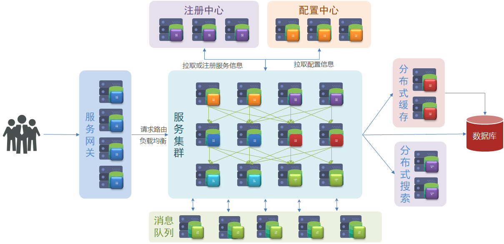


<br>

##### 完整的微服务技术栈可分为


<br>

##### 微服务开发框架

目前微服务的开发框架，最常用的有以下四个：

- **Spring Cloud**：http://projects.spring.io/spring-cloud（现在非常流行的微服务架构）
- **Dubbo**：http://dubbo.io
- Dropwizard：http://www.dropwizard.io （关注单个微服务的开发）
- Consul、etcd&etc.（微服务的模块）

<br>

##### Spring Cloud

微服务作为一种分布式架构方案，需要具体的技术栈落地实现。全球的互联网公司都在积极尝试自己的微服务落地方案。其中在 Java 领域最引人注目的就是 Spring Cloud 提供的方案了。

Spring Cloud 是微服务架构的 **一站式解决方案**，集成了各种优秀微服务功能组件，并基于SpringBoot实现了这些组件的自动装配，从而提供了良好的 **开箱即用** 体验，是目前国内使用最广泛的微服务框架。

Spring Cloud 是一系列框架的集合。它利用 Spring Boot 的开发便利性简化了分布式系统基础设施的开发，如服务发现、服务注册、配置中心、消息总线、负载均衡、 熔断器、数据监控等，都可以用 Spring Boot 的开发风格做到一键启动和部署。Spring 并没有重复制造轮子，它只是将目前各家公司开发的比较成熟、经得起实际考验的服务框架组合起来，通过 SpringBoot 风格进行再封装屏蔽掉了复杂的配置和实现原理，最终给开发者留出了一套简单易懂、易部署和易维护的分布式系统开发工具包

###### 官网地址

https://spring.io/projects/spring-cloud

###### 常见的组件包括

- 服务发现——Netflix Eureka（Nacos）
- 服务调用——Netflix Feign
- 熔断器——Netflix Hystrix
- 服务网关——Spring Cloud GateWay
- 分布式配置——Spring Cloud Config  （Nacos）
- 消息总线 —— Spring Cloud Bus （Nacos）


###### Spring Cloud 与 Spring Boot 的兼容关系

Spring Cloud 底层依赖于 Spring Boot，并且有版本的兼容关系。Spring Boot 是 Spring 的一套快速配置脚手架，可以基于Spring Boot 快速开发单个微服务，Spring Cloud是一个基于Spring Boot实现的开发工具；Spring Boot专注于快速、方便集成的单个微服务个体，Spring Cloud关注全局的服务治理框架； Spring Boot使用了默认大于配置的理念，很多集成方案已经帮你选择好了，能不配置就不配置，Spring Cloud很大的一部分是基于Spring Boot来实现，必须基于Spring Boot开发。可以单独使用Spring Boot开发项目，但是Spring Cloud离不开 Spring Boot。

###### Spring Cloud的版本

| Release Train                                                | Boot Version                          |
| :----------------------------------------------------------- | :------------------------------------ |
| [2020.0.x](https://github.com/spring-cloud/spring-cloud-release/wiki/Spring-Cloud-2020.0-Release-Notes) aka Ilford | 2.4.x, 2.5.x (Starting with 2020.0.3) |
| [Hoxton](https://github.com/spring-cloud/spring-cloud-release/wiki/Spring-Cloud-Hoxton-Release-Notes) | 2.2.x, 2.3.x (Starting with SR5)      |
| [Greenwich](https://github.com/spring-projects/spring-cloud/wiki/Spring-Cloud-Greenwich-Release-Notes) | 2.1.x                                 |
| [Finchley](https://github.com/spring-projects/spring-cloud/wiki/Spring-Cloud-Finchley-Release-Notes) | 2.0.x                                 |
| [Edgware](https://github.com/spring-projects/spring-cloud/wiki/Spring-Cloud-Edgware-Release-Notes) | 1.5.x                                 |
| [Dalston](https://github.com/spring-projects/spring-cloud/wiki/Spring-Cloud-Dalston-Release-Notes) | 1.5.x                                 |

Spring Cloud 版本分为：

- SNAPSHOT： 快照版本，随时可能修改
- M： MileStone，M1 表示第 1 个里程碑版本，一般同时标注 PRE，表示预览版版。
- SR： Service Release，SR1 表示第 1 个正式版本，一般同时标注 GA：(GenerallyAvailable),表示稳定版本。

<br>

##### Spring Cloud Alibaba

Spring Cloud Alibaba 是阿里巴巴提供的微服务开发一站式解决方案，是阿里巴巴开源中间件与 Spring Cloud 体系的融合。

<br>

##### 各种微服务技术框架之间的对比

|                | **Dubbo**           | **Spring Cloud**           | **Spring Cloud Alibaba**   |
| -------------- | ------------------- | -------------------------- | -------------------------- |
| 注册中心       | zookeeper、Redis    | Eureka、Consul             | Nacos、Eureka              |
| 服务远程调用   | Dubbo协议           | Feign（http协议）          | Dubbo、Feign               |
| 配置中心       | 无                  | Spring Cloud Config        | Spring Cloud Config、Nacos |
| 服务网关       | 无                  | Spring Cloud Gateway、Zuul | Spring Cloud Gateway、Zuul |
| 服务监控和保护 | dubbo-admin，功能弱 | Hystix                     | Sentinel                   |

<br>

##### 企业中常见的几种微服务技术框架

###### Spring Cloud + Feign

- 使用 Spring Cloud 技术栈
- 服务接口采用 Restful 风格
- 服务调用采用Feign方式

###### Spring Cloud Alibaba + Feign

- 使用 Spring Cloud Alibaba 技术栈
- 服务接口采用 Restful 风格
- 服务调用采用 Feign 方式

###### Spring Cloud Alibaba + Dubbo

- 使用 Spring Cloud Alibaba技术栈
- 服务接口采用 Dubbo 协议标准
- 服务调用采用 Dubbo 方式

###### Dubbo原始模式

- 基于 Dubbo 老旧技术体系
- 服务接口采用 Dubbo 协议标准
- 服务调用采用 Dubbo 方式

<br>

##### Spring Cloud调用接口过程

pring Cloud 在接口调用上，大致会经过如下几个组件配合：

**`Feign` ----->`Hystrix` —>`Ribbon` —>`Http Client``（apache http components 或者 Okhttp）`** 具体交互流程上，如下图所示：


1. **接口化请求调用**：当调用被`@FeignClient`注解修饰的接口时，在框架内部，将请求转换成Feign的请求实例`feign.Request`，交由Feign框架处理。
2. **Feign** ：转化请求Feign是一个http请求调用的轻量级框架，可以以Java接口注解的方式调用Http请求，封装了Http调用流程。
3. **Hystrix**：熔断处理机制 Feign的调用关系，会被Hystrix代理拦截，对每一个Feign调用请求，Hystrix都会将其包装成`HystrixCommand`,参与Hystrix的流控和熔断规则。如果请求判断需要熔断，则Hystrix直接熔断，抛出异常或者使用`FallbackFactory`返回熔断`Fallback`结果；如果通过，则将调用请求传递给`Ribbon`组件。
4. **Ribbon**：服务地址选择 当请求传递到`Ribbon`之后,`Ribbon`会根据自身维护的服务列表，根据服务的服务质量，如平均响应时间，Load等，结合特定的规则，从列表中挑选合适的服务实例，选择好机器之后，然后将机器实例的信息请求传递给`Http Client`客户端，`HttpClient`客户端来执行真正的Http接口调用；
5. **HttpClient** ：Http客户端，真正执行Http调用根据上层`Ribbon`传递过来的请求，已经指定了服务地址，则HttpClient开始执行真正的Http请求。

<br>

---

<div STYLE="page-break-after: always;">
    <br>
    <br>
    <br>
    <br>
    <br>
</div>
## 1.4	微服务通信


微服务化的拆分带来的好处和便利性是显而易见的，但是与此同时各个微服务之间的通信就需要考虑了。对于SOA、微服务化的架构而言，就对部署、运维、服务治理、链路追踪等等有了更高的要求。

对此

---

<div STYLE="page-break-after: always;">
    <br>
    <br>
    <br>
    <br>
    <br>
</div>

## 1.4	微服务保护

##### 服务雪崩

微服务中，服务间调用关系错综复杂，一个微服务往往依赖于多个其它微服务。服务雪崩就是**在微服务之间相互调用的过程中，因为调用链中的一个服务故障，引起整个链路都无法访问的情况**。

如果一个服务提供者发生了故障，依赖于该服务的部分业务也会被阻塞。此时，其它业务似乎不受影响。但是，阻塞业务的请求不会得到响应，**服务器的这个线程不会释放**，随着越来越多的用户请求到来，越来越多的线程会阻塞。服务器支持的线程和并发数有限，请求一直阻塞，会导致服务器资源耗尽，从而导致所有其它服务都不可用，那么当前服务也就不可用了。依赖于当前服务的其它服务随着时间的推移，最终也都会变的不可用，形成 **级联失败**，雪崩就发生了：


<br>

##### 解决雪崩问题的常见方式

解决雪崩问题的常见方式有四种：

1. 超时处理
2. 仓壁模式
3. 断路器
4. 限流

###### 超时处理

设定超时时间，请求超过一定时间没有响应就返回错误信息，不会无休止等待。


###### 仓壁模式

仓壁模式来源于船舱的设计。船舱都会被隔板分离为多个独立空间，当船体破损时，只会导致部分空间进入，将故障控制在一定范围内，避免整个船体都被淹没。


与此类似，我们可以限定每个业务能使用的线程数，避免耗尽整个服务器的资源，因此也叫线程隔离。


######  断路器

由 **断路器** 统计业务执行的异常比例，如果超出阈值则会 **熔断** 该业务，拦截访问该业务的一切请求。当发现访问服务的请求异常比例过高时，认为服务有导致雪崩的风险，会拦截访问服务的一切请求，形成熔断。


###### 限流

限制业务访问的 QPS，避免服务因流量的突增而故障。

注意，在解决服务雪崩的四种方案中，限流是避免服务因突发的流量而发生故障，是对微服务雪崩问题的 **预防**。

<br>

##### 服务保护技术对比

SpringCloud 支持多种服务保护技术：

- [Netfix Hystrix](https://github.com/Netflix/Hystrix)
- [Sentinel](https://github.com/alibaba/Sentinel)
- [Resilience4J](https://github.com/resilience4j/resilience4j)

早期比较流行的是 Hystrix 框架，但目前国内实用最广泛的还是阿里巴巴的 Sentinel 框架，这里我们做下对比：

|                | Sentinel                                       | *Hystrix                      |
| -------------- | ---------------------------------------------- | ----------------------------- |
| 隔离策略       | 信号量隔离                                     | 线程池隔离/信号量隔离         |
| 熔断降级策略   | 基于慢调用比例或异常比例                       | 基于失败比率                  |
| 实时指标实现   | 滑动窗口                                       | 滑动窗口（基于 RxJava）       |
| 规则配置       | 支持多种数据源                                 | 支持多种数据源                |
| 扩展性         | 多个扩展点                                     | 插件的形式                    |
| 基于注解的支持 | 支持                                           | 支持                          |
| 限流           | 基于 QPS，支持基于调用关系的限流               | 有限的支持                    |
| 流量整形       | 支持慢启动、匀速排队模式                       | 不支持                        |
| 系统自适应保护 | 支持                                           | 不支持                        |
| 控制台         | 开箱即用，可配置规则、查看秒级监控、机器发现等 | 不完善                        |
| 常见框架的适配 | Servlet、Spring Cloud、Dubbo、gRPC  等         | Servlet、Spring Cloud Netflix |

<br>

-----

<div STYLE="page-break-after: always;">
    <br>
    <br>
    <br>
    <br>
    <br>
</div>
## 1.5	分布式事务

##### 事务的 ACID 原则

- **原子性（Atomicity）**：事务中的所有操作，要么全部成功，要么全部失败。
- **一致性（Consistency）**：要保证数据库内部完整性约束、声明性约束。
- **隔离性（Isolation）**：对同一资源操作的事务不能同时发生。
- **持久性（Durability）**：对数据库做的一切修改将永久保存，不管是否出现故障。

<br>

##### CAP 定理

1998年，加州大学的计算机科学家 Eric Brewer 提出，分布式系统有三个指标：

- Consistency（一致性）：用户访问分布式系统中的任意节点，得到的数据必须一致。
- Availability（可用性）：用户访问集群中的任意健康节点，必须能得到响应，而不是超时或拒绝
- Partition tolerance （分区容错性）：因为网络故障或其它原因导致分布式系统中的部分节点与其它节点失去连接，形成独立分区。此时，，整个系统也要持续对外提供服务。

**理论上，分布式系统无法同时满足这三个指标**。分布式系统节点通过网络连接，一定会出现分区问题（P）。•当分区出现时，系统的一致性（C）和可用性（A）就无法同时满足。这个结论就叫做 CAP 定理。


<br>

##### BASE 理论

BASE 理论是对 CAP 的一种解决思路，包含三个思想：

- **Basically Available** **（基本可用）**：分布式系统在出现故障时，允许损失部分可用性，即保证核心可用。
- **Soft State（软状态）：**在一定时间内，允许出现中间状态，比如临时的不一致状态。
- **Eventually Consistent（最终一致性）**：虽然无法保证强一致性，但是在软状态结束后，最终达到数据一致。

<br>

##### 解决分布式事务问题

分布式事务最大的问题是各个子事务的一致性问题，因此可以借鉴 CAP 定理和 BASE 理论：

- **AP模式**：各子事务分别执行和提交，允许出现结果不一致，然后采用弥补措施恢复数据即可，**实现最终一致**。
- **CP模式**：各个子事务执行后互相等待，同时提交，同时回滚，达成 **强一致**。但事务等待过程中，**处于弱可用状态**。

<br>

##### 分布式事务模型


解决分布式事务，**各个子系统之间必须能感知到彼此的事务状态**，才能保证状态一致，因此需要一个事务协调者来协调每一个事务的参与者，即 **子系统事务**。

子系统事务，又称为分支事务；有关联的各个分支事务在一起称为 **全局事务**。

<br>

---

<div STYLE="page-break-after: always;">
    <br>
    <br>
    <br>
    <br>
    <br>
</div>

## 1.6	分布式缓存

---

<div STYLE="page-break-after: always;">
    <br>
    <br>
    <br>
    <br>
    <br>
</div>

## 1.7	微服务技术组件

##### 注册中心

###### 服务调用时会出现的问题

- 服务消费者该如何获取服务提供者的地址信息？
- 如果有多个服务提供者，消费者该如何选择？
- 消费者如何得知服务提供者的健康状态？

###### 解决方案


###### 常见的注册中心

- Eureka（原生，2.0遇到性能瓶颈，停止维护）
- Zookeeper（支持，专业的独立产品。例如：dubbo）
- Consul（原生，GO语言开发）
- Nacos

<br>

---

<div STYLE="page-break-after: always;">
    <br>
    <br>
    <br>
    <br>
    <br>
</div>
# 2 服务拆分与远程调用

## 2.1	服务拆分的注意事项

##### 单一职责原则

微服务需要根据业务模块拆分，做到单一职责,不同微服务，不要重复开发相同业务。

<br>

##### 数据独立

不要访问其它微服务的数据库，不同微服务都应该有自己独立的数据库。

<br>

##### 面向服务

将自己的业务暴露为接口，供其它微服务调用。

<br>

---

<div STYLE="page-break-after: always;">
    <br>
    <br>
    <br>
    <br>
    <br>
</div>
## 2.2	远程调用

##### 服务调用关系

- **服务提供者**：一次业务中，被其它微服务调用的服务。（提供接口给其它微服务）

- **服务消费者**：一次业务中，调用其它微服务的服务。（调用其它微服务提供的接口）

提供者与消费者角色其实是**相对**的，且一个服务可以同时是服务提供者和服务消费者。

<br>

##### 示例1——根据订单id查询订单功能

###### 源代码与 SQL 文件地址

[eg_1](attachment\eg_1)

###### 需求

根据订单 id 查询订单的同时，把订单所属的用户信息一起返回。

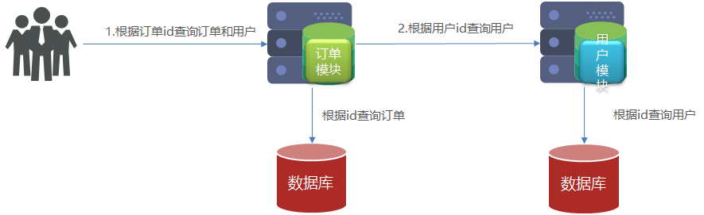

###### 步骤

1. 在 `order-service` 的 `OrderApplication` 中注册 `RestTemplate`

   ```java
   @MapperScan("cn.itcast.order.mapper")
   @SpringBootApplication
   public class OrderApplication {
   
       public static void main(String[] args) {
           SpringApplication.run(OrderApplication.class, args);
       }
   
       @Bean
       public RestTemplate restTemplate(){
           return new RestTemplate();
       }
   }
   ```

2. 在`order-service` 中的 `OrderService` 中注入 `RestTemplate`

   ```java
   @Service
   public class OrderService {
   
       @Autowired
       private OrderMapper orderMapper;
   
       //依赖注入 RestTemplate
       @Autowired
       private RestTemplate restTemplate;
   
       ...
   }
   ```

3. 修改 `order-service` 中的 `OrderService` 的 `queryOrderById` 方法，服务远程调用 `RestTemplate`

   ```php
       public Order queryOrderById(Long orderId) {
           // 1.查询订单
           Order order = orderMapper.findById(orderId);
   
           // TODO 2.查询用户
           String url = "http://localhost:8081/user/" +  order.getUserId();
           User user = restTemplate.getForObject(url, User.class)    ;
   
           // 3.封装user信
           order.setUser(user);
   
           // 4.返回
           return order;
       }
   ```

<br>

---

<div STYLE="page-break-after: always;">
    <br>
    <br>
    <br>
    <br>
    <br>
</div># 3	Eureka 注册中心

## 3.1	Eureka 概述

##### Eureka 的作用


###### 注册服务信息

服务提供者启动时向 Eureka 注册自己的信息，Eureka 保存这些信息，之后消费者会根据服务名称从 Eureka 拉取提供者信息。

###### 帮助选择服务提供者

如果有多个服务提供者，服务消费者会利用负载均衡算法，从服务列表中挑选一个。

###### 心跳监控

服务提供者会每隔 30 秒向 EurekaServer 发送心跳请求，报告健康状态。Eureka 会更新记录服务列表信息，心跳不正常的服务会被剔除。

<br>

##### Eureka 架构

在 Eureka 架构中，微服务角色有两类 EurekaServer 与 EurekaClient。

###### EurekaServer

服务端，注册中心，记录服务信息与心跳监控。

###### EurekaClient

EurekaClient 又分为 Provider 和 consumer[^3.1-1]。

- Provider：服务提供者，注册自己的信息到 EurekaServer，并每隔 30 秒向 EurekaServe r发送心跳。
- consumer：服务消费者，根据服务名称从 EurekaServer 拉取服务列表，基于服务列表做负载均衡，选中一个微服务后发起远程调用。

<br>

---

[^3.1-1]: 注意，因为每一个微服务都可能既是消费者又是提供者，所以这只是一个服务调用时出现的概念。

<div STYLE="page-break-after: always;">
    <br>
    <br>
    <br>
    <br>
    <br>
</div>

## 3.2	Eureka 实战

##### 搭建注册中心

1. 在已经导入 Spring Cloud 的父工程下，创建一个子模块，名为 eureka-server ：

   

   

   

2. 引入 Spring Cloud 为 eureka 提供的 starter 依赖

   ```xml
   <dependency>
       <groupId>org.springframework.cloud</groupId>
       <artifactId>spring-cloud-starter-netflix-eureka-server</artifactId>
   </dependency>
   ```

3. 给 eureka-server 服务编写一个启动类，一定要添加一个 `@EnableEurekaServer` 注解，开启 eureka 的注册中心功能：

   ```java
   package cn.itcast.eureka;
   
   import org.springframework.boot.SpringApplication;
   import org.springframework.boot.autoconfigure.SpringBootApplication;
   import org.springframework.cloud.netflix.eureka.server.EnableEurekaServer;
   
   @SpringBootApplication
   @EnableEurekaServer
   public class EurekaApplication {
       public static void main(String[] args) {
           SpringApplication.run(EurekaApplication.class, args);
       }
   }
   ```

4. 编写配置文件

   ```yml
   server:
     port: 10086
   spring:
     application:
       name: eureka-server
   eureka:
     client:
       service-url: 
         defaultZone: http://127.0.0.1:10086/eureka
   ```

5. 启动微服务，然后在浏览器访问：http://127.0.0.1:10086

<br>

##### 服务注册

1. 在 user-service[^3.2-1] 的 pom 文件中，引入下面的 eureka-client 依赖。

   ```
   <dependency>
       <groupId>org.springframework.cloud</groupId>
       <artifactId>spring-cloud-starter-netflix-eureka-client</artifactId>
   </dependency>
   ```

2. 在 user-service[^3.2-1] 中，修改 application.yml 文件，添加 **服务名称**以及 **eureka 地址**

   ```yaml
   spring:
     application:
       name: userservice #服务名称
   eureka:
     client:
       service-url:
         defaultZone: http://127.0.0.1:10086/eureka #eureka 地址
   ```

3. 为了演示一个服务有多个实例的场景，我们添加一个 SpringBoot 的启动配置，再启动一个 user-service

   

   

4. 启动两个 user-service 和一个 order-service 后，可以在 Eureka 管理界面看到

   

<br>

##### 服务发现

###### 前提条件

已经完成了服务注册。

###### 步骤

1. 在 order-service 项目的启动类 OrderApplication 中的 RestTemplate 上添加 **负载均衡** 注解

   ```java
   @MapperScan("cn.itcast.order.mapper")
   @SpringBootApplication
   public class OrderApplication {
   
       public static void main(String[] args) {
           SpringApplication.run(OrderApplication.class, args);
       }
   
       @Bean
       @LoadBalanced
       public RestTemplate restTemplate(){
           return new RestTemplate();
       }
   }
   ```

2. 修改 OrderService 的代码，修改访问的 url 路径，用服务名代替 ip和端口

   ```
       public Order queryOrderById(Long orderId) {
           // 1.查询订单
           Order order = orderMapper.findById(orderId);
   
           // TODO 2.查询用户
           // String url = "http://localhost:8081/user/" +  order.getUserId();
           String url = "http://localhost:8081/user/" +  order.getUserId();
           
           User user = restTemplate.getForObject(url, User.class)    ;
   
           // 3.封装user信
           order.setUser(user);
   
           // 4.返回
           return order;
       }
   ```

<br>

---

[^3.2-1]: 或者其他需要注册的模块

<div STYLE="page-break-after: always;">
    <br>
    <br>
    <br>
    <br>
    <br>
</div>
# 4 Ribbon 负载均衡器

## 4.1	Ribbon 负载均衡原理

##### Spring Cloud 实现负载均衡

Spring Cloud 底层其实是利用了一个名为 **Ribbon** 的组件，来实现负载均衡功能的。


<br>

##### 通过源代码分析 Ribbon 实现负载均衡的原理

###### LoadBalancerInterceptor

`LoadBalancerInterceptor` 根据 service 名称，获取到了服务实例的 ip 和端口号[^4.1-1]，这个类会在对 RestTemplate 的请求进行拦截，然后从 Eureka 根据服务 id 获取服务列表，随后利用负载均衡算法得到真实的服务地址信息，替换服务 id。


可以看到这里的 `intercept()` 方法，拦截了用户的 HttpRequest 请求，然后做了几件事：

- `request.getURI()`：获取请求 uri，本例中就是 http://user-service/user/8
- `originalUri.getHost()`：获取 uri 路径的主机名，其实就是服务id，`user-service`
- `this.loadBalancer.execute()`：处理服务id，和用户请求。

这里的 `this.loadBalancer` 是 `LoadBalancerClient` 类型，我们继续跟入。

###### LoadBalancerClient

进入 `LoadBalancerClient` 后继续跟入`execute()`方法


代码是这样的：

- `getLoadBalancer(serviceId)`：根据服务 id 获取 ILoadBalancer，而 ILoadBalancer 会拿着服务id去 eureka 中获取服务列表并保存起来。
- `getServer(loadBalancer)`：利用内置的负载均衡算法，从服务列表中选择一个。本例中，可以看到获取了 8082 端口的服务。

放行后，再次访问并跟踪，发现获取的是 8081，实现了负载均衡。


###### 负载均衡策略 IRule

在刚才的代码中，可以看到获取服务使通过一个 `getServer()` 方法来做负载均衡:

 

继续跟入：

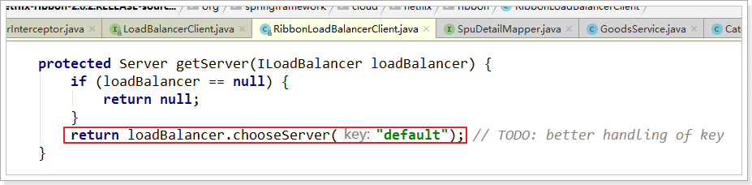

继续跟踪源码 `chooseServer` 方法，发现这么一段代码：

 

我们看看这个 rule 是谁：

 

这里的 rule 默认值是一个 `RoundRobinRule` ，看类的介绍，意为轮询规则

 

到这里，整个负载均衡的流程我们就清楚了。

<br>

---

[^4.1-1]: 所以在 Eureka 中完成注册后，消费者可以通过服务名称代替 ip 和端口号来方法提供者。

<div STYLE="page-break-after: always;">
    <br>
    <br>
    <br>
    <br>
    <br>
</div>
## 4.2	负载均衡策略

##### IRule 接口的实现类

负载均衡的规则都定义在 IRule 接口中，而 IRule 有很多不同的实现类，对应不同的负载均衡策略。


<br>

##### 负载均衡规则与对应的规则类

| **内置负载均衡规则类**        | **规则描述**                                                 |
| ----------------------------- | ------------------------------------------------------------ |
| RoundRobinRule                | 简单轮询服务列表来选择服务器。它是Ribbon默认的负载均衡规则。 |
| AvailabilityFilteringRule     | 对以下两种服务器进行忽略：   （1）在默认情况下，这台服务器如果3次连接失败，这台服务器就会被设置为“短路”状态。短路状态将持续30秒，如果再次连接失败，短路的持续时间就会几何级地增加。  （2）并发数过高的服务器。如果一个服务器的并发连接数过高，配置了AvailabilityFilteringRule规则的客户端也会将其忽略。并发连接数的上限，可以由客户端的<clientName>.<clientConfigNameSpace>.ActiveConnectionsLimit属性进行配置。 |
| WeightedResponseTimeRule      | 为每一个服务器赋予一个权重值。服务器响应时间越长，这个服务器的权重就越小。这个规则会随机选择服务器，这个权重值会影响服务器的选择。 |
| **ZoneAvoidanceRule**[^4.2-1] | 以区域可用的服务器为基础进行服务器的选择。使用Zone对服务器进行分类，这个Zone可以理解为一个机房、一个机架等。而后再对Zone内的多个服务做轮询。 |
| BestAvailableRule             | 忽略那些短路的服务器，并选择并发数较低的服务器。             |
| RandomRule                    | 随机选择一个可用的服务器。                                   |
| RetryRule                     | 重试机制的选择逻辑                                           |

<br>

---

[^4.2-1]: 默认的负载均很规则。 

<div STYLE="page-break-after: always;">
    <br>
    <br>
    <br>
    <br>
    <br>
</div>

## 4.3	设置负载均很策略

##### 方法一——代码方式

在 service 中的启动类中，定义一个新的 IRule

```java
@Bean
public IRule randomRule(){
    return new RandomRule();//采用随机模式
}
```

<br>

##### 方法二——配置文件模式

在 service 的application.yml文件中，添加新的配置修改规则

```
userservice: # 给某个微服务配置负载均衡规则，这里是userservice服务
  ribbon:
    NFLoadBalancerRuleClassName: com.netflix.loadbalancer.RandomRule # 负载均衡规则 
```

<br>

##### 📌注意

一般用默认的负载均衡规则即可，不需要做修改。

<br>

---

<div STYLE="page-break-after: always;">
    <br>
    <br>
    <br>
    <br>
    <br>
</div>

## 4.4	Ribbon 的饥饿加载

##### Ribbon 的默认加载方式

Ribbon 默认是采用懒加载，即第一次访问时才会去创建 LoadBalanceClient，请求时间会很长。

<br>

##### 饥饿加载

而饥饿加载则会在项目启动时创建，降低第一次访问的耗时，通过下面配置开启饥饿加载

```yaml
ribbon:
  eager-load:
    enabled: true
    clients: userservice
```

<br>

---

<div STYLE="page-break-after: always;">
    <br>
    <br>
    <br>
    <br>
    <br>
</div>

# 5	Nacos 注册中心

## 5.1	Nacos 概述

##### Nacos 简介

Nacos ，是由阿里巴巴出品的 Spring Cloud Alibaba 的注册中心组件。相比 Eureka 功能更加丰富，在国内受欢迎程度较高。Nacos 是 Spring Cloud Alibaba 的组件，而 Spring Cloud Alibaba 也遵循 Spring Cloud 中定义的服务注册、服务发现规范。因此使用 Nacos 和使用 Eureka 对于微服务来说，并没有太大区别。

相对于 Spring Cloud Eureka 来说，Nacos 更强大。Nacos = Spring Cloud Eureka + Spring Cloud Config。Nacos 可以与 Spring, Spring Boot, Spring Cloud 集成，并能代替 Spring Cloud Eureka, Spring Cloud Config。

通过 Nacos Server 和 spring-cloud-starter-alibaba-nacos-discovery 可以实现服务的注册与发现。

<br>

##### Nacos 与 Eureka 之间的异同

###### 共同点

- 都支持服务注册和服务拉取；
- 都支持服务提供者心跳方式做健康检测。

###### 区别

- Nacos 支持服务端主动检测提供者状态：临时实例采用心跳模式，非临时实例采用主动检测模式；
- 临时实例心跳不正常会被剔除，非临时实例则不会被剔除；
- Nacos 支持服务列表变更的消息推送模式，服务列表更新更及时；
- Nacos 集群默认采用 AP 方式，当集群中存在非临时实例时，采用 CP 模式；Eureka 采用 AP 方式。

<br>

##### Nacos 的功能

Nacos 是以服务为主要服务对象的中间件，Nacos支持所有主流的服务发现、配置和管理，主要提供以下四大功能：

- 服务发现和服务健康监测
- 动态配置服务
- 动态DNS服务
- 服务及其元数据管理

<br>

##### Nacos 结构图


##### Nacos 官方文档

https://nacos.io/zh-cn/

<br>

##### Nacos GitHub 主页

https://github.com/alibaba/nacos

<br>

##### Nacos GitHub Release 下载页

https://github.com/alibaba/nacos/releases

<br>

---

<div STYLE="page-break-after: always;">
    <br>
    <br>
    <br>
    <br>
    <br>
</div>

## 5.2	安装 Nacos

##### Windows 平台

###### 下载与解压

1. 在 https://github.com/alibaba/nacos/releases 选择适当的版本下载
2. 将下载后的安装包解压到任意非中文目录下

###### 目录结构


- **bin**：启动脚本
- **conf**：配置文件

###### 端口配置

Nacos 的默认端口是 8848，如果你电脑上的其它进程占用了 8848 端口，请先尝试关闭该进程。

如果需要修改 Nacos 的默认端口，可以在 conf/application.properties  文件中进行修改。


###### 启动

进入 bin 目录，在 bin 目录下打开 cmd 窗口，输入：

```shell
#以单应用模式启动 Nacos
startup.cmd -m standalone
```


###### 访问

在浏览器重输入地址 http://127.0.0.1:8848/nacos：


默认账号-密码为：`nacos-nacos`。

<br>

---

<div STYLE="page-break-after: always;">
    <br>
    <br>
    <br>
    <br>
    <br>
</div>

## 5.3	在项目中引入 Nacos

##### 步骤

1. 在项目父工程的 pom.xml 文件中引入 Spring Cloud Alibaba 依赖：

   ```xml
   <dependency>
       <groupId>com.alibaba.cloud</groupId>
       <artifactId>spring-cloud-alibaba-dependencies</artifactId>
       <version>2.2.6.RELEASE</version>
       <type>pom</type>
       <scope>import</scope>
   </dependency>
   ```

2. 在微服务模块的 pom.xml 文件中引入 nacos-discovery：

   ```xml
   <!-- 引入这段依赖之前必须先将 Eureka 依赖  -->
   <dependency>
       <groupId>com.alibaba.cloud</groupId>
       <artifactId>spring-cloud-starter-alibaba-nacos-discovery</artifactId>
   </dependency>
   ```

3. 在微服务模块的 application.yml 文件中添加 nacos 配置

   ```php
   spring:
     cloud:
       nacos:
         server-addr: localhost:8848
   ```

4. 重启微服务

   <br>

---

<div STYLE="page-break-after: always;">
    <br>
    <br>
    <br>
    <br>
    <br>
</div>

## 5.4	Nacos 服务分级存储模型

##### 服务分级存储模型

一个 **服务** 可以有多个 **实例**，假如这些实例分布于全国各地的不同机房，Nacos 可以将同一机房内的实例划分为一个**集群**。


<br>

##### 微服务互相访问时应尽可能访问同集群实例

微服务互相访问时，应该尽可能访问同集群实例，因为本地访问速度更快。当本集群内不可用时，才访问其它集群。


<br>

##### 为微服务模块配置集群

1. 修改微服务模块的 application.yml 文件，添加集群配置：

   ```yaml
   spring:
     cloud:
       nacos:
         server-addr: localhost:8848
         discovery:
           cluster-name: HZ # 集群名称
   ```

2. 创建一个新的实例，添加属性：

   ```
   -Dserver.port=8084 -Dspring.cloud.nacos.discovery.cluster-name=SH
   ```

3. 启动所有实例后查看控制台：

   

<br>

##### 设置同集群优先的负载均衡

默认的`ZoneAvoidanceRule`并不能实现根据同集群优先来实现负载均衡。因此 Nacos 提供了一个 `NacosRule` 的实现，可以优先从同集群中挑选实例。

###### 步骤

1. 为微服务模块配置集群信息

2. 修改微服务模块的 application.ym l文件，修改负载均衡规则：

   ```php
   userservice:
     ribbon:
       NFLoadBalancerRuleClassName: com.alibaba.cloud.nacos.ribbon.NacosRule # 负载均衡规则 
   ```

<br>

---

<div STYLE="page-break-after: always;">
    <br>
    <br>
    <br>
    <br>
    <br>
</div>

## 5.5	权重配置

##### 能者多劳

实际部署中会出现这样的场景——服务器设备性能有差异，部分实例所在机器性能较好，另一些较差，我们希望性能好的机器承担更多的用户请求。但默认情况下 NacosRule 是同集群内随机挑选，不会考虑机器的性能问题。

因此，Nacos 提供了权重配置来控制访问频率，权重越大则访问频率越高。

<br>

##### 修改实例权重

1. 通过 Nacos 控制台的服务列表查找对应的服务，进入详情页面。

   

2. 选择需要修改的实例，点击编辑按钮。

   

3. 对权重进行编辑。

   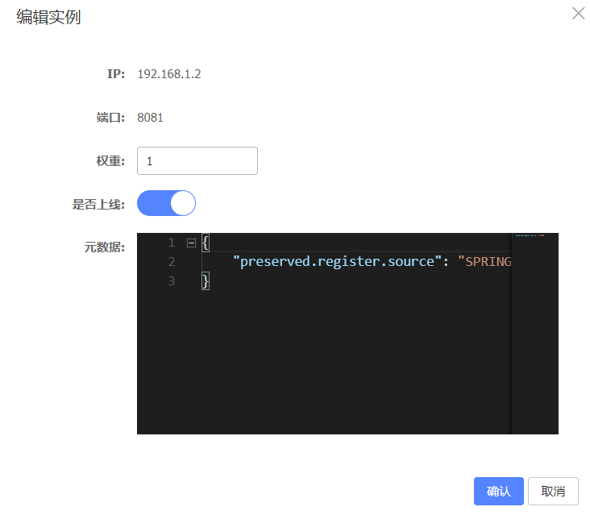

<br>

##### 权重为 0

如果权重修改为0，则该实例永远不会被访问。

<br>

---

<div STYLE="page-break-after: always;">
    <br>
    <br>
    <br>
    <br>
    <br>
</div>

## 5.6	环境隔离

##### Nacos 的 namespace

Nacos 提供了 namespace 来实现环境隔离功能。

- nacos 中可以有多个 namespace

- namespace 下可以有group、service等

  

- **不同 namespace 之间相互隔离**，即不同 namespace 的服务互相不可见.

- 默认情况下，所有 service、data、group 都在同一个namespace，名为 public


<br>

##### 创建 namespace

1. 在 Nacos 控制台的命名空间一栏中选择新建命名空间。

   

2. 输入必要信息。

   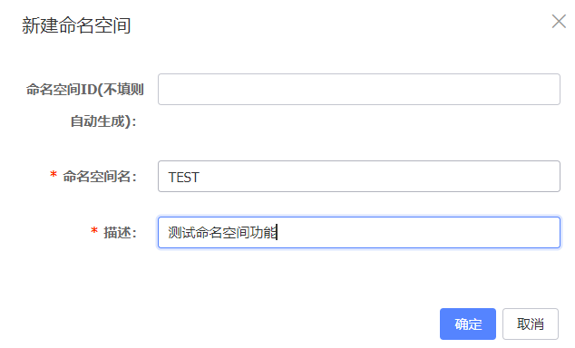

3. 创建成功。

   

<br>

##### 为微服务配置 namespace

1. 修改微服务 的 application.yml 文件：

   ```yaml
   spring:
     cloud:
       nacos:
         server-addr: localhost:8848
         discovery:
           cluster-name: HZ
           namespace: 7ff7b9fe-d9a0-4b65-8853-7e8e920ef872 # 命名空间，填写自动生成或设置的命名空间 ID
   ```

2. 之后重启微服务。

----

<div STYLE="page-break-after: always;">
    <br>
    <br>
    <br>
    <br>
    <br>
</div>

## 5.7	临时实例与永久实例

##### Nacos 的两种服务实例类型

- **临时实例**：如果实例宕机超过一定时间，会从服务列表剔除，**默认的类型**。
- **永久实例（非临时实例）**：如果实例宕机，不会从服务列表剔除。

<br>

##### 配置一个服务实例为永久实例

```ymal
spring:
  cloud:
    nacos:
      discovery:
        ephemeral: false # 设置为永久实例
```

<br>

---

<div STYLE="page-break-after: always;">
    <br>
    <br>
    <br>
    <br>
    <br>
</div>

## 5.8	Nacos 配置管理

### 5.8.1	Nacos 配置管理基础

#####  统一配置管理

当微服务部署的实例越来越多，达到数十、数百时，逐个修改微服务配置就会让人抓狂，而且很容易出错。我们需要一种统一配置管理方案，可以集中管理所有实例的配置。

Spring Cloud 框架使用 Spring Cloud Config 进行配置管理，但是 Nacos 不仅有注册中心的功能，同可以进行配置管理。Nacos 一方面可以将配置集中管理，另一方面可以在配置变更时，及时通知微服务，实现配置的热更新。


<br>

##### nacos 统一配置管理的原理

微服务要拉取 nacos 中管理的配置，并且与本地的 application.yml 配置合并，才能完成项目启动。但如果尚未读取 application.yml，又如何得知 nacos 地址呢？

为此，spring 引入了一种新的配置文件：bootstrap.yaml 文件，会在 application.yml 之前被读取，流程如下：


<br>

##### 如何在 nacos 中添加配置文件

1. 在 nacos 控制台的配置列表中添加配置文件

   

2. 在弹出的表单中，填写配置信息。

###### 📌注意

 Data IDs 一栏填写的配置文件 ID 的格式为 [服务名称]-[profile].[后缀名]，其中的 -[profile] 表示环境[^5.8.1-1]

<br>

##### 如何从微服务拉取配置

1. 首先，在微服务子模块中，引入 nacos-config 的客户端依赖

   ```xml
   <!--nacos配置管理依赖-->
   <dependency>
       <groupId>com.alibaba.cloud</groupId>
       <artifactId>spring-cloud-starter-alibaba-nacos-config</artifactId>
   </dependency>
   ```

2. 在微服务子模块的resource目录下添加 bootstrap.yaml 文件，内容如下：

   ```yaml
   spring:
     application:
       name: userservice # 服务名称
     profiles:
       active: dev #开发环境，这里是dev 
     cloud:
       nacos:
         server-addr: localhost:8848 # Nacos地址
         config:
           file-extension: yaml # 文件后缀名
   ```

   这里会根据 `spring.cloud.nacos.server-addr` 获取 nacos 地址，再根据

   `${spring.application.name}-${spring.profiles.active}.${spring.cloud.nacos.config.file-extension}` 作为文件 id[^5.8.1-2]，来读取配置。此处读取的配置即为 `userservice-dev.yaml`。

   

3. 测试，在微服务中的 Controller 中添加业务逻辑，读取配置：

   ```java
   @Slf4j
   @RestController
   @RequestMapping("/user")
   public class UserController {
   
   	......
   
       //获取配置
       @Value("${pattern.dateformat}")
       private String dateformat;
       
       //根据获取的时间格式输出当前日期
       @GetMapping("now")
       public String now(){
           return LocalDateTime.now().format(DateTimeFormatter.ofPattern(dateformat));
       }
       
       ......
       
   }
   ```

<br>

##### 📌什么配置需要由 Nacos 管理？

项目的核心配置、需要热更新的配置才有由 nacos 管理的必要。基本不会变更的一些配置还是保存在微服务本地比较好。

<br>

----

[^5.8.1-1]: dev（开发）/test（测试）/uat（验收）/prod（生产）。
[^5.8.1-2]: 即 Nacos 控制台配置列表中配置的 Data ID

<div STYLE="page-break-after: always;">
    <br>
    <br>
    <br>
    <br>
    <br>
</div>

### 5.8.2	配置热更新

##### 使用 Nacos 管理配置的最终目的

使用 Nacos 管理配置的最终目的是，修改 nacos 中的配置后，微服务中无需重启即可让配置生效，也就是 **配置热更新**。

<br>

##### 方式一 —— 使用 @RefreshScope 与 @value 

1. 声明一个字符串变量，并使用 `@Value` 赋值

2. 在变量所在类上添加 `@RefreshScope`

   ```java
   @Slf4j
   @RestController
   @RequestMapping("/user")
   @RefreshScope//配置热更新
   public class UserController {
   
   	......
   
   	@Value("${pattern.dateformat}")
   	private String dateformat;
   
       //根据获取的时间格式输出当前日期
       @GetMapping("now")
       public String now(){
           return LocalDateTime.now().format(DateTimeFormatter.ofPattern(dateformat));
       }
   
   	......
   }
   ```

3. 测试。

<br>

##### 方式二 —— 使用 PatternProperties 类

1. 在微服务中，添加一个配置类

   ```java
   package cn.itcast.user.config;
   
   import lombok.Data;
   import org.springframework.boot.context.properties.ConfigurationProperties;
   import org.springframework.stereotype.Component;
   
   @Component
   @Data
   @ConfigurationProperties(prefix = "pattern")
   public class PatternProperties {
       private String dateformat;
   }
   ```

2. 自动注入 PatternProperties，并通过 `patternProperties.getDateformat()` 获取具体配置

   ```java
   @Slf4j
   @RequestMapping("/user")
   public class UserController {
   
   	......
   
   	@AutoWired
       private PatternProperties patternProperties;
   
       //根据获取的时间格式输出当前日期
       @GetMapping("now")
       public String now(){
           return LocalDateTime.now().format(DateTimeFormatter.ofPattern(patternProperties.getDateformat()));
       }
   
   	......
   }
   ```

3. 测试。

<br>

---

<div STYLE="page-break-after: always;">
    <br>
    <br>
    <br>
    <br>
    <br>
</div>

### 5.8.3	配置共享

##### 配置共享的原理

微服务启动时，会去 nacos 读取多个配置文件，例如：

- `[spring.application.name]-[spring.profiles.active].yaml`，例如：userservice-dev.yaml；

- `[spring.application.name].yaml`，例如：userservice.yaml。

因为 `[spring.application.name].yaml` 不包含环境，因此可以被多个环境共享。

<br>

##### 如何添加环境共享配置

1. 在 nacos 中添加一个 userservice.yaml 文件：


2. 在微服务中，修改 PatternProperties 类，读取新添加的属性:

   ```java
   @Component
   @Data
   @ConfigurationProperties(prefix = "pattern")
   public class PatternProperties {
       private String dateformat;
       private String envSharedValue;
   }
   ```

3. 修改 Controller，添加一个方法用于测试：

   ```java
       //根据获取的时间格式输出当前日期
       @GetMapping("prop")
       public String prop(){
           return patternProperties;
       }
   ```

4. 开启一个新的微服务实例，改变其 profile 值


5. 测试，分别访问两个实例的 `prop()` 方法。

<br>

---

<div STYLE="page-break-after: always;">
    <br>
    <br>
    <br>
    <br>
    <br>
</div>

### 5.8.4	配置共享的优先级

##### 不同配置相同属性之间的优先级

当 nacos、服务本地同时出现相同属性时，优先级有高低之分：


<br>

---

<div STYLE="page-break-after: always;">
    <br>
    <br>
    <br>
    <br>
    <br>
</div>

## 5.9	搭建 Nacos 集群

##### 生产环境下需要将 Nacos 部署为集群状态

为了保证健壮性，Nacos 在生产环境下一定要部署为集群状态。

<br>

##### Nacos 集群结构图


图示中包含 3 个 nacos 节点，然后由一个负载均衡器代理 3 个 Nacos。这里负载均衡器可以使用 nginx。

我们计划的集群结构：

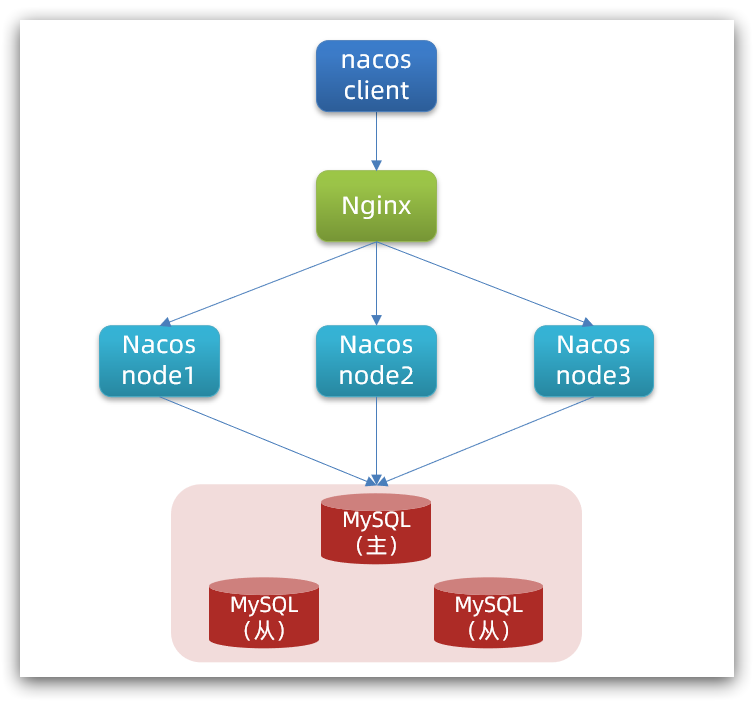

<br>

##### 搭建集群

###### 基本步骤

1. 搭建数据库，初始化数据库表结构
2. 下载 nacos 安装包
3. 配置 nacos
4. 启动 nacos 集群
5. nginx 反向代理

###### 初始化数据库

Nacos 默认数据存储在内嵌数据库 Derby 中，不属于生产可用的数据库。官方推荐的最佳实践是使用带有主从的高可用数据库集群[^5.9-1]。此处使用单体数据库进行演示。

新建一个数据库，命名为 nacos，执行查询：

```sql
CREATE TABLE `config_info` (
  `id` bigint(20) NOT NULL AUTO_INCREMENT COMMENT 'id',
  `data_id` varchar(255) NOT NULL COMMENT 'data_id',
  `group_id` varchar(255) DEFAULT NULL,
  `content` longtext NOT NULL COMMENT 'content',
  `md5` varchar(32) DEFAULT NULL COMMENT 'md5',
  `gmt_create` datetime NOT NULL DEFAULT CURRENT_TIMESTAMP COMMENT '创建时间',
  `gmt_modified` datetime NOT NULL DEFAULT CURRENT_TIMESTAMP COMMENT '修改时间',
  `src_user` text COMMENT 'source user',
  `src_ip` varchar(50) DEFAULT NULL COMMENT 'source ip',
  `app_name` varchar(128) DEFAULT NULL,
  `tenant_id` varchar(128) DEFAULT '' COMMENT '租户字段',
  `c_desc` varchar(256) DEFAULT NULL,
  `c_use` varchar(64) DEFAULT NULL,
  `effect` varchar(64) DEFAULT NULL,
  `type` varchar(64) DEFAULT NULL,
  `c_schema` text,
  PRIMARY KEY (`id`),
  UNIQUE KEY `uk_configinfo_datagrouptenant` (`data_id`,`group_id`,`tenant_id`)
) ENGINE=InnoDB DEFAULT CHARSET=utf8 COLLATE=utf8_bin COMMENT='config_info';

/******************************************/
/*   数据库全名 = nacos_config   */
/*   表名称 = config_info_aggr   */
/******************************************/
CREATE TABLE `config_info_aggr` (
  `id` bigint(20) NOT NULL AUTO_INCREMENT COMMENT 'id',
  `data_id` varchar(255) NOT NULL COMMENT 'data_id',
  `group_id` varchar(255) NOT NULL COMMENT 'group_id',
  `datum_id` varchar(255) NOT NULL COMMENT 'datum_id',
  `content` longtext NOT NULL COMMENT '内容',
  `gmt_modified` datetime NOT NULL COMMENT '修改时间',
  `app_name` varchar(128) DEFAULT NULL,
  `tenant_id` varchar(128) DEFAULT '' COMMENT '租户字段',
  PRIMARY KEY (`id`),
  UNIQUE KEY `uk_configinfoaggr_datagrouptenantdatum` (`data_id`,`group_id`,`tenant_id`,`datum_id`)
) ENGINE=InnoDB DEFAULT CHARSET=utf8 COLLATE=utf8_bin COMMENT='增加租户字段';


/******************************************/
/*   数据库全名 = nacos_config   */
/*   表名称 = config_info_beta   */
/******************************************/
CREATE TABLE `config_info_beta` (
  `id` bigint(20) NOT NULL AUTO_INCREMENT COMMENT 'id',
  `data_id` varchar(255) NOT NULL COMMENT 'data_id',
  `group_id` varchar(128) NOT NULL COMMENT 'group_id',
  `app_name` varchar(128) DEFAULT NULL COMMENT 'app_name',
  `content` longtext NOT NULL COMMENT 'content',
  `beta_ips` varchar(1024) DEFAULT NULL COMMENT 'betaIps',
  `md5` varchar(32) DEFAULT NULL COMMENT 'md5',
  `gmt_create` datetime NOT NULL DEFAULT CURRENT_TIMESTAMP COMMENT '创建时间',
  `gmt_modified` datetime NOT NULL DEFAULT CURRENT_TIMESTAMP COMMENT '修改时间',
  `src_user` text COMMENT 'source user',
  `src_ip` varchar(50) DEFAULT NULL COMMENT 'source ip',
  `tenant_id` varchar(128) DEFAULT '' COMMENT '租户字段',
  PRIMARY KEY (`id`),
  UNIQUE KEY `uk_configinfobeta_datagrouptenant` (`data_id`,`group_id`,`tenant_id`)
) ENGINE=InnoDB DEFAULT CHARSET=utf8 COLLATE=utf8_bin COMMENT='config_info_beta';

/******************************************/
/*   数据库全名 = nacos_config   */
/*   表名称 = config_info_tag   */
/******************************************/
CREATE TABLE `config_info_tag` (
  `id` bigint(20) NOT NULL AUTO_INCREMENT COMMENT 'id',
  `data_id` varchar(255) NOT NULL COMMENT 'data_id',
  `group_id` varchar(128) NOT NULL COMMENT 'group_id',
  `tenant_id` varchar(128) DEFAULT '' COMMENT 'tenant_id',
  `tag_id` varchar(128) NOT NULL COMMENT 'tag_id',
  `app_name` varchar(128) DEFAULT NULL COMMENT 'app_name',
  `content` longtext NOT NULL COMMENT 'content',
  `md5` varchar(32) DEFAULT NULL COMMENT 'md5',
  `gmt_create` datetime NOT NULL DEFAULT CURRENT_TIMESTAMP COMMENT '创建时间',
  `gmt_modified` datetime NOT NULL DEFAULT CURRENT_TIMESTAMP COMMENT '修改时间',
  `src_user` text COMMENT 'source user',
  `src_ip` varchar(50) DEFAULT NULL COMMENT 'source ip',
  PRIMARY KEY (`id`),
  UNIQUE KEY `uk_configinfotag_datagrouptenanttag` (`data_id`,`group_id`,`tenant_id`,`tag_id`)
) ENGINE=InnoDB DEFAULT CHARSET=utf8 COLLATE=utf8_bin COMMENT='config_info_tag';

/******************************************/
/*   数据库全名 = nacos_config   */
/*   表名称 = config_tags_relation   */
/******************************************/
CREATE TABLE `config_tags_relation` (
  `id` bigint(20) NOT NULL COMMENT 'id',
  `tag_name` varchar(128) NOT NULL COMMENT 'tag_name',
  `tag_type` varchar(64) DEFAULT NULL COMMENT 'tag_type',
  `data_id` varchar(255) NOT NULL COMMENT 'data_id',
  `group_id` varchar(128) NOT NULL COMMENT 'group_id',
  `tenant_id` varchar(128) DEFAULT '' COMMENT 'tenant_id',
  `nid` bigint(20) NOT NULL AUTO_INCREMENT,
  PRIMARY KEY (`nid`),
  UNIQUE KEY `uk_configtagrelation_configidtag` (`id`,`tag_name`,`tag_type`),
  KEY `idx_tenant_id` (`tenant_id`)
) ENGINE=InnoDB DEFAULT CHARSET=utf8 COLLATE=utf8_bin COMMENT='config_tag_relation';

/******************************************/
/*   数据库全名 = nacos_config   */
/*   表名称 = group_capacity   */
/******************************************/
CREATE TABLE `group_capacity` (
  `id` bigint(20) unsigned NOT NULL AUTO_INCREMENT COMMENT '主键ID',
  `group_id` varchar(128) NOT NULL DEFAULT '' COMMENT 'Group ID，空字符表示整个集群',
  `quota` int(10) unsigned NOT NULL DEFAULT '0' COMMENT '配额，0表示使用默认值',
  `usage` int(10) unsigned NOT NULL DEFAULT '0' COMMENT '使用量',
  `max_size` int(10) unsigned NOT NULL DEFAULT '0' COMMENT '单个配置大小上限，单位为字节，0表示使用默认值',
  `max_aggr_count` int(10) unsigned NOT NULL DEFAULT '0' COMMENT '聚合子配置最大个数，，0表示使用默认值',
  `max_aggr_size` int(10) unsigned NOT NULL DEFAULT '0' COMMENT '单个聚合数据的子配置大小上限，单位为字节，0表示使用默认值',
  `max_history_count` int(10) unsigned NOT NULL DEFAULT '0' COMMENT '最大变更历史数量',
  `gmt_create` datetime NOT NULL DEFAULT CURRENT_TIMESTAMP COMMENT '创建时间',
  `gmt_modified` datetime NOT NULL DEFAULT CURRENT_TIMESTAMP COMMENT '修改时间',
  PRIMARY KEY (`id`),
  UNIQUE KEY `uk_group_id` (`group_id`)
) ENGINE=InnoDB DEFAULT CHARSET=utf8 COLLATE=utf8_bin COMMENT='集群、各Group容量信息表';

/******************************************/
/*   数据库全名 = nacos_config   */
/*   表名称 = his_config_info   */
/******************************************/
CREATE TABLE `his_config_info` (
  `id` bigint(64) unsigned NOT NULL,
  `nid` bigint(20) unsigned NOT NULL AUTO_INCREMENT,
  `data_id` varchar(255) NOT NULL,
  `group_id` varchar(128) NOT NULL,
  `app_name` varchar(128) DEFAULT NULL COMMENT 'app_name',
  `content` longtext NOT NULL,
  `md5` varchar(32) DEFAULT NULL,
  `gmt_create` datetime NOT NULL DEFAULT CURRENT_TIMESTAMP,
  `gmt_modified` datetime NOT NULL DEFAULT CURRENT_TIMESTAMP,
  `src_user` text,
  `src_ip` varchar(50) DEFAULT NULL,
  `op_type` char(10) DEFAULT NULL,
  `tenant_id` varchar(128) DEFAULT '' COMMENT '租户字段',
  PRIMARY KEY (`nid`),
  KEY `idx_gmt_create` (`gmt_create`),
  KEY `idx_gmt_modified` (`gmt_modified`),
  KEY `idx_did` (`data_id`)
) ENGINE=InnoDB DEFAULT CHARSET=utf8 COLLATE=utf8_bin COMMENT='多租户改造';


/******************************************/
/*   数据库全名 = nacos_config   */
/*   表名称 = tenant_capacity   */
/******************************************/
CREATE TABLE `tenant_capacity` (
  `id` bigint(20) unsigned NOT NULL AUTO_INCREMENT COMMENT '主键ID',
  `tenant_id` varchar(128) NOT NULL DEFAULT '' COMMENT 'Tenant ID',
  `quota` int(10) unsigned NOT NULL DEFAULT '0' COMMENT '配额，0表示使用默认值',
  `usage` int(10) unsigned NOT NULL DEFAULT '0' COMMENT '使用量',
  `max_size` int(10) unsigned NOT NULL DEFAULT '0' COMMENT '单个配置大小上限，单位为字节，0表示使用默认值',
  `max_aggr_count` int(10) unsigned NOT NULL DEFAULT '0' COMMENT '聚合子配置最大个数',
  `max_aggr_size` int(10) unsigned NOT NULL DEFAULT '0' COMMENT '单个聚合数据的子配置大小上限，单位为字节，0表示使用默认值',
  `max_history_count` int(10) unsigned NOT NULL DEFAULT '0' COMMENT '最大变更历史数量',
  `gmt_create` datetime NOT NULL DEFAULT CURRENT_TIMESTAMP COMMENT '创建时间',
  `gmt_modified` datetime NOT NULL DEFAULT CURRENT_TIMESTAMP COMMENT '修改时间',
  PRIMARY KEY (`id`),
  UNIQUE KEY `uk_tenant_id` (`tenant_id`)
) ENGINE=InnoDB DEFAULT CHARSET=utf8 COLLATE=utf8_bin COMMENT='租户容量信息表';


CREATE TABLE `tenant_info` (
  `id` bigint(20) NOT NULL AUTO_INCREMENT COMMENT 'id',
  `kp` varchar(128) NOT NULL COMMENT 'kp',
  `tenant_id` varchar(128) default '' COMMENT 'tenant_id',
  `tenant_name` varchar(128) default '' COMMENT 'tenant_name',
  `tenant_desc` varchar(256) DEFAULT NULL COMMENT 'tenant_desc',
  `create_source` varchar(32) DEFAULT NULL COMMENT 'create_source',
  `gmt_create` bigint(20) NOT NULL COMMENT '创建时间',
  `gmt_modified` bigint(20) NOT NULL COMMENT '修改时间',
  PRIMARY KEY (`id`),
  UNIQUE KEY `uk_tenant_info_kptenantid` (`kp`,`tenant_id`),
  KEY `idx_tenant_id` (`tenant_id`)
) ENGINE=InnoDB DEFAULT CHARSET=utf8 COLLATE=utf8_bin COMMENT='tenant_info';

CREATE TABLE `users` (
	`username` varchar(50) NOT NULL PRIMARY KEY,
	`password` varchar(500) NOT NULL,
	`enabled` boolean NOT NULL
);

CREATE TABLE `roles` (
	`username` varchar(50) NOT NULL,
	`role` varchar(50) NOT NULL,
	UNIQUE INDEX `idx_user_role` (`username` ASC, `role` ASC) USING BTREE
);

CREATE TABLE `permissions` (
    `role` varchar(50) NOT NULL,
    `resource` varchar(255) NOT NULL,
    `action` varchar(8) NOT NULL,
    UNIQUE INDEX `uk_role_permission` (`role`,`resource`,`action`) USING BTREE
);

INSERT INTO users (username, password, enabled) VALUES ('nacos', '$2a$10$EuWPZHzz32dJN7jexM34MOeYirDdFAZm2kuWj7VEOJhhZkDrxfvUu', TRUE);

INSERT INTO roles (username, role) VALUES ('nacos', 'ROLE_ADMIN');
```

###### 下载 nacos

在官方渠道下载并解压平台对应的 Nacos。

###### 配置 Nacos

进入 nacos 的 conf 目录，修改配置文件 cluster.conf.example，重命名为 cluster.conf：

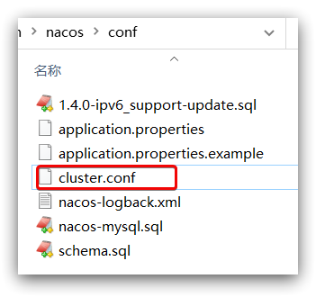

在 cluster.conf 中添加内容：

```
# 集群实例的IP地址与端口号
127.0.0.1:8845
127.0.0.1.8846
127.0.0.1.8847
```

修改配置文件 conf /application.properties，添加数据库配置：

```php
spring.datasource.platform=mysql

db.num=1

db.url.0=jdbc:mysql://127.0.0.1:3306/nacos?characterEncoding=utf8&connectTimeout=1000&socketTimeout=3000&autoReconnect=true&useUnicode=true&useSSL=false&serverTimezone=UTC
db.user.0=root
db.password.0=123
```

###### 启动

将 nacos 文件夹复制三份，分别命名为：nacos1、nacos2、nacos3[^5.9-2]，然后分别修改三个文件夹中的 application.properties，

nacos1:

```properties
server.port=8845
```

nacos2:

```properties
server.port=8846
```

nacos3:

```properties
server.port=8847
```

启动这三个 nacos 节点。

```cmd
startup.cmd
```

###### nginx 反向代理

下载并解压 nginx 压缩包到任意非中文目录下，修改 conf/nginx.conf 文件，配置如下：

```conf
upstream nacos-cluster {
    server 127.0.0.1:8845;
	server 127.0.0.1:8846;
	server 127.0.0.1:8847;
}

server {
    listen       80;
    server_name  localhost;

    location /nacos {
        proxy_pass http://nacos-cluster;
    }
}
```

修改微服务的 application.yaml 文件配置：

```conf
spring:
	cloud:
    	nacos:
        	server-addr: localhost:80
```

###### 优化

- 实际部署时，需要给做反向代理的 nginx 服务器设置一个域名，这样后续如果有服务器迁移 nacos 的客户端也无需更改配置；

- Nacos 的各个节点应该部署到多个不同服务器，做好容灾和隔离、

---

[^5.9-1]:参考高可用数据库集群搭建资料。
[^5.9-2]:部署于不同主机上则不需要重命名。

<div STYLE="page-break-after: always;">
    <br>
    <br>
    <br>
    <br>
    <br>
</div>
# 6	Feign HTTP 客户端

## 6.1	Feign 概述

#### RestTemplate 远程调用的缺点

1. 代码可读性差，编程体验不统一；
2. 参数复杂，字符形式的 URL 难以维护。

<br>

##### 什么是 Feign

Feign 是由 Netflix 开发的 **声明式、模板化** 的 HTTP 客户端，Feign 可以帮助我们更快捷、优雅地调用 HTTP API。

Feign 支持多种注解，例如 Feign 自带的注解或者 JAX-RS 注解等。

<br>

##### Feign 的作用

Feign 的作用就是帮助我们优雅的实现 http 请求的发送，解决上面提到的问题。Feign 可以把 Rest 的请求进行隐藏，伪装成类似 SpringMVC 的 Controller 格式。如此一来，不需要再进行拼接 url、拼接参数等等操作，一切交由 Feign 完成。

<br>

##### Spring Cloud Feign

Spring Cloud 对 Feign 进行了增强，使 Feign 支持了 Spring MVC 注解，并整合了 Ribbon 和 Eureka，从而让 Feign 的使用更加方便。

Spring Cloud Feign 是基于 Netflix feign 实现**，整合了 Spring Cloud Ribbon 和 Spring Cloud Hystrix**，除了提供这两者的强大功能外，还提供了一种声明式的 Web 服务客户端定义的方式。

Spring Cloud Feign 帮助我们定义和实现依赖服务接口的定义。在 Spring Cloud feign 的实现下，只需要创建一个接口并用注解方式配置它，即可完成服务提供方的接口绑定，简化了在使用 Spring Cloud Ribbon 时自行封装服务调用客户端的开发量。

<br>

##### 官方地址

https://github.com/OpenFeign/feign。

<br>

---

<div STYLE="page-break-after: always;">
    <br>
    <br>
    <br>
    <br>
    <br>
</div>
## 6.2	Feign 远程调用基础

##### 前提条件

服务提供者与服务调用者都已经在注册中心（nacos） 中进行注册。

<br>

##### Feign 基本使用步骤

1. 在微服务的 pom.xml 文件中引入 feign 依赖：

```xml
<dependency>
    <groupId>org.springframework.cloud</groupId>
    <artifactId>spring-cloud-starter-openfeign</artifactId>
</dependency>
```

2. 在微服务的启动类添加注解开启 Feign 的功能：

```java
@MapperScan("cn.itcast.order.mapper")
@SpringBootApplication
@EnableFeignClients//开启 Feign 功能
public class OrderApplication {

    public static void main(String[] args) {
        SpringApplication.run(OrderApplication.class, args);
    }

}
```

3. 编写 Feign 的客户端，在微服务中新建一个接口，内容如下：

```java
package cn.itcast.order.client;

import cn.itcast.order.pojo.User;
import org.springframework.cloud.openfeign.FeignClient;
import org.springframework.web.bind.annotation.GetMapping;
import org.springframework.web.bind.annotation.PathVariable;

@FeignClient("userservice")// 被调用的w
public interface UserClient {
    @GetMapping("/user/{id}")
    User findById(@PathVariable("id") Long id);
}
//Feign  客户端主要是基于 SpringMVC 的注解来声明远程调用的信息，对应为：
//- 服务名称：userservice
//- 请求方式：GET
//- 请求路径：/user/{id}
//- 请求参数：Long id
//- 返回值类型：User
```

4. 使用 Feign 客户端调用接口：

```java
@RestController
@RequestMapping("order")
public class OrderController {

   @Autowired
   private OrderService orderService;

    @Autowired
    private UserClient userClient;

    @GetMapping("{orderId}")
    public Order queryOrderByUserId(@PathVariable("orderId") Long orderId) {
        //1.查询订单
        Order order = orderService.queryOrderById(orderId);
        //2.利用 Feign 发送 HTTP 请求，查询用户
        User user = userClient.findById(order.getUserId());
        //3.封装 user 到 Order
        order.setUser(user);
        //4.返回
        return orderService.queryOrderById(orderId);
    }
}
```

5. 进行测试。

<br>

---

<div STYLE="page-break-after: always;">
    <br>
    <br>
    <br>
    <br>
    <br>
</div>
## 6.3	Feign 配置

##### Feign 支持自定义的配置

Feign 可以支持很多的自定义配置，如下表所示：

| 类型                           | 作用             | 说明                                                         |
| ------------------------------ | ---------------- | ------------------------------------------------------------ |
| **feign.Logger.Level**[^6.3-1] | 修改日志级别     | 包含四种不同的级别：NONE[^6.3-2]、BASIC[^6.3-3]、HEADERS[^6.3-4]、FULL[^6.3-5] |
| feign.codec.Decoder            | 响应结果的解析器 | http远程调用的结果做解析，例如解析json字符串为java对象       |
| feign.codec.Encoder            | 请求参数编码     | 将请求参数编码，便于通过http请求发送                         |
| feign. Contract                | 支持的注解格式   | 默认是SpringMVC的注解                                        |
| feign. Retryer                 | 失败重试机制     | 请求失败的重试机制，默认是没有，不过会使用Ribbon的重试       |

一般情况下，默认值就能满足我们使用，如果要自定义时，只需要创建自定义的 `@Bean` 覆盖默认 Bean 即可。

<br>

##### 示例 —— 自定义配置 Feign 的日志级别

###### 方式一 —— 通过配置修改 feign 的日志级别

针对特定服务的日志级别生效：

```yaml
feign:  
  client:
    config: 
      userservice: # 针对某个微服务的配置
        loggerLevel: FULL #  日志级别 
```

针对所有服务的日志级别生效：

```
feign:  
  client:
    config: 
      default: # 这里用default就是全局配置，如果是写服务名称，则是针对某个微服务的配置  
        loggerLevel: FULL #  日志级别 
```

###### 方式二 —— 基于 Java 代码修改日志级别

1. 声明一个类，在类中声明一个 Logger.Level 的对象

```java
public class DefaultFeignConfiguration  {
	@Bean    
	public Logger.Level feignLogLevel(){
    	return Logger.Level.BASIC; // 日志级别为BASIC    
    }
}
```

2. 使配置生效。

```java
//针对所有服务的日志级别生效
//修改启动类的 @EnableFeignClients
@EnableFeignClients(defaultConfiguration = DefaultFeignConfiguration .class) 
```

```java
//针对特定服务的日志级别生效
//修改对应 feign 接口的 @FeignClient 注解中
@FeignClient(value = "userservice", configuration = DefaultFeignConfiguration .class) 
```

3. 测试。

<br>

---

[^6.3-1]: 这项配置的默认值为 NONE，一般需要配置为 BASIC。
[^6.3-2]: 不记录任何日志信息，这是默认值。
[^6.3-3]: 仅记录请求的方法，URL 以及响应状态码和执行时间，常用配置。
[^6.3-4]: 在 BASIC 的基础上，额外记录了请求和响应的头信息。
[^6.3-5]: 记录所有请求和响应的明细，包括头信息、请求体、元数据。

<div STYLE="page-break-after: always;">
    <br>
    <br>
    <br>
    <br>
    <br>
</div>

## 6.4	Feign 使用优化

##### Feign 的底层实现原理

Feign 底层发起 http 请求，依赖于其它的 HttpClient 框架。Feign 支持的 HttpClient 包括：

- URLConnection：默认实现，**不支持连接池**
- Apache HttpClient ：支持连接池
- OKHttp：支持连接池

<br>

##### 通过修改 HttpClient 可以提升 Feign 的性能

因为默认的 URLConnection 不支持连接池，所以提高 Feign 性能的主要手段就是使用 **支持连接池的 HttpClient ** 代替默认的 URLConnection。

<br>

##### 将 Feign 的 HttpClient 修改为 Apache HttpClient

1. 在微服务的 pom.xml 文件中引入 Apache 的 HttpClient 依赖：

```xml
<!--httpClient的依赖 -->
<dependency>   
	<groupId>io.github.openfeign</groupId>
    <artifactId>feign-httpclient</artifactId>
</dependency>
```

2. 在微服务的 application.yml 中添加连接池配置

```yaml
feign:
  client:
    config:
      default: # default全局的配置
        loggerLevel: BASIC # 日志级别，BASIC就是基本的请求和响应信息
  httpclient:
    enabled: true # 开启feign对HttpClient的支持
    max-connections: 200 # 最大的连接数
    max-connections-per-route: 50 # 每个路径的最大连接数
```

3. 测试，在 FeignClientFactoryBean 中的 loadBalance 方法中打断点，以 Debug 方式启动 order-service 服务，可以看到这里的 client，底层就是 Apache HttpClient。


<br>

---

<div STYLE="page-break-after: always;">
    <br>
    <br>
    <br>
    <br>
    <br>
</div>

## 6.5	Feign 最佳实践

##### Feign 客户端与服务提供者的 Controller 代码之间的相似性

Order-service 的 Feign 客户端代码：

```java
@FeignClient("userservice")
public interface UserClient {
    @GetMapping("/user/{id}")
    User findById(@PathVariable("id") Long id);
}
```

userservice 的 controller 代码：

```java
@RestController
@RequestMapping("/user")
public class UserController {

    @Autowired
    private UserService userService;

    /**
     * 路径： /user/110
     *
     * @param id 用户id
     * @return 用户
     */
    @GetMapping("/{id}")
    public User queryById(@PathVariable("id") Long id) {
        return userService.queryById(id);
    }
}
```

那么，有没有一种办法简化这种重复的代码编写呢？

<br>

##### 通过继承方式实现共享

###### 实现步骤

1. 定义一个 API 接口，利用定义方法，并基于 SpringMVC 注解做声明。
2. Feign 客户端和 Controller 都集成该接口。


###### 优点

- 简单
- 实现了代码共享

###### 缺点

- 服务提供方、服务消费方紧耦合

- 参数列表中的注解映射并不会继承，因此 Controller 中必须再次声明方法、参数列表、注解

<br>

##### 📌通过抽取方式实现共享

###### 实现原理

将 Feign 的Client抽取为独立模块，并且把接口有关的POJO、默认的Feign配置都放到这个模块中，提供给所有消费者使用。例如，将 UserClient、User、Feign 的默认配置都抽取到一个 feign-api 包中，所有微服务引用该依赖包，即可直接使用。

###### 实现步骤

1. 首先创建一个 module，命名为 feign-api

2. 将 pojo 包、clients 包 以及 config/DefaultFeignConfiguration.java 都移动到 feign-api 中。

   

3. 在 feign-api 中然后引入 feign 的 starter 依赖

```xml
<dependency>
    <groupId>org.springframework.cloud</groupId>
    <artifactId>spring-cloud-starter-openfeign</artifactId>
</dependency>
```

4. 修改微服务中与 pojo、Client、DefaultFeignConfiguration 相关的类或接口，从 feign-api 中导入。
5. 由于微服务的 @EnableFeignClients 注解在 `GroupId.ProjectName.ModuleName` （比如 `cn.nilnullnaught.nnnnote.user`）包下，与 feign-api 不在同一个包，所以无法扫描到 feign-api 中的内容，解决这个问题有三种方式：

```java
//指定 Feign 应该扫描的包 
@EnableFeignClients(basePackages = "cn.nilnullnaught.nnnnote.feign.clients")
@SpringApplication
public class Application{
    ...
}
```

```java
//指定需要加载的 Client 接口
@EnableFeignClients(clients = {UserClient.class})
@SpringApplication
public class Application{
    ...
}
```

6. 测试。

<br>

##### 📌最佳实践的打包问题

最佳实践中，一般会将所有的 Feign 接口放到一个独立的模块中，但是对于这种没有 main() 的模块，打包时会出现 Unable to find main class 错误， 需要在 pom.xml 文件中加入以下配置

	<build>
	    <plugins>
	        <plugin>
	            <groupId>org.springframework.boot</groupId>
	            <artifactId>spring-boot-maven-plugin</artifactId>
	            <version>2.3.2.RELEASE</version>
	            <configuration>
	                <layout>NONE</layout>
	                <classifier>exec</classifier>
	            </configuration>
	        </plugin>
	    </plugins>
	</build>

<br>

---

<div STYLE="page-break-after: always;">
    <br>
    <br>
    <br>
    <br>
    <br>
</div>
## 6.6	Feign 的默认超时时间设置

##### 问题

Feign 的默认超时时间太短。

<br>

##### Ribbon 超时时间

Feign 底层的负载均衡通过 Ribbon实现

###### 全局配置

对所有的服务该配置都生效

```yaml
 ribbon:  
	#连接超时时间，单位毫秒，默认为1秒
    ReadTimeout: 30000 #该值会被FeignClient配置connectTimeout覆盖
    #建立连接之后，读取响应资源超时时间，默认为1秒
    ConnectTimeout: 30000 #该值会被FeignClient配置readTimeout覆盖
```

###### 指定服务配置

```yaml
# servicename 是服务的名称，该配置只针对该服务生效
servicename:
  ribbon:
  	#连接超时时间，单位毫秒，默认为1秒
    ReadTimeout: 30000 #该值会被FeignClient配置readTimeout覆盖
    #建立连接之后，读取响应资源超时时间，默认为1秒
    ConnectTimeout: 30000 #该值会被FeignClient配置readTimeout覆盖
```

<br>

##### Feign

###### 全局配置

```yaml
feign:
  client:
    config:
      default:
        #连接超时时间，单位毫秒
        connectTimeout: 5000 
        #建立连接之后，读取响应资源超时时间
        readTimeout: 5000 
```

###### 指定服务配置

```yaml
feign:
  client:
    config:
      annoroad-beta:
      	#连接超时时间，单位毫秒
        connectTimeout: 10000 
        #建立连接之后，读取响应资源超时时间
        readTimeout: 10000
```

<br>

##### 📌建议使用 Feign 配置超时时间

理由：

1. Ribbon 的配置要想生效必须满足微服务相互调用的时候通过注册中心，如果你是在本地通过 @FeignClient 注解的 url 参数进行服务相互调用的测试，此时 ribbon 设置的超时时间将会失效，但是通过 Feign 设置的超时时间不会受到影响（仍然会生效）。
2. 如果同时配置了Ribbon、Feign，那么 Feign 的配置将生效。

综上所述建议使用 Feign 的来设置超时时间

<br>

---

<div STYLE="page-break-after: always;">
    <br>
    <br>
    <br>
    <br>
    <br>
</div>
## 6.7	在请求头中添加参数

##### 请求发送者

```java

@Autowired
private ServiceHandlerClient serviceHandlerClient

public void sendRequest(){

	serviceHandlerClient.paramInHeader("Hello world");
}

```

<br>

##### feign接口

```java
@FeignClient(name = "service-handler")
public interface ServiceHandlerClient {

    @PostMapping("/paramInHeader")
    public String paramInHeader(@RequestHeader("token")String token);
}
```

<br>

##### 请求处理者

```java


    @PostMapping("/paramInHeader")
    public String paramInHeader(@RequestHeader("token")String token){
    	return token;
    }
```

<br>

---

<div STYLE="page-break-after: always;">
    <br>
    <br>
    <br>
    <br>
    <br>
</div>

## 6.8	使用 feign 传输文件

##### feign 接口

```
    @PostMapping(value = "/path",consumes = MediaType.MULTIPART_FORM_DATA_VALUE)
    public String upDateFile(,@RequestPart("file")MultipartFile file);
```

<br>

##### 请求处理者

```
    @PostMapping("/path")
    public String upDateFile(@RequestPart("file")MultipartFile file) {
        return "OK";
    }
```

<br>

---

<div STYLE="page-break-after: always;">
    <br>
    <br>
    <br>
    <br>
    <br>
</div>
## 6.8	使用 contextId 属性、对一个微服务创捷多个 Feign 接口

在openfeign高版本2.2.1中@FeignClient里面添加了新属性ContextId

---

<div STYLE="page-break-after: always;">
    <br>
    <br>
    <br>
    <br>
    <br>
</div>
# 7	Gateway 路由网关

## 7.1	Gateway 概述

##### API 网关出现的原因

随着微服务架构的出现，不同的微服务一般会有不同的网络地址，而外部客户端可能需要调用多个服务的接口才能完成一个业务需求，如果让客户端直接与各个微服务通信，会有以下的问题：

1. 客户端会多次请求不同的微服务，增加了客户端的复杂性。
2. 存在跨域请求，在一定场景下处理相对复杂。
3. 认证复杂，每个服务都需要独立认证。
4. 难以重构，随着项目的迭代，可能需要重新划分微服务。例如，可能将多个服务合并成一个或者将一个服务拆分成多个。如果客户端直接与微服务通信，那么重构将会很难实施。
5. 某些微服务可能使用了防火墙 / 浏览器不友好的协议，直接访问会有一定的困难。

以上这些问题可以借助 API 网关解决。API 网关是介于客户端和服务器端之间的中间层，所有的外部请求都会先经过 API 网关这一层。也就是说，API 的实现方面更多的考虑业务逻辑，而安全、性能、监控可以交由 API 网关来做，这样既提高业务灵活性又不缺安全性

<br>

##### 什么是 Gateway

Spring Cloud Gateway 是 Spring Cloud 的一个子项目，该项目是基于 Spring 5.0，Spring Boot 2.0 和 Project Reactor 等响应式编程和事件流技术开发的网关，它旨在为微服务架构提供一种简单有效的统一的 API 路由管理方式。其不仅提供统一的路由方式，并且还基于 Filer 链的方式提供了网关基本的功能，例如：安全、监控/埋点、限流等。

Gateway 网关是我们服务的守门神，所有微服务的统一入口。

<br>

##### Spring Cloud Gateway 核心概念

网关提供 API 全托管服务，丰富的 API 管理功能，辅助企业管理大规模的 API，以降低管理成本和安全风险，包括协议适配、协议转发、安全策略、防刷、流量、监控日志等功能。一般来说网关对外暴露的URL或者接口信息，我们统称为路由信息。如果研发过网关中间件或者使用过 Zuul 的人，会知道 **网关的核心是Filter 以及Filter Chain（Filter责任链）**。Sprig Cloud Gateway也具有路由和Filter的概念。下面介绍一下Spring Cloud Gateway中几个重要的概念。

- **路由**：路由是网关最基础的部分，路由信息有一个ID、一个目的URL、一组断言和一组 Filter 组成。如果断言路由为真，则说明请求的 URL 和配置匹配。
- **断言**：Spring Cloud Gateway 中的断言函数输入类型是 Spring5.0 框架中的 ServerWebExchange。Spring Cloud Gateway 中的断言函数允许开发者去定义匹配来自于 http request 中的任何信息，比如请求头和参数等。
- **过滤器**：一个标准的 Spring webFilter。Spring cloud gateway 中 的filter分为两种类型的Filter，分别是Gateway Filter和Global Filter。过滤器Filter将会对请求和响应进行修改处理。

<br>

##### 网关的**核心功能特性**

- **请求路由和负载均衡**：一切请求都必须先经过 gateway，但网关不处理业务，而是根据某种规则，把请求转发到某个微服务，这个过程叫做路由。当然路由的目标服务有多个时，还需要做负载均衡。
- **权限控制**：网关作为微服务入口，需要校验用户是是否有请求资格，如果没有则进行拦截。
- **限流**：当请求流量过高时，在网关中按照下流的微服务能够接受的速度来放行请求，避免服务压力过大。

<br>

##### 网关架构图


<br>

##### gateway 与 zuul

在 Spring Cloud 中网关的实现包括两种，分别是 Zuul 和 gateway。Zuul 是基于 Servlet 的实现，属于阻塞式编程。而 SpringCloudGateway 则是基于 Spring5 中提供的 WebFlux，属于响应式编程的实现，具备更好的性能。

<br>

---

<div STYLE="page-break-after: always;">
    <br>
    <br>
    <br>
    <br>
    <br>
</div>

## 7.2	Gateway 基础使用

##### 使用步骤

1. 创建微服务 gateway 子模块。
2. 引入网关依赖与服务发现依赖。

```java
<!--网关-->
<dependency>
    <groupId>org.springframework.cloud</groupId>
    <artifactId>spring-cloud-starter-gateway</artifactId>
</dependency>
    
<!--nacos服务发现依赖-->
<dependency>
    <groupId>com.alibaba.cloud</groupId>
    <artifactId>spring-cloud-starter-alibaba-nacos-discovery</artifactId>
</dependency>
```

3. 编写启动类。
4. 编写基础配置和路由规则。

```yaml
server:
  port: 10010 # 网关端口
spring:
  application:
    name: gateway # 服务名称
  cloud:
    nacos:
      server-addr: localhost:8848 # nacos地址
    gateway:
      routes: # 网关路由配置
        - id: user-service # 路由id，自定义，只要唯一即可
          # uri: http://127.0.0.1:8081 # 路由的目标地址,使用 http 作为前缀意味使用的是固定地址
          uri: lb://userservice # 路由的目标地址 lb就是负载均衡，后面跟服务名称
          predicates: # 路由断言，即判断请求是否符合路由规则的条件
            - Path=/user/** # 这个是按照路径匹配，只要以/user/开头就符合要求
            
#上述规则会将 `/user/**`开头的请求，代理到`lb://userservice`，lb是负载均衡，根据服务名拉取服务列表，实现负载均衡。
```

5. 访问 http://localhost:10010/user/1 时，符合 `/user/**` 规则，请求转发到 uri：http://userservice/user/1，得到了结果：

   

<br>

##### 网关路由的流程图


<br>

##### Gateway 所包括的路由配置

- **路由 ID**：路由的唯一标示
- **路由目标（uri）**：路由的目标地址，http代表固定地址，lb代表根据服务名负载均衡
- **路由断言（predicates）**：判断路由的规则，
- **路由过滤器（filters）**：对请求或响应做处理

<br>

---

<div STYLE="page-break-after: always;">
    <br>
    <br>
    <br>
    <br>
    <br>
</div>

## 7.3	断言规则与断言工厂

##### 断言规则的处理流程

配置文件中的断言规则只是字符串，这些字符串会被 PredicateFactory （断言工厂）读取并处理，转变为路由判断的条件。

例如 `Path=/user/**` 是按照路径匹配，这个规则是由 `org.springframework.cloud.gateway.handler.predicate.PathRoutePredicateFactory` 处理的。

<br>

##### SpringCloudGateway 的 11 个断言工厂

| **名称**   | **说明**                       | **示例**                                                     |
| ---------- | ------------------------------ | ------------------------------------------------------------ |
| After      | 是某个时间点后的请求           | -  After=2037-01-20T17:42:47.789-07:00[America/Denver]       |
| Before     | 是某个时间点之前的请求         | -  Before=2031-04-13T15:14:47.433+08:00[Asia/Shanghai]       |
| Between    | 是某两个时间点之前的请求       | -  Between=2037-01-20T17:42:47.789-07:00[America/Denver],  2037-01-21T17:42:47.789-07:00[America/Denver] |
| Cookie     | 请求必须包含某些cookie         | - Cookie=chocolate, ch.p                                     |
| Header     | 请求必须包含某些header         | - Header=X-Request-Id, \d+                                   |
| Host       | 请求必须是访问某个host（域名） | -  Host=\*\*.somehost.org,\*\*.anotherhost.org               |
| Method     | 请求方式必须是指定方式         | - Method=GET,POST                                            |
| Path       | 请求路径必须符合指定规则       | - Path=/red/{segment},/blue/\*\*                             |
| Query      | 请求参数必须包含指定参数       | - Query=name, Jack或者-  Query=name                          |
| RemoteAddr | 请求者的ip必须是指定范围       | - RemoteAddr=192.168.1.1/24                                  |
| Weight     | 权重处理                       |                                                              |

<br>

---

<div STYLE="page-break-after: always;">
    <br>
    <br>
    <br>
    <br>
    <br>
</div>

## 7.4	Gateway 过滤器工厂

##### 什么是路由过滤器

路由过滤器是 Gateway 提供的一种过滤器，可以对进入网关的请求和微服务返回的响应做处理：


<br>

##### Gateway  提供的路由过滤器

Gateway  提供了 31 种不同的路由过滤器工厂。例如：

| **名称**             | **说明**                     |
| -------------------- | ---------------------------- |
| AddRequestHeader     | 给当前请求添加一个请求头     |
| RemoveRequestHeader  | 移除请求中的一个请求头       |
| AddResponseHeader    | 给响应结果中添加一个响应头   |
| RemoveResponseHeader | 从响应结果中移除有一个响应头 |
| RequestRateLimiter   | 限制请求的流量               |

<br>

##### 示例 —— 请求头过滤器

###### 需求

给所有进入 userservice 的请求添加一个请求头：Head=Test AddRequestHeader  GatewayFilter

###### 实现

只需要修改 gateway 服务的 application.yml 文件，添加路由过滤即可：

```yaml
当前过滤器写在userservice路由下，因此仅仅对访问userservice的请求有效。spring:
  cloud:
    gateway:
      routes:
      - id: user-service 
        uri: lb://userservice 
        predicates: 
        - Path=/user/** 
        filters: # 过滤器
        - AddRequestHeader=HeadText,Test AddRequestHeader  GatewayFilter # 添加的请求头
        #当前过滤器写在userservice路由下，因此仅仅对访问userservice的请求有效。
```

###### 测试

在 userservice 的 Controller 中添加方法进行测试。

```
    @GetMapping("/AddRequestHeaderTest")
    public String AddRequestHeaderTest(@RequestHeader(value = "TestText",required = false)String TestText){
        return TestText;
    }
```

<br>

##### 默认过滤器

如果要对所有的路由都生效，则可以将过滤器工厂写到default下。格式如下：

```yaml
spring:
  cloud:
    gateway:
      routes:
      - id: user-service 
        uri: lb://userservice 
        predicates: 
        - Path=/user/**
      default-filters: # 默认过滤项
      - AddRequestHeader=Head, somemessage
```

<br>

---


<div STYLE="page-break-after: always;">
    <br>
    <br>
    <br>
    <br>
    <br>
</div>

## 7.5	GlobalFilter 

##### 全局过滤器的作用

与 GatewayFilter 相同，全局过滤器的作用也是处理一切进入网关的请求和微服务响应。区别在于，GatewayFilter 通过配置定义，处理逻辑是固定的；而 GlobalFilter 的逻辑需要自己写代码实现。

因此，可以通过自定义的业务逻辑，从而实现多种功能：

- 登录状态判断
- 权限校验
- 请求限流
- ......

<br>

##### 步骤——实现 GlobalFilter

创建 filter 包，在包下创建 Java 类，实现 `GlobalFilter` 接口（必须）和 `Order` 接口（非必须，`Order` 用于设置过滤器级别），并在类上添加 `@Component` 注解

<br>

##### GlobalFilter 接口源码

```java
//
public interface GlobalFilter {
    /**
     *  处理当前请求，有必要的话通过{@link GatewayFilterChain}将请求交给下一个过滤器处理
     *
     * @param exchange 请求上下文，里面可以获取Request、Response等信息
     * @param chain 用来把请求委托给下一个过滤器 
     * @return {@code Mono<Void>} 返回标示当前过滤器业务结束
     */
    Mono<Void> filter(ServerWebExchange exchange, GatewayFilterChain chain);
}
```

<br>

##### 示例 —— 实现一个自定义的全局过滤器

###### 需求

定义全局过滤器，拦截请求，判断请求的参数是否满足下面条件：

- 参数中是否有 authorization，
- authorization 参数值是否为 admin

如果同时满足则放行，否则拦截。

###### 实现

1. 在 gateway 中定义一个过滤器：


```java
package cn.itcast.gateway.filters;

import org.springframework.cloud.gateway.filter.GatewayFilterChain;
import org.springframework.cloud.gateway.filter.GlobalFilter;
import org.springframework.core.annotation.Order;
import org.springframework.http.HttpStatus;
import org.springframework.stereotype.Component;
import org.springframework.web.server.ServerWebExchange;
import reactor.core.publisher.Mono;

@Component
public class AuthorizeFilter implements GlobalFilter, Ordered {
    @Override
    public Mono<Void> filter(ServerWebExchange exchange, GatewayFilterChain chain) {
        // 1.获取请求参数
        MultiValueMap<String, String> params = exchange.getRequest().getQueryParams();
        // 2.获取authorization参数
        String auth = params.getFirst("authorization");
        // 3.校验
        if ("admin".equals(auth)) {
            // 放行
            return chain.filter(exchange);
        }
        // 4.拦截
        // 4.1.禁止访问，设置状态码
        exchange.getResponse().setStatusCode(HttpStatus.FORBIDDEN);
        // 4.2.结束处理
        return exchange.getResponse().setComplete();
    }
}
```

<br>

---

<div STYLE="page-break-after: always;">
    <br>
    <br>
    <br>
    <br>
    <br>
</div>

## 7.6	过滤器执行顺序

##### 过滤器链

请求进入网关会碰到三类过滤器：当前路由的过滤器、DefaultFilter、GlobalFilter。请求路由后，会将当前路由过滤器和 DefaultFilter、GlobalFilter，合并到一个过滤器链（集合）中，排序后依次执行每个过滤器：


<br>

##### 路由的过滤器、DefaultFilter、GlobalFilter 的合并原理

详细内容，可以查看源码：`org.springframework.cloud.gateway.route.RouteDefinitionRouteLocator#getFilters()`方法是先加载 defaultFilters，然后再加载某个route的filters，然后合并。

`org.springframework.cloud.gateway.handler.FilteringWebHandler#handle()` 方法会加载全局过滤器，与前面的过滤器合并后根据order排序，组织过滤器链

<br>

##### 过滤器链排序的规则

- 每一个过滤器都必须指定一个 int 类型的 order 值，**order 值越小，优先级越高，执行顺序越靠前**。
- GlobalFilter  通过实现 Ordered 接口，或者添加 @Order 注解来指定order值，由我们自己指定。
- 路由过滤器和 defaultFilter 的 order 由 Spring 指定，默认是 **按照声明顺序从1递增**。
- 当过滤器的 order 值一样时，会按照 defaultFilter > 路由过滤器 > GlobalFilter 的顺序执行。

<br>

##### 示例 —— 设置 GlobalFilter  的 order 值

###### 方式一 —— 实现 Ordered 接口

```java
@Component
public class AuthorizeFilter implements GlobalFilter {
    
    @Override
    public Mono<Void> filter(ServerWebExchange exchange, GatewayFilterChain chain) {
       
       ......
       
    }
    
    //将 order 值设为 -1
    @Override
    public int getOrder() {
        return -1;
    }
}
```

###### 方式二 —— 者添加 @Order 注解

```java
@Order(-1)
@Component
public class AuthorizeFilter implements GlobalFilter {
    
    @Override
    public Mono<Void> filter(ServerWebExchange exchange, GatewayFilterChain chain) {
       
       ......
       
    }
    
    //将 order 值设为 -1
    @Override
    public int getOrder() {
        return -1;
    }
}
```

<br>

---


## 7.7	跨域问题

##### 什么是跨域问题

域名不一致就是跨域，主要包括：

- 域名不同： www.taobao.com 和 www.taobao.org 和 www.jd.com 和 miaosha.jd.com

- 域名相同，端口不同：localhost:8080 和 localhost:8081

跨域问题：浏览器禁止请求的发起者与服务端发生跨域 ajax 请求，导致请求被浏览器拦截。

<br>

##### 跨域问题的解决方案

CORS，这个以前应该学习过，这里不再赘述了。不知道的小伙伴可以查看https://www.ruanyifeng.com/blog/2016/04/cors.html

<br>

##### 模拟跨域问题

找到课前资料的页面文件：


放入 tomcat 或者 nginx 这样的 web 服务器中，启动并访问。

可以在浏览器控制台看到下面的错误：


从localhost:8090访问localhost:10010，端口不同，显然是跨域的请求。

<br>

##### gateway 使用解决跨域问题

###### 方式一

在 gateway 服务的 application.yml 文件中，添加下面的配置：

```yaml
spring:
  cloud:
    gateway:
      # 。。。
      globalcors: # 全局的跨域处理
        add-to-simple-url-handler-mapping: true # 解决options请求被拦截问题
        corsConfigurations:
          '[/**]':
            allowedOrigins: # 允许哪些网站的跨域请求 
              - "http://localhost:8090"
            allowedMethods: # 允许的跨域ajax的请求方式
              - "GET"
              - "POST"
              - "DELETE"
              - "PUT"
              - "OPTIONS"
            allowedHeaders: "*" # 允许在请求中携带的头信息
            allowCredentials: true # 是否允许携带cookie
            maxAge: 360000 # 这次跨域检测的有效期
```

###### 方式二

```java
@Configuration
public class CorsConfig {
    @Bean
    public CorsWebFilter corsFilter() {
        CorsConfiguration config = new CorsConfiguration();
        config.addAllowedMethod("*");# 允许的跨域ajax的请求方式,"*" 代表允许所有种类的跨域请求
        config.addAllowedOrigin("*");# 允许哪些网站的跨域请求,"*" 代表允许所有网站的跨域请求
        config.addAllowedHeader("*");# 允许在请求中携带的头信息

        UrlBasedCorsConfigurationSource source = new UrlBasedCorsConfigurationSource(new PathPatternParser());
        source.registerCorsConfiguration("/**", config);

        return new CorsWebFilter(source);
    }
}
```


# 8	Sentinel 微服务保护

## 8.1	Sentinel 概述

##### 什么是 Sentinel

Sentinel是阿里巴巴开源的一款微服务流量控制组件。它具有一下特征：

- **丰富的应用场景**：Sentinel 承接了阿里巴巴近 10 年的双十一大促流量的核心场景，例如秒杀（即突发流量控制在系统容量可以承受的范围）、消息削峰填谷、集群流量控制、实时熔断下游不可用应用等。
- **完备的实时监控**：Sentinel 同时提供实时的监控功能。您可以在控制台中看到接入应用的单台机器秒级数据，甚至 500 台以下规模的集群的汇总运行情况。
- **广泛的开源生态**：Sentinel 提供开箱即用的与其它开源框架/库的整合模块，例如与 Spring Cloud、Dubbo、gRPC 的整合。您只需要引入相应的依赖并进行简单的配置即可快速地接入 Sentinel。
- **完善的** **SPI** **扩展点**：Sentinel 提供简单易用、完善的 SPI 扩展接口。您可以通过实现扩展接口来快速地定制逻辑。例如定制规则管理、适配动态数据源等。

<br>

----

<div STYLE="page-break-after: always;">
    <br>
	<br>
	<br>
	<br>
	<br>
</div>
## 8.2	Sentinel 下载、安装与基本使用

##### 下载

https://github.com/alibaba/Sentinel/releases

##### 安装

下载 jar 包后移动到任意非中文目录即可。

<br>

##### 运行

在 jar 包目录下执行一下命令：

```shell
java -jar sentinel-dashboard-1.8.2.jar
```

<br>

##### 修改基本配置

如果要修改Sentinel的默认端口、账户、密码，可以通过下列配置：

| 配置项                           | 默认值   | 说明       |
| -------------------------------- | -------- | ---------- |
| server.port                      | 8080     | 服务端口   |
| sentinel.dashboard.auth.username | sentinel | 默认用户名 |
| sentinel.dashboard.auth.password | sentinel | 默认密码   |

###### 例——修改端口

```shell
java -Dserver.port=9090 -jar sentinel-dashboard-1.8.2.jar
```

<br>

##### 访问 sentinel 控制台

访问 http://localhost:8080[^8.2-1]可以查看 sentinel 控制台，默认账号-密码为 `sentinel-sentinel`。

<br>

---

[^8.2-1]: sentinel 默认端口号，建议修改

<div STYLE="page-break-after: always;">
    <br>
	<br>
	<br>
	<br>
	<br>
</div>
## 8.3	微服务整合 Sentinel

##### 步骤

1. 在微服务中引入 sentinel 依赖

```xml
<!--sentinel-->
<dependency>
    <groupId>com.alibaba.cloud</groupId> 
    <artifactId>spring-cloud-starter-alibaba-sentinel</artifactId>
</dependency>
```

2. 修改 application.yaml 文件，添加下面内容：

```yaml
server:
  port: 8088
spring:
  cloud: 
    sentinel:
      transport:
        dashboard: localhost:8080
```

3. 开启微服务，并对微服务发送一次请求。
4. 打开 Sentinel 控制台，查看效果。

<br>

---

<div STYLE="page-break-after: always;">
    <br>
	<br>
	<br>
	<br>
	<br>
</div>

## 8.4	簇点链路

##### 什么是簇点链路

当请求进入微服务时，首先会访问 DispatcherServlet，然后进入Controller、Service、Mapper，这样的一个调用链就叫做 **簇点链路**。

<br>

##### 资源

簇点链路中被监控的每一个接口就是一个 **资源**。

默认情况下 sentinel 会监控 SpringMVC 的每一个端点（Endpoint，也就是 controller 中的方法），因此 SpringMVC 的每一个端点（Endpoint）就是调用链路中的一个资源。

<br>

##### Sentinel 设置簇点链路规则


流控、熔断等都是针对簇点链路中的资源来设置的，因此我们可以点击对应资源后面的按钮来设置规则：

- 流控：流量控制
- 降级：降级熔断
- 热点：热点参数限流，是限流的一种
- 授权：请求的权限控制

<br>

---

<div STYLE="page-break-after: always;">
    <br>
	<br>
	<br>
	<br>
	<br>
</div>

## 8.5	流量控制

### 8.5.1	使用 Sentinel 实现流量控制

##### 基本步骤

1. 在 Sentinel 控制台中选择微服务，打开粗点链路。
2. 选择流控。


3. 填写表单。


注意，选择阈值类型为 QPS 后，单机阈值的单位是 `次/秒`，设置单机阈值为1，即每秒只允许1次请求，超出的请求会被拦截并报错。

<br>

----

<div STYLE="page-break-after: always;">
    <br>
	<br>
	<br>
	<br>
	<br>
</div>

### 8.5.2	流控模式

##### 流控模式简介

在添加限流规则时，点击高级选项，可以选择三种**流控模式**：

- 直接：统计当前资源的请求，触发阈值时对当前资源直接限流，也是默认的模式。
- 关联：统计与当前资源相关的另一个资源，触发阈值时，对当前资源限流。
- 链路：统计从指定链路访问到本资源的请求，触发阈值时，对指定链路限流。


<br>

##### 关联模式

统计与当前资源相关的另一个资源，触发阈值时，对当前资源限流。


###### 说明

当 `/write` 资源访问量触发阈值时，就会 **对 `/read` 资源限流**，避免影响 `/write` 资源。

###### 适用场景

满足下面条件可以使用关联模式：

1. 两个有竞争关系的资源；
2. 其中一个优先级较高，另一个优先级较低。

###### 示例

用户支付时需要修改订单状态，同时用户要查询订单。查询和修改操作会争抢数据库锁，产生竞争。业务需求是优先支付和更新订单的业务，因此当修改订单业务触发阈值时，需要对查询订单业务限流。

1. 在 `OrderController` 新建两个端点： `/order/query` 和 `/order/update`，无需实现业务。

```java
@GetMapping("/query")
public String queryOrder() {
    return "查询订单成功";
}

@GetMapping("/update")
public String updateOrder() {
    return "更新订单成功";
}
```

2. 配置流控规则，当 `/order/update` 资源被访问的 QPS 超过 5 时，对 `/order/query` 请求限流。
3. 重启服务，为 `/order/query` 配置流控规则。


4. 测试，发送 `/order/update` 请求到达阈值，`/order/query` 被限流，在浏览器中访问 `/order/query`，返回如下信息：

```
Blocked by Sentinel (flow limiting)
```

<br>

##### 链路模式

只针对从指定链路访问到本资源的请求做统计，判断是否超过阈值。

例如，假设有两条请求链路：

- /test1 --> /common

- /test2 --> /common

如果只希望限制从 `/test2` 进入到 `/common` 的请求，则可以这样配置：


###### 示例

有查询订单和创建订单业务，两者都需要查询商品。针对从查询订单进入到查询商品的请求统计，并设置限流。

1. 在 order-service 服务中，给 OrderService 类添加一个 queryGoods 方法

```java
public void queryGoods(){
    System.err.println("查询商品");
}
```

2. `/order/query` 端点的业务逻辑

```java
@GetMapping("/query")
public String queryOrder() {
    // 查询商品
    orderService.queryGoods();
    // 查询订单
    System.out.println("查询订单");
    return "查询订单成功";
}
```

3. `/order/save` 端点，模拟新增订单

```java
@GetMapping("/save")
public String saveOrder() {
    // 查询商品
    orderService.queryGoods();
    // 查询订单
    System.err.println("新增订单");
    return "新增订单成功";
}
```

4. 给 OrderService 的 queryGoods 方法添加 @SentinelResource 注解[^8.5.2-1]。

```java
@SentinelResource("goods")
public void queryGoods(){
    System.err.println("查询商品");
}
```

5. 链路模式中，是对不同来源的两个链路做监控。但是 sentinel 默认会给进入 SpringMVC 的所有请求设置同一个 root 资源，这会导致链路模式失效。我们需要关闭这种对 SpringMVC 的 **资源聚合**，修改 order-service 服务的 application.yml 文件：

```yaml
spring:
  cloud:
    sentinel:
      web-context-unify: false # 关闭context整合
```

6. 重启服务后，访问 /order/query 和 /order/save，可以查看到 sentinel 的簇点链路规则中，出现了新的资源。
7. 点击 goods 资源后面的流控按钮，在弹出的表单中填写下面信息：

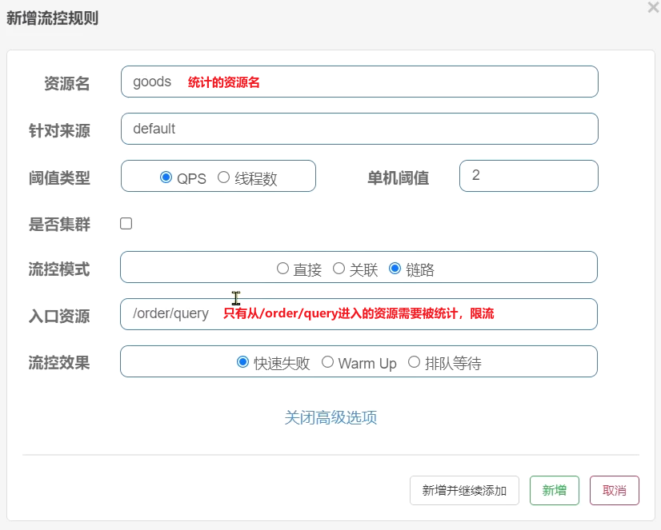

8. **测试**。

<br>

---

[^8.5.2-1]: 默认情况下，OrderService 中的方法是不被 Sentinel 监控的，需要我们自己通过注解来标记要监控的方法。


<div STYLE="page-break-after: always;">
    <br>
	<br>
	<br>
	<br>
	<br>
</div>

### 8.5.3	流控效果

##### 流控效果简介

在流控的高级选项中，还有一个流控效果选项：


流控效果是指请求达到流控阈值时应该采取的措施，包括三种：

- **快速失败**：达到阈值后，新的请求会被立即拒绝并抛出 FlowException 异常。是默认的处理方式。

- **warm up**：预热模式，对超出阈值的请求同样是拒绝并抛出异常。但这种模式阈值会动态变化，从一个较小值逐渐增加到最大阈值。

- **排队等待**：让所有的请求按照先后次序排队执行，两个请求的间隔不能小于指定时长

<br>

##### warm up

阈值一般是一个微服务能承担的最大QPS，但是一个服务刚刚启动时，一切资源尚未初始化（**冷启动**），如果直接将 QPS 跑到最大值，可能导致服务瞬间宕机。

warm up也叫 **预热模式**，是应对服务冷启动的一种方案。请求阈值初始值是 `maxThreshold/coldFactor`，持续指定时长后，逐渐提高到 maxThreshold 值。而 coldFactor 的默认值是3。

例如，我设置QPS的 maxThreshold 为10，预热时间为5秒，那么初始阈值就是 10/3 ，也就是3，然后在5秒后逐渐增长到10.


<br>

##### 排队等待

当请求超过 QPS 阈值时，快速失败和 warm up 会 **拒绝新的请求并抛出异常**。

而排队等待则是让所有请求进入一个队列中，然后按照阈值允许的时间间隔依次执行。后来的请求必须等待前面执行完成，如果请求预期的等待时间超出最大时长，则会被拒绝。

###### 工作原理

假设 QPS = 5，意味着每 200ms 处理一个队列中的请求；timeout = 2000，意味着 **预期等待时长** [^8.5.3-1]超过 2000ms 的请求会被拒绝并抛出异常。

现在，第1秒同时接收到10个请求，但第2秒只有1个请求，此时QPS的曲线这样的：


如果使用队列模式做流控，所有进入的请求都要排队，以固定的200ms的间隔执行，QPS会变的很平滑：


平滑的 QPS 曲线，对于服务器来说是更友好的。

<br>

---

[^8.5.3-1]: 比如现在一下子来了 12  个请求，因为每 200ms 执行一个请求，那么第 6 个请求的**预期等待时长** =  200 * （6 - 1） = 1000ms，第12个请求的预期等待时长 = 200 * （12-1） = 2200ms。

<div STYLE="page-break-after: always;">
    <br>
	<br>
	<br>
	<br>
	<br>
</div>

### 8.5.4	热点参数限流

##### 什么是热点参数限流

热点即经常访问的数据。很多时候我们希望统计某个热点数据中访问频次最高的 Top K 个数据，并对其访问进行限制。比如：

- 商品 ID 为参数，统计一段时间内最常购买的商品 ID 并进行限制。
- 用户 ID 为参数，针对一段时间内频繁访问的用户 ID 进行限制。

热点参数限流会统计传入参数中的热点参数，并根据配置的限流阈值与模式，对包含热点参数的资源调用进行限流。热点参数限流可以看做是一种特殊的流量控制，仅对包含热点参数的资源调用生效。

例如，一个根据 id 查询商品的接口：


访问 /goods/{id} 的请求中，id参数值会有变化，热点参数限流会根据参数值分别统计QPS，统计结果：


当 id=1 的请求触发阈值被限流时，id值不为 1 的请求不受影响。

<br>

##### 配置热点参数限流

1. 在需要配置热点参数限流的方法（资源）上添加 `@SentinelResource` 注解：

```java
    @SentinelResource("hot")
    @GetMapping("/test/{orderId}")
    public Long SentinelTest(@PathVariable("orderId") Long orderId) {

        System.out.println(orderId);
        return orderId;
    }
```

2. 在 Sentinel 控制台添加热点规则
   - **资源名**：在 `@SentinelResource` 注解中配置的资源名。
   - **限流模式** 只有 QPS 模式（这才叫热点）。
   - **参数索引** 代表使用 `@SentinelResource` 注解的方法的参数，0代表第一个参数，1代表第二个参数。
   - **单机阀值以及统计窗口时长** 表示在此窗口时间超过阀值就限流。


3. 测试。

<br>

##### 热点参数限流的高级选项

在实际开发中，可能部分商品是热点商品，例如秒杀商品，我们希望这部分商品的 QPS 限制与其它商品不一样，要允许很多人访问。这就需要配置热点参数限流的高级选项了：


这里的含义是对 0 号的 long 类型参数做统计，每 1 秒相同参数的 QPS 不能超过5，有两个例外：

- 如果参数值是100，则每1秒允许的QPS为10
- 如果参数值是101，则每1秒允许的QPS为15

<br>

---

<div STYLE="page-break-after: always;">
    <br>
	<br>
	<br>
	<br>
	<br>
</div>

## 8.6	降级和隔离

### 8.6.1	FeignClient 整合 Sentinel

##### FeignClient 为什么要整合 Sentinel

SpringCloud 中，微服务调用都是通过Feign来实现的，因此要进行客户端保护必须整合Feign和Sentinel。

<br>

##### 修改配置，开启 sentinel 功能

修改 OrderService 的 application.yml 文件，开启 Feign 的 Sentinel 功能：

```yaml
feign:
  sentinel:
    enabled: true # 开启feign对sentinel的支持
```

<br>

---

<div STYLE="page-break-after: always;">
    <br>
	<br>
	<br>
	<br>
	<br>
</div>

### 8.6.2	编写失败降级逻辑

##### 失败降级逻辑

业务失败后，不能直接报错，而应该返回用户一个友好提示或者默认结果，这个就是失败降级逻辑。

<br>

##### 编写失败降级逻辑的两种方式

给 FeignClient 编写失败降级逻辑有两种方式：

1. FallbackClass，缺点是无法对远程调用的异常做处理
2. FallbackFactory，可以对远程调用的异常做处理，一般选择这种方式。

<br>

##### 例——使用 FallbackFactory 实现失败降级处理

1. 在 feing-api 项目中的 clients 类下创建 fallback 包，在 fallback 包中定义类，实现FallbackFactory

```java
package cn.itcast.feign.clients.fallback;

import cn.itcast.feign.clients.UserClient;
import cn.itcast.feign.pojo.User;
import feign.hystrix.FallbackFactory;
import lombok.extern.slf4j.Slf4j;

@Slf4j
public class UserClientFallbackFactory implements FallbackFactory<UserClient> {
    @Override
    public UserClient create(Throwable throwable) {
        return new UserClient() {
            @Override
            public User findById(Long id) {
                log.error("查询用户异常", throwable);
                return new User();
            }
        };
    }
}

```

2. 在 feing-api 项目中的 DefaultFeignConfiguration 类中将 UserClientFallbackFactory 注册为一个 Bean：

```java
@Bean
public UserClientFallbackFactory userClientFallbackFactory(){
    return new UserClientFallbackFactory();
}
```

3. 在 feing-api 项目中的 UserClient 接口中使用 UserClientFallbackFactory：

```java
import cn.itcast.feign.clients.fallback.UserClientFallbackFactory;
import cn.itcast.feign.pojo.User;
import org.springframework.cloud.openfeign.FeignClient;
import org.springframework.web.bind.annotation.GetMapping;
import org.springframework.web.bind.annotation.PathVariable;

@FeignClient(value = "userservice", fallbackFactory = UserClientFallbackFactory.class)
public interface UserClient {

    @GetMapping("/user/{id}")
    User findById(@PathVariable("id") Long id);
}
```

4. 重启后，访问一次订单查询业务，然后查看sentinel控制台，可以看到新的簇点链路。

<br>

---

<div STYLE="page-break-after: always;">
    <br>
	<br>
	<br>
	<br>
	<br>
</div>

### 8.6.3	线程隔离（舱壁模式）

##### 线程隔离的实现方式

线程隔离有两种方式实现：

- 线程池隔离
- 信号量隔离（Sentinel默认采用）

- **线程池隔离**：给每个服务调用业务分配一个线程池，利用线程池本身实现隔离效果。
- **信号量隔离**：

<br>

##### 线程池隔离

给每个服务调用业务分配一个线程池，利用线程池本身实现隔离效果。

###### 优点

- 轻量级，无额外开销

###### 缺点

- 不支持主动超时
- 不支持异步调用 

###### 适用场景

- 高频调用
- 高扇出[^8.6.3-1]

<br>

##### 信号量隔离

不创建线程池，而是计数器模式，记录业务使用的线程数量，达到信号量上限时，禁止新的请求。

###### 优点

- 支持主动超时
- 支持异步调用 

###### 缺点

- 线程的额外开销比较大

###### 适用场景

- 低扇出

<br>

##### sentinel 的线程隔离

在添加限流规则时，可以选择两种阈值类型：


- QPS：就是每秒的请求数，在快速入门中已经演示过
- 线程数：是该资源能使用用的tomcat线程数的最大值。也就是通过限制线程数量，实现**线程隔离**（舱壁模式）。

###### 例

给 order-service 服务中的 UserClient 的查询用户接口设置流控规则，线程数不能超过 2。然后利用 jemeter 测试。

1. 选择 feign 接口后面的流控按钮，填写表单：


2. 一次性发送 10 个请求，有较大概率并发线程数超过2，而超出的请求会走之前定义的失败降级逻辑。


3. 查看运行结果。


虽然结果都是通过了，不过部分请求得到的响应是降级返回的null信息。

<br>

---

[^8.6.3-1]: 该模块直接调用的下级模块的个数。

<div STYLE="page-break-after: always;">
    <br>
	<br>
	<br>
	<br>
	<br>
</div>

### 8.6.4	熔断降级

##### 熔断降级的实现原理

熔断降级是解决雪崩问题的重要手段。其思路是由 **断路器** 统计服务调用的异常比例、慢请求比例，如果超出阈值则会 **熔断** 该服务。即拦截访问该服务的一切请求；而当服务恢复时，断路器会放行访问该服务的请求。

<br>

##### 状态机

断路器控制熔断和放行是通过状态机来完成的：


状态机包括三个状态：

- **closed**：关闭状态，断路器放行所有请求，并开始统计异常比例、慢请求比例。超过阈值则切换到open状态
- **open**：打开状态，服务调用被 **熔断**，访问被熔断服务的请求会被拒绝，快速失败，直接走降级逻辑。Open 状态 5 秒后会进入 half-open 状态
- **half-open**：半开状态，放行一次请求，根据执行结果来判断接下来的操作。
  - 请求成功：则切换到 closed 状态
  - 请求失败：则切换到 open 状态

<br>

##### 断路器熔断策略

断路器熔断策略有三种：

- 慢调用
- 异常比例
- 异常数

<br>

##### 慢调用

业务的响应时长（RT）大于指定时长的请求认定为慢调用请求。在指定时间内，如果请求数量超过设定的最小数量，慢调用比例大于设定的阈值，则触发熔断。

###### 设置慢调用


- 设置 RT 超过 500ms 的调用是慢调用
- 统计最近 10000ms 内的请求，如果请求量超过10次，并且慢调用比例不低于0.5，则触发熔断。
- 熔断时长为5秒。然后进入 half-open 状态，放行一次请求做测试。

###### 例

给 UserClient 的查询用户接口设置降级规则，慢调用的 RT 阈值为 50ms，统计时间为 1 秒，最小请求数量为 5，失败阈值比例为 0.4，熔断时长为 5。

1. 修改 user-service中 的 `/user/{id}` 这个接口的业务。通过休眠模拟一个延迟时间：

```java
@GetMapping("/{id}")
public User queryById(@PathVariable("id")Long id) throw InterruptedException{
	if(id == 1){
	//id = 1 时，休眠 60ms
	Thread.sleap(60);
	}
	return userService.queryBuId(id);
}
```

2. 给 feign 接口设置降级规则，设置超过 50ms 的请求都会被认为是慢请求：

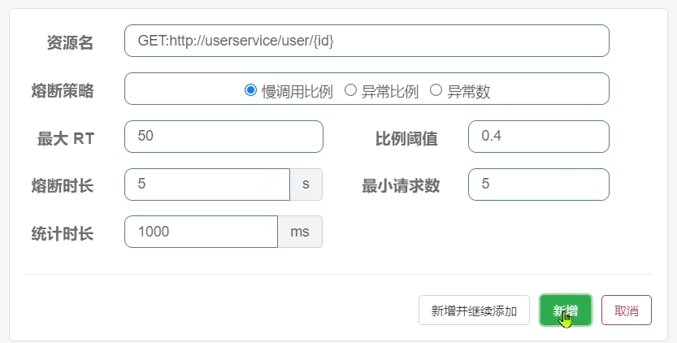

3. 测试，访问http://localhost:8088/order/101，快速刷新5次。结果是触发了熔断，请求时长缩短至 5ms，快速失败了，并且走降级逻辑，返回的 null。
4. 访问：http://localhost:8088/order/102，竟然也被熔断了

<br>

##### 异常比例、异常数

统计指定时间内的调用，如果调用次数超过指定请求数，并且出现异常的比例达到设定的比例阈值（或超过指定异常数），则触发熔断。

###### 设置异常比例


统计最近 1000ms 内的请求，如果请求量超过 10 次，并且异常比例不低于 0.4，则触发熔断。

###### 设置异常数


统计最近1000ms内的请求，如果请求量超过10次，并且异常比例不低于2次，则触发熔断。

<br>

###### 例

给 UserClient 的查询用户接口设置降级规则，统计时间为 1 秒，最小请求数量为 5，失败阈值比例为 0.4，熔断时长为 5s

1. 首先，修改 user-service 中的 `/user/{id}` 这个接口的业务。手动抛出异常，以触发异常比例的熔断：

```java
@GetMapping("/{id}")
public User queryById(@PathVariable("id")Long id) throw InterruptedException{
	if(id == 1){
	//id = 1 时，休眠 60ms
	Thread.sleap(60);
	}else if(id == 2){
		throw new RuntimeException("故意抛出异常，触发异常比例熔断");
	}
	return userService.queryBuId(id);
}
```

2. 给 feign 接口设置降级规则，在5次请求中，只要异常比例超过0.4，也就是有2次以上的异常，就会触发熔断：


3. 访问：http://localhost:8088/order/102，快速刷新5次，触发熔断。
4. 访问：http://localhost:8088/order/103，发现也被熔断了。

<br>

---

<div STYLE="page-break-after: always;">
    <br>
	<br>
	<br>
	<br>
	<br>
</div>

## 8.7	授权规则

##### 授权规则模式

授权规则可以对调用方的来源做控制，有白名单和黑名单两种方式。

- 白名单：来源（origin）在白名单内的调用者允许访问
- 黑名单：来源（origin）在黑名单内的调用者不允许访问

<br>

##### 设置授权规则

点击 Sentinel 左侧菜单的授权，可以看到授权规则：


- 资源名：就是受保护的资源，例如/order/{orderId}
- 流控应用：是来源者的名单，
  - 如果是勾选白名单，则名单中的来源被许可访问。
  - 如果是勾选黑名单，则名单中的来源被禁止访问。

举例来说，我们允许请求从 gateway 到 order-service，不允许浏览器访问 order-service，那么白名单中就要填写 **网关的来源名称（origin）**。

<br>

##### 获取 origin

Sentinel 通过 RequestOriginParser 这个接口的 parseOrigin 来获取请求的来源。

```java
public interface RequestOriginParser {
    /**
     * 从请求request对象中获取origin，获取方式自定义
     */
    String parseOrigin(HttpServletRequest request);
}
```

- 这个方法的作用就是从 request 对象中，获取请求者的origin值并返回。**默认情况下，sentinel 不管请求者从哪里来，返回值永远是 default**，也就是说一切请求的来源都被认为是一样的值 default。

###### 自定义 RequestOriginParser 接口的实现

通过自定义该接口的实现，让 **不同的请求，返回不同的origin**。

1. 在 order-service 服务中，我们定义一个RequestOriginParser的实现类：

```java
package cn.itcast.order.sentinel;

import com.alibaba.csp.sentinel.adapter.spring.webmvc.callback.RequestOriginParser;
import org.springframework.stereotype.Component;
import org.springframework.util.StringUtils;

import javax.servlet.http.HttpServletRequest;

@Component
public class HeaderOriginParser implements RequestOriginParser {
    @Override
    public String parseOrigin(HttpServletRequest request) {
        // 1.获取请求头
        String origin = request.getHeader("origin");
        // 2.非空判断
        if (StringUtils.isEmpty(origin)) {
            origin = "blank";
        }
        return origin;
    }
}
```

2. 既然获取请求 origin 的方式是从 reques-header 中获取 origin 值，我们必须让 **所有从 gateway 路由到微服务的请求都带上 origin 头**。这通过 GatewayFilter 实现。修改 gateway 服务中的 application.yml，添加一个 defaultFilter：

```yaml
spring:
  cloud:
    gateway:
      default-filters:
        - AddRequestHeader=origin,gateway #这样从 gateway 路由的所有请求都会带上origin头，值为 gateway。而从其它地方到达微服务的请求则没有这个头。
      routes:
       # ...略
```

3. 添加一个授权规则，放行 origin 值为 gateway 的请求。


4. 测试，直接访问微服务，请求被拦截，通过网关访问，不受影响。

<br>

##### 自定义异常结果

如果要自定义异常时的返回结果，需要实现 BlockExceptionHandler 接口：

```
public interface BlockExceptionHandler {
    /**
     * 处理请求被限流、降级、授权拦截时抛出的异常：BlockException
     */
    void handle(HttpServletRequest request, HttpServletResponse response, BlockException e) throws Exception;
}
```

这个方法有三个参数：

- HttpServletRequest request：request对象
- HttpServletResponse response：response对象
- BlockException e：被sentinel拦截时抛出的异常

这里的BlockException包含多个不同的子类：

| **异常**             | **说明**           |
| -------------------- | ------------------ |
| FlowException        | 限流异常           |
| ParamFlowException   | 热点参数限流的异常 |
| DegradeException     | 降级异常           |
| AuthorityException   | 授权规则异常       |
| SystemBlockException | 系统规则异常       |

###### 例

1. 在 order-service 定义一个自定义异常处理类：

```java
package cn.itcast.order.sentinel;

import com.alibaba.csp.sentinel.adapter.spring.webmvc.callback.BlockExceptionHandler;
import com.alibaba.csp.sentinel.slots.block.BlockException;
import com.alibaba.csp.sentinel.slots.block.authority.AuthorityException;
import com.alibaba.csp.sentinel.slots.block.degrade.DegradeException;
import com.alibaba.csp.sentinel.slots.block.flow.FlowException;
import com.alibaba.csp.sentinel.slots.block.flow.param.ParamFlowException;
import org.springframework.stereotype.Component;

import javax.servlet.http.HttpServletRequest;
import javax.servlet.http.HttpServletResponse;

@Component
public class SentinelExceptionHandler implements BlockExceptionHandler {
    @Override
    public void handle(HttpServletRequest request, HttpServletResponse response, BlockException e) throws Exception {
        String msg = "未知异常";
        int status = 429;

        if (e instanceof FlowException) {
            msg = "请求被限流了";
        } else if (e instanceof ParamFlowException) {
            msg = "请求被热点参数限流";
        } else if (e instanceof DegradeException) {
            msg = "请求被降级了";
        } else if (e instanceof AuthorityException) {
            msg = "没有权限访问";
            status = 401;
        }

        response.setContentType("application/json;charset=utf-8");
        response.setStatus(status);
        response.getWriter().println("{\"msg\": " + msg + ", \"status\": " + status + "}");
    }
}
```

2. 重启测试，在不同场景下，会返回不同的异常消息。

<br>

----

<div STYLE="page-break-after: always;">
    <br>
	<br>
	<br>
	<br>
	<br>
</div>

## 8.8	规则持久化

##### sentinel 规则默认是内存存储

sentinel 的所有规则默认是内存存储，重启后所有规则都会丢失。在生产环境下，我们必须确保这些规则的持久化，避免丢失。

<br>

##### 规则管理模式

规则是否能持久化，取决于规则管理模式，sentinel支持三种规则管理模式：

- 原始模式：Sentinel 的默认模式，将规则保存在内存，重启服务会丢失。
- pull模式
- push模式

<br>

##### pull 模式

控制台将配置的规则推送到 Sentinel 客户端，而客户端会将配置规则保存在本地文件或数据库中。以后会定时去本地文件或数据库中查询，更新本地规则。


<br>

##### push 模式

控制台将配置规则推送到远程配置中心，例如 Nacos。Sentinel 客户端监听 Nacos，获取配置变更的推送消息，完成本地配置更新。

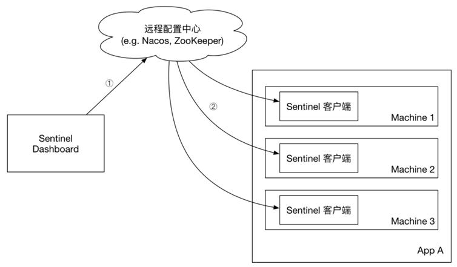

<br>

##### 例——实现 push 模式

1. 在order-service中引入sentinel监听nacos的依赖


```xml
<dependency>
    <groupId>com.alibaba.csp</groupId>
    <artifactId>sentinel-datasource-nacos</artifactId>
</dependency>
```

2. 在order-service中的application.yml文件配置nacos地址及监听的配置信息：

```yaml
spring:
  cloud:
    sentinel:
      datasource:
        flow:
          nacos:
            server-addr: localhost:8848 # nacos地址
            dataId: orderservice-flow-rules
            groupId: SENTINEL_GROUP
            rule-type: flow # 还可以是：degrade、authority、param-flow
```

3. SentinelDashboard默认不支持nacos的持久化，**需要修改源码**。
4. 下载 sentinel 源码包后解压。
5. 在 sentinel-dashboard 源码的 pom 文件中，nacos 的依赖默认的 scope 是 test，只能在测试时使用，这里要去除。

```xml
<!--修改前-->
<dependency>
    <groupId>com.alibaba.csp</groupId>
    <artifactId>sentinel-datasource-nacos</artifactId>
    <scope>test</scope><!-- 将sentinel-datasource-nacos依赖的scope去掉 -->
</dependency>

<!--修改后-->
<dependency>
    <groupId>com.alibaba.csp</groupId>
    <artifactId>sentinel-datasource-nacos</artifactId>
</dependency>
```

6. 在 sentinel-dashboard 的 test 包下，已经编写了对 nacos 的支持，我们需要将其拷贝到 main 下：


7. 修改测试代码中的 NacosConfig 类，修改其中的 nacos 地址，让其读取 application.properties 中的配置：


8. 在 sentinel-dashboard 的 application.properties 中添加 nacos 地址配置：

```yaml
nacos.addr=localhost:8848
```

9. 修改com.alibaba.csp.sentinel.dashboard.controller.v2包下的FlowControllerV2类，让我们添加的Nacos数据源生效：


10. 修改前端页面，添加一个支持 nacos 的菜单。修改src/main/webapp/resources/app/scripts/directives/sidebar/目录下的sidebar.html文件。将其中的这部分注释打开：

    

    修改其中的文本：

    

11. 运行 IDEA 中的 maven 插件，编译和打包修改好的 Sentinel-Dashboard。

12. 启动，启动方式跟官方一样：

    ```sh
    java -jar sentinel-dashboard.jar
    ```

<br>

---

<div STYLE="page-break-after: always;">
    <br>
	<br>
	<br>
	<br>
	<br>
</div>

# 9	Seata 分布式事务

## 9.1	概述

##### 什么是 Seata

Seata是 2019 年 1 月份蚂蚁金服和阿里巴巴共同开源的分布式事务解决方案。致力于提供高性能和简单易用的分布式事务服务，为用户打造一站式的分布式解决方案。

<br>

##### 官网地址

http://seata.io/

<br>

##### Seata 架构

Seata 事务管理中有三个重要的角色：

- **TC (Transaction Coordinator，事务协调者)  **：维护全局和分支事务的状态，协调全局事务提交或回滚。
- **TM (Transaction Manager，事务管理器) **：定义全局事务的范围、开始全局事务、提交或回滚全局事务。
- **RM (Resource Manager，资源管理器)**：管理分支事务处理的资源，与 TC 交谈以注册分支事务和报告分支事务的状态，并驱动分支事务提交或回滚。

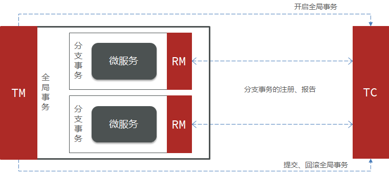

<br>

##### Seata 提供的分布式事务解决方案

Seata 提供了四种不同的分布式事务解决方案

- XA 模式：强一致性分阶段事务模式，牺牲了一定的可用性，无业务侵入。
- TCC 模式：最终一致的分阶段事务模式，有业务侵入。
- AT 模式：最终一致的分阶段事务模式，无业务侵入，也是 Seata 的默认模式
- SAGA 模式：长事务模式，有业务侵入。

<br>

##### 四种分布式事务解决方案之间的对比

|              | XA                             | AT                                           | TCC                                                          | SAGA                                                         |
| ------------ | ------------------------------ | -------------------------------------------- | ------------------------------------------------------------ | ------------------------------------------------------------ |
| **一致性**   | 强一致                         | 弱一致                                       | 弱一致                                                       | 最终一致                                                     |
| **隔离性**   | 完全隔离                       | 基于全局锁隔离                               | 基于资源预留隔离                                             | 无隔离                                                       |
| **代码侵入** | 无                             | 无                                           | 有，要编写三个接口                                           | 有，要编写状态机和补偿业务                                   |
| **性能**     | 差                             | 好                                           | 非常好                                                       | 非常好                                                       |
| **场景**     | 对一致性、隔离性有高要求的业务 | 基于关系型数据库的大多数分布式事务场景都可以 | 1.对性能要求较高的事务。 <br>2.有非关系型数据库要参与的事务。 | 1.业务流程长、业务流程多 <br/>2.参与者包含其它公司或遗留系统服务，无法提供  TCC  模式要求的三个接口 |

<br>

----

<div STYLE="page-break-after: always;">
    <br>
	<br>
	<br>
	<br>
	<br>
</div>
## 9.2	Seata 的部署与集成基础

##### 下载地址

[http](http://seata.io/zh-cn/blog/download.html)[://seata.io/zh-cn/blog/download](http://seata.io/zh-cn/blog/download.html)[.](http://seata.io/zh-cn/blog/download.html)[html](http://seata.io/zh-cn/blog/download.html)

<br>

##### 解压

下载完成后在非中文目录解压缩压缩包，其目录结构如下：


<br>

##### 修改配置

修改 conf 目录下的 registry.conf 文件，内容如下：

```properties
registry {
  # tc服务的注册中心类，这里选择nacos，也可以是eureka、zookeeper等
  type = "nacos"

  nacos {
    # seata tc 服务注册到 nacos的服务名称，可以自定义
    application = "seata-tc-server"
    serverAddr = "127.0.0.1:8848"
    group = "DEFAULT_GROUP"
    namespace = ""
    cluster = "SH"
    username = "nacos"
    password = "nacos"
  }
}

config {
  # 读取tc服务端的配置文件的方式，这里是从nacos配置中心读取，这样如果tc是集群，可以共享配置
  type = "nacos"
  # 配置nacos地址等信息
  nacos {
    serverAddr = "127.0.0.1:8848"
    namespace = ""
    group = "SEATA_GROUP"
    username = "nacos"
    password = "nacos"
    dataId = "seataServer.properties"
  }
}
```

<br>

##### 在 nacos 添加配置

特别注意，为了让 tc 服务的集群可以共享配置，我们选择了 nacos 作为统一配置中心。因此服务端配置文件 seataServer.properties 文件需要在 nacos 中配好。

格式如下：


配置内容如下：

```properties
# 数据存储方式，db代表数据库
store.mode=db
store.db.datasource=druid
store.db.dbType=mysql
store.db.driverClassName=com.mysql.jdbc.Driver
store.db.url=jdbc:mysql://127.0.0.1:3306/seata?useUnicode=true&rewriteBatchedStatements=true
store.db.user=root
store.db.password=123
store.db.minConn=5
store.db.maxConn=30
store.db.globalTable=global_table
store.db.branchTable=branch_table
store.db.queryLimit=100
store.db.lockTable=lock_table
store.db.maxWait=5000
# 事务、日志等配置
server.recovery.committingRetryPeriod=1000
server.recovery.asynCommittingRetryPeriod=1000
server.recovery.rollbackingRetryPeriod=1000
server.recovery.timeoutRetryPeriod=1000
server.maxCommitRetryTimeout=-1
server.maxRollbackRetryTimeout=-1
server.rollbackRetryTimeoutUnlockEnable=false
server.undo.logSaveDays=7
server.undo.logDeletePeriod=86400000

# 客户端与服务端传输方式
transport.serialization=seata
transport.compressor=none
# 关闭metrics功能，提高性能
metrics.enabled=false
metrics.registryType=compact
metrics.exporterList=prometheus
metrics.exporterPrometheusPort=9898
```

其中的 **数据库地址、用户名、密码** 都需要修改成你自己的数据库信息。

<br>

##### 创建数据库表

特别注意，tc 服务在管理分布式事务时，需要记录事务相关数据到数据库中，你需要提前创建好这些表。

新建一个名为 seata 的数据库，运行 sql 文件[seata-tc-server.sql](attachment\eg_2\sql)：


这些表主要记录全局事务、分支事务、全局锁信息：

```mysql
SET NAMES utf8mb4;
SET FOREIGN_KEY_CHECKS = 0;

-- ----------------------------
-- 分支事务表
-- ----------------------------
DROP TABLE IF EXISTS `branch_table`;
CREATE TABLE `branch_table`  (
  `branch_id` bigint(20) NOT NULL,
  `xid` varchar(128) CHARACTER SET utf8 COLLATE utf8_general_ci NOT NULL,
  `transaction_id` bigint(20) NULL DEFAULT NULL,
  `resource_group_id` varchar(32) CHARACTER SET utf8 COLLATE utf8_general_ci NULL DEFAULT NULL,
  `resource_id` varchar(256) CHARACTER SET utf8 COLLATE utf8_general_ci NULL DEFAULT NULL,
  `branch_type` varchar(8) CHARACTER SET utf8 COLLATE utf8_general_ci NULL DEFAULT NULL,
  `status` tinyint(4) NULL DEFAULT NULL,
  `client_id` varchar(64) CHARACTER SET utf8 COLLATE utf8_general_ci NULL DEFAULT NULL,
  `application_data` varchar(2000) CHARACTER SET utf8 COLLATE utf8_general_ci NULL DEFAULT NULL,
  `gmt_create` datetime(6) NULL DEFAULT NULL,
  `gmt_modified` datetime(6) NULL DEFAULT NULL,
  PRIMARY KEY (`branch_id`) USING BTREE,
  INDEX `idx_xid`(`xid`) USING BTREE
) ENGINE = InnoDB CHARACTER SET = utf8 COLLATE = utf8_general_ci ROW_FORMAT = Compact;

-- ----------------------------
-- 全局事务表
-- ----------------------------
DROP TABLE IF EXISTS `global_table`;
CREATE TABLE `global_table`  (
  `xid` varchar(128) CHARACTER SET utf8 COLLATE utf8_general_ci NOT NULL,
  `transaction_id` bigint(20) NULL DEFAULT NULL,
  `status` tinyint(4) NOT NULL,
  `application_id` varchar(32) CHARACTER SET utf8 COLLATE utf8_general_ci NULL DEFAULT NULL,
  `transaction_service_group` varchar(32) CHARACTER SET utf8 COLLATE utf8_general_ci NULL DEFAULT NULL,
  `transaction_name` varchar(128) CHARACTER SET utf8 COLLATE utf8_general_ci NULL DEFAULT NULL,
  `timeout` int(11) NULL DEFAULT NULL,
  `begin_time` bigint(20) NULL DEFAULT NULL,
  `application_data` varchar(2000) CHARACTER SET utf8 COLLATE utf8_general_ci NULL DEFAULT NULL,
  `gmt_create` datetime NULL DEFAULT NULL,
  `gmt_modified` datetime NULL DEFAULT NULL,
  PRIMARY KEY (`xid`) USING BTREE,
  INDEX `idx_gmt_modified_status`(`gmt_modified`, `status`) USING BTREE,
  INDEX `idx_transaction_id`(`transaction_id`) USING BTREE
) ENGINE = InnoDB CHARACTER SET = utf8 COLLATE = utf8_general_ci ROW_FORMAT = Compact;

SET FOREIGN_KEY_CHECKS = 1;
```

<br>

##### 启动TC服务

进入bin目录，运行其中的seata-server.bat即可：


启动成功后，seata-server应该已经注册到nacos注册中心了。

打开浏览器，访问nacos地址：http://localhost:8848，然后进入服务列表页面，可以看到seata-tc-server的信息：


<br>

##### 导入示例项目

微服务下单业务，在下单时会调用订单服务，创建订单并写入数据库。然后订单服务调用账户服务和库存服务：

- 账户服务负责扣减用户余额
- 库存服务负责扣减商品库存

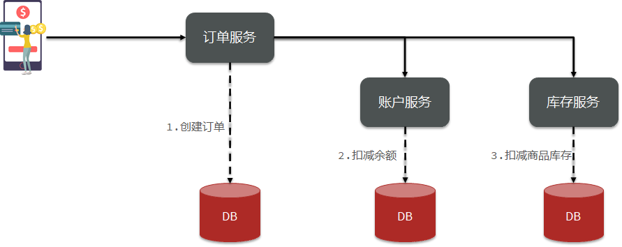

1. 创建数据库 seata_demo，导入SQL 文件 [seata-demo.sql](attachment\eg_2\sql) 。
2. 导入微服务 [seata-demo](attachment\eg_2\seata-demo)

<br>

##### 微服务集成 Seata

1. 在微服务模块中引入 seata 相关依赖

```xml
 <!--seata-->
        <dependency>
            <groupId>com.alibaba.cloud</groupId>
            <artifactId>spring-cloud-starter-alibaba-seata</artifactId>
            <exclusions>
                <!--版本较低，1.3.0，因此排除--> 
                <exclusion>
                    <artifactId>seata-spring-boot-starter</artifactId>
                    <groupId>io.seata</groupId>
                </exclusion>
            </exclusions>
        </dependency>
		<!--seata starter 采用1.4.2版本-->
        <dependency>
            <groupId>io.seata</groupId>
            <artifactId>seata-spring-boot-starter</artifactId>
            <version>${seata.version}</version>
        </dependency>
```

2. 配置 application.yml，让微服务通过注册中心找到 seata-tc-server

```yaml
seata:
  registry: 
  # TC服务注册中心的配置，微服务根据这些信息去注册中心获取tc服务地址
    # 参考tc服务自己的registry.conf中的配置
    type: nacos
    nacos: # tc
      server-addr: 127.0.0.1:8848
      namespace: ""
      group: DEFAULT_GROUP
      application: seata-tc-server # tc服务在nacos中的服务名称
      cluster: SH
  tx-service-group: seata-demo # 事务组，根据这个获取tc服务的cluster名称
  service:
    vgroup-mapping: # 事务组与TC服务cluster的映射关系
      seata-demo: SH
```


<br>

---

<div STYLE="page-break-after: always;">
    <br>
	<br>
	<br>
	<br>
	<br>
</div>

## 9.3	XA 模式

##### XA 模式原理

XA 规范 是 X/Open 组织定义的分布式事务处理（DTP，Distributed Transaction Processing）标准，XA 规范描述了全局的 TM 与局部的 RM 之间的接口，几乎所有主流的数据库都对 XA 规范提供了支持。

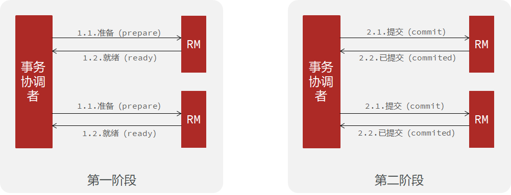

<br>

##### XA 模式的优缺点

###### 优点

- 事务的强一致性，满足 ACID 原则。

- 常用数据库都支持，实现简单，并且没有代码侵入

##### 缺点

- 因为一阶段需要锁定数据库资源，等待二阶段结束才释放，性能较差

- 依赖关系型数据库实现事务

<br>

##### seata 的 XA 模式

seata 的 XA 模式做了一些调整，但大体相似。

RM 在一阶段的工作：

- 注册分支事务到 TC
- 执行分支业务 sql 但不提交
- 报告执行状态到 TC

TC 在二阶段的工作：

- TC 检测各分支事务执行状态。如果都成功，通知所有 RM 提交事务，如果有失败，通知所有RM回滚事务。

RM 在二阶段的工作：

- 接收 TC 指令，提交或回滚事务

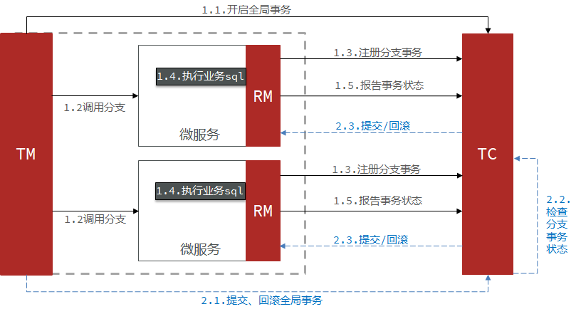

<br>

##### 实现 XA 模式

Seata 的 starter 已经完成了 XA 模式的自动装配，实现非常简单，步骤如下：

1.修改每个参与事务的微服务的 application.yml 文件（），开启XA模式：

```yaml
seata:
	data-source-proxy-mode: XA # 开启数据源代理的XA模式
```

2. 给发起全局事务的入口方法添加 `@GlobalTransactional` 注解，本例中是 OrderServiceImpl 中的 create 方法：

```java
@Override
@GlobalTransactionalpublic Long create(Order order) {
	// 创建订单
	orderMapper.insert(order);
	// 扣余额 ...略 
    // 扣减库存 ...略    
    return order.getId();
}
```

3. 重启服务并测试

<br>

---

<div STYLE="page-break-after: always;">
    <br>
	<br>
	<br>
	<br>
	<br>
</div>

## 9.4	AT 模式

##### AT 模式原理

AT 模式同样是分阶段提交的事务模型，不过缺弥补了 XA 模型中资源锁定周期过长的缺陷。

阶段一 RM 的工作：

- 注册分支事务
- 记录 undo-log（数据快照）
- 执行业务 sql 并提交
- 报告事务状态

阶段二提交时 RM 的工作：

- 删除 undo-log 即可

阶段二回滚时RM的工作：

- 根据 undo-log 恢复数据到更新前


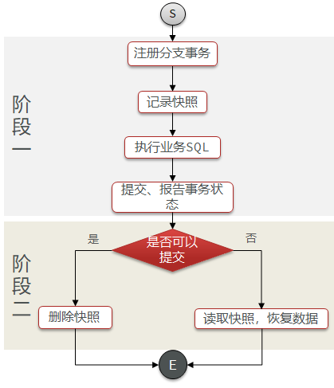

<br>

##### AT 模式与 XA 模式之间的区别

- XA 模式一阶段不提交事务，锁定资源；AT 模式一阶段直接提交，不锁定资源。
- XA 模式依赖数据库机制实现回滚；AT 模式利用数据快照实现数据回滚。
- XA 模式强一致；AT 模式最终一致

<br>

##### AT 模式的脏写问题


按照以上步骤执行的事务，最后将导致回滚、

<br>

##### AT模式的写隔离

###### 非 seata 管理的全局事务


###### 全局锁

由 TC 记录当前正在操作某行数据的事务，该事务持有全局锁，具备执行权。


<br>

##### AT模式的优缺点

###### 优点

- 一阶段完成直接提交事务，释放数据库资源，性能比较好
- 利用全局锁实现读写隔离
- 没有代码侵入，框架自动完成回滚和提交

###### 缺点

- 两阶段之间属于软状态，属于最终一致
- 框架的快照功能会影响性能，但比XA模式要好很多

<br>

##### 实现 AT 模式

AT模式中的快照生成、回滚等动作都是由框架自动完成，**没有任何代码侵入**，因此实现非常简单。

1. 导入 Sql 文件：[seata-at.sql](attachment\eg_2\sql)，其中 lock_table 导入到 TC 服务关联的数据库，undo_log 表导入到微服务关联的数据库。

2. 修改 application.yml 文件，将事务模式修改为 AT 模式即可。

3. 重启服务并测试。

<br>

----

<div STYLE="page-break-after: always;">
    <br>
	<br>
	<br>
	<br>
	<br>
</div>

## 9.5	TCC 模式

##### TCC 模式原理

TCC模式与AT模式非常相似，每阶段都是独立事务，不同的是 TCC 通过人工编码来实现数据恢复。需要实现三个方法：

- Try：资源的检测和预留； 
- Confirm：完成资源操作业务；要求 Try 成功 Confirm 一定要能成功。
- Cancel：预留资源释放，可以理解为try的反向操作。

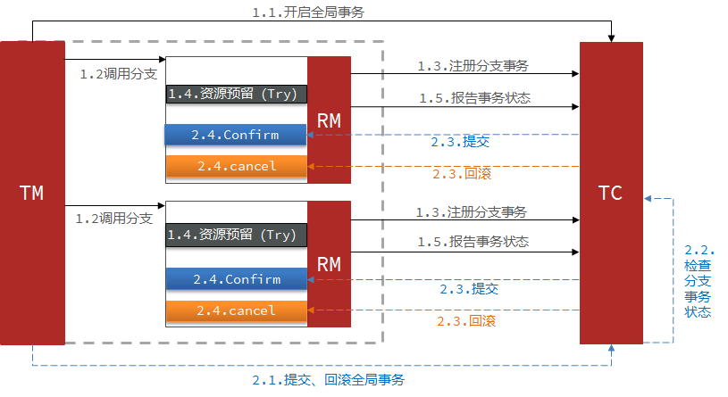

举例，一个扣减用户余额的业务。假设账户A原来余额是100，需要余额扣减30元。

- 阶段一（ Try ）：检查余额是否充足，如果充足则冻结金额增加30元，可用余额扣除30。
- 阶段二：假如要提交（Confirm），则冻结金额扣减30
- 阶段二：如果要回滚（Cancel），则冻结金额扣减30，可用余额增加30

<br>

##### TCC 的优缺点

###### 优点

- 一阶段完成直接提交事务，释放数据库资源，性能好
- 相比 AT 模型，无需生成快照，无需使用全局锁，性能最强
- 不依赖数据库事务，而是依赖补偿操作，可以用于非事务型数据库

###### 缺点

- 有代码侵入，需要人为编写try、Confirm和Cancel接口，太麻烦
- 软状态，事务是最终一致
- 需要考虑Confirm和Cancel的失败情况，做好幂等处理

<br>

##### TCC 的空回滚和业务悬挂

当某分支事务的 try 阶段阻塞时，可能导致全局事务超时而触发二阶段的 cancel 操作。在未执行 try 操作时先执行了 cancel 操作，这时 cancel 不能做回滚，即 **空回滚**。

对于已经空回滚的业务，如果以后继续执行 try，就永远不可能 confirm 或 cancel，这就是业务悬挂。应当阻止执行空回滚后的 try 操作，避免悬挂。


<br>

##### 例——改造account-service服务，利用TCC实现分布式事务

###### 需求

- 修改 account-service，编写 try、confirm、cancel 逻辑

- try业务：添加冻结金额，扣减可用金额
- confirm 业务：删除冻结金额
- cancel 业务：删除冻结金额，恢复可用金额
- 保证 confirm、cancel 接口的幂等性
- 允许空回滚
- 拒绝业务悬挂

###### 业务分析

为了实现空回滚、防止业务悬挂，以及幂等性要求。我们必须在数据库记录冻结金额的同时，记录当前事务id和执行状态，为此我们设计了一张表：

```sql
CREATE TABLE `account_freeze_tbl` (
  `xid` varchar(128) NOT NULL,
  `user_id` varchar(255) DEFAULT NULL COMMENT '用户id',
  `freeze_money` int(11) unsigned DEFAULT '0' COMMENT '冻结金额',
  `state` int(1) DEFAULT NULL COMMENT '事务状态，0:try，1:confirm，2:cancel',
  PRIMARY KEY (`xid`) USING BTREE
) ENGINE=InnoDB DEFAULT CHARSET=utf8 ROW_FORMAT=COMPACT;
```

Try业务：

- 记录冻结金额和事务状态到 account_freeze 表
- 扣减 account 表可用金额

Confirm 业务：

- 根据 xid 删除 account_freeze 表的冻结记录

Cancel 业务：

- 修改 account_freeze 表，冻结金额为 0，state 为2
- 修改 account 表，恢复可用金额

如何判断是否空回滚：

- cancel 业务中，根据 xid 查询 account_freeze，如果为 null 则说明 try 还没做，需要空回滚。

如何避免业务悬挂：

- try业务中，根据 xid 查询 account_freeze ，如果已经存在则证明 Cancel 已经执行，拒绝执行 try 业务。

###### 实现

声明 TCC 接口，TCC 的 Try、Confirm、Cancel 方法都需要在接口中基于注解来声明，语法如下：

```java
@LocalTCC
public interface TCCService {
	/**
    * Try逻辑，@TwoPhaseBusinessAction中的name属性要与当前方法名一致，用于指定Try逻辑对应的方法
    */    
    @TwoPhaseBusinessAction(name = "prepare", commitMethod = "confirm", rollbackMethod = "cancel")
    void prepare(@BusinessActionContextParameter(paramName = "param") String param);
    
    /**
    * 二阶段confirm确认方法、可以另命名，但要保证与commitMethod一致
    *     
    * @param context 上下文,可以传递try方法的参数
    * @return boolean 执行是否成功     
    */
    boolean confirm (BusinessActionContext context);
    
    /**
    * 二阶段回滚方法，要保证与rollbackMethod一致
    */
    boolean cancel (BusinessActionContext context);
}
```

<br>

----

<div STYLE="page-break-after: always;">
    <br>
	<br>
	<br>
	<br>
	<br>
</div>

## 9.6	Saga 模式

##### Saga 模式原理

Saga 模式是 SEATA 提供的长事务解决方案。也分为两个阶段：

- 一阶段：直接提交本地事务
- 二阶段：成功则什么都不做；失败则通过编写补偿业务来回滚


<br>

##### Saga 模式的优缺点

###### 优点

- 事务参与者可以基于事件驱动实现异步调用，吞吐高
- 一阶段直接提交事务，无锁，性能好
- 不用编写TCC中的三个阶段，实现简单

###### 缺点

- 软状态持续时间不确定，时效性差

- 没有锁，没有事务隔离，会有脏写

<br>

---

<div STYLE="page-break-after: always;">
    <br>
	<br>
	<br>
	<br>
	<br>
</div>

## 9.7	TC 的异地多机房容灾架构

##### TC 服务不能宕机

TC 服务作为 Seata 的核心服务，一定要保证高可用和异地容灾。


<br>

##### 模拟异地容灾的TC集群

计划启动两台seata的tc服务节点：

| 节点名称 | ip地址    | 端口号 | 集群名称 |
| -------- | --------- | ------ | -------- |
| seata    | 127.0.0.1 | 8091   | SH       |
| seata2   | 127.0.0.1 | 8092   | HZ       |

之前我们已经启动了一台seata服务，端口是8091，集群名为SH。

现在，将seata目录复制一份，起名为seata2

修改seata2/conf/registry.conf内容如下：

```nginx
registry {
  # tc服务的注册中心类，这里选择nacos，也可以是eureka、zookeeper等
  type = "nacos"

  nacos {
    # seata tc 服务注册到 nacos的服务名称，可以自定义
    application = "seata-tc-server"
    serverAddr = "127.0.0.1:8848"
    group = "DEFAULT_GROUP"
    namespace = ""
    cluster = "HZ"
    username = "nacos"
    password = "nacos"
  }
}

config {
  # 读取tc服务端的配置文件的方式，这里是从nacos配置中心读取，这样如果tc是集群，可以共享配置
  type = "nacos"
  # 配置nacos地址等信息
  nacos {
    serverAddr = "127.0.0.1:8848"
    namespace = ""
    group = "SEATA_GROUP"
    username = "nacos"
    password = "nacos"
    dataId = "seataServer.properties"
  }
}
```

进入seata2/bin目录，然后运行命令：

```powershell
seata-server.bat -p 8092
```

打开nacos控制台，查看服务列表：


点进详情查看：


###### 将事务组映射配置到nacos

接下来，我们需要将tx-service-group与cluster的映射关系都配置到nacos配置中心。

新建一个配置：


配置的内容如下：

```properties
# 事务组映射关系
service.vgroupMapping.seata-demo=SH

service.enableDegrade=false
service.disableGlobalTransaction=false
# 与TC服务的通信配置
transport.type=TCP
transport.server=NIO
transport.heartbeat=true
transport.enableClientBatchSendRequest=false
transport.threadFactory.bossThreadPrefix=NettyBoss
transport.threadFactory.workerThreadPrefix=NettyServerNIOWorker
transport.threadFactory.serverExecutorThreadPrefix=NettyServerBizHandler
transport.threadFactory.shareBossWorker=false
transport.threadFactory.clientSelectorThreadPrefix=NettyClientSelector
transport.threadFactory.clientSelectorThreadSize=1
transport.threadFactory.clientWorkerThreadPrefix=NettyClientWorkerThread
transport.threadFactory.bossThreadSize=1
transport.threadFactory.workerThreadSize=default
transport.shutdown.wait=3
# RM配置
client.rm.asyncCommitBufferLimit=10000
client.rm.lock.retryInterval=10
client.rm.lock.retryTimes=30
client.rm.lock.retryPolicyBranchRollbackOnConflict=true
client.rm.reportRetryCount=5
client.rm.tableMetaCheckEnable=false
client.rm.tableMetaCheckerInterval=60000
client.rm.sqlParserType=druid
client.rm.reportSuccessEnable=false
client.rm.sagaBranchRegisterEnable=false
# TM配置
client.tm.commitRetryCount=5
client.tm.rollbackRetryCount=5
client.tm.defaultGlobalTransactionTimeout=60000
client.tm.degradeCheck=false
client.tm.degradeCheckAllowTimes=10
client.tm.degradeCheckPeriod=2000

# undo日志配置
client.undo.dataValidation=true
client.undo.logSerialization=jackson
client.undo.onlyCareUpdateColumns=true
client.undo.logTable=undo_log
client.undo.compress.enable=true
client.undo.compress.type=zip
client.undo.compress.threshold=64k
client.log.exceptionRate=100
```

###### 微服务读取nacos配置

接下来，需要修改每一个微服务的application.yml文件，让微服务读取nacos中的client.properties文件：

```yaml
seata:
  config:
    type: nacos
    nacos:
      server-addr: 127.0.0.1:8848
      username: nacos
      password: nacos
      group: SEATA_GROUP
      data-id: client.properties
```

重启微服务，现在微服务到底是连接tc的SH集群，还是tc的HZ集群，都统一由nacos的client.properties来决定了。

---

<div STYLE="page-break-after: always;">
    <br>
	<br>
	<br>
	<br>
	<br>
</div>

# 10	Redis 分布式缓存

## 10.1	单点 Redis 的问题与解决方案

##### 数据丢失问题

Redis 是内存存储，服务重启可能会丢失数据

###### 解决方案

实现 Redis 数据持久化。

<br>

##### 并发能力问题

单节点 Redis 并发能力虽然不错，但也无法满足如618这样的高并发场景

###### 解决方案

搭建主从集群，实现读写分离。

<br>

##### 故障恢复问题

如果 Redis 宕机，则服务不可用，需要一种自动的故障恢复手段。

###### 解决方案

利用 Redis 哨兵，实现健康检测和自动恢复

<br>

##### 存储能力问题

Redis 基于内存，单节点能存储的数据量难以满足海量数据需求.

###### 解决方案

搭建分片集群，利用插槽机制实现动态扩容

<br>

----

<div STYLE="page-break-after: always;">
    <br>
	<br>
	<br>
	<br>
	<br>
</div>
## 10.2	Redis 持久化

### 10.2.1	RDB 持久化

##### RDB 简介

RDB 全称 Redis Database Backup file（Redis数据备份文件），也被叫做 Redis 数据快照。简单来说就是把内存中的所有数据都记录到磁盘中。当 Redis 实例故障重启后，从磁盘读取快照文件，恢复数据。

快照文件称为 RDB文件，默认是保存在当前运行目录。

<br>

##### RDB 触发机制

- Redis 停机时会执行一次 RDB
- Redis 内部有触发RDB的机制，可以在 redis.conf 文件中找到，格式如下：

```
# 900秒内，如果至少有1个key被修改，则执行bgsave ， 如果是save "" 则表示禁用RDB
save 900 1  
save 300 10  
save 60 10000 
```

<br>

##### save 与 bgsave


<br>

##### redis.conf

RDB 的其它配置也可以在 redis.conf 文件中设置：

```
# 是否压缩 ,建议不开启，压缩也会消耗cpu，磁盘的话不值钱
rdbcompression yes

# RDB文件名称
dbfilename dump.rdb  

# 文件保存的路径目录
dir ./ 
```

<br>

##### RDB bgsave流程

1. fork 主进程得到一个子进程，子进程共享主进程的内存数据（内存空间）
2. 完成fork后，子进程读取内存数据并写入新的 RDB文 件
3. 用新 RDB 文件替换旧的RDB 文件。

fork 采用的是 copy-on-write 技术：

- 当主进程执行读操作时，访问共享内存；
- 当主进程执行写操作时，则会拷贝一份数据，执行写操作。

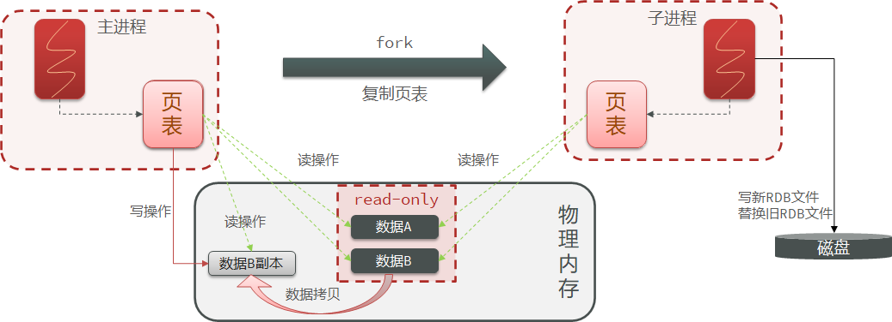

<br>

##### RDB的缺点

- RDB执行间隔时间长，两次RDB之间写入数据有丢失的风险
- fork子进程、压缩、写出RDB文件都比较耗时

<br>

----

<div STYLE="page-break-after: always;">
    <br>
	<br>
	<br>
	<br>
	<br>
</div>

### 10.2.2	AOF持久化

##### AOF 简介

AOF 全称为 Append Only File（追加文件）。Redis 处理的每一个写命令都会记录在 AOF 文件，可以看做是命令日志文件。

因为是记录命令，AOF 文件会比 RDB 文件大的多。

<br>

##### 开启 AOF

AOF默认是关闭的，需要修改redis.conf配置文件来开启AOF：

```
# 是否开启AOF功能，默认是no
appendonly yes
# AOF文件的名称
appendfilename "appendonly.aof"
```

<br>

##### 配置 AOF 的命令记录的频率

通过 redis.conf 文件配置：

```
# 表示每执行一次写命令，立即记录到AOF文件
appendfsync always 
# 写命令执行完先放入AOF缓冲区，然后表示每隔1秒将缓冲区数据写到AOF文件，是默认方案
appendfsync everysec 
# 写命令执行完先放入AOF缓冲区，由操作系统决定何时将缓冲区内容写回磁盘
appendfsync no
```

| **配置项** | **刷盘时机** | **优点**               | **缺点**                     |
| ---------- | ------------ | ---------------------- | ---------------------------- |
| Always     | 同步刷盘     | 可靠性高，几乎不丢数据 | 性能影响大                   |
| everysec   | 每秒刷盘     | 性能适中               | 最多丢失1秒数据              |
| no         | 操作系统控制 | 性能最好               | 可靠性较差，可能丢失大量数据 |

<br>

##### AOF 文件重写

AOF 会记录对同一个key的多次写操作，但只有最后一次写操作才有意义。通过执行 bgrewriteaof 命令，可以让 AOF 文件执行重写功能，用最少的命令达到相同效果。

Redis 也会在触发阈值时自动去重写AOF文件。阈值也可以在 redis.conf 中配置：

```
# AOF文件比上次文件 增长超过多少百分比则触发重写
auto-aof-rewrite-percentage 100
# AOF文件体积最小多大以上才触发重写
auto-aof-rewrite-min-size 64mb 
```

<br>

---

<div STYLE="page-break-after: always;">
    <br>
	<br>
	<br>
	<br>
	<br>
</div>

### 10.2.3	AOF 与 RDB 各自的优缺点与使用场景

##### 结合使用 AOF 与 RDB

RDB和AOF各有自己的优缺点，如果对数据安全性要求较高，在实际开发中往往会**结合**两者来使用。

<br>

##### 优缺点

|                | **RDB**                                      | **AOF**                                                  |
| -------------- | -------------------------------------------- | -------------------------------------------------------- |
| 持久化方式     | 定时对整个内存做快照                         | 记录每一次执行的命令                                     |
| 数据完整性     | 不完整，两次备份之间会丢失                   | 相对完整，取决于刷盘策略                                 |
| 文件大小       | 会有压缩，文件体积小                         | 记录命令，文件体积很大                                   |
| 宕机恢复速度   | 很快                                         | 慢                                                       |
| 数据恢复优先级 | 低，因为数据完整性不如AOF                    | 高，因为数据完整性更高                                   |
| 系统资源占用   | 高，大量CPU和内存消耗                        | 低，主要是磁盘IO资源  但AOF重写时会占用大量CPU和内存资源 |
| 使用场景       | 可以容忍数分钟的数据丢失，追求更快的启动速度 | 对数据安全性要求较高常见                                 |

<br>

---

<div STYLE="page-break-after: always;">
    <br>
	<br>
	<br>
	<br>
	<br>
</div>

## 10.3	Redis 主从

### 10.3.1	搭建主从架构

##### 搭建主从架构的作用

单节点 Redis 的并发能力是有上限的，要进一步提高 Redis 的并发能力，就需要搭建主从集群，**实现读写分离**。

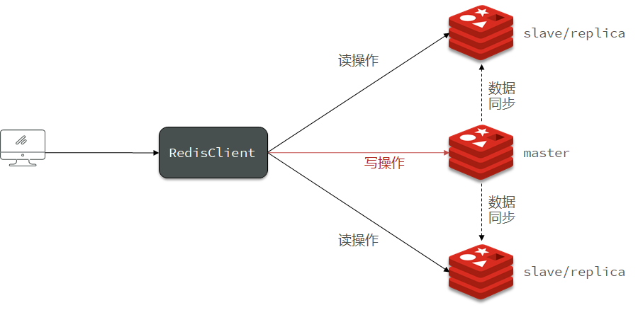

<br>

##### 例——搭建主从架构

###### 主从集群结构


共包含三个节点，一个主节点，两个从节点。

这里我们会在同一台虚拟机中开启3个redis实例，模拟主从集群，信息如下：

|       IP        | PORT |  角色  |
| :-------------: | :--: | :----: |
| 192.168.150.101 | 7001 | master |
| 192.168.150.101 | 7002 | slave  |
| 192.168.150.101 | 7003 | slave  |

###### 准备实例和配置

要在同一台虚拟机开启3个实例，必须准备三份不同的配置文件和目录，配置文件所在目录也就是工作目录。

1. 创建三个文件夹，名字分别叫7001、7002、7003：

```sh
# 进入/tmp目录
cd /tmp
# 创建目录
mkdir 7001 7002 7003
```


###### 恢复原始配置

修改redis-6.2.4/redis.conf文件，将其中的持久化模式改为默认的RDB模式，AOF保持关闭状态。

```properties
# 开启RDB
# save ""
save 3600 1
save 300 100
save 60 10000

# 关闭AOF
appendonly no
```

###### 拷贝配置文件到每个实例目录

然后将redis-6.2.4/redis.conf文件拷贝到三个目录中（在/tmp目录执行下列命令）：

```sh
# 方式一：逐个拷贝
cp redis-6.2.4/redis.conf 7001
cp redis-6.2.4/redis.conf 7002
cp redis-6.2.4/redis.conf 7003
# 方式二：管道组合命令，一键拷贝
echo 7001 7002 7003 | xargs -t -n 1 cp redis-6.2.4/redis.conf
```

###### 修改每个实例的端口、工作目录

修改每个文件夹内的配置文件，将端口分别修改为7001、7002、7003，将rdb文件保存位置都修改为自己所在目录（在/tmp目录执行下列命令）：

```sh
sed -i -e 's/6379/7001/g' -e 's/dir .\//dir \/tmp\/7001\//g' 7001/redis.conf
sed -i -e 's/6379/7002/g' -e 's/dir .\//dir \/tmp\/7002\//g' 7002/redis.conf
sed -i -e 's/6379/7003/g' -e 's/dir .\//dir \/tmp\/7003\//g' 7003/redis.conf
```

###### 修改每个实例的声明IP

虚拟机本身有多个IP，为了避免将来混乱，我们需要在redis.conf文件中指定每一个实例的绑定ip信息，格式如下：

```properties
# redis实例的声明 IP
replica-announce-ip 192.168.150.101
```

每个目录都要改，我们一键完成修改（在/tmp目录执行下列命令）：

```sh
# 逐一执行
sed -i '1a replica-announce-ip 192.168.150.101' 7001/redis.conf
sed -i '1a replica-announce-ip 192.168.150.101' 7002/redis.conf
sed -i '1a replica-announce-ip 192.168.150.101' 7003/redis.conf

# 或者一键修改
printf '%s\n' 7001 7002 7003 | xargs -I{} -t sed -i '1a replica-announce-ip 192.168.150.101' {}/redis.conf
```

###### 启动

为了方便查看日志，我们打开3个ssh窗口，分别启动3个redis实例，启动命令：

```sh
# 第1个
redis-server 7001/redis.conf
# 第2个
redis-server 7002/redis.conf
# 第3个
redis-server 7003/redis.conf
```

启动后：


###### 停止

如果要一键停止，可以运行下面命令：

```sh
printf '%s\n' 7001 7002 7003 | xargs -I{} -t redis-cli -p {} shutdown
```

###### 开启主从关系

现在三个实例还没有任何关系，要配置主从可以使用 replicaof 或者slaveof（5.0以前）命令。

有临时和永久两种模式：

- 修改配置文件（永久生效）

  - 在redis.conf中添加一行配置：```slaveof <masterip> <masterport>```

- 使用redis-cli客户端连接到redis服务，执行slaveof命令（重启后失效）：

  ```sh
  slaveof <masterip> <masterport>
  ```

<strong><font color='red'>注意</font></strong>：在5.0以后新增命令replicaof，与salveof效果一致。

这里我们为了演示方便，使用方式二。

通过redis-cli命令连接7002，执行下面命令：

```sh
# 连接 7002
redis-cli -p 7002
# 执行slaveof
slaveof 192.168.150.101 7001
```

通过redis-cli命令连接7003，执行下面命令：

```sh
# 连接 7003
redis-cli -p 7003
# 执行slaveof
slaveof 192.168.150.101 7001
```

然后连接 7001节点，查看集群状态：

```sh
# 连接 7001
redis-cli -p 7001
# 查看状态
info replication
```

结果：


###### 测试

执行下列操作以测试：

- 利用redis-cli连接7001，执行```set num 123```

- 利用redis-cli连接7002，执行```get num```，再执行```set num 666```

- 利用redis-cli连接7003，执行```get num```，再执行```set num 888```

可以发现，只有在7001这个master节点上可以执行写操作，7002和7003这两个slave节点只能执行读操作。

<br>

---

<div STYLE="page-break-after: always;">
    <br>
	<br>
	<br>
	<br>
	<br>
</div>

### 10.3.2	数据同步原理

##### 数据同步原理

master如何判断slave是不是第一次来同步数据？这里会用到两个很重要的概念：

- Replication Id：简称replid，是数据集的标记，id一致则说明是同一数据集。每一个master都有唯一的replid，slave则会继承master节点的replid
- offset：偏移量，随着记录在repl_baklog中的数据增多而逐渐增大。slave完成同步时也会记录当前同步的offset。如果slave的offset小于master的offset，说明slave数据落后于master，需要更新。

因此slave做数据同步，必须向master声明自己的replication id 和offset，master才可以判断到底需要同步哪些数据。

<br>

##### 全量同步

主从第一次同步是 **全量同步**：


###### 流程

1. slave 节点请求增量同步
2. master 节点判断 replid，发现不一致，拒绝增量同步
3. master 将完整内存数据生成 RDB，发送 RDB 到 slave
4. slave 清空本地数据，加载 master 的 RDB
5. master 将 RDB 期间的命令记录在 repl_baklog，并持续将 log 中的命令发送给 slave
6. slave 执行接收到的命令，保持与 master 之间的同步

<br>

##### 增量同步

主从第一次同步是 **全量同步**，，但如果 slave 重启后同步，则执行 **增量同步**。总之，slave节点断开又恢复，并且在repl_baklog中能找到offset时，会进行增量同步。


###### repl_baklog 大小上限

repl_baklog 大小有上限，写满后会覆盖最早的数据。如果slave断开时间过久，导致尚未备份的数据被覆盖，则无法基于log做增量同步，只能再次全量同步。

<br>

##### 优化 Redis 主从就集群

可以从以下几个方面来优化 Redis 主从就集群：

- 在 master 中配置 repl-diskless-sync yes 启用无磁盘复制，避免全量同步时的磁盘 IO。
- Redis 单节点上的内存占用不要太大，减少 RDB 导致的过多磁盘 IO
- 适当提高 repl_baklog 的大小，发现 slave 宕机时尽快实现故障恢复，尽可能避免全量同步
- 限制一个 master 上的 slave 节点数量，如果实在是太多 slave，则可以采用主-从-从链式结构，减少 master 压力


<br>

##### 全量同步和增量同步区别

- 全量同步——master将完整内存数据生成RDB，发送RDB到slave。后续命令则记录在repl_baklog，逐个发送给slave。
- 增量同步——slave提交自己的offset到master，master获取repl_baklog中从offset之后的命令给slave

<br>

---

<div STYLE="page-break-after: always;">
    <br>
	<br>
	<br>
	<br>
	<br>
</div>

## 10.4	Redis 哨兵

### 10.4.1	哨兵的作用和原理

##### Master 节点的故障恢复

slave节点宕机恢复后可以找master节点同步数据，那master节点宕机怎么办？

<br>

##### 哨兵的作用

Redis 提供了哨兵（Sentinel）机制来实现主从集群的自动故障恢复。哨兵作用如下：

- **监控**：Sentinel 会不断检查您的master和slave是否按预期工作

- **自动故障恢复**：如果master故障，Sentinel会将一个slave提升为master。当故障实例恢复后也以新的master为主

- **通知**：Sentinel充当Redis客户端的服务发现来源，当集群发生故障转移时，会将最新信息推送给Redis的客户端

<br>

##### 哨兵的结构


<br>

##### 服务状态监控

Sentinel基于心跳机制监测服务状态，每隔1秒向集群的每个实例发送ping命令：

- 主观下线：如果某sentinel节点发现某实例未在规定时间响应，则认为该实例**主观下线**。
- 客观下线：若超过指定数量（quorum）的sentinel都认为该实例主观下线，则该实例**客观下线**。quorum值最好超过Sentinel实例数量的一半。


<br>

##### 选举新的master

一旦发现master故障，sentinel需要在salve中选择一个作为新的master，选择的依据为：

1. 首先会判断slave节点与master节点断开时间长短，如果超过指定值（down-after-milliseconds * 10）则会排除该slave节点
2. 然后判断slave节点的slave-priority值，越小优先级越高，如果是0则永不参与选举
3. 如果slave-prority一样，则判断slave节点的offset值，越大说明数据越新，优先级越高
4. 最后是判断slave节点的运行id大小，越小优先级越高。

<br>

##### 实现故障转移

当选中了其中一个slave为新的master后（例如slave1），故障的转移的步骤如下：

1. sentinel给备选的slave1节点发送slaveof no one命令，让该节点成为master
2. sentinel给所有其它slave发送slaveof 192.168.150.101 7002 命令，让这些slave成为新master的从节点，开始从新的master上同步数据。
3. 最后，sentinel将故障节点标记为slave，当故障节点恢复后会自动成为新的master的slave节点


<br>

---

<div STYLE="page-break-after: always;">
    <br>
	<br>
	<br>
	<br>
	<br>
</div>

### 10.4.2	搭建哨兵集群

##### 集群结构

这里我们搭建一个三节点形成的Sentinel集群，来监管之前的Redis主从集群。如图：


三个sentinel实例信息如下：

| 节点 |       IP        | PORT  |
| ---- | :-------------: | :---: |
| s1   | 192.168.150.101 | 27001 |
| s2   | 192.168.150.101 | 27002 |
| s3   | 192.168.150.101 | 27003 |

<br>

##### 准备实例和配置

要在同一台虚拟机开启3个实例，必须准备三份不同的配置文件和目录，配置文件所在目录也就是工作目录。

我们创建三个文件夹，名字分别叫s1、s2、s3：

```sh
# 进入/tmp目录
cd /tmp
# 创建目录
mkdir s1 s2 s3
```

如图：


然后我们在s1目录创建一个sentinel.conf文件，添加下面的内容：

```ini
port 27001
sentinel announce-ip 192.168.150.101
sentinel monitor mymaster 192.168.150.101 7001 2
sentinel down-after-milliseconds mymaster 5000
sentinel failover-timeout mymaster 60000
dir "/tmp/s1"
```

解读：

- `port 27001`：是当前sentinel实例的端口
- `sentinel monitor mymaster 192.168.150.101 7001 2`：指定主节点信息
  - `mymaster`：主节点名称，自定义，任意写
  - `192.168.150.101 7001`：主节点的ip和端口
  - `2`：选举master时的quorum值


然后将s1/sentinel.conf文件拷贝到s2、s3两个目录中（在/tmp目录执行下列命令）：

```sh
# 方式一：逐个拷贝
cp s1/sentinel.conf s2
cp s1/sentinel.conf s3
# 方式二：管道组合命令，一键拷贝
echo s2 s3 | xargs -t -n 1 cp s1/sentinel.conf
```


修改s2、s3两个文件夹内的配置文件，将端口分别修改为27002、27003：

```sh
sed -i -e 's/27001/27002/g' -e 's/s1/s2/g' s2/sentinel.conf
sed -i -e 's/27001/27003/g' -e 's/s1/s3/g' s3/sentinel.conf
```

<br>

##### 启动

为了方便查看日志，我们打开3个ssh窗口，分别启动3个redis实例，启动命令：

```sh
# 第1个
redis-sentinel s1/sentinel.conf
# 第2个
redis-sentinel s2/sentinel.conf
# 第3个
redis-sentinel s3/sentinel.conf
```


启动后：


<br>

##### 测试

尝试让master节点7001宕机，查看sentinel日志：

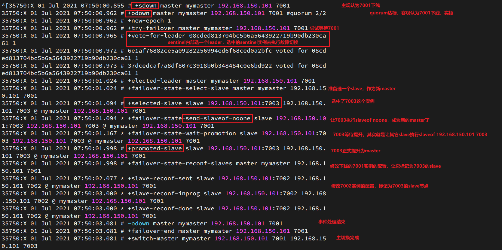

查看7003的日志：


查看7002的日志：


<br>

---

<div STYLE="page-break-after: always;">
    <br>
	<br>
	<br>
	<br>
	<br>
</div>

### 10.4.3	RedisTemplate 的哨兵模式

##### Spring RedisTemplate 的哨兵模式

在 Sentinel 集群监管下的 Redis 主从集群，其节点会因为自动故障转移而发生变化，Redis 的客户端必须感知这种变化，及时更新连接信息。Spring 的 RedisTemplate 底层利用 lettuce 实现了节点的感知和自动切换。

<br>

##### 例——在微服务中引入 RedisTemplate 的哨兵模式

###### 引入示例项目

[redis-demo](attachment\redis-demo)

###### 实现步骤

1. 在微服务的 pom 文件中引入 redis 的 starter 依赖：

```
<dependency>
	<groupId>org.springframework.boot</groupId>
    <artifactId>spring-boot-starter-data-redis</artifactId>
</dependency>
```

2. 在配置文件 application.yml 中指定 Redis sentinel 相关信息：

```yaml
spring:
	redis:    
		sentinel:
    		master: mymaster # 指定master名称
            nodes: # 指定redis-sentinel集群信息 
            	- 192.168.150.101:27001
                - 192.168.150.101:27002
                - 192.168.150.101:27003
```

3. 配置主从读写分离

```java
@Bean
public LettuceClientConfigurationBuilderCustomizer configurationBuilderCustomizer(){
    return configBuilder -> configBuilder.readFrom(ReadFrom.REPLICA_PREFERRED);
}
```

这里的 ReadFrom 是配置 Redis 的读取策略，是一个枚举，包括下面选择：

- MASTER：从主节点读取
- MASTER_PREFERRED：优先从master节点读取，master不可用才读取replica
- REPLICA：从slave（replica）节点读取
- REPLICA _PREFERRED：优先从slave（replica）节点读取，所有的slave都不可用才读取master

<br>

---

<div STYLE="page-break-after: always;">
    <br>
	<br>
	<br>
	<br>
	<br>
</div>

## 10.5	Redis 分片集群

### 10.5.1	搭建分片集群

##### 分片集群结构

主从和哨兵可以解决高可用、高并发读的问题。但是依然有两个问题没有解决：

- 海量数据存储问题
- 高并发写的问题

使用分片集群可以解决上述问题，分片集群特征：

- 集群中有多个master，每个master保存不同数据
- 每个master都可以有多个slave节点
- master之间通过ping监测彼此健康状态
- 客户端请求可以访问集群任意节点，最终都会被转发到正确节点


<br>

##### 例——搭建简单的分片集群

分片集群需要的节点数量较多，这里我们搭建一个最小的分片集群，包含3个 master 节点，每个 master 包含一个 slave 节点，结构如下：


这里我们会在同一台虚拟机中开启6个redis实例，模拟分片集群，信息如下：

|       IP        | PORT |  角色  |
| :-------------: | :--: | :----: |
| 192.168.150.101 | 7001 | master |
| 192.168.150.101 | 7002 | master |
| 192.168.150.101 | 7003 | master |
| 192.168.150.101 | 8001 | slave  |
| 192.168.150.101 | 8002 | slave  |
| 192.168.150.101 | 8003 | slave  |

###### 准备实例和配置

删除之前的7001、7002、7003这几个目录，重新创建出7001、7002、7003、8001、8002、8003目录：

```sh
# 进入/tmp目录
cd /tmp
# 删除旧的，避免配置干扰
rm -rf 7001 7002 7003
# 创建目录
mkdir 7001 7002 7003 8001 8002 8003
```


在/tmp下准备一个新的redis.conf文件，内容如下：

```ini
port 6379
# 开启集群功能
cluster-enabled yes
# 集群的配置文件名称，不需要我们创建，由redis自己维护
cluster-config-file /tmp/6379/nodes.conf
# 节点心跳失败的超时时间
cluster-node-timeout 5000
# 持久化文件存放目录
dir /tmp/6379
# 绑定地址
bind 0.0.0.0
# 让redis后台运行
daemonize yes
# 注册的实例ip
replica-announce-ip 192.168.150.101
# 保护模式
protected-mode no
# 数据库数量
databases 1
# 日志
logfile /tmp/6379/run.log
```

将这个文件拷贝到每个目录下：

```sh
# 进入/tmp目录
cd /tmp
# 执行拷贝
echo 7001 7002 7003 8001 8002 8003 | xargs -t -n 1 cp redis.conf
```


修改每个目录下的redis.conf，将其中的6379修改为与所在目录一致：

```sh
# 进入/tmp目录
cd /tmp
# 修改配置文件
printf '%s\n' 7001 7002 7003 8001 8002 8003 | xargs -I{} -t sed -i 's/6379/{}/g' {}/redis.conf
```

###### 启动

因为已经配置了后台启动模式，所以可以直接启动服务：

```sh
# 进入/tmp目录
cd /tmp
# 一键启动所有服务
printf '%s\n' 7001 7002 7003 8001 8002 8003 | xargs -I{} -t redis-server {}/redis.conf
```

通过ps查看状态：

```sh
ps -ef | grep redis
```

发现服务都已经正常启动：


如果要关闭所有进程，可以执行命令：

```sh
ps -ef | grep redis | awk '{print $2}' | xargs kill
```

或者（推荐这种方式）：

```sh
printf '%s\n' 7001 7002 7003 8001 8002 8003 | xargs -I{} -t redis-cli -p {} shutdown
```

###### 创建集群

虽然服务启动了，但是目前每个服务之间都是独立的，没有任何关联。

我们需要执行命令来创建集群，在Redis5.0之前创建集群比较麻烦，5.0之后集群管理命令都集成到了redis-cli中。


1）Redis5.0之前

Redis5.0之前集群命令都是用redis安装包下的src/redis-trib.rb来实现的。因为redis-trib.rb是有ruby语言编写的所以需要安装ruby环境。

 ```sh
# 安装依赖
yum -y install zlib ruby rubygems
gem install redis
 ```


然后通过命令来管理集群：

```sh
# 进入redis的src目录
cd /tmp/redis-6.2.4/src
# 创建集群
./redis-trib.rb create --replicas 1 192.168.150.101:7001 192.168.150.101:7002 192.168.150.101:7003 192.168.150.101:8001 192.168.150.101:8002 192.168.150.101:8003
```


2）Redis5.0以后

我们使用的是Redis6.2.4版本，集群管理以及集成到了redis-cli中，格式如下：

```sh
redis-cli --cluster create --cluster-replicas 1 192.168.150.101:7001 192.168.150.101:7002 192.168.150.101:7003 192.168.150.101:8001 192.168.150.101:8002 192.168.150.101:8003
```

命令说明：

- `redis-cli --cluster`或者`./redis-trib.rb`：代表集群操作命令
- `create`：代表是创建集群
- `--replicas 1`或者`--cluster-replicas 1` ：指定集群中每个master的副本个数为1，此时`节点总数 ÷ (replicas + 1)` 得到的就是master的数量。因此节点列表中的前n个就是master，其它节点都是slave节点，随机分配到不同master


运行后的样子：


这里输入yes，则集群开始创建：


通过命令可以查看集群状态：

```sh
redis-cli -p 7001 cluster nodes
```


###### 测试

尝试连接7001节点，存储一个数据：

```sh
# 连接
redis-cli -p 7001
# 存储数据
set num 123
# 读取数据
get num
# 再次存储
set a 1
```

结果悲剧了：


集群操作时，需要给`redis-cli`加上`-c`参数才可以：

```sh
redis-cli -c -p 7001
```

这次可以了：


<br>

---

<div STYLE="page-break-after: always;">
    <br>
	<br>
	<br>
	<br>
	<br>
</div>

### 10.5.2	散列插槽

##### Master 节点映射

Redis 会把每一个master节点映射到0~16383共16384个插槽（hash slot）上，查看集群信息时就能看到：

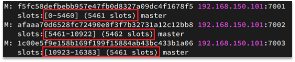

<br>

##### 数据与插槽绑定

数据 key 不是与节点绑定，而是与插槽绑定。redis 会根据 key 的有效部分计算插槽值，分两种情况：

- key中包含"{}"，且“{}”中至少包含1个字符，“{}”中的部分是有效部分
- key中不包含“{}”，整个key都是有效部分

例如：key是num，那么就根据num计算，如果是{itcast}num，则根据itcast计算。计算方式是利用CRC16算法得到一个hash值，然后对16384取余，得到的结果就是slot值。


<br>

##### 将同一类数据固定的保存在同一个Redis实例

这一类数据使用相同的有效部分，例如key都以{typeId}为前缀

<br>

---

<div STYLE="page-break-after: always;">
    <br>
	<br>
	<br>
	<br>
	<br>
</div>

### 10.5.3	集群伸缩

##### 添加一个节点到集群

redis-cli --cluster提供了很多操作集群的命令，可以通过下面方式查看：

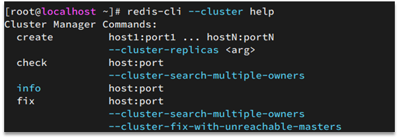

比如，添加节点的命令：

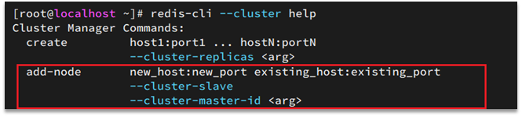

<br>

##### 例——向集群中添加一个新的master节点，并向其中存储 num = 10

###### 需求1

- 启动一个新的redis实例，端口为7004
- 添加7004到之前的集群，并作为一个master节点
- 给7004节点分配插槽，使得num这个key可以存储到7004实例

###### 需求2

- 删除该节点

###### 实现步骤

1. ……………………

<br>

---

<div STYLE="page-break-after: always;">
    <br>
	<br>
	<br>
	<br>
	<br>
</div>

### 10.5.4	故障转移

##### 集群中 master 宕机后会发生什么

1. 首先是该实例与其它实例失去连接
2. 然后是疑似宕机：

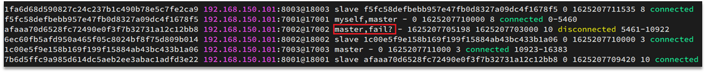

3. 最后是确定下线，自动提升一个slave为新的master：

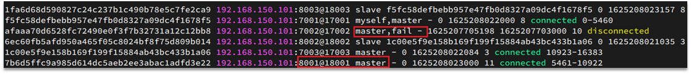

<br>

##### 数据迁移

利用cluster failover命令可以手动让集群中的某个master宕机，切换到执行cluster failover命令的这个slave节点，实现无感知的数据迁移。其流程如下：


手动的Failover支持三种不同模式：

- 缺省：默认的流程，如图1~6歩
- force：省略了对offset的一致性校验
- takeover：直接执行第5歩，忽略数据一致性、忽略master状态和其它master的意见

<br>

##### 例——在7002这个slave节点执行手动故障转移，重新夺回master地位

###### 步骤

1.利用redis-cli连接7002这个节点

2.执行cluster failover命令

<br>

---

<div STYLE="page-break-after: always;">
    <br>
	<br>
	<br>
	<br>
	<br>
</div>

### 10.5.6	RedisTemplate访问分片集群

##### RedisTemplate 访问分片集群步骤

RedisTemplate底层同样基于lettuce实现了分片集群的支持，而使用的步骤与哨兵模式基本一致：

1. 引入redis的starter依赖
2. 配置分片集群地址
3. 配置读写分离

与哨兵模式相比，其中只有分片集群的配置方式略有差异，如下：

```yaml
spring:
	redis:
    	cluster:
        	nodes: # 指定分片集群的每一个节点信息
            	- 192.168.150.101:7001
                - 192.168.150.101:7002
                - 192.168.150.101:7003
                - 192.168.150.101:8001
                - 192.168.150.101:8002
                - 192.168.150.101:8003
```

<br>

---

<div STYLE="page-break-after: always;">
    <br>
	<br>
	<br>
	<br>
	<br>
</div>

# 11	多级缓存

## 11.1	多级缓存概述

##### 传统缓存策略

​	传统的缓存策略一般是请求到达 Tomcat 后，先查询 Redis，如果未命中则查询数据库，如图：


存在下面的问题：

- 请求要经过 Tomcat 处理，Tomcat 的性能成为整个系统的瓶颈
- Redis 缓存失效时，会对数据库产生冲击

<br>

##### 什么是多级缓存

多级缓存就是充分利用请求处理的每个环节，分别添加缓存，减轻 Tomcat 压力，提升服务性能：

- 浏览器访问静态资源时，优先读取浏览器本地缓存
- 访问非静态资源（ajax查询数据）时，访问服务端
- 请求到达 Nginx 后，优先读取 Nginx 本地缓存
- 如果 Nginx 本地缓存未命中，则去直接查询 Redis（不经过Tomcat）
- 如果 Redis 查询未命中，则查询Tomcat
- 请求进入Tomcat后，优先查询 JVM 进程缓存
- 如果 JVM 进程缓存未命中，则查询数据库


在多级缓存架构中，Nginx 内部需要编写本地缓存查询、Redis 查询、Tomcat 查询的业务逻辑，因此这样的 nginx 服务不再是一个**反向代理服务器**，而是一个编写 **业务的Web服务器了**。

因此，对于这样的业务 Nginx 服务也需要搭建集群来提高并发，再用专门的 nginx 服务来做反向代理，如图：


除此之外，Tomcat 服务将来也会部署为集群模式：


<br>

##### 多级缓存的关键

根据上述内容可见，多级缓存的关键有两个：

- 一个是在 nginx 中编写业务，实现 nginx 本地缓存、Redis、Tomcat 的查询

- 另一个就是在 Tomcat 中实现 JVM 进程缓存

其中 Nginx 编程则会用到 OpenResty 框架结合 Lua 这样的语言。

<br>

----

<div STYLE="page-break-after: always;">
    <br>
	<br>
	<br>
	<br>
	<br>
</div>
## 11.2	JVM 进程缓存

### 11.2.1	Caffeine 概述

##### 缓存分类

缓存在日常开发中启动至关重要的作用，由于是存储在内存中，数据的读取速度是非常快的，能大量减少对数据库的访问，减少数据库的压力。我们把缓存分为两类：

- 分布式缓存，例如 Redis：
  - 优点：存储容量更大、可靠性更好、可以在集群间共享
  - 缺点：访问缓存有网络开销
  - 场景：缓存数据量较大、可靠性要求较高、需要在集群间共享
- 进程本地缓存，例如 HashMap、GuavaCache：
  - 优点：读取本地内存，没有网络开销，速度更快
  - 缺点：存储容量有限、可靠性较低、无法共享
  - 场景：性能要求较高，缓存数据量较小

<br>

##### Caffeine 简介

**Caffeine** 是一个基于 Java8 开发的，提供了近乎最佳命中率的高性能的本地缓存库。目前 Spring 内部的缓存使用的就是Caffeine。

<br>

##### GitHub 地址

https://github.com/ben-manes/caffeine

<br>

##### Caffeine  性能对比

Caffeine 的性能非常好，下图是官方给出的性能对比：


可以看到 Caffeine 的性能遥遥领先。

<br>

##### 缓存使用的基本API

```java
@Test
void testBasicOps() {
    // 构建cache对象
    Cache<String, String> cache = Caffeine.newBuilder().build();

    // 存数据
    cache.put("gf", "迪丽热巴");

    // 取数据
    String gf = cache.getIfPresent("gf");
    System.out.println("gf = " + gf);

    // 取数据，包含两个参数：
    // 参数一：缓存的key
    // 参数二：Lambda表达式，表达式参数就是缓存的key，方法体是查询数据库的逻辑
    // 优先根据key查询JVM缓存，如果未命中，则执行参数二的Lambda表达式
    String defaultGF = cache.get("defaultGF", key -> {
        // 根据key去数据库查询数据
        return "柳岩";
    });
    System.out.println("defaultGF = " + defaultGF);
}
```

<br>

##### 缓存清除策略

Caffeine 既然是缓存的一种，肯定需要有缓存的清除策略，不然的话内存总会有耗尽的时候。

Caffeine 提供了三种缓存驱逐策略：

- **基于容量**：设置缓存的数量上限

```java
// 创建缓存对象
Cache<String, String> cache = Caffeine.newBuilder()
    .maximumSize(1) // 设置缓存大小上限为 1
    .build();
```

- **基于时间**：设置缓存的有效时间

```java
// 创建缓存对象
Cache<String, String> cache = Caffeine.newBuilder()
    // 设置缓存有效期为 10 秒，从最后一次写入开始计时 
    .expireAfterWrite(Duration.ofSeconds(10)) 
    .build();

```

- **基于引用**：设置缓存为软引用或弱引用，利用GC来回收缓存数据。性能较差，不建议使用。

**注意**：在默认情况下，当一个缓存元素过期的时候，Caffeine 不会自动立即将其清理和驱逐。而是在一次读或写操作后，或者在空闲时间完成对失效数据的驱逐。

<br>

---

<div STYLE="page-break-after: always;">
    <br>
	<br>
	<br>
	<br>
	<br>
</div>

### 11.2.2	案例准备

##### 导入案例

为了演示多级缓存的案例，我们先准备一个商品查询的业务。

###### 多个 Mysql

进行数据同步需要用到 Mysql 的主从功能，所以需多个 Mysql ，如果没有足够的主机，可以通过 Docker 运行一个 Mysql 容器。

###### Sql 文件

到入 [item.sql](attachment\sql)，其中包含两张表：

- tb_item：商品表，包含商品的基本信息
- tb_item_stock：商品库存表，包含商品的库存信息

之所以将库存分离出来，是因为库存是更新比较频繁的信息，写操作较多。而其他信息修改的频率非常低。

###### 导入 Demo 工程

导入工程 [item-service](attachment\item-service)，其中的业务包括：

- 分页查询商品
- 新增商品
- 修改商品
- 修改库存
- 删除商品
- 根据id查询商品
- 根据id查询库存

业务全部使用 mybatis-plus 来实现，如有需要请自行修改业务逻辑。

###### 启动

注意修改application.yml文件中配置的mysql地址信息：


需要修改为自己的虚拟机地址信息、还有账号和密码。

修改后，启动服务，访问：http://localhost:8081/item/10001即可查询数据

###### 导入商品查询页面

商品查询是购物页面，与商品管理的页面是分离的。

部署方式如图：


我们需要准备一个反向代理的nginx服务器，如上图红框所示，将静态的商品页面放到nginx目录中。

页面需要的数据通过ajax向服务端（nginx业务集群）查询。

###### 运行 nginx 服务

运行已经准备好的，包含静态资源的 nginx 反向代理服务器，[资源位置](attachment\nginx-1.18.0)。将其拷贝到一个非中文目录下，运行这个 nginx 服务

```powershell
start nginx.exe
```

然后访问 http://localhost/item.html?id=10001即可：

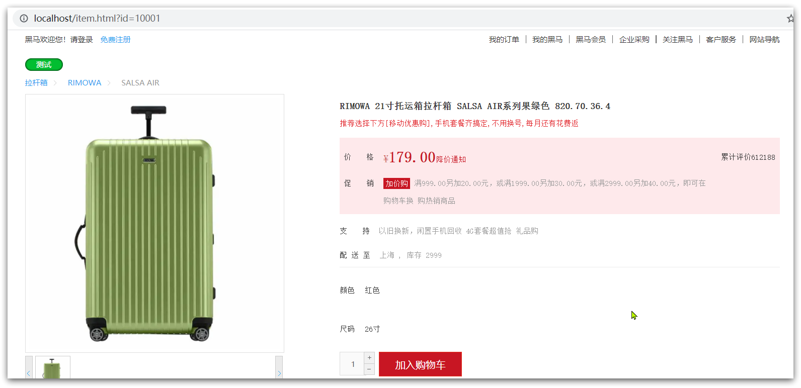

###### 反向代理

现在，页面是假数据展示的。我们需要向服务器发送 ajax 请求，查询商品数据。

打开控制台，可以看到页面有发起ajax查询数据：


而这个请求地址同样是80端口，所以被当前的nginx反向代理了。

查看nginx的conf目录下的nginx.conf文件：

 

其中的关键配置如下：


其中的 192.168.150.101 是演示虚拟机的IP，也是 Nginx 业务集群要部署的地方：


完整内容如下：

```nginx
#user  nobody;
worker_processes  1;

events {
    worker_connections  1024;
}

http {
    include       mime.types;
    default_type  application/octet-stream;

    sendfile        on;
    #tcp_nopush     on;
    keepalive_timeout  65;

    upstream nginx-cluster{
        server 192.168.150.101:8081;
    }
    server {
        listen       80;
        server_name  localhost;

	location /api {
            proxy_pass http://nginx-cluster;
        }

        location / {
            root   html;
            index  index.html index.htm;
        }

        error_page   500 502 503 504  /50x.html;
        location = /50x.html {
            root   html;
        }
    }
}
```

<br>

---

<div STYLE="page-break-after: always;">
    <br>
	<br>
	<br>
	<br>
	<br>
</div>

### 11.2.3	实现 JVM 进程缓存

##### 案例需求

利用Caffeine实现下列需求：

- 给根据id查询商品的业务添加缓存，缓存未命中时查询数据库
- 给根据id查询商品库存的业务添加缓存，缓存未命中时查询数据库
- 缓存初始大小为100
- 缓存上限为10000

<br>

##### 实现

首先，我们需要定义两个Caffeine的缓存对象，分别保存商品、库存的缓存数据。

在item-service的`com.heima.item.config`包下定义`CaffeineConfig`类：

```java
package com.heima.item.config;

import com.github.benmanes.caffeine.cache.Cache;
import com.github.benmanes.caffeine.cache.Caffeine;
import com.heima.item.pojo.Item;
import com.heima.item.pojo.ItemStock;
import org.springframework.context.annotation.Bean;
import org.springframework.context.annotation.Configuration;

@Configuration
public class CaffeineConfig {

    @Bean
    public Cache<Long, Item> itemCache(){
        return Caffeine.newBuilder()
                .initialCapacity(100)
                .maximumSize(10_000)
                .build();
    }

    @Bean
    public Cache<Long, ItemStock> stockCache(){
        return Caffeine.newBuilder()
                .initialCapacity(100)
                .maximumSize(10_000)
                .build();
    }
}
```


然后，修改item-service中的`com.heima.item.web`包下的ItemController类，添加缓存逻辑：

```java
@RestController
@RequestMapping("item")
public class ItemController {

    @Autowired
    private IItemService itemService;
    @Autowired
    private IItemStockService stockService;

    @Autowired
    private Cache<Long, Item> itemCache;
    @Autowired
    private Cache<Long, ItemStock> stockCache;
    
    // ...其它略
    
    @GetMapping("/{id}")
    public Item findById(@PathVariable("id") Long id) {
        return itemCache.get(id, key -> itemService.query()
                .ne("status", 3).eq("id", key)
                .one()
        );
    }

    @GetMapping("/stock/{id}")
    public ItemStock findStockById(@PathVariable("id") Long id) {
        return stockCache.get(id, key -> stockService.getById(key));
    }
}
```

<br>

---

<div STYLE="page-break-after: always;">
    <br>
	<br>
	<br>
	<br>
	<br>
</div>

## 11.3	Lua 语法入门

### 11.3.1	Lua 概述

##### Lua 简介

Lua 是一种轻量小巧的脚本语言，用标准C语言编写并以源代码形式开放， 其设计目的是为了嵌入应用程序中，从而为应用程序提供灵活的扩展和定制功能。

<br>

##### 官网

https://www.lua.org/

<br>

##### Luau 常见用途与 Nginx 

Lua 经常嵌入到 C 语言开发的程序中，例如游戏开发、游戏插件等。Nginx 本身也是 C 语言开发，因此也允许基于 Lua 做拓展。

<br>

---

<div STYLE="page-break-after: always;">
    <br>
	<br>
	<br>
	<br>
	<br>
</div>

### 11.3.2	Hello World

##### 在 Linux 环境下运行 Luau代码

CentOS7默认已经安装了Lua语言环境，所以可以直接运行Lua代码。

1. 在 Linux 虚拟机的任意目录下，新建一个 hello.lua 文件


2. 添加下面的内容

```lua
print("Hello World!")  
```

3. 运行


<br>

---

<div STYLE="page-break-after: always;">
    <br>
	<br>
	<br>
	<br>
	<br>
</div>

### 11.3.3	变量

##### 数据类型

Lua中支持的常见数据类型包括：


另外，Lua提供了type()函数来判断一个变量的数据类型：


<br>

##### 声明变量

Lua 声明变量的时候无需指定数据类型，而是用 local 来声明变量为局部变量：

```lua
-- 声明字符串，可以用单引号或双引号，
local str = 'hello'
-- 字符串拼接可以使用 ..
local str2 = 'hello' .. 'world'
-- 声明数字
local num = 21
-- 声明布尔类型
local flag = true
```

<br>

##### table 类型

Lua 中的 table 类型既可以作为数组，又可以作为 Java 中的 map 来使用。数组就是特殊的 table，key 是数组角标而已：

```lua
-- 声明数组 ，key为角标的 table
local arr = {'java', 'python', 'lua'}
-- 声明table，类似java的map
local map =  {name='Jack', age=21}
```

Lua中的数组角标是从1开始，访问的时候与Java中类似：

```lua
-- 访问数组，lua数组的角标从1开始
print(arr[1])
```

Lua中的table可以用key来访问：

```lua
-- 访问table
print(map['name'])
print(map.name)
```

<br>

---

<div STYLE="page-break-after: always;">
    <br>
	<br>
	<br>
	<br>
	<br>
</div>

### 11.3.4	循环

##### 遍历数组

```lua
-- 声明数组 key为索引的 table
local arr = {'java', 'python', 'lua'}
-- 遍历数组
for index,value in ipairs(arr) do
    print(index, value) 
end
```

<br>

##### 遍历普通table

对于 table，我们可以利用for循环来遍历。不过普通 table 和数组的遍历略有差异。

```lua
-- 声明map，也就是table
local map = {name='Jack', age=21}
-- 遍历table
for key,value in pairs(map) do
   print(key, value) 
end
```

<br>

---

<div STYLE="page-break-after: always;">
    <br>
	<br>
	<br>
	<br>
	<br>
</div>

### 11.3.5	条件控制

##### 条件控制

类似Java的条件控制，例如if、else语法：

```lua
if(布尔表达式)
then
   --[ 布尔表达式为 true 时执行该语句块 --]
else
   --[ 布尔表达式为 false 时执行该语句块 --]
end

```

<br>

##### 逻辑运算

与java不同，布尔表达式中的逻辑运算是基于英文单词：


<br>

---

<div STYLE="page-break-after: always;">
    <br>
	<br>
	<br>
	<br>
	<br>
</div>

### 11.3.6	函数

##### 语法——定义函数

```lua
function 函数名( argument1, argument2..., argumentn)
    -- 函数体
    return 返回值
end
```

<br>

##### 例——定义一个函数，用来打印数组

```lua
function printArr(arr)
    for index, value in ipairs(arr) do
        print(value)
    end
end
```

<br>

##### 例——自定义一个函数，可以打印table，当参数为nil时，打印错误信息

```
function printArr(arr)
    if not arr then
        print('数组不能为空！')
    end
    for index, value in ipairs(arr) do
        print(value)
    end
end
```

<br>

---

<div STYLE="page-break-after: always;">
    <br>
	<br>
	<br>
	<br>
	<br>
</div>

## 11.4	实现多级缓存

### 11.4.1	OpenResty 概述

##### OpenResty 简介

OpenResty® 是一个基于 Nginx的高性能 Web 平台，用于方便地搭建能够处理超高并发、扩展性极高的动态 Web 应用、Web 服务和动态网关。具备下列特点：

- 具备 Nginx 的完整功能
- 基于 Lua 语言进行扩展，集成了大量精良的 Lua 库、第三方模块
- 允许使用 Lua **自定义业务逻辑**、**自定义库**

<br>

##### 官方网站

 https://openresty.org/cn/

<br>

---

<div STYLE="page-break-after: always;">
    <br>
	<br>
	<br>
	<br>
	<br>
</div>

### 11.4.2	安装 OpenResty

##### 前提条件

Linux 主机必须联网

<br>

##### 安装开发库

安装 OpenResty 的依赖开发库，执行命令：

```sh
yum install -y pcre-devel openssl-devel gcc --skip-broken
```

<br>

##### 安装 penResty 仓库

可以在 CentOS 系统中添加 `openresty` 仓库，这样便于未来安装或更新软件包（通过 `yum check-update` 命令）。运行下面的命令就可以添加 `openresty` 仓库：

```
yum-config-manager --add-repo https://openresty.org/package/centos/openresty.repo
```

如果提示说命令不存在，则运行：

```
yum install -y yum-utils 
```

然后再重复上面的命令。

<br>

##### 安装 OpenResty

```bash
yum install -y openresty
```

<br>

##### 安装 opm 工具

opm 是 OpenResty 的一个管理工具，可以帮助我们安装一个第三方的 Lua 模块。

如果你想安装命令行工具 `opm`，那么可以像下面这样安装 `openresty-opm` 包：

```bash
yum install -y openresty-opm
```

<br>

##### 目录结构

默认情况下，OpenResty安装的目录是：/usr/local/openresty

 

<br>

##### 配置nginx的环境变量

打开配置文件：

```sh
vi /etc/profile
```

在最下面加入两行：

```sh
export NGINX_HOME=/usr/local/openresty/nginx
export PATH=${NGINX_HOME}/sbin:$PATH
```

NGINX_HOME：后面是OpenResty安装目录下的nginx的目录

然后让配置生效：

```
source /etc/profile
```

<br>

##### 启动和运行

OpenResty底层是基于Nginx的，查看OpenResty目录的nginx目录，结构与windows中安装的nginx基本一致：


所以运行方式与nginx基本一致：

```sh
# 启动nginx
nginx
# 重新加载配置
nginx -s reload
# 停止
nginx -s stop
```

nginx的默认配置文件注释太多，影响后续我们的编辑，这里将nginx.conf中的注释部分删除，保留有效部分。

修改`/usr/local/openresty/nginx/conf/nginx.conf`文件，内容如下：

```nginx
#user  nobody;
worker_processes  1;
error_log  logs/error.log;

events {
    worker_connections  1024;
}

http {
    include       mime.types;
    default_type  application/octet-stream;
    sendfile        on;
    keepalive_timeout  65;

    server {
        listen       8081;
        server_name  localhost;
        location / {
            root   html;
            index  index.html index.htm;
        }
        error_page   500 502 503 504  /50x.html;
        location = /50x.html {
            root   html;
        }
    }
}
```

在Linux的控制台输入命令以启动nginx：

```sh
nginx
```

然后访问页面：http://192.168.150.101:8081，注意ip地址替换为你自己的虚拟机IP。

<br>

##### 加载 OpenResty 的 lua 模块

```nginx
#lua 模块
lua_package_path "/usr/local/openresty/lualib/?.lua;;";
#c模块     
lua_package_cpath "/usr/local/openresty/lualib/?.so;;";  
```

<br>

##### common.lua

```lua
-- 封装函数，发送http请求，并解析响应
local function read_http(path, params)
    local resp = ngx.location.capture(path,{
        method = ngx.HTTP_GET,
        args = params,
    })
    if not resp then
        -- 记录错误信息，返回404
        ngx.log(ngx.ERR, "http not found, path: ", path , ", args: ", args)
        ngx.exit(404)
    end
    return resp.body
end
-- 将方法导出
local _M = {  
    read_http = read_http
}  
return _M
```

<br>

##### 释放 Redis 连接的API

```lua
-- 关闭redis连接的工具方法，其实是放入连接池
local function close_redis(red)
    local pool_max_idle_time = 10000 -- 连接的空闲时间，单位是毫秒
    local pool_size = 100 --连接池大小
    local ok, err = red:set_keepalive(pool_max_idle_time, pool_size)
    if not ok then
        ngx.log(ngx.ERR, "放入redis连接池失败: ", err)
    end
end
```

<br>

##### 读取 Redis 数据的API

```lua
-- 查询redis的方法 ip和port是redis地址，key是查询的key
local function read_redis(ip, port, key)
    -- 获取一个连接
    local ok, err = red:connect(ip, port)
    if not ok then
        ngx.log(ngx.ERR, "连接redis失败 : ", err)
        return nil
    end
    -- 查询redis
    local resp, err = red:get(key)
    -- 查询失败处理
    if not resp then
        ngx.log(ngx.ERR, "查询Redis失败: ", err, ", key = " , key)
    end
    --得到的数据为空处理
    if resp == ngx.null then
        resp = nil
        ngx.log(ngx.ERR, "查询Redis数据为空, key = ", key)
    end
    close_redis(red)
    return resp
end
```

<br>

##### 开启共享词典

```nginx
# 共享字典，也就是本地缓存，名称叫做：item_cache，大小150m
lua_shared_dict item_cache 150m; 
```

<br>

---

<div STYLE="page-break-after: always;">
    <br>
	<br>
	<br>
	<br>
	<br>
</div>

### 11.4.3	OpenResty 快速入门

##### 我们希望达到的多级缓存架构

如图：


其中：

- windows上的nginx用来做反向代理服务，将前端的查询商品的ajax请求代理到OpenResty集群

- OpenResty集群用来编写多级缓存业务

<br>

##### 反向代理流程

现在，商品详情页使用的是假的商品数据。不过在浏览器中，可以看到页面有发起ajax请求查询真实商品数据。

这个请求如下：


请求地址是localhost，端口是80，就被windows上安装的Nginx服务给接收到了。然后代理给了OpenResty集群：


我们需要在OpenResty中编写业务，查询商品数据并返回到浏览器。

但是这次，我们先在OpenResty接收请求，返回假的商品数据。

<br>

##### OpenResty监听请求

OpenResty 的很多功能都依赖于其目录下的 Lua 库，需要在 nginx.con f中指定依赖库的目录，并导入依赖：

1. 添加对OpenResty的Lua模块的加载，修改`/usr/local/openresty/nginx/conf/nginx.conf`文件，在其中的http下面，添加下面代码：

```nginx
#lua 模块
lua_package_path "/usr/local/openresty/lualib/?.lua;;";
#c模块     
lua_package_cpath "/usr/local/openresty/lualib/?.so;;";  
```

2. 监听/api/item路径，修改`/usr/local/openresty/nginx/conf/nginx.conf`文件，在nginx.conf的server下面，添加对/api/item这个路径的监听：

```nginx
location  /api/item {
    # 默认的响应类型
    default_type application/json;
    # 响应结果由lua/item.lua文件来决定
    content_by_lua_file lua/item.lua;
}
```

这个监听，就类似于SpringMVC中的`@GetMapping("/api/item")`做路径映射。

而`content_by_lua_file lua/item.lua`则相当于调用item.lua这个文件，执行其中的业务，把结果返回给用户。相当于java中调用service。

<br>

##### 编写 item.lua

1. 在`/usr/loca/openresty/nginx`目录创建文件夹：lua


2. 在`/usr/loca/openresty/nginx/lua`文件夹下，新建文件：item.lua


3. 编写item.lua，返回假数据

item.lua中，利用ngx.say()函数返回数据到Response中

```lua
ngx.say('{"id":10001,"name":"SALSA AIR","title":"RIMOWA 21寸托运箱拉杆箱 SALSA AIR系列果绿色 820.70.36.4","price":17900,"image":"https://m.360buyimg.com/mobilecms/s720x720_jfs/t6934/364/1195375010/84676/e9f2c55f/597ece38N0ddcbc77.jpg!q70.jpg.webp","category":"拉杆箱","brand":"RIMOWA","spec":"","status":1,"createTime":"2019-04-30T16:00:00.000+00:00","updateTime":"2019-04-30T16:00:00.000+00:00","stock":2999,"sold":31290}')
```

4. 重新加载配置

```sh
nginx -s reload
```

5. 刷新商品页面：http://localhost/item.html?id=1001，即可看到效果：


<br>

---

<div STYLE="page-break-after: always;">
    <br>
	<br>
	<br>
	<br>
	<br>
</div>

### 11.4.4	请求参数处理

##### 获取参数的API

OpenResty中提供了一些API用来获取不同类型的前端请求参数：


<br>

##### 获取参数并返回

###### 分析

在前端发起的ajax请求如图：

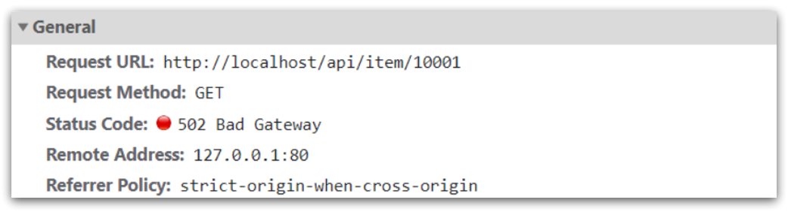

可以看到商品id是以路径占位符方式传递的，因此可以利用正则表达式匹配的方式来获取ID。

###### 步骤

1. 获取商品id，修改`/usr/loca/openresty/nginx/nginx.conf`文件中监听/api/item的代码，利用正则表达式获取ID：

```nginx
location ~ /api/item/(\d+) {
    # 默认的响应类型
    default_type application/json;
    # 响应结果由lua/item.lua文件来决定
    content_by_lua_file lua/item.lua;
}
```

2. 拼接ID并返回，修改`/usr/loca/openresty/nginx/lua/item.lua`文件，获取id并拼接到结果中返回：

```lua
-- 获取商品id
local id = ngx.var[1]
-- 拼接并返回
ngx.say('{"id":' .. id .. ',"name":"SALSA AIR","title":"RIMOWA 21寸托运箱拉杆箱 SALSA AIR系列果绿色 820.70.36.4","price":17900,"image":"https://m.360buyimg.com/mobilecms/s720x720_jfs/t6934/364/1195375010/84676/e9f2c55f/597ece38N0ddcbc77.jpg!q70.jpg.webp","category":"拉杆箱","brand":"RIMOWA","spec":"","status":1,"createTime":"2019-04-30T16:00:00.000+00:00","updateTime":"2019-04-30T16:00:00.000+00:00","stock":2999,"sold":31290}')
```

3. 重新加载并测试，运行命令以重新加载OpenResty配置：

```sh
nginx -s reload
```

4. 刷新页面，可以看到结果中已经带上了ID：


<br>

---

<div STYLE="page-break-after: always;">
    <br>
	<br>
	<br>
	<br>
	<br>
</div>

### 11.4.5	查询 Tomcat

##### 查询 Tomcat 的注意点

拿到商品ID后，本应去缓存中查询商品信息，不过目前我们还未建立nginx、redis缓存。因此，这里我们先根据商品id去tomcat查询商品信息。我们实现如图部分：


需要注意的是，我们的OpenResty是在虚拟机，Tomcat是在Windows电脑上。两者IP一定不要搞错了。


<br>

##### 发送http请求的API

nginx提供了内部API用以发送http请求：

```lua
local resp = ngx.location.capture("/path",{
    method = ngx.HTTP_GET,   -- 请求方式
    args = {a=1,b=2},  -- get方式传参数
})
```

返回的响应内容包括：

- resp.status：响应状态码
- resp.header：响应头，是一个table
- resp.body：响应体，就是响应数据

注意：这里的path是路径，并不包含IP和端口。这个请求会被nginx内部的server监听并处理。

但是我们希望这个请求发送到Tomcat服务器，所以还需要编写一个server来对这个路径做反向代理：

```nginx
 location /path {
     # 这里是windows电脑的ip和Java服务端口，需要确保windows防火墙处于关闭状态
     proxy_pass http://192.168.150.1:8081; 
 }
```

原理如图：

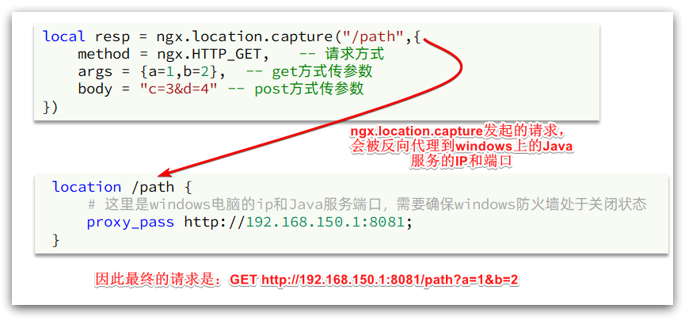

<br>

##### 封装http工具

下面，我们封装一个发送Http请求的工具，基于ngx.location.capture来实现查询tomcat。

1. 添加反向代理，到windows的Java服务

因为item-service中的接口都是/item开头，所以我们监听/item路径，代理到windows上的tomcat服务。

修改 `/usr/local/openresty/nginx/conf/nginx.conf`文件，添加一个location：

```nginx
location /item {
    proxy_pass http://192.168.150.1:8081;
}
```

以后，只要我们调用`ngx.location.capture("/item")`，就一定能发送请求到windows的tomcat服务。

2. 封装工具类

之前我们说过，OpenResty启动时会加载以下两个目录中的工具文件：


所以，自定义的http工具也需要放到这个目录下。

在`/usr/local/openresty/lualib`目录下，新建一个common.lua文件：

```sh
vi /usr/local/openresty/lualib/common.lua
```

内容如下:

```lua
-- 封装函数，发送http请求，并解析响应
local function read_http(path, params)
    local resp = ngx.location.capture(path,{
        method = ngx.HTTP_GET,
        args = params,
    })
    if not resp then
        -- 记录错误信息，返回404
        ngx.log(ngx.ERR, "http请求查询失败, path: ", path , ", args: ", args)
        ngx.exit(404)
    end
    return resp.body
end
-- 将方法导出
local _M = {  
    read_http = read_http
}  
return _M
```

这个工具将read_http函数封装到_M这个table类型的变量中，并且返回，这类似于导出。

使用的时候，可以利用`require('common')`来导入该函数库，这里的common是函数库的文件名。

3. 实现商品查询

最后，我们修改`/usr/local/openresty/lua/item.lua`文件，利用刚刚封装的函数库实现对tomcat的查询：

```lua
-- 引入自定义common工具模块，返回值是common中返回的 _M
local common = require("common")
-- 从 common中获取read_http这个函数
local read_http = common.read_http
-- 获取路径参数
local id = ngx.var[1]
-- 根据id查询商品
local itemJSON = read_http("/item/".. id, nil)
-- 根据id查询商品库存
local itemStockJSON = read_http("/item/stock/".. id, nil)
```

这里查询到的结果是json字符串，并且包含商品、库存两个json字符串，页面最终需要的是把两个json拼接为一个json

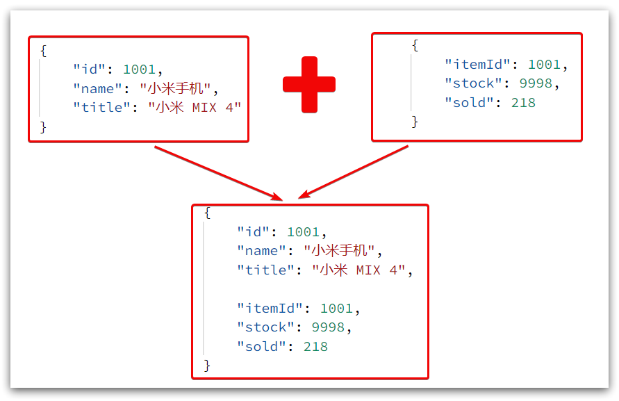

这就需要我们先把JSON变为lua的table，完成数据整合后，再转为JSON。

<br>

##### CJSON工具类

OpenResty提供了一个cjson的模块用来处理JSON的序列化和反序列化。

官方地址： https://github.com/openresty/lua-cjson/

1. 引入cjson模块：

```lua
local cjson = require "cjson"
```

2. 序列化：

```lua
local obj = {
    name = 'jack',
    age = 21
}
-- 把 table 序列化为 json
local json = cjson.encode(obj)
```

3. 反序列化：

```lua
local json = '{"name": "jack", "age": 21}'
-- 反序列化 json为 table
local obj = cjson.decode(json);
print(obj.name)
```

<br>

##### 实现Tomcat查询

下面，我们修改之前的item.lua中的业务，添加json处理功能：

```lua
-- 导入common函数库
local common = require('common')
local read_http = common.read_http
-- 导入cjson库
local cjson = require('cjson')

-- 获取路径参数
local id = ngx.var[1]
-- 根据id查询商品
local itemJSON = read_http("/item/".. id, nil)
-- 根据id查询商品库存
local itemStockJSON = read_http("/item/stock/".. id, nil)

-- JSON转化为lua的table
local item = cjson.decode(itemJSON)
local stock = cjson.decode(stockJSON)

-- 组合数据
item.stock = stock.stock
item.sold = stock.sold

-- 把item序列化为json 返回结果
ngx.say(cjson.encode(item))
```

<br>

##### 基于ID负载均衡

刚才的代码中，我们的tomcat是单机部署。而实际开发中，tomcat一定是集群模式：


因此，OpenResty需要对tomcat集群做负载均衡。

而默认的负载均衡规则是轮询模式，当我们查询/item/10001时：

- 第一次会访问8081端口的tomcat服务，在该服务内部就形成了JVM进程缓存
- 第二次会访问8082端口的tomcat服务，该服务内部没有JVM缓存（因为JVM缓存无法共享），会查询数据库
- ...

你看，因为轮询的原因，第一次查询8081形成的JVM缓存并未生效，直到下一次再次访问到8081时才可以生效，缓存命中率太低了。

怎么办？

如果能让同一个商品，每次查询时都访问同一个tomcat服务，那么JVM缓存就一定能生效了。

也就是说，我们需要根据商品id做负载均衡，而不是轮询。

###### 原理

nginx提供了基于请求路径做负载均衡的算法：

nginx根据请求路径做hash运算，把得到的数值对tomcat服务的数量取余，余数是几，就访问第几个服务，实现负载均衡。

例如：

- 我们的请求路径是 /item/10001
- tomcat总数为2台（8081、8082）
- 对请求路径/item/1001做hash运算求余的结果为1
- 则访问第一个tomcat服务，也就是8081

只要id不变，每次hash运算结果也不会变，那就可以保证同一个商品，一直访问同一个tomcat服务，确保JVM缓存生效。

###### 实现

修改`/usr/local/openresty/nginx/conf/nginx.conf`文件，实现基于ID做负载均衡。

首先，定义tomcat集群，并设置基于路径做负载均衡：

```nginx 
upstream tomcat-cluster {
    hash $request_uri;
    server 192.168.150.1:8081;
    server 192.168.150.1:8082;
}
```

然后，修改对tomcat服务的反向代理，目标指向tomcat集群：

```nginx
location /item {
    proxy_pass http://tomcat-cluster;
}
```

重新加载OpenResty

```sh
nginx -s reload
```

###### 测试

启动两台tomcat服务：


同时启动：

 

清空日志后，再次访问页面，可以看到不同id的商品，访问到了不同的tomcat服务：

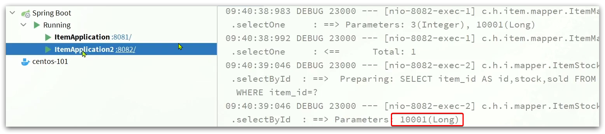


<br>

---

<div STYLE="page-break-after: always;">
    <br>
	<br>
	<br>
	<br>
	<br>
</div>

### 11.4.6	Redis缓存预热

##### 冷启动问题

服务刚刚启动时，Redis 中并没有缓存，如果所有商品数据都在第一次查询时添加缓存，可能会给数据库带来较大压力。

<br>

##### 缓存预热

在实际开发中，我们可以利用大数据统计用户访问的热点数据，在项目启动时将这些热点数据提前查询并保存到Redis中。

<br>

##### 实现 Redis 缓存预热

1. 利用Docker安装Redis

```sh
docker run --name redis -p 6379:6379 -d redis redis-server --appendonly yes
```

2. 在item-service服务中引入Redis依赖

```xml
<dependency>
    <groupId>org.springframework.boot</groupId>
    <artifactId>spring-boot-starter-data-redis</artifactId>
</dependency>
```

3. 配置Redis地址

```yaml
spring:
  redis:
    host: 192.168.150.101
```

4. 编写初始化类，缓存预热需要在项目启动时完成，并且必须是拿到RedisTemplate之后。这里我们利用InitializingBean接口来实现，因为InitializingBean可以在对象被Spring创建并且成员变量全部注入后执行。

```java
package com.heima.item.config;

import com.fasterxml.jackson.core.JsonProcessingException;
import com.fasterxml.jackson.databind.ObjectMapper;
import com.heima.item.pojo.Item;
import com.heima.item.pojo.ItemStock;
import com.heima.item.service.IItemService;
import com.heima.item.service.IItemStockService;
import org.springframework.beans.factory.InitializingBean;
import org.springframework.beans.factory.annotation.Autowired;
import org.springframework.data.redis.core.StringRedisTemplate;
import org.springframework.stereotype.Component;

import java.util.List;

@Component
public class RedisHandler implements InitializingBean {

    @Autowired
    private StringRedisTemplate redisTemplate;

    @Autowired
    private IItemService itemService;
    @Autowired
    private IItemStockService stockService;

    private static final ObjectMapper MAPPER = new ObjectMapper();

    @Override
    public void afterPropertiesSet() throws Exception {
        // 初始化缓存
        // 1.查询商品信息
        List<Item> itemList = itemService.list();
        // 2.放入缓存
        for (Item item : itemList) {
            // 2.1.item序列化为JSON
            String json = MAPPER.writeValueAsString(item);
            // 2.2.存入redis
            redisTemplate.opsForValue().set("item:id:" + item.getId(), json);
        }

        // 3.查询商品库存信息
        List<ItemStock> stockList = stockService.list();
        // 4.放入缓存
        for (ItemStock stock : stockList) {
            // 2.1.item序列化为JSON
            String json = MAPPER.writeValueAsString(stock);
            // 2.2.存入redis
            redisTemplate.opsForValue().set("item:stock:id:" + stock.getId(), json);
        }
    }
}
```

<br>

---

<div STYLE="page-break-after: always;">
    <br>
	<br>
	<br>
	<br>
	<br>
</div>

### 11.4.7	查询 Redis 缓存

##### 查询 Redis 缓存逻辑

现在，Redis 缓存已经准备就绪，我们可以在 OpenResty中实现查询Redis的逻辑了。如下图红框所示：


当请求进入OpenResty之后：

- 优先查询Redis缓存
- 如果Redis缓存未命中，再查询Tomcat

<br>

##### 封装Redis工具

OpenResty提供了操作Redis的模块，我们只要引入该模块就能直接使用。但是为了方便，我们将Redis操作封装到之前的common.lua工具库中。

修改`/usr/local/openresty/lualib/common.lua`文件：

1. 引入Redis模块，并初始化Redis对象

```lua
-- 导入redis
local redis = require('resty.redis')
-- 初始化redis
local red = redis:new()
red:set_timeouts(1000, 1000, 1000)
```

2. 封装函数，用来释放Redis连接，其实是放入连接池

```lua
-- 关闭redis连接的工具方法，其实是放入连接池
local function close_redis(red)
    local pool_max_idle_time = 10000 -- 连接的空闲时间，单位是毫秒
    local pool_size = 100 --连接池大小
    local ok, err = red:set_keepalive(pool_max_idle_time, pool_size)
    if not ok then
        ngx.log(ngx.ERR, "放入redis连接池失败: ", err)
    end
end
```

3. 封装函数，根据key查询Redis数据

```lua
-- 查询redis的方法 ip和port是redis地址，key是查询的key
local function read_redis(ip, port, key)
    -- 获取一个连接
    local ok, err = red:connect(ip, port)
    if not ok then
        ngx.log(ngx.ERR, "连接redis失败 : ", err)
        return nil
    end
    -- 查询redis
    local resp, err = red:get(key)
    -- 查询失败处理
    if not resp then
        ngx.log(ngx.ERR, "查询Redis失败: ", err, ", key = " , key)
    end
    --得到的数据为空处理
    if resp == ngx.null then
        resp = nil
        ngx.log(ngx.ERR, "查询Redis数据为空, key = ", key)
    end
    close_redis(red)
    return resp
end
```

4. 导出

```lua
-- 将方法导出
local _M = {  
    read_http = read_http,
    read_redis = read_redis
}  
return _M
```

完整的common.lua：

```lua
-- 导入redis
local redis = require('resty.redis')
-- 初始化redis
local red = redis:new()
red:set_timeouts(1000, 1000, 1000)

-- 关闭redis连接的工具方法，其实是放入连接池
local function close_redis(red)
    local pool_max_idle_time = 10000 -- 连接的空闲时间，单位是毫秒
    local pool_size = 100 --连接池大小
    local ok, err = red:set_keepalive(pool_max_idle_time, pool_size)
    if not ok then
        ngx.log(ngx.ERR, "放入redis连接池失败: ", err)
    end
end

-- 查询redis的方法 ip和port是redis地址，key是查询的key
local function read_redis(ip, port, key)
    -- 获取一个连接
    local ok, err = red:connect(ip, port)
    if not ok then
        ngx.log(ngx.ERR, "连接redis失败 : ", err)
        return nil
    end
    -- 查询redis
    local resp, err = red:get(key)
    -- 查询失败处理
    if not resp then
        ngx.log(ngx.ERR, "查询Redis失败: ", err, ", key = " , key)
    end
    --得到的数据为空处理
    if resp == ngx.null then
        resp = nil
        ngx.log(ngx.ERR, "查询Redis数据为空, key = ", key)
    end
    close_redis(red)
    return resp
end

-- 封装函数，发送http请求，并解析响应
local function read_http(path, params)
    local resp = ngx.location.capture(path,{
        method = ngx.HTTP_GET,
        args = params,
    })
    if not resp then
        -- 记录错误信息，返回404
        ngx.log(ngx.ERR, "http查询失败, path: ", path , ", args: ", args)
        ngx.exit(404)
    end
    return resp.body
end
-- 将方法导出
local _M = {  
    read_http = read_http,
    read_redis = read_redis
}  
return _M
```

<br>

##### 实现Redis查询

###### 查询逻辑

- 根据id查询Redis
- 如果查询失败则继续查询Tomcat
- 将查询结果返回

###### 步骤

1. 修改`/usr/local/openresty/lua/item.lua`文件，添加一个查询函数：

```lua
-- 导入common函数库
local common = require('common')
local read_http = common.read_http
local read_redis = common.read_redis
-- 封装查询函数
function read_data(key, path, params)
    -- 查询本地缓存
    local val = read_redis("127.0.0.1", 6379, key)
    -- 判断查询结果
    if not val then
        ngx.log(ngx.ERR, "redis查询失败，尝试查询http， key: ", key)
        -- redis查询失败，去查询http
        val = read_http(path, params)
    end
    -- 返回数据
    return val
end
```

2. 而后修改商品查询、库存查询的业务：


3. 完整的item.lua代码：

```lua
-- 导入common函数库
local common = require('common')
local read_http = common.read_http
local read_redis = common.read_redis
-- 导入cjson库
local cjson = require('cjson')

-- 封装查询函数
function read_data(key, path, params)
    -- 查询本地缓存
    local val = read_redis("127.0.0.1", 6379, key)
    -- 判断查询结果
    if not val then
        ngx.log(ngx.ERR, "redis查询失败，尝试查询http， key: ", key)
        -- redis查询失败，去查询http
        val = read_http(path, params)
    end
    -- 返回数据
    return val
end

-- 获取路径参数
local id = ngx.var[1]

-- 查询商品信息
local itemJSON = read_data("item:id:" .. id,  "/item/" .. id, nil)
-- 查询库存信息
local stockJSON = read_data("item:stock:id:" .. id, "/item/stock/" .. id, nil)

-- JSON转化为lua的table
local item = cjson.decode(itemJSON)
local stock = cjson.decode(stockJSON)
-- 组合数据
item.stock = stock.stock
item.sold = stock.sold

-- 把item序列化为json 返回结果
ngx.say(cjson.encode(item))
```

<br>

---

<div STYLE="page-break-after: always;">
    <br>
	<br>
	<br>
	<br>
	<br>
</div>

### 11.4.8	本地缓存API

##### shard dict 功能

OpenResty 为Nginx提供了**shard dict**的功能，可以在nginx的多个 worker 之间共享数据，实现缓存功能。

<br>

##### 开启共享字典

在 nginx.conf 的 http 下添加配置：

```nginx
 # 共享字典，也就是本地缓存，名称叫做：item_cache，大小150m
 lua_shared_dict item_cache 150m; 
```

<br>

##### 操作共享字典

```lua
-- 获取本地缓存对象
local item_cache = ngx.shared.item_cache
-- 存储, 指定key、value、过期时间，单位s，默认为0代表永不过期
item_cache:set('key', 'value', 1000)
-- 读取
local val = item_cache:get('key')
```

<br>

##### 实现本地缓存查询

1. 修改`/usr/local/openresty/lua/item.lua`文件，修改read_data查询函数，添加本地缓存逻辑：

```lua
-- 导入共享词典，本地缓存
local item_cache = ngx.shared.item_cache

-- 封装查询函数
function read_data(key, expire, path, params)
    -- 查询本地缓存
    local val = item_cache:get(key)
    if not val then
        ngx.log(ngx.ERR, "本地缓存查询失败，尝试查询Redis， key: ", key)
        -- 查询redis
        val = read_redis("127.0.0.1", 6379, key)
        -- 判断查询结果
        if not val then
            ngx.log(ngx.ERR, "redis查询失败，尝试查询http， key: ", key)
            -- redis查询失败，去查询http
            val = read_http(path, params)
        end
    end
    -- 查询成功，把数据写入本地缓存
    item_cache:set(key, val, expire)
    -- 返回数据
    return val
end
```

2. 修改item.lua中查询商品和库存的业务，实现最新的read_data函数：


其实就是多了缓存时间参数，过期后nginx缓存会自动删除，下次访问即可更新缓存。

这里给商品基本信息设置超时时间为30分钟，库存为1分钟。

因为库存更新频率较高，如果缓存时间过长，可能与数据库差异较大。

3. 完整的item.lua文件：

```lua
-- 导入common函数库
local common = require('common')
local read_http = common.read_http
local read_redis = common.read_redis
-- 导入cjson库
local cjson = require('cjson')
-- 导入共享词典，本地缓存
local item_cache = ngx.shared.item_cache

-- 封装查询函数
function read_data(key, expire, path, params)
    -- 查询本地缓存
    local val = item_cache:get(key)
    if not val then
        ngx.log(ngx.ERR, "本地缓存查询失败，尝试查询Redis， key: ", key)
        -- 查询redis
        val = read_redis("127.0.0.1", 6379, key)
        -- 判断查询结果
        if not val then
            ngx.log(ngx.ERR, "redis查询失败，尝试查询http， key: ", key)
            -- redis查询失败，去查询http
            val = read_http(path, params)
        end
    end
    -- 查询成功，把数据写入本地缓存
    item_cache:set(key, val, expire)
    -- 返回数据
    return val
end

-- 获取路径参数
local id = ngx.var[1]

-- 查询商品信息
local itemJSON = read_data("item:id:" .. id, 1800,  "/item/" .. id, nil)
-- 查询库存信息
local stockJSON = read_data("item:stock:id:" .. id, 60, "/item/stock/" .. id, nil)

-- JSON转化为lua的table
local item = cjson.decode(itemJSON)
local stock = cjson.decode(stockJSON)
-- 组合数据
item.stock = stock.stock
item.sold = stock.sold

-- 把item序列化为json 返回结果
ngx.say(cjson.encode(item))
```

<br>

---

<div STYLE="page-break-after: always;">
    <br>
	<br>
	<br>
	<br>
	<br>
</div>

## 11.5	缓存同步

### 11.5.1	缓存同步的实现方式

##### 缓存数据同步的常见方式

缓存数据同步的常见方式有三种：

**设置有效期**：给缓存设置有效期，到期后自动删除。再次查询时更新

- 优势：简单、方便
- 缺点：时效性差，缓存过期之前可能不一致
- 场景：更新频率较低，时效性要求低的业务

**同步双写**：在修改数据库的同时，直接修改缓存

- 优势：时效性强，缓存与数据库强一致
- 缺点：有代码侵入，耦合度高；
- 场景：对一致性、时效性要求较高的缓存数据

**异步通知：**修改数据库时发送事件通知，相关服务监听到通知后修改缓存数据

- 优势：低耦合，可以同时通知多个缓存服务
- 缺点：时效性一般，可能存在中间不一致状态
- 场景：时效性要求一般，有多个服务需要同步
- 实现：异步通知可以基于 MQ 或者 Canal 来实现。

<br>

##### 基于MQ的异步通知


解读：

- 商品服务完成对数据的修改后，只需要发送一条消息到MQ中。
- 缓存服务监听MQ消息，然后完成对缓存的更新

依然有少量的代码侵入。

<br>

##### 基于Canal的通知


解读：

- 商品服务完成商品修改后，业务直接结束，没有任何代码侵入
- Canal监听MySQL变化，当发现变化后，立即通知缓存服务
- 缓存服务接收到canal通知，更新缓存

代码零侵入

<br>

---

<div STYLE="page-break-after: always;">
    <br>
	<br>
	<br>
	<br>
	<br>
</div>

### 11.5.2	Canal 概述

##### Canal 简介

**Canal [kə'næl]**，译意为水道/管道/沟渠，canal是阿里巴巴旗下的一款开源项目，基于Java开发。基于数据库增量日志解析，提供增量数据订阅&消费。

##### GitHub 地址

https://github.com/alibaba/canal

<br>

##### Canal 的实现原理

Canal 是基于 mysql 的主从同步来实现的，MySQL 主从同步的原理如下：


- MySQL master 将数据变更写入二进制日志( binary log），其中记录的数据叫做binary log events
- MySQL slave 将 master 的 binary log events拷贝到它的中继日志(relay log)
- MySQL slave 重放 relay log 中事件，将数据变更反映它自己的数据

而Canal就是把自己伪装成MySQL的一个slave节点，从而监听master的binary log变化。再把得到的变化信息通知给Canal的客户端，进而完成对其它数据库的同步。


<br>

---

<div STYLE="page-break-after: always;">
    <br>
	<br>
	<br>
	<br>
	<br>
</div>

### 11.5.3	安装 Canal

##### 开启MySQL主从

Canal是基于MySQL的主从同步功能，因此必须先开启MySQL的主从功能才可以。

这里以之前用Docker运行的mysql为例：

###### 开启binlog

打开 mysql 容器挂载的日志文件，这里在`/tmp/mysql/conf`目录:

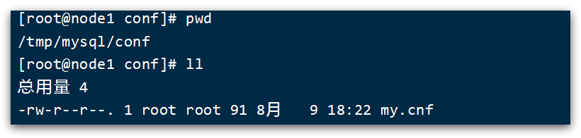

###### 修改文件

```sh
vi /tmp/mysql/conf/my.cnf
```

添加内容：

```ini
log-bin=/var/lib/mysql/mysql-bin
binlog-do-db=heima
```

配置解读：

- `log-bin=/var/lib/mysql/mysql-bin`：设置binary log文件的存放地址和文件名，叫做mysql-bin
- `binlog-do-db=heima`：指定对哪个database记录binary log events，这里记录heima这个库

###### 最终效果

```ini
[mysqld]
skip-name-resolve
character_set_server=utf8
datadir=/var/lib/mysql
server-id=1000
log-bin=/var/lib/mysql/mysql-bin
binlog-do-db=heima
```

<br>

##### 设置用户权限

接下来添加一个仅用于数据同步的账户，出于安全考虑，这里仅提供对heima这个库的操作权限。

```mysql
create user canal@'%' IDENTIFIED by 'canal';
GRANT SELECT, REPLICATION SLAVE, REPLICATION CLIENT,SUPER ON *.* TO 'canal'@'%' identified by 'canal';
FLUSH PRIVILEGES;
```

重启mysql容器即可

```
docker restart mysql
```

测试设置是否成功：在mysql控制台，或者Navicat中，输入命令：

```
show master status;
```

 

<br>

##### 安装Canal

###### 创建网络

我们需要创建一个网络，将MySQL、Canal、MQ放到同一个Docker网络中：

```sh
docker network create heima
```

让mysql加入这个网络：

```sh
docker network connect heima mysql
```

###### 下载镜像压缩包并导入 Docker

下载进行压缩包上传到虚拟机，然后通过命令导入（可以直接使用 Docker pull 命令拉取）：

```
docker load -i canal.tar
```

###### 创建 Canal 容器

运行以下命令创建Canal容器：

```sh
docker run -p 11111:11111 --name canal \
-e canal.destinations=heima \
-e canal.instance.master.address=mysql:3306  \
-e canal.instance.dbUsername=canal  \
-e canal.instance.dbPassword=canal  \
-e canal.instance.connectionCharset=UTF-8 \
-e canal.instance.tsdb.enable=true \
-e canal.instance.gtidon=false  \
-e canal.instance.filter.regex=heima\\..* \
--network heima \
-d canal/canal-server:v1.1.5
```

说明:

- `-p 11111:11111`：这是canal的默认监听端口
- `-e canal.instance.master.address=mysql:3306`：数据库地址和端口，如果不知道mysql容器地址，可以通过`docker inspect 容器id`来查看
- `-e canal.instance.dbUsername=canal`：数据库用户名
- `-e canal.instance.dbPassword=canal` ：数据库密码
- `-e canal.instance.filter.regex=`：要监听的表名称

表名称监听支持的语法：

```
mysql 数据解析关注的表，Perl正则表达式.
多个正则之间以逗号(,)分隔，转义符需要双斜杠(\\) 
常见例子：
1.  所有表：.*   or  .*\\..*
2.  canal schema下所有表： canal\\..*
3.  canal下的以canal打头的表：canal\\.canal.*
4.  canal schema下的一张表：canal.test1
5.  多个规则组合使用然后以逗号隔开：canal\\..*,mysql.test1,mysql.test2 
```

<br>

---

<div STYLE="page-break-after: always;">
    <br>
	<br>
	<br>
	<br>
	<br>
</div>

### 11.5.4	监听 Canal

##### 实现监听 Canal

Canal提供了各种语言的客户端，当Canal监听到binlog变化时，会通知Canal的客户端。


我们可以利用Canal提供的Java客户端，监听Canal通知消息。当收到变化的消息时，完成对缓存的更新。


不过这里我们会使用GitHub上的第三方开源的canal-starter客户端。地址：https://github.com/NormanGyllenhaal/canal-client

与SpringBoot完美整合，自动装配，比官方客户端要简单好用很多。

<br>

##### 步骤

###### 第一步——引入依赖

```xml
<dependency>
    <groupId>top.javatool</groupId>
    <artifactId>canal-spring-boot-starter</artifactId>
    <version>1.2.1-RELEASE</version>
</dependency>
```

###### 第二步——编写配置

```yaml
canal:
  destination: heima # canal的集群名字，要与安装canal时设置的名称一致
  server: 192.168.150.101:11111 # canal服务地址
```

###### 第三步——修改Item实体类

通过@Id、@Column、等注解完成Item与数据库表字段的映射：

```java
package com.heima.item.pojo;

import com.baomidou.mybatisplus.annotation.IdType;
import com.baomidou.mybatisplus.annotation.TableField;
import com.baomidou.mybatisplus.annotation.TableId;
import com.baomidou.mybatisplus.annotation.TableName;
import lombok.Data;
import org.springframework.data.annotation.Id;
import org.springframework.data.annotation.Transient;

import javax.persistence.Column;
import java.util.Date;

@Data
@TableName("tb_item")
public class Item {
    @TableId(type = IdType.AUTO)
    @Id
    private Long id;//商品id
    @Column(name = "name")
    private String name;//商品名称
    private String title;//商品标题
    private Long price;//价格（分）
    private String image;//商品图片
    private String category;//分类名称
    private String brand;//品牌名称
    private String spec;//规格
    private Integer status;//商品状态 1-正常，2-下架
    private Date createTime;//创建时间
    private Date updateTime;//更新时间
    @TableField(exist = false)
    @Transient
    private Integer stock;
    @TableField(exist = false)
    @Transient
    private Integer sold;
}
```

###### 第四步——编写监听器

通过实现`EntryHandler<T>`接口编写监听器，监听Canal消息。注意两点：

- 实现类通过`@CanalTable("tb_item")`指定监听的表信息
- EntryHandler的泛型是与表对应的实体类

```java
package com.heima.item.canal;

import com.github.benmanes.caffeine.cache.Cache;
import com.heima.item.config.RedisHandler;
import com.heima.item.pojo.Item;
import org.springframework.beans.factory.annotation.Autowired;
import org.springframework.stereotype.Component;
import top.javatool.canal.client.annotation.CanalTable;
import top.javatool.canal.client.handler.EntryHandler;

@CanalTable("tb_item")
@Component
public class ItemHandler implements EntryHandler<Item> {

    @Autowired
    private RedisHandler redisHandler;
    @Autowired
    private Cache<Long, Item> itemCache;

    @Override
    public void insert(Item item) {
        // 写数据到JVM进程缓存
        itemCache.put(item.getId(), item);
        // 写数据到redis
        redisHandler.saveItem(item);
    }

    @Override
    public void update(Item before, Item after) {
        // 写数据到JVM进程缓存
        itemCache.put(after.getId(), after);
        // 写数据到redis
        redisHandler.saveItem(after);
    }

    @Override
    public void delete(Item item) {
        // 删除数据到JVM进程缓存
        itemCache.invalidate(item.getId());
        // 删除数据到redis
        redisHandler.deleteItemById(item.getId());
    }
}
```

在这里对Redis的操作都封装到了RedisHandler这个对象中，是我们之前做缓存预热时编写的一个类，内容如下：

```java
package com.heima.item.config;

import com.fasterxml.jackson.core.JsonProcessingException;
import com.fasterxml.jackson.databind.ObjectMapper;
import com.heima.item.pojo.Item;
import com.heima.item.pojo.ItemStock;
import com.heima.item.service.IItemService;
import com.heima.item.service.IItemStockService;
import org.springframework.beans.factory.InitializingBean;
import org.springframework.beans.factory.annotation.Autowired;
import org.springframework.data.redis.core.StringRedisTemplate;
import org.springframework.stereotype.Component;

import java.util.List;

@Component
public class RedisHandler implements InitializingBean {

    @Autowired
    private StringRedisTemplate redisTemplate;

    @Autowired
    private IItemService itemService;
    @Autowired
    private IItemStockService stockService;

    private static final ObjectMapper MAPPER = new ObjectMapper();

    @Override
    public void afterPropertiesSet() throws Exception {
        // 初始化缓存
        // 1.查询商品信息
        List<Item> itemList = itemService.list();
        // 2.放入缓存
        for (Item item : itemList) {
            // 2.1.item序列化为JSON
            String json = MAPPER.writeValueAsString(item);
            // 2.2.存入redis
            redisTemplate.opsForValue().set("item:id:" + item.getId(), json);
        }

        // 3.查询商品库存信息
        List<ItemStock> stockList = stockService.list();
        // 4.放入缓存
        for (ItemStock stock : stockList) {
            // 2.1.item序列化为JSON
            String json = MAPPER.writeValueAsString(stock);
            // 2.2.存入redis
            redisTemplate.opsForValue().set("item:stock:id:" + stock.getId(), json);
        }
    }

    public void saveItem(Item item) {
        try {
            String json = MAPPER.writeValueAsString(item);
            redisTemplate.opsForValue().set("item:id:" + item.getId(), json);
        } catch (JsonProcessingException e) {
            throw new RuntimeException(e);
        }
    }

    public void deleteItemById(Long id) {
        redisTemplate.delete("item:id:" + id);
    }
}
```

<br>

---

<div STYLE="page-break-after: always;">
    <br>
	<br>
	<br>
	<br>
	<br>
</div>
# 12	Hystrix

## 12.1	Hystrix 概述

##### Hystrix 概述

Hystrix 是一个供分布式系统使用，提供延迟和容错功能，保证复杂的分布系统在面临不可避免的失败时，仍能有其弹性。

比如系统中有很多服务，当某些服务不稳定的时候，使用这些服务的用户线程将会阻塞，如果没有隔离机制，系统随时就有可能会挂掉，从而带来很大的风险。SpringCloud使用Hystrix组件提供断路器、资源隔离与自我修复功能。下图表示服务B触发了断路器，阻止了级联失败

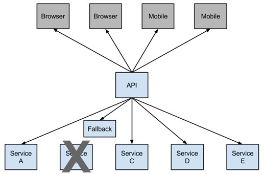

<br>


----

<div STYLE="page-break-after: always;">
    <br>
	<br>
	<br>
	<br>
	<br>
</div>
## 12.2	Hystrix 快速开始

##### 步骤

###### 第一步

在 service 的 pom 中添加依赖

```xml
<!--hystrix依赖，主要是用  @HystrixCommand -->
<dependency>
    <groupId>org.springframework.cloud</groupId>
    <artifactId>spring-cloud-starter-netflix-hystrix</artifactId>
</dependency>
<dependency>
    <groupId>org.springframework.cloud</groupId>
    <artifactId>spring-cloud-starter-netflix-ribbon</artifactId>
</dependency>
<!--服务注册-->
<dependency>
    <groupId>org.springframework.cloud</groupId>
    <artifactId>spring-cloud-starter-alibaba-nacos-discovery</artifactId>
</dependency>
<!--服务调用-->
<dependency>
    <groupId>org.springframework.cloud</groupId>
    <artifactId>spring-cloud-starter-openfeign</artifactId>
</dependency>
```

###### 第二步

在配置文件中添加 hystrix 配置： 

```
#开启熔断机制
feign.hystrix.enabled=true
#设置hystrix超时时间，默认1000ms
hystrix.command.default.execution.isolation.thread.timeoutInMilliseconds=6000
```

###### 第三步

在服务消费者的 client 包里面创建熔断器的实现类

```java
@Component
public class VodFileDegradeFeignClient implements VodClient {
    @Override
    public ResponseResult removeVideo(String videoId) {
        return ResponseResult.error().message("time out");
    }
}
```

###### 第四步

修改服务提供者的  feign 调用接口的 @FeignClient 注解

```java
//修改前
//@FeignClient("service-vod")
//修改后
@FeignClient(name = "service-vod", fallback = VodFileDegradeFeignClient.class)
@Component
public interface xxxClient {

    @DeleteMapping(value = "/eduvod/vod/{videoId}")
    public ResponseResult removeVideo(@PathVariable("videoId") String videoId);
    
}
```

###### 第五步

测试熔断器效果。

---

<div STYLE="page-break-after: always;">
    <br>
	<br>
	<br>
	<br>
	<br>
</div>
# 13	Canal

## 13.1	Canal 概述

##### Canal 简介

canal 是阿里巴巴旗下的一款开源项目，纯 Java 开发。基于数据库增量日志解析，提供增量数据订阅&消费，目前主要支持了 MySQL。

<br>

##### 原理

mysql binlog 技术。

<br>

----

<div STYLE="page-break-after: always;">
    <br>
	<br>
	<br>
	<br>
	<br>
</div>
## 13.2	Canal环境搭建

##### 前提条件

###### 开启 mysql 的 binlog 写入功能。

检查 binlog 功能是否有开启：

```
show variables like 'log_bin'
```

**如果显示状态为OFF表示该功能未开启，开启binlog功能：**

```
1，修改 mysql 的配置文件 my.cnf
vi /etc/my.cnf 
追加内容：
log-bin=mysql-bin     #binlog文件名
binlog_format=ROW     #选择row模式
server_id=1           #mysql实例id,不能和canal的slaveId重复

2，重启 mysql：
service mysql restart	

3，登录 mysql 客户端，查看 log_bin 变量
mysql> show variables like 'log_bin';
+---------------+-------+
| Variable_name | Value |
+---------------+-------+
| log_bin       | ON|
+---------------+-------+
1 row in set (0.00 sec)
————————————————
如果显示状态为ON表示该功能已开启
```

###### 开启MySQL用户的远程访问权限

<br>

##### 下载地址

https://github.com/alibaba/canal/releases

<br>

##### 在 Linux 环境下使用

###### 第一步

放到目录中，解压文件：

```
tar zxvf 【canal版本】
```

###### 第二步

修改配置文件 conf/example/instance.properties： 

```
#需要改成自己的数据库信息
canal.instance.master.address=192.168.44.132:3306
#需要改成自己的数据库用户名与密码
canal.instance.dbUsername=canal
canal.instance.dbPassword=canal
#需要改成同步的数据库表规则，例如只是同步以下表
#canal.instance.filter.regex=.*\\..*
canal.instance.filter.regex=guli_ucenter.ucenter_member
```

- mysql 数据解析关注的表，支持 Perl 正则表达式
- 多个正则之间以逗号(,)分隔，转义符需要双斜杠(\\) ，常见例子：
  1.  所有表：`.*`   or  `.*\\..*`
  2.  canal schema下所有表： canal\\..*
  3.  canal下的以canal打头的表：canal\\.canal.*
  4.  canal schema下的一张表：canal.test1
  5.  多个规则组合使用：canal\\..*,mysql.test1,mysql.test2 (逗号分隔)
  注意：此过滤条件只针对row模式的数据有效(ps. mixed/statement因为不解析sql，所以无法准确提取tableName进行过滤)
- 注意：此过滤条件只针对row模式的数据有效(ps. mixed/statement因为不解析sql，所以无法准确提取tableName进行过滤)

###### 第三步

进入bin目录下启动

```
sh bin/startup.sh
```

<br>

---

<div STYLE="page-break-after: always;">
    <br>
	<br>
	<br>
	<br>
	<br>
</div>

## 13.3	在微服务中使用 Canal

##### 步骤

###### 第一步

创建canal_client模块

###### 第二步

引入相关依赖

```xml
<dependencies>
    <dependency>
        <groupId>org.springframework.boot</groupId>
        <artifactId>spring-boot-starter-web</artifactId>
    </dependency>

    <!--mysql-->
    <dependency>
        <groupId>mysql</groupId>
        <artifactId>mysql-connector-java</artifactId>
    </dependency>

    <dependency>
        <groupId>commons-dbutils</groupId>
        <artifactId>commons-dbutils</artifactId>
    </dependency>

    <dependency>
        <groupId>org.springframework.boot</groupId>
        <artifactId>spring-boot-starter-jdbc</artifactId>
    </dependency>

    <dependency>
        <groupId>com.alibaba.otter</groupId>
        <artifactId>canal.client</artifactId>
    </dependency>
</dependencies>
```

###### 第二步

创建application.properties配置文件：

```
# 服务端口
server.port=10000
# 服务名
spring.application.name=canal-client

# 环境设置：dev、test、prod
spring.profiles.active=dev

# mysql数据库连接
spring.datasource.driver-class-name=com.mysql.cj.jdbc.Driver
spring.datasource.url=jdbc:mysql://localhost:3306/guli?serverTimezone=GMT%2B8
spring.datasource.username=root
spring.datasource.password=root
```

###### 第三步

编写canal客户端类

```
import com.alibaba.otter.canal.client.CanalConnector;
import com.alibaba.otter.canal.client.CanalConnectors;
import com.alibaba.otter.canal.protocol.CanalEntry.*;
import com.alibaba.otter.canal.protocol.Message;
import com.google.protobuf.InvalidProtocolBufferException;
import org.apache.commons.dbutils.DbUtils;
import org.apache.commons.dbutils.QueryRunner;
import org.springframework.stereotype.Component;

import javax.annotation.Resource;
import javax.sql.DataSource;
import java.net.InetSocketAddress;
import java.sql.Connection;
import java.sql.SQLException;
import java.util.Iterator;
import java.util.List;
import java.util.Queue;
import java.util.concurrent.ConcurrentLinkedQueue;

@Component
public class CanalClient {

    //sql队列
    private Queue<String> SQL_QUEUE = new ConcurrentLinkedQueue<>();

    @Resource
    private DataSource dataSource;

    /**
     * canal入库方法
     */
    public void run() {

        CanalConnector connector = CanalConnectors.newSingleConnector(new InetSocketAddress("192.168.44.132",
                11111), "example", "", "");
        int batchSize = 1000;
        try {
            connector.connect();
            connector.subscribe(".*\\..*");
            connector.rollback();
            try {
                while (true) {
                    //尝试从master那边拉去数据batchSize条记录，有多少取多少
                    Message message = connector.getWithoutAck(batchSize);
                    long batchId = message.getId();
                    int size = message.getEntries().size();
                    if (batchId == -1 || size == 0) {
                        Thread.sleep(1000);
                    } else {
                        dataHandle(message.getEntries());
                    }
                    connector.ack(batchId);

                    //当队列里面堆积的sql大于一定数值的时候就模拟执行
                    if (SQL_QUEUE.size() >= 1) {
                        executeQueueSql();
                    }
                }
            } catch (InterruptedException e) {
                e.printStackTrace();
            } catch (InvalidProtocolBufferException e) {
                e.printStackTrace();
            }
        } finally {
            connector.disconnect();
        }
    }

    /**
     * 模拟执行队列里面的sql语句
     */
    public void executeQueueSql() {
        int size = SQL_QUEUE.size();
        for (int i = 0; i < size; i++) {
            String sql = SQL_QUEUE.poll();
            System.out.println("[sql]----> " + sql);

            this.execute(sql.toString());
        }
    }

    /**
     * 数据处理
     *
     * @param entrys
     */
    private void dataHandle(List<Entry> entrys) throws InvalidProtocolBufferException {
        for (Entry entry : entrys) {
            if (EntryType.ROWDATA == entry.getEntryType()) {
                RowChange rowChange = RowChange.parseFrom(entry.getStoreValue());
                EventType eventType = rowChange.getEventType();
                if (eventType == EventType.DELETE) {
                    saveDeleteSql(entry);
                } else if (eventType == EventType.UPDATE) {
                    saveUpdateSql(entry);
                } else if (eventType == EventType.INSERT) {
                    saveInsertSql(entry);
                }
            }
        }
    }

    /**
     * 保存更新语句
     *
     * @param entry
     */
    private void saveUpdateSql(Entry entry) {
        try {
            RowChange rowChange = RowChange.parseFrom(entry.getStoreValue());
            List<RowData> rowDatasList = rowChange.getRowDatasList();
            for (RowData rowData : rowDatasList) {
                List<Column> newColumnList = rowData.getAfterColumnsList();
                StringBuffer sql = new StringBuffer("update " + entry.getHeader().getTableName() + " set ");
                for (int i = 0; i < newColumnList.size(); i++) {
                    sql.append(" " + newColumnList.get(i).getName()
                            + " = '" + newColumnList.get(i).getValue() + "'");
                    if (i != newColumnList.size() - 1) {
                        sql.append(",");
                    }
                }
                sql.append(" where ");
                List<Column> oldColumnList = rowData.getBeforeColumnsList();
                for (Column column : oldColumnList) {
                    if (column.getIsKey()) {
                        //暂时只支持单一主键
                        sql.append(column.getName() + "=" + column.getValue());
                        break;
                    }
                }
                SQL_QUEUE.add(sql.toString());
            }
        } catch (InvalidProtocolBufferException e) {
            e.printStackTrace();
        }
    }

    /**
     * 保存删除语句
     *
     * @param entry
     */
    private void saveDeleteSql(Entry entry) {
        try {
            RowChange rowChange = RowChange.parseFrom(entry.getStoreValue());
            List<RowData> rowDatasList = rowChange.getRowDatasList();
            for (RowData rowData : rowDatasList) {
                List<Column> columnList = rowData.getBeforeColumnsList();
                StringBuffer sql = new StringBuffer("delete from " + entry.getHeader().getTableName() + " where ");
                for (Column column : columnList) {
                    if (column.getIsKey()) {
                        //暂时只支持单一主键
                        sql.append(column.getName() + "=" + column.getValue());
                        break;
                    }
                }
                SQL_QUEUE.add(sql.toString());
            }
        } catch (InvalidProtocolBufferException e) {
            e.printStackTrace();
        }
    }

    /**
     * 保存插入语句
     *
     * @param entry
     */
    private void saveInsertSql(Entry entry) {
        try {
            RowChange rowChange = RowChange.parseFrom(entry.getStoreValue());
            List<RowData> rowDatasList = rowChange.getRowDatasList();
            for (RowData rowData : rowDatasList) {
                List<Column> columnList = rowData.getAfterColumnsList();
                StringBuffer sql = new StringBuffer("insert into " + entry.getHeader().getTableName() + " (");
                for (int i = 0; i < columnList.size(); i++) {
                    sql.append(columnList.get(i).getName());
                    if (i != columnList.size() - 1) {
                        sql.append(",");
                    }
                }
                sql.append(") VALUES (");
                for (int i = 0; i < columnList.size(); i++) {
                    sql.append("'" + columnList.get(i).getValue() + "'");
                    if (i != columnList.size() - 1) {
                        sql.append(",");
                    }
                }
                sql.append(")");
                SQL_QUEUE.add(sql.toString());
            }
        } catch (InvalidProtocolBufferException e) {
            e.printStackTrace();
        }
    }

    /**
     * 入库
     * @param sql
     */
    public void execute(String sql) {
        Connection con = null;
        try {
            if(null == sql) return;
            con = dataSource.getConnection();
            QueryRunner qr = new QueryRunner();
            int row = qr.execute(con, sql);
            System.out.println("update: "+ row);
        } catch (SQLException e) {
            e.printStackTrace();
        } finally {
            DbUtils.closeQuietly(con);
        }
    }
}
```

###### 第四步

创建启动类：

```
@SpringBootApplication
public class CanalApplication implements CommandLineRunner {
    @Resource
    private CanalClient canalClient;

    public static void main(String[] args) {
        SpringApplication.run(CanalApplication.class, args);
    }

    @Override
    public void run(String... strings) throws Exception {
        //项目启动，执行canal客户端监听
        canalClient.run();
    }
}
```

<br>

---

<div STYLE="page-break-after: always;">
    <br>
	<br>
	<br>
	<br>
	<br>
</div>
# 14	Spring Security

## 14.1	Spring Security 概述

##### 简介

Spring Security 基于 Spring 框架，提供了一套 Web 应用安全性的完整解决方案。

<br>

##### Web 应用的安全性

一般来说，Web 应用的安全性包括 **用户认证（Authentication）**和**用户授权（Authorization）**两个部分：

- 用户认证：验证某个用户是否为系统中的合法主体，也就是说用户能否访问该系统。用户认证一般要求用户提供用户名和密码。系统通过校验用户名和密码来完成认证过程。
- 用户授权：指的是验证某个用户是否有权限执行某个操作。在一个系统中，不同用户所具有的权限是不同的。比如对一个文件来说，有的用户只能进行读取，而有的用户可以进行修改。一般来说，系统会为不同的用户分配不同的角色，而每个角色则对应一系列的权限。

<br>

##### Spring Security 的实现原理

Spring Security 其实就是用 filter，对请求的路径进行过滤。

###### 基于 session 实现

如果是基于 Session，那么 Spring-security 会对 cookie 里的 sessionid 进行解析，找到服务器存储的 sesion 信息，然后判断当前用户是否符合请求的要求。

###### 基于 token实现

如果系统的模块众多，每个模块都需要就行授权与认证，那就选择基于 token 的形式进行授权与认证，用户根据用户名密码认证成功，然后获取当前用户角色的一系列权限值，并以用户名为 key，权限列表为 value 的形式**存入 redis 缓存中**，根据用户名相关信息生成 token 返回，浏览器将 token 记录到 cookie 中，每次调用 api 接口都默认将 token 携带到 header 请求头中，Spring-security 解析 header 头获取 token 信息，解析 token 获取当前用户名，根据用户名就可以从 redis 中获取权限列表，这样 Spring-security 就能够判断当前请求是否有权限访问。

<br>

##### 依赖

```
    <!-- Spring Security依赖 -->
    <dependency>
        <groupId>org.springframework.boot</groupId>
        <artifactId>spring-boot-starter-security</artifactId>
    </dependency>
```

<br>

##### Spring Security 与 Spring Cloud Gateway

Spring Security 可以与 Spring Cloud Gateway整合在同一个微服务模块中。

<br>

----

<div STYLE="page-break-after: always;">
    <br>
	<br>
	<br>
	<br>
	<br>
</div>
## 14.2	Spring security 核心配置类

##### 创建 Spring Security 的核心配置类

Spring Security 的核心配置类需要加上 `@EnableWebSecurity` 注解，并继承 `WebSecurityConfigurerAdapter`

```
@Configuration
@EnableWebSecurity
@EnableGlobalMethodSecurity(prePostEnabled = true)
public class TokenWebSecurityConfig extends WebSecurityConfigurerAdapter {
	...
}
```

<br>

##### 例——spring security配置类

```java
/**
 * <p>
 * Security配置类
 * </p>
 */
@Configuration
@EnableWebSecurity
@EnableGlobalMethodSecurity(prePostEnabled = true)
public class TokenWebSecurityConfig extends WebSecurityConfigurerAdapter {

    private UserDetailsService userDetailsService;
    private TokenManager tokenManager;
    private DefaultPasswordEncoder defaultPasswordEncoder;
    private RedisTemplate redisTemplate;

    @Autowired
    public TokenWebSecurityConfig(UserDetailsService userDetailsService, DefaultPasswordEncoder defaultPasswordEncoder,
                                  TokenManager tokenManager, RedisTemplate redisTemplate) {
        this.userDetailsService = userDetailsService;
        this.defaultPasswordEncoder = defaultPasswordEncoder;
        this.tokenManager = tokenManager;
        this.redisTemplate = redisTemplate;
    }

    /**
     * 配置设置
     * @param http
     * @throws Exception
     */
    @Override
    protected void configure(HttpSecurity http) throws Exception {
        http.exceptionHandling()
                .authenticationEntryPoint(new UnauthorizedEntryPoint())
                .and().csrf().disable()
                .authorizeRequests()
                .anyRequest().authenticated()
                .and().logout().logoutUrl("/admin/acl/index/logout")
                .addLogoutHandler(new TokenLogoutHandler(tokenManager,redisTemplate)).and()
                .addFilter(new TokenLoginFilter(authenticationManager(), tokenManager, redisTemplate))
                .addFilter(new TokenAuthenticationFilter(authenticationManager(), tokenManager, redisTemplate)).httpBasic();
    }

    /**
     * 密码处理
     * @param auth
     * @throws Exception
     */
    @Override
    public void configure(AuthenticationManagerBuilder auth) throws Exception {
        auth.userDetailsService(userDetailsService).passwordEncoder(defaultPasswordEncoder);
    }

    /**
     * 配置哪些请求不拦截
     * @param web
     * @throws Exception
     */
    @Override
    public void configure(WebSecurity web) throws Exception {
        web.ignoring().antMatchers("/api/**",
                "/swagger-resources/**", "/webjars/**", "/v2/**", "/swagger-ui.html/**"
               );
    }
}
```

<br>

---

<div STYLE="page-break-after: always;">
    <br>
	<br>
	<br>
	<br>
	<br>
</div>
# 附录

##### 最后编辑时间

- 0000/00/00

##### 环境

- 

##### 参考资料

- 

##### 扩展资料

- 


