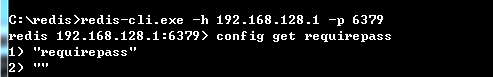
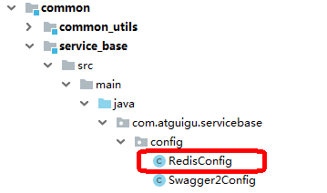

# 1	概述


## 1.1	Redis 简介

##### 什么是 Redis

Redis 是当前比较热门的 NOSQL 系统之一，它是一个开源的使用 ANSI c 语言编写的 key-value 存储系统（区别于 MySQL 的二维表格的形式存储。）。和 Memcache[^1.1-1] 类似，但很大程度补偿了 Memcache 的不足。和 Memcache 一样，Redis 数据都是缓存在计算机内存中，不同的是，Memcache 只能将数据缓存到内存中，无法自动定期写入硬盘，这就表示，一断电或重启，内存清空，数据丢失。所以 Memcache 的应用场景适用于缓存无需持久化的数据。而 Redis 不同的是它会周期性的把更新的数据写入磁盘或者把修改操作写入追加的记录文件，实现数据的持久化。

<br>

##### Redis的特点

- Redis 读取的速度是110000次/s，写的速度是81000次/s；
- 原子 。Redis的所有操作都是原子性的，同时Redis还支持对几个操作全并后的原子性执行。
- 支持多种数据结构：string（字符串）；list（列表）；hash（哈希），set（集合）；zset(有序集合)
- 持久化，集群部署
- 支持过期时间，支持事务，消息订阅

<br>

----

[^1.1-1]: **memcache** 是一套分布式的高速缓存系统，由 LiveJournal 的 Brad Fitzpatrick 开发，但目前被许多网站使用以提升网站的访问速度，尤其对于一些大型的、需要频繁访问数据库的网站访问速度提升效果十分显著。


<div STYLE="page-break-after: always;">
    <br>
    <br>
    <br>
    <br>
    <br></div>
## 1.2	安装 Redis

### 1.2.1	在 Linux 上安装

##### 步骤

###### 第一步

将 redis.tar.gz 上传到 Linux 主机上

###### 第二步

解压缩：

```
tar -xvf redis-6.2.6.tar.gz
```

###### 第三步

进入redis目录：

```sh
cd redis-6.2.6
```

###### 第四步

运行编译命令：

```sh
make && make install
```

<br>

##### 修改配置

修改配置文件 redis.conf

```properties
# 绑定地址，默认是127.0.0.1，会导致只能在本地访问。修改为0.0.0.0则可以在任意IP访问
bind 0.0.0.0
# 数据库数量，设置为1
databases 1
```

<br>

##### 启动Redis

```sh
redis-server redis.conf
```

<br>

##### 停止redis服务

```sh
redis-cli shutdown
```

<br>

##### 打开 redis 客户端

进入 redis 根目录，输入下列命令：

```
redis-cli
```

<br>

##### 设置密码

第一种，直接修改配置文件，打开redis.conf文件，找到#requirepass foorbared这一行，直接替换掉这行，改为requirepass 密码就可以了。

第二种就是运行中修改，开启 redis 客户端。输入config get requirepass。这里可以看见对应的密码为空在初始的情况下。



然后输入

```
config set requirepass 【密码】
```

键入之后可能报错。在键入 `auth 密码`。这样密码就设置完成了。

<br>

---

<div STYLE="page-break-after: always;">
    <br>
    <br>
    <br>
    <br>
    <br></div>
### 1.2.2	在 windows 上安装

##### 下载地址

https://github.com/tporadowski/redis/releases。

<br>

##### 安装

下载完成后解压到英文目录下。

<br>

##### 开启 redis 服务

在 redis 根目录下打开 cmd 窗口，输入以下指令

```
redis-server.exe redis.windows.conf
```

另启一个 cmd 窗口，原来的不要关闭，不然就无法访问服务端了。

切换到 redis 目录下运行:

```
redis-cli.exe -h 【端口号】 -p 6379
redis-cli.exe -h 8.131.72.52 -p 6379
```

<br>

---

<div STYLE="page-break-after: always;">
    <br>
    <br>
    <br>
    <br>
    <br></div>

## 1.3	在 Spring Boot 中集成 Redis

##### 步骤

###### 第一步

在 common 模块添加依赖，由于 redis 缓存是公共应用，所以我们把依赖与配置添加到了 common 模块下面，在 common 模块 pom.xml 下添加以下依赖：

```xml
<!-- redis -->
<dependency>
    <groupId>org.springframework.boot</groupId>
    <artifactId>spring-boot-starter-data-redis</artifactId>
</dependency>

<!-- spring2.X集成redis所需common-pool2-->
<dependency>
    <groupId>org.apache.commons</groupId>
    <artifactId>commons-pool2</artifactId>
    <version>2.6.0</version>
</dependency>
```

###### 第二步

在 service-base 模块添加 redis 配置类：



```java
@EnableCaching
@Configuration
public class RedisConfig extends CachingConfigurerSupport {

    @Bean
    public RedisTemplate<String, Object> redisTemplate(RedisConnectionFactory factory) {
        RedisTemplate<String, Object> template = new RedisTemplate<>();
        RedisSerializer<String> redisSerializer = new StringRedisSerializer();
        Jackson2JsonRedisSerializer jackson2JsonRedisSerializer = new Jackson2JsonRedisSerializer(Object.class);
        ObjectMapper om = new ObjectMapper();
        om.setVisibility(PropertyAccessor.ALL, JsonAutoDetect.Visibility.ANY);
        om.enableDefaultTyping(ObjectMapper.DefaultTyping.NON_FINAL);
        jackson2JsonRedisSerializer.setObjectMapper(om);
        template.setConnectionFactory(factory);
        //key序列化方式
        template.setKeySerializer(redisSerializer);
        //value序列化
        template.setValueSerializer(jackson2JsonRedisSerializer);
        //value hashmap序列化
        template.setHashValueSerializer(jackson2JsonRedisSerializer);
        return template;
    }

    @Bean
    public CacheManager cacheManager(RedisConnectionFactory factory) {
        RedisSerializer<String> redisSerializer = new StringRedisSerializer();
        Jackson2JsonRedisSerializer jackson2JsonRedisSerializer = new Jackson2JsonRedisSerializer(Object.class);
        //解决查询缓存转换异常的问题
        ObjectMapper om = new ObjectMapper();
        om.setVisibility(PropertyAccessor.ALL, JsonAutoDetect.Visibility.ANY);
        om.enableDefaultTyping(ObjectMapper.DefaultTyping.NON_FINAL);
        jackson2JsonRedisSerializer.setObjectMapper(om);
        // 配置序列化（解决乱码的问题）,过期时间600秒
        RedisCacheConfiguration config = RedisCacheConfiguration.defaultCacheConfig()
                .entryTtl(Duration.ofSeconds(600))
              .serializeKeysWith(RedisSerializationContext.SerializationPair.fromSerializer(redisSerializer))
                .serializeValuesWith(RedisSerializationContext.SerializationPair.fromSerializer(jackson2JsonRedisSerializer))
                .disableCachingNullValues();
        RedisCacheManager cacheManager = RedisCacheManager.builder(factory)
                .cacheDefaults(config)
                .build();
        return cacheManager;
    }
}
```

###### 第三步

在配置文件中添加 redis 配置：

```properties
spring.redis.host=【host 地址】
spring.redis.port=【端口号】
spring.redis.database= 0
spring.redis.timeout=1800000

spring.redis.lettuce.pool.max-active=20
spring.redis.lettuce.pool.max-wait=-1
#最大阻塞等待时间(负数表示没限制)
spring.redis.lettuce.pool.max-idle=5
spring.redis.lettuce.pool.min-idle=0
```

###### 第四步

在现需要进行缓存的接口上添加 Redis 注解。

<br>

##### @Cacheable

根据方法对其返回结果进行缓存，下次请求时，如果缓存存在，则直接读取缓存数据返回；如果缓存不存在，则执行方法，并把返回的结果存入缓存中。**一般用在查询方法上**。

属性值如下：

| **属性/方法名** | **解释**                                         |
| --------------- | ------------------------------------------------ |
| value           | 缓存名，必填，它指定了你的缓存存放在哪块命名空间 |
| cacheNames      | 与 value 差不多，二选一即可                      |
| key             | 可选属性，可以使用 SpEL 标签自定义缓存的key      |

<br>

##### @CachePut

使用该注解标志的方法，每次都会执行，并将结果存入指定的缓存中。其他方法可以直接从响应的缓存中读取缓存数据，而不需要再去查询数据库。**一般用在新增方法上**。

属性值如下：

| **属性/方法名** | **解释**                                         |
| --------------- | ------------------------------------------------ |
| value           | 缓存名，必填，它指定了你的缓存存放在哪块命名空间 |
| cacheNames      | 与 value 差不多，二选一即可                      |
| key             | 可选属性，可以使用 SpEL 标签自定义缓存的key      |

<br>

##### @CacheEvict

使用该注解标志的方法，会清空指定的缓存。**一般用在更新或者删除方法上**。

查看源码，属性值如下：

| **属性/方法名**  | **解释**                                                     |
| ---------------- | ------------------------------------------------------------ |
| value            | 缓存名，必填，它指定了你的缓存存放在哪块命名空间             |
| cacheNames       | 与 value 差不多，二选一即可                                  |
| key              | 可选属性，可以使用 SpEL 标签自定义缓存的key                  |
| allEntries       | 是否清空所有缓存，默认为 false。如果指定为 true，则方法调用后将立即清空所有的缓存 |
| beforeInvocation | 是否在方法执行前就清空，默认为 false。如果指定为 true，则在方法执行前就会清空缓存 |

<br>

---

<div STYLE="page-break-after: always;">
    <br>
    <br>
    <br>
    <br>
    <br></div>
