## 使用 IDEA 创建 Java Web 项目

###### 第一步——创建 Maven 项目

略。

###### 第二步——添加 Web 支持

右键项目，选择 add framework support：

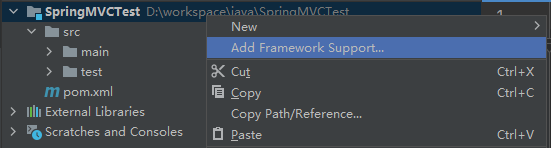

勾选 Web Application：

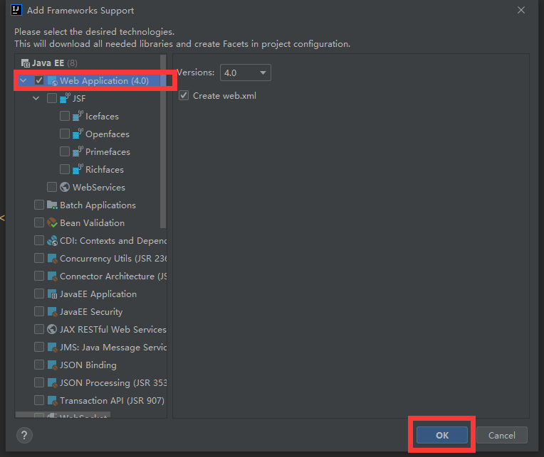

###### 第三步——完善项目结构

在 web/WEB-INF 文件夹下创建 classes 和 lib 文件夹：

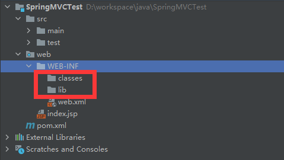

###### 第四步——修改 Output path

打开 Project Structure：

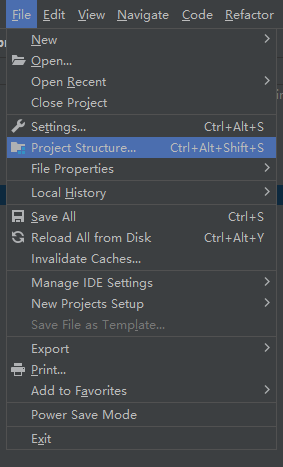

打开 Modules → Paths，修改 Output path 为 wen/WEN-INF/classes：

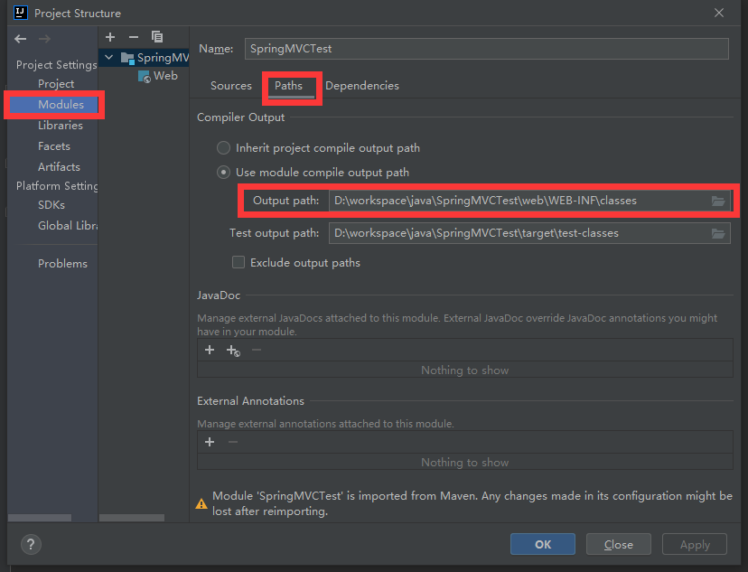

###### 第五步——修改 jar Directory

打开 Modules → Dependencies → + JARs or Directories：

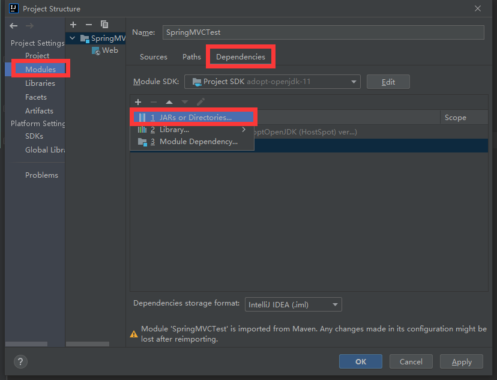

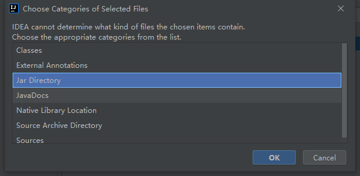

勾选并接受：

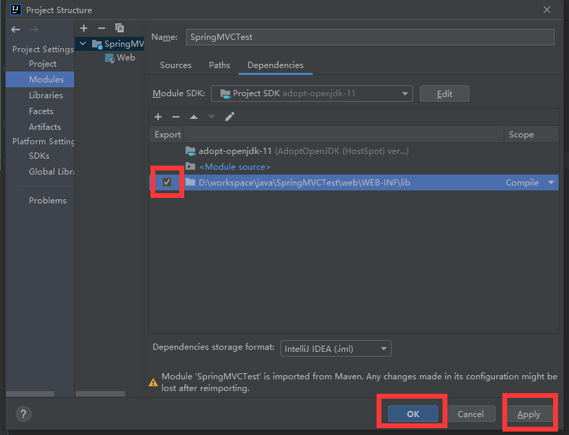

###### 第六步——配置 Web 容器

打开 Run/Debug Configurations：

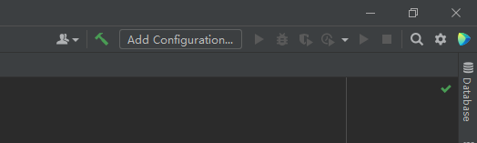

添加本地 Tomcat 容器：

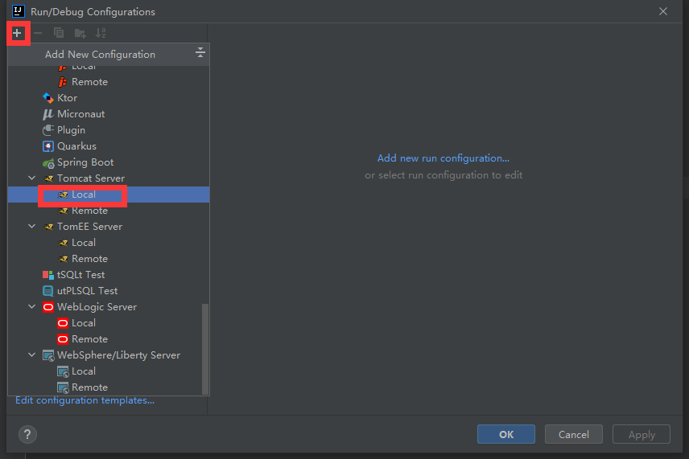

配置容器：

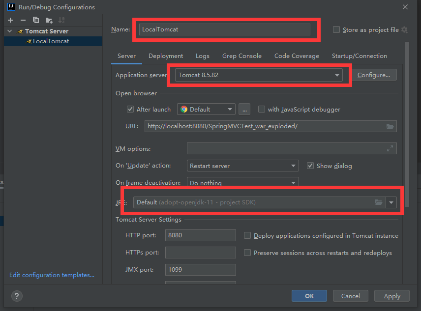

添加 artifact（Project Structure → + → Web Application exploded  → from Modules）：

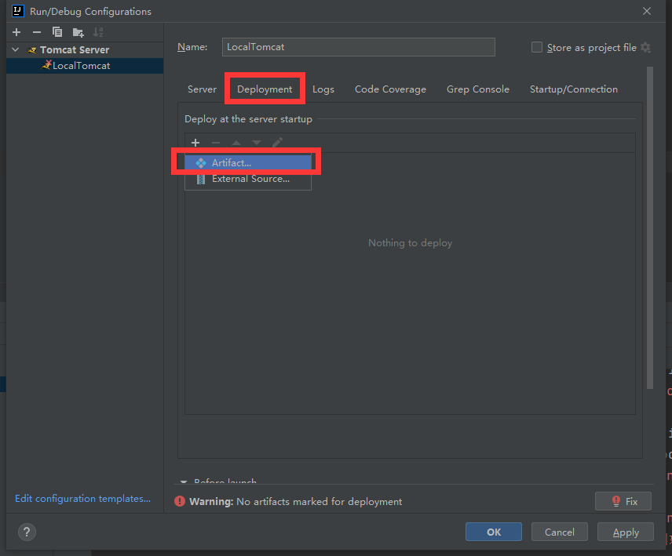

 

##### 参考文章地址

https://blog.csdn.net/mongchu/article/details/118198222